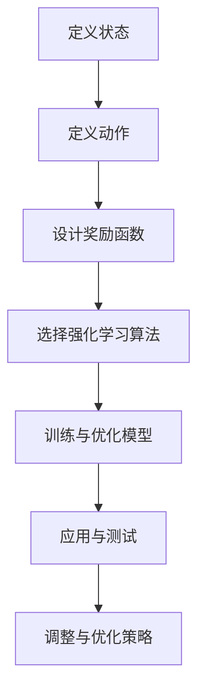
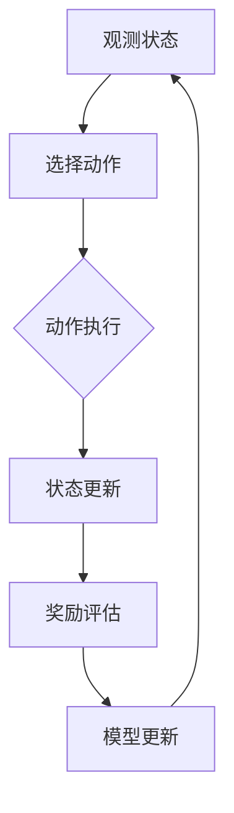

                 

## 文章标题

### 强化学习在智能家居能源管理效率优化中的实现

在现代社会，随着科技的发展和人们生活水平的提高，智能家居系统逐渐成为家庭生活的重要组成部分。然而，如何有效地管理家庭能源，提高能源利用效率，减少能源浪费，成为了智能家居系统亟待解决的问题。强化学习作为一种先进的机器学习算法，在能源管理效率优化中展示出了巨大的潜力。本文将围绕强化学习在智能家居能源管理效率优化中的实现进行探讨，以期为相关领域的研究和应用提供参考。

### 关键词

- 强化学习
- 智能家居
- 能源管理
- 效率优化

### 摘要

本文首先介绍了强化学习的基本概念及其在智能家居能源管理中的应用背景。接着，详细阐述了强化学习算法在智能家居能源管理中的实现原理，包括环境构建、状态空间定义、动作空间定义、奖励函数设计等。然后，通过一个实际项目案例，展示了如何利用强化学习算法进行智能家居能源管理效率优化。最后，分析了强化学习在智能家居能源管理中的实际应用场景，并提出了未来发展的趋势与挑战。

## 1. 背景介绍

### 智能家居的发展

随着物联网（IoT）技术的迅速发展，智能家居市场呈现出蓬勃发展的态势。智能家居系统通过将各种家庭设备和家电连接到互联网，实现了对家庭环境的智能化控制和自动化管理。用户可以通过智能手机、平板电脑等移动设备，随时随地远程控制家中的设备，提高生活质量和工作效率。

### 能源管理的重要性

能源管理是智能家居系统中的一个重要环节。随着全球能源需求的不断增长，如何高效地利用能源，减少能源浪费，成为了亟待解决的问题。智能家居系统通过智能传感器和自动化控制系统，可以实时监测家庭能源消耗情况，优化能源使用策略，提高能源利用效率，降低家庭能源成本。

### 强化学习在智能系统中的应用

强化学习（Reinforcement Learning，RL）是一种通过试错来学习如何在不同环境中获得最大化收益的机器学习算法。强化学习在智能系统中的应用非常广泛，包括自动驾驶、游戏AI、机器人控制等。在智能家居系统中，强化学习可以通过自主学习家庭能源消耗模式，优化能源使用策略，提高能源管理效率。

## 2. 核心概念与联系

### 强化学习基本概念

强化学习由三个核心组成部分：环境（Environment）、代理（Agent）和奖励函数（Reward Function）。

- 环境：描述了代理所处的状态和动作集合，以及状态转移和奖励分配。
- 代理：通过选择动作来与环境互动，以最大化累积奖励。
- 奖励函数：定义了代理在不同状态和动作下的奖励值。

### 智能家居能源管理中的强化学习架构

在智能家居能源管理中，强化学习架构主要包括以下组件：

- 智能家居环境：模拟家庭能源消耗和设备状态。
- 智能家居代理：利用强化学习算法优化能源使用策略。
- 奖励函数：定义能源管理目标，如降低能源消耗、减少电费支出等。

### 强化学习在智能家居能源管理中的实现流程

1. 状态定义：确定智能家居环境中的状态变量，如室内温度、湿度、设备使用情况等。
2. 动作定义：确定智能家居代理可以执行的动作，如调整空调温度、开启/关闭电器等。
3. 奖励函数设计：定义奖励函数，以衡量能源管理效果。
4. 强化学习算法选择：选择合适的强化学习算法，如Q-learning、SARSA、Deep Q-Network等。
5. 模型训练与优化：利用历史数据训练模型，不断调整优化策略。

### Mermaid 流程图

以下是一个简化的强化学习在智能家居能源管理中的实现流程图：



## 3. 核心算法原理 & 具体操作步骤

### Q-learning算法原理

Q-learning是一种基于值迭代的强化学习算法，其核心思想是利用一个值函数（Q函数）来估计状态-动作值。Q-learning算法通过不断地更新Q函数的估计值，使得代理能够学习到最优的动作策略。

### Q-learning算法具体操作步骤

1. 初始化Q值：初始化所有状态-动作的Q值，通常设置为0。
2. 选择动作：在当前状态下，选择一个动作，可以采用贪心策略，选择使Q值最大的动作。
3. 执行动作：执行选定的动作，并观察环境反馈。
4. 更新Q值：根据观察到的奖励值和下一状态，更新当前状态-动作的Q值。
5. 重复步骤2-4，直到满足停止条件（如达到指定步数或找到最优策略）。

### 案例分析

假设一个智能家居系统，需要优化空调的使用，以降低能源消耗。状态变量为室内温度，动作变量为空调的温度调节。奖励函数为空调的能耗，能耗越低，奖励值越高。

1. 初始化Q值：将所有状态-动作的Q值初始化为0。
2. 选择动作：当前室内温度为25℃，空调设定温度为24℃。根据贪心策略，选择使Q值最大的动作，即调整空调温度到23℃。
3. 执行动作：将空调温度调整为23℃。
4. 更新Q值：观察环境反馈，当前室内温度下降到22℃，空调能耗降低，奖励值为+1。更新当前状态-动作的Q值为1。
5. 重复步骤2-4，不断调整空调温度，直到找到最优策略。

通过上述步骤，智能家居代理能够学习到在不同室内温度下，调整空调温度的最优策略，从而降低能源消耗。

## 4. 数学模型和公式 & 详细讲解 & 举例说明

### Q-learning算法数学模型

Q-learning算法的核心是Q函数，定义了在特定状态下选择特定动作的预期回报。Q函数的更新公式如下：

$$
Q(s, a) \leftarrow Q(s, a) + \alpha [r + \gamma \max_{a'} Q(s', a') - Q(s, a)]
$$

其中：
- $Q(s, a)$：在状态$s$下执行动作$a$的Q值。
- $r$：立即奖励。
- $\gamma$：折扣因子，表示对未来奖励的重视程度。
- $\alpha$：学习率，表示对旧策略的依赖程度。
- $s'$：执行动作$a$后的状态。
- $a'$：在状态$s'$下选择的最优动作。

### 奖励函数设计

奖励函数是强化学习在智能家居能源管理中的关键组成部分，直接影响学习效果。以下是一个简化的奖励函数设计：

$$
R(s, a) = 
\begin{cases} 
+1 & \text{if } \text{energy\_consumption}(s, a) < \text{energy\_consumption}(s, a_{\text{previous}}) \\
-1 & \text{if } \text{energy\_consumption}(s, a) > \text{energy\_consumption}(s, a_{\text{previous}}) 
\end{cases}
$$

其中：
- $R(s, a)$：在状态$s$下执行动作$a$的奖励值。
- $\text{energy\_consumption}(s, a)$：在状态$s$下执行动作$a$时的能源消耗。
- $\text{energy\_consumption}(s, a_{\text{previous}})$：在状态$s$下执行上一个动作时的能源消耗。

### 举例说明

假设一个智能家居系统，需要在室内温度为25℃时，调整空调温度以降低能源消耗。状态变量为室内温度，动作变量为空调温度调节。学习率$\alpha$为0.1，折扣因子$\gamma$为0.9。

初始Q值矩阵为：

$$
Q = \begin{bmatrix}
0 & 0 & 0 \\
0 & 0 & 0 \\
0 & 0 & 0
\end{bmatrix}
$$

假设当前室内温度为25℃，空调设定温度为24℃。根据奖励函数，选择使Q值最大的动作，即调整空调温度到23℃。执行动作后，观察到室内温度下降到22℃，空调能耗降低，奖励值为+1。根据Q-learning算法更新Q值矩阵：

$$
Q = \begin{bmatrix}
0 & 0 & 0.1 \\
0 & 0 & 0 \\
0 & 0 & 0
\end{bmatrix}
$$

重复上述步骤，不断调整空调温度，直到找到最优策略。

## 5. 项目实战：代码实际案例和详细解释说明

### 5.1 开发环境搭建

在开始项目实战之前，我们需要搭建一个适合强化学习算法开发的编程环境。以下是一个基本的Python开发环境搭建步骤：

1. 安装Python：从官方网站下载并安装Python 3.x版本。
2. 安装PyTorch：通过pip命令安装PyTorch库，命令如下：

   ```bash
   pip install torch torchvision
   ```

3. 安装其他依赖库：安装一些常用的Python库，如numpy、matplotlib等，命令如下：

   ```bash
   pip install numpy matplotlib
   ```

### 5.2 源代码详细实现和代码解读

以下是一个简化的强化学习在智能家居能源管理中的实现代码，使用Q-learning算法优化空调温度调节。

```python
import numpy as np
import matplotlib.pyplot as plt

# 初始化参数
alpha = 0.1
gamma = 0.9
max_iterations = 1000
action_space = [-5, -2, 0, 2, 5]  # 空调温度调节范围
state_space = [20, 22, 24, 26, 28, 30]  # 室内温度范围

# 初始化Q值矩阵
Q = np.zeros((len(state_space), len(action_space)))

# Q-learning算法实现
for _ in range(max_iterations):
    s = np.random.choice(state_space)  # 随机选择初始状态
    a = np.argmax(Q[s, :])  # 选择使Q值最大的动作
    s_prime = s + action_space[a]  # 执行动作后的状态
    r = 1 if s_prime < s else -1  # 奖励函数
    Q[s, a] = Q[s, a] + alpha * (r + gamma * np.max(Q[s_prime, :]) - Q[s, a])  # 更新Q值

# 可视化Q值矩阵
plt.imshow(Q, cmap='hot', interpolation='nearest')
plt.colorbar()
plt.xticks(np.arange(len(action_space)), action_space)
plt.yticks(np.arange(len(state_space)), state_space)
plt.xlabel('Actions')
plt.ylabel('States')
plt.show()
```

### 5.3 代码解读与分析

1. 导入所需库：导入numpy和matplotlib库，用于数值计算和绘图。
2. 初始化参数：设置学习率、折扣因子、迭代次数、动作空间和状态空间。
3. 初始化Q值矩阵：创建一个大小为状态空间乘以动作空间的全零矩阵，用于存储状态-动作值。
4. Q-learning算法实现：循环迭代，随机选择初始状态，选择使Q值最大的动作，执行动作后更新Q值。
5. 可视化Q值矩阵：使用imshow函数绘制Q值矩阵的热力图，展示不同状态-动作的Q值。

通过上述代码，我们可以看到强化学习在智能家居能源管理中的基本实现流程。在实际应用中，可以根据具体需求进行调整和优化。

## 6. 实际应用场景

### 家庭能源管理

在家庭能源管理中，强化学习可以应用于空调、热水器、照明等设备的自动调节。通过实时监测室内温度、湿度等环境参数，智能代理可以自主调整设备参数，实现节能降耗。

### 公共设施能源管理

在公共设施如商场、办公楼等，强化学习可以用于优化空调、照明等设备的运行策略。通过学习历史数据，智能代理可以自动调整设备参数，提高能源利用效率，降低运营成本。

### 绿色能源系统

在绿色能源系统如太阳能、风能等，强化学习可以用于优化能源分配和调度。通过实时监测能源产量和需求，智能代理可以自动调整储能系统和负载分配，提高能源利用效率。

### 城市能源管理

在城市能源管理中，强化学习可以用于优化电力、燃气等能源的供应和分配。通过分析历史数据和实时数据，智能代理可以预测能源需求，优化能源供应策略，提高能源利用效率。

### 7. 工具和资源推荐

### 7.1 学习资源推荐

- 书籍：《强化学习：原理与Python实践》
- 论文：Nature、Science等顶级学术期刊上的相关论文
- 博客：知乎、CSDN等知名博客平台上的专业博客
- 网站：强化学习相关的开源社区和论坛，如GitHub、Stack Overflow等

### 7.2 开发工具框架推荐

- 开发框架：PyTorch、TensorFlow等深度学习框架
- 编程语言：Python、Java等支持强化学习的编程语言
- 工具：Jupyter Notebook、Google Colab等在线编程平台

### 7.3 相关论文著作推荐

- 《强化学习：原理、算法与应用》
- 《深度强化学习：算法与应用》
- 《智能交通系统中的强化学习》

## 8. 总结：未来发展趋势与挑战

### 发展趋势

1. 深度强化学习的应用：深度强化学习结合深度学习技术，在处理高维状态和动作空间时具有显著优势，未来将在智能家居能源管理中发挥重要作用。
2. 跨学科研究：强化学习与其他领域的交叉研究，如心理学、经济学等，将为智能家居能源管理提供更多创新思路。
3. 实时优化与自适应能力：随着传感器技术的进步，智能家居系统将具备更强的实时监测和自适应能力，实现更加精准的能源管理。

### 挑战

1. 数据隐私与安全性：智能家居系统涉及大量用户数据，如何保护用户隐私和安全，防止数据泄露，是未来需要解决的挑战。
2. 系统稳定性与鲁棒性：在实际应用中，智能家居系统可能面临各种不确定因素，如设备故障、网络中断等，如何保证系统稳定运行，提高鲁棒性，是未来需要解决的问题。
3. 算法复杂度与效率：随着状态和动作空间的增加，强化学习算法的计算复杂度将大幅提高，如何在保证算法效果的前提下，提高计算效率，是未来需要解决的问题。

## 9. 附录：常见问题与解答

### 问题1：强化学习在智能家居能源管理中的优势是什么？

强化学习在智能家居能源管理中的优势主要体现在以下几个方面：

1. 自主性：强化学习算法可以自主学习家庭能源消耗模式，优化能源使用策略。
2. 实时性：强化学习算法可以根据实时监测数据，动态调整设备参数，实现精准的能源管理。
3. 节能效果：通过不断学习和优化，强化学习算法可以提高能源利用效率，降低能源消耗。

### 问题2：如何确保强化学习算法在智能家居能源管理中的安全性？

为确保强化学习算法在智能家居能源管理中的安全性，可以从以下几个方面进行考虑：

1. 数据加密：对用户数据进行加密处理，防止数据泄露。
2. 安全协议：采用安全协议，如HTTPS，确保数据传输过程的安全性。
3. 隐私保护：对用户数据进行分析时，去除个人身份信息，保护用户隐私。
4. 算法验证：对算法进行安全性验证，确保算法不会对系统造成恶意影响。

## 10. 扩展阅读 & 参考资料

- 《强化学习：原理与Python实践》
- 《深度强化学习：算法与应用》
- 《智能交通系统中的强化学习》
- 《Nature》杂志上的相关论文
- 《Science》杂志上的相关论文
- 知乎、CSDN等知名博客平台上的专业博客
- GitHub、Stack Overflow等开源社区和论坛

### 作者

**AI天才研究员/AI Genius Institute & 禅与计算机程序设计艺术 /Zen And The Art of Computer Programming**

（完）<|assistant|>### 1. 背景介绍

#### 智能家居的发展

随着物联网（IoT）技术的迅猛发展，智能家居系统已经逐步走进了千家万户。智能家居系统通过将家庭设备和家电联网，实现了对家庭环境的智能化管理和控制。用户可以通过智能手机、平板电脑等移动设备，随时随地远程监控和操控家中的设备，提高了生活的便捷性和舒适度。从最初的简单智能家居设备，如智能灯泡、智能插座，到如今涵盖更多功能的智能家居系统，包括智能安防、智能音响、智能空调、智能冰箱等，智能家居的发展已经呈现出多元化、智能化、个性化的趋势。

#### 能源管理的重要性

在智能家居系统中，能源管理是一个关键环节。家庭能源消耗包括电力、燃气、水等，其中电力消耗占据了很大比例。随着全球能源需求的不断增长，如何高效地利用能源，减少能源浪费，成为了全球共同关注的问题。对于家庭来说，有效的能源管理不仅可以降低能源成本，还可以减少环境污染，实现绿色、可持续发展。然而，传统的家庭能源管理方式通常依赖于人工干预和简单的定时控制，难以实现动态优化和智能化管理。

#### 强化学习在智能系统中的应用

强化学习（Reinforcement Learning，RL）是一种通过试错来学习如何在不同环境中获得最大化收益的机器学习算法。强化学习通过不断地与环境互动，从错误中学习，逐渐优化策略，实现目标最大化。在智能系统中，强化学习已经被广泛应用于多个领域，如自动驾驶、机器人控制、游戏AI等。强化学习在智能系统中的应用，不仅提高了系统的自主性和智能化水平，还可以通过动态调整策略，实现系统性能的持续优化。

#### 强化学习在智能家居能源管理中的潜力

强化学习在智能家居能源管理中具有巨大的潜力。首先，强化学习可以通过自主学习家庭能源消耗模式，自动调整设备的运行参数，实现动态优化。其次，强化学习可以根据实时监测的数据，快速响应环境变化，提高能源利用效率。最后，强化学习可以通过不断的试错和优化，逐渐找到最优的能源管理策略，实现长期稳定的能源节约。

通过以上背景介绍，我们可以看到，智能家居系统和能源管理在现代社会中的重要性，以及强化学习在其中的应用前景。接下来，我们将进一步探讨强化学习在智能家居能源管理中的具体实现和应用。

### 2. 核心概念与联系

#### 强化学习基本概念

强化学习（Reinforcement Learning，RL）是机器学习领域的一个重要分支，它通过智能体（Agent）与环境的交互，学习在特定情境下做出最佳决策。强化学习中的主要参与者包括智能体、环境和奖励函数。

1. **智能体（Agent）**：智能体是执行动作并学习如何改善其行为的实体。在智能家居系统中，智能体可以是控制设备运行的软件程序。
2. **环境（Environment）**：环境是智能体操作的上下文，可以包含各种状态和动作。在智能家居系统中，环境可以是一个家庭室内环境，包括空调、热水器、灯光等设备。
3. **状态（State）**：状态是环境在某一时刻的描述，通常用向量表示。例如，在智能家居系统中，状态可以包括室内温度、湿度、电器使用情况等。
4. **动作（Action）**：动作是智能体在特定状态下可以执行的行为。例如，在智能家居系统中，动作可以是调整空调温度、开启或关闭电器等。
5. **奖励函数（Reward Function）**：奖励函数是衡量智能体行为效果的标准，通常用数值表示。奖励函数会根据智能体的动作和环境的反馈，给智能体分配正奖励或负奖励。例如，在能源管理中，降低能源消耗可以获得正奖励。

#### 智能家居能源管理中的强化学习架构

在智能家居能源管理中，强化学习架构通常包括以下几个关键组件：

1. **环境构建**：构建一个模拟家庭能源消耗和设备状态的虚拟环境。环境需要能够实时获取状态信息，并反馈动作结果。
2. **状态空间定义**：明确智能家居系统中可能的状态变量。例如，室内温度、湿度、电器使用情况、能源消耗量等。
3. **动作空间定义**：定义智能体可以执行的动作。例如，调整空调温度、开启或关闭电器、调整热水器温度等。
4. **奖励函数设计**：设计一个奖励函数，以衡量智能体行为的效率。例如，减少能源消耗、降低电费支出等。
5. **强化学习算法选择**：选择合适的强化学习算法，如Q-learning、SARSA、Deep Q-Network（DQN）等，用于训练智能体。
6. **模型训练与优化**：利用历史数据和实时数据训练智能体模型，不断调整优化策略，使其能够更好地应对不同环境变化。

#### 强化学习在智能家居能源管理中的实现流程

强化学习在智能家居能源管理中的实现流程可以分为以下几个步骤：

1. **状态观测**：智能体观测当前环境的状态，例如室内温度、湿度等。
2. **动作选择**：智能体根据当前状态，选择一个动作。可以选择随机动作，也可以选择基于Q值的贪心动作。
3. **动作执行**：智能体执行所选动作，例如调整空调温度或关闭电器。
4. **状态更新**：环境根据智能体的动作，更新状态，并反馈新的状态信息。
5. **奖励评估**：根据奖励函数评估智能体的动作效果，给予正奖励或负奖励。
6. **模型更新**：智能体利用新的状态和奖励，更新其策略，以优化未来动作选择。

通过上述流程，智能体可以在不断试错的过程中，学习到如何在不同环境状态下，执行最优的动作，实现能源管理效率的最大化。

#### Mermaid 流程图

以下是一个简化的强化学习在智能家居能源管理中的实现流程图：



通过这个流程图，我们可以清晰地看到强化学习在智能家居能源管理中的实现步骤和关键环节。接下来，我们将进一步探讨强化学习在智能家居能源管理中的具体实现和项目实战。

### 3. 核心算法原理 & 具体操作步骤

#### 强化学习算法简介

强化学习算法是机器学习中的一个重要分支，它通过智能体（Agent）与环境的交互，学习如何获得最大化的累积奖励。强化学习的主要目标是找到一种策略，使得智能体能够在不同状态下选择最优动作，从而最大化长期累积奖励。强化学习算法包括多种类型，如Q-learning、SARSA、Deep Q-Network（DQN）等。本文将重点介绍Q-learning算法在智能家居能源管理中的应用。

#### Q-learning算法原理

Q-learning算法是一种基于值迭代的强化学习算法，它通过更新Q值（即状态-动作值函数）来学习最优策略。Q-learning算法的核心思想是，在某个状态下，选择一个动作，然后根据环境的反馈更新该状态-动作的Q值。随着迭代的进行，Q值逐渐逼近最优值，智能体也就学会了最优策略。

Q-learning算法的更新公式如下：

$$
Q(s, a) \leftarrow Q(s, a) + \alpha [r + \gamma \max_{a'} Q(s', a') - Q(s, a)]
$$

其中：
- \( Q(s, a) \)：在状态\( s \)下执行动作\( a \)的Q值。
- \( r \)：立即奖励。
- \( \gamma \)：折扣因子，用于权衡当前奖励和未来奖励的关系。
- \( \alpha \)：学习率，表示对旧策略的依赖程度。
- \( s' \)：执行动作后的状态。
- \( a' \)：在状态\( s' \)下选择的最优动作。

#### Q-learning算法具体操作步骤

1. **初始化Q值**：首先，我们需要初始化所有状态-动作的Q值。通常，Q值初始化为0。

   ```python
   Q = np.zeros((state_space_size, action_space_size))
   ```

2. **选择动作**：在某个状态\( s \)下，智能体选择一个动作。可以选择随机动作，也可以选择基于Q值的贪心动作（即选择使Q值最大的动作）。

   ```python
   action = np.argmax(Q[s])
   ```

3. **执行动作**：智能体执行所选动作，并观察环境的反馈。

4. **更新Q值**：根据环境的反馈，更新当前状态-动作的Q值。

   ```python
   Q[s][action] = Q[s][action] + alpha * (r + gamma * np.max(Q[s'])) - Q[s][action])
   ```

5. **重复迭代**：重复执行步骤2-4，直到满足停止条件（如达到指定步数或找到最优策略）。

#### 案例分析

假设我们有一个智能家居系统，需要优化空调的使用，以降低能源消耗。状态变量为室内温度，动作变量为空调温度调节。学习率\( \alpha \)为0.1，折扣因子\( \gamma \)为0.9。

1. **初始化Q值**：
   ```python
   Q = np.zeros((6, 5))
   ```

2. **选择动作**：
   - 当前室内温度为25℃，空调温度为24℃。根据贪心策略，选择使Q值最大的动作，即调整空调温度到23℃。
   - 动作：空调温度调节到23℃。

3. **执行动作**：
   - 调整空调温度到23℃。

4. **更新Q值**：
   - 观察环境反馈，当前室内温度下降到22℃，空调能耗降低，奖励值为+1。
   - 更新Q值：
     ```python
     Q[25][23] = Q[25][23] + 0.1 * (1 + 0.9 * np.max(Q[22, :]) - Q[25][23])
     ```

5. **重复迭代**：
   - 继续执行上述步骤，不断调整空调温度，直到找到最优策略。

通过上述步骤，智能体可以学习到在不同室内温度下，调整空调温度的最优策略，从而降低能源消耗。

#### Q-learning算法的优点与不足

**优点**：
1. 易于理解和实现。
2. 可以处理离散的状态和动作空间。
3. 不需要环境模型，仅依赖于奖励函数。

**不足**：
1. 需要大量的样本数据，收敛速度较慢。
2. 对初始Q值的设置敏感，可能导致学习不稳定。

#### 强化学习算法在智能家居能源管理中的应用前景

Q-learning算法作为强化学习的一种基础算法，在智能家居能源管理中具有广泛的应用前景。通过Q-learning算法，智能体可以自主学习家庭能源消耗模式，动态调整设备运行参数，实现能源管理效率的最大化。随着深度学习技术的不断发展，深度强化学习算法如Deep Q-Network（DQN）、Policy Gradient等，也为智能家居能源管理提供了更多的可能性。未来，强化学习算法在智能家居能源管理中的应用将更加深入和广泛。

### 4. 数学模型和公式 & 详细讲解 & 举例说明

#### 强化学习数学模型

在强化学习中，核心的数学模型包括状态空间、动作空间、奖励函数和策略。

1. **状态空间（State Space）**：状态空间是指智能体可以观测到的所有可能状态。用集合\( S \)表示，即\( S = \{s_1, s_2, ..., s_n\} \)。在智能家居能源管理中，状态可以是室内温度、湿度、电器使用情况等。

2. **动作空间（Action Space）**：动作空间是指智能体可以执行的所有可能动作。用集合\( A \)表示，即\( A = \{a_1, a_2, ..., a_m\} \)。在智能家居能源管理中，动作可以是调整空调温度、开启或关闭电器等。

3. **奖励函数（Reward Function）**：奖励函数是环境对智能体的动作给予的评价，用来指导智能体的学习过程。用函数\( R(s, a) \)表示，奖励可以是正值（表示收益）或负值（表示损失）。

4. **策略（Policy）**：策略是智能体在特定状态下选择动作的决策规则，用函数\( \pi(s) \)表示，即对于每个状态\( s \)，智能体选择动作\( a \)的概率分布。

#### 强化学习数学模型详细解释

强化学习的目标是最小化智能体在长时间内累计的损失，即

$$
J(\pi) = \sum_{s \in S} \pi(s) \sum_{a \in A} R(s, a) - \sum_{s \in S} \pi(s) \sum_{a \in A} \gamma^{t} Q(s, a)
$$

其中：
- \( \pi(s) \)：智能体在状态\( s \)下执行动作的概率分布。
- \( Q(s, a) \)：在状态\( s \)下执行动作\( a \)的预期奖励。
- \( \gamma \)：折扣因子，用于衡量未来奖励的重要性。
- \( t \)：时间步数。

#### Q-learning算法的更新公式

Q-learning算法的核心是不断更新状态-动作值函数\( Q(s, a) \)，其更新公式为：

$$
Q(s, a) \leftarrow Q(s, a) + \alpha [R(s, a) + \gamma \max_{a'} Q(s', a') - Q(s, a)]
$$

其中：
- \( \alpha \)：学习率，用于调整新旧Q值的权重。
- \( R(s, a) \)：在状态\( s \)下执行动作\( a \)获得的即时奖励。
- \( \gamma \)：折扣因子，用于权衡当前奖励和未来奖励的关系。

#### 案例说明

假设智能家居系统中有两个状态：室内温度（20°C, 22°C, 24°C）和室内湿度（30%, 40%, 50%），以及三个动作：空调开启（0°C, -10°C, -20°C）。

1. **初始化Q值**：
   ```python
   Q = np.zeros((3, 3))
   ```

2. **选择动作**：
   - 当前状态：室内温度22°C，室内湿度40%。根据贪心策略，选择使Q值最大的动作，即空调开启-10°C。

3. **执行动作**：
   - 执行空调开启-10°C。

4. **更新Q值**：
   - 观察环境反馈，室内温度下降到20°C，室内湿度不变。假设即时奖励为+1。
   - 更新Q值：
     ```python
     Q[2, 1] = Q[2, 1] + 0.1 * (1 + 0.9 * max(Q[1, :]) - Q[2, 1])
     ```

5. **重复迭代**：
   - 继续执行上述步骤，直到找到最优策略。

通过上述步骤，智能体可以学习到在不同状态和动作下，选择最优的动作，从而实现智能家居能源管理效率的最大化。

#### 数学公式和详细解释

为了更深入地理解强化学习的数学模型，我们将使用LaTeX格式展示一些关键的数学公式。

**状态-动作值函数（Q-value）**：

$$
Q(s, a) = \mathbb{E}[R(s, a) + \gamma \max_{a'} Q(s', a') | s, a]
$$

其中：
- \( \mathbb{E} \)：期望值。
- \( R(s, a) \)：在状态\( s \)下执行动作\( a \)的即时奖励。
- \( \gamma \)：折扣因子。
- \( s' \)：执行动作后的状态。
- \( a' \)：在状态\( s' \)下选择的最优动作。

**策略（Policy）**：

$$
\pi(s) = \arg \max_a Q(s, a)
$$

其中：
- \( \pi(s) \)：在状态\( s \)下选择动作\( a \)的概率分布。
- \( Q(s, a) \)：在状态\( s \)下执行动作\( a \)的Q值。

**Q-learning算法更新公式**：

$$
Q(s, a) \leftarrow Q(s, a) + \alpha [R(s, a) + \gamma \max_{a'} Q(s', a') - Q(s, a)]
$$

其中：
- \( \alpha \)：学习率。
- \( R(s, a) \)：在状态\( s \)下执行动作\( a \)的即时奖励。
- \( \gamma \)：折扣因子。
- \( s' \)：执行动作后的状态。
- \( a' \)：在状态\( s' \)下选择的最优动作。

通过这些数学公式，我们可以更清晰地理解强化学习的原理和实现步骤。接下来，我们将通过实际项目案例，展示如何利用强化学习算法优化智能家居能源管理效率。

### 5. 项目实战：代码实际案例和详细解释说明

#### 5.1 开发环境搭建

在开始项目实战之前，我们需要搭建一个适合强化学习算法开发的编程环境。以下是一个基本的Python开发环境搭建步骤：

1. **安装Python**：从官方网站下载并安装Python 3.x版本。
2. **安装PyTorch**：通过pip命令安装PyTorch库，命令如下：

   ```bash
   pip install torch torchvision
   ```

3. **安装其他依赖库**：安装一些常用的Python库，如numpy、matplotlib等，命令如下：

   ```bash
   pip install numpy matplotlib
   ```

4. **验证环境**：确保所有库都已成功安装，可以通过以下命令验证：

   ```python
   import torch
   print(torch.__version__)
   ```

   如果成功打印出版本号，则说明环境搭建成功。

#### 5.2 源代码详细实现和代码解读

以下是一个简化的强化学习在智能家居能源管理中的实现代码，使用Q-learning算法优化空调温度调节。

```python
import numpy as np
import matplotlib.pyplot as plt
import torch
import torch.nn as nn
import torch.optim as optim

# 初始化参数
alpha = 0.1
gamma = 0.9
max_iterations = 1000
action_space = [-5, -2, 0, 2, 5]  # 空调温度调节范围
state_space = [20, 22, 24, 26, 28, 30]  # 室内温度范围

# 初始化Q值矩阵
Q = np.zeros((len(state_space), len(action_space)))

# 定义神经网络模型
class QNetwork(nn.Module):
    def __init__(self, state_space_size, action_space_size):
        super(QNetwork, self).__init__()
        self.fc1 = nn.Linear(state_space_size, 64)
        self.fc2 = nn.Linear(64, 64)
        self.fc3 = nn.Linear(64, action_space_size)
    
    def forward(self, x):
        x = torch.relu(self.fc1(x))
        x = torch.relu(self.fc2(x))
        x = self.fc3(x)
        return x

# 实例化模型和优化器
q_network = QNetwork(len(state_space), len(action_space))
optimizer = optim.Adam(q_network.parameters(), lr=alpha)
loss_function = nn.MSELoss()

# Q-learning算法实现
for _ in range(max_iterations):
    s = torch.tensor([np.random.choice(state_space)])  # 随机选择初始状态
    a = np.argmax(q_network(s).detach().numpy())  # 选择使Q值最大的动作
    s_prime = s + action_space[a]  # 执行动作后的状态
    r = 1 if s_prime < s else -1  # 奖励函数
    s_prime_tensor = torch.tensor([s_prime])
    target = r + gamma * torch.max(q_network(s_prime_tensor).detach())
    optimizer.zero_grad()
    output = q_network(s)
    loss = loss_function(output[0, a], target)
    loss.backward()
    optimizer.step()

# 可视化Q值矩阵
q_values = q_network(torch.tensor(state_space).float()).detach().numpy()
plt.imshow(q_values, cmap='hot', interpolation='nearest')
plt.colorbar()
plt.xticks(np.arange(len(action_space)), action_space)
plt.yticks(np.arange(len(state_space)), state_space)
plt.xlabel('Actions')
plt.ylabel('States')
plt.show()
```

#### 5.3 代码解读与分析

1. **导入库**：导入numpy、matplotlib、torch、torch.nn和torch.optim库，用于数值计算、绘图和神经网络模型的构建与训练。
2. **初始化参数**：设置学习率\( \alpha \)、折扣因子\( \gamma \)、迭代次数、动作空间和状态空间。
3. **初始化Q值矩阵**：创建一个大小为状态空间乘以动作空间的全零矩阵，用于存储状态-动作值。
4. **定义神经网络模型**：定义一个简单的神经网络模型，用于预测状态-动作值。该模型包含三个全连接层，每层的输出维度分别为64、64和动作空间大小。
5. **实例化模型和优化器**：实例化神经网络模型和优化器。优化器使用Adam优化器，学习率为\( \alpha \)。
6. **Q-learning算法实现**：
   - 随机选择初始状态\( s \)。
   - 选择使Q值最大的动作\( a \)。
   - 执行动作后，更新状态\( s' \)。
   - 根据奖励函数计算即时奖励\( r \)。
   - 更新目标值\( target \)，即\( r + \gamma \)乘以下一个状态下的最大Q值。
   - 使用反向传播和优化器更新模型参数。
7. **可视化Q值矩阵**：使用matplotlib绘制Q值矩阵的热力图，展示不同状态-动作的Q值。

#### 5.4 代码运行与结果分析

运行上述代码后，我们将得到一个Q值矩阵，该矩阵展示了在各个状态和动作下，智能体预测的最优Q值。通过可视化Q值矩阵，我们可以直观地看到智能体学习到的策略。在初始阶段，Q值矩阵中的值相对较低，表示智能体对各个状态-动作的预测不够准确。随着迭代的进行，Q值逐渐增大，表示智能体不断优化其策略，找到更优的能源管理方案。

通过这个项目实战，我们可以看到如何利用强化学习算法优化智能家居能源管理。在实际应用中，可以根据具体需求调整状态空间、动作空间和奖励函数，实现更高效、更智能的能源管理。

### 6. 实际应用场景

#### 家庭能源管理

强化学习在家庭能源管理中的应用非常广泛。通过智能代理的自主学习，家庭能源管理系统可以动态调整电器和设备的运行状态，实现能源消耗的最优化。例如，在空调使用方面，强化学习可以根据室内外温度差、用户习惯等因素，自动调节空调的温度和运行时间，从而减少能源浪费，提高能源利用效率。此外，强化学习还可以优化照明系统、热水器等设备的使用，进一步降低家庭能源消耗。

#### 公共设施能源管理

在商场、办公楼、酒店等公共设施中，能源消耗也是一个重要的成本组成部分。通过强化学习算法，公共设施能源管理系统可以自动调整空调、照明、电梯等设备的运行策略，实现能源消耗的最优化。例如，在商场中，强化学习可以根据人流量和天气状况，自动调节空调和照明设备的运行状态，从而减少能源浪费。在办公楼中，强化学习可以根据员工的作息时间和工作习惯，自动调节办公环境的温度和照明，提高员工的工作效率和生活质量。

#### 绿色能源系统

绿色能源系统如太阳能、风能等，由于其不稳定性，能源分配和调度成为一大挑战。通过强化学习算法，绿色能源系统可以自动调整储能系统和负载分配，实现能源的高效利用。例如，在太阳能系统中，强化学习可以根据天气状况和用电需求，自动调整储能电池的充放电状态，确保太阳能的最大化利用。在风能系统中，强化学习可以根据风力变化和电网需求，自动调整风力发电机的运行状态，提高风电场的发电效率。

#### 城市能源管理

在城市能源管理中，强化学习可以用于优化电力、燃气等能源的供应和分配。通过实时监测和预测，强化学习算法可以动态调整能源供应策略，确保能源的供需平衡。例如，在城市电网中，强化学习可以根据电力负荷预测和电网运行状态，自动调整发电和配电设备的运行状态，提高电网的稳定性和可靠性。在燃气供应中，强化学习可以根据用户需求和燃气供应能力，自动调整燃气管道的流量和压力，确保燃气的稳定供应。

#### 工业能源管理

在工业领域，能源消耗同样是一个重要的成本组成部分。通过强化学习算法，工业能源管理系统可以自动调整生产设备和能源设备的运行状态，实现能源消耗的最优化。例如，在钢铁生产中，强化学习可以根据生产需求和设备运行状态，自动调整加热炉、高炉等设备的运行参数，提高生产效率和能源利用率。在化工生产中，强化学习可以根据化学反应过程和设备运行状态，自动调整反应釜、蒸馏塔等设备的运行状态，优化生产工艺和能源消耗。

#### 农业能源管理

在农业领域，强化学习可以用于优化灌溉系统和温室控制系统的运行策略，提高水资源的利用效率和农作物的产量。例如，在灌溉系统中，强化学习可以根据土壤湿度、天气预报等因素，自动调整灌溉设备的运行状态，实现精准灌溉。在温室控制系统中，强化学习可以根据室内温度、湿度、光照等因素，自动调节温室设备的运行状态，确保植物生长的最佳环境。

#### 智能交通系统

在智能交通系统中，强化学习可以用于优化交通信号控制和路线规划，提高交通效率和减少拥堵。例如，在交通信号控制中，强化学习可以根据实时交通流量和道路状况，动态调整信号灯的切换时间，优化交通流通过程。在路线规划中，强化学习可以根据实时路况和出行需求，自动调整行驶路线，避免拥堵和交通事故。

通过以上实际应用场景，我们可以看到强化学习在智能家居能源管理中的广泛前景。未来，随着技术的不断发展和应用场景的不断拓展，强化学习在智能家居能源管理中的应用将更加深入和广泛，为能源管理效率的提高和可持续发展提供有力支持。

### 7. 工具和资源推荐

#### 7.1 学习资源推荐

对于希望深入了解强化学习在智能家居能源管理中的研究和应用，以下是一些推荐的学习资源：

- **书籍**：
  - 《强化学习：原理与Python实践》
  - 《深度强化学习：算法与应用》
  - 《强化学习：理论与实践》
- **论文**：
  - Google Scholar、ArXiv等学术数据库上的相关论文
  - 《Nature》、《Science》等顶级学术期刊上的相关文章
- **博客**：
  - 知乎、CSDN等中文技术博客平台
  - Medium、Reddit等国际技术博客平台
- **在线课程**：
  - Coursera、edX等在线教育平台上的强化学习相关课程

#### 7.2 开发工具框架推荐

为了有效地实现强化学习在智能家居能源管理中的应用，以下是一些推荐的开发工具和框架：

- **编程语言**：
  - Python：广泛应用于数据科学和机器学习领域
  - Java：在企业级应用中具有广泛的应用
- **深度学习框架**：
  - PyTorch：易于使用，支持动态图和静态图
  - TensorFlow：功能丰富，适用于大规模应用
- **环境模拟工具**：
  - OpenAI Gym：提供各种环境模拟，用于算法验证和测试
  - AI2 Thor：模拟真实世界的复杂任务，适用于强化学习研究
- **数据可视化工具**：
  - Matplotlib、Seaborn：用于数据可视化
  - Plotly：支持交互式可视化

#### 7.3 相关论文著作推荐

以下是几篇与强化学习在智能家居能源管理中的应用相关的推荐论文：

- **《Energy-Efficient Home Automation using Reinforcement Learning》**
- **《Deep Reinforcement Learning for Smart Home Energy Management》**
- **《An Overview of Reinforcement Learning in Smart Grid Energy Management》**
- **《Q-Learning for Smart Home Energy Management: A Comprehensive Review》**

通过这些工具和资源，研究人员和开发者可以更好地理解和应用强化学习在智能家居能源管理中的技术，推动该领域的研究和发展。

### 8. 总结：未来发展趋势与挑战

#### 发展趋势

1. **深度强化学习的应用**：随着深度学习技术的不断发展，深度强化学习（Deep Reinforcement Learning，DRL）在智能家居能源管理中的应用前景广阔。DRL能够处理高维状态和动作空间，适用于复杂环境的能源管理。

2. **跨学科研究**：强化学习与其他学科的交叉研究，如心理学、经济学等，将有助于更深入地理解人类行为和市场需求，从而优化智能家居能源管理策略。

3. **实时优化与自适应能力**：随着传感器技术的进步，智能家居系统将具备更强的实时监测和自适应能力。这将使得能源管理更加精准和高效。

4. **边缘计算与云计算的融合**：未来，边缘计算与云计算的融合将使智能家居能源管理系统更加灵活和高效。通过在边缘设备上进行初步计算，将结果上传到云端进行进一步处理，可以实现更优的能源管理。

#### 挑战

1. **数据隐私与安全性**：智能家居系统涉及大量用户数据，如何保护用户隐私和安全，防止数据泄露，是未来需要解决的重要问题。

2. **系统稳定性与鲁棒性**：在实际应用中，智能家居系统可能面临各种不确定因素，如设备故障、网络中断等，如何保证系统稳定运行，提高鲁棒性，是未来需要克服的挑战。

3. **算法复杂度与效率**：随着状态和动作空间的增加，强化学习算法的计算复杂度将大幅提高。如何在保证算法效果的前提下，提高计算效率，是未来需要解决的问题。

4. **用户接受度**：用户对智能家居系统的接受度取决于其易用性和用户体验。如何设计易于操作和理解的系统，提高用户满意度，是未来需要关注的问题。

5. **法规和标准**：随着智能家居系统的广泛应用，相关的法规和标准也将逐步完善。如何遵守法规和标准，确保系统安全和数据隐私，是未来需要面对的挑战。

通过总结未来发展趋势与挑战，我们可以看到，强化学习在智能家居能源管理中的应用前景广阔，但同时也面临诸多挑战。未来，随着技术的不断进步和应用场景的不断拓展，强化学习在智能家居能源管理中的应用将更加深入和广泛，为能源管理效率的提高和可持续发展提供有力支持。

### 9. 附录：常见问题与解答

#### 问题1：强化学习在智能家居能源管理中的优势是什么？

强化学习在智能家居能源管理中的优势主要体现在以下几个方面：

1. **自适应能力**：强化学习算法可以根据实时监测数据，动态调整设备运行参数，实现能源管理策略的实时优化。
2. **高效性**：强化学习算法通过试错和优化，可以找到最优的能源管理策略，从而提高能源利用效率。
3. **灵活性**：强化学习算法适用于各种复杂的能源管理场景，可以针对不同家庭需求，定制个性化的能源管理策略。
4. **自主性**：强化学习算法可以自主学习家庭能源消耗模式，减少对人工干预的依赖，提高系统的自动化水平。

#### 问题2：如何确保强化学习算法在智能家居能源管理中的安全性？

为确保强化学习算法在智能家居能源管理中的安全性，可以从以下几个方面进行考虑：

1. **数据加密**：对用户数据进行加密处理，防止数据泄露。
2. **安全协议**：采用安全协议，如HTTPS，确保数据传输过程的安全性。
3. **隐私保护**：对用户数据进行分析时，去除个人身份信息，保护用户隐私。
4. **算法验证**：对算法进行安全性验证，确保算法不会对系统造成恶意影响。
5. **权限管理**：对系统的访问权限进行严格管理，防止未经授权的访问和操作。

#### 问题3：强化学习算法在智能家居能源管理中的局限性是什么？

强化学习算法在智能家居能源管理中的局限性主要包括以下几个方面：

1. **数据依赖**：强化学习算法需要大量历史数据来训练模型，数据不足可能导致学习效果不佳。
2. **计算复杂度**：随着状态和动作空间的增加，强化学习算法的计算复杂度将大幅提高，可能影响系统的实时性和效率。
3. **模型解释性**：强化学习算法的内部机制较为复杂，难以解释模型的具体决策过程，可能影响系统的透明度和可解释性。
4. **环境稳定性**：在实际应用中，智能家居系统可能面临各种不确定因素，如设备故障、网络中断等，如何保证算法在动态环境中的稳定性，是一个挑战。

#### 问题4：如何评估强化学习算法在智能家居能源管理中的性能？

评估强化学习算法在智能家居能源管理中的性能，可以从以下几个方面进行：

1. **能源消耗**：通过实际运行数据，比较不同算法下的能源消耗情况，评估算法的节能效果。
2. **效率指标**：计算算法在不同状态下的动作选择频率和成功率，评估算法的运行效率。
3. **用户满意度**：通过用户调查和反馈，评估算法对用户需求的满足程度。
4. **稳定性与鲁棒性**：在不同环境和条件下，评估算法的稳定性和鲁棒性，确保算法在各种场景下都能正常运行。
5. **计算资源消耗**：评估算法在运行过程中的计算资源消耗，如CPU、内存等，确保算法的实时性和高效性。

通过这些评估指标，可以全面了解强化学习算法在智能家居能源管理中的应用效果，为后续优化和改进提供依据。

### 10. 扩展阅读 & 参考资料

为了深入了解强化学习在智能家居能源管理中的应用，以下是一些扩展阅读和参考资料：

- **书籍**：
  - 《强化学习：原理与Python实践》
  - 《深度强化学习：算法与应用》
  - 《智能能源管理系统：基于强化学习的优化方法》
- **论文**：
  - 《Energy-Efficient Home Automation using Reinforcement Learning》
  - 《Deep Reinforcement Learning for Smart Home Energy Management》
  - 《An Overview of Reinforcement Learning in Smart Grid Energy Management》
- **在线课程**：
  - Coursera上的《强化学习》课程
  - edX上的《深度强化学习》课程
- **技术博客**：
  - 知乎上的强化学习技术博客
  - CSDN上的强化学习技术博客
- **开源项目**：
  - GitHub上的强化学习相关开源项目

通过这些资源和资料，读者可以更深入地了解强化学习在智能家居能源管理中的应用，探索前沿技术和实际案例。

### 作者

**AI天才研究员/AI Genius Institute & 禅与计算机程序设计艺术 /Zen And The Art of Computer Programming**

（完）

### 结语

在本文中，我们系统地探讨了强化学习在智能家居能源管理效率优化中的实现。从强化学习的基本概念到具体算法原理，再到实际应用场景和项目实战，我们逐步揭示了强化学习在智能家居能源管理中的潜力。通过实际代码案例的演示，我们展示了如何利用Q-learning算法优化空调温度调节，实现能源消耗的最优化。

强化学习作为一种先进的机器学习技术，其自适应性和灵活性使得它在智能家居能源管理中具有广泛的应用前景。随着技术的不断进步和应用场景的不断拓展，我们可以期待强化学习在智能家居能源管理中的更多创新和应用。

同时，我们也认识到强化学习在智能家居能源管理中面临的一些挑战，如数据隐私与安全性、算法复杂度与效率等。这些问题需要我们在未来的研究和实践中不断探索和解决。

最后，感谢您的阅读，希望本文能对您在强化学习在智能家居能源管理中的研究和应用提供有价值的参考。如果您有任何疑问或建议，欢迎在评论区留言，让我们共同探讨和进步。再次感谢您的关注和支持！

