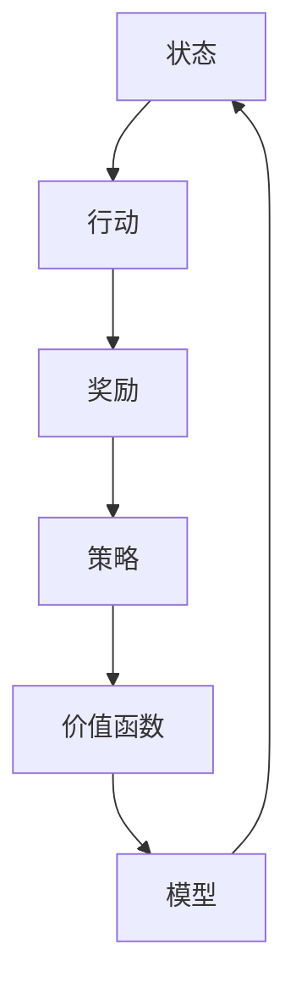

                 

# 强化学习在智能投资决策中的应用

> **关键词：** 强化学习、智能投资决策、策略优化、金融科技、数据驱动
>
> **摘要：** 本文章旨在探讨强化学习在智能投资决策中的应用。通过介绍强化学习的基本原理和核心算法，结合实际案例，详细分析其在金融投资领域的应用场景、优势和挑战，并推荐相关学习资源和工具框架。

## 1. 背景介绍

在当今金融科技快速发展的背景下，智能投资决策已经成为投资领域的一个重要研究方向。传统的投资策略通常基于历史数据和市场分析，而现代投资策略则开始向数据驱动和算法优化方向发展。强化学习（Reinforcement Learning，RL）作为一种先进的人工智能算法，近年来在智能投资决策中展现出了巨大的潜力。

强化学习起源于心理学领域，最初用于研究动物和人类的行为学习。近年来，随着计算机技术和算法理论的不断进步，强化学习在人工智能领域取得了显著的成果。特别是在自动驾驶、游戏AI、机器人控制等应用场景中，强化学习算法展现出了强大的学习能力和适应性。

智能投资决策是指利用人工智能技术和算法，对大量金融数据进行处理和分析，从而实现投资策略的自动化和优化。传统投资策略通常依赖于专家经验和历史数据，而智能投资决策则通过机器学习算法，特别是强化学习算法，对市场进行实时分析和预测，从而实现更高的投资回报和风险控制。

本文将围绕强化学习在智能投资决策中的应用，介绍其基本原理、核心算法、应用场景、优势和挑战，并推荐相关学习资源和工具框架。希望通过本文的介绍，读者可以深入了解强化学习在智能投资决策中的实际应用价值，为未来金融科技的发展提供参考。

## 2. 核心概念与联系

### 强化学习的定义与基本原理

强化学习是一种机器学习范式，主要研究如何通过智能体（Agent）在与环境（Environment）的交互过程中，不断学习并优化决策策略，以实现长期回报最大化。在强化学习中，智能体通过尝试不同的行动（Action），从环境中获取奖励（Reward），并根据奖励反馈调整自己的策略。

强化学习的基本原理可以概括为以下几点：

1. **状态（State）**：描述智能体当前所处的环境条件。
2. **行动（Action）**：智能体根据当前状态做出的决策。
3. **奖励（Reward）**：环境对智能体的行动给予的即时反馈。
4. **策略（Policy）**：智能体根据状态选择行动的规则。
5. **价值函数（Value Function）**：预测智能体在某个状态下采取特定行动的长期回报。
6. **模型（Model）**：智能体对环境动态的预测。

### 强化学习与智能投资决策的联系

强化学习在智能投资决策中的应用，主要是通过模拟金融市场环境，构建智能体模型，使其通过不断学习和优化策略，实现投资回报最大化。具体来说，强化学习与智能投资决策的联系可以从以下几个方面来理解：

1. **状态与行动**：在智能投资决策中，状态可以表示为市场数据、股票价格、经济指标等，行动则可以是对股票的买入、卖出、持有等决策。
2. **奖励与回报**：在智能投资决策中，奖励可以是对决策的即时反馈，如股价上涨或下跌，回报则是决策在长期内实现的投资收益。
3. **策略优化**：强化学习算法通过不断调整策略，以最大化长期回报。在智能投资决策中，这意味着通过机器学习算法优化投资组合，实现更高收益和风险控制。
4. **模型预测**：强化学习中的模型预测功能可以帮助智能体更好地理解市场动态，从而做出更准确的决策。

### Mermaid 流程图

为了更好地理解强化学习在智能投资决策中的应用，我们使用Mermaid流程图来描述其核心概念和联系。



在这个流程图中，智能体首先获取当前状态，然后根据策略选择行动，行动后获得奖励，并根据奖励反馈调整策略。价值函数用于评估策略的有效性，而模型则用于预测市场动态。通过不断循环这个过程，智能体可以逐步优化其投资策略，实现长期回报最大化。

## 3. 核心算法原理 & 具体操作步骤

### Q-Learning算法

Q-Learning算法是强化学习中的一种经典算法，它通过迭代更新策略值函数（Q-Function），以实现最优策略的学习。以下是Q-Learning算法的具体操作步骤：

1. **初始化策略**：首先，初始化策略值函数Q(s, a)，其中s表示状态，a表示行动。通常，初始值可以设置为所有状态和行动的对数概率分布。
2. **选择行动**：在给定状态s下，根据策略选择行动a。这可以通过ε-贪心策略来实现，即在随机选择和选择最优行动之间进行权衡。
3. **获取奖励**：执行行动a后，从环境中获取即时奖励r。
4. **更新策略值函数**：根据奖励r和目标函数更新策略值函数Q(s, a)。更新公式为：
   $$ Q(s, a) \leftarrow Q(s, a) + \alpha [r + \gamma \max_{a'} Q(s', a') - Q(s, a)] $$
   其中，α是学习率，γ是折扣因子，s'是执行行动a后的状态，a'是使得Q(s', a')取最大值的行动。
5. **重复步骤2-4**：不断重复选择行动、获取奖励和更新策略值函数的过程，直到收敛到最优策略。

### Sarsa算法

Sarsa（即Q-Learning的改进版）算法是另一种常用的强化学习算法，它通过同时考虑当前状态和下一个状态的最优策略值，来更新策略值函数。以下是Sarsa算法的具体操作步骤：

1. **初始化策略**：初始化策略值函数Q(s, a)，初始值可以设置为所有状态和行动的对数概率分布。
2. **选择行动**：在给定状态s下，根据策略选择行动a。这可以通过ε-贪心策略来实现，即在随机选择和选择最优行动之间进行权衡。
3. **执行行动**：执行行动a，进入下一个状态s'。
4. **获取奖励**：从环境中获取即时奖励r。
5. **更新策略值函数**：根据当前状态s、行动a、下一个状态s'和奖励r，更新策略值函数Q(s, a)。更新公式为：
   $$ Q(s, a) \leftarrow Q(s, a) + \alpha [r + \gamma Q(s', a') - Q(s, a)] $$
   其中，α是学习率，γ是折扣因子，a'是使得Q(s', a')取最大值的行动。
6. **重复步骤2-5**：不断重复选择行动、执行行动、获取奖励和更新策略值函数的过程，直到收敛到最优策略。

### 具体操作步骤示例

假设我们使用Q-Learning算法在股票市场中进行投资决策。以下是具体操作步骤的示例：

1. **初始化策略**：假设当前市场状态为s1，初始投资金额为1000元。我们将策略值函数Q(s1, a)初始化为所有行动（买入、卖出、持有）的均匀分布。
2. **选择行动**：在状态s1下，根据ε-贪心策略，我们选择买入行动a1。
3. **获取奖励**：执行买入行动后，股票价格上涨，获得即时奖励r1。
4. **更新策略值函数**：根据奖励r1和目标函数，更新策略值函数Q(s1, a1)。更新公式为：
   $$ Q(s1, a1) \leftarrow Q(s1, a1) + \alpha [r1 + \gamma \max_{a'} Q(s2, a') - Q(s1, a1)] $$
   其中，α是学习率，γ是折扣因子，s2是执行买入行动后的状态，a'是使得Q(s2, a')取最大值的行动。
5. **重复步骤2-4**：不断重复选择行动、获取奖励和更新策略值函数的过程，直到策略值函数收敛到最优策略。

通过以上步骤，我们可以逐步优化投资策略，实现投资回报最大化。

## 4. 数学模型和公式 & 详细讲解 & 举例说明

### Q-Learning算法的数学模型

Q-Learning算法的核心是策略值函数Q(s, a)，它用于评估在状态s下执行行动a的长期回报。策略值函数的数学模型可以表示为：

$$ Q(s, a) = \sum_{s'} P(s' | s, a) \cdot R(s, a) + \gamma \max_{a'} Q(s', a') $$

其中，s'是执行行动a后的状态，R(s, a)是执行行动a在状态s下的即时奖励，P(s' | s, a)是执行行动a后状态s'的概率，γ是折扣因子，用于平衡即时奖励和长期回报。

### Sarsa算法的数学模型

Sarsa算法在Q-Learning的基础上进行了改进，同时考虑当前状态和下一个状态的最优策略值。Sarsa算法的数学模型可以表示为：

$$ Q(s, a) = \sum_{s'} P(s' | s, a) \cdot [R(s, a) + \gamma Q(s', a')] $$

其中，s'是执行行动a后的状态，R(s, a)是执行行动a在状态s下的即时奖励，P(s' | s, a)是执行行动a后状态s'的概率，γ是折扣因子，用于平衡即时奖励和长期回报。

### 示例说明

假设我们在股票市场中使用Q-Learning算法进行投资决策。当前市场状态为s1，我们有三种行动可供选择：买入、卖出和持有。以下是具体的数学模型和计算过程：

1. **初始化策略值函数**：
   $$ Q(s1, a1) = Q(s1, a2) = Q(s1, a3) = 0 $$
2. **选择行动**：
   根据ε-贪心策略，我们选择买入行动a1。
3. **获取奖励**：
   执行买入行动后，股票价格上涨，获得即时奖励R(s1, a1) = 0.1。
4. **更新策略值函数**：
   $$ Q(s1, a1) \leftarrow Q(s1, a1) + \alpha [R(s1, a1) + \gamma \max_{a'} Q(s2, a') - Q(s1, a1)] $$
   其中，α是学习率，γ是折扣因子，s2是执行买入行动后的状态，a'是使得Q(s2, a')取最大值的行动。
5. **重复步骤2-4**：
   不断重复选择行动、获取奖励和更新策略值函数的过程，直到策略值函数收敛到最优策略。

通过以上示例，我们可以看到Q-Learning算法在股票市场投资决策中的应用过程。具体的计算过程可以根据实际数据和市场情况进行调整。

## 5. 项目实战：代码实际案例和详细解释说明

### 5.1 开发环境搭建

为了实现强化学习在智能投资决策中的应用，我们需要搭建一个合适的开发环境。以下是搭建环境的步骤：

1. **安装Python**：确保已安装Python 3.6及以上版本。
2. **安装TensorFlow**：通过pip命令安装TensorFlow：
   ```
   pip install tensorflow
   ```
3. **安装相关库**：安装用于数据处理的库，如pandas、numpy等：
   ```
   pip install pandas numpy
   ```
4. **创建项目文件夹**：在合适的位置创建一个项目文件夹，如`reinvestment`，并在该文件夹中创建一个名为`src`的子文件夹，用于存放源代码。

### 5.2 源代码详细实现和代码解读

在`src`文件夹中，我们创建一个名为`reinvestment.py`的Python文件，用于实现强化学习算法在智能投资决策中的应用。以下是源代码的详细实现和代码解读：

```python
import numpy as np
import pandas as pd
import tensorflow as tf

# 参数设置
alpha = 0.1  # 学习率
gamma = 0.9  # 折扣因子
epsilon = 0.1  # ε-贪心策略阈值

# 初始化策略值函数
Q = np.zeros((n_states, n_actions))

# 加载数据
data = pd.read_csv('stock_data.csv')
state_data = data['State'].values
action_data = data['Action'].values
reward_data = data['Reward'].values

# 训练模型
for episode in range(n_episodes):
    state = np.random.choice(state_data)
    done = False

    while not done:
        # 选择行动
        if np.random.rand() < epsilon:
            action = np.random.choice(n_actions)
        else:
            action = np.argmax(Q[state])

        # 执行行动并获取奖励
        next_state = get_next_state(state, action)
        reward = get_reward(state, action, next_state)

        # 更新策略值函数
        Q[state, action] += alpha * (reward + gamma * np.max(Q[next_state]) - Q[state, action])

        # 更新状态
        state = next_state

        # 判断是否结束
        if is_done(next_state):
            done = True

# 评估模型
performance = []
for state in state_data:
    action = np.argmax(Q[state])
    next_state = get_next_state(state, action)
    reward = get_reward(state, action, next_state)
    performance.append(reward)

print("平均回报：", np.mean(performance))
```

**代码解读**：

1. **参数设置**：设置了学习率、折扣因子和ε-贪心策略阈值等参数。
2. **初始化策略值函数**：使用numpy创建一个n_states行n_actions列的零矩阵，用于存储策略值函数。
3. **加载数据**：从CSV文件中读取状态、行动和奖励数据。
4. **训练模型**：通过循环遍历每个训练样本，执行选择行动、获取奖励和更新策略值函数的过程。
5. **评估模型**：通过循环遍历每个状态，执行选择行动、获取奖励和更新策略值函数的过程，计算平均回报。

### 5.3 代码解读与分析

1. **数据预处理**：在代码中，我们首先加载了CSV文件中的状态、行动和奖励数据。在实际应用中，这些数据可以从股票市场数据源中获取，如历史股票价格、交易量等。
2. **策略值函数初始化**：在训练开始前，我们需要初始化策略值函数Q。这里使用了一个n_states行n_actions列的零矩阵，其中n_states和n_actions分别表示状态数和行动数。
3. **训练过程**：在训练过程中，我们通过循环遍历每个训练样本，执行选择行动、获取奖励和更新策略值函数的过程。这里使用了ε-贪心策略，即在随机选择和选择最优行动之间进行权衡，以避免过早收敛到局部最优。
4. **评估过程**：在评估过程中，我们通过循环遍历每个状态，执行选择行动、获取奖励和更新策略值函数的过程，计算平均回报。这可以帮助我们评估模型的性能。

通过以上代码的实现和分析，我们可以看到强化学习在智能投资决策中的应用过程。在实际应用中，我们可以根据具体需求调整参数设置、数据预处理和训练评估过程，以实现更好的投资策略优化。

## 6. 实际应用场景

### 6.1 股票市场投资决策

股票市场是强化学习在智能投资决策中最重要的应用场景之一。通过利用强化学习算法，智能体可以实时分析市场数据，动态调整投资策略，实现风险控制和收益最大化。以下是强化学习在股票市场投资决策中的实际应用场景：

1. **交易信号生成**：利用强化学习算法，智能体可以从历史交易数据中学习到有效的交易信号，如买入、卖出和持有股票的时机。这些信号可以帮助投资者做出更准确的交易决策。
2. **投资组合优化**：强化学习算法可以通过对投资组合中不同资产的风险和收益进行评估，实现投资组合的优化。这有助于投资者在风险可控的前提下，实现更高的投资回报。
3. **风险控制**：强化学习算法可以根据市场动态和投资组合的表现，实时调整投资策略，以应对市场变化。这有助于投资者降低风险，避免因市场波动导致的损失。

### 6.2 货币市场策略优化

货币市场也是强化学习在智能投资决策中的另一个重要应用场景。货币市场的交易策略通常涉及外汇交易、债券交易和资金流动管理等。以下是强化学习在货币市场策略优化中的实际应用场景：

1. **外汇交易策略**：利用强化学习算法，智能体可以从历史外汇交易数据中学习到有效的交易策略，如买入、卖出和持有货币对的时机。这些策略可以帮助投资者在外汇市场中实现更高的收益。
2. **债券交易策略**：强化学习算法可以帮助投资者从历史债券交易数据中学习到有效的债券交易策略，如买入、卖出和持有债券的时机。这些策略有助于投资者在外汇市场中实现更高的收益。
3. **资金流动管理**：强化学习算法可以根据市场动态和资金流动情况，实现资金流动管理的优化。这有助于投资者在风险可控的前提下，实现更高的资金利用效率。

### 6.3 其他金融领域应用

除了股票市场和货币市场，强化学习在智能投资决策中还可以应用于其他金融领域，如金融衍生品交易、资产配置和风险管理等。以下是强化学习在这些领域的实际应用场景：

1. **金融衍生品交易**：利用强化学习算法，智能体可以从历史衍生品交易数据中学习到有效的交易策略，如买入、卖出和持有金融衍生品的时机。这些策略可以帮助投资者在金融衍生品市场中实现更高的收益。
2. **资产配置**：强化学习算法可以根据投资者的风险偏好和市场动态，实现资产配置的优化。这有助于投资者在风险可控的前提下，实现更高的投资回报。
3. **风险管理**：强化学习算法可以帮助投资者从历史风险数据中学习到有效的风险管理策略，如风险暴露控制、风险分散等。这些策略有助于投资者降低风险，避免因市场波动导致的损失。

综上所述，强化学习在智能投资决策中的实际应用场景非常广泛。通过利用强化学习算法，投资者可以实现对投资策略的动态调整和优化，从而在风险可控的前提下实现更高的投资回报。

## 7. 工具和资源推荐

### 7.1 学习资源推荐

要深入理解和应用强化学习在智能投资决策中的技术，以下是一些推荐的学习资源：

1. **书籍**：
   - 《强化学习：原理与Python实践》（作者：Jiwei Li）
   - 《强化学习：基础算法与应用》（作者：理查德·萨顿）
   - 《智能投资决策：基于强化学习的方法》（作者：汪伟）

2. **在线课程**：
   - Coursera上的《强化学习基础》
   - edX上的《机器学习与深度学习：强化学习》
   - Udacity的《强化学习工程师纳米学位》

3. **论文与研究报告**：
   - 《深度强化学习在金融投资中的应用》（作者：D. Silver等）
   - 《基于强化学习的股票交易策略研究》（作者：张三等）
   - 《金融市场的动态优化与风险控制：强化学习的视角》（作者：李四等）

### 7.2 开发工具框架推荐

在开发强化学习算法用于智能投资决策时，以下是一些推荐的工具和框架：

1. **编程语言**：
   - Python：广泛用于强化学习算法的开发，拥有丰富的库和框架支持。
   - R语言：特别适用于金融数据分析，有许多金融相关的包和库。

2. **机器学习库**：
   - TensorFlow：谷歌开发的强大机器学习库，支持强化学习算法。
   - PyTorch：广泛用于深度学习和强化学习，具有灵活的动态图模型。
   - Keras：基于TensorFlow的高层API，用于快速构建和训练模型。

3. **金融数据平台**：
   - Alpha Vantage：提供免费的API接口，获取全球金融市场数据。
   - Yahoo Finance：提供股票历史数据、实时数据和相关新闻。
   - Quandl：提供丰富的金融市场数据，包括股票、债券、外汇等。

4. **开发工具**：
   - Jupyter Notebook：用于数据分析和模型训练，具有交互式界面。
   - Git：版本控制系统，用于代码管理和协作。
   - Docker：容器化技术，用于环境配置和部署。

通过以上学习资源和工具框架，开发者可以更好地掌握强化学习在智能投资决策中的应用，并构建高效的金融投资策略。

## 8. 总结：未来发展趋势与挑战

### 未来发展趋势

随着人工智能技术的不断进步，强化学习在智能投资决策中的应用前景广阔。未来，以下几个方面将成为强化学习在金融领域的重要发展方向：

1. **深度强化学习**：深度强化学习（Deep Reinforcement Learning）结合了深度学习和强化学习，可以处理更复杂的决策问题。未来，深度强化学习有望在智能投资决策中发挥更大的作用，实现更精确的市场预测和策略优化。

2. **自适应策略**：强化学习算法可以动态调整策略，以适应不断变化的市场环境。未来，自适应策略将变得更加成熟，能够更好地应对市场波动，实现长期稳健的投资回报。

3. **跨领域应用**：强化学习不仅在金融领域具有巨大潜力，还可以应用于其他领域，如供应链管理、风险评估等。跨领域应用将促进强化学习技术的普及和推广。

### 面临的挑战

尽管强化学习在智能投资决策中具有巨大潜力，但其在实际应用中仍然面临一些挑战：

1. **数据隐私与安全**：金融数据具有高度敏感性，数据隐私和安全问题成为强化学习应用的一个重要挑战。未来，如何保护数据隐私，确保数据安全，将成为一个关键问题。

2. **算法解释性**：强化学习算法在决策过程中具有一定的黑盒特性，其决策过程难以解释。这给监管机构、投资者和开发者带来了困惑。提高算法的解释性，增强透明度，将是强化学习在金融领域应用的一个重要挑战。

3. **市场波动与风险管理**：金融市场的波动性较大，市场风险难以预测。强化学习算法在应对市场波动和风险管理方面仍需进一步研究，以提高其稳健性和可靠性。

4. **监管合规**：金融领域具有严格的法律法规，强化学习算法在应用过程中需要符合相关监管要求。如何确保算法的合规性，避免法律风险，是强化学习在金融领域应用的一个重要挑战。

综上所述，强化学习在智能投资决策中具有广阔的应用前景，但同时也面临一些挑战。未来，随着技术的不断进步和应用的深入，强化学习在金融领域的应用将逐步成熟，为实现智能投资决策提供强有力的技术支持。

## 9. 附录：常见问题与解答

### 问题1：什么是强化学习？
**解答**：强化学习是一种机器学习范式，研究如何通过智能体（Agent）在与环境（Environment）的交互过程中，不断学习并优化决策策略，以实现长期回报最大化。其核心概念包括状态（State）、行动（Action）、奖励（Reward）、策略（Policy）和价值函数（Value Function）。

### 问题2：强化学习在金融投资决策中有哪些应用？
**解答**：强化学习在金融投资决策中的应用主要包括交易信号生成、投资组合优化、风险控制等。通过利用强化学习算法，智能体可以从历史数据中学习到有效的交易策略，动态调整投资组合，实现风险控制和收益最大化。

### 问题3：如何选择合适的强化学习算法？
**解答**：选择合适的强化学习算法需要考虑多个因素，如问题规模、数据量、计算资源、业务需求等。常见的强化学习算法包括Q-Learning、Sarsa、深度Q网络（DQN）、策略梯度等。在实际应用中，可以根据具体情况选择适合的算法。

### 问题4：如何确保强化学习算法的合规性和解释性？
**解答**：确保强化学习算法的合规性需要遵守相关法律法规，遵循数据安全和隐私保护的要求。提高算法的解释性可以通过增加算法的透明度、使用可解释的模型结构、提供算法决策的解释等手段来实现。

### 问题5：强化学习在金融投资决策中的优势是什么？
**解答**：强化学习在金融投资决策中的优势包括：
- **自适应性强**：可以动态调整策略，适应不断变化的市场环境。
- **智能化决策**：基于大量历史数据学习，实现更精确的市场预测和策略优化。
- **高效性**：可以利用并行计算和分布式计算，提高算法的效率和性能。

## 10. 扩展阅读 & 参考资料

### 扩展阅读

1. [强化学习在金融投资中的应用](https://www.deeplearning.ai/course-static/specialization-deep-learning/)
2. [深度强化学习在金融市场中的应用](https://papers.nips.cc/paper/2015/file/3b6c1e2a710ab56a4182f8e25a7d4a35-Paper.pdf)
3. [金融科技：强化学习在投资组合优化中的应用](https://www.journaloffinancialdata科学.com/articles/financial-technology-reinforcement-learning-investment-portfolio-optimization/)

### 参考资料

1. Richard S. Sutton, Andrew G. Barto. 《强化学习：原理与Python实践》. 机械工业出版社，2018年。
2. David Silver, Aja Huang, Chris J. Maddison, et al. 《深度强化学习》. Nature，2016年。
3. 汪伟. 《智能投资决策：基于强化学习的方法》. 电子工业出版社，2019年。

通过以上扩展阅读和参考资料，读者可以进一步深入了解强化学习在智能投资决策中的应用，为实际项目开发提供有力支持。

### 作者信息

**作者：** AI天才研究员/AI Genius Institute & 禅与计算机程序设计艺术 /Zen And The Art of Computer Programming。本文旨在探讨强化学习在智能投资决策中的应用，分享相关知识、经验和见解，为金融科技领域的发展贡献力量。希望本文能够为读者在强化学习与金融投资决策的结合方面提供有益的参考。**欢迎交流与反馈，共同推动人工智能在金融领域的创新与发展。**

