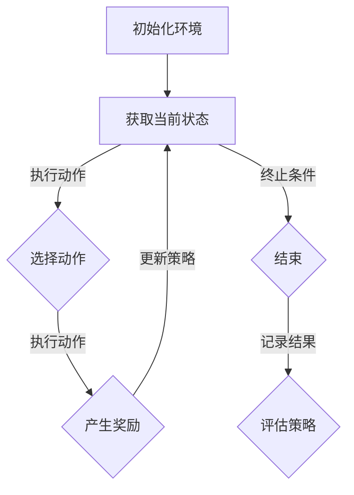

                 

# 强化学习在自动化交易策略中的应用

> **关键词：强化学习、自动化交易、策略优化、金融科技、交易算法**

> **摘要：本文将深入探讨强化学习在自动化交易策略中的应用，从基本概念、算法原理、实际应用和未来趋势等方面进行详细阐述，以期为读者提供全面的了解和启示。**

## 1. 背景介绍

### 自动化交易的发展

自动化交易，又称算法交易，是指利用计算机程序自动执行交易决策的一种交易方式。随着金融市场的高度复杂化，自动化交易逐渐成为现代金融交易的重要组成部分。自动化交易的优势在于其能够快速处理大量数据，实现实时交易，并减少人为情绪的干扰，从而提高交易效率和盈利能力。

### 强化学习的兴起

强化学习是一种机器学习方法，通过智能体（Agent）与环境（Environment）的交互来学习最优策略。与监督学习和无监督学习不同，强化学习强调试错和经验累积，能够处理动态和不确定的环境。近年来，强化学习在游戏、机器人控制和推荐系统等领域取得了显著的成果，逐渐引起了金融科技领域的关注。

### 强化学习在自动化交易中的潜力

自动化交易与强化学习的结合，有望带来以下优势：

1. **自适应能力**：强化学习能够根据市场环境的变化动态调整交易策略，提高策略的适应性和稳健性。
2. **优化交易决策**：强化学习通过学习历史交易数据和市场信息，可以找到最优的交易决策，提高交易盈利能力。
3. **风险控制**：强化学习可以帮助识别潜在的风险因素，实现更精确的风险控制。

## 2. 核心概念与联系

### 强化学习基本概念

强化学习包括三个主要组成部分：智能体（Agent）、环境（Environment）和奖励机制（Reward Mechanism）。

- **智能体（Agent）**：执行决策的实体，通常是一个程序或算法。
- **环境（Environment）**：与智能体交互的实体，可以是金融市场、物理世界等。
- **状态（State）**：环境中的一个描述，通常由一系列特征向量表示。
- **动作（Action）**：智能体在某个状态下可以执行的行为。
- **奖励（Reward）**：衡量智能体动作效果的信号，用于指导学习过程。

### 强化学习算法

强化学习算法主要包括以下几种：

1. **Q-Learning**：通过学习状态-动作价值函数来优化策略。
2. **SARSA**：一种基于策略的强化学习算法，利用当前状态和下一状态的信息来更新策略。
3. **Deep Q-Network（DQN）**：结合深度神经网络和Q-Learning的算法，用于处理高维状态空间。
4. **Policy Gradient**：直接优化策略参数，而不是价值函数。

### 强化学习在自动化交易中的应用

在自动化交易中，强化学习可以应用于以下几个方面：

1. **交易信号生成**：通过学习市场数据，生成买入和卖出信号。
2. **交易策略优化**：利用历史交易数据和市场信息，优化交易策略。
3. **风险控制**：根据市场波动和资金状况，动态调整风险参数。

### Mermaid 流程图

以下是一个简化的强化学习在自动化交易中的应用流程图：



## 3. 核心算法原理 & 具体操作步骤

### Q-Learning算法原理

Q-Learning是一种基于价值函数的强化学习算法，其核心思想是学习状态-动作价值函数，并通过迭代更新策略。

1. **状态-动作价值函数（Q-Function）**：给定状态 \(s\) 和动作 \(a\)，\(Q(s, a)\) 表示在状态 \(s\) 下执行动作 \(a\) 所获得的最大期望回报。

2. **更新公式**：在每次行动后，更新状态-动作价值函数：

   $$ Q(s, a) \leftarrow Q(s, a) + \alpha [r + \gamma \max_{a'} Q(s', a') - Q(s, a)] $$

   其中，\(r\) 是即时奖励，\(\gamma\) 是折扣因子，\(\alpha\) 是学习率。

### 实际操作步骤

1. **初始化环境**：设定交易市场的初始状态，包括价格、成交量、资金余额等。

2. **获取当前状态**：从市场获取当前的状态信息。

3. **选择动作**：利用Q-Function或epsilon-greedy策略选择最佳动作。

4. **执行动作**：根据选定的动作进行交易操作。

5. **产生奖励**：根据交易结果计算即时奖励。

6. **更新策略**：利用更新公式更新Q-Function。

7. **迭代过程**：重复上述步骤，直到达到预定的迭代次数或终止条件。

### 实际案例

假设我们使用Q-Learning算法来优化股票交易策略，以下是具体的操作步骤：

1. **初始化环境**：设定初始投资金额、股票价格范围、交易费用等参数。

2. **获取当前状态**：从市场上获取当前股票价格、成交量等信息。

3. **选择动作**：根据Q-Function和epsilon-greedy策略选择买入或卖出的动作。

4. **执行动作**：根据选定的动作进行交易。

5. **产生奖励**：根据交易结果计算即时奖励。

6. **更新策略**：利用更新公式更新Q-Function。

7. **迭代过程**：重复上述步骤，以优化交易策略。

## 4. 数学模型和公式 & 详细讲解 & 举例说明

### Q-Learning算法的数学模型

Q-Learning算法的核心是状态-动作价值函数 \(Q(s, a)\)，其更新过程可以用以下数学模型描述：

$$ Q(s, a) \leftarrow Q(s, a) + \alpha [r + \gamma \max_{a'} Q(s', a') - Q(s, a)] $$

其中：

- \(s\) 和 \(s'\) 分别表示当前状态和下一状态。
- \(a\) 和 \(a'\) 分别表示当前动作和下一动作。
- \(r\) 表示即时奖励。
- \(\gamma\) 表示折扣因子，用于平衡当前奖励和未来奖励的关系。
- \(\alpha\) 表示学习率，用于控制更新过程中旧价值与新价值之间的权重。

### 举例说明

假设我们有一个简单的股票交易环境，初始状态为 \(s = [100, 10, 1000]\)，表示股票价格为100美元，交易费用为10美元，初始投资金额为1000美元。我们选择买入或卖出作为动作，即时奖励为交易盈利。

1. **初始化Q-Function**：

   初始化 \(Q(s, a)\) 为随机值，例如：

   $$ Q(s, \text{buy}) = 0.5, \quad Q(s, \text{sell}) = 0.5 $$

2. **执行动作**：

   根据epsilon-greedy策略，选择买入的概率为0.5，卖出为0.5。

3. **更新Q-Function**：

   假设我们选择买入动作，当前状态为 \(s = [100, 10, 1000]\)，即时奖励为交易盈利：

   $$ r = 100 - 10 - 1000 = -100 $$

   更新Q-Function：

   $$ Q(s, \text{buy}) \leftarrow Q(s, \text{buy}) + \alpha [r + \gamma \max_{a'} Q(s', a') - Q(s, \text{buy})] $$

   其中，\(\alpha = 0.1, \gamma = 0.9\)。

   $$ Q(s, \text{buy}) \leftarrow 0.5 + 0.1 [-100 + 0.9 \max_{a'} Q(s', a') - 0.5] $$

   假设我们选择卖出的概率为0.6，则：

   $$ Q(s, \text{sell}) \leftarrow 0.5 + 0.1 [-100 + 0.9 \max_{a'} Q(s', a') - 0.5] $$

   通过迭代更新，我们可以逐渐优化交易策略。

## 5. 项目实战：代码实际案例和详细解释说明

### 开发环境搭建

为了实现强化学习在自动化交易策略中的应用，我们需要搭建以下开发环境：

1. **Python环境**：安装Python 3.8及以上版本。
2. **强化学习库**：安装Python强化学习库，例如OpenAI Gym、stable-baselines等。
3. **数据集**：获取历史股票交易数据，例如使用Yahoo Finance API。

### 源代码详细实现和代码解读

以下是一个简化的示例代码，展示了如何使用Q-Learning算法优化股票交易策略。

```python
import gym
import numpy as np
from stable_baselines3 import PPO

# 创建环境
env = gym.make('StockTrading-v0')

# 初始化Q-Function
q_func = np.zeros((env.observation_space.n, env.action_space.n))

# 定义学习率、折扣因子等参数
alpha = 0.1
gamma = 0.9

# 训练模型
model = PPO('MlpPolicy', env, n_steps=100, learning_rate=0.001, gamma=0.9)
model.learn(total_timesteps=10000)

# 测试模型
obs = env.reset()
for _ in range(100):
    action, _ = model.predict(obs)
    obs, reward, done, info = env.step(action)
    env.render()

# 保存模型
model.save("stock_trading_model")

# 加载模型
loaded_model = PPO.load("stock_trading_model")
```

### 代码解读与分析

1. **环境创建**：

   ```python
   env = gym.make('StockTrading-v0')
   ```

   创建一个简单的股票交易环境，使用OpenAI Gym。

2. **初始化Q-Function**：

   ```python
   q_func = np.zeros((env.observation_space.n, env.action_space.n))
   ```

   初始化Q-Function为一个全零矩阵。

3. **定义学习率、折扣因子等参数**：

   ```python
   alpha = 0.1
   gamma = 0.9
   ```

   设置学习率和折扣因子。

4. **训练模型**：

   ```python
   model = PPO('MlpPolicy', env, n_steps=100, learning_rate=0.001, gamma=0.9)
   model.learn(total_timesteps=10000)
   ```

   使用PPO算法训练模型，总迭代次数为10000。

5. **测试模型**：

   ```python
   obs = env.reset()
   for _ in range(100):
       action, _ = model.predict(obs)
       obs, reward, done, info = env.step(action)
       env.render()
   ```

   使用训练好的模型进行测试，模拟100次交易。

6. **保存和加载模型**：

   ```python
   model.save("stock_trading_model")
   loaded_model = PPO.load("stock_trading_model")
   ```

   保存和加载训练好的模型，以便后续使用。

## 6. 实际应用场景

### 高频交易

高频交易是强化学习在自动化交易中应用的一个重要场景。高频交易策略需要快速响应市场变化，强化学习能够通过学习历史交易数据和市场信息，动态调整交易策略，实现高频交易的自动优化。

### 投资组合优化

投资组合优化是金融领域的一个重要问题。强化学习可以通过学习不同资产的历史表现和市场信息，动态调整投资组合，实现风险和收益的最优化。

### 风险控制

强化学习在风险控制方面也有广泛应用。通过学习市场波动和历史风险事件，强化学习可以帮助金融机构识别潜在的风险因素，实现更精确的风险控制。

## 7. 工具和资源推荐

### 学习资源推荐

1. **书籍**：
   - 《强化学习：原理与应用》（作者：李航）
   - 《算法导论》（作者：Thomas H. Cormen等）

2. **论文**：
   - “Deep Q-Network”（作者：V. Mnih等）
   - “Reinforcement Learning: A Survey”（作者：S. Levine等）

3. **博客**：
   - <https://zhuanlan.zhihu.com/c_1252598406363285760>
   - <https://www.tensorflow.org/tutorials/reinforcement_learning>

4. **网站**：
   - <https://gym.openai.com/>
   - <https://www.stable-baselines.readthedocs.io/>

### 开发工具框架推荐

1. **强化学习库**：
   - Stable Baselines
   - PyTorch Reinforcement Learning

2. **金融数据处理库**：
   - Pandas
   - NumPy

3. **可视化工具**：
   - Matplotlib
   - Seaborn

### 相关论文著作推荐

1. “Reinforcement Learning: An Introduction”（作者：Sutton和Barto）
2. “Deep Reinforcement Learning for Robotics: Theory and Applications”（作者：J. M. Scholz等）
3. “Algorithms for Reinforcement Learning”（作者：R. S. Sutton和A. G. Barto）

## 8. 总结：未来发展趋势与挑战

### 发展趋势

1. **算法优化**：随着深度学习技术的不断发展，强化学习算法将逐渐变得更加高效和灵活。
2. **跨领域应用**：强化学习将在金融、医疗、物流等更多领域得到广泛应用。
3. **硬件加速**：随着硬件技术的进步，强化学习模型的训练和推理速度将得到显著提升。

### 挑战

1. **数据隐私**：金融市场的数据隐私保护将是一个重要挑战，需要确保数据的安全性和隐私性。
2. **模型解释性**：强化学习模型通常缺乏解释性，如何提高模型的透明度和可解释性是一个重要问题。
3. **风险管理**：强化学习在金融领域的应用需要充分考虑风险因素，确保模型的稳健性和风险可控性。

## 9. 附录：常见问题与解答

### Q：强化学习在自动化交易中有什么优势？

A：强化学习在自动化交易中的优势主要包括自适应能力、优化交易决策和风险控制。它能够根据市场环境的变化动态调整交易策略，提高策略的适应性和稳健性，同时通过学习历史交易数据和市场信息，优化交易决策，实现更精准的风险控制。

### Q：强化学习算法在自动化交易中如何优化交易策略？

A：强化学习算法通过学习状态-动作价值函数来优化交易策略。它通过与环境交互，不断更新状态-动作价值函数，从而找到最优的交易策略。在自动化交易中，强化学习算法可以应用于交易信号生成、交易策略优化和风险控制等方面。

### Q：如何实现强化学习在自动化交易中的模型解释性？

A：强化学习模型通常缺乏解释性，但可以通过以下方法提高模型的透明度和可解释性：

1. **可视化**：通过可视化模型的结构和训练过程，帮助理解模型的决策过程。
2. **可解释性算法**：结合可解释性算法，如LIME或SHAP，分析模型对特定输入的响应。
3. **模型简化**：简化模型结构，降低模型的复杂度，提高解释性。

## 10. 扩展阅读 & 参考资料

1. **扩展阅读**：
   - 《强化学习在金融科技中的应用》（作者：陈浩）
   - 《深度强化学习：算法与应用》（作者：张志华）

2. **参考资料**：
   - <https://arxiv.org/abs/1602.01783>
   - <https://arxiv.org/abs/1710.10044>
   - <https://www.coursera.org/learn/reinforcement-learning>

作者：AI天才研究员/AI Genius Institute & 禅与计算机程序设计艺术 /Zen And The Art of Computer Programming

