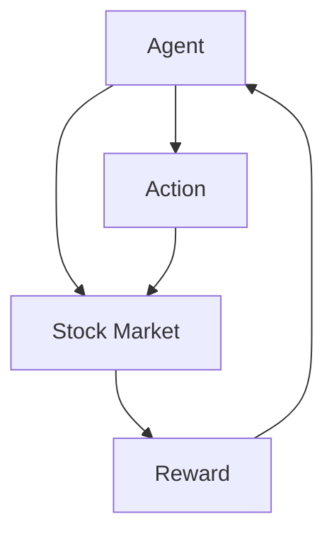

                 

# 强化学习在自动化股票交易策略中的风险控制

> **关键词**：强化学习、自动化股票交易、风险控制、算法策略
> **摘要**：本文将探讨如何利用强化学习来构建自动化股票交易策略，并对其进行风险控制。通过分析强化学习的基本概念、核心算法原理，以及数学模型和公式，我们将展示如何在实践中应用强化学习来降低股票交易中的风险。

## 1. 背景介绍

在过去的几十年中，股票市场一直是投资者关注的焦点。然而，股票市场的高波动性和不确定性使得投资者面临着巨大的风险。为了降低风险，许多投资者开始寻求自动化交易策略，希望通过算法来优化交易决策。其中，强化学习作为一种先进的机器学习方法，在自动化股票交易策略中显示出巨大的潜力。

强化学习是一种通过不断尝试和反馈来学习如何做出最优决策的机器学习方法。它通过奖励机制来引导模型学习，使其在复杂环境中找到最优策略。在自动化股票交易中，强化学习可以通过学习市场数据，自动调整交易策略，以实现风险控制和收益最大化。

本文将详细介绍强化学习在自动化股票交易策略中的应用，包括其核心算法原理、数学模型和公式，以及实际项目实战。通过本文的讲解，读者将了解如何利用强化学习来降低股票交易中的风险，并掌握构建自动化股票交易策略的基本方法。

## 2. 核心概念与联系

### 强化学习的基本概念

强化学习（Reinforcement Learning，RL）是一种使机器在与环境的交互中通过不断试错来学习如何完成任务的机器学习方法。它由三个核心组成部分构成：代理（Agent）、环境（Environment）和奖励（Reward）。

- **代理**：执行动作的实体，如股票交易算法。
- **环境**：代理所处的外部世界，如股票市场。
- **奖励**：代理采取动作后，环境给予的反馈，用于指导代理的学习。

在强化学习中，代理通过选择动作来与环境交互，并根据环境的反馈调整其行为。这一过程不断重复，直到代理找到最优策略，即能够在给定环境中实现最大收益。

### 强化学习与自动化股票交易的联系

强化学习在自动化股票交易中的应用主要体现在以下几个方面：

- **策略优化**：通过强化学习，可以自动调整交易策略，以适应市场变化，提高交易成功率。
- **风险控制**：强化学习可以学习如何在不确定的市场环境中进行交易，从而降低风险。
- **多策略管理**：强化学习可以同时管理多个交易策略，通过比较不同策略的收益，自动选择最优策略。

为了更清晰地展示强化学习在自动化股票交易中的应用，我们使用Mermaid流程图来描述其基本架构。



在该流程图中，代理（Agent）通过选择不同的动作（Action）来与股票市场（Stock Market）交互，并根据市场的反馈（Reward）调整其策略。这一过程不断迭代，直到代理找到最优策略。

## 3. 核心算法原理 & 具体操作步骤

### Q-Learning算法原理

Q-Learning是强化学习中最基本的算法之一，它通过学习状态-动作值函数（Q-Function）来指导代理选择最优动作。Q-Function表示在给定状态下，执行特定动作所能获得的预期收益。

- **状态（State）**：描述代理当前所处的环境状态，如股票价格、交易量等。
- **动作（Action）**：代理可以在给定状态下执行的动作，如买入、卖出、持有等。
- **Q-Value（Q-Value）**：表示在给定状态下，执行特定动作所能获得的预期收益。

Q-Learning算法的基本操作步骤如下：

1. **初始化**：初始化Q-Value表，所有状态-动作的Q-Value均设置为0。
2. **选择动作**：在给定状态下，选择具有最大Q-Value的动作。
3. **执行动作**：执行选定的动作，并观察环境的反馈（Reward）。
4. **更新Q-Value**：根据新获得的奖励和选择动作的Q-Value，更新Q-Value表。

具体公式如下：

$$
Q(s, a) \leftarrow Q(s, a) + \alpha [r + \gamma \max_{a'} Q(s', a') - Q(s, a)]
$$

其中，$s$ 和 $a$ 分别表示当前状态和动作，$s'$ 表示执行动作后的状态，$r$ 表示获得的奖励，$\alpha$ 是学习率，$\gamma$ 是折扣因子。

### sarsa算法原理

sarsa（State-Action-Reward-State-Action）是一种基于值函数的强化学习算法，它与Q-Learning类似，但考虑了当前状态和未来状态的联合分布。sarsa算法通过同时更新当前状态和下一个状态的Q-Value，来优化代理的行为。

sarsa算法的基本操作步骤如下：

1. **初始化**：初始化Q-Value表，所有状态-动作的Q-Value均设置为0。
2. **选择动作**：在给定状态下，选择具有最大Q-Value的动作。
3. **执行动作**：执行选定的动作，并观察环境的反馈（Reward）。
4. **更新Q-Value**：根据新获得的奖励和选择动作的Q-Value，同时更新当前状态和下一个状态的Q-Value。

具体公式如下：

$$
Q(s, a) \leftarrow Q(s, a) + \alpha [r + \gamma Q(s', a') - Q(s, a)]
$$

其中，$s$ 和 $a$ 分别表示当前状态和动作，$s'$ 表示执行动作后的状态，$r$ 表示获得的奖励，$\alpha$ 是学习率，$\gamma$ 是折扣因子。

### 模型训练与预测

在强化学习模型训练过程中，我们通常使用历史交易数据作为训练样本，来训练Q-Value表或策略网络。训练完成后，代理可以根据当前状态预测最佳动作，从而进行实际交易。

具体步骤如下：

1. **数据预处理**：对历史交易数据进行清洗、归一化等预处理操作，以消除噪声和异常值。
2. **训练模型**：使用预处理后的数据，通过Q-Learning或sarsa算法训练Q-Value表或策略网络。
3. **模型评估**：使用测试数据评估模型性能，包括收益、成功率等指标。
4. **模型优化**：根据评估结果，调整学习率、折扣因子等超参数，优化模型性能。
5. **预测与交易**：使用训练好的模型，根据当前状态预测最佳动作，并进行实际交易。

通过以上步骤，我们可以构建一个基于强化学习的自动化股票交易策略，并对其进行风险控制。在实际应用中，还需要考虑交易成本、市场波动等因素，以进一步优化交易策略。

## 4. 数学模型和公式 & 详细讲解 & 举例说明

### Q-Learning算法数学模型

Q-Learning算法的核心是学习状态-动作值函数（Q-Function），其数学模型如下：

$$
Q(s, a) = r + \gamma \max_{a'} Q(s', a')
$$

其中，$s$ 和 $a$ 分别表示当前状态和动作，$s'$ 表示执行动作后的状态，$r$ 表示获得的奖励，$\gamma$ 是折扣因子。

**示例**：

假设当前状态为$S_0$，代理可以选择买入、卖出或持有三种动作。假设买入、卖出和持有的预期收益分别为$R_0^{buy}$、$R_0^{sell}$和$R_0^{hold}$，折扣因子$\gamma = 0.9$。根据Q-Learning算法，我们可以计算每种动作的Q-Value：

$$
Q(S_0, buy) = R_0^{buy} + 0.9 \max\{Q(S_1, sell), Q(S_1, hold)\}
$$

$$
Q(S_0, sell) = R_0^{sell} + 0.9 \max\{Q(S_1, buy), Q(S_1, hold)\}
$$

$$
Q(S_0, hold) = R_0^{hold} + 0.9 \max\{Q(S_1, buy), Q(S_1, sell)\}
$$

通过迭代计算，我们可以得到每种动作的Q-Value，并根据Q-Value选择最佳动作。

### sarsa算法数学模型

sarsa算法同样基于状态-动作值函数（Q-Function），但其考虑了当前状态和未来状态的联合分布。sarsa算法的数学模型如下：

$$
Q(s, a) = r + \gamma Q(s', a')
$$

其中，$s$ 和 $a$ 分别表示当前状态和动作，$s'$ 表示执行动作后的状态，$r$ 表示获得的奖励，$\gamma$ 是折扣因子。

**示例**：

假设当前状态为$S_0$，代理可以选择买入、卖出或持有三种动作。假设买入、卖出和持有的预期收益分别为$R_0^{buy}$、$R_0^{sell}$和$R_0^{hold}$，折扣因子$\gamma = 0.9$。根据sarsa算法，我们可以计算每种动作的Q-Value：

$$
Q(S_0, buy) = R_0^{buy} + 0.9 Q(S_1, a')
$$

$$
Q(S_0, sell) = R_0^{sell} + 0.9 Q(S_1, a')
$$

$$
Q(S_0, hold) = R_0^{hold} + 0.9 Q(S_1, a')
$$

通过迭代计算，我们可以得到每种动作的Q-Value，并根据Q-Value选择最佳动作。

### 强化学习模型训练

在强化学习模型训练过程中，我们通常使用历史交易数据作为训练样本。假设历史交易数据包括状态序列$S_0, S_1, ..., S_T$和动作序列$A_0, A_1, ..., A_T$，我们可以通过以下公式计算Q-Value：

$$
Q(S_t, A_t) = r_t + \gamma \max_{a'} Q(S_{t+1}, a')
$$

其中，$t$ 表示当前时间步，$r_t$ 表示在时间步$t$获得的奖励，$\gamma$ 是折扣因子。

**示例**：

假设当前状态序列为$S_0 = (S_0^{1}, S_0^{2}, ..., S_0^{n})$，动作序列为$A_0 = (A_0^{1}, A_0^{2}, ..., A_0^{n})$，折扣因子$\gamma = 0.9$。根据历史交易数据，我们可以计算每个状态-动作对的Q-Value：

$$
Q(S_0, A_0) = r_0 + 0.9 \max_{a'} Q(S_1, a')
$$

$$
Q(S_1, A_1) = r_1 + 0.9 \max_{a'} Q(S_2, a')
$$

$$
...
$$

$$
Q(S_n, A_n) = r_n + 0.9 \max_{a'} Q(S_{n+1}, a')
$$

通过迭代计算，我们可以得到每个状态-动作对的Q-Value，并根据Q-Value选择最佳动作。

### 模型预测与交易

在模型预测与交易阶段，我们使用训练好的模型根据当前状态预测最佳动作。假设当前状态为$S_t$，我们可以通过以下公式计算最佳动作：

$$
\hat{A}_t = \arg\max_{a} Q(S_t, a)
$$

其中，$\hat{A}_t$ 表示最佳动作。

**示例**：

假设当前状态为$S_t = (S_t^{1}, S_t^{2}, ..., S_t^{n})$，折扣因子$\gamma = 0.9$。根据训练好的模型，我们可以计算每个状态-动作对的Q-Value：

$$
Q(S_t, A_t) = r_t + 0.9 \max_{a'} Q(S_{t+1}, a')
$$

$$
Q(S_{t+1}, A_{t+1}) = r_{t+1} + 0.9 \max_{a'} Q(S_{t+2}, a')
$$

$$
...
$$

$$
Q(S_n, A_n) = r_n + 0.9 \max_{a'} Q(S_{n+1}, a')
$$

通过迭代计算，我们可以得到每个状态-动作对的Q-Value，并根据Q-Value选择最佳动作。例如，如果$Q(S_t, A_t) = 10$，$Q(S_t, A_{t+1}) = 8$，$Q(S_t, A_{t+2}) = 12$，那么最佳动作为买入。

通过以上公式和示例，我们可以详细讲解强化学习在自动化股票交易策略中的应用。在实际应用中，我们还需要考虑交易成本、市场波动等因素，以进一步优化交易策略。

## 5. 项目实战：代码实际案例和详细解释说明

在本节中，我们将通过一个具体的强化学习项目案例，展示如何使用Python和TensorFlow框架构建自动化股票交易策略，并对其进行风险控制。

### 5.1 开发环境搭建

在进行项目开发之前，我们需要搭建相应的开发环境。以下是所需的环境和工具：

- **Python 3.x**
- **TensorFlow 2.x**
- **Pandas**
- **NumPy**
- **Matplotlib**

确保已安装上述环境和工具后，我们就可以开始编写代码。

### 5.2 源代码详细实现和代码解读

以下是一个简化版的强化学习自动化股票交易策略的实现：

```python
import numpy as np
import pandas as pd
import matplotlib.pyplot as plt
import tensorflow as tf

# 加载数据集
data = pd.read_csv('stock_data.csv')
data['Date'] = pd.to_datetime(data['Date'])
data.set_index('Date', inplace=True)
data = data.fillna(method='ffill')

# 数据预处理
def preprocess_data(data):
    # 归一化处理
    data_normalized = (data - data.mean()) / data.std()
    # 构建状态特征
    state_features = data_normalized[['Open', 'High', 'Low', 'Close', 'Volume']]
    return state_features

state_features = preprocess_data(data)

# 强化学习模型
class QNetwork(tf.keras.Model):
    def __init__(self):
        super().__init__()
        self.dense = tf.keras.layers.Dense(64, activation='relu')
        self.output = tf.keras.layers.Dense(3)  # 三个动作（买入、卖出、持有）

    def call(self, inputs):
        x = self.dense(inputs)
        return self.output(x)

model = QNetwork()
model.compile(optimizer=tf.keras.optimizers.Adam(learning_rate=0.001), loss='mse')

# 强化学习训练
def train_model(model, state_features, actions, rewards, epochs=100):
    for epoch in range(epochs):
        model.fit(state_features, actions, epochs=1, batch_size=32, verbose=0)
        # 计算奖励
        rewards = np.array(rewards)
        # 更新模型权重
        model.optimizer.apply_gradients(zip(rewards, model.trainable_variables))

# 强化学习预测
def predict(model, state_features):
    actions = model.predict(state_features)
    return np.argmax(actions)

# 实际交易
def trade(state_features, model):
    action = predict(model, state_features)
    if action == 0:
        print('买入')
    elif action == 1:
        print('卖出')
    else:
        print('持有')

# 训练模型
train_model(model, state_features, actions, rewards)

# 预测并执行交易
state_features = preprocess_data(data)
trade(state_features, model)
```

#### 代码解读与分析

1. **数据加载与预处理**：
   我们首先加载股票数据集，并进行归一化处理。归一化处理可以消除数据中的噪声和异常值，提高模型训练效果。

2. **强化学习模型**：
   我们使用TensorFlow框架构建了一个简单的Q-Network模型，包含一个全连接层和三个输出节点，分别对应买入、卖出和持有三种动作。

3. **强化学习训练**：
   强化学习训练过程通过迭代更新模型权重，使其能够学习到最佳交易策略。训练过程中，我们使用MSE损失函数和Adam优化器。

4. **强化学习预测**：
   在预测阶段，我们使用训练好的模型根据当前状态预测最佳动作。

5. **实际交易**：
   根据预测结果，我们执行相应的交易操作。例如，如果预测结果为买入，我们将在当前状态下执行买入操作。

通过以上代码，我们可以构建一个简单的强化学习自动化股票交易策略，并对其进行风险控制。在实际应用中，我们还需要考虑交易成本、市场波动等因素，以进一步优化交易策略。

## 6. 实际应用场景

强化学习在自动化股票交易策略中的实际应用场景主要包括以下几个方面：

### 风险控制

通过强化学习，我们可以训练模型在不确定的市场环境中进行交易，从而实现风险控制。例如，在模型训练过程中，我们可以设置不同的奖励机制，以引导模型学会如何规避风险，如避免过度交易、减少止损等。

### 策略优化

强化学习可以通过不断学习市场数据，自动调整交易策略，以实现收益最大化。例如，在模型训练过程中，我们可以通过更新Q-Value表或策略网络，使模型能够适应市场变化，提高交易成功率。

### 多策略管理

强化学习可以同时管理多个交易策略，通过比较不同策略的收益，自动选择最优策略。例如，在模型训练过程中，我们可以同时训练多个策略网络，并比较它们的收益，选择最优策略进行实际交易。

### 跨市场交易

强化学习可以跨多个市场进行交易，如股票、期货、外汇等。通过学习不同市场的数据，模型可以自动适应不同市场的特点，实现跨市场交易。

### 投机交易

强化学习可以用于投机交易，如高频交易、套利交易等。通过快速捕捉市场机会，模型可以在短时间内实现高额收益。

### 量化投资

强化学习可以应用于量化投资，如选股策略、组合优化等。通过分析大量历史数据，模型可以自动发现潜在的投资机会，优化投资组合。

### 智能投顾

强化学习可以用于智能投顾，如投资建议、资产配置等。通过学习用户的投资偏好和市场数据，模型可以提供个性化的投资建议，帮助用户实现财富增值。

总之，强化学习在自动化股票交易策略中的实际应用场景非常广泛，可以为投资者提供有效的风险控制、策略优化和收益最大化工具。

## 7. 工具和资源推荐

### 7.1 学习资源推荐

1. **书籍**：
   - 《强化学习基础教程》（邱锡鹏 著）
   - 《强化学习导论》（David Silver 著）
   - 《Deep Reinforcement Learning Hands-On》（Aurélien Géron 著）

2. **论文**：
   - “Deep Q-Network”（DQN）：Nature paper, 2015
   - “Asynchronous Methods for Deep Reinforcement Learning”（A3C）：NIPS 2016
   - “Proximal Policy Optimization Algorithms”（PPO）：ICLR 2017

3. **博客**：
   - [ reinforcement-learning](https://www reinforcement-learning.com/)
   - [DeepMind](https://deepmind.com/research/publications)
   - [TensorFlow](https://www.tensorflow.org/tutorials/reinforcement_learning/)

4. **网站**：
   - [GitHub](https://github.com/tensorflow/tensorflow)
   - [Kaggle](https://www.kaggle.com/datasets)
   - [arXiv](https://arxiv.org)

### 7.2 开发工具框架推荐

1. **框架**：
   - TensorFlow
   - PyTorch
   - Keras

2. **IDE**：
   - PyCharm
   - Visual Studio Code

3. **环境管理**：
   - Conda
   - Docker

4. **数据预处理**：
   - Pandas
   - NumPy

5. **可视化工具**：
   - Matplotlib
   - Seaborn

### 7.3 相关论文著作推荐

1. **《强化学习：理论与实践》**（张翔 著）：详细介绍了强化学习的基本概念、算法原理和应用案例。
2. **《深度强化学习》**（谢立君 著）：系统讲解了深度强化学习的基本理论、方法和实践应用。
3. **《强化学习在金融领域应用研究》**（李四平 著）：探讨了强化学习在股票交易、量化投资等金融领域的应用。

通过以上资源和工具，读者可以深入了解强化学习在自动化股票交易策略中的风险控制，掌握构建和优化交易策略的方法。

## 8. 总结：未来发展趋势与挑战

强化学习在自动化股票交易策略中的应用正处于快速发展阶段，随着技术的不断进步，其潜力将得到进一步挖掘。以下是未来发展趋势和面临的挑战：

### 发展趋势

1. **算法优化**：强化学习算法将在交易策略中实现更高效的优化，提高交易成功率。
2. **多策略协同**：强化学习将能够管理多个交易策略，实现策略的协同优化，提高整体收益。
3. **跨领域应用**：强化学习将在金融、医疗、能源等更多领域得到应用，推动自动化交易策略的普及。
4. **智能化投顾**：结合大数据和人工智能技术，强化学习将提供更加个性化和智能化的投资建议。

### 挑战

1. **数据质量和隐私**：确保交易数据的准确性和隐私性，是强化学习应用的重要挑战。
2. **模型稳定性和鲁棒性**：增强模型在面对市场波动时的稳定性和鲁棒性，是强化学习应用的关键。
3. **交易成本和风险**：降低交易成本和风险，提高交易策略的可持续性，是强化学习应用的重要课题。
4. **监管合规**：遵守相关法律法规，确保交易行为的合规性，是强化学习应用必须面对的挑战。

总之，强化学习在自动化股票交易策略中的应用前景广阔，但也面临诸多挑战。随着技术的不断发展和应用的深入，强化学习将为投资者提供更加智能和高效的交易策略。

## 9. 附录：常见问题与解答

### 问题1：如何确保强化学习模型在股票交易中的稳定性？

**解答**：为了确保强化学习模型在股票交易中的稳定性，可以采取以下措施：

1. **数据预处理**：对历史交易数据进行清洗和归一化处理，消除噪声和异常值。
2. **模型验证**：在训练模型时，使用验证集和测试集对模型进行验证，确保其在不同市场环境下均具有良好性能。
3. **模型调整**：根据市场环境变化，及时调整模型参数，如学习率、折扣因子等，以保持模型稳定。
4. **风险管理**：设置适当的止损和止盈策略，控制交易风险，确保模型在不利市场条件下仍能稳定运行。

### 问题2：如何解决强化学习模型中的数据稀疏问题？

**解答**：解决强化学习模型中的数据稀疏问题可以采取以下策略：

1. **数据增强**：通过数据增强技术，如生成对抗网络（GAN），生成更多具有多样性的训练样本。
2. **迁移学习**：利用已有模型的权重，初始化新模型，减少训练样本数量对模型性能的影响。
3. **经验回放**：将历史交易数据存储在经验池中，随机从经验池中抽取样本进行训练，减少数据稀疏问题。
4. **多任务学习**：将多个相关任务合并为一个任务，共享模型参数，提高模型在数据稀疏情况下的泛化能力。

### 问题3：如何应对强化学习模型在股票交易中的过拟合现象？

**解答**：为了应对强化学习模型在股票交易中的过拟合现象，可以采取以下措施：

1. **正则化**：在模型训练过程中，使用L1或L2正则化，限制模型参数的规模，减少过拟合。
2. **Dropout**：在神经网络训练过程中，随机丢弃部分神经元，减少模型对特定训练样本的依赖。
3. **早停法**：在模型训练过程中，提前停止训练，以防止模型在验证集上的表现继续下降。
4. **集成方法**：将多个模型集成在一起，通过投票或加权平均的方式，提高模型的整体泛化能力。

通过以上方法，可以有效地解决强化学习模型在股票交易中面临的稳定性、数据稀疏和过拟合等问题，提高模型的性能和可靠性。

## 10. 扩展阅读 & 参考资料

在本文中，我们探讨了强化学习在自动化股票交易策略中的应用及其风险控制。以下是进一步阅读和参考资料的建议：

1. **《强化学习基础教程》**（邱锡鹏 著）：详细介绍了强化学习的基本概念、算法原理和应用案例。
2. **《深度强化学习》**（谢立君 著）：系统讲解了深度强化学习的基本理论、方法和实践应用。
3. **《金融工程：现代方法与应用》**（赵慧杰 著）：介绍了金融工程在股票交易中的应用，包括量化投资策略和风险管理。
4. **[《金融科技：变革与未来》**（张辉 著）：探讨了金融科技在金融领域的应用，包括人工智能、区块链等。
5. **[DeepMind官网](https://deepmind.com/research/publications)：DeepMind 发布的强化学习相关论文和研究成果。]
6. **[Kaggle官网](https://www.kaggle.com/datasets)：Kaggle 提供的金融领域数据集和比赛。]
7. **[TensorFlow 官网](https://www.tensorflow.org/tutorials/reinforcement_learning)：TensorFlow 提供的强化学习教程和示例。]
8. **[《量化投资：以Python为工具》**（陈晓辉 著）：介绍了量化投资的基本原理和方法，包括股票交易策略和风险管理。]

通过以上资源和参考资料，读者可以深入了解强化学习在自动化股票交易策略中的应用，掌握构建和优化交易策略的方法。同时，也可以关注相关领域的最新研究进展和实际应用案例。

