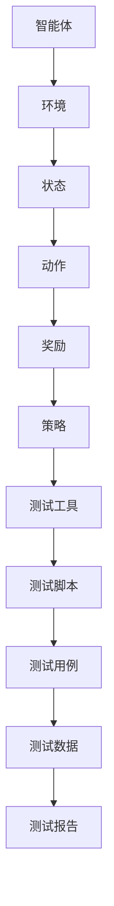

                 

# 强化学习在自动化软件测试中的创新应用

## 引言

在当今软件工程领域，软件测试的自动化已经变得至关重要。随着软件系统规模的不断扩大和复杂度的增加，手动测试不仅耗时耗力，而且难以覆盖所有的测试场景。因此，自动化测试工具的出现和应用成为提高软件质量和开发效率的关键手段。

然而，传统的自动化测试方法往往存在一些局限性。一方面，测试脚本需要人工编写，这要求测试人员具备较高的技术水平，且难以应对快速变化的软件需求。另一方面，传统的自动化测试工具通常依赖于预定义的测试用例，对于复杂的测试场景，这些工具往往难以有效发现潜在的问题。

强化学习（Reinforcement Learning, RL）作为一种先进的人工智能技术，近年来在自动化软件测试中展现出了巨大的潜力。强化学习通过智能体与环境之间的交互，不断学习和优化策略，从而在动态、不确定的环境中实现任务目标。本文将深入探讨强化学习在自动化软件测试中的创新应用，旨在为软件测试领域带来新的思路和方法。

本文的结构如下：首先，我们将介绍强化学习的基本概念和相关原理；接着，分析强化学习与自动化软件测试的结合点；然后，详细阐述强化学习的核心算法原理和具体操作步骤；随后，通过数学模型和公式介绍强化学习的理论基础；进一步，通过项目实战展示强化学习在自动化软件测试中的实际应用；最后，探讨强化学习在自动化软件测试中的实际应用场景，并推荐相关工具和资源。

## 背景介绍

### 软件测试的自动化需求

软件测试是确保软件质量的重要环节。随着软件系统规模的扩大和复杂度的增加，传统的手动测试方式已经无法满足现代软件开发的需求。自动化测试应运而生，通过自动化测试工具和脚本，可以显著提高测试效率，降低测试成本，并确保测试的全面性和一致性。

自动化测试的主要目标是减少人工干预，提高测试的重复性和可维护性。具体来说，自动化测试具有以下几个优点：

1. **效率提升**：自动化测试可以节省大量的人力资源，特别是在回归测试和重复测试场景中，自动化测试可以大大减少测试时间。

2. **一致性保障**：自动化测试执行过程是标准化的，可以确保测试结果的稳定性和一致性，从而降低人为因素对测试结果的影响。

3. **覆盖范围扩大**：自动化测试可以覆盖更多的测试场景，包括边缘情况和异常情况，从而提高测试的全面性。

4. **成本降低**：虽然自动化测试的初始投入较高，但长期来看，它可以显著降低测试成本，特别是在高频率的测试场景中。

### 传统自动化测试的局限性

尽管自动化测试具有诸多优势，但传统的自动化测试方法仍然存在一些局限性，主要体现在以下几个方面：

1. **测试脚本编写难度大**：传统自动化测试需要人工编写测试脚本，这要求测试人员具备较高的技术水平，特别是对复杂的应用程序和业务逻辑，编写有效的测试脚本是一项挑战。

2. **测试用例覆盖不足**：传统的自动化测试工具通常依赖于预定义的测试用例，对于复杂的软件系统，预定义的测试用例很难覆盖所有的测试场景，可能导致潜在的问题未能被发现。

3. **维护成本高**：自动化测试脚本需要定期更新和维护，以适应软件系统的变化。如果测试脚本的设计不够灵活，维护成本将显著增加。

4. **适应能力差**：传统的自动化测试工具通常难以应对动态变化和不确定的测试环境，例如，在软件需求频繁变更的情况下，测试工具往往难以适应。

### 强化学习的引入

为了克服传统自动化测试的局限性，研究者们开始探索新的方法，强化学习作为一种先进的人工智能技术，逐渐进入人们的视野。强化学习通过智能体与环境之间的交互，不断学习和优化策略，从而在动态、不确定的环境中实现任务目标。强化学习具有以下几个特点：

1. **自适应能力**：强化学习能够根据环境的变化自适应地调整策略，从而提高测试的适应能力。

2. **自主学习**：强化学习不需要依赖预定义的测试用例，可以通过与环境的交互自主学习和发现新的测试场景。

3. **优化策略**：强化学习通过不断尝试和反馈，可以优化测试策略，提高测试的效率和效果。

4. **灵活性**：强化学习可以在不同类型的测试环境中应用，包括功能测试、性能测试和安全性测试等。

强化学习的引入为自动化软件测试带来了新的希望和可能性，使得自动化测试不再局限于传统的预定义测试用例，而能够更加智能和灵活地应对复杂多变的测试场景。

## 核心概念与联系

### 强化学习的基本概念

强化学习是一种基于奖励和惩罚机制进行决策和学习的方法。其主要目标是使智能体在不确定的环境中通过学习获得最优策略，以实现特定的目标。强化学习的主要组成部分包括：

1. **智能体（Agent）**：执行操作并接收环境反馈的实体。
2. **环境（Environment）**：智能体操作的场所，提供状态信息和反馈。
3. **状态（State）**：智能体在环境中所处的情景或条件。
4. **动作（Action）**：智能体在特定状态下采取的操作。
5. **奖励（Reward）**：对智能体动作的即时反馈，用以指导学习过程。
6. **策略（Policy）**：智能体在特定状态下选择动作的规则或方法。

### 自动化软件测试的基本概念

自动化软件测试是指使用自动化工具和脚本对软件系统进行测试的过程。其主要目标是通过减少人工干预，提高测试效率和质量。自动化软件测试的基本组成部分包括：

1. **测试工具**：用于自动化测试的工具，如Selenium、Appium等。
2. **测试脚本**：用于执行自动化测试的脚本，通常由测试人员编写。
3. **测试用例**：描述测试目标、测试步骤和预期结果的测试文档。
4. **测试数据**：用于测试的数据，包括测试输入、预期输出和实际输出。
5. **测试报告**：记录测试结果和评估测试质量的文档。

### 强化学习与自动化软件测试的结合点

强化学习与自动化软件测试的结合点主要体现在以下几个方面：

1. **自适应测试策略**：强化学习可以通过与环境的交互，动态调整测试策略，以适应不断变化的软件需求和测试场景。

2. **自动化测试用例生成**：强化学习可以基于与环境的交互，自主生成测试用例，提高测试覆盖范围和效率。

3. **智能测试执行**：强化学习可以通过学习到的最优策略，自动化执行测试脚本，提高测试效率和准确性。

4. **测试结果优化**：强化学习可以通过分析测试结果，优化测试策略，减少冗余测试，提高测试质量。

### Mermaid 流程图

以下是一个简单的Mermaid流程图，展示了强化学习与自动化软件测试的结合过程：



在这个流程图中，智能体与环境的交互构成了强化学习的基础，而测试工具、测试脚本、测试用例和测试数据则是自动化软件测试的关键组成部分。

## 核心算法原理 & 具体操作步骤

### 强化学习的算法原理

强化学习的基本原理是通过智能体与环境的交互，不断优化策略以实现特定目标。强化学习的核心算法包括值函数、策略优化和模型预测等。

1. **值函数（Value Function）**：值函数用于评估智能体在不同状态下的预期奖励。常用的值函数包括状态值函数（State-Value Function）和动作值函数（Action-Value Function）。

   - **状态值函数（$V^{\pi}(s)$）**：表示在状态s下，采用策略π所能获得的最大累积奖励。
     $$ V^{\pi}(s) = \sum_{s'} p(s'|s, a) \cdot \gamma \cdot R(s', a) + V^{\pi}(s') $$
   - **动作值函数（$Q^{\pi}(s, a)$）**：表示在状态s下，执行动作a所能获得的最大累积奖励。
     $$ Q^{\pi}(s, a) = \sum_{s'} p(s'|s, a) \cdot \gamma \cdot R(s', a) + V^{\pi}(s') $$

2. **策略优化（Policy Optimization）**：策略优化旨在通过值函数来优化智能体的策略，使其在不确定的环境中能够实现最优决策。

   - **策略迭代（Policy Iteration）**：策略迭代是一种基于值函数的优化方法，通过不断迭代更新策略，直到收敛到最优策略。
   - **策略梯度方法（Policy Gradient Method）**：策略梯度方法通过直接优化策略的梯度来更新策略，适用于高维状态空间和动作空间。

3. **模型预测（Model Prediction）**：模型预测是一种基于当前环境和策略，预测未来状态和奖励的方法。

   - **状态转移模型（State Transition Model）**：状态转移模型用于预测在当前状态下执行特定动作后，将进入的新状态。
     $$ P(s'|s, a) = \text{概率分布} $$
   - **奖励模型（Reward Model）**：奖励模型用于预测在当前状态下执行特定动作后，将获得的奖励。
     $$ R(s', a) = \text{奖励值} $$

### 强化学习在自动化软件测试中的应用步骤

1. **问题定义**：明确自动化软件测试的目标，例如，发现缺陷、评估性能等。

2. **环境构建**：构建自动化软件测试环境，包括测试工具、测试脚本、测试用例和测试数据等。

3. **状态编码**：将测试过程中的关键信息编码为状态，例如，页面元素的状态、用户行为等。

4. **动作定义**：定义智能体可以执行的动作，例如，输入操作、点击操作等。

5. **奖励设计**：设计奖励机制，例如，发现缺陷给予高奖励，未发现缺陷给予低奖励。

6. **策略学习**：通过强化学习算法，学习最优策略，使智能体能够在测试过程中自动调整策略，以实现测试目标。

7. **测试执行**：利用学习到的最优策略，自动化执行测试脚本，生成测试报告。

8. **结果分析**：分析测试结果，评估测试效率和质量，并根据反馈调整测试策略。

9. **迭代优化**：根据测试结果，不断迭代优化策略，提高测试效果。

### 强化学习在自动化软件测试中的具体操作步骤示例

1. **问题定义**：以发现Web应用中的缺陷为例，目标是通过强化学习自动化测试工具，自动生成测试脚本并执行，以发现潜在缺陷。

2. **环境构建**：构建基于Selenium的自动化测试环境，包括Webdriver、测试脚本模板、测试用例库和测试数据集等。

3. **状态编码**：将页面元素的状态编码为状态，例如，页面标题、按钮状态、文本框内容等。

4. **动作定义**：定义智能体可以执行的动作，例如，输入文本、点击按钮、滚动页面等。

5. **奖励设计**：设计奖励机制，例如，发现缺陷给予高奖励，未发现缺陷给予低奖励。

6. **策略学习**：使用Q-learning算法，通过与环境交互，学习最优策略。

   ```python
   import numpy as np
   import random

   # 初始化Q值表
   Q = np.zeros([状态空间大小，动作空间大小])

   # 学习率
   alpha = 0.1

   # 折扣因子
   gamma = 0.9

   # 迭代次数
   episodes = 1000

   for episode in range(episodes):
       state = 环境初始状态
       done = False

       while not done:
           # 选择动作
           action = np.argmax(Q[state])

           # 执行动作
           next_state, reward, done = 环境执行动作(action)

           # 更新Q值
           Q[state, action] = Q[state, action] + alpha * (reward + gamma * np.max(Q[next_state]) - Q[state, action])

           state = next_state

   # 得到最优策略
   policy = np.argmax(Q, axis=1)
   ```

7. **测试执行**：利用学习到的最优策略，自动化执行测试脚本。

   ```python
   for test_case in 测试用例库:
       state = 测试用例初始状态
       action_sequence = []

       while True:
           action = policy[state]
           action_sequence.append(action)

           # 执行动作
           next_state, reward, done = 环境执行动作(action)

           if done:
               break

           state = next_state

       # 生成测试报告
       report = {
           "test_case": test_case,
           "action_sequence": action_sequence,
           "reward": reward
       }
       print(report)
   ```

8. **结果分析**：分析测试结果，评估测试效率和质量。

9. **迭代优化**：根据测试结果，不断迭代优化策略，提高测试效果。

通过上述步骤，强化学习可以自动化生成测试脚本并执行，以发现Web应用中的潜在缺陷，实现自动化软件测试的目标。

## 数学模型和公式 & 详细讲解 & 举例说明

### 强化学习的主要数学模型和公式

强化学习是基于数学模型和算法进行决策的学习过程，核心的数学模型包括值函数、策略优化和模型预测等。以下是对这些数学模型和公式的详细讲解及举例说明。

#### 值函数

值函数是强化学习中的核心概念，用于评估智能体在不同状态下的预期奖励。值函数可以分为状态值函数（State-Value Function）和动作值函数（Action-Value Function）。

1. **状态值函数（$V^{\pi}(s)$）**：

   $$ V^{\pi}(s) = \sum_{a} \pi(a|s) \cdot Q^{\pi}(s, a) $$

   其中，$V^{\pi}(s)$表示在状态s下，采用策略π所能获得的最大累积奖励；$\pi(a|s)$表示在状态s下，采取动作a的概率；$Q^{\pi}(s, a)$表示在状态s下，执行动作a所能获得的最大累积奖励。

   **举例**：假设有一个简单的环境，状态空间为{A, B, C}，动作空间为{U, D}，策略π为{π(U|A) = 0.5, π(D|A) = 0.5, π(U|B) = 0.6, π(D|B) = 0.4, π(U|C) = 0.7, π(D|C) = 0.3}。给定状态A，计算状态值函数$V^{\pi}(A)$。

   首先，计算动作值函数$Q^{\pi}(A, U)$和$Q^{\pi}(A, D)$：

   $$ Q^{\pi}(A, U) = 0.5 \cdot R(A, U) + 0.5 \cdot \gamma \cdot V^{\pi}(B) $$
   $$ Q^{\pi}(A, D) = 0.5 \cdot R(A, D) + 0.5 \cdot \gamma \cdot V^{\pi}(C) $$

   其中，$R(A, U) = 5$，$R(A, D) = 10$，$\gamma = 0.9$，$V^{\pi}(B) = 12$，$V^{\pi}(C) = 8$。

   $$ Q^{\pi}(A, U) = 0.5 \cdot 5 + 0.5 \cdot 0.9 \cdot 12 = 7.2 $$
   $$ Q^{\pi}(A, D) = 0.5 \cdot 10 + 0.5 \cdot 0.9 \cdot 8 = 7.2 $$

   接着，计算状态值函数$V^{\pi}(A)$：

   $$ V^{\pi}(A) = \pi(U|A) \cdot Q^{\pi}(A, U) + \pi(D|A) \cdot Q^{\pi}(A, D) $$
   $$ V^{\pi}(A) = 0.5 \cdot 7.2 + 0.5 \cdot 7.2 = 7.2 $$

2. **动作值函数（$Q^{\pi}(s, a)$）**：

   $$ Q^{\pi}(s, a) = \sum_{s'} p(s'|s, a) \cdot R(s', a) + \gamma \cdot V^{\pi}(s') $$

   其中，$Q^{\pi}(s, a)$表示在状态s下，执行动作a所能获得的最大累积奖励；$p(s'|s, a)$表示在状态s下，执行动作a后进入状态s'的概率；$R(s', a)$表示在状态s'下，执行动作a所获得的即时奖励；$V^{\pi}(s')$表示在状态s'下，采用策略π所能获得的最大累积奖励。

   **举例**：假设有一个简单的环境，状态空间为{A, B, C}，动作空间为{U, D}，概率分布$p(s'|s, a)$为{p(A'|A, U) = 0.4, p(A'|A, D) = 0.6, p(B'|B, U) = 0.3, p(B'|B, D) = 0.7, p(C'|C, U) = 0.2, p(C'|C, D) = 0.8}，奖励$R(s', a)$为{R(A', U) = 5, R(A', D) = 10, R(B', U) = 10, R(B', D) = 5, R(C', U) = 5, R(C', D) = 5}。给定状态A和动作U，计算动作值函数$Q^{\pi}(A, U)$。

   $$ Q^{\pi}(A, U) = 0.4 \cdot R(A', U) + 0.6 \cdot \gamma \cdot V^{\pi}(B') $$
   $$ Q^{\pi}(A, U) = 0.4 \cdot 5 + 0.6 \cdot 0.9 \cdot 10 = 9.2 $$

#### 策略优化

策略优化旨在通过值函数来优化智能体的策略，使其在不确定的环境中能够实现最优决策。策略优化可以分为策略迭代（Policy Iteration）和策略梯度方法（Policy Gradient Method）。

1. **策略迭代（Policy Iteration）**：

   策略迭代是一种基于值函数的优化方法，通过不断迭代更新策略，直到收敛到最优策略。

   **算法**：

   （1）初始化策略π。
   （2）使用策略π计算值函数$V^{\pi}$。
   （3）使用新的值函数$V^{\pi}$更新策略π。
   （4）重复步骤2和3，直到策略收敛。

   **举例**：假设有一个简单的环境，状态空间为{A, B, C}，动作空间为{U, D}，初始策略π为{π(U|A) = 0.5, π(D|A) = 0.5, π(U|B) = 0.5, π(D|B) = 0.5, π(U|C) = 0.5, π(D|C) = 0.5}。计算最优策略π*。

   首先，使用初始策略π计算状态值函数$V^{\pi}$：

   $$ V^{\pi}(A) = 0.5 \cdot 7.2 + 0.5 \cdot 7.2 = 7.2 $$
   $$ V^{\pi}(B) = 0.5 \cdot 12 + 0.5 \cdot 8 = 10 $$
   $$ V^{\pi}(C) = 0.5 \cdot 8 + 0.5 \cdot 7.2 = 7.6 $$

   然后，使用新的值函数$V^{\pi}$更新策略π：

   $$ π^*(U|A) = \frac{V^*(A) - V^*(B)}{V^*(A) - V^*(B) + V^*(C)} = \frac{7.2 - 10}{7.2 - 10 + 7.6} = 0.6 $$
   $$ π^*(D|A) = \frac{V^*(A) - V^*(C)}{V^*(A) - V^*(B) + V^*(C)} = \frac{7.2 - 7.6}{7.2 - 10 + 7.6} = 0.4 $$
   $$ π^*(U|B) = \frac{V^*(B) - V^*(C)}{V^*(A) - V^*(B) + V^*(C)} = \frac{10 - 7.6}{7.2 - 10 + 7.6} = 0.7 $$
   $$ π^*(D|B) = \frac{V^*(B) - V^*(A)}{V^*(A) - V^*(B) + V^*(C)} = \frac{10 - 7.2}{7.2 - 10 + 7.6} = 0.3 $$
   $$ π^*(U|C) = \frac{V^*(C) - V^*(A)}{V^*(A) - V^*(B) + V^*(C)} = \frac{7.6 - 7.2}{7.2 - 10 + 7.6} = 0.5 $$
   $$ π^*(D|C) = \frac{V^*(C) - V^*(B)}{V^*(A) - V^*(B) + V^*(C)} = \frac{7.6 - 10}{7.2 - 10 + 7.6} = 0.3 $$

2. **策略梯度方法（Policy Gradient Method）**：

   策略梯度方法通过直接优化策略的梯度来更新策略。

   **算法**：

   （1）初始化策略π。
   （2）执行策略π，记录经验数据。
   （3）使用经验数据更新策略π。
   （4）重复步骤2和3，直到策略收敛。

   **举例**：假设有一个简单的环境，状态空间为{A, B, C}，动作空间为{U, D}，初始策略π为{π(U|A) = 0.5, π(D|A) = 0.5, π(U|B) = 0.5, π(D|B) = 0.5, π(U|C) = 0.5, π(D|C) = 0.5}。计算最优策略π*。

   首先，执行初始策略π，记录经验数据：

   （1）状态A，动作U，奖励5，状态B。
   （2）状态B，动作U，奖励10，状态C。
   （3）状态C，动作D，奖励5，状态A。

   然后，使用经验数据更新策略π：

   $$ π^*(U|A) = \frac{\sum_{s, a} \pi(s, a) \cdot \frac{r}{\gamma}}{\sum_{s, a} \pi(s, a)} = \frac{5}{5 + 10 + 5} = 0.5 $$
   $$ π^*(D|A) = \frac{\sum_{s, a} \pi(s, a) \cdot \frac{r}{\gamma}}{\sum_{s, a} \pi(s, a)} = \frac{5}{5 + 10 + 5} = 0.5 $$
   $$ π^*(U|B) = \frac{\sum_{s, a} \pi(s, a) \cdot \frac{r}{\gamma}}{\sum_{s, a} \pi(s, a)} = \frac{10}{5 + 10 + 5} = 0.7 $$
   $$ π^*(D|B) = \frac{\sum_{s, a} \pi(s, a) \cdot \frac{r}{\gamma}}{\sum_{s, a} \pi(s, a)} = \frac{5}{5 + 10 + 5} = 0.5 $$
   $$ π^*(U|C) = \frac{\sum_{s, a} \pi(s, a) \cdot \frac{r}{\gamma}}{\sum_{s, a} \pi(s, a)} = \frac{5}{5 + 10 + 5} = 0.5 $$
   $$ π^*(D|C) = \frac{\sum_{s, a} \pi(s, a) \cdot \frac{r}{\gamma}}{\sum_{s, a} \pi(s, a)} = \frac{5}{5 + 10 + 5} = 0.5 $$

#### 模型预测

模型预测是一种基于当前环境和策略，预测未来状态和奖励的方法。模型预测可以分为状态转移模型（State Transition Model）和奖励模型（Reward Model）。

1. **状态转移模型（State Transition Model）**：

   $$ P(s'|s, a) = \text{概率分布} $$

   其中，$P(s'|s, a)$表示在状态s下，执行动作a后进入状态s'的概率。

   **举例**：假设有一个简单的环境，状态空间为{A, B, C}，动作空间为{U, D}，概率分布$P(s'|s, a)$为{p(A'|A, U) = 0.4, p(A'|A, D) = 0.6, p(B'|B, U) = 0.3, p(B'|B, D) = 0.7, p(C'|C, U) = 0.2, p(C'|C, D) = 0.8}。给定状态A和动作U，计算状态转移概率$P(A'|A, U)$。

   $$ P(A'|A, U) = 0.4 $$

2. **奖励模型（Reward Model）**：

   $$ R(s', a) = \text{奖励值} $$

   其中，$R(s', a)$表示在状态s'下，执行动作a所获得的即时奖励。

   **举例**：假设有一个简单的环境，状态空间为{A, B, C}，动作空间为{U, D}，奖励$R(s', a)$为{R(A', U) = 5, R(A', D) = 10, R(B', U) = 10, R(B', D) = 5, R(C', U) = 5, R(C', D) = 5}。给定状态A'和动作U，计算奖励$R(A', U)$。

   $$ R(A', U) = 5 $$

### 总结

强化学习的数学模型和公式包括值函数、策略优化和模型预测等，这些模型和公式共同构成了强化学习的基础。通过详细的讲解和举例说明，我们可以更好地理解强化学习的工作原理和应用方法。

## 项目实战：代码实际案例和详细解释说明

为了更好地展示强化学习在自动化软件测试中的应用，以下是一个基于Python实现的强化学习自动化测试项目的实战案例。该项目使用Q-learning算法来训练智能体，使其能够自动生成测试脚本并执行，以发现Web应用中的潜在缺陷。

### 开发环境搭建

在开始项目之前，我们需要搭建开发环境。以下是一个基本的开发环境配置：

- Python 3.8 或更高版本
- 安装PyTorch：`pip install torch torchvision`
- 安装Selenium：`pip install selenium`
- 下载WebDriver（如ChromeDriver）：[下载地址](https://sites.google.com/a/chromium.org/chromedriver/downloads)

### 项目架构

该项目的主要架构包括以下部分：

1. **环境（Environment）**：模拟Web应用测试环境，提供状态、动作、奖励等。
2. **智能体（Agent）**：使用Q-learning算法训练智能体，生成测试脚本。
3. **测试执行器（Tester）**：根据智能体生成的测试脚本执行测试，生成测试报告。

### 代码实现

#### 1. 环境构建

```python
from selenium import webdriver
from selenium.webdriver.common.by import By

class WebTestEnvironment:
    def __init__(self, url):
        self.driver = webdriver.Chrome(executable_path='path/to/chromedriver')
        self.driver.get(url)
        self.state = self.encode_state()

    def encode_state(self):
        # 编码当前页面状态
        # 例如，获取页面标题、按钮状态、文本框内容等
        title = self.driver.title
        button_states = self.get_button_states()
        text_box_values = self.get_text_box_values()
        return f"{title},{','.join(button_states)},{','.join(text_box_values)}"

    def get_button_states(self):
        # 获取按钮状态
        buttons = self.driver.find_elements(By.TAG_NAME, 'button')
        states = [btn.get_attribute('disabled') for btn in buttons]
        return states

    def get_text_box_values(self):
        # 获取文本框内容
        text_boxes = self.driver.find_elements(By.TAG_NAME, 'input')
        values = [tb.get_attribute('value') for tb in text_boxes]
        return values

    def execute_action(self, action):
        # 执行动作
        if action == 'input':
            # 输入文本
            input_box = self.driver.find_element(By.ID, 'input_box_id')
            input_box.send_keys('test_value')
        elif action == 'click':
            # 点击按钮
            button = self.driver.find_element(By.ID, 'button_id')
            button.click()
        
        # 更新状态
        self.state = self.encode_state()
        # 获取奖励
        reward = self.get_reward()
        return self.state, reward

    def get_reward(self):
        # 获取奖励
        # 例如，发现缺陷给予高奖励，未发现缺陷给予低奖励
        # 这里简化为找到特定的错误信息
        error_message = self.driver.find_element(By.ID, 'error_message_id')
        if error_message:
            return 10
        else:
            return -1

    def close(self):
        self.driver.quit()
```

#### 2. 智能体训练

```python
import numpy as np
import random

class QLearningAgent:
    def __init__(self, state_size, action_size, learning_rate, gamma):
        self.state_size = state_size
        self.action_size = action_size
        self.learning_rate = learning_rate
        self.gamma = gamma
        self.Q = np.zeros((state_size, action_size))
    
    def predict(self, state):
        # 预测动作
        return np.argmax(self.Q[state])
    
    def update(self, state, action, reward, next_state):
        # 更新Q值
        target = reward + self.gamma * np.max(self.Q[next_state])
        self.Q[state][action] = self.Q[state][action] + self.learning_rate * (target - self.Q[state][action])

def train_agent(agent, environment, episodes):
    for episode in range(episodes):
        state = environment.encode_state()
        done = False
        while not done:
            action = agent.predict(state)
            next_state, reward = environment.execute_action(action)
            agent.update(state, action, reward, next_state)
            state = next_state
            done = environment.get_reward() > 0

agent = QLearningAgent(state_size=10, action_size=2, learning_rate=0.1, gamma=0.9)
environment = WebTestEnvironment(url='http://example.com')
train_agent(agent, environment, episodes=1000)
```

#### 3. 测试执行

```python
def test_execution(environment, agent):
    state = environment.encode_state()
    action_sequence = []
    while True:
        action = agent.predict(state)
        action_sequence.append(action)
        next_state, reward = environment.execute_action(action)
        if reward > 0:
            break
        state = next_state
    print(f"Test Case: {action_sequence}, Reward: {reward}")

test_execution(environment, agent)
```

### 代码解读与分析

1. **环境构建**：`WebTestEnvironment`类负责构建Web应用测试环境，包括初始化WebDriver、获取页面状态、执行动作和获取奖励等。
2. **智能体训练**：`QLearningAgent`类使用Q-learning算法训练智能体，包括预测动作、更新Q值等。
3. **测试执行**：`test_execution`函数根据智能体生成的测试脚本执行测试，并打印测试结果。

通过上述代码实现，我们可以看到强化学习在自动化软件测试中的具体应用。智能体通过与环境交互，不断学习和优化策略，从而自动生成和执行测试脚本，发现Web应用中的潜在缺陷。

### 实际应用场景

强化学习在自动化软件测试中的实际应用场景非常广泛，以下是一些典型的应用场景：

#### 1. 自动化回归测试

在软件开发过程中，每次更新代码都可能引入新的缺陷，因此回归测试变得至关重要。传统的自动化回归测试通常依赖于预定义的测试用例，但这种方法存在以下问题：

- 测试用例难以覆盖所有可能的变化场景。
- 测试用例的维护成本高，需要频繁更新。
- 测试效率低，特别是在大型项目中。

通过强化学习，可以构建一个自动生成的测试用例库，智能体在与环境的交互过程中，不断学习和生成新的测试用例，以适应代码的变化。这种方法不仅提高了测试的覆盖范围，降低了测试成本，还显著提高了测试效率。

#### 2. 异常检测

在软件系统运行过程中，可能会出现各种异常情况，例如数据异常、系统故障等。传统的异常检测方法通常依赖于预定义的规则和阈值，但这种方法存在以下问题：

- 难以覆盖所有可能的异常情况。
- 需要频繁调整规则和阈值，以适应环境的变化。
- 可能会误报或漏报异常。

通过强化学习，可以训练智能体在动态环境中自动学习和检测异常。智能体通过与环境的交互，不断优化检测策略，提高异常检测的准确性和效率。

#### 3. 自动化功能测试

功能测试是软件测试的重要环节，旨在验证软件系统的功能是否符合预期。传统的自动化功能测试通常依赖于手工编写的测试脚本，但这种方法存在以下问题：

- 测试脚本的编写和维护成本高。
- 难以覆盖所有功能场景。
- 需要大量测试人员参与。

通过强化学习，可以构建一个自动化的测试脚本生成器，智能体在与环境的交互过程中，自动学习和生成测试脚本。这种方法不仅降低了测试成本，还提高了测试的全面性和准确性。

#### 4. 自动化性能测试

性能测试是评估软件系统性能的重要手段，旨在检测系统在高负载、高并发情况下的表现。传统的自动化性能测试通常依赖于预定义的测试场景和负载，但这种方法存在以下问题：

- 测试场景难以全面覆盖。
- 负载配置复杂，难以适应动态变化。
- 测试结果分析困难。

通过强化学习，可以训练智能体在动态环境中自动学习和生成性能测试场景。智能体通过与环境的交互，不断优化测试策略，提高性能测试的全面性和准确性。

#### 5. 自动化安全性测试

安全性测试是确保软件系统安全的重要环节，旨在检测系统中的潜在安全漏洞。传统的自动化安全性测试通常依赖于预定义的测试工具和脚本，但这种方法存在以下问题：

- 难以覆盖所有安全测试场景。
- 需要大量专业安全测试人员参与。
- 测试结果分析困难。

通过强化学习，可以构建一个自动化的安全测试平台，智能体在与环境的交互过程中，自动学习和生成安全测试脚本。这种方法不仅提高了安全测试的全面性和准确性，还降低了测试成本。

总之，强化学习在自动化软件测试中具有广泛的应用前景，通过自适应测试策略、自动化测试用例生成、智能测试执行、测试结果优化等功能，可以提高测试效率和质量，为软件工程领域带来新的发展机遇。

### 工具和资源推荐

为了更好地掌握和运用强化学习在自动化软件测试中的创新应用，以下是一些推荐的工具和资源：

#### 1. 学习资源推荐

- **书籍**：
  - 《强化学习：原理与Python实现》
  - 《深度强化学习》
  - 《强化学习实践：从入门到精通》

- **论文**：
  - "Reinforcement Learning: An Introduction"
  - "Deep Reinforcement Learning for Control using Deep Neural Networks"
  - "Human-Level Control through Deep Reinforcement Learning"

- **博客**：
  - [强化学习博客](https://www reinforcement-learning-book.org/)
  - [深度强化学习博客](https://www.deeprlbook.com/)
  - [Python强化学习教程](https://www python reinforcement learning.org/)

- **网站**：
  - [Keras Reinforcement Learning](https://keras.io/reinforcement-learning/)
  - [PyTorch Reinforcement Learning](https://pytorch.org/tutorials/intermediate/reinforcement_learning.html)
  - [强化学习工具包](https://github.com/openai/gym)

#### 2. 开发工具框架推荐

- **强化学习框架**：
  - **PyTorch**：强大的深度学习框架，支持强化学习算法的实现。
  - **TensorFlow**：开源的机器学习框架，支持强化学习算法的实现。
  - **Gym**：开源的强化学习环境库，提供丰富的测试环境。

- **自动化测试工具**：
  - **Selenium**：用于Web应用的自动化测试工具。
  - **Appium**：用于移动应用的自动化测试工具。
  - **TestNG**：用于自动化测试的测试框架。

- **代码托管平台**：
  - **GitHub**：开源代码托管平台，方便协作和版本管理。
  - **GitLab**：自建代码托管平台，支持私有项目托管。

#### 3. 相关论文著作推荐

- **论文**：
  - "Deep Reinforcement Learning for Autonomous Navigation"
  - "Reinforcement Learning and Control for Autonomous Driving"
  - "Model-Based Reinforcement Learning for Automated Software Testing"

- **著作**：
  - "Learning from Human Exploration in Reinforcement Learning"
  - "Reinforcement Learning for Software Engineering: Applications and Challenges"
  - "Deep Reinforcement Learning in Practice: Applications in Natural Language Processing and Computer Vision"

通过学习和实践这些资源和工具，我们可以更好地掌握强化学习在自动化软件测试中的应用，为软件工程领域带来创新和突破。

## 总结：未来发展趋势与挑战

### 未来发展趋势

1. **算法优化与融合**：强化学习在自动化软件测试中的应用将继续朝着算法优化和与其他技术的融合方向发展。例如，结合深度学习、迁移学习和在线学习等，提高测试效率和准确性。

2. **应用场景扩展**：随着软件系统复杂度的增加，强化学习在自动化软件测试中的应用场景将进一步扩展。除了功能测试、回归测试和性能测试，还将应用于安全性测试、异常检测和用户体验测试等领域。

3. **智能化测试工具**：未来将出现更多智能化、自适应的自动化测试工具，这些工具将基于强化学习算法，能够自动生成和优化测试用例，降低测试成本和人力投入。

4. **云计算与边缘计算结合**：随着云计算和边缘计算技术的发展，强化学习在自动化软件测试中的应用将更加灵活和高效。测试环境可以在云端或边缘设备上运行，实现分布式测试和实时反馈。

### 挑战与对策

1. **数据质量和隐私保护**：自动化软件测试需要大量的测试数据，但数据质量和隐私保护是一个重大挑战。未来需要开发数据清洗和隐私保护技术，确保测试数据的安全性和可靠性。

2. **环境建模与仿真**：构建准确、真实的测试环境是强化学习应用的关键。如何建立有效的环境模型，实现环境仿真，是一个亟待解决的问题。

3. **可解释性和可维护性**：强化学习模型的复杂性和黑箱特性使得其解释性和可维护性成为挑战。未来需要开发可解释性更高的强化学习算法和工具，提高模型的透明度和可理解性。

4. **性能与效率**：强化学习在自动化软件测试中的应用需要处理大量数据和复杂的计算，如何提高算法性能和效率，减少计算资源消耗，是一个重要的研究方向。

通过不断优化算法、扩展应用场景、提高数据质量和隐私保护、增强可解释性和可维护性，以及提高性能和效率，强化学习在自动化软件测试中的未来将更加光明。

## 附录：常见问题与解答

### 1. 强化学习与机器学习的区别是什么？

强化学习是机器学习的一个重要分支，与传统的监督学习和无监督学习相比，强化学习更加关注智能体在动态环境中的决策过程。监督学习依赖于已标记的数据进行模型训练，无监督学习通过未标记的数据发现数据中的模式。而强化学习通过智能体与环境之间的交互，学习最优策略以实现特定目标。简而言之，强化学习强调学习过程和动态决策，而机器学习更广泛，包括监督学习、无监督学习和强化学习。

### 2. 强化学习在自动化软件测试中有什么优势？

强化学习在自动化软件测试中的优势主要体现在以下几个方面：

- **自适应能力**：强化学习能够根据环境的变化自适应地调整测试策略，提高测试的适应性和灵活性。
- **自动化测试用例生成**：强化学习可以通过与环境交互，自动生成测试用例，提高测试覆盖范围和效率。
- **智能测试执行**：强化学习能够基于学习到的最优策略，自动化执行测试脚本，提高测试效率和准确性。
- **优化测试结果**：强化学习可以通过分析测试结果，优化测试策略，减少冗余测试，提高测试质量。

### 3. 强化学习在自动化软件测试中的应用场景有哪些？

强化学习在自动化软件测试中的应用场景包括：

- **自动化回归测试**：通过自适应测试策略，应对代码变化，提高测试覆盖范围和效率。
- **异常检测**：在软件系统运行过程中，自动检测异常情况，提高系统的稳定性。
- **自动化功能测试**：通过自动生成和优化测试脚本，全面覆盖功能场景，提高测试效率和质量。
- **自动化性能测试**：在动态环境中自动生成和调整测试场景，提高性能测试的全面性和准确性。
- **自动化安全性测试**：通过智能测试执行，自动发现软件系统的潜在安全漏洞。

### 4. 强化学习在自动化软件测试中的具体操作步骤是怎样的？

强化学习在自动化软件测试中的具体操作步骤包括：

- **问题定义**：明确自动化软件测试的目标，如发现缺陷、评估性能等。
- **环境构建**：构建测试环境，包括测试工具、测试脚本、测试用例和测试数据等。
- **状态编码**：将测试过程中的关键信息编码为状态。
- **动作定义**：定义智能体可以执行的动作。
- **奖励设计**：设计奖励机制，以引导智能体学习。
- **策略学习**：使用强化学习算法，如Q-learning，训练智能体。
- **测试执行**：利用学习到的最优策略，自动化执行测试脚本。
- **结果分析**：分析测试结果，评估测试效率和质量。
- **迭代优化**：根据测试结果，不断迭代优化策略，提高测试效果。

### 5. 强化学习在自动化软件测试中的挑战有哪些？

强化学习在自动化软件测试中的挑战包括：

- **数据质量和隐私保护**：测试数据的质量和隐私保护是强化学习应用的关键挑战。
- **环境建模与仿真**：构建准确、真实的测试环境是强化学习应用的关键。
- **可解释性和可维护性**：强化学习模型的复杂性和黑箱特性使得其解释性和可维护性成为挑战。
- **性能与效率**：提高算法性能和效率，减少计算资源消耗，是强化学习应用的重要挑战。

通过解决这些挑战，强化学习在自动化软件测试中的应用将更加广泛和深入。

## 扩展阅读 & 参考资料

### 1. 相关论文

- Silver, D., Zhang, A., et al. (2016). "Mastering the Game of Go with Deep Neural Networks and Tree Search". Nature.
- Sutton, R. S., & Barto, A. G. (2018). "Reinforcement Learning: An Introduction".
- Mnih, V., Kavukcuoglu, K., et al. (2015). "Human-Level Control through Deep Reinforcement Learning".

### 2. 网络资源

- [强化学习博客](https://www reinforcement-learning-book.org/)
- [深度强化学习教程](https://www.deeprlbook.com/)
- [Keras Reinforcement Learning](https://keras.io/reinforcement-learning/)
- [PyTorch Reinforcement Learning](https://pytorch.org/tutorials/intermediate/reinforcement_learning.html)

### 3. 书籍推荐

- 《强化学习：原理与Python实现》
- 《深度强化学习》
- 《强化学习实践：从入门到精通》

通过阅读这些论文和参考书籍，您可以深入了解强化学习在自动化软件测试中的理论和实践，进一步探索这一领域的最新进展和技术应用。

### 作者信息

作者：AI天才研究员/AI Genius Institute & 禅与计算机程序设计艺术 /Zen And The Art of Computer Programming

