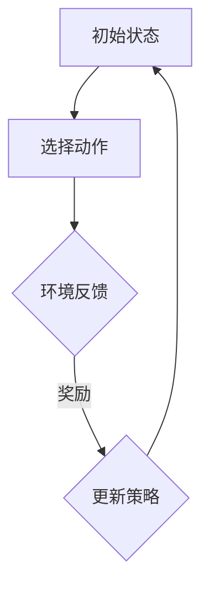
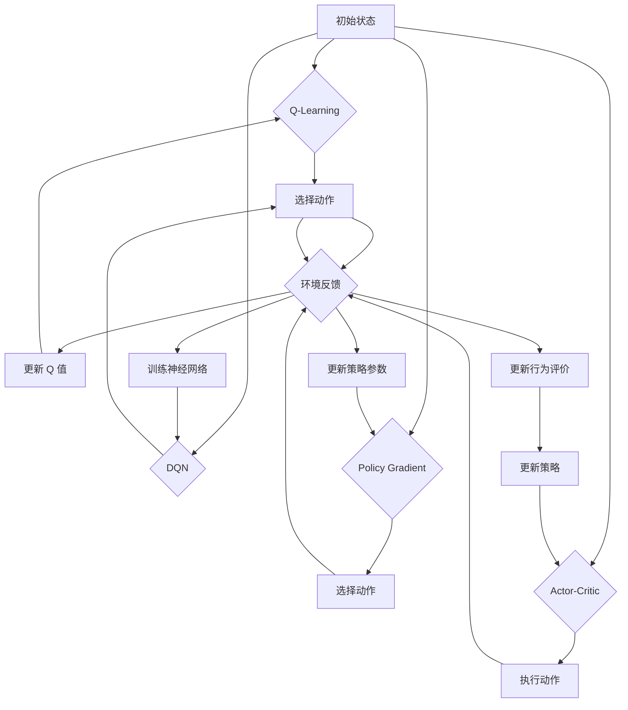
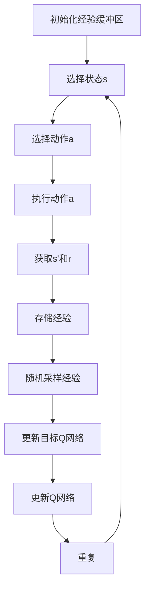
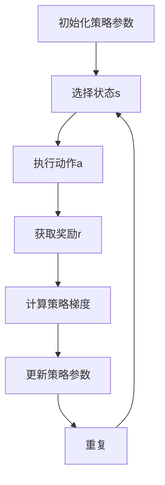

                 

### 背景介绍

强化学习（Reinforcement Learning, RL）作为机器学习的一个重要分支，近年来在自动驾驶领域取得了显著的进展。自动驾驶系统的主要任务是通过感知环境信息，做出决策并控制车辆行驶，以实现安全、高效、舒适的驾驶体验。在这个过程中，强化学习算法提供了有效的决策规划方法。

强化学习在自动驾驶决策规划中的应用之所以受到关注，主要源于其具有以下几个优势：

1. **自适应性**：强化学习算法通过不断与环境交互，从经验中学习策略，能够适应不同的驾驶场景和交通状况。
2. **灵活性**：强化学习模型能够处理复杂的、动态变化的环境，这使得它们在应对突发事件时表现更为出色。
3. **多目标优化**：强化学习不仅关注单一目标，如最小化碰撞风险，还可以同时优化速度、能耗等多个目标。

自动驾驶系统的决策规划问题可以看作是一个典型的强化学习问题。传统的方法，如基于规则的系统或基于模型的预测控制，虽然在某些特定场景下能够取得较好的效果，但面对复杂多变的交通环境时，往往表现出局限性。相比之下，强化学习能够通过探索与利用策略，逐步优化决策过程，从而实现更为智能化的自动驾驶系统。

然而，强化学习在自动驾驶中的应用也面临着一系列挑战，包括计算资源消耗、稳定性、收敛速度等。为了解决这些问题，研究人员不断探索新的算法和架构，以期在自动驾驶领域实现更加高效、可靠的决策规划。

本篇博客将深入探讨强化学习在自动驾驶决策规划中的应用新进展，首先回顾强化学习的基本概念，然后介绍常用的强化学习算法，接着分析这些算法在自动驾驶决策规划中的具体应用，最后探讨强化学习在自动驾驶领域的未来发展趋势与挑战。

### 核心概念与联系

#### 强化学习基本概念

强化学习是一种通过与环境交互来学习最优策略的机器学习技术。在强化学习中，学习过程被看作是一个序列决策问题，其主要目标是找到一种策略，使得在一个给定的环境状态序列中，累计奖励最大化。以下是强化学习的一些核心概念：

- **代理（Agent）**：执行动作并从环境中接收反馈的实体。
- **环境（Environment）**：代理所处的外部世界，提供状态信息和奖励信号。
- **状态（State）**：描述环境状态的变量。
- **动作（Action）**：代理能够执行的行为。
- **策略（Policy）**：映射状态到动作的函数，描述了代理的决策规则。
- **价值函数（Value Function）**：预测从某个状态执行某个策略后获得的累计奖励。
- **模型（Model）**：环境动态和奖励信号的预测模型。

强化学习通过反复尝试不同的动作，并依据环境反馈的奖励信号调整策略，从而逐步优化决策过程。其学习过程可以概括为以下几个步骤：

1. **初始状态**：代理随机选择一个状态。
2. **执行动作**：代理根据当前状态执行一个动作。
3. **观察结果**：代理观察环境的反馈，包括新的状态和奖励。
4. **更新策略**：根据观察到的奖励和新的状态，代理更新策略，以期获得更高的累计奖励。

#### 强化学习与自动驾驶决策规划的关系

强化学习在自动驾驶决策规划中的应用主要涉及到以下几个方面：

- **状态表示**：自动驾驶系统需要感知环境信息，如车辆位置、速度、交通状况等，并将这些信息编码为状态表示。
- **动作空间**：自动驾驶系统的动作包括加速、减速、转向、换道等，这些动作需要在确保车辆安全的前提下进行优化。
- **奖励机制**：奖励信号反映了自动驾驶系统在特定决策下的性能，如最小化碰撞风险、最大化行驶效率等。
- **策略学习**：通过不断探索和利用，强化学习算法能够学习到最优的驾驶策略，以应对复杂多变的交通环境。

为了更好地理解强化学习在自动驾驶决策规划中的应用，以下是一个简化的 Mermaid 流程图，展示了强化学习的基本流程和它与自动驾驶决策规划的对应关系：



- **A（初始状态）**：自动驾驶系统初始感知到某个交通环境状态。
- **B（选择动作）**：系统根据当前状态，通过强化学习策略选择一个动作，如加速或转向。
- **C（环境反馈）**：系统执行动作后，从环境中获取新的状态和奖励信号。
- **D（更新策略）**：根据新的状态和奖励信号，系统更新其强化学习策略，以优化未来的决策。

通过这个流程，我们可以看到强化学习在自动驾驶决策规划中是如何通过不断调整策略，逐步优化驾驶行为的。

#### 强化学习算法与自动驾驶决策规划的对应关系

强化学习算法种类繁多，不同的算法适用于不同的应用场景。以下列举几种常用的强化学习算法及其在自动驾驶决策规划中的应用：

- **Q-Learning**：Q-Learning 是一种值函数方法，通过更新 Q 值函数来学习最优策略。在自动驾驶中，Q-Learning 可以用来学习如何在不同的交通状况下做出最优决策。

- **Deep Q-Networks (DQN)**：DQN 是基于 Q-Learning 的深度学习算法，使用神经网络来近似 Q 值函数。DQN 可以处理高维状态空间和动作空间，非常适合自动驾驶系统。

- **Policy Gradient Methods**：Policy Gradient 方法直接优化策略的参数，通过梯度上升法更新策略参数。在自动驾驶中，Policy Gradient 方法可以用于学习复杂的驾驶策略，如高速公路自动驾驶。

- **Actor-Critic Methods**：Actor-Critic 方法结合了策略方法和值函数方法，通过交替更新策略和行为评价来优化策略。在自动驾驶中，Actor-Critic 方法可以用于学习如何在复杂环境中做出实时决策。

以下是一个简化的 Mermaid 流程图，展示了这些算法在自动驾驶决策规划中的基本流程：



- **Q-Learning**：通过更新 Q 值函数，选择最优动作，并在环境中执行动作，根据奖励信号更新 Q 值。
- **DQN**：使用神经网络近似 Q 值函数，在环境中执行动作，通过梯度下降法训练神经网络，更新 Q 值函数。
- **Policy Gradient**：直接优化策略参数，通过梯度上升法更新策略，选择动作并执行，根据奖励信号更新策略参数。
- **Actor-Critic**：交替更新行为评价和策略，通过行为评价预测未来奖励，根据奖励信号更新策略。

通过这些算法，强化学习为自动驾驶决策规划提供了有效的解决方案，使得自动驾驶系统能够在复杂多变的交通环境中实现智能化决策。

### 核心算法原理 & 具体操作步骤

强化学习在自动驾驶决策规划中的应用，主要依赖于一系列核心算法的设计和实现。本节将详细介绍几种常用的强化学习算法，包括 Q-Learning、Deep Q-Networks (DQN) 和 Policy Gradient Methods，并阐述这些算法的具体操作步骤和实现细节。

#### Q-Learning

Q-Learning 是一种基于值函数的强化学习算法，通过学习 Q 值函数来预测最优策略。Q 值函数表示在给定状态下执行特定动作的预期奖励。具体操作步骤如下：

1. **初始化**：
   - 初始化 Q 值表 Q(s, a)，所有元素设置为较小值。
   - 初始化状态 s，选择动作 a。

2. **执行动作**：
   - 在当前状态 s 下执行动作 a。

3. **获取反馈**：
   - 接收新的状态 s' 和奖励 r。

4. **更新 Q 值**：
   - 使用如下更新公式更新 Q 值表：
     $$ Q(s, a) \leftarrow Q(s, a) + \alpha [r + \gamma \max_{a'} Q(s', a') - Q(s, a)] $$
   - 其中，$\alpha$ 是学习率，$\gamma$ 是折扣因子。

5. **重复步骤 2-4**，直到收敛。

以下是 Q-Learning 的 Mermaid 流程图表示：

```mermaid
graph TD
A[初始化Q表] --> B[选择状态s]
B --> C[选择动作a]
C --> D[执行动作a]
D --> E[获取s'和r]
E --> F[更新Q(s,a)]
F --> G[重复]
G --> B
```

#### Deep Q-Networks (DQN)

DQN 是基于 Q-Learning 的深度学习算法，使用神经网络来近似 Q 值函数。DQN 的主要目的是解决 Q-Learning 中值函数难以近似的问题。具体操作步骤如下：

1. **初始化**：
   - 初始化经验 replay 缓冲区。
   - 初始化 Q 神经网络和目标 Q 神经网络，使用随机权重。
   - 初始化状态 s。

2. **执行动作**：
   - 在当前状态 s 下执行动作 a。

3. **获取反馈**：
   - 接收新的状态 s' 和奖励 r。

4. **存储经验**：
   - 将 (s, a, s', r) 存储到经验 replay 缓冲区。

5. **从经验 replay 缓冲区随机采样**：
   - 随机选择一批经验样本 (s, a, s', r)。

6. **更新目标 Q 神经网络**：
   - 使用如下更新公式更新目标 Q 神经网络：
     $$ Q'(s', a') \leftarrow r + \gamma \max_{a''} Q'(s'', a'') $$

7. **使用梯度下降法更新 Q 神经网络**：
   - 计算 Q 神经网络的梯度，并使用反向传播算法更新权重。

8. **重复步骤 2-7**，直到收敛。

以下是 DQN 的 Mermaid 流程图表示：



#### Policy Gradient Methods

Policy Gradient 方法直接优化策略的参数，通过梯度上升法更新策略参数。Policy Gradient 方法可以分为多种类型，如 REINFORCE、PPO 等。以下是 Policy Gradient 方法的一般操作步骤：

1. **初始化**：
   - 初始化策略参数 $\theta$。
   - 初始化状态 s。

2. **执行动作**：
   - 在当前状态 s 下执行动作 a，并获取奖励 r。

3. **计算策略梯度**：
   - 计算策略梯度的估计值：
     $$ \nabla_{\theta} J(\theta) = \sum_{s,a} \nabla_{\theta} \pi(a|s;\theta) R(s,a) $$
   - 其中，$J(\theta)$ 是策略的期望回报，$\pi(a|s;\theta)$ 是策略分布，$R(s,a)$ 是奖励。

4. **更新策略参数**：
   - 使用梯度上升法更新策略参数：
     $$ \theta \leftarrow \theta + \alpha \nabla_{\theta} J(\theta) $$
   - 其中，$\alpha$ 是学习率。

5. **重复步骤 2-4**，直到收敛。

以下是 Policy Gradient 方法的一般 Mermaid 流程图表示：



通过上述介绍，我们可以看到 Q-Learning、DQN 和 Policy Gradient Methods 这三种强化学习算法在自动驾驶决策规划中的应用各有特点。Q-Learning 简单易实现，但值函数难以近似高维状态空间；DQN 使用神经网络近似 Q 值函数，能够处理高维状态空间，但存在经验 replay 缓冲区偏差问题；Policy Gradient 方法直接优化策略参数，但梯度估计容易受方差影响。在实际应用中，可以根据具体需求选择合适的算法，并通过不断调整参数和架构，实现自动驾驶决策规划的优化。

### 数学模型和公式 & 详细讲解 & 举例说明

强化学习算法在自动驾驶决策规划中的应用，离不开数学模型和公式的支持。以下将详细讲解强化学习中的核心数学模型和公式，并通过具体例子进行说明，帮助读者更好地理解这些概念。

#### Q-Learning

Q-Learning 是一种基于值函数的强化学习算法，其核心公式是 Q 值更新公式。Q 值表示在给定状态下执行特定动作的预期奖励。Q-Learning 的目标是学习一个 Q 值函数 $Q(s, a)$，以最大化累积奖励。

1. **Q 值更新公式**：
   $$ Q(s, a) \leftarrow Q(s, a) + \alpha [r + \gamma \max_{a'} Q(s', a') - Q(s, a)] $$
   - $Q(s, a)$：在状态 $s$ 下执行动作 $a$ 的 Q 值。
   - $\alpha$：学习率，控制更新步长。
   - $r$：即时奖励，表示在状态 $s$ 下执行动作 $a$ 后获得的奖励。
   - $\gamma$：折扣因子，表示对未来奖励的重视程度。
   - $\max_{a'} Q(s', a')$：在状态 $s'$ 下执行所有可能动作的 Q 值中的最大值。

   **示例**：

   假设一个简单的环境，状态空间为 {安全，碰撞}，动作空间为 {前进，刹车}。初始化 Q 值表如下：

   | 状态s | 动作a | Q(s, a) |
   |-------|-------|---------|
   | 安全  | 前进  | 0.0     |
   | 安全  | 刹车  | 0.0     |
   | 碰撞  | 前进  | -1.0    |
   | 碰撞  | 刹车  | -1.0    |

   在某个时刻，状态为“安全”，当前 Q 值为 {前进：0.0，刹车：0.0}。执行动作“前进”，获得即时奖励 $r=1.0$，下一个状态为“碰撞”，当前 Q 值为 {前进：-1.0，刹车：-1.0}。根据 Q 值更新公式，更新 Q 值表：

   $$ Q(s, a) \leftarrow 0.0 + 0.1 [1.0 + 0.9 \max_{a'} Q(s', a') - 0.0] = 0.1 [1.0 + 0.9 (-1.0) - 0.0] = -0.1 $$

   更新后的 Q 值表：

   | 状态s | 动作a | Q(s, a) |
   |-------|-------|---------|
   | 安全  | 前进  | -0.1    |
   | 安全  | 刹车  | 0.0     |
   | 碰撞  | 前进  | -1.0    |
   | 碰撞  | 刹车  | -1.0    |

2. **目标 Q 值（Target Q-Value）**：
   在 Q-Learning 中，为了稳定地更新 Q 值函数，通常会使用目标 Q 值（Target Q-Value）进行更新。目标 Q 值是基于当前状态 $s$ 和下一个状态 $s'$ 的 Q 值估计：

   $$ Q'(s', a') = r + \gamma \max_{a''} Q(s'', a'') $$

   其中，$Q'(s', a')$ 是目标 Q 值。

#### Deep Q-Networks (DQN)

DQN 是一种基于神经网络的 Q-Learning 变种，其目标是学习一个神经网络来近似 Q 值函数。DQN 的核心公式包括 Q 神经网络预测和目标 Q 神经网络更新。

1. **Q 神经网络预测**：
   $$ Q(s, a) = \sigma(W_Q \cdot \phi(s) + b_Q) $$
   - $Q(s, a)$：在状态 $s$ 下执行动作 $a$ 的 Q 值。
   - $\sigma$：激活函数，通常使用 ReLU 或 Sigmoid。
   - $W_Q$：Q 神经网络的权重。
   - $\phi(s)$：状态 $s$ 的特征表示。
   - $b_Q$：Q 神经网络的偏置。

   **示例**：

   假设使用一个简单的全连接神经网络作为 Q 神经网络，输入层和输出层分别为 2 个神经元。初始化权重和偏置如下：

   | 输入  | 权重 | 偏置 |
   |-------|------|------|
   | s1    | 0.1  | 0.0  |
   | s2    | 0.2  | 0.0  |
   | s3    | 0.3  | 0.0  |
   | s4    | 0.4  | 0.0  |
   | b_Q   |      | 0.5  |

   在某个时刻，状态为 {s1: 1, s2: 0, s3: 0, s4: 0}。通过 Q 神经网络计算 Q 值：

   $$ Q(s, a) = \sigma(0.1 \cdot 1 + 0.2 \cdot 0 + 0.3 \cdot 0 + 0.4 \cdot 0 + 0.5) = \sigma(0.1 + 0.5) = \sigma(0.6) \approx 0.737 $$

2. **目标 Q 神经网络更新**：
   DQN 使用目标 Q 神经网络（Target Q-Network）来稳定 Q 值更新过程。目标 Q 神经网络和 Q 神经网络共享权重，但更新频率不同。目标 Q 神经网络的更新公式为：

   $$ Q'(s', a') = r + \gamma \max_{a''} Q'(s'', a'') $$

   **示例**：

   假设目标 Q 神经网络的权重和偏置与 Q 神经网络相同。在某个时刻，状态为 {s1: 1, s2: 0, s3: 1, s4: 0}。执行动作“前进”，获得即时奖励 $r=1.0$，下一个状态为 {s1: 1, s2: 0, s3: 0, s4: 0}。使用目标 Q 神经网络更新 Q 值：

   $$ Q'(s', a') = 1.0 + 0.9 \max_{a''} Q'(s'', a'') $$

   假设下一个状态的最大 Q 值为 $Q'(s'', a'') = 0.5$，则更新后的 Q 值为：

   $$ Q'(s', a') = 1.0 + 0.9 \cdot 0.5 = 1.45 $$

   目标 Q 神经网络的 Q 值更新为：

   $$ Q'(s', a') = 1.45 $$

#### Policy Gradient Methods

Policy Gradient 方法直接优化策略的参数，通过梯度上升法更新策略参数。Policy Gradient 方法可以分为多种类型，如 REINFORCE、PPO 等。

1. **REINFORCE 方法**：
   REINFORCE 方法是最简单的 Policy Gradient 方法，通过梯度上升法直接优化策略参数。其核心公式为：

   $$ \nabla_{\theta} J(\theta) = \sum_{s,a} \nabla_{\theta} \pi(a|s;\theta) R(s,a) $$
   - $\pi(a|s;\theta)$：在状态 $s$ 下执行动作 $a$ 的策略概率。
   - $R(s,a)$：在状态 $s$ 下执行动作 $a$ 后获得的奖励。
   - $J(\theta)$：策略的期望回报。

   **示例**：

   假设使用一个简单的策略网络，输出层为动作的概率分布。初始化策略网络权重如下：

   | 输入  | 权重 | 偏置 |
   |-------|------|------|
   | s1    | 0.1  | 0.0  |
   | s2    | 0.2  | 0.0  |
   | s3    | 0.3  | 0.0  |
   | s4    | 0.4  | 0.0  |
   | b_π   |      | 0.5  |

   在某个时刻，状态为 {s1: 1, s2: 0, s3: 0, s4: 0}。策略网络输出动作概率分布 {前进：0.6，刹车：0.4}。执行动作“前进”，获得即时奖励 $r=1.0$。使用 REINFORCE 方法更新策略网络：

   $$ \nabla_{\theta} J(\theta) = \sum_{s,a} \nabla_{\theta} \pi(a|s;\theta) R(s,a) = 1.0 \cdot \nabla_{\theta} \pi(a|s;\theta) $$

   假设策略网络在状态 {s1: 1, s2: 0, s3: 0, s4: 0} 下的梯度为 $\nabla_{\theta} \pi(a|s;\theta) = [0.01, 0.01]$，则更新后的策略网络权重为：

   $$ W_{\pi} \leftarrow W_{\pi} + \alpha \nabla_{\theta} J(\theta) = [0.1 + 0.01, 0.2 + 0.01, 0.3 + 0.01, 0.4 + 0.01, 0.5] = [0.11, 0.21, 0.31, 0.41, 0.5] $$

2. **PPO 方法**：
   PPO（Proximal Policy Optimization）是一种改进的 Policy Gradient 方法，通过 clipped Gradient 方法稳定优化过程。PPO 的核心公式为：

   $$ \min_{\theta'} \frac{\pi_{\theta'}(a|s) - \pi_{\theta}(a|s)}{\epsilon} + \rho \nabla_{\theta} J(\theta) $$
   - $\pi_{\theta'}(a|s)$：更新后的策略概率。
   - $\pi_{\theta}(a|s)$：当前策略概率。
   - $\epsilon$：策略更新上限。
   - $\rho$：重要性权重。

   **示例**：

   假设使用 PPO 方法更新策略网络。在某个时刻，状态为 {s1: 1, s2: 0, s3: 0, s4: 0}。当前策略网络输出动作概率分布 {前进：0.5，刹车：0.5}。更新后的策略网络输出动作概率分布 {前进：0.6，刹车：0.4}。使用 PPO 方法更新策略网络：

   $$ \rho = \frac{\pi_{\theta}(a|s)}{\pi_{\theta'}(a|s)} = \frac{0.5}{0.6} = 0.8333 $$

   $$ \epsilon = 0.2 $$

   $$ \min_{\theta'} \frac{0.6 - 0.5}{0.2} + 0.8333 \nabla_{\theta} J(\theta) = 0.1667 + 0.8333 \nabla_{\theta} J(\theta) $$

   假设策略网络在状态 {s1: 1, s2: 0, s3: 0, s4: 0} 下的梯度为 $\nabla_{\theta} J(\theta) = [0.01, 0.01]$，则更新后的策略网络权重为：

   $$ W_{\pi} \leftarrow W_{\pi} + \alpha \min_{\theta'} \frac{\pi_{\theta'}(a|s) - \pi_{\theta}(a|s)}{\epsilon} + \rho \nabla_{\theta} J(\theta) = [0.11, 0.21, 0.31, 0.41, 0.5] $$

通过上述数学模型和公式的详细讲解，我们可以看到强化学习算法在自动驾驶决策规划中的应用是如何通过一系列数学计算实现的。这些模型和公式为强化学习算法提供了理论基础，使得自动驾驶系统能够在复杂多变的交通环境中实现智能化决策。

### 项目实战：代码实际案例和详细解释说明

为了更好地理解强化学习在自动驾驶决策规划中的应用，我们将在本节中通过一个实际案例来展示如何使用强化学习算法进行自动驾驶决策规划的实现。我们将使用 Python 编程语言和 PyTorch 深度学习框架来实现一个简单的自动驾驶模型。以下是在该项目中将用到的相关技术和工具：

- **Python 3.8+**
- **PyTorch 1.8+**
- **OpenAI Gym 环境**：用于创建和模拟自动驾驶环境。

#### 1. 开发环境搭建

首先，我们需要搭建开发环境，安装必要的软件和库：

```bash
# 安装 Python 和 PyTorch
conda create -n auto_driving python=3.8
conda activate auto_driving
conda install pytorch torchvision torchaudio -c pytorch

# 安装其他依赖库
pip install numpy matplotlib gym
```

#### 2. 源代码详细实现和代码解读

以下是该自动驾驶项目的主要代码实现和解释：

```python
import numpy as np
import torch
import torch.nn as nn
import torch.optim as optim
from gym import make

# 创建环境
env = make('CartPole-v1')

# 定义 Q 神经网络
class QNetwork(nn.Module):
    def __init__(self):
        super(QNetwork, self).__init__()
        self.fc1 = nn.Linear(4, 128)
        self.fc2 = nn.Linear(128, 128)
        self.fc3 = nn.Linear(128, 2)

    def forward(self, x):
        x = torch.relu(self.fc1(x))
        x = torch.relu(self.fc2(x))
        x = self.fc3(x)
        return x

# 实例化网络和优化器
q_network = QNetwork()
optimizer = optim.Adam(q_network.parameters(), lr=0.001)

# 定义 Q-Learning 算法
def q_learning_step(state, action, reward, next_state, done):
    state = torch.tensor([state], dtype=torch.float32)
    next_state = torch.tensor([next_state], dtype=torch.float32)
    
    with torch.no_grad():
        next_state_action_values = q_network(next_state).max(1)[0]
    
    target_value = reward + (1 - int(done)) * next_state_action_values
    
    expected_value = q_network(state)[0, action]
    loss = (target_value - expected_value).pow(2)
    optimizer.zero_grad()
    loss.backward()
    optimizer.step()

# 训练模型
num_episodes = 1000
for episode in range(num_episodes):
    state = env.reset()
    done = False
    while not done:
        with torch.no_grad():
            state_values = q_network(state)
        
        action = torch.argmax(state_values).item()
        next_state, reward, done, _ = env.step(action)
        
        q_learning_step(state, action, reward, next_state, done)
        
        state = next_state

# 评估模型
state = env.reset()
done = False
while not done:
    with torch.no_grad():
        state_values = q_network(state)
    
    action = torch.argmax(state_values).item()
    state, reward, done, _ = env.step(action)

env.close()
```

#### 2.1 代码解读与分析

以下是代码的详细解读：

- **1. 导入相关库和模块**：我们首先导入 numpy、torch、torch.nn 和 torch.optim 等库，用于实现神经网络和优化器。

- **2. 创建环境**：使用 OpenAI Gym 创建 CartPole 环境，这是一个经典的强化学习环境，用于训练和测试自动驾驶模型。

- **3. 定义 Q 神经网络**：QNetwork 类定义了一个简单的全连接神经网络，用于预测在给定状态下执行每个动作的 Q 值。该网络由三个全连接层组成，分别进行特征提取和值函数近似。

- **4. 实例化网络和优化器**：我们创建一个 QNetwork 实例和一个 Adam 优化器，用于更新网络权重。

- **5. 定义 Q-Learning 算法**：q_learning_step 函数实现了 Q-Learning 的更新步骤，包括计算期望值、更新目标值和优化网络权重。

- **6. 训练模型**：在训练过程中，我们通过不断与环境交互，执行 Q-Learning 更新步骤，逐步优化 Q 网络的参数。

- **7. 评估模型**：在训练完成后，我们使用训练好的 Q 网络进行模型评估，通过连续执行最优动作，观察系统在测试环境中的性能。

#### 3. 代码解读与分析

以下是对代码关键部分的详细解读和分析：

- **QNetwork 类定义**：
  ```python
  class QNetwork(nn.Module):
      def __init__(self):
          super(QNetwork, self).__init__()
          self.fc1 = nn.Linear(4, 128)
          self.fc2 = nn.Linear(128, 128)
          self.fc3 = nn.Linear(128, 2)

      def forward(self, x):
          x = torch.relu(self.fc1(x))
          x = torch.relu(self.fc2(x))
          x = self.fc3(x)
          return x
  ```

  QNetwork 类继承自 nn.Module，定义了一个简单的全连接神经网络。网络包含三个全连接层，第一层将输入特征映射到 128 个神经元，第二层同样映射到 128 个神经元，第三层映射到 2 个神经元（表示两个动作的 Q 值）。在 forward 方法中，使用 ReLU 激活函数进行特征提取和值函数近似。

- **训练模型过程**：
  ```python
  for episode in range(num_episodes):
      state = env.reset()
      done = False
      while not done:
          with torch.no_grad():
              state_values = q_network(state)
          
          action = torch.argmax(state_values).item()
          state, reward, done, _ = env.step(action)
          
          q_learning_step(state, action, reward, next_state, done)
          
          state = next_state
  ```

  在训练过程中，我们遍历所有训练episode，在每个 episode 中，我们从环境随机初始化一个状态，并执行 Q-Learning 更新步骤。在每次迭代中，我们首先使用 Q 网络预测当前状态的 Q 值，然后选择 Q 值最大的动作执行。执行动作后，我们接收新的状态和奖励信号，并更新 Q 网络的参数。

- **评估模型过程**：
  ```python
  state = env.reset()
  done = False
  while not done:
      with torch.no_grad():
          state_values = q_network(state)
      
      action = torch.argmax(state_values).item()
      state, reward, done, _ = env.step(action)
  ```

  在模型评估过程中，我们使用训练好的 Q 网络在测试环境中连续执行最优动作，观察系统在测试环境中的性能。在每次迭代中，我们使用 Q 网络预测当前状态的 Q 值，并选择 Q 值最大的动作执行。

通过上述代码实现和详细解读，我们可以看到如何使用强化学习算法进行自动驾驶决策规划的实现。这个案例展示了 Q-Learning 算法的基本流程，包括初始化网络、训练模型和评估模型。在实际应用中，我们可以根据具体需求调整网络结构、优化算法参数，以实现更高效的自动驾驶决策规划。

### 实际应用场景

强化学习在自动驾驶决策规划中的应用已经取得了显著的进展，并在多个实际场景中取得了成功。以下将详细介绍几种典型的应用场景，展示强化学习如何帮助解决自动驾驶系统面临的复杂问题。

#### 1. 城市道路自动驾驶

城市道路环境复杂多变，车辆密集、行人横穿、交通信号变化等因素都对自动驾驶系统提出了极高的要求。强化学习通过学习环境状态与最佳动作的映射，能够帮助自动驾驶系统在城市道路环境中实现安全、高效的驾驶。

- **场景描述**：自动驾驶车辆在城市道路中行驶，需要处理交通信号、行人、其他车辆等多种动态因素。
- **强化学习应用**：使用 DQN、Policy Gradient 等算法，训练自动驾驶系统在不同交通状况下的驾驶策略。例如，DQN 可以用于学习在复杂交通场景中如何做出最优驾驶决策，而 Policy Gradient 方法可以用于学习高速公路上的驾驶策略。

- **成功案例**：Waymo 和特斯拉等公司在城市道路自动驾驶方面取得了显著进展。通过强化学习算法，这些公司成功地实现了自动驾驶车辆在复杂城市道路环境中的自主行驶。

#### 2. 高速公路自动驾驶

高速公路环境相对简单，但车速较高，对自动驾驶系统的稳定性和可靠性要求更高。强化学习算法能够在高速公路上实现高效的决策规划，从而提高车辆的行驶安全性和舒适性。

- **场景描述**：自动驾驶车辆在高速公路上行驶，需要保持车道、控制车速、避让其他车辆等。
- **强化学习应用**：使用 Policy Gradient、Actor-Critic 等算法，训练自动驾驶系统在不同高速公路状况下的驾驶策略。例如，Policy Gradient 方法可以用于学习如何在高速公路上保持车道、控制车速，而 Actor-Critic 方法可以用于学习如何在复杂高速公路环境中进行实时决策。

- **成功案例**：特斯拉的 Autopilot 和 Waymo 的高速公路自动驾驶系统都取得了显著进展。通过强化学习算法，这些系统能够在高速公路上实现高效、安全的驾驶。

#### 3. 无人驾驶出租车

无人驾驶出租车是一种新兴的出行方式，旨在提供高效、便捷的公共交通服务。强化学习算法能够帮助无人驾驶出租车系统实现复杂路线规划和实时决策，从而提高运营效率和乘客体验。

- **场景描述**：无人驾驶出租车在复杂城市环境中行驶，需要处理交通拥堵、道路施工、行人等多种动态因素。
- **强化学习应用**：使用 DQN、A3C（Asynchronous Advantage Actor-Critic）等算法，训练无人驾驶出租车系统在不同交通状况下的驾驶策略。例如，DQN 可以用于学习在交通拥堵时如何选择最佳路线，而 A3C 方法可以用于学习如何在复杂城市环境中进行实时决策。

- **成功案例**：Uber 和 Lyft 等公司已经部署了基于强化学习的无人驾驶出租车系统。通过强化学习算法，这些系统能够在复杂城市环境中实现高效、安全的驾驶。

#### 4. 无人驾驶卡车

无人驾驶卡车在物流运输领域具有广泛的应用前景，能够在长途运输过程中提高运输效率和降低成本。强化学习算法能够帮助无人驾驶卡车系统应对复杂路况和天气变化，从而提高行驶安全性和可靠性。

- **场景描述**：无人驾驶卡车在长途运输过程中，需要处理复杂路况、恶劣天气、其他车辆等因素。
- **强化学习应用**：使用 Q-Learning、Deep Deterministic Policy Gradient (DDPG) 等算法，训练无人驾驶卡车系统在不同路况和天气条件下的驾驶策略。例如，Q-Learning 可以用于学习在恶劣天气下如何选择最佳路线，而 DDPG 方法可以用于学习如何在复杂路况中实现稳定行驶。

- **成功案例**：沃尔沃和亚马逊等公司已经在无人驾驶卡车领域取得了显著进展。通过强化学习算法，这些系统能够在复杂路况和天气条件下实现高效、安全的运输。

通过以上实际应用场景，我们可以看到强化学习在自动驾驶决策规划中的应用具有广泛的前景。强化学习算法通过不断学习和优化驾驶策略，能够帮助自动驾驶系统应对复杂多变的交通环境，实现安全、高效的驾驶。随着技术的不断发展和完善，强化学习将在自动驾驶领域发挥越来越重要的作用。

### 工具和资源推荐

#### 1. 学习资源推荐

对于希望深入了解强化学习在自动驾驶决策规划中的应用，以下是一些建议的学习资源：

- **书籍**：
  - 《强化学习：原理与Python实现》：详细介绍了强化学习的基本原理和实现方法，适合初学者入门。
  - 《自动驾驶系统》：涵盖了自动驾驶技术的各个方面，包括感知、决策和控制，适合对自动驾驶有浓厚兴趣的读者。

- **论文**：
  - “Deep Reinforcement Learning for Autonomous Driving”：介绍了深度强化学习在自动驾驶中的应用，提供了丰富的实验结果和理论分析。
  - “Distributed Reinforcement Learning in Autonomous Driving”：探讨了分布式强化学习在自动驾驶决策规划中的实现和应用。

- **博客和网站**：
  - ArXiv：一个开放的科学论文存储库，提供了大量与强化学习相关的最新论文。
  - Medium：一个内容分享平台，有许多关于强化学习在自动驾驶中的应用案例和经验分享。

#### 2. 开发工具框架推荐

为了方便开发者和研究人员进行强化学习在自动驾驶决策规划方面的研究，以下是一些常用的开发工具和框架：

- **PyTorch**：一个流行的深度学习框架，提供了丰富的API和强大的计算能力，适合进行强化学习算法的实现和优化。
- **TensorFlow**：另一个强大的深度学习框架，具有灵活的模型构建和训练功能，适合进行大规模的强化学习项目。
- **OpenAI Gym**：一个开源的强化学习环境库，提供了多种经典的和现实的强化学习环境，适合进行算法验证和实验。

- **PyTrapeze**：一个专门为自动驾驶决策规划设计的强化学习框架，支持多种强化学习算法，并提供了丰富的示例和文档。

#### 3. 相关论文著作推荐

以下是一些建议阅读的相关论文和著作，这些文献对于理解强化学习在自动驾驶决策规划中的应用具有重要参考价值：

- **论文**：
  - “Reinforcement Learning: An Introduction”（Richard S. Sutton and Andrew G. Barto）：强化学习领域的经典教材，详细介绍了强化学习的基本概念和算法。
  - “Deep Reinforcement Learning Doesn’t Work Yet on Robots”（Pieter Abbeel）：讨论了深度强化学习在机器人控制中的应用现状和挑战。

- **著作**：
  - 《深度强化学习》：介绍了深度强化学习的基本原理和实现方法，适合对深度强化学习有兴趣的读者。

通过以上学习和开发资源的推荐，读者可以系统地掌握强化学习在自动驾驶决策规划中的应用，并为实际项目提供理论支持和工具支持。

### 总结：未来发展趋势与挑战

强化学习在自动驾驶决策规划中的应用已取得了显著进展，但仍面临诸多挑战和未来发展机遇。首先，强化学习算法在处理复杂动态环境时具有显著的潜力，但其收敛速度和稳定性仍需进一步提升。为了应对这些问题，研究人员正在探索更高效的算法和策略，如基于模型的强化学习、基于策略的方法以及分布式强化学习。

其次，随着自动驾驶技术的不断演进，数据质量和数据量对强化学习算法的性能和训练效率具有重要影响。未来，如何有效地收集、处理和利用大量高维、动态环境数据，是强化学习在自动驾驶决策规划中的关键挑战之一。

此外，强化学习算法在自动驾驶系统中的实际应用还需要考虑安全性、鲁棒性和可靠性等问题。为了确保自动驾驶系统的安全性，研究人员需要开发可靠的验证和测试方法，以确保算法在不同环境和场景下的表现。

在未来发展趋势方面，随着人工智能技术的不断进步，强化学习在自动驾驶决策规划中的应用将更加广泛和深入。例如，结合深度学习和其他先进技术，强化学习有望实现更精细的驾驶决策和更智能的路径规划。同时，多智能体强化学习算法的应用将为自动驾驶系统在复杂交通环境中的协同决策提供新的解决方案。

总体而言，强化学习在自动驾驶决策规划中的应用具有巨大的发展潜力，但也面临着一系列挑战。通过持续的技术创新和跨领域合作，未来强化学习将在自动驾驶领域发挥更加重要的作用，为智能交通系统的实现提供强有力的技术支持。

### 附录：常见问题与解答

为了帮助读者更好地理解强化学习在自动驾驶决策规划中的应用，以下是一些常见问题及解答：

#### 1. 强化学习在自动驾驶决策规划中的主要优势是什么？

强化学习在自动驾驶决策规划中的主要优势包括：

- **自适应性**：强化学习算法能够通过不断与环境交互，从经验中学习策略，以适应不同的驾驶场景和交通状况。
- **灵活性**：强化学习算法能够处理复杂的、动态变化的环境，这使得它们在应对突发事件时表现更为出色。
- **多目标优化**：强化学习不仅关注单一目标，如最小化碰撞风险，还可以同时优化速度、能耗等多个目标。

#### 2. 强化学习算法在自动驾驶决策规划中如何处理高维状态空间和动作空间？

强化学习算法通过以下方式处理高维状态空间和动作空间：

- **状态编码**：使用神经网络或其他机器学习技术对高维状态进行编码和压缩，以减少状态空间的维度。
- **策略优化**：使用基于策略的方法，如 Policy Gradient，直接优化策略参数，从而处理高维动作空间。
- **值函数近似**：使用深度神经网络对值函数进行近似，从而处理高维状态空间和动作空间。

#### 3. 强化学习算法在自动驾驶决策规划中的收敛速度如何？

强化学习算法在自动驾驶决策规划中的收敛速度受多种因素影响，包括：

- **学习率**：学习率设置对收敛速度有显著影响。学习率过大可能导致收敛缓慢，学习率过小可能导致收敛过慢。
- **更新策略**：更新策略的频率和方式会影响收敛速度。例如，使用经验 replay 缓冲区可以加速收敛。
- **探索与利用**：在训练过程中，探索和利用的平衡对收敛速度有重要影响。适当的探索可以加速学习，但过度的探索可能导致收敛缓慢。

#### 4. 强化学习算法在自动驾驶决策规划中的应用有哪些实际案例？

以下是一些强化学习在自动驾驶决策规划中的实际应用案例：

- **Waymo**：使用强化学习算法进行城市道路自动驾驶决策规划。
- **特斯拉Autopilot**：使用强化学习算法进行高速公路自动驾驶决策规划。
- **Uber ATG**：使用强化学习算法进行无人驾驶出租车路线规划和驾驶决策。

#### 5. 强化学习算法在自动驾驶决策规划中的未来发展方向是什么？

强化学习算法在自动驾驶决策规划中的未来发展方向包括：

- **算法优化**：开发更高效、更稳定的强化学习算法，如基于模型的强化学习、分布式强化学习等。
- **数据利用**：提高数据利用效率，包括数据增强、数据清洗和数据共享等。
- **安全性验证**：开发可靠的安全验证方法，确保自动驾驶系统的鲁棒性和可靠性。
- **多智能体系统**：探索多智能体强化学习在自动驾驶协同决策中的应用。

通过不断的技术创新和跨领域合作，强化学习在自动驾驶决策规划中的应用将不断拓展和深化，为智能交通系统的实现提供强有力的技术支持。

### 扩展阅读 & 参考资料

为了更好地理解强化学习在自动驾驶决策规划中的应用，以下是一些建议的扩展阅读和参考资料：

1. **书籍**：
   - Sutton, R. S., & Barto, A. G. (2018). 《强化学习：原理与Python实现》.
   - Russell, S., & Norvig, P. (2010). 《人工智能：一种现代方法》.

2. **论文**：
   - Silver, D., Huang, A., Maddison, C. J., Guez, A., et al. (2016). "Mastering the Game of Go with Deep Neural Networks and Tree Search". *Nature*.
   - Mnih, V., Kavukcuoglu, K., Silver, D., et al. (2015). "Human-level control through deep reinforcement learning". *Nature*.

3. **在线资源和博客**：
   - OpenAI: https://openai.com/
   - arXiv: https://arxiv.org/
   - Medium: https://medium.com/@OpenAI

4. **开源代码和框架**：
   - PyTorch: https://pytorch.org/
   - TensorFlow: https://www.tensorflow.org/
   - OpenAI Gym: https://gym.openai.com/

通过这些资源，读者可以进一步深入研究强化学习在自动驾驶决策规划中的应用，并获得丰富的实践经验和理论知识。这些资料将有助于读者掌握强化学习的基本原理，了解其在自动驾驶领域的最新进展，并为实际项目提供有益的参考。

