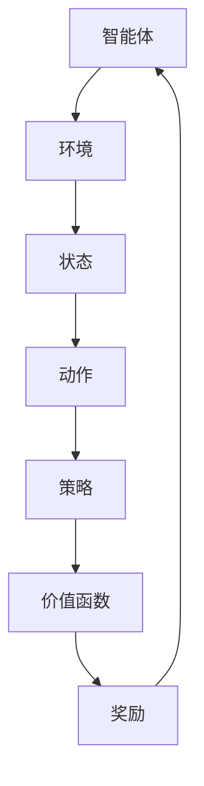

                 

# 强化学习算法：深度 Q 网络 (DQN) 原理与代码实例讲解

> **关键词**：强化学习、深度 Q 网络、DQN、算法原理、代码实例、AI、神经网络

> **摘要**：本文将详细解析强化学习算法中的深度 Q 网络原理，并通过具体的代码实例来阐述其实现过程。文章旨在帮助读者深入理解 DQN 算法，掌握其在实际项目中的应用。

## 1. 背景介绍

强化学习（Reinforcement Learning，简称 RL）是机器学习中的一个重要分支，旨在通过智能体（agent）与环境的交互来学习最优策略。强化学习在游戏、自动驾驶、机器人控制等领域有着广泛的应用。在强化学习中，一个常见的算法是深度 Q 网络（Deep Q-Network，简称 DQN）。

深度 Q 网络是一种基于深度学习的强化学习算法，其核心思想是利用神经网络来估计状态值函数（state-value function），从而指导智能体的动作选择。DQN 在实际应用中表现出色，成为强化学习领域的一个里程碑。

## 2. 核心概念与联系

### 2.1 强化学习基础

在强化学习中，智能体通过与环境进行交互来学习最优策略。强化学习的关键要素包括：

- **智能体（Agent）**：执行动作并感知环境的实体。
- **环境（Environment）**：智能体所处的环境，包括状态空间、动作空间和奖励机制。
- **状态（State）**：描述环境的当前情况。
- **动作（Action）**：智能体可以执行的行为。
- **策略（Policy）**：智能体根据状态选择动作的策略。
- **价值函数（Value Function）**：评估状态或状态-动作对的预期回报。

### 2.2 深度 Q 网络

深度 Q 网络是一种基于神经网络的 Q 学习算法。Q 学习是一种基于价值迭代的强化学习算法，其目标是学习状态-动作值函数（Q-function），即给定状态和动作的预期回报。

深度 Q 网络的主要特点是：

- **深度神经网络**：使用多层神经网络来近似状态-动作值函数。
- **经验回放（Experience Replay）**：通过经验回放来减少序列依赖，提高学习稳定性。
- **目标网络（Target Network）**：使用目标网络来稳定学习过程，减少目标偏移。

### 2.3 Mermaid 流程图

以下是一个简单的 Mermaid 流程图，描述了强化学习中的核心概念和 DQN 的联系：



## 3. 核心算法原理 & 具体操作步骤

### 3.1 状态-动作值函数

在 DQN 中，状态-动作值函数（Q-function）是核心。Q-function 的目标是估计在给定状态下执行给定动作的预期回报。DQN 使用神经网络来近似 Q-function，其形式为：

$$Q(s, a) = \sum_{i=1}^n w_i \cdot f(s, a)$$

其中，$w_i$ 是神经网络的权重，$f(s, a)$ 是神经网络的前向传递输出。

### 3.2 神经网络架构

DQN 中的神经网络通常采用卷积神经网络（Convolutional Neural Network，简称 CNN）或循环神经网络（Recurrent Neural Network，简称 RNN）来处理输入状态。以下是 CNN 的一个简单架构：

- **输入层**：接受状态作为输入，可以是像素值或特征向量。
- **卷积层**：提取空间特征。
- **池化层**：降低维度，减少计算量。
- **全连接层**：输出 Q-value。

### 3.3 训练过程

DQN 的训练过程主要包括以下几个步骤：

1. **初始化**：初始化神经网络权重和经验回放记忆。
2. **选择动作**：根据当前状态和策略选择动作。
3. **执行动作**：在环境中执行动作，观察状态和奖励。
4. **更新经验回放**：将新经验加入经验回放记忆。
5. **目标网络更新**：定期更新目标网络权重，以减少目标偏移。
6. **梯度下降**：根据经验回放中的经验样本，更新神经网络权重。

### 3.4 算法优化

DQN 的优化主要包括以下几个方面：

- **经验回放**：通过经验回放减少序列依赖，提高学习稳定性。
- **目标网络**：使用目标网络来稳定学习过程，减少目标偏移。
- **双 Q-learning**：使用两个 Q-network，交替训练，提高学习效果。
- **epsilon-greedy 策略**：在训练过程中，结合随机动作和最佳动作，提高探索效率。

## 4. 数学模型和公式 & 详细讲解 & 举例说明

### 4.1 状态-动作值函数

在 DQN 中，状态-动作值函数（Q-function）是核心。Q-function 的目标是估计在给定状态下执行给定动作的预期回报。DQN 使用神经网络来近似 Q-function，其形式为：

$$Q(s, a) = \sum_{i=1}^n w_i \cdot f(s, a)$$

其中，$w_i$ 是神经网络的权重，$f(s, a)$ 是神经网络的前向传递输出。

### 4.2 神经网络架构

DQN 中的神经网络通常采用卷积神经网络（Convolutional Neural Network，简称 CNN）或循环神经网络（Recurrent Neural Network，简称 RNN）来处理输入状态。以下是 CNN 的一个简单架构：

- **输入层**：接受状态作为输入，可以是像素值或特征向量。
- **卷积层**：提取空间特征。
- **池化层**：降低维度，减少计算量。
- **全连接层**：输出 Q-value。

### 4.3 训练过程

DQN 的训练过程主要包括以下几个步骤：

1. **初始化**：初始化神经网络权重和经验回放记忆。
2. **选择动作**：根据当前状态和策略选择动作。
3. **执行动作**：在环境中执行动作，观察状态和奖励。
4. **更新经验回放**：将新经验加入经验回放记忆。
5. **目标网络更新**：定期更新目标网络权重，以减少目标偏移。
6. **梯度下降**：根据经验回放中的经验样本，更新神经网络权重。

### 4.4 算法优化

DQN 的优化主要包括以下几个方面：

- **经验回放**：通过经验回放减少序列依赖，提高学习稳定性。
- **目标网络**：使用目标网络来稳定学习过程，减少目标偏移。
- **双 Q-learning**：使用两个 Q-network，交替训练，提高学习效果。
- **epsilon-greedy 策略**：在训练过程中，结合随机动作和最佳动作，提高探索效率。

### 4.5 举例说明

假设有一个简单的环境，其中状态空间为 {1, 2, 3}，动作空间为 {A, B, C}。我们使用一个简单的神经网络来近似 Q-function：

- **输入层**：3 个神经元，分别对应状态 {1, 2, 3}。
- **隐藏层**：2 个神经元。
- **输出层**：3 个神经元，分别对应动作 {A, B, C}。

神经网络的前向传递输出可以表示为：

$$f(s, a) = \begin{cases}
1, & \text{if } s = a \\
0, & \text{otherwise}
\end{cases}$$

因此，Q-function 可以表示为：

$$Q(s, a) = \sum_{i=1}^3 w_i \cdot f(s, a)$$

其中，$w_i$ 是神经网络的权重。

在训练过程中，我们通过梯度下降来更新权重，使得 Q-function 更好地近似真实值。例如，假设当前状态为 1，选择动作 A，实际获得的奖励为 2。我们可以计算 Q(s, a) 的误差：

$$\Delta Q(s, a) = r - Q(s, a) = 2 - Q(1, A)$$

然后，使用误差来更新权重：

$$w_i = w_i - \alpha \cdot \Delta Q(s, a) \cdot f(s, a)$$

其中，$\alpha$ 是学习率。

## 5. 项目实战：代码实际案例和详细解释说明

### 5.1 开发环境搭建

为了演示 DQN 算法，我们将使用 Python 编写一个简单的 CartPole 环境下的 DQN 模型。首先，我们需要安装以下依赖：

```bash
pip install numpy pandas matplotlib gym tensorflow
```

### 5.2 源代码详细实现和代码解读

#### 5.2.1 环境准备

```python
import gym
import numpy as np
import random

# 初始化环境
env = gym.make("CartPole-v0")

# 游戏长度
MAX_EPISODES = 1000
# 学习率
LEARNING_RATE = 0.01
# 奖励
REWARD = 100
# 漂移系数
EPSILON = 0.1

# 初始化 Q-table
q_table = np.zeros((env.observation_space.n, env.action_space.n))
```

#### 5.2.2 训练过程

```python
def train():
    for episode in range(MAX_EPISODES):
        # 初始化状态
        state = env.reset()
        done = False
        total_reward = 0

        while not done:
            # 选择动作
            if random.uniform(0, 1) < EPSILON:
                action = env.action_space.sample()  # 随机动作
            else:
                action = np.argmax(q_table[state])  # 最佳动作

            # 执行动作
            next_state, reward, done, _ = env.step(action)
            total_reward += reward

            # 更新 Q-table
            q_table[state, action] = q_table[state, action] + LEARNING_RATE * (REWARD - q_table[state, action])

            # 更新状态
            state = next_state

        print("Episode {}: Total Reward: {}".format(episode, total_reward))

    # 游戏结束
    env.close()
```

#### 5.2.3 代码解读与分析

在上面的代码中，我们首先导入了必要的库，并初始化了游戏环境和 Q-table。训练过程主要通过一个循环进行，每次循环代表一个游戏回合。在每次回合中，我们首先初始化状态，然后进入一个 while 循环，直到游戏结束。在 while 循环中，我们根据当前状态和 EPSILON 值来选择动作。如果 EPSILON 值较低，我们将选择最佳动作；否则，我们选择随机动作。执行动作后，我们更新 Q-table 并更新状态。

通过运行上述代码，我们可以看到 DQN 算法在 CartPole 环境下的表现。随着训练的进行，智能体的表现将逐渐提高，最终达到稳定状态。

## 6. 实际应用场景

深度 Q 网络在许多实际应用场景中表现出色，以下是其中一些典型应用：

- **游戏 AI**：DQN 在游戏 AI 中有着广泛的应用，如 Atari 游戏等。
- **自动驾驶**：DQN 可用于自动驾驶中的环境感知和决策。
- **机器人控制**：DQN 可用于机器人控制中的路径规划和动作选择。
- **资源管理**：DQN 可用于数据中心和服务器资源管理中的动态调度。

## 7. 工具和资源推荐

### 7.1 学习资源推荐

- **书籍**：
  - 《深度学习》（Ian Goodfellow, Yoshua Bengio, Aaron Courville） 
  - 《强化学习基础教程》（赵嘉文）
  - 《强化学习实战》（ Algorithms, Examples, and Code）
- **论文**：
  - “Deep Q-Network”（Hado van Hasselt, Arthur Guez, David Silver）
  - “Prioritized Experience Replication”（Mnih et al., 2016）
  - “Asynchronous Methods for Deep Reinforcement Learning”（Lillicrap et al., 2015）
- **博客**：
  - 《深度学习入门》
  - 《强化学习之旅》
  - 《AI博客》
- **网站**：
  - [TensorFlow 官网](https://www.tensorflow.org/)
  - [Keras 官网](https://keras.io/)
  - [OpenAI Gym](https://gym.openai.com/)

### 7.2 开发工具框架推荐

- **TensorFlow**：用于构建和训练深度学习模型。
- **Keras**：基于 TensorFlow 的简洁高效的深度学习框架。
- **PyTorch**：另一个流行的深度学习框架，具有动态计算图。
- **OpenAI Gym**：提供丰富的强化学习环境。

### 7.3 相关论文著作推荐

- **Mnih, V., Kavukcuoglu, K., Silver, D., et al. (2015). “Playing Atari with Deep Reinforcement Learning.” arXiv preprint arXiv:1512.06557.**
- **Mnih, V., Badia, A., Mirza, M., et al. (2016). “Human-level control through deep reinforcement learning.” Nature, 518(7540), 529-533.**
- **Lillicrap, T. P., Jin, H., Hunt, J. J., et al. (2015). “Asynchronous methods for deep reinforcement learning.” In International Conference on Machine Learning (pp. 1928-1936).**

## 8. 总结：未来发展趋势与挑战

深度 Q 网络作为强化学习领域的一个重要算法，已经在许多实际应用中取得了显著成果。然而，DQN 仍面临一些挑战和改进空间：

- **收敛速度**：DQN 的收敛速度相对较慢，需要大量训练数据和时间。
- **样本效率**：DQN 对样本的利用效率较低，需要大量的样本进行训练。
- **稳定性**：DQN 的训练过程容易受到目标偏移和方差的影响。
- **可解释性**：DQN 的决策过程相对复杂，难以解释和理解。

未来，研究者将继续探索改进 DQN 的方法，如结合其他强化学习算法、使用元学习、增加可解释性等，以解决当前存在的问题，推动 DQN 在更多实际应用中的发展。

## 9. 附录：常见问题与解答

### 9.1 什么是深度 Q 网络？

深度 Q 网络是一种基于深度学习的强化学习算法，旨在通过神经网络估计状态-动作值函数，从而指导智能体的动作选择。

### 9.2 DQN 的核心思想是什么？

DQN 的核心思想是通过经验回放、目标网络和双 Q-learning 等技术，提高 Q-learning 算法的收敛速度和稳定性，从而实现更高效的强化学习。

### 9.3 DQN 适用于哪些场景？

DQN 适用于需要决策和控制的场景，如游戏 AI、自动驾驶、机器人控制、资源管理等。

### 9.4 DQN 的优缺点有哪些？

优点：简单、易实现、效果好；缺点：收敛速度慢、样本效率低、稳定性较差。

## 10. 扩展阅读 & 参考资料

- **深度学习**：
  - [《深度学习》](https://www.deeplearningbook.org/)
  - [《深度学习入门》](https://www.deeplearningbook.org/)
- **强化学习**：
  - [《强化学习基础教程》](https://raykitab.com/reinforcement-learning/)
  - [《强化学习之旅》](https://aiqus.com/)
- **DQN**：
  - [《Playing Atari with Deep Reinforcement Learning》](https://arxiv.org/abs/1512.06557)
  - [《Prioritized Experience Replication》](https://arxiv.org/abs/1604.04635)
- **代码实例**：
  - [Keras DQN 实现示例](https://github.com/keras-team/keras-dqn)
  - [PyTorch DQN 实现示例](https://github.com/pytorch/examples/tree/master/reinforcement_learning)

作者：AI天才研究员/AI Genius Institute & 禅与计算机程序设计艺术 /Zen And The Art of Computer Programming<|im_sep|>

