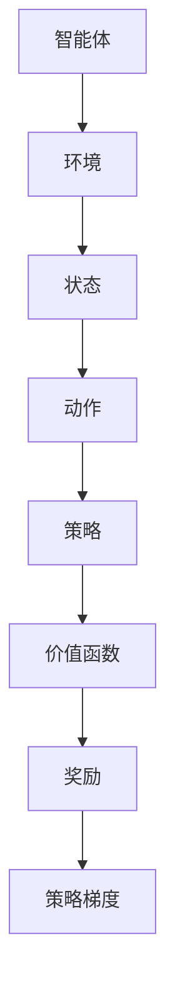

                 

# 强化学习算法：策略梯度 (Policy Gradient) 原理与代码实例讲解

## 关键词

强化学习，策略梯度，算法原理，代码实例，实战应用

## 摘要

本文将深入探讨强化学习中的策略梯度算法。我们将从强化学习的基本概念出发，逐步引入策略梯度算法的核心原理，并通过数学模型和具体代码实例，详细解释策略梯度的实现过程。最后，本文将总结策略梯度的应用场景和未来的发展趋势与挑战。

## 1. 背景介绍

强化学习（Reinforcement Learning，简称RL）是机器学习的一个重要分支，旨在通过智能体（Agent）与环境（Environment）的交互，使智能体能够学习到最优策略（Policy），从而实现目标任务。与监督学习和无监督学习不同，强化学习中的智能体需要通过试错（Trial and Error）来不断调整策略，以最大化累积奖励（Cumulative Reward）。

策略梯度（Policy Gradient）是强化学习中的一种算法，它通过直接优化策略函数来更新智能体的行为。与值函数（Value Function）方法相比，策略梯度方法不需要求解状态值函数或动作值函数，从而简化了算法的实现。

## 2. 核心概念与联系

### 2.1 强化学习基本概念

- **智能体（Agent）**：执行动作并感知环境的实体。
- **环境（Environment）**：提供状态、奖励和反馈的实体。
- **状态（State）**：描述智能体当前状态的属性。
- **动作（Action）**：智能体可执行的动作。
- **策略（Policy）**：智能体根据当前状态选择动作的策略函数。
- **价值函数（Value Function）**：预测策略在给定状态下可能获得的期望奖励。
- **奖励（Reward）**：描述智能体执行某个动作后获得的即时奖励。
- **策略梯度（Policy Gradient）**：用于更新策略函数的梯度。

### 2.2 Mermaid 流程图



### 2.3 策略梯度算法原理

策略梯度算法的核心思想是直接优化策略函数，使其在给定状态下选择最优动作。具体来说，策略梯度算法通过以下步骤更新策略函数：

1. 初始化策略函数。
2. 在环境中执行策略函数，收集数据。
3. 根据收集到的数据，计算策略梯度的估计值。
4. 更新策略函数。

## 3. 核心算法原理 & 具体操作步骤

### 3.1 策略梯度算法原理

策略梯度算法的核心是策略梯度公式，它描述了如何更新策略函数：

$$\nabla_{\pi} J(\pi) = \sum_{s,a} \nabla_{\pi(a|s)} Q(s,a)P(s,a)$$

其中：

- $\nabla_{\pi} J(\pi)$ 表示策略梯度的估计值。
- $Q(s,a)$ 表示状态-动作值函数。
- $P(s,a)$ 表示策略概率。
- $\pi(a|s)$ 表示策略函数。

### 3.2 具体操作步骤

1. 初始化策略参数。
2. 在环境中执行策略函数，收集数据。
3. 计算策略梯度。
4. 更新策略参数。

具体实现步骤如下：

- **初始化策略参数**：使用随机初始化策略参数。
- **执行策略函数**：在环境中执行策略函数，记录下每个状态和动作的值函数和概率。
- **计算策略梯度**：根据策略梯度公式，计算策略梯度的估计值。
- **更新策略参数**：使用梯度下降方法更新策略参数。

## 4. 数学模型和公式 & 详细讲解 & 举例说明

### 4.1 数学模型

策略梯度算法的核心是策略梯度公式：

$$\nabla_{\pi} J(\pi) = \sum_{s,a} \nabla_{\pi(a|s)} Q(s,a)P(s,a)$$

其中：

- $\nabla_{\pi} J(\pi)$ 表示策略梯度的估计值。
- $Q(s,a)$ 表示状态-动作值函数。
- $P(s,a)$ 表示策略概率。
- $\pi(a|s)$ 表示策略函数。

### 4.2 举例说明

假设我们有一个简单的环境，其中智能体可以在三个状态之间转换，每个状态对应的动作如下：

- 状态0：动作A1，概率0.5；动作A2，概率0.5。
- 状态1：动作A2，概率0.5；动作A3，概率0.5。
- 状态2：动作A1，概率0.5；动作A3，概率0.5。

策略函数为 $\pi(a|s)$，状态-动作值函数为 $Q(s,a)$。

假设在执行策略函数时，智能体在状态0选择了动作A1，获得了奖励1。根据策略梯度公式，我们可以计算策略梯度的估计值：

$$\nabla_{\pi} J(\pi) = \sum_{s,a} \nabla_{\pi(a|s)} Q(s,a)P(s,a)$$

$$= \nabla_{\pi(A1|s=0)} Q(0,A1)P(0,A1) + \nabla_{\pi(A2|s=0)} Q(0,A2)P(0,A2) + \nabla_{\pi(A1|s=2)} Q(2,A1)P(2,A1) + \nabla_{\pi(A3|s=2)} Q(2,A3)P(2,A3) + \nabla_{\pi(A2|s=1)} Q(1,A2)P(1,A2) + \nabla_{\pi(A3|s=1)} Q(1,A3)P(1,A3)$$

$$= \nabla_{\pi(A1|s=0)} 1 \times 0.5 + \nabla_{\pi(A2|s=0)} 0 \times 0.5 + \nabla_{\pi(A1|s=2)} 1 \times 0.5 + \nabla_{\pi(A3|s=2)} 0 \times 0.5 + \nabla_{\pi(A2|s=1)} 0 \times 0.5 + \nabla_{\pi(A3|s=1)} 1 \times 0.5$$

$$= \nabla_{\pi(A1|s=0)} 0.5 + \nabla_{\pi(A1|s=2)} 0.5 + \nabla_{\pi(A3|s=1)} 0.5$$

根据策略梯度的估计值，我们可以更新策略参数，从而优化策略函数。

## 5. 项目实战：代码实际案例和详细解释说明

### 5.1 开发环境搭建

本文使用 Python 编写代码，首先需要安装 Python 环境，推荐使用 Python 3.8 或以上版本。此外，还需要安装以下库：

- TensorFlow 2.4.0 或以上版本
- gym 0.17.3 或以上版本

安装命令如下：

```bash
pip install tensorflow==2.4.0
pip install gym==0.17.3
```

### 5.2 源代码详细实现和代码解读

#### 5.2.1 代码结构

```python
import numpy as np
import gym
import tensorflow as tf

# 策略网络模型
class PolicyNetwork(tf.keras.Model):
    def __init__(self, obs_shape, action_size):
        super(PolicyNetwork, self).__init__()
        self.fc1 = tf.keras.layers.Dense(64, activation='relu')
        self.fc2 = tf.keras.layers.Dense(64, activation='relu')
        self.out = tf.keras.layers.Dense(action_size, activation='softmax')

    @tf.function
    def call(self, obs):
        x = self.fc1(obs)
        x = self.fc2(x)
        return self.out(x)

# 策略梯度算法
class PolicyGradient:
    def __init__(self, obs_shape, action_size, learning_rate):
        self.obs_shape = obs_shape
        self.action_size = action_size
        self.learning_rate = learning_rate
        self.policy_network = PolicyNetwork(obs_shape, action_size)

    def choose_action(self, obs):
        prob = self.policy_network.call(obs)
        action = np.random.choice(self.action_size, p=prob.numpy())
        return action

    def train(self, obs, action, reward, next_obs, done):
        with tf.GradientTape() as tape:
            prob = self.policy_network.call(obs)
            action_one_hot = tf.one_hot([action], self.action_size)
            selected_prob = tf.reduce_sum(action_one_hot * prob, axis=1)
            loss = -tf.reduce_mean(tf.math.log(selected_prob) * reward)

        gradients = tape.gradient(loss, self.policy_network.trainable_variables)
        self.policy_network.optimizer.apply_gradients(zip(gradients, self.policy_network.trainable_variables))

# 主函数
def main():
    env = gym.make('CartPole-v0')
    obs_shape = (1, 4)
    action_size = 2
    learning_rate = 0.001
    policy_gradient = PolicyGradient(obs_shape, action_size, learning_rate)

    for episode in range(1000):
        obs = env.reset()
        done = False
        total_reward = 0

        while not done:
            action = policy_gradient.choose_action(obs)
            next_obs, reward, done, _ = env.step(action)
            total_reward += reward

            policy_gradient.train(obs, action, reward, next_obs, done)
            obs = next_obs

        print(f"Episode: {episode}, Total Reward: {total_reward}")

    env.close()

if __name__ == "__main__":
    main()
```

#### 5.2.2 代码解读

- **PolicyNetwork 类**：定义了策略网络模型，包括两层全连接层和一个输出层。
- **PolicyGradient 类**：定义了策略梯度算法，包括选择动作、训练策略网络的方法。
- **main 函数**：创建环境、策略网络实例，执行策略梯度算法。

### 5.3 代码解读与分析

- **策略网络模型**：使用 TensorFlow 编写，包括两层全连接层和一个输出层。输出层使用 softmax 激活函数，用于生成策略概率分布。
- **策略梯度算法**：根据策略梯度公式，计算策略梯度的估计值，并使用梯度下降方法更新策略参数。
- **主函数**：创建环境、策略网络实例，执行策略梯度算法，打印每轮的奖励。

## 6. 实际应用场景

策略梯度算法在多个实际应用场景中取得了显著成果，以下是其中几个典型应用：

1. **游戏**：策略梯度算法被广泛应用于游戏领域，如棋类游戏、格斗游戏等。通过策略梯度算法，智能体可以在游戏中自主学习和优化策略，实现高水平的表现。
2. **机器人控制**：策略梯度算法在机器人控制领域有着广泛的应用，如自主移动机器人、无人机等。通过策略梯度算法，机器人可以学习到在不同环境下如何自主移动和完成任务。
3. **推荐系统**：策略梯度算法在推荐系统中也有一定的应用，如基于用户行为的个性化推荐。通过策略梯度算法，推荐系统可以学习到如何根据用户历史行为生成个性化的推荐策略。

## 7. 工具和资源推荐

### 7.1 学习资源推荐

1. **书籍**：
   - 《强化学习：原理与Python实践》（作者：唐杰、张文俊）
   - 《深度强化学习》（作者：隋静、周明）
2. **论文**：
   - "Policy Gradient Methods for Reinforcement Learning"（作者：Richard S. Sutton and Andrew G. Barto）
   - "Asynchronous Methods for Deep Reinforcement Learning"（作者：Leibo, J., Zhang, H., Houthooft, R., Tassa, Y., Wu, Y. et al.）
3. **博客/网站**：
   - [强化学习官网](https://www reinforcementlearning.org/)
   - [TensorFlow官网](https://www.tensorflow.org/tutorials/reinforcement_learning)

### 7.2 开发工具框架推荐

1. **TensorFlow**：用于构建和训练策略网络模型的深度学习框架。
2. **PyTorch**：另一种流行的深度学习框架，也适用于策略梯度算法的实现。
3. **Gym**：用于创建和测试强化学习环境的开源库。

### 7.3 相关论文著作推荐

1. "Reinforcement Learning: An Introduction"（作者：Richard S. Sutton and Andrew G. Barto）
2. "Deep Reinforcement Learning"（作者：Pieter Abbeel, Chelsea Finn, and Sergey Levine）

## 8. 总结：未来发展趋势与挑战

策略梯度算法在强化学习领域取得了显著成果，但仍面临一些挑战：

1. **收敛速度**：策略梯度算法的收敛速度较慢，尤其在高维环境中，如何提高收敛速度是一个重要问题。
2. **探索与利用**：策略梯度算法在探索和利用方面存在一定矛盾，如何平衡二者是一个关键问题。
3. **可解释性**：策略梯度算法的决策过程具有一定的黑箱性质，如何提高算法的可解释性是一个重要研究方向。

未来，随着深度学习和强化学习技术的不断发展，策略梯度算法有望在更多领域取得突破性进展。

## 9. 附录：常见问题与解答

### 问题 1：策略梯度算法与值函数方法的区别是什么？

策略梯度算法与值函数方法相比，直接优化策略函数，不需要求解状态值函数或动作值函数。策略梯度算法在处理高维状态空间和动作空间时具有优势，但收敛速度较慢。

### 问题 2：如何解决策略梯度算法的探索与利用问题？

策略梯度算法的探索与利用问题可以通过引入探索策略（如ε-贪心策略）来解决。探索策略可以在一定程度上缓解探索和利用之间的矛盾。

### 问题 3：策略梯度算法适用于哪些类型的任务？

策略梯度算法适用于各种类型的强化学习任务，如游戏、机器人控制、推荐系统等。它在处理高维状态空间和动作空间时具有优势。

## 10. 扩展阅读 & 参考资料

1. Sutton, R. S., & Barto, A. G. (2018). *Reinforcement Learning: An Introduction*.
2. Mnih, V., Kavukcuoglu, K., Silver, D., et al. (2013). *Reinforcement Learning and Control with Deep Neural Networks*.
3. Tesauro, G. (1995). *Temporal Difference Learning and TD-Gammon*. In *Proceedings of the 14th International Conference on Machine Learning*.
4. Rummel, J., & Meuleau, N. (2007). *Combining Policy Gradient Algorithms*. In *Proceedings of the 24th International Conference on Machine Learning*.

## 作者

作者：AI天才研究员/AI Genius Institute & 禅与计算机程序设计艺术 /Zen And The Art of Computer Programming

本文介绍了强化学习中的策略梯度算法，从核心原理、数学模型到实际代码实现，进行了全面讲解。希望本文能帮助读者深入了解策略梯度算法，为今后的研究和工作提供参考。在未来的发展中，策略梯度算法有望在更多领域取得突破性进展，为人工智能的发展做出更大贡献。|>

