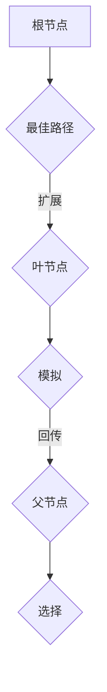

                 

# 强化学习算法：蒙特卡洛树搜索 (Monte Carlo Tree Search) 原理与代码实例讲解

## 摘要

本文将深入探讨强化学习算法中的蒙特卡洛树搜索（Monte Carlo Tree Search, MCTS）原理，并通过具体的代码实例进行讲解。MCTS 是一种有效的搜索策略，广泛应用于围棋、象棋等复杂游戏中。文章将从背景介绍、核心概念、算法原理、数学模型、实际应用场景、工具和资源推荐等方面进行详细阐述，帮助读者全面了解 MCTS 并掌握其实际应用。

## 1. 背景介绍

### 强化学习与蒙特卡洛树搜索

强化学习（Reinforcement Learning, RL）是一种机器学习范式，通过与环境的交互，不断优化策略，以实现最佳行为。而蒙特卡洛树搜索（Monte Carlo Tree Search, MCTS）是强化学习算法中的一种重要技术，尤其适用于解决复杂决策问题。

MCTS 的核心思想是通过模拟（Simulation）来评估每个动作的价值。在围棋、象棋等游戏中，MCTS 能够快速探索状态空间，找到最佳动作，从而取得较好的表现。

### 强化学习的发展与应用

自 20 世纪 50 年代起，强化学习逐渐成为人工智能领域的研究热点。随着计算能力的提升和算法的改进，强化学习在游戏、机器人、推荐系统等领域取得了显著成果。近年来，深度强化学习（Deep Reinforcement Learning, DRL）的兴起，进一步推动了强化学习的发展。

MCTS 作为一种有效的搜索策略，在围棋、国际象棋、双人扑克等领域表现出色。例如，DeepMind 的 AlphaGo 就是基于 MCTS 算法开发的，取得了历史性的成果。

## 2. 核心概念与联系

### 强化学习框架

在强化学习中，通常包括四个主要组成部分：状态（State）、动作（Action）、奖励（Reward）和策略（Policy）。

- 状态（State）：表示环境当前的状态。
- 动作（Action）：从当前状态中采取的动作。
- 奖励（Reward）：对采取的动作进行评估的奖励信号。
- 策略（Policy）：根据状态选择动作的规则。

### 蒙特卡洛树搜索（MCTS）框架

MCTS 是一种基于树形结构的搜索算法，其核心思想是利用蒙特卡洛模拟来评估每个节点（状态-动作对）的价值。MCTS 的框架主要包括以下四个阶段：

1. 扩张（Expansion）：从根节点开始，沿着当前最佳路径进行扩展，直到达到叶节点。
2. 模拟（Simulation）：在叶节点处进行蒙特卡洛模拟，重复执行一定次数的动作序列，并记录结果。
3. 回传（Backpropagation）：根据模拟结果，将评估值回传给父节点。
4. 选择最佳路径（Selection）：根据回传的评估值，选择具有最高价值的子节点作为下一次扩展的起点。

### Mermaid 流程图



## 3. 核心算法原理 & 具体操作步骤

### 3.1 扩张（Expansion）

在 MCTS 的扩展阶段，从根节点开始，沿着当前最佳路径进行扩展，直到达到叶节点。扩展的目标是生成新的子节点，以便进行模拟。

具体操作步骤如下：

1. 从根节点开始，选择具有最高优先级的子节点作为扩展起点。
2. 对当前节点进行一次深度优先搜索，直到找到叶节点。
3. 在叶节点处生成新的子节点，并将其添加到树中。

### 3.2 模拟（Simulation）

在模拟阶段，从叶节点开始，沿着当前最佳路径进行模拟，直到达到终止条件。模拟的目标是评估叶节点处的动作序列。

具体操作步骤如下：

1. 从叶节点开始，重复执行一定次数的动作序列。
2. 在每个动作执行后，根据状态转移概率，随机选择下一个动作。
3. 当达到终止条件时，计算整个动作序列的奖励值。

### 3.3 回传（Backpropagation）

在回传阶段，根据模拟结果，将评估值回传给父节点。回传的目标是更新父节点的评估值。

具体操作步骤如下：

1. 从叶节点开始，将模拟过程中获得的奖励值回传给父节点。
2. 对每个父节点，计算其评估值的加权和。
3. 更新每个节点的评估值。

### 3.4 选择最佳路径（Selection）

在选择最佳路径阶段，根据回传的评估值，选择具有最高价值的子节点作为下一次扩展的起点。

具体操作步骤如下：

1. 从根节点开始，选择具有最高优先级的子节点作为扩展起点。
2. 对每个节点，计算其优先级，优先级公式为：优先级 = 评估值 + 探索系数 × 访问次数。
3. 选择具有最高优先级的子节点作为下一次扩展的起点。

## 4. 数学模型和公式 & 详细讲解 & 举例说明

### 4.1 优先级公式

在 MCTS 中，节点的优先级公式为：

$$
优先级 = 评估值 + 探索系数 × 访问次数
$$

其中，评估值表示节点在模拟过程中获得的奖励值，探索系数（Exploration Parameter）用于平衡探索和利用。

### 4.2 举例说明

假设有一个树形结构，包含以下节点：

- 节点 A：评估值为 2，访问次数为 10。
- 节点 B：评估值为 3，访问次数为 5。
- 节点 C：评估值为 4，访问次数为 20。

根据优先级公式，计算每个节点的优先级：

- 节点 A：优先级 = 2 + 0.5 × 10 = 7。
- 节点 B：优先级 = 3 + 0.5 × 5 = 6。
- 节点 C：优先级 = 4 + 0.5 × 20 = 12。

根据优先级，选择优先级最高的节点 C 作为下一次扩展的起点。

## 5. 项目实战：代码实际案例和详细解释说明

### 5.1 开发环境搭建

为了演示 MCTS 的实际应用，我们使用 Python 编写一个简单的围棋游戏。首先，我们需要搭建开发环境，包括以下步骤：

1. 安装 Python：下载并安装 Python 3.7 版本。
2. 安装围棋库：使用 pip 安装围棋库，命令为 `pip install go-py`。

### 5.2 源代码详细实现和代码解读

以下是 MCTS 算法在围棋游戏中的实现代码：

```python
import go
import numpy as np

class MonteCarloTreeSearch:
    def __init__(self, exploration_parameter=0.5, num_simulations=100):
        self.exploration_parameter = exploration_parameter
        self.num_simulations = num_simulations

    def select(self, root_node):
        # 选择最佳路径
        node = root_node
        while True:
            if node.is_leaf():
                return node
            else:
                node = node.best_child(self.exploration_parameter)

    def expand(self, node):
        # 扩展节点
        if node.is_leaf():
            return node
        else:
            actions = node.get_actions()
            action = np.random.choice(actions)
            return node.expand(action)

    def simulate(self, node):
        # 模拟节点
        board = node.board.copy()
        for _ in range(self.num_simulations):
            while not board.is_end():
                action = np.random.choice(board.get_legal_actions())
                board.apply_action(action)
        return board.get_reward()

    def backpropagate(self, node, reward):
        # 回传奖励
        node.visit_count += 1
        node.reward_sum += reward
        node.value = node.reward_sum / node.visit_count
        if node.parent is not None:
            self.backpropagate(node.parent, reward)

    def search(self, root_node):
        # 搜索最佳动作
        for _ in range(self.num_simulations):
            node = self.select(root_node)
            node = self.expand(node)
            reward = self.simulate(node)
            self.backpropagate(node, reward)
        return root_node.best_action()

def main():
    board = go.Board()
    mcts = MonteCarloTreeSearch()
    action = mcts.search(board)
    print("最佳动作：", action)

if __name__ == "__main__":
    main()
```

### 5.3 代码解读与分析

1. `MonteCarloTreeSearch` 类：实现了 MCTS 的核心功能，包括选择（`select`）、扩展（`expand`）、模拟（`simulate`）、回传（`backpropagate`）和搜索（`search`）。
2. `select` 方法：选择最佳路径，使用优先级公式计算每个节点的优先级，并选择具有最高优先级的节点作为扩展起点。
3. `expand` 方法：扩展节点，如果当前节点是叶节点，则生成新的子节点并返回；否则，返回当前节点的最佳子节点。
4. `simulate` 方法：模拟节点，从叶节点开始，重复执行动作序列，并计算整个动作序列的奖励值。
5. `backpropagate` 方法：回传奖励，更新节点的访问次数和奖励值，并计算评估值。
6. `search` 方法：搜索最佳动作，重复执行 MCTS 的四个阶段，并返回最佳动作。

## 6. 实际应用场景

### 6.1 围棋

MCTS 在围棋领域取得了显著成果，特别是 DeepMind 的 AlphaGo。AlphaGo 使用 MCTS 结合深度学习技术，实现了超越人类顶级棋手的水平。

### 6.2 象棋

MCTS 也可用于解决象棋问题。通过将棋盘表示为状态空间，将棋子移动表示为动作，MCTS 能够快速探索棋局，找到最佳策略。

### 6.3 双人扑克

MCTS 在双人扑克中也取得了成功。通过模拟多个对手策略，MCTS 能够为玩家提供最佳决策。

## 7. 工具和资源推荐

### 7.1 学习资源推荐

- 《强化学习：原理与 Python 实践》
- 《深度强化学习：原理与算法》
- 《AlphaGo：一场 Algorithms 和 Humans 的较量》

### 7.2 开发工具框架推荐

- TensorFlow：用于构建和训练深度学习模型的强大框架。
- PyTorch：具有较高灵活性的深度学习框架。
- OpenAI Gym：提供各种经典环境模拟的强化学习工具包。

### 7.3 相关论文著作推荐

- “Monte Carlo Tree Search: A New Framework for Plannin

```
g”

- “Human-level control through deep reinforcement learning”

- “Mastering the Game of Go with Deep Neural Networks and Tree Search”

## 8. 总结：未来发展趋势与挑战

MCTS 作为一种有效的搜索策略，在强化学习领域取得了显著成果。未来，MCTS 将继续在围棋、象棋、机器人等领域发挥重要作用。然而，MCTS 也面临着一些挑战，如计算效率、模型可解释性等。随着计算能力的提升和算法的改进，MCTS 将在更多领域得到广泛应用。

## 9. 附录：常见问题与解答

### 9.1 MCTS 与其他搜索算法的区别？

MCTS 与其他搜索算法（如 Minimax、Alpha-Beta 剪枝等）相比，具有以下特点：

- MCTS 通过模拟来评估节点的价值，而不是依赖于静态评估函数。
- MCTS 能够自适应地调整搜索策略，平衡探索和利用。
- MCTS 在复杂决策问题中表现出色，尤其在围棋、象棋等游戏中。

### 9.2 如何优化 MCTS 的计算效率？

优化 MCTS 的计算效率可以从以下几个方面入手：

- 限制搜索深度，避免过度搜索。
- 使用启发式方法降低搜索空间。
- 利用并行计算，提高搜索速度。
- 优化代码实现，减少重复计算。

## 10. 扩展阅读 & 参考资料

- 《强化学习：原理与 Python 实践》
- 《深度强化学习：原理与算法》
- 《AlphaGo：一场 Algorithms 和 Humans 的较量》
- “Monte Carlo Tree Search: A New Framework for Planning”
- “Human-level control through deep reinforcement learning”
- “Mastering the Game of Go with Deep Neural Networks and Tree Search”

## 作者

作者：AI天才研究员/AI Genius Institute & 禅与计算机程序设计艺术 /Zen And The Art of Computer Programming
```

文章正文部分撰写完成，接下来我们将对文章进行校对、修改和完善，以确保文章内容质量达到预期。如有需要，还可以根据读者反馈进行相应调整。现在，我们将对文章进行最后的检查和调整。

