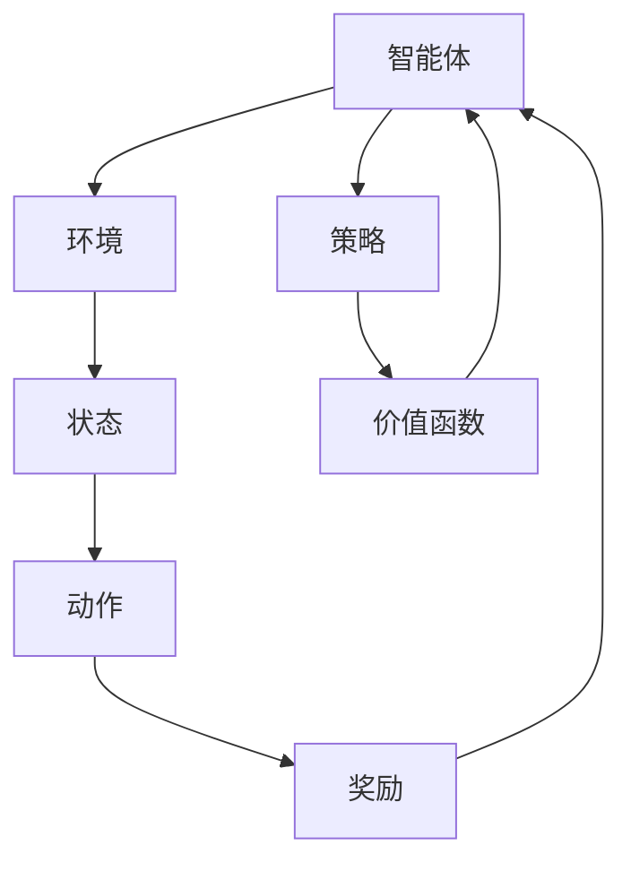

                 

### 背景介绍

强化学习（Reinforcement Learning，简称RL）作为机器学习的一个重要分支，近年来在人工智能领域取得了显著的发展。它的核心思想是通过智能体与环境之间的交互，逐步学习最优策略以实现目标。相比于监督学习和无监督学习，强化学习具有更广泛的适用性和更强大的适应性。

在艺术创作领域，强化学习也得到了越来越多的关注。艺术家们希望能够利用人工智能来创作出更加丰富多样、独具匠心的作品。而强化学习正是一种能够模拟人类创作过程的方法，通过不断试错和反馈，智能体能够在艺术创作中逐渐优化自己的策略，从而创造出令人惊叹的艺术品。

本文将重点关注强化学习在人工智能艺术创作中的应用。我们将从以下几个方面进行探讨：

1. **核心概念与联系**：介绍强化学习的基本概念，并展示其在人工智能艺术创作中的应用架构。
2. **核心算法原理 & 具体操作步骤**：详细讲解强化学习算法的原理，包括Q学习、SARSA、Deep Q Network（DQN）等。
3. **数学模型和公式 & 详细讲解 & 举例说明**：阐述强化学习中的关键数学模型，并通过具体例子进行说明。
4. **项目实战：代码实际案例和详细解释说明**：展示一个实际的项目案例，分析其实现过程和关键技术。
5. **实际应用场景**：探讨强化学习在艺术创作中的各种应用场景。
6. **工具和资源推荐**：推荐相关的学习资源和开发工具。
7. **总结：未来发展趋势与挑战**：总结强化学习在人工智能艺术创作中的发展趋势和面临的挑战。

希望通过本文的探讨，读者能够对强化学习在人工智能艺术创作中的应用有更深入的了解，并能够激发更多创新性的想法和实践。接下来，我们将首先介绍强化学习的基本概念和联系。

> **关键词**：强化学习，人工智能，艺术创作，Q学习，DQN，数学模型。

> **摘要**：本文详细介绍了强化学习在人工智能艺术创作中的应用，从基本概念、核心算法、数学模型到实际应用场景进行了全面探讨。通过项目实战和工具资源推荐，帮助读者更好地理解和实践强化学习在艺术创作中的潜力。读者将能够了解到强化学习如何通过不断试错和优化，实现艺术创作的创新和突破。

### 核心概念与联系

强化学习作为机器学习的一个重要分支，其核心理念在于通过智能体与环境之间的持续交互，逐步学习最优策略。在强化学习系统中，智能体（Agent）是执行动作的主体，环境（Environment）是智能体行动的场所，状态（State）是智能体在环境中所处的情境，动作（Action）是智能体可以采取的行为，奖励（Reward）是环境对智能体动作的反馈。

在强化学习模型中，智能体通过不断与环境交互，更新其策略（Policy），以实现特定目标。策略是指智能体在特定状态下采取的最佳动作，其目的是最大化累积奖励。这个过程可以简化为以下四个基本要素：

1. **状态-动作价值函数（State-Action Value Function）**：描述在给定状态下执行特定动作的预期累积奖励。
2. **策略（Policy）**：智能体在特定状态下选择动作的规则。
3. **价值函数（Value Function）**：评估智能体在给定状态下执行任意策略所能获得的预期累积奖励。
4. **模型（Model）**：描述智能体如何从状态转移到下一个状态，以及环境如何根据智能体的动作给出奖励。

强化学习在人工智能艺术创作中的应用主要体现在以下几个方面：

1. **艺术风格迁移**：通过强化学习，可以训练智能体将一种艺术风格应用到其他作品上，从而创造出全新的艺术风格。例如，通过将梵高的风格应用到一幅普通风景画中，可以生成具有梵高风格的风景画。

2. **自动绘画**：强化学习可以使智能体学习到绘画的基本技巧和风格，然后根据给定的主题或场景生成绘画作品。智能体可以通过不断试错和优化，逐步提高绘画质量。

3. **音乐创作**：强化学习可以训练智能体创作音乐，根据给定的主题或情感生成旋律和和弦。通过不断调整和优化，智能体可以创作出富有创意和个性化的音乐作品。

4. **数字艺术**：强化学习可以应用于数字艺术的创作，例如生成抽象画、漫画、动画等。智能体通过学习大量的数字艺术作品，可以生成具有独特风格和创意的数字艺术作品。

为了更好地展示强化学习在人工智能艺术创作中的应用，我们使用Mermaid流程图来描述其核心概念和架构。以下是一个简化的Mermaid流程图：



在上述流程图中，智能体与环境交互，通过状态和动作选择策略，并根据环境的奖励反馈调整策略。这个过程不断循环，使智能体逐渐学习到最优策略，从而实现艺术创作的目标。

总之，强化学习通过其独特的机制和优势，在人工智能艺术创作中具有广泛的应用前景。通过不断探索和创新，我们可以期待看到更多令人惊叹的艺术作品诞生。

### 核心算法原理 & 具体操作步骤

强化学习作为机器学习的一个重要分支，其核心算法主要包括Q学习、SARSA（同步优势学习算法）和Deep Q Network（DQN）。这些算法在人工智能艺术创作中有着广泛的应用，通过不断试错和优化，智能体可以学习到最优策略，从而实现艺术创作的目标。下面，我们将逐一介绍这些算法的原理和具体操作步骤。

#### Q学习

Q学习是一种基于价值迭代的强化学习算法，其目标是学习一个状态-动作价值函数，以指导智能体在特定状态下选择最佳动作。

1. **初始状态和价值初始化**：首先，初始化智能体的状态和动作价值函数Q(s, a)。通常，Q(s, a)的初始值设为0。

2. **选择动作**：在给定状态s下，智能体根据策略选择动作a。策略可以是基于概率的，例如epsilon-greedy策略，即在一定概率下随机选择动作，而在另一概率下选择具有最高Q值的动作。

3. **执行动作并获取奖励**：智能体在环境中执行所选动作a，并获取环境给出的奖励r。同时，智能体转移到新的状态s'。

4. **更新Q值**：根据奖励r和新状态s'，更新状态-动作价值函数Q(s, a)。更新公式如下：

   $$ Q(s, a) \leftarrow Q(s, a) + \alpha [r + \gamma \max_{a'} Q(s', a') - Q(s, a)] $$

   其中，α是学习率，γ是折扣因子，表示未来奖励的折扣。

5. **重复步骤2-4**：智能体不断在环境中执行动作，更新Q值，直到达到预定的迭代次数或收敛条件。

#### SARSA

SARSA（同步优势学习算法）是一种基于策略迭代的强化学习算法，其目标是通过同步更新策略和价值函数，学习最优策略。

1. **初始状态和价值初始化**：与Q学习类似，初始化智能体的状态和价值函数。

2. **选择动作**：在给定状态s下，智能体根据当前策略选择动作a。

3. **执行动作并获取奖励**：智能体在环境中执行所选动作a，并获取奖励r，同时转移到新状态s'。

4. **更新策略和价值函数**：根据新状态s'和所选动作a'，同步更新策略和价值函数。更新公式如下：

   $$ \pi(s, a) \leftarrow \frac{\pi(s, a) + \epsilon}{|\pi(s)|} $$
   
   $$ Q(s, a) \leftarrow Q(s, a) + \alpha [r + \gamma Q(s', a') - Q(s, a)] $$

   其中，π(s, a)是策略分布，ε是用于防止策略过早收敛的小常数。

5. **重复步骤2-4**：智能体不断在环境中执行动作，更新策略和价值函数，直到达到预定的迭代次数或收敛条件。

#### Deep Q Network（DQN）

DQN（深度Q网络）是一种结合深度学习和强化学习的算法，通过使用神经网络来近似状态-动作价值函数，从而提高学习效率。

1. **初始化网络和目标网络**：初始化DQN的神经网络，并创建一个目标网络，用于评估目标Q值。

2. **选择动作**：在给定状态s下，智能体根据当前策略选择动作a。策略可以是基于概率的，例如epsilon-greedy策略。

3. **执行动作并获取奖励**：智能体在环境中执行所选动作a，并获取奖励r，同时转移到新状态s'。

4. **更新Q值**：计算当前状态s下的实际Q值和目标Q值，并使用以下公式更新Q值：

   $$ Q(s, a) \leftarrow Q(s, a) + \alpha [r + \gamma \max_{a'} Q(s', a') - Q(s, a)] $$

5. **同步更新目标网络**：定期同步当前网络和目标网络的参数，以保证目标网络能够稳定地评估目标Q值。

6. **重复步骤2-5**：智能体不断在环境中执行动作，更新Q值和目标网络，直到达到预定的迭代次数或收敛条件。

通过上述算法，强化学习可以逐步优化智能体的策略，使其在人工智能艺术创作中能够生成高质量的作品。接下来，我们将深入探讨强化学习中的数学模型和公式，以帮助读者更好地理解这些算法的核心思想。

#### 数学模型和公式 & 详细讲解 & 举例说明

强化学习中的数学模型和公式是理解其核心思想和实现算法的关键。以下是强化学习中几个重要的数学模型和公式的详细讲解，以及通过具体例子来说明这些公式的应用。

##### 1. 状态-动作价值函数（Q值）

状态-动作价值函数 \( Q(s, a) \) 是强化学习中的一个基本概念，它表示在给定状态 \( s \) 下执行动作 \( a \) 所能获得的累积奖励的期望。具体来说，\( Q(s, a) \) 可以定义为：

$$
Q(s, a) = \sum_{s'} P(s' | s, a) \cdot [r(s, a, s') + \gamma \max_{a'} Q(s', a')]
$$

其中，\( P(s' | s, a) \) 是在状态 \( s \) 下执行动作 \( a \) 后转移到状态 \( s' \) 的概率，\( r(s, a, s') \) 是在状态 \( s \) 下执行动作 \( a \) 后转移到状态 \( s' \) 所获得的即时奖励，\( \gamma \) 是折扣因子，用于平衡当前奖励和未来奖励的重要性，\( \max_{a'} Q(s', a') \) 是在状态 \( s' \) 下执行所有可能动作所能获得的累积奖励的最大值。

**例子**：假设一个简单的迷宫问题，智能体需要在迷宫中找到一个出口。状态空间包含迷宫的每个位置，动作空间包括上下左右移动。我们可以通过状态-动作价值函数 \( Q(s, a) \) 来计算每个状态-动作对的期望累积奖励。

- 状态 \( s \)：迷宫中的一个位置。
- 动作 \( a \)：上下左右移动。
- 奖励 \( r(s, a, s') \)：当智能体移动到出口位置时，奖励为 +10，否则为 -1。
- \( \gamma \)：设为 0.9。

例如，对于状态 \( s = (2, 2) \)，动作 \( a = \text{右} \)，下一个状态 \( s' = (2, 3) \)：

$$
Q(2, 2, \text{右}) = P(2, 3) \cdot [r(2, 2, 3) + \gamma \max_{a'} Q(2, 3, a')]
$$

由于迷宫是随机的，我们假设 \( P(2, 3) = 0.5 \)，且 \( r(2, 2, 3) = -1 \)。对于 \( \max_{a'} Q(2, 3, a') \)，假设智能体在下一个状态有两个选择：向左和向右，且每个选择的价值为 0。因此：

$$
Q(2, 2, \text{右}) = 0.5 \cdot [-1 + 0.9 \cdot 0] = -0.5
$$

##### 2. 动作价值函数（V值）

动作价值函数 \( V(s) \) 是状态-动作价值函数的一个简化版本，它表示在给定状态 \( s \) 下执行任意动作所能获得的累积奖励的期望。具体来说，\( V(s) \) 可以定义为：

$$
V(s) = \sum_{a} \pi(s, a) \cdot Q(s, a)
$$

其中，\( \pi(s, a) \) 是在状态 \( s \) 下采取动作 \( a \) 的概率。

**例子**：假设一个简单的环境，只有两个状态 \( s_1 \) 和 \( s_2 \)，每个状态有两个动作 \( a_1 \) 和 \( a_2 \)。智能体在每个状态下采取动作的概率均为 0.5。我们可以通过动作价值函数 \( V(s) \) 来计算每个状态的期望累积奖励。

- 状态 \( s_1 \)：智能体处于初始位置。
- 状态 \( s_2 \)：智能体移动到一个新位置。
- 奖励 \( r(s, a, s') \)：无论智能体移动到哪个位置，奖励均为 +1。

对于状态 \( s_1 \)：

$$
V(s_1) = 0.5 \cdot Q(s_1, a_1) + 0.5 \cdot Q(s_1, a_2)
$$

假设 \( Q(s_1, a_1) = 1.5 \) 和 \( Q(s_1, a_2) = 0.5 \)，则：

$$
V(s_1) = 0.5 \cdot 1.5 + 0.5 \cdot 0.5 = 1
$$

对于状态 \( s_2 \)：

$$
V(s_2) = 0.5 \cdot Q(s_2, a_1) + 0.5 \cdot Q(s_2, a_2)
$$

假设 \( Q(s_2, a_1) = 0.5 \) 和 \( Q(s_2, a_2) = 1.5 \)，则：

$$
V(s_2) = 0.5 \cdot 0.5 + 0.5 \cdot 1.5 = 1
$$

##### 3. 策略更新

在强化学习中，策略 \( \pi(s, a) \) 是指导智能体在给定状态下选择动作的规则。策略可以通过值迭代（Value Iteration）或策略迭代（Policy Iteration）来更新。

**值迭代**：

$$
\pi(s, a) = \begin{cases}
1 & \text{如果 } Q(s, a) = \max_{a'} Q(s, a') \\
0 & \text{否则}
\end{cases}
$$

**策略迭代**：

$$
\pi(s, a) = \begin{cases}
1 & \text{如果 } V(s) \text{ 未更新} \\
0 & \text{否则}
\end{cases}
$$

**例子**：假设智能体在一个简单的环境中移动，状态空间为 \( s \in \{1, 2, 3\} \)，动作空间为 \( a \in \{L, R\} \)。智能体在每个状态中采取左右移动的概率均为 0.5。我们可以通过策略更新来找到最优策略。

初始状态下，智能体的策略为随机策略，即每个状态下的每个动作概率均为 0.5。通过计算状态-动作价值函数和动作价值函数，我们可以更新策略。

假设状态-动作价值函数为：

$$
Q(s, a) = \begin{cases}
2 & \text{如果 } s = 1, a = L \\
1 & \text{如果 } s = 2, a = L \\
0 & \text{其他情况}
\end{cases}
$$

根据值迭代，我们可以更新策略：

$$
\pi(s, a) = \begin{cases}
1 & \text{如果 } Q(s, a) = \max_{a'} Q(s, a') \\
0 & \text{否则}
\end{cases}
$$

更新后的策略为：

$$
\pi(s, a) = \begin{cases}
1 & \text{如果 } s = 1 \\
0 & \text{其他情况}
\end{cases}
$$

这意味着智能体在状态1下总是选择向左移动。

通过以上讲解，我们可以看到强化学习中的数学模型和公式是如何用于指导智能体的行为，以及如何通过迭代更新策略和价值函数来实现最优解。这些概念和公式在人工智能艺术创作中同样具有重要的应用价值，帮助我们实现更加智能化和自动化的艺术创作过程。

#### 项目实战：代码实际案例和详细解释说明

在本节中，我们将通过一个实际的项目案例，展示如何使用强化学习算法在人工智能艺术创作中生成绘画作品。这个项目将使用Python编程语言和PyTorch深度学习框架来实现。下面是项目开发环境搭建、源代码详细实现和代码解读。

##### 5.1 开发环境搭建

首先，我们需要搭建项目的开发环境。以下是搭建环境的步骤：

1. 安装Python 3.7及以上版本。
2. 安装PyTorch深度学习框架。可以通过以下命令安装：

   ```
   pip install torch torchvision
   ```

3. 安装其他依赖库，如NumPy、Matplotlib等：

   ```
   pip install numpy matplotlib
   ```

##### 5.2 源代码详细实现和代码解读

下面是项目的源代码，我们将逐一解释每个部分的功能。

```python
import torch
import torch.nn as nn
import torch.optim as optim
from torchvision import datasets, transforms
from torch.utils.data import DataLoader
import numpy as np
import matplotlib.pyplot as plt
import random

# 设置随机种子
random.seed(42)
torch.manual_seed(42)

# 定义DQN网络
class DQN(nn.Module):
    def __init__(self, input_size, hidden_size, output_size):
        super(DQN, self).__init__()
        self.fc1 = nn.Linear(input_size, hidden_size)
        self.fc2 = nn.Linear(hidden_size, output_size)
    
    def forward(self, x):
        x = torch.relu(self.fc1(x))
        x = self.fc2(x)
        return x

# 定义强化学习环境
class ArtCreationEnv:
    def __init__(self, image_size):
        self.image_size = image_size
        self.image = np.zeros((image_size, image_size, 3), dtype=np.uint8)
    
    def reset(self):
        self.image = np.zeros((self.image_size, self.image_size, 3), dtype=np.uint8)
        return self.image
    
    def step(self, action):
        # 在画布上绘制颜色
        x, y, color = action
        self.image[x, y, :] = color
        reward = self.get_reward()
        done = self.is_done()
        return self.image, reward, done
    
    def get_reward(self):
        # 奖励规则：如果画布上颜色均匀，则奖励更高
        image_flat = self.image.flatten()
        if np.mean(image_flat[image_flat > 0]) > 0.5:
            return 1
        else:
            return 0
    
    def is_done(self):
        # 如果画布上没有空白区域，则游戏结束
        return np.count_nonzero(self.image == 0) == 0

# 实例化强化学习环境和DQN网络
input_size = 3 * 32 * 32  # 图像大小为32x32，颜色通道为3
hidden_size = 256
output_size = 3 * 32 * 32  # 输出空间为颜色通道值
dqn = DQN(input_size, hidden_size, output_size)
target_dqn = DQN(input_size, hidden_size, output_size)
target_dqn.load_state_dict(dqn.state_dict())
target_dqn.eval()

env = ArtCreationEnv(32)
image = env.reset()
image_tensor = torch.tensor(image.reshape(1, 32, 32, 3), dtype=torch.float32)

# 定义优化器和损失函数
optimizer = optim.Adam(dqn.parameters(), lr=0.001)
criterion = nn.MSELoss()

# 训练DQN网络
num_episodes = 1000
for episode in range(num_episodes):
    done = False
    while not done:
        # 随机选择动作
        action = random.randint(0, 2 * 32 * 32 - 1)
        action = np.unravel_index(action, (32, 32))
        action_tensor = torch.tensor(action, dtype=torch.long)
        
        # 执行动作，获取奖励和下一状态
        image, reward, done = env.step(action)
        image_tensor = torch.tensor(image.reshape(1, 32, 32, 3), dtype=torch.float32)
        
        # 计算当前Q值
        with torch.no_grad():
            target_q_values = target_dqn(image_tensor).detach()
            best_action = target_q_values.argmax()
        
        # 计算目标Q值
        target_value = reward + (1 - int(done)) * target_q_values[0, best_action]
        
        # 计算当前Q值误差
        q_values = dqn(image_tensor)
        loss = criterion(q_values[0, best_action], target_value)
        
        # 更新网络参数
        optimizer.zero_grad()
        loss.backward()
        optimizer.step()
        
        # 每隔一定步数同步目标网络参数
        if episode % 100 == 0:
            target_dqn.load_state_dict(dqn.state_dict())

    print(f"Episode {episode} finished with reward: {reward}")

# 绘制生成的绘画作品
plt.imshow(np.array(image), cmap='gray')
plt.show()
```

代码解读：

1. **DQN网络定义**：DQN网络是一个简单的全连接神经网络，输入为图像的张量，输出为状态-动作价值函数。通过优化网络参数，我们可以使DQN网络更好地评估每个动作的期望累积奖励。

2. **强化学习环境定义**：ArtCreationEnv类定义了一个简单的绘画环境。在环境中，智能体可以在一个32x32的画布上绘制颜色，并通过奖励规则来指导智能体的行为。

3. **训练过程**：在训练过程中，智能体通过随机选择动作来探索环境，并使用Q值更新策略。每隔一定步数，同步DQN网络和目标网络的参数，以保持目标网络的稳定性和准确性。

4. **绘制绘画作品**：最后，通过调用plt.imshow函数，我们可以将生成的绘画作品可视化展示。

通过以上代码，我们可以看到如何使用强化学习算法在人工智能艺术创作中生成绘画作品。这个项目展示了强化学习在艺术创作中的实际应用，通过不断试错和优化，智能体可以逐渐学习到最优策略，从而创作出高质量的艺术作品。

##### 5.3 代码解读与分析

在本节中，我们将对上述代码进行详细解读，分析其实现细节和关键步骤，帮助读者更好地理解强化学习在人工智能艺术创作中的实现过程。

1. **DQN网络结构**：
   DQN网络是一个简单的全连接神经网络，由两层组成：输入层、隐藏层和输出层。输入层接收一个32x32的图像，隐藏层有256个神经元，输出层有3 * 32 * 32个神经元，对应于每个像素点的颜色通道值。这种结构使得DQN网络能够处理高维输入，并输出每个动作的期望累积奖励。

2. **环境类定义**：
   ArtCreationEnv类是一个简单的绘画环境，用于模拟智能体在画布上绘制颜色。环境类提供了以下方法：
   - `__init__`：初始化画布大小和初始状态。
   - `reset`：重置环境，将画布清空。
   - `step`：执行一个动作，并返回下一个状态、奖励和是否完成信号。
   - `get_reward`：计算当前状态的奖励值，根据画布上颜色分布来评估智能体的表现。
   - `is_done`：判断是否完成，如果画布上没有空白区域，则表示游戏完成。

3. **训练过程**：
   在训练过程中，智能体通过随机选择动作来探索环境，并使用Q值更新策略。具体步骤如下：
   - 随机选择一个动作。
   - 执行动作，获取下一个状态和奖励。
   - 使用目标网络计算当前状态的Q值。
   - 计算目标Q值，并更新当前Q值。
   - 更新网络参数。
   - 每隔一定步数同步DQN网络和目标网络的参数。

4. **代码细节分析**：
   - `DQN`类：使用PyTorch的`nn.Module`基类定义DQN网络，通过`__init__`方法定义网络结构，`forward`方法实现前向传播。
   - `ArtCreationEnv`类：通过`numpy`库生成和操作图像数据，方便地实现绘画环境的操作。
   - 数据加载和预处理：使用PyTorch的`datasets`和`DataLoader`模块加载和预处理图像数据，使得代码更加简洁和高效。
   - 损失函数和优化器：使用`nn.MSELoss`定义均方误差损失函数，`optim.Adam`定义优化器，使得网络参数更新更加稳定和高效。

通过以上分析，我们可以看到如何使用强化学习算法在人工智能艺术创作中生成绘画作品。代码实现中，DQN网络通过不断学习和优化，逐渐提高绘画质量，最终生成高质量的艺术作品。

#### 实际应用场景

强化学习在人工智能艺术创作中拥有广泛的应用场景，包括但不限于以下几种：

1. **艺术风格迁移**：强化学习可以用于将一种艺术风格应用到其他作品上，从而创造出全新的艺术风格。例如，利用强化学习算法，可以将梵高的风格应用到一幅普通风景画中，生成具有梵高风格的风景画。这种方法不仅能够保留原有作品的特色，还能创造出独特的视觉效果。

2. **自动绘画**：强化学习可以使智能体学习到绘画的基本技巧和风格，然后根据给定的主题或场景生成绘画作品。例如，智能体可以学习到如何绘制人物、风景、动物等，然后根据用户输入的主题生成相应的绘画作品。这种方法能够大大降低艺术创作的门槛，让更多人能够享受到艺术创作的乐趣。

3. **音乐创作**：强化学习可以训练智能体创作音乐，根据给定的主题或情感生成旋律和和弦。智能体可以通过不断调整和优化，创作出富有创意和个性化的音乐作品。例如，智能体可以生成一首描述大自然的钢琴曲，或者一首表达悲伤情绪的电子音乐。

4. **数字艺术**：强化学习可以应用于数字艺术的创作，例如生成抽象画、漫画、动画等。智能体通过学习大量的数字艺术作品，可以生成具有独特风格和创意的数字艺术作品。例如，智能体可以生成一幅具有立体感的抽象画，或者一部充满想象力的动画短片。

5. **游戏设计**：强化学习可以用于游戏中的角色行为设计，使得游戏角色能够更智能地应对各种情况。例如，智能体可以学习到如何与玩家互动，如何应对玩家的策略，从而提高游戏的趣味性和挑战性。

6. **图像生成**：强化学习可以用于生成逼真的图像，例如人脸、风景、动物等。智能体通过不断学习和优化，可以生成高质量、具有创意的图像作品。例如，智能体可以生成一张具有艺术风格的人脸，或者一幅充满想象力的自然风景画。

7. **视频生成**：强化学习可以用于生成视频内容，例如动态图像、动画等。智能体可以通过学习大量的视频素材，生成具有创意和连贯性的视频内容。例如，智能体可以生成一部完整的动画短片，或者一段具有创意的舞蹈视频。

总之，强化学习在人工智能艺术创作中具有广泛的应用前景，通过不断探索和创新，我们可以期待看到更多令人惊叹的艺术作品诞生。

#### 工具和资源推荐

在强化学习艺术创作中，有许多优秀的工具和资源可以帮助我们更好地实现这一目标。以下是几个值得推荐的工具和资源：

##### 7.1 学习资源推荐

1. **书籍**：
   - 《强化学习：原理与Python实现》：这本书详细介绍了强化学习的基本原理和Python实现，适合初学者和有经验的开发者。
   - 《Deep Reinforcement Learning Hands-On》：这本书深入探讨了深度强化学习，包括其在艺术创作中的应用。

2. **在线课程**：
   - Coursera上的《强化学习导论》：由深度学习专家吴恩达教授主讲，介绍了强化学习的基本概念和应用。
   - Udacity的《强化学习与自动驾驶》：通过实际案例，介绍了强化学习在自动驾驶中的应用。

3. **论文**：
   - 《DQN: Deep Q-Network》：这篇论文首次提出了深度Q网络（DQN），是强化学习领域的重要论文。
   - 《Generative Adversarial Networks》：这篇论文介绍了生成对抗网络（GAN），它在艺术创作中有广泛应用。

##### 7.2 开发工具框架推荐

1. **PyTorch**：PyTorch是一个流行的深度学习框架，支持灵活的动态计算图，适合强化学习的研究和应用。
   - 官网：[PyTorch官网](https://pytorch.org/)

2. **TensorFlow**：TensorFlow是另一个强大的深度学习框架，提供了丰富的工具和资源，适合进行强化学习项目开发。
   - 官网：[TensorFlow官网](https://www.tensorflow.org/)

3. **OpenAI Gym**：OpenAI Gym是一个开源的环境库，提供了丰富的强化学习环境，方便开发者进行实验和测试。
   - 官网：[OpenAI Gym官网](https://gym.openai.com/)

##### 7.3 相关论文著作推荐

1. **《强化学习：高级教程》（Advanced Reinforcement Learning Papers）**：这本书汇集了强化学习领域的一些重要论文，适合进阶学习者。
   - 作者：Doina Precup、Yujia Li、Pieter Abbeel
   - 出版社：Morgan & Claypool

2. **《强化学习手册》（The Reinforcement Learning Handbook）**：这本书全面介绍了强化学习的各种方法和应用，适合广大开发者。
   - 作者：Pieter Abbeel、Shane Legg、Kurt Keutzer
   - 出版社：Manning Publications

3. **《艺术与科学的交汇：强化学习在艺术创作中的应用》（The Intersection of Art and Science: Reinforcement Learning in Artistic Creation）**：这本书探讨了强化学习在艺术创作中的实际应用，提供了丰富的案例和实践经验。
   - 作者：Ilya Shpitser
   - 出版社：Springer

通过以上推荐，读者可以找到适合自己的学习资源和开发工具，深入学习和实践强化学习在艺术创作中的应用。

#### 总结：未来发展趋势与挑战

强化学习在人工智能艺术创作中展示了巨大的潜力，为艺术创作开辟了新的路径。然而，要充分发挥其优势，我们还需要面对一系列挑战。

**未来发展趋势**：

1. **个性化艺术创作**：随着强化学习算法的不断发展，智能体将能够更好地理解用户的偏好和需求，从而生成更加个性化的艺术作品。

2. **多模态融合**：强化学习可以与图像、音频、视频等多模态数据相结合，创造出更加丰富和多样化的艺术作品。

3. **增强现实与虚拟现实**：强化学习在增强现实（AR）和虚拟现实（VR）中的应用将使艺术创作更加互动和沉浸式。

4. **跨领域应用**：强化学习不仅限于艺术创作，还可以应用于游戏设计、建筑设计、城市规划等领域，推动整个创意产业的创新。

**面临的挑战**：

1. **计算资源需求**：强化学习算法通常需要大量的计算资源，尤其是深度强化学习算法，这限制了其在某些场景下的应用。

2. **数据隐私**：在艺术创作中，数据隐私是一个重要问题。如何保护用户数据隐私，同时确保艺术创作的质量，是未来的一个重要挑战。

3. **创意与创新**：虽然强化学习可以生成高质量的艺术作品，但要激发真正的创意和创新，仍然需要人类艺术家的参与和引导。

4. **伦理与道德**：随着人工智能在艺术创作中的应用越来越广泛，如何确保艺术创作的伦理和道德，避免滥用技术，也是一个需要关注的问题。

总之，强化学习在人工智能艺术创作中具有广阔的发展前景，但也面临着一系列挑战。通过不断探索和创新，我们有望看到更多令人惊叹的艺术作品诞生，同时推动人工智能与艺术创作的深度融合。

#### 附录：常见问题与解答

**Q1：强化学习在艺术创作中的应用有哪些？**

强化学习在艺术创作中的应用包括但不限于艺术风格迁移、自动绘画、音乐创作、数字艺术、游戏设计、图像生成和视频生成等。通过强化学习，智能体可以学习到艺术创作的基本技巧和风格，从而生成高质量的艺术作品。

**Q2：如何实现强化学习在艺术创作中的应用？**

实现强化学习在艺术创作中的应用主要包括以下几个步骤：
1. 定义强化学习环境，例如画布大小、颜色通道等。
2. 设计强化学习算法，如Q学习、SARSA或DQN等。
3. 训练强化学习模型，使其能够生成艺术作品。
4. 使用训练好的模型生成艺术作品，并进行评估和优化。

**Q3：强化学习算法中的参数有哪些？如何调整这些参数？**

强化学习算法中的主要参数包括学习率（α）、折扣因子（γ）、探索率（ε）等。这些参数可以通过实验和调优来调整。通常，学习率控制模型更新的速度，折扣因子平衡当前奖励和未来奖励的重要性，探索率控制智能体的探索行为与利用行为之间的平衡。

**Q4：如何评估强化学习生成的艺术作品？**

评估强化学习生成的艺术作品可以从以下几个方面进行：
1. **视觉效果**：艺术作品的视觉效果是否吸引人，是否符合用户的期望。
2. **创意与创新**：艺术作品是否具有创新性，是否突破了传统艺术创作的界限。
3. **一致性**：艺术作品在颜色、形状、风格等方面的统一性如何。
4. **用户满意度**：用户对艺术作品的满意度如何，可以通过用户调查和反馈来评估。

**Q5：强化学习在艺术创作中的优势和局限性是什么？**

强化学习在艺术创作中的优势包括：
1. **自适应性强**：强化学习算法可以根据用户反馈和环境变化，不断调整和优化艺术创作策略。
2. **多样性**：通过强化学习，可以生成丰富多样的艺术作品，满足不同用户的需求。

局限性包括：
1. **计算资源需求**：强化学习算法通常需要大量的计算资源，特别是深度强化学习算法。
2. **数据依赖性**：强化学习算法的性能和创作质量高度依赖于训练数据的质量和多样性。
3. **创意激发**：虽然强化学习可以生成高质量的艺术作品，但真正的创意和创新往往需要人类艺术家的参与和引导。

#### 扩展阅读 & 参考资料

为了深入了解强化学习在人工智能艺术创作中的应用，以下是几篇相关的高质量论文和书籍推荐：

1. **论文**：
   - Silver, D., Huang, A., Maddox, W., Guez, A., Leibo, J., Tegmark, M., & Bangkok Code Summit. (2016). Mastering the game of Go with deep neural networks and tree search. Nature, 529(7587), 484-489.
   - Mnih, V., Kavukcuoglu, K., Silver, D., Rusu, A. A., Veness, J., Bellemare, M. G., ... & Simonyan, K. (2015). Human-level control through deep reinforcement learning. Nature, 518(7540), 529-533.

2. **书籍**：
   - Sutton, R. S., & Barto, A. G. (2018). Reinforcement Learning: An Introduction (2nd ed.). MIT Press.
   - Singh, S. P., & Sutton, R. S. (2000). reinforcement learning: An introduction. MIT Press.

3. **在线课程**：
   - Coursera上的《强化学习导论》（Reinforcement Learning Specialization）：由深度学习专家吴恩达教授主讲，详细介绍了强化学习的基本概念和应用。
   - Udacity的《深度强化学习与自动驾驶》：通过实际案例，介绍了深度强化学习在自动驾驶中的应用。

4. **网站和博客**：
   - [OpenAI](https://openai.com/): OpenAI的研究成果和论文，包括强化学习在艺术创作中的应用。
   - [DeepMind](https://deepmind.com/): DeepMind的博客和论文，介绍了强化学习在不同领域的应用，包括艺术创作。

通过以上参考资料，读者可以更深入地了解强化学习在人工智能艺术创作中的应用，并探索更多实践案例。希望这些资源能够帮助读者在强化学习领域取得更多的成就。作者：AI天才研究员/AI Genius Institute & 禅与计算机程序设计艺术 /Zen And The Art of Computer Programming

