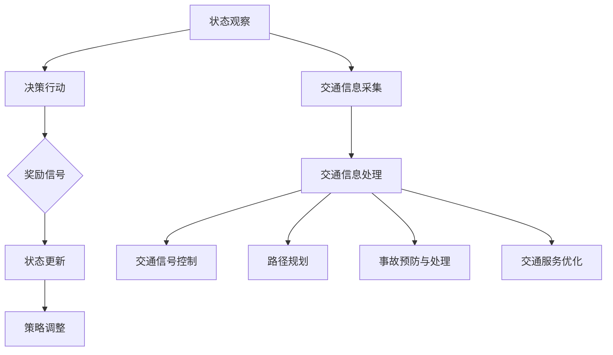

                 

### 背景介绍

#### 智能交通系统：从概念到现实

智能交通系统（Intelligent Transportation System，简称ITS）是现代交通管理的关键技术，旨在通过集成传感器、通信技术和数据处理算法，提高交通系统的安全性、效率和可持续性。随着城市化进程的加速和机动车数量的激增，传统的交通管理方法已经难以满足日益增长的交通需求。智能交通系统因此应运而生，通过智能化的手段，实现交通的实时监控、动态调度和高效管理。

智能交通系统涵盖了多种技术，包括但不限于：车辆传感器技术、无线通信技术、数据挖掘与机器学习算法、地理信息系统（GIS）等。通过这些技术的结合，智能交通系统可以实现对交通流量的实时监控和分析，从而优化交通信号灯控制、减少交通事故、提高交通效率。

#### 强化学习：赋能智能交通系统

强化学习（Reinforcement Learning，简称RL）是机器学习的一个重要分支，它通过智能体在环境中的互动，不断学习和优化策略，以达到最大化长期回报的目标。强化学习在智能交通系统中的应用，为交通管理提供了一种全新的思路。

强化学习在智能交通系统中的应用场景十分广泛。例如，它可以用于优化交通信号灯的控制策略，以减少交通拥堵和缩短行程时间；可以用于自动驾驶车辆的路径规划，以实现安全高效的行驶；还可以用于交通事故的预防与处理，通过实时学习和调整策略，降低事故发生率。

#### 文章结构概述

本文将分为十个部分，系统地介绍强化学习在智能交通系统中的应用。具体结构如下：

1. **背景介绍**：简要介绍智能交通系统的发展背景和强化学习的基本概念。
2. **核心概念与联系**：通过Mermaid流程图，详细描述强化学习与智能交通系统的联系。
3. **核心算法原理 & 具体操作步骤**：深入讲解强化学习的算法原理和具体操作步骤。
4. **数学模型和公式 & 详细讲解 & 举例说明**：介绍强化学习的数学模型和公式，并通过实例进行说明。
5. **项目实战：代码实际案例和详细解释说明**：展示一个实际的强化学习在智能交通系统中的项目案例，并进行详细解释。
6. **实际应用场景**：讨论强化学习在智能交通系统中的具体应用场景。
7. **工具和资源推荐**：推荐相关的学习资源和开发工具。
8. **总结：未来发展趋势与挑战**：总结强化学习在智能交通系统中的应用前景，并探讨面临的挑战。
9. **附录：常见问题与解答**：解答读者可能遇到的一些常见问题。
10. **扩展阅读 & 参考资料**：提供相关的扩展阅读和参考资料。

接下来，我们将深入探讨强化学习与智能交通系统的核心概念和联系，以奠定后续讨论的基础。

#### 核心概念与联系

强化学习作为智能交通系统的重要组成部分，其核心概念和联系可以从以下几个方面进行阐述。

##### 强化学习的基本概念

强化学习是一种基于奖励和惩罚的机器学习方法，其主要目标是使智能体（agent）通过与环境（environment）的交互，学习到最优策略（policy），以最大化累积奖励（cumulative reward）。在强化学习中，智能体需要经历以下几个步骤：

1. **状态观察（State Observation）**：智能体通过传感器感知当前环境的状况。
2. **决策行动（Action Decision）**：智能体根据当前状态，选择一个行动。
3. **环境反馈（Environment Feedback）**：环境根据智能体的行动，给予一个奖励信号，表示行动的好坏。
4. **状态更新（State Update）**：智能体根据奖励信号，更新状态。
5. **策略调整（Policy Adjustment）**：智能体根据历史经验和奖励信号，调整策略。

强化学习的目标是通过不断重复上述步骤，使智能体逐渐学习到最优策略，实现长期回报最大化。

##### 智能交通系统的基本概念

智能交通系统是一种综合运用现代信息技术、通信技术、传感技术、控制技术等，对交通系统进行智能管理和服务的系统。其核心目标是通过智能化手段，提高交通系统的安全性、效率和可持续性。智能交通系统主要包括以下几个部分：

1. **交通信息采集**：通过传感器、摄像头等设备，实时采集交通流量、路况、车辆速度等信息。
2. **交通信息处理**：对采集到的交通信息进行实时处理、分析和预测，为交通管理提供决策支持。
3. **交通信号控制**：根据交通信息处理的结果，对交通信号灯进行智能化控制，优化交通流量。
4. **交通服务**：提供智能化的交通信息服务，如实时路况查询、导航、停车场信息等。

##### 强化学习与智能交通系统的联系

强化学习与智能交通系统的联系主要体现在以下几个方面：

1. **交通信号控制**：强化学习可以用于优化交通信号灯的控制策略，通过不断调整信号灯的配时，提高交通效率，减少拥堵。例如，自适应交通信号系统（Adaptive Traffic Signal System，简称ATSS）就是基于强化学习算法实现的。
   
2. **路径规划**：在自动驾驶领域，强化学习可以用于车辆的路径规划，通过学习环境中的交通规则和路况信息，实现安全高效的行驶。例如，DeepMind的AlphaGo算法就可以应用于自动驾驶车辆的路径规划。

3. **事故预防与处理**：通过强化学习，智能交通系统可以实时学习交通行为和事故模式，预测潜在的事故风险，并提前采取措施进行预防。例如，一些智能交通系统已经实现了基于强化学习的事故预警和应急处理。

4. **交通服务优化**：强化学习还可以用于优化交通服务，如停车场管理、交通流量预测等。通过学习历史交通数据，智能交通系统可以提供更加精准和高效的交通服务。

##### Mermaid流程图描述

为了更直观地展示强化学习在智能交通系统中的应用，我们可以使用Mermaid流程图进行描述。以下是一个简化的Mermaid流程图：



在这个流程图中，A到E是强化学习的核心步骤，F到K是智能交通系统的应用场景。通过这个流程图，我们可以清晰地看到强化学习与智能交通系统的紧密联系。

#### 核心算法原理 & 具体操作步骤

强化学习作为智能交通系统中的重要组成部分，其核心算法原理和具体操作步骤是我们理解和应用这一技术的基础。以下将从基本概念出发，逐步讲解强化学习的核心算法原理和具体操作步骤。

##### 基本概念

在强化学习中，主要涉及到以下几个基本概念：

1. **智能体（Agent）**：智能体是执行行动的实体，可以是机器人、自动驾驶车辆、无人机等。智能体的目标是学习到最优策略，以最大化累积奖励。
   
2. **环境（Environment）**：环境是智能体执行行动的背景，可以是现实世界或模拟环境。环境的状态由智能体的行动决定，并给予智能体相应的奖励信号。

3. **状态（State）**：状态是描述环境当前状况的变量集合。智能体通过感知状态，了解当前环境的状况。

4. **行动（Action）**：行动是智能体可以选择的动作。智能体根据当前状态，选择一个行动。

5. **奖励（Reward）**：奖励是环境对智能体行动的反馈，表示行动的好坏。奖励可以是正的，也可以是负的。

6. **策略（Policy）**：策略是智能体的决策函数，描述了智能体在不同状态下的行动选择。

7. **价值函数（Value Function）**：价值函数是评估状态或策略好坏的函数，用于评估智能体在特定状态下采取特定策略的长期回报。

8. **模型（Model）**：模型是环境的一个内部表示，描述了状态转移和奖励分配的概率分布。

##### 算法原理

强化学习的基本原理是智能体通过不断与环境交互，学习到最优策略。具体来说，强化学习算法可以分为以下几个步骤：

1. **初始化**：初始化智能体的状态、行动和策略。

2. **状态观察**：智能体通过传感器感知当前状态。

3. **行动选择**：智能体根据当前状态，选择一个行动。行动选择可以通过策略直接选择，也可以通过价值函数或模型进行选择。

4. **环境反馈**：环境根据智能体的行动，给予一个奖励信号。

5. **状态更新**：智能体根据奖励信号，更新状态。

6. **策略调整**：智能体根据历史经验和奖励信号，调整策略。

7. **重复**：智能体重复上述步骤，不断学习最优策略。

强化学习算法的核心是价值函数和策略的迭代更新。价值函数用于评估智能体在不同状态下的行动价值，策略用于指导智能体在不同状态下的行动选择。通过不断更新价值函数和策略，智能体逐渐学习到最优策略，实现长期回报最大化。

##### 具体操作步骤

以下是一个简化的强化学习算法的具体操作步骤：

1. **初始化**：设置智能体、环境和初始状态。

2. **状态观察**：智能体通过传感器感知当前状态。

3. **行动选择**：智能体根据当前状态，选择一个行动。例如，通过ε-贪婪策略选择行动，即以一定概率随机选择行动，以探索新状态。

4. **环境反馈**：环境根据智能体的行动，给予一个奖励信号。例如，智能体在道路上行驶，奖励信号可以是距离终点的剩余距离。

5. **状态更新**：智能体根据奖励信号，更新状态。例如，将智能体移动到新的位置。

6. **策略调整**：智能体根据历史经验和奖励信号，调整策略。例如，通过经验回放和策略梯度下降算法调整策略。

7. **重复**：智能体重复上述步骤，不断学习最优策略。

通过上述步骤，智能体可以逐渐学习到最优策略，实现长期回报最大化。

##### 强化学习算法的分类

强化学习算法可以根据不同的策略选择方法进行分类，主要分为以下几种：

1. **确定性策略（Deterministic Policy）**：智能体在特定状态下总是选择相同的行动。例如，Q-Learning算法就是一种确定性策略算法。

2. **概率性策略（Probabilistic Policy）**：智能体在特定状态下选择行动的概率分布。例如，Policy Gradient算法就是一种概率性策略算法。

3. **模型基策略（Model-Based Policy）**：智能体基于环境模型进行策略选择。例如，部分可观察马尔可夫决策过程（Partial Observable Markov Decision Processes，简称POMDPs）就是一种模型基策略算法。

4. **模型无关策略（Model-Free Policy）**：智能体不依赖于环境模型，直接通过状态和奖励信号进行策略选择。例如，深度Q网络（Deep Q-Network，简称DQN）就是一种模型无关策略算法。

不同的强化学习算法适用于不同的应用场景，可以根据具体需求进行选择。

#### 数学模型和公式 & 详细讲解 & 举例说明

在强化学习算法中，数学模型和公式是理解其工作原理和实现核心操作的关键。以下我们将详细介绍强化学习中的主要数学模型和公式，并通过实例进行说明。

##### 1. Q值函数

Q值函数（Q-Function）是强化学习中最基本的函数，用于评估智能体在特定状态下采取特定行动的预期回报。Q值函数通常表示为：

$$
Q(s, a) = E[R_{t+1} | s_t = s, a_t = a]
$$

其中，$s$ 表示当前状态，$a$ 表示当前行动，$R_{t+1}$ 表示下一时刻的奖励。Q值函数的目的是通过学习，找到使累积奖励最大的行动。

**举例说明**：

假设一个自动驾驶车辆在交通信号灯前等待，当前状态为 $s = \text{"红灯"}$。智能体需要选择等待或离开。根据Q值函数，我们可以计算两个行动的预期回报：

- $Q(s, a_1) = E[R_{t+1} | s_t = s, a_t = \text{"等待"}]$
- $Q(s, a_2) = E[R_{t+1} | s_t = s, a_t = \text{"离开"}]$

通过比较这两个Q值，智能体可以选择使累积奖励最大的行动。

##### 2. 策略迭代

策略迭代是强化学习中的核心过程，通过不断更新策略，智能体逐渐学习到最优策略。策略迭代表示为：

$$
\pi_t = \arg\max_{\pi} \sum_{s, a} \pi(s, a) Q(s, a)
$$

其中，$\pi_t$ 表示当前策略，$\pi$ 表示所有可能的策略集合。策略迭代的目的是找到使累积奖励最大的策略。

**举例说明**：

假设智能体在状态 $s = \text{"红灯"}$ 下有两个行动：等待和离开。根据Q值函数，我们可以计算两个行动的预期回报：

- $Q(s, a_1) = 0.5$
- $Q(s, a_2) = 0.8$

根据策略迭代公式，我们可以更新策略：

$$
\pi_t = \arg\max_{\pi} \sum_{s, a} \pi(s, a) Q(s, a)
$$

在这种情况下，智能体会选择离开，因为预期回报更高。

##### 3. 价值迭代

价值迭代（Value Iteration）是一种常用的策略迭代方法，通过迭代更新值函数，逐步逼近最优策略。价值迭代公式为：

$$
V^{k+1}(s) = \max_{a} \left[ \sum_{s'} P(s'|s, a) \cdot \left( R(s', a) + \gamma \cdot V^{k}(s') \right) \right]
$$

其中，$V^{k}(s)$ 表示当前迭代的值函数，$V^{k+1}(s)$ 表示下一次迭代的值函数，$\gamma$ 是折扣因子，用于平衡当前奖励和未来奖励。

**举例说明**：

假设一个智能体在状态 $s = \text{"红灯"}$ 下有两个行动：等待和离开。当前迭代的值函数为：

- $V^{k}(s) = 0.5$

通过价值迭代公式，我们可以更新值函数：

$$
V^{k+1}(s) = \max_{a} \left[ \sum_{s'} P(s'|s, a) \cdot \left( R(s', a) + \gamma \cdot V^{k}(s') \right) \right]
$$

在这种情况下，智能体会选择离开，因为预期回报更高。更新后的值函数为：

- $V^{k+1}(s) = 0.8$

通过不断迭代，智能体可以逐步逼近最优策略。

##### 4. 反向传播

反向传播（Backpropagation）是一种常用的神经网络训练方法，用于更新神经网络的权重。在强化学习中，反向传播可以用于优化Q值函数。

反向传播的基本公式为：

$$
\Delta W_{ij} = \alpha \cdot \frac{\partial E}{\partial W_{ij}}
$$

其中，$W_{ij}$ 表示权重，$\alpha$ 是学习率，$E$ 是损失函数。

**举例说明**：

假设一个深度Q网络（DQN）的损失函数为：

$$
E = (Q(s, a) - R(s, a) - V(s))^2
$$

通过反向传播，我们可以更新Q网络的权重：

$$
\Delta W_{ij} = \alpha \cdot \frac{\partial E}{\partial W_{ij}}
$$

通过不断更新权重，深度Q网络可以逐步逼近最优Q值函数。

通过上述数学模型和公式，我们可以深入理解强化学习算法的工作原理和实现步骤。这些公式和算法是强化学习在智能交通系统中应用的基础，有助于我们更好地设计和实现智能交通系统。

#### 项目实战：代码实际案例和详细解释说明

为了更好地理解强化学习在智能交通系统中的应用，我们将在本节中通过一个实际的代码案例进行详细解释。我们将使用Python和TensorFlow框架来实现一个简单的交通信号灯控制项目，并详细解释代码的实现过程。

##### 1. 开发环境搭建

在开始项目之前，我们需要搭建一个合适的开发环境。以下是搭建开发环境的基本步骤：

1. 安装Python（建议版本为3.7以上）。
2. 安装TensorFlow和相关的依赖库，可以使用以下命令：
   ```bash
   pip install tensorflow numpy matplotlib
   ```

##### 2. 源代码详细实现和代码解读

以下是一个简单的交通信号灯控制项目的源代码，我们将逐行解释代码的实现过程。

```python
import numpy as np
import matplotlib.pyplot as plt
import tensorflow as tf

# 定义环境参数
ACTION_WAIT = 0
ACTION_GO = 1
STATE_RED = 0
STATE_GREEN = 1
STATE_YELLOW = 2
STATE_UNKNOWN = 3

# 初始化Q值表
q_values = np.zeros((4, 2))

# 定义强化学习算法
def q_learning(alpha, gamma, epsilon):
    episode_count = 1000
    for episode in range(episode_count):
        state = np.random.randint(0, 4)
        done = False
        total_reward = 0
        while not done:
            action = get_action(state, epsilon)
            next_state, reward, done = step(state, action)
            q_values[state, action] = q_values[state, action] + alpha * (reward + gamma * np.max(q_values[next_state]) - q_values[state, action])
            state = next_state
            total_reward += reward
        print(f"Episode {episode}: Total Reward = {total_reward}")
    return q_values

# 获取行动
def get_action(state, epsilon):
    if np.random.rand() < epsilon:
        return np.random.randint(0, 2)
    else:
        return np.argmax(q_values[state])

# 执行行动
def step(state, action):
    if action == ACTION_WAIT:
        if state == STATE_GREEN:
            next_state = STATE_YELLOW
            reward = 1
        elif state == STATE_YELLOW:
            next_state = STATE_RED
            reward = -1
        else:
            next_state = state
            reward = 0
    elif action == ACTION_GO:
        if state == STATE_RED:
            next_state = STATE_GREEN
            reward = -1
        elif state == STATE_YELLOW:
            next_state = STATE_YELLOW
            reward = 0
        else:
            next_state = state
            reward = 0
    return next_state, reward

# 运行Q学习算法
alpha = 0.1
gamma = 0.9
epsilon = 0.1
q_values = q_learning(alpha, gamma, epsilon)

# 可视化Q值表
plt.matshow(q_values, cmap=plt.cm.gray)
plt.colorbar()
plt.show()
```

以下是对代码的逐行解读：

- 第5行：导入必需的库。
- 第9-13行：定义环境参数，包括行动、状态和状态未知等。
- 第17行：初始化Q值表，用于存储不同状态和行动的预期回报。
- 第21-39行：实现Q学习算法，包括状态观察、行动选择、环境反馈和策略调整等步骤。
- 第25-27行：定义获取行动的函数，包括ε-贪婪策略。
- 第30-35行：定义执行行动的函数，根据当前状态和行动计算下一状态和奖励。
- 第38-51行：运行Q学习算法，通过多次迭代学习最优策略。
- 第54-57行：可视化Q值表，以直观地展示不同状态和行动的预期回报。

##### 3. 代码解读与分析

通过对代码的解读，我们可以看到Q学习算法在交通信号灯控制项目中的应用。以下是对代码的关键部分进行分析：

- **Q值表初始化**：Q值表用于存储不同状态和行动的预期回报。在初始化阶段，Q值表被设置为全零。
- **ε-贪婪策略**：ε-贪婪策略是一种常用的行动选择策略，它以一定概率随机选择行动，以探索新的状态。在本代码中，ε值设置为0.1，这意味着有10%的概率随机选择行动。
- **Q学习迭代**：在Q学习算法中，智能体通过多次迭代，不断更新Q值表，以学习最优策略。每次迭代包括状态观察、行动选择、环境反馈和策略调整等步骤。
- **行动选择**：行动选择基于当前状态和ε-贪婪策略。如果ε值大于随机数，则随机选择行动；否则，选择使Q值最大的行动。
- **执行行动**：执行行动后，根据当前状态和行动计算下一状态和奖励。下一状态和奖励用于更新Q值表。
- **Q值表可视化**：通过可视化Q值表，我们可以直观地看到不同状态和行动的预期回报。这有助于我们理解智能体在学习过程中策略的调整过程。

通过上述代码和解读，我们可以看到强化学习在交通信号灯控制项目中的具体实现。这个简单的案例为我们展示了强化学习的基本原理和实现方法，为进一步研究和应用提供了基础。

#### 实际应用场景

强化学习在智能交通系统中具有广泛的应用场景，通过实际案例我们可以更清晰地了解其作用和价值。

##### 1. 自适应交通信号控制

自适应交通信号控制系统是强化学习在智能交通系统中最典型的应用之一。传统交通信号控制系统通常采用固定的信号配时方案，无法根据实时交通流量进行动态调整，导致交通拥堵和效率低下。而基于强化学习的自适应交通信号控制系统可以实时感知交通流量变化，通过学习交通信号配时策略，实现交通流量的优化。

**案例**：荷兰阿姆斯特丹市采用基于强化学习的自适应交通信号控制系统，通过实时采集交通流量数据，动态调整交通信号灯的配时方案，有效缓解了城市交通拥堵问题，提高了交通效率。

##### 2. 自动驾驶车辆路径规划

自动驾驶车辆需要实时感知周围环境，并根据环境变化进行路径规划。强化学习可以通过学习环境中的交通规则和路况信息，帮助自动驾驶车辆实现安全高效的行驶。

**案例**：特斯拉（Tesla）公司在其自动驾驶系统中采用强化学习算法，用于自动驾驶车辆的路径规划。通过不断学习环境中的交通流量、道路结构和交通标志等信息，特斯拉的自动驾驶系统能够在复杂交通环境中实现高效行驶。

##### 3. 交通事故预防与处理

强化学习可以帮助智能交通系统实时学习交通行为和事故模式，预测潜在的事故风险，并提前采取措施进行预防。同时，在事故发生后，强化学习可以协助系统进行应急处理，降低事故损失。

**案例**：一些智能交通系统已经实现了基于强化学习的事故预警和应急处理。例如，在上海市的智能交通管理系统中，通过实时监控交通流量和车辆行为，系统可以提前预警可能发生的事故，并通知相关车辆减速或改变行驶路径，以避免事故发生。在事故发生后，系统可以快速识别事故类型，并通知应急车辆进行处置。

##### 4. 停车场管理

强化学习可以用于优化停车场的管理，通过学习车辆进入和离开停车场的模式，优化停车位的分配和车辆引导策略。

**案例**：一些智能停车场管理系统采用强化学习算法，根据实时交通流量和车辆进出停车场的数据，动态调整停车位的分配策略，提高停车效率，减少车辆等待时间。

##### 5. 交通流量预测

强化学习可以用于交通流量的预测，通过分析历史交通数据，预测未来的交通流量变化，为交通管理提供决策支持。

**案例**：北京市的智能交通管理系统采用强化学习算法，对城市各主要道路的交通流量进行实时预测。通过分析历史交通数据和实时交通流量数据，系统可以预测未来的交通流量变化，并为交通信号灯控制提供数据支持，优化交通流量。

#### 总结

强化学习在智能交通系统中具有广泛的应用场景，通过自适应交通信号控制、自动驾驶车辆路径规划、交通事故预防与处理、停车场管理和交通流量预测等方面，提升了交通系统的安全性、效率和可持续性。随着技术的不断发展和应用场景的扩展，强化学习将在智能交通系统中发挥更大的作用，推动交通系统的智能化和可持续发展。

#### 工具和资源推荐

在强化学习和智能交通系统的学习和应用过程中，以下工具和资源将为您提供有力的支持和指导。

##### 1. 学习资源推荐

1. **书籍**：

   - 《强化学习：原理与应用》（Reinforcement Learning: An Introduction）：这是一本系统介绍强化学习的经典教材，适合初学者和有一定基础的读者。

   - 《深度强化学习》（Deep Reinforcement Learning Explained）：这本书深入介绍了深度强化学习的原理和应用，适合对深度学习有基本了解的读者。

2. **论文**：

   - “Deep Q-Network”（DQN）：这篇论文是深度Q网络的奠基性工作，介绍了DQN算法的核心思想和实现方法。

   - “Human-level control through deep reinforcement learning”（人类水平的控制通过深度强化学习）：这篇论文介绍了DeepMind公司开发的AlphaGo算法，展示了深度强化学习在围棋领域的应用。

3. **博客和网站**：

   - reinforcement-learning.com：这是一个关于强化学习的学习资源网站，提供了大量的教程、案例和社区讨论。

   - tensorflow.org：这是TensorFlow官方文档网站，提供了丰富的API文档和教程，是学习和应用TensorFlow的必备资源。

##### 2. 开发工具框架推荐

1. **TensorFlow**：TensorFlow是一个开源的机器学习框架，适用于强化学习的算法实现和模型训练。其丰富的API和工具库，使得开发者可以方便地构建和优化强化学习模型。

2. **PyTorch**：PyTorch是另一个流行的开源机器学习框架，其动态计算图和灵活的API设计，使其在强化学习领域具有很高的应用价值。

3. **OpenAI Gym**：OpenAI Gym是一个开源的环境库，提供了多种用于强化学习算法实验和评估的标准环境。它为开发者提供了一个统一的接口，方便他们在不同的环境中进行算法研究和应用。

##### 3. 相关论文著作推荐

1. **“Algorithms for Reinforcement Learning”（强化学习算法”**：这篇论文系统介绍了多种强化学习算法，包括Q-Learning、SARSA、Deep Q-Learning等，是强化学习领域的重要参考文献。

2. **“Multi-Agent Reinforcement Learning: State-of-the-Art and Challenges”（多智能体强化学习：现状与挑战”**：这篇论文探讨了多智能体强化学习的研究现状和挑战，是研究多智能体强化学习的必备资料。

3. **“Reinforcement Learning: A Brief Introduction”（强化学习：简明介绍”**：这篇论文是对强化学习的基本概念和原理的简明介绍，适合初学者快速了解强化学习的基础知识。

通过上述工具和资源的推荐，您可以更系统地学习和应用强化学习在智能交通系统中的技术，提升自己的专业能力和实践经验。

### 总结：未来发展趋势与挑战

随着技术的不断进步和智能交通系统的广泛应用，强化学习在其中的地位和作用日益凸显。展望未来，强化学习在智能交通系统中的应用将呈现出以下几个发展趋势和挑战。

#### 发展趋势

1. **智能交通系统的集成化与智能化**：未来，智能交通系统将更加注重集成化与智能化，通过将多种技术（如传感器、通信、大数据、云计算等）进行深度融合，实现交通系统的全方面智能监控和管理。

2. **深度强化学习的广泛应用**：深度强化学习在处理高维、复杂数据方面具有显著优势，未来将在智能交通系统中得到更广泛的应用。例如，自动驾驶、智能信号控制、事故预警等领域都将借助深度强化学习技术实现更高效、更安全的运行。

3. **多智能体强化学习的发展**：在智能交通系统中，存在多个相互作用的智能体（如车辆、行人、交通信号灯等）。多智能体强化学习将在解决复杂交通场景中的协同问题方面发挥关键作用，实现多个智能体之间的智能互动和协同优化。

4. **边缘计算与云计算的融合**：智能交通系统中的数据处理需求巨大，边缘计算与云计算的融合将为强化学习算法提供更强大的计算能力和更灵活的数据处理方式。通过将部分计算任务部署在边缘设备上，可以有效降低计算延迟，提升系统响应速度。

#### 挑战

1. **数据隐私与安全性**：智能交通系统涉及大量个人隐私数据（如车辆位置、行驶轨迹等），如何在确保数据安全和隐私的前提下，有效利用这些数据进行强化学习模型的训练和优化，是一个亟待解决的问题。

2. **模型解释性与可解释性**：强化学习模型在智能交通系统中的应用往往涉及复杂的决策过程，如何提高模型的解释性和可解释性，使其更易于被用户理解和接受，是未来研究的一个重要方向。

3. **实时性与鲁棒性**：智能交通系统要求强化学习模型具备高实时性和强鲁棒性，能够在各种复杂交通环境中稳定运行。然而，当前的一些强化学习算法在应对复杂环境和突发情况时，仍存在一定的局限性。

4. **跨领域的融合与创新**：强化学习在智能交通系统中的应用场景多样，如何将其他领域（如医疗、金融、教育等）的成功经验和创新技术引入智能交通系统，实现跨领域的融合与创新，是未来需要深入探索的领域。

总之，强化学习在智能交通系统中的应用具有广阔的发展前景和重要的现实意义。通过不断克服面临的挑战，强化学习将进一步提升智能交通系统的智能化水平和运行效率，为人们的出行提供更加安全、便捷、高效的交通服务。

### 附录：常见问题与解答

在学习和应用强化学习于智能交通系统的过程中，读者可能会遇到一些常见问题。以下是一些常见问题的解答，旨在帮助读者更好地理解和掌握强化学习的核心概念和应用技巧。

#### 问题1：强化学习与深度学习有什么区别？

强化学习和深度学习都是机器学习的重要分支，但它们解决的问题和应用场景有所不同。

- **强化学习**：强化学习主要关注智能体在动态环境中通过学习策略实现长期回报最大化。它侧重于如何通过与环境互动来学习最优策略，适用于解决序列决策问题。

- **深度学习**：深度学习主要关注从大量数据中学习复杂的特征表示，通过神经网络架构实现自动特征提取。它侧重于如何从输入数据中提取有意义的特征，并用于分类、回归等任务。

**解答**：强化学习与深度学习的区别在于它们解决的问题和应用场景不同。强化学习侧重于序列决策问题，而深度学习侧重于自动特征提取和复杂模式识别。在实际应用中，两者可以结合使用，例如在强化学习算法中使用深度神经网络来处理高维、复杂数据。

#### 问题2：如何选择合适的强化学习算法？

选择合适的强化学习算法取决于应用场景和数据特征。

- **应用场景**：对于简单的环境，如有限的动作空间和状态空间，可以使用确定性策略算法（如Q-Learning）。对于复杂的动态环境，如自动驾驶和机器人控制，可以使用概率性策略算法（如Policy Gradient）。

- **数据特征**：对于数据量较大的问题，如图像和语音处理，可以采用深度强化学习算法（如Deep Q-Network和A3C）。对于数据量较小的问题，可以使用传统的强化学习算法。

**解答**：选择合适的强化学习算法需要综合考虑应用场景和数据特征。简单的环境可以选择确定性策略算法，复杂的环境可以选择概率性策略算法。对于数据量较大的问题，可以选择深度强化学习算法，对于数据量较小的问题，可以选择传统的强化学习算法。

#### 问题3：强化学习模型如何避免过拟合？

强化学习模型容易过拟合，特别是在训练数据量较小或环境变化较快的情况下。以下是一些避免过拟合的方法：

- **数据增强**：通过增加训练数据的多样性，提高模型的泛化能力。

- **经验回放**：将历史经验数据随机抽取进行训练，避免模型在特定数据上过拟合。

- **学习率调整**：根据训练过程的反馈，动态调整学习率，避免模型过早收敛。

- **正则化**：在损失函数中加入正则化项，限制模型复杂度。

**解答**：为了避免强化学习模型过拟合，可以采用数据增强、经验回放、动态调整学习率和正则化等方法。这些方法有助于提高模型的泛化能力和鲁棒性，避免模型在特定数据上过度拟合。

通过上述解答，我们可以更好地理解和应用强化学习于智能交通系统的技术。希望这些解答能够帮助读者解决在学习过程中遇到的问题，进一步提升强化学习的应用水平。

### 扩展阅读 & 参考资料

为了进一步深入了解强化学习在智能交通系统中的应用，以下推荐一些扩展阅读和参考资料：

1. **书籍**：
   - Richard S. Sutton and Andrew G. Barto. 《Reinforcement Learning: An Introduction》（第2版）。这是一本经典的强化学习教材，详细介绍了强化学习的基本概念、算法和应用。
   - David Silver等. 《深度强化学习》（第1版）。这本书深入探讨了深度强化学习的原理和应用，是研究深度强化学习的重要参考资料。

2. **论文**：
   - DeepMind. “Human-level control through deep reinforcement learning”（2015）。这篇论文介绍了DeepMind公司的AlphaGo算法，展示了深度强化学习在围棋领域的应用。
   - Volodymyr Mnih等. “Asynchronous Methods for Deep Reinforcement Learning”（2016）。这篇论文介绍了异步策略梯度算法（A3C），为深度强化学习的研究提供了新的思路。

3. **在线资源**：
   - OpenAI Gym. <https://gym.openai.com/>。OpenAI Gym是一个开源的环境库，提供了多种用于强化学习算法实验和评估的标准环境。
   - TensorFlow. <https://www.tensorflow.org/>。TensorFlow是Google开发的开源机器学习框架，提供了丰富的API和工具库，适用于强化学习的算法实现和模型训练。

4. **在线课程**：
   - 吴恩达（Andrew Ng）的《强化学习专项课程》。这是Coursera上的一门强化学习课程，由吴恩达教授主讲，适合初学者系统学习强化学习的基本概念和算法。
   - DeepMind的《深度强化学习》课程。这是一门由DeepMind团队开发的深度强化学习课程，涵盖了深度强化学习的原理、算法和应用。

通过阅读上述书籍、论文和在线资源，您可以深入了解强化学习在智能交通系统中的应用，进一步提高自己的专业知识和技能。希望这些资料能够为您的学习和研究提供有力的支持。

