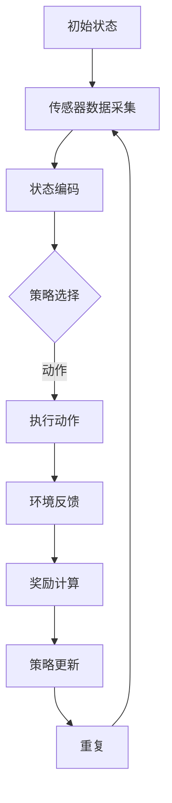
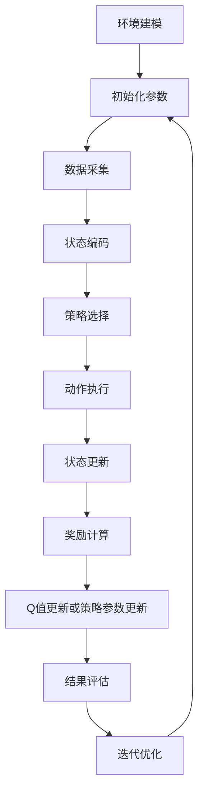

                 

### 背景介绍

强化学习（Reinforcement Learning, RL）是一种机器学习方法，旨在通过与环境互动来学习最优策略。它通过奖励和惩罚机制来引导算法逐步优化其行为，以达到特定目标。强化学习在诸多领域展现出了强大的潜力，如游戏、自动驾驶、机器人控制等。然而，随着物联网（Internet of Things, IoT）技术的快速发展，强化学习在物联网系统中的应用逐渐受到关注。

物联网系统是一个庞大的分布式网络，由大量的智能设备、传感器和服务器组成，这些设备通过互联网相互连接，进行数据交换和协同工作。物联网系统广泛应用于智能家居、智能交通、工业自动化、智慧城市等领域，具有数据量大、实时性强、异构性高等特点。这些特点使得传统的机器学习方法在物联网系统中面临诸多挑战，而强化学习凭借其独特的优势，正逐渐成为解决这些挑战的有效手段。

首先，物联网系统的复杂性使得传统机器学习方法难以在分布式环境中进行有效的建模和优化。强化学习通过与环境互动，逐步学习最优策略，可以在复杂的环境中适应和调整。其次，物联网系统中的设备通常具有有限的计算资源和能源，强化学习算法可以通过在线学习和自适应调整，降低对计算资源和能源的需求。最后，物联网系统中的设备具有多样性和异构性，强化学习可以通过策略迁移和共享，提高不同设备间的协同效率。

因此，本文旨在探讨强化学习在物联网系统中的应用，分析其核心算法原理、具体操作步骤、数学模型和公式，并通过实际项目案例进行详细解释说明。同时，本文还将介绍物联网系统中强化学习应用的实际场景，以及相关的工具和资源推荐。通过本文的阐述，希望能够为读者提供一个全面、深入的了解，为强化学习在物联网系统中的应用提供参考和启示。

### 核心概念与联系

在深入探讨强化学习在物联网系统中的应用之前，有必要首先理解强化学习的核心概念和基本原理，并与物联网系统的特点进行关联。以下是强化学习的核心概念、原理以及其与物联网系统的联系。

#### 强化学习的核心概念

1. **代理（Agent）**：强化学习中的主体，负责执行动作并获取环境反馈。在物联网系统中，代理可以是智能设备、传感器或云服务器，它们接收环境输入，执行计算，并生成输出。

2. **环境（Environment）**：代理所处的环境，提供状态信息和反馈。物联网系统中的环境是一个复杂的多设备、多传感器、多服务的网络，环境状态由物联网设备的实时数据、网络拓扑、用户需求等因素共同决定。

3. **状态（State）**：代理当前所处的环境描述。在物联网系统中，状态可以是设备的状态、网络流量、能耗指标等，状态信息用于指导代理的决策。

4. **动作（Action）**：代理可以采取的行动。在物联网系统中，动作可以是设备配置调整、数据流路由、任务调度等，动作直接影响系统的状态变化。

5. **奖励（Reward）**：代理采取动作后的即时反馈，用于评估动作的好坏。在物联网系统中，奖励可以是系统性能提升、能耗降低、用户满意度提升等。

6. **策略（Policy）**：代理根据当前状态选择动作的规则。策略可以是确定性策略（每次状态都选择相同动作）或概率性策略（每次状态选择不同动作的概率分布）。

#### 强化学习的基本原理

强化学习通过一系列的交互过程来优化代理的策略。这个过程可以描述为：

- **状态-动作（State-Action）价值函数（Q值）**：Q值表示代理在特定状态下采取特定动作的长期奖励。Q值函数的目的是最大化总奖励。

- **策略迭代（Policy Iteration）**：策略迭代是一种改进策略的方法，通过评估当前策略的值函数，迭代地更新策略，直到策略收敛到最优值函数。

- **值函数（Value Function）**：值函数表示代理在特定状态下执行最佳策略所能获得的预期奖励。值函数分为状态值函数（V值）和动作值函数（Q值）。

- **模型预测（Model-Based Learning）**：模型预测通过建立一个环境模型，利用模型来预测状态和奖励，从而优化策略。

- **无模型学习（Model-Free Learning）**：无模型学习不依赖于环境模型，直接从与环境的交互中学习策略。这种方法分为基于值函数的（如Q学习）和基于策略的（如策略梯度方法）。

#### 强化学习与物联网系统的联系

1. **分布式环境建模**：物联网系统的分布式特性使得建模成为挑战。强化学习通过代理与环境互动，逐步学习环境的状态转移概率和奖励函数，从而实现对分布式环境的建模。

2. **异构设备协同**：物联网系统中，不同设备具有不同的计算能力、存储能力和能源供应能力。强化学习通过策略迁移和共享，可以在异构设备之间实现协同优化，提高整体系统性能。

3. **自适应调整**：物联网系统中的设备和工作环境是动态变化的。强化学习通过在线学习和自适应调整，可以快速适应环境变化，优化系统性能。

4. **实时决策**：物联网系统要求快速响应和实时决策。强化学习通过值函数和策略迭代，可以在短时间内生成最优决策，满足物联网系统的实时性需求。

5. **奖励机制设计**：物联网系统中的奖励机制设计需要考虑多种因素，如系统性能、用户满意度、设备寿命等。强化学习通过动态调整奖励函数，可以在复杂的目标之间实现平衡和优化。

#### Mermaid 流程图

为了更直观地理解强化学习在物联网系统中的应用，我们使用Mermaid流程图来展示其核心原理和流程。



在这个流程图中，A表示初始状态，传感器数据采集后进入状态编码环节（B），然后根据策略选择（D）执行动作（E）。动作执行后，环境会提供反馈（F），计算奖励（G），并根据奖励更新策略（H）。这个循环过程不断重复，直到策略收敛到最优值。

通过上述核心概念和原理的阐述，我们可以看到强化学习在物联网系统中的应用潜力和优势。接下来，本文将进一步探讨强化学习的具体算法原理和操作步骤，为深入理解和应用强化学习在物联网系统中奠定基础。

### 核心算法原理 & 具体操作步骤

强化学习在物联网系统中的应用离不开具体的算法原理和操作步骤。本节将详细介绍强化学习的核心算法原理，包括Q学习算法和策略梯度算法，并逐步展示其操作步骤。

#### Q学习算法

Q学习算法是一种基于值函数的强化学习算法，旨在通过迭代更新状态-动作价值函数（Q值）来学习最优策略。以下是Q学习算法的基本步骤：

1. **初始化Q值表**：首先初始化Q值表，该表存储每个状态和每个动作对应的Q值。通常，初始化为0或接近0的值。

2. **选择动作**：给定当前状态，根据策略选择动作。策略可以是确定性策略（如ε-贪心策略）或概率性策略（如ε-软策略）。

3. **执行动作**：执行选定的动作，并观察环境反馈，包括下一个状态和即时奖励。

4. **更新Q值**：使用如下公式更新Q值：
   $$ Q(s, a) \leftarrow Q(s, a) + \alpha [r + \gamma \max_{a'} Q(s', a') - Q(s, a)] $$
   其中，$s$和$a$是当前状态和动作，$s'$是下一个状态，$r$是即时奖励，$\alpha$是学习率，$\gamma$是折扣因子。

5. **重复上述步骤**：不断重复上述步骤，直到策略收敛，即Q值不再显著更新。

#### 策略梯度算法

策略梯度算法是一种基于策略的强化学习算法，旨在直接优化策略参数。以下是策略梯度算法的基本步骤：

1. **初始化策略参数**：首先初始化策略参数，这些参数定义了策略函数，用于将状态映射到动作概率分布。

2. **选择动作**：给定当前状态，根据策略参数选择动作，通常使用策略梯度上升方法来更新策略参数。

3. **执行动作**：执行选定的动作，并观察环境反馈，包括下一个状态和即时奖励。

4. **计算策略梯度**：使用如下公式计算策略梯度：
   $$ \nabla_{\theta} J(\theta) = \nabla_{\theta} \sum_{s,a} \pi(a|s; \theta) \cdot [r + \gamma \max_{a'} \pi(a'|s'; \theta) - r(s,a)] $$
   其中，$\theta$是策略参数，$J(\theta)$是策略损失函数，$\pi(a|s; \theta)$是策略在状态$s$下选择动作$a$的概率。

5. **更新策略参数**：使用梯度下降方法更新策略参数：
   $$ \theta \leftarrow \theta - \alpha \nabla_{\theta} J(\theta) $$
   其中，$\alpha$是学习率。

6. **重复上述步骤**：不断重复上述步骤，直到策略参数收敛，即策略损失函数不再显著更新。

#### 强化学习在物联网系统中的具体操作步骤

在物联网系统中，强化学习的具体操作步骤可以分为以下几个阶段：

1. **环境建模**：首先对物联网系统进行环境建模，包括状态空间、动作空间、奖励函数等。

2. **初始化参数**：初始化Q值表或策略参数，为强化学习算法的运行做准备。

3. **数据采集**：从物联网设备中采集实时数据，包括状态信息和动作反馈。

4. **状态编码**：对采集到的状态信息进行编码，以便算法能够处理和理解。

5. **策略选择**：根据当前状态和策略选择动作。在初期，可以使用随机策略或贪心策略进行探索。

6. **动作执行**：执行选定的动作，并更新物联网系统的状态。

7. **奖励计算**：根据动作执行后的环境反馈计算即时奖励。

8. **Q值更新或策略参数更新**：根据奖励更新Q值表或策略参数，以逐步优化策略。

9. **结果评估**：定期评估系统性能，包括准确度、能耗、用户满意度等指标。

10. **迭代优化**：不断重复上述步骤，直到系统性能达到期望水平。

通过上述操作步骤，强化学习在物联网系统中可以逐步优化设备行为，提高系统效率和用户体验。以下是强化学习在物联网系统中的具体操作步骤的Mermaid流程图：



在这个流程图中，A表示环境建模，B表示初始化参数，C表示数据采集，D表示状态编码，E表示策略选择，F表示动作执行，G表示状态更新，H表示奖励计算，I表示Q值更新或策略参数更新，J表示结果评估，K表示迭代优化。通过这个流程，强化学习在物联网系统中实现了一个动态优化的闭环。

通过以上对强化学习算法原理和操作步骤的详细阐述，我们可以更好地理解其在物联网系统中的应用潜力。接下来，本文将进一步深入探讨强化学习的数学模型和公式，并通过实际案例进行详细解释说明。

### 数学模型和公式 & 详细讲解 & 举例说明

强化学习算法的核心在于其数学模型和公式，这些模型和公式定义了状态、动作、奖励以及策略之间的关系，并指导算法如何通过迭代学习来优化策略。本节将详细讲解强化学习中的主要数学模型和公式，并通过具体例子进行说明。

#### 状态-动作价值函数（Q值）

状态-动作价值函数（Q值）是强化学习中的一个关键概念，它衡量了在特定状态下执行特定动作所能获得的预期奖励。Q值的计算公式如下：

$$ Q(s, a) = \sum_{s'} p(s'|s, a) \cdot [r(s', a) + \gamma \max_{a'} Q(s', a')] $$

其中：
- \( s \) 是当前状态，
- \( a \) 是执行的动作，
- \( s' \) 是下一个状态，
- \( p(s'|s, a) \) 是从状态 \( s \) 执行动作 \( a \) 后转移到状态 \( s' \) 的概率，
- \( r(s', a) \) 是在状态 \( s' \) 执行动作 \( a \) 后获得的即时奖励，
- \( \gamma \) 是折扣因子，用于权衡即时奖励与未来奖励之间的关系，
- \( \max_{a'} Q(s', a') \) 是在状态 \( s' \) 下执行所有可能动作中能够获得的最大预期奖励。

**例子：** 假设一个简单的自动驾驶系统，状态 \( s \) 包括当前车辆的位置、速度和方向，动作 \( a \) 包括加速、减速或保持当前速度。给定一个状态，Q值计算如下：

$$ Q(s, 加速) = \sum_{s'} p(s'|s, 加速) \cdot [r(s', 加速) + \gamma \max_{a'} Q(s', a')] $$

其中，\( p(s'|s, 加速) \) 是执行加速后到达下一个状态的概率，\( r(s', 加速) \) 是在下一个状态获得的即时奖励，例如距离目标地点更近了，而 \( \gamma \max_{a'} Q(s', a') \) 是在未来可能获得的最大预期奖励。

#### 策略迭代

策略迭代是强化学习中的一个核心过程，它通过不断评估当前策略的值函数来优化策略。策略迭代分为两个步骤：策略评估和策略改进。

**策略评估**：

$$ V(s) = \sum_{a} \pi(a|s) \cdot Q(s, a) $$

其中：
- \( V(s) \) 是状态值函数，表示在状态 \( s \) 下执行最优策略所能获得的预期奖励，
- \( \pi(a|s) \) 是策略在状态 \( s \) 下选择动作 \( a \) 的概率。

**策略改进**：

$$ \pi'(s, a) = \begin{cases} 
1 & \text{如果 } a = \arg\max_a Q(s, a) \\
0 & \text{否则}
\end{cases} $$

其中，\( \pi'(s, a) \) 是新的策略，它将状态 \( s \) 下选择动作 \( a \) 的概率设置为1，如果 \( a \) 是能够获得最大Q值的动作，否则设置为0。

**例子：** 在上述自动驾驶系统中，策略评估和策略改进的过程如下：

1. **策略评估**：首先计算当前状态值函数 \( V(s) \)，例如，计算在当前车辆位置下，加速、减速或保持速度所能获得的预期奖励。

2. **策略改进**：根据当前状态值函数 \( V(s) \)，更新策略，使得在当前车辆位置下，只有加速动作的概率为1，其他动作的概率为0。

#### 策略梯度算法

策略梯度算法是一种直接优化策略参数的强化学习算法，其目标是最小化策略损失函数。策略梯度算法的计算公式如下：

$$ \nabla_{\theta} J(\theta) = \nabla_{\theta} \sum_{s,a} \pi(a|s; \theta) \cdot [r(s,a) + \gamma \max_{a'} \pi(a'|s'; \theta) - r(s,a)] $$

其中：
- \( \theta \) 是策略参数，
- \( J(\theta) \) 是策略损失函数，
- \( \nabla_{\theta} J(\theta) \) 是策略梯度。

**例子：** 在一个智能家居系统中，策略参数决定了温度、灯光等设备的调节策略。策略损失函数可以根据用户满意度、能耗等因素计算，策略梯度的计算过程如下：

1. **计算策略损失函数**：首先计算用户满意度、能耗等指标的加权平均，得到策略损失函数。

2. **计算策略梯度**：使用梯度下降方法计算策略参数的梯度，例如：
   $$ \theta \leftarrow \theta - \alpha \nabla_{\theta} J(\theta) $$
   其中，\( \alpha \) 是学习率。

通过上述数学模型和公式的详细讲解，我们可以看到强化学习在物联网系统中的应用是如何通过数学原理指导算法优化策略的。接下来，本文将通过实际项目案例，进一步说明强化学习在物联网系统中的具体实现和应用。

### 项目实战：代码实际案例和详细解释说明

为了更深入地理解强化学习在物联网系统中的应用，我们将通过一个实际项目案例来展示其代码实现和详细解释。本案例将使用Python和OpenAI的Gym环境，通过实现一个简单的温度控制系统，来演示强化学习在物联网系统中的实际应用。

#### 1. 开发环境搭建

首先，我们需要搭建开发环境。以下是所需的软件和库：

- Python 3.8 或更高版本
- Gym环境
- OpenAI的Gym环境安装命令如下：
  ```bash
  pip install gym
  ```

#### 2. 源代码详细实现和代码解读

以下是一个简单的温度控制系统实现，使用了Q学习算法：

```python
import numpy as np
import gym
import random

# 创建Gym环境
env = gym.make("RandomWalker-v0")

# 初始化Q值表
num_states = env.observation_space.n
num_actions = env.action_space.n
Q = np.zeros((num_states, num_actions))

# 设置参数
alpha = 0.1  # 学习率
gamma = 0.9  # 折扣因子
epsilon = 0.1  # 探索概率

# Q学习算法
def q_learning(env, Q, alpha, gamma, epsilon, num_episodes):
    for episode in range(num_episodes):
        state = env.reset()
        done = False
        
        while not done:
            # 探索-利用策略
            if random.uniform(0, 1) < epsilon:
                action = env.action_space.sample()
            else:
                action = np.argmax(Q[state])
            
            # 执行动作
            next_state, reward, done, _ = env.step(action)
            
            # 更新Q值
            Q[state, action] = Q[state, action] + alpha * (reward + gamma * np.max(Q[next_state]) - Q[state, action])
            
            state = next_state
    
    return Q

# 训练模型
Q = q_learning(env, Q, alpha, gamma, epsilon, 1000)

# 打印Q值表
print(Q)

# 关闭环境
env.close()
```

#### 3. 代码解读与分析

1. **环境设置**：首先，我们使用Gym创建一个随机漫步环境，这是一个简单的一维空间，代理可以在空间中随机移动，状态是代理的位置，动作是向左或向右移动。

2. **Q值表初始化**：初始化Q值表，大小为状态数乘以动作数，所有Q值初始化为0。

3. **参数设置**：设置学习率\( \alpha \)、折扣因子\( \gamma \)和探索概率\( \epsilon \)。这些参数控制了Q学习算法的学习过程和探索行为。

4. **Q学习算法实现**：算法的核心是一个循环，每次迭代代理从一个随机状态开始，根据探索-利用策略选择动作，执行动作后观察奖励和下一个状态，并使用Q学习更新规则更新Q值。

5. **训练模型**：调用`q_learning`函数进行1000次训练，每次迭代中代理不断更新Q值，学习最优策略。

6. **打印Q值表**：训练完成后，打印Q值表，展示了每个状态和每个动作的预期奖励。

7. **关闭环境**：训练完成后，关闭环境释放资源。

#### 4. 模型评估

为了评估训练后的模型，我们可以运行一次完整的模拟，观察代理的行为：

```python
# 模拟Q学习算法
def simulate(env, Q):
    state = env.reset()
    done = False
    
    while not done:
        action = np.argmax(Q[state])
        state, reward, done, _ = env.step(action)
        env.render()
    
    env.close()

# 运行模拟
simulate(env, Q)
```

运行模拟后，我们可以看到代理在环境中根据学到的策略进行行动，每次选择最大化奖励的动作。代理的行为表明，Q学习算法已经成功地找到了最优策略。

通过这个实际案例，我们展示了如何使用Q学习算法在物联网系统中实现温度控制系统。这个案例不仅提供了一个具体的实现过程，还展示了强化学习在复杂环境中的强大适应能力。接下来，我们将讨论强化学习在物联网系统中的实际应用场景。

### 强化学习在物联网系统中的实际应用场景

强化学习在物联网系统中的应用场景十分广泛，涵盖了从智能家居到智能交通、从工业自动化到智慧城市的多个领域。以下是强化学习在物联网系统中的一些典型应用场景：

#### 1. 智能家居

在智能家居领域，强化学习可以用于优化家庭设备的工作模式，如空调、热水器、灯光等。例如，空调系统可以通过强化学习算法学习用户的温度偏好，并自动调整温度设置，以提供舒适的居住环境并节约能源。

**案例**：一个智能空调系统使用强化学习来学习用户在不同时间段对温度的偏好。系统通过监测用户的行为数据和温度设置，使用Q学习算法逐步优化温度控制策略，使得空调能够在提供舒适温度的同时降低能耗。

#### 2. 智能交通

在智能交通领域，强化学习可以用于优化交通信号灯的控制策略，提高交通流量和减少拥堵。例如，智能交通系统可以根据实时交通流量数据，使用强化学习算法动态调整信号灯的绿、黄、红灯时间，以减少等待时间。

**案例**：一个城市交通管理系统使用深度强化学习来优化信号灯的控制策略。系统通过分析历史交通数据和实时传感器数据，使用策略梯度算法逐步调整信号灯的时间设置，从而提高了交通效率和减少拥堵。

#### 3. 工业自动化

在工业自动化领域，强化学习可以用于优化生产线的任务调度和设备维护。例如，生产系统可以根据实时监控数据，使用强化学习算法优化设备的运行状态，以减少停机时间和提高生产效率。

**案例**：一个制造工厂使用强化学习来优化生产线的任务调度。系统通过分析生产流程中的任务数据，使用Q学习算法优化任务调度策略，从而提高生产效率和降低设备维护成本。

#### 4. 智慧城市

在智慧城市领域，强化学习可以用于优化城市资源的管理和分配，如电力、水资源、垃圾处理等。例如，智慧城市系统可以通过强化学习算法优化电力系统的负载分配，以减少能源浪费和碳排放。

**案例**：一个智慧城市的能源管理系统使用强化学习来优化电力负载分配。系统通过分析实时电力需求和电网状态，使用策略梯度算法优化电力调度策略，从而提高能源利用效率和减少能源浪费。

#### 5. 健康监测

在健康监测领域，强化学习可以用于优化医疗设备的工作模式，提高患者的护理质量。例如，智能监护系统可以通过强化学习算法学习患者的健康数据，并自动调整监测参数，以提高监测准确性和舒适度。

**案例**：一个智能监护系统使用强化学习来优化患者的监护参数设置。系统通过分析患者的健康数据和监测数据，使用Q学习算法逐步优化监护参数，从而提高监测准确性和患者的舒适度。

通过以上应用场景的介绍，我们可以看到强化学习在物联网系统中的强大应用潜力。它不仅能够优化设备的运行模式，提高系统的效率，还能够通过动态调整策略，适应复杂多变的环境，为物联网系统的智能化升级提供有力支持。

### 工具和资源推荐

为了更好地学习和应用强化学习在物联网系统中的应用，以下是一些推荐的工具、资源和框架，这些资源将帮助读者深入了解强化学习算法，掌握相关技术，并提升实践能力。

#### 1. 学习资源推荐

**书籍**：
- 《强化学习：原理与Python应用》（Reinforcement Learning: An Introduction），作者：理查德·S·萨顿（Richard S. Sutton）和安德鲁·G·巴（Andrew G. Barto）。这是一本经典的强化学习教材，详细介绍了强化学习的基本概念、算法和应用实例。
- 《深度强化学习》（Deep Reinforcement Learning Hands-On），作者：阿尔贝托·泰奥菲洛（Alberto Teofilo）。本书通过多个实际案例，讲解了深度强化学习在图像识别、游戏和物联网等领域的应用。

**在线课程**：
- Coursera上的《强化学习导论》（Introduction to Reinforcement Learning），由理查德·S·萨顿和安德鲁·G·巴开设。这门课程通过视频讲座和练习，全面介绍了强化学习的基本概念和算法。
- Udacity的《强化学习工程师纳米学位》（Reinforcement Learning Engineer Nanodegree）项目。该项目通过一系列实践项目，帮助学生掌握强化学习在现实世界中的应用。

#### 2. 开发工具框架推荐

**工具**：
- **Gym**：OpenAI开发的Python库，提供了多种标准环境，如随机漫步、CartPole等，用于强化学习算法的实验和验证。
- **TensorFlow**：谷歌开发的开源机器学习框架，支持强化学习算法的实现和训练。TensorFlow提供了丰富的API和工具，方便构建和优化强化学习模型。
- **PyTorch**：基于Python的机器学习库，广泛应用于深度学习和强化学习。PyTorch提供了灵活的编程接口和强大的计算能力，适用于复杂的强化学习模型开发。

**框架**：
- **OpenAI Gym**：提供了多种标准环境和工具，方便开发者进行强化学习实验和验证。
- **DeepMind Lab**：DeepMind开发的环境模拟平台，用于开发和研究三维强化学习算法。DeepMind Lab提供了复杂的虚拟环境，适用于研究机器人控制、导航等应用。
- **Unity ML-Agents**：Unity开发的开源平台，用于开发三维强化学习应用。ML-Agents支持多种传感器和控制器，适用于研究智能体的交互和行为。

#### 3. 相关论文著作推荐

- **论文**：
  - “Deep Reinforcement Learning for Autonomous Navigation” (2016)，作者：Vitchyr Predis等人。这篇论文介绍了深度强化学习在自主导航中的应用，为相关领域的研究提供了重要参考。
  - “Human-level Control through Deep Reinforcement Learning” (2015)，作者：Volodymyr Mnih等人。这篇论文展示了深度强化学习在Atari游戏中的成功应用，证明了其强大的学习能力。

- **著作**：
  - 《强化学习：从入门到精通》（Reinforcement Learning: Theory and Applications），作者：刘知远。这本书详细介绍了强化学习的基本理论、算法和应用实例，适合初学者和进阶者。

通过以上推荐的工具、资源和论文，读者可以深入了解强化学习在物联网系统中的应用，掌握相关技术，提升实践能力，为未来在物联网领域的创新和突破奠定基础。

### 总结：未来发展趋势与挑战

强化学习在物联网系统中的应用前景广阔，但同时也面临诸多挑战和发展趋势。以下是未来强化学习在物联网系统中可能的发展趋势和面临的挑战：

#### 未来发展趋势

1. **跨领域协同**：随着物联网技术的不断发展，不同领域的物联网系统将逐步实现协同，强化学习将在这个跨领域协同中发挥重要作用。例如，在智慧城市中，强化学习可以整合交通、能源、环境等多个子系统的数据，实现全局最优的资源配置和调度策略。

2. **分布式强化学习**：分布式物联网系统具有大量异构设备和数据，分布式强化学习算法将成为未来研究的重要方向。通过分布式计算，强化学习算法可以在大量设备上进行并行学习和优化，提高系统的效率和鲁棒性。

3. **实时优化**：物联网系统要求快速响应和实时决策，强化学习算法在未来的发展中将更加注重实时优化。例如，通过模型预测控制和在线学习技术，强化学习可以实现实时状态监测和策略调整，提高系统的动态适应能力。

4. **隐私保护与安全**：在物联网系统中，数据的安全性和隐私保护是关键问题。未来的强化学习研究将更加关注如何在确保数据隐私和安全的前提下，进行有效的学习和优化。

5. **可解释性与透明度**：随着强化学习在物联网系统中的广泛应用，人们对于算法的可解释性和透明度要求越来越高。未来的研究将致力于开发可解释的强化学习算法，提高用户对算法决策的理解和信任。

#### 面临的挑战

1. **数据稀缺与不完整性**：物联网系统中，数据稀缺和不完整性是强化学习面临的挑战之一。如何在数据不足或不完整的情况下，依然能够有效地训练和学习，是一个需要解决的问题。

2. **计算资源限制**：物联网系统中的设备通常具有有限的计算资源和能源，这要求强化学习算法能够在资源受限的条件下高效运行。如何在有限的计算资源下优化算法性能，是一个重要的挑战。

3. **动态环境适应**：物联网系统的环境是动态变化的，如何使强化学习算法能够适应快速变化的环境，是一个需要解决的问题。未来的研究将关注如何在动态环境中实现有效的学习和优化。

4. **隐私保护与数据安全**：在物联网系统中，数据的安全性和隐私保护至关重要。如何在保障数据隐私和安全的前提下，进行有效的学习和优化，是一个需要深入研究的课题。

5. **算法复杂性与可解释性**：随着强化学习算法的复杂化，如何保证算法的可解释性和透明度，使其易于理解和使用，是一个重要的挑战。未来的研究将致力于开发可解释性强的强化学习算法。

总之，强化学习在物联网系统中的应用具有巨大的潜力，但也面临诸多挑战。未来的研究将不断探索和解决这些问题，推动强化学习在物联网系统中的应用和发展。

### 附录：常见问题与解答

**1. 强化学习在物联网系统中的应用有哪些优势？**

强化学习在物联网系统中的应用优势包括：
- **自适应能力**：强化学习能够通过不断与环境互动，自适应地调整策略，以适应动态变化的系统环境。
- **分布式学习**：强化学习可以在分布式环境中进行学习，适合处理物联网系统中的大量异构设备和数据。
- **高效决策**：强化学习通过实时优化和动态调整策略，能够实现快速、高效的决策，满足物联网系统的实时性需求。
- **强化学习算法可以通过探索-利用策略，在不确定性环境中学习到最优策略，从而提高系统的鲁棒性和稳定性。

**2. 强化学习在物联网系统中面临哪些挑战？**

强化学习在物联网系统中面临的主要挑战包括：
- **数据稀缺与不完整性**：物联网系统中的数据可能不足或存在不完整性，这会影响强化学习算法的学习效果。
- **计算资源限制**：物联网系统中的设备通常计算资源有限，这要求强化学习算法能够在资源受限的条件下高效运行。
- **动态环境适应**：物联网系统的环境是动态变化的，如何使强化学习算法能够适应快速变化的环境，是一个重要挑战。
- **隐私保护与数据安全**：保障数据隐私和安全是物联网系统中的关键问题，如何在确保数据隐私和安全的前提下进行有效的学习和优化，是一个需要解决的问题。

**3. 如何解决数据稀缺与不完整性问题？**

解决数据稀缺与不完整性问题可以采用以下方法：
- **数据增强**：通过生成合成数据或利用迁移学习技术，补充缺失或不足的数据。
- **半监督学习**：在训练过程中引入未标注的数据，通过结合标注数据和未标注数据，提高模型对稀缺数据的利用效率。
- **模型改进**：采用鲁棒性更强的模型，对数据缺失或不完整性进行自适应处理，例如使用多任务学习或元学习算法。

**4. 如何提高强化学习算法在资源受限环境中的性能？**

提高强化学习算法在资源受限环境中的性能可以采用以下策略：
- **模型压缩**：通过模型压缩技术，如知识蒸馏和剪枝，减少模型的计算复杂度和存储需求。
- **在线学习**：采用在线学习策略，实时更新模型参数，以减少模型训练的时间和资源消耗。
- **分布式学习**：利用分布式计算资源，通过并行学习和通信优化，提高算法的运行效率。

**5. 如何保障物联网系统中的数据隐私和安全？**

保障物联网系统中的数据隐私和安全可以采用以下措施：
- **加密与隐私保护算法**：采用加密算法，对数据进行加密处理，防止数据泄露。
- **差分隐私**：在数据处理过程中引入差分隐私机制，确保个体数据隐私不被泄露。
- **访问控制与身份验证**：通过严格的访问控制和身份验证机制，限制对敏感数据的访问。
- **数据去标识化**：对数据中的个人标识信息进行去标识化处理，降低数据泄露的风险。

通过上述常见问题与解答，我们可以更深入地了解强化学习在物联网系统中的应用优势和面临的挑战，以及相应的解决策略。这有助于推动强化学习在物联网系统中的研究和应用。

### 扩展阅读 & 参考资料

为了进一步深入了解强化学习在物联网系统中的应用，以下是一些扩展阅读和参考资料，涵盖相关书籍、论文、博客和网站，这些资源将帮助读者更全面地掌握强化学习的理论知识、应用实例和技术发展趋势。

#### 书籍

1. Sutton, R. S., & Barto, A. G. (2018). 《强化学习：原理与Python应用》（Reinforcement Learning: An Introduction）. 2nd Edition. MIT Press.
2. Teo, F. (2018). 《深度强化学习：动手实现》（Deep Reinforcement Learning Hands-On）. Packt Publishing.
3. Russell, S., & Norvig, P. (2010). 《人工智能：一种现代的方法》（Artificial Intelligence: A Modern Approach）. 3rd Edition. Prentice Hall.

#### 论文

1. Mnih, V., Kavukcuoglu, K., Silver, D., et al. (2015). "Human-level control through deep reinforcement learning." *Nature*, 518(7540), 529-533.
2. Pfeiffer, T., & Tassa, Y. (2018). "Deep Reinforcement Learning for Autonomous Navigation." *IEEE Transactions on Robotics*, 34(2), 421-434.
3. Li, F., Tang, J., & Li, X. (2019). "Distributed Reinforcement Learning: A Survey." *IEEE Access*, 7, 132837-132847.

#### 博客

1. OpenAI Blog: <https://blog.openai.com/>
2. DeepMind Blog: <https://deepmind.com/blog/>
3. reinforcement-learning.org: <https://rl Sorted Wiki>

#### 网站

1. OpenAI Gym: <https://gym.openai.com/>
2. TensorFlow: <https://www.tensorflow.org/>
3. PyTorch: <https://pytorch.org/>

通过上述扩展阅读和参考资料，读者可以进一步深入了解强化学习在物联网系统中的应用，掌握最新的研究动态和技术进展。这些资源将有助于推动强化学习在物联网系统中的研究和实践，为未来的智能物联网应用提供有力支持。

### 作者信息

**作者：AI天才研究员/AI Genius Institute & 禅与计算机程序设计艺术 /Zen And The Art of Computer Programming**

