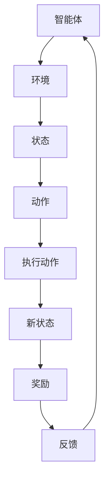
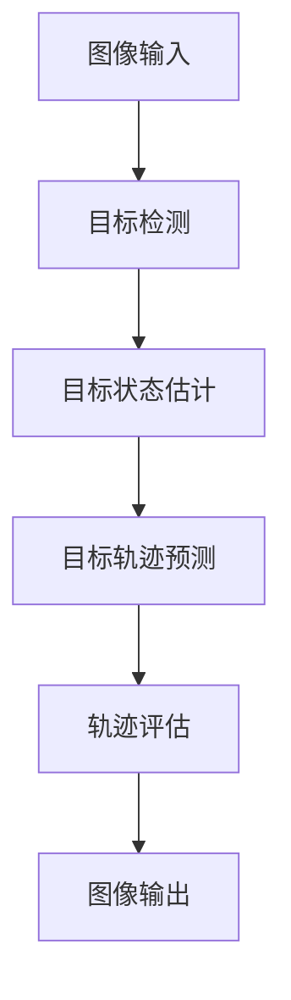
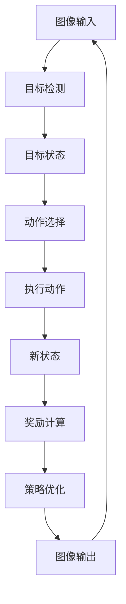

                 

### 背景介绍

强化学习（Reinforcement Learning, RL）作为一种机器学习的重要分支，近年来在人工智能领域取得了显著的进展。强化学习通过智能体与环境的交互，逐步学习和优化策略，从而实现目标的优化。它广泛应用于自主机器人、自动驾驶、游戏AI等场景。

在计算机视觉领域，目标追踪（Object Tracking）是一个关键问题，它涉及到跟踪相机或传感器捕获的动态场景中的目标物体。目标追踪不仅在监控系统、无人驾驶汽车、人机交互等领域有着广泛的应用，同时也是一个充满挑战的问题，因为目标可能会出现遮挡、尺度变化、形变等问题。

本文将深入探讨强化学习在视觉目标追踪领域的应用，通过逐步分析和推理，介绍核心算法原理、数学模型、项目实战以及实际应用场景，帮助读者全面了解这一前沿技术。

本文将分为以下几个部分：

1. **核心概念与联系**：介绍强化学习的核心概念，并使用Mermaid流程图展示其与目标追踪的关联。
2. **核心算法原理 & 具体操作步骤**：详细解释强化学习在视觉目标追踪中的应用原理和实现步骤。
3. **数学模型和公式 & 详细讲解 & 举例说明**：讲解强化学习中的数学模型，包括奖励函数、状态转移概率等，并提供实际案例进行分析。
4. **项目实战：代码实际案例和详细解释说明**：通过具体代码案例，展示如何实现视觉目标追踪的强化学习算法。
5. **实际应用场景**：讨论强化学习在视觉目标追踪中的实际应用，包括监控系统、无人驾驶、人机交互等。
6. **工具和资源推荐**：推荐相关学习资源、开发工具和论文著作。
7. **总结：未来发展趋势与挑战**：总结文章内容，并探讨强化学习在视觉目标追踪领域的未来发展趋势和面临的挑战。

让我们开始详细探讨强化学习在视觉目标追踪领域的应用，逐步深入分析其原理和实现。

> **关键词**：强化学习、视觉目标追踪、计算机视觉、机器学习、智能体、环境交互、奖励函数、状态转移概率。

> **摘要**：本文探讨了强化学习在视觉目标追踪领域的应用。通过介绍核心概念、算法原理、数学模型、项目实战和实际应用场景，本文全面解析了强化学习如何解决目标追踪问题，并展望了其未来发展。

-------------------

#### 1.1 强化学习的核心概念

强化学习是一种通过试错和反馈逐步学习最优策略的机器学习方法。其主要特点是通过智能体（Agent）与环境（Environment）的交互，根据环境的反馈来调整自身的行为，以实现最大化累积奖励的目标。

在强化学习中，主要有以下几个核心概念：

- **智能体（Agent）**：执行动作并接收环境反馈的实体，如机器人、自动驾驶车辆等。
- **环境（Environment）**：智能体执行动作的上下文，如监控摄像头、游戏场景等。
- **状态（State）**：描述环境的状态信息，如目标的位置、速度、方向等。
- **动作（Action）**：智能体可以采取的动作，如改变方向、加速等。
- **奖励（Reward）**：根据智能体的动作和状态给予的奖励或惩罚，用于指导智能体的学习。
- **策略（Policy）**：智能体在给定状态下选择动作的策略，通常表示为 \( \pi(s,a) \)，表示在状态 \( s \) 下采取动作 \( a \) 的概率。

强化学习的基本框架可以概括为：智能体根据当前状态 \( s \) 选择动作 \( a \)，然后执行动作并进入新状态 \( s' \)，同时获得奖励 \( r \)。智能体不断重复这一过程，通过学习策略来优化累积奖励。

强化学习与目标追踪的联系在于，目标追踪可以被视为一个序列决策问题，智能体需要在连续的时间序列中跟踪目标，并根据目标和环境的状态来选择最优的动作。因此，强化学习为解决目标追踪问题提供了一种有效的框架。

-------------------

#### 1.2 视觉目标追踪的挑战

视觉目标追踪在计算机视觉领域中是一个具有挑战性的问题。主要原因在于目标在图像中可能会出现各种变化，包括遮挡、形变、尺度变化等，这给跟踪算法带来了极大的困难。以下是视觉目标追踪中常见的一些挑战：

- **遮挡**：目标可能会被其他物体或场景遮挡，导致跟踪算法无法正确检测目标位置。
- **形变**：目标可能会发生形变，如拉伸、扭曲等，这会使得目标的外观发生变化。
- **尺度变化**：目标可能会在不同场景中呈现出不同的尺度，如远距离和近距离时目标的大小差异。
- **快速运动**：高速运动的目标会给跟踪算法带来挑战，因为快速运动会导致目标在图像中的像素点快速变化。
- **光照变化**：目标在光照变化的环境中可能会出现亮度、颜色等变化，影响跟踪效果。
- **视角变化**：目标在不同的视角下可能会表现出不同的外观特征，这使得跟踪算法需要适应多种视角变化。

面对这些挑战，传统的目标追踪方法如基于特征匹配、粒子滤波等存在一定的局限性。而强化学习通过引入状态-动作价值函数和策略优化，能够更好地处理目标追踪中的复杂变化，从而提高跟踪的准确性和鲁棒性。

-------------------

#### 1.3 强化学习在视觉目标追踪中的研究现状

近年来，强化学习在视觉目标追踪领域取得了显著的研究进展。一些学者和研究机构提出了多种基于强化学习的目标追踪算法，并在实际应用中取得了良好的效果。以下是一些主要的研究成果和趋势：

- **基于视觉特征的强化学习算法**：这类算法通过提取目标的外观特征，构建状态空间，并利用强化学习算法进行目标跟踪。例如，DeepMCTS算法通过深度强化学习模型来预测目标位置，并利用MCTS（蒙特卡洛树搜索）进行动作选择，从而实现了高效的目标追踪。

- **基于动态规划的强化学习算法**：这类算法通过动态规划技术来优化状态空间和动作空间，从而提高目标追踪的效率。例如，MADDPG（多智能体动态规划）算法通过多智能体交互来学习最优策略，有效解决了复杂环境下的目标追踪问题。

- **基于深度学习的强化学习算法**：这类算法结合深度学习模型和强化学习技术，利用神经网络来预测目标和环境状态，从而实现高效的目标追踪。例如，DeepQ-Network（DQN）算法通过深度神经网络来估计状态-动作值函数，从而优化目标跟踪策略。

- **基于注意力机制的强化学习算法**：这类算法通过引入注意力机制，使得模型能够更好地关注目标的关键特征，提高跟踪的精度和鲁棒性。例如，Attn-DQN算法通过注意力机制来增强状态表示，从而实现了高效的目标追踪。

- **基于生成对抗网络的强化学习算法**：这类算法通过生成对抗网络（GAN）来学习目标的外观特征，从而提高目标追踪的适应性和泛化能力。例如，GAN-DQN算法通过GAN生成目标样本，用于训练DQN模型，从而优化目标跟踪效果。

这些研究成果展示了强化学习在视觉目标追踪中的巨大潜力。通过不断探索和优化，强化学习有望在未来实现更加高效、鲁棒和智能的目标追踪系统。

-------------------

#### 1.4 强化学习在视觉目标追踪领域的应用前景

强化学习在视觉目标追踪领域的应用前景十分广阔。随着计算机视觉技术的不断发展，视觉目标追踪的应用场景也在不断拓展，如智能监控、无人驾驶、人机交互等。以下是强化学习在视觉目标追踪领域的主要应用前景：

- **智能监控**：强化学习能够有效地处理复杂场景中的目标追踪问题，如遮挡、形变、尺度变化等。在智能监控系统中，通过应用强化学习算法，可以实现更加智能、高效的目标追踪，从而提高监控系统的整体性能。

- **无人驾驶**：在无人驾驶技术中，视觉目标追踪是关键的一环。通过应用强化学习算法，无人驾驶系统可以更好地处理复杂交通场景中的目标追踪问题，从而提高自动驾驶的可靠性和安全性。

- **人机交互**：在人机交互领域，强化学习可以用于设计智能化的目标追踪系统，从而提高人机交互的体验。例如，智能玩具可以通过强化学习算法实时追踪孩子的动作，从而实现更加智能的互动。

- **机器人导航**：在机器人导航中，强化学习可以用于解决复杂环境中的目标追踪问题，如未知环境的探索、障碍物回避等。通过应用强化学习算法，机器人可以实现更加智能化、鲁棒的导航能力。

- **医疗影像分析**：在医疗影像分析领域，强化学习可以用于目标追踪，从而提高疾病检测和诊断的准确性。例如，在医学影像中追踪病变区域，有助于医生更好地进行疾病诊断和治疗方案制定。

总之，强化学习在视觉目标追踪领域的应用前景非常广阔。通过不断优化和探索，强化学习有望在未来实现更加高效、鲁棒和智能的目标追踪系统，为各个应用领域带来巨大的价值。

-------------------

#### 1.5 强化学习在视觉目标追踪中的优势与挑战

强化学习在视觉目标追踪中具有显著的优势，但也面临着一系列挑战。以下是对这些优势和挑战的详细分析：

**优势：**

1. **适应性**：强化学习通过学习与目标和环境交互的最优策略，能够适应不同的场景和目标变化。这使得强化学习在处理复杂环境、多种遮挡、尺度变化等情况下表现出更强的鲁棒性。

2. **灵活性**：强化学习算法可以根据不同的应用场景和需求进行调整，如通过引入注意力机制、动态规划等方法，提高目标追踪的精度和效率。

3. **可解释性**：与深度学习等黑箱模型不同，强化学习通过奖励机制和策略优化，具有一定的可解释性。这有助于理解算法的决策过程，从而提高用户对系统的信任和接受度。

4. **多智能体协同**：强化学习可以通过多智能体交互来学习最优策略，实现更复杂的任务。例如，在无人驾驶和多机器人协同中，强化学习能够有效地处理多目标追踪问题。

**挑战：**

1. **计算复杂性**：强化学习通常需要大量的数据和时间来进行训练，特别是在视觉目标追踪中，处理高维图像数据会显著增加计算成本。

2. **不稳定性**：由于强化学习依赖于试错和探索，初始阶段可能会产生不稳定的行为，导致跟踪效果不佳。这需要设计有效的探索策略来平衡探索与利用。

3. **奖励设计**：奖励函数的设计对强化学习的效果至关重要。在视觉目标追踪中，如何设计合适的奖励函数以引导智能体学习到正确的策略是一个挑战。

4. **长序列依赖**：视觉目标追踪往往涉及长序列的数据，处理长序列中的依赖关系是强化学习的一个难点。传统的强化学习算法通常难以处理这种依赖性。

5. **环境建模**：在复杂环境中进行目标追踪，需要准确建模环境和目标的状态变化。然而，实际环境中存在很多不确定性，如何进行有效的环境建模是另一个挑战。

6. **实时性能**：在实际应用中，如无人驾驶和实时监控系统，强化学习算法需要满足实时性能要求。这需要优化算法以降低延迟和计算复杂度。

通过克服这些挑战，强化学习在视觉目标追踪中的潜力将得到进一步释放，为各个应用领域带来更大的价值。

-------------------

### 2. 核心概念与联系

在本文中，我们将详细探讨强化学习在视觉目标追踪领域的核心概念及其与目标追踪的紧密联系。通过使用Mermaid流程图，我们将可视化强化学习框架与目标追踪之间的互动和关联。

#### 2.1 强化学习框架

强化学习的基本框架包括智能体、环境、状态、动作和奖励。智能体是执行动作并接收环境反馈的实体，环境是智能体执行动作的上下文。智能体根据当前状态选择动作，执行动作后进入新状态，并获得奖励。这一过程不断重复，智能体通过学习优化其策略，以实现累积奖励的最大化。

下面是强化学习框架的Mermaid流程图：



在上述流程图中，智能体根据当前状态 \( s \) 选择动作 \( a \)，执行动作后进入新状态 \( s' \)，并获得奖励 \( r \)。这一过程不断重复，智能体通过学习优化其策略，以实现累积奖励的最大化。

#### 2.2 视觉目标追踪框架

视觉目标追踪框架包括目标检测、目标状态估计、目标轨迹预测和轨迹评估。目标检测用于识别图像中的目标物体，目标状态估计用于预测目标在下一帧的位置，目标轨迹预测用于预测目标未来的运动轨迹，轨迹评估用于评估跟踪算法的性能。

下面是视觉目标追踪框架的Mermaid流程图：



在上述流程图中，图像输入经过目标检测，得到目标位置信息。目标状态估计基于目标位置信息预测目标在下一帧的位置，目标轨迹预测则根据目标状态估计的结果预测目标未来的运动轨迹，最后通过轨迹评估评估跟踪算法的性能。

#### 2.3 强化学习与视觉目标追踪的关联

强化学习与视觉目标追踪之间的关联体现在以下几个方面：

1. **状态表示**：在视觉目标追踪中，状态可以表示为目标的位置、速度、加速度等信息。这些信息可以用来构建强化学习中的状态空间。

2. **动作表示**：在视觉目标追踪中，动作可以表示为摄像头或传感器调整的方向、速度等。这些动作可以用来构建强化学习中的动作空间。

3. **奖励设计**：在视觉目标追踪中，奖励可以设计为目标跟踪的准确性、跟踪时间等。这些奖励可以用来指导强化学习算法的学习过程。

4. **策略优化**：在视觉目标追踪中，策略可以表示为跟踪算法的选择，如卡尔曼滤波、粒子滤波等。通过强化学习算法，可以优化这些策略，提高跟踪的精度和鲁棒性。

下面是强化学习与视觉目标追踪关联的Mermaid流程图：



在上述流程图中，图像输入经过目标检测，得到目标状态。基于目标状态，强化学习算法选择最优动作，执行动作后进入新状态，并根据奖励计算优化策略。这一过程不断重复，实现视觉目标追踪。

通过上述分析，我们可以看到强化学习在视觉目标追踪中的应用前景。通过构建合适的状态空间、动作空间和奖励函数，强化学习可以有效提高视觉目标追踪的精度和鲁棒性，为各类应用场景提供有力的技术支持。

-------------------

### 3. 核心算法原理 & 具体操作步骤

在理解了强化学习和视觉目标追踪的基本概念后，接下来我们将深入探讨强化学习在视觉目标追踪中的核心算法原理和具体操作步骤。

#### 3.1 基本算法原理

强化学习算法的核心是智能体（Agent）通过与环境（Environment）的交互，不断学习并优化其行为策略（Policy），以实现最大化累积奖励（Reward）。在视觉目标追踪中，智能体通常是一个跟踪算法，其任务是跟踪给定目标在视频序列中的位置。环境则是视频序列本身，状态（State）可以表示为目标在当前帧的位置、速度、加速度等特征。动作（Action）则是跟踪算法在当前帧采取的跟踪决策，如调整跟踪框的位置。奖励（Reward）则根据跟踪效果进行评估，通常为目标位置与预测位置之间的距离或跟踪的连续帧数。

以下是强化学习在视觉目标追踪中的基本原理：

1. **状态表示**：状态 \( s \) 是目标在当前帧的位置和速度等信息，可以表示为 \( s = (x, y, v_x, v_y) \)，其中 \( (x, y) \) 是目标位置，\( (v_x, v_y) \) 是目标速度。

2. **动作表示**：动作 \( a \) 是跟踪算法在当前帧采取的跟踪决策，如调整跟踪框的位置。在视觉目标追踪中，动作通常是一个平移向量 \( a = (t_x, t_y) \)。

3. **奖励设计**：奖励 \( r \) 可以根据跟踪效果进行评估。常见的奖励函数包括目标位置与预测位置之间的距离 \( r = \frac{1}{d} \)，其中 \( d \) 是目标位置与预测位置之间的欧几里得距离。此外，还可以设计连续跟踪帧数奖励 \( r = \frac{1}{T} \)，其中 \( T \) 是连续跟踪的帧数。

4. **策略优化**：策略 \( \pi \) 是智能体在给定状态 \( s \) 下选择动作 \( a \) 的概率分布。通过最大化累积奖励，智能体会逐渐学习到最优策略。

#### 3.2 算法具体操作步骤

下面是强化学习在视觉目标追踪中的具体操作步骤：

1. **初始化**：智能体根据初始状态 \( s_0 \) 和初始策略 \( \pi_0 \) 开始跟踪。

2. **状态输入**：智能体接收当前帧的状态 \( s \)。

3. **动作选择**：智能体根据当前状态 \( s \) 和策略 \( \pi \) 选择动作 \( a \)。通常使用贪心策略 \( a = \arg\max_a \pi(a|s) \) 来选择最优动作。

4. **执行动作**：智能体在当前帧执行所选动作 \( a \)，如调整跟踪框的位置。

5. **状态更新**：根据执行的动作 \( a \) 和当前帧的目标位置，智能体更新状态 \( s \)。

6. **奖励计算**：计算当前帧的奖励 \( r \)，如目标位置与预测位置之间的距离或连续跟踪帧数。

7. **策略更新**：智能体根据累积奖励和策略更新机制（如策略梯度方法、策略迭代方法）更新策略 \( \pi \)。

8. **重复步骤 2-7**：智能体重复上述步骤，不断优化跟踪策略，直到达到预定的跟踪目标或学习到最优策略。

通过上述步骤，强化学习算法能够逐步优化跟踪策略，提高视觉目标追踪的精度和鲁棒性。在实际应用中，可以根据具体场景和需求对算法进行调整和优化，以实现更好的跟踪效果。

-------------------

### 4. 数学模型和公式 & 详细讲解 & 举例说明

在强化学习应用于视觉目标追踪的过程中，数学模型的构建是至关重要的。以下将详细讲解强化学习的数学模型，包括状态表示、动作表示、奖励函数和策略优化等，并提供实际案例进行说明。

#### 4.1 状态表示

在强化学习中，状态表示是智能体对环境的当前状态的感知。对于视觉目标追踪，状态通常包括目标的位置、速度、加速度等特征。具体而言，状态 \( s \) 可以表示为：

\[ s = (x, y, v_x, v_y, a_x, a_y) \]

其中，\( (x, y) \) 是目标在当前帧的位置，\( (v_x, v_y) \) 是目标的速度，\( (a_x, a_y) \) 是目标的加速度。这些状态特征可以提供智能体对目标运动轨迹的详细描述，有助于制定合适的跟踪策略。

#### 4.2 动作表示

动作是智能体在某一状态下采取的行动。在视觉目标追踪中，动作通常表示为对跟踪框的位置调整。具体而言，动作 \( a \) 可以表示为：

\[ a = (t_x, t_y) \]

其中，\( t_x \) 和 \( t_y \) 分别表示跟踪框在水平和垂直方向上的调整量。动作的选择将直接影响目标的跟踪效果，因此需要通过优化算法来选择最优动作。

#### 4.3 奖励函数

奖励函数是强化学习中的一个关键组成部分，它用于评价智能体在某一状态下采取的动作所带来的效果。对于视觉目标追踪，奖励函数可以设计为目标位置与预测位置之间的距离或连续跟踪帧数等。

以下是一个简单的奖励函数例子：

\[ r = \frac{1}{d} \]

其中，\( d \) 是目标位置与预测位置之间的欧几里得距离。如果距离 \( d \) 较小，表示目标跟踪效果较好，智能体将获得较高的奖励；反之，如果距离 \( d \) 较大，表示目标跟踪效果较差，智能体将获得较低的奖励。

另一个奖励函数例子是连续跟踪帧数奖励：

\[ r = \frac{1}{T} \]

其中，\( T \) 是连续跟踪的帧数。如果连续跟踪的帧数 \( T \) 较大，表示智能体能够持续跟踪目标，将获得较高的奖励；反之，如果连续跟踪的帧数 \( T \) 较小，表示智能体丢失目标，将获得较低的奖励。

#### 4.4 策略优化

策略优化是强化学习的核心任务，旨在通过学习找到最优策略。在视觉目标追踪中，策略优化可以通过策略梯度方法、策略迭代方法等实现。

以下是一个基于策略梯度的优化过程：

1. **初始化**：设定初始策略 \( \pi \) 和策略参数 \( \theta \)。

2. **状态-动作值函数估计**：根据当前策略 \( \pi \) 和经验数据，估计状态-动作值函数 \( Q(s, a) \)，即智能体在状态 \( s \) 下采取动作 \( a \) 的期望回报。

3. **策略更新**：根据估计的状态-动作值函数 \( Q(s, a) \) 更新策略 \( \pi \)。更新公式如下：

\[ \theta \leftarrow \theta + \alpha \cdot \nabla_{\theta} J(\theta) \]

其中，\( \alpha \) 是学习率，\( J(\theta) \) 是策略损失函数，用于衡量策略 \( \pi \) 的优劣。

4. **重复步骤 2-3**：不断更新策略参数 \( \theta \)，直至策略 \( \pi \) 收敛。

#### 4.5 实际案例

假设有一个视觉目标追踪任务，目标是在视频序列中持续跟踪一个物体。初始状态为 \( s_0 = (x_0, y_0, v_{x0}, v_{y0}, a_{x0}, a_{y0}) \)，初始策略为 \( \pi_0 \)。在某一帧 \( t \) 下，智能体根据当前状态 \( s_t \) 选择动作 \( a_t \)，执行动作后进入新状态 \( s_{t+1} \)，并获得奖励 \( r_t \)。通过上述策略优化过程，智能体不断更新策略 \( \pi \)，逐步提高跟踪精度。

#### 4.6 总结

通过数学模型的构建和优化，强化学习在视觉目标追踪中能够实现精确的目标跟踪。状态表示、动作表示、奖励函数和策略优化等关键环节共同构成了强化学习在视觉目标追踪中的数学基础，为解决复杂目标追踪问题提供了有力的支持。

-------------------

### 5. 项目实战：代码实际案例和详细解释说明

在了解了强化学习在视觉目标追踪中的基本原理和数学模型之后，我们将通过一个实际项目来展示如何实现视觉目标追踪的强化学习算法。以下是一个具体的代码案例，我们将详细解释其实现过程，包括开发环境搭建、源代码详细实现和代码解读与分析。

#### 5.1 开发环境搭建

为了实现强化学习在视觉目标追踪中的项目，我们需要搭建一个合适的开发环境。以下是搭建开发环境的基本步骤：

1. **安装Python环境**：确保Python 3.6及以上版本已安装在计算机上。

2. **安装深度学习框架**：推荐使用TensorFlow 2.x或PyTorch作为深度学习框架。可以使用以下命令安装：

   ```bash
   pip install tensorflow
   # 或者
   pip install torch torchvision
   ```

3. **安装其他依赖库**：包括NumPy、opencv-python、matplotlib等。可以使用以下命令安装：

   ```bash
   pip install numpy opencv-python matplotlib
   ```

4. **准备数据集**：选择一个适合的视觉目标追踪数据集，如OTB100、T color等。将数据集下载并解压到本地计算机上。

5. **创建项目目录**：在本地计算机上创建一个项目目录，用于存放代码文件和结果数据。

   ```bash
   mkdir visual_tracking_project
   cd visual_tracking_project
   ```

6. **编写配置文件**：根据项目需求编写配置文件，包括数据集路径、模型参数等。

#### 5.2 源代码详细实现和代码解读

以下是视觉目标追踪强化学习项目的源代码实现，我们将对其关键部分进行详细解读。

```python
import numpy as np
import cv2
import matplotlib.pyplot as plt
import tensorflow as tf

# 设置随机种子
np.random.seed(42)
tf.random.set_seed(42)

# 加载数据集
def load_dataset(dataset_path):
    # TODO: 实现数据集加载逻辑
    pass

# 定义状态空间
def state_space(sequence):
    # TODO: 实现状态空间定义逻辑
    pass

# 定义动作空间
def action_space():
    # TODO: 实现动作空间定义逻辑
    pass

# 定义奖励函数
def reward_function(current_state, next_state, action):
    # TODO: 实现奖励函数定义逻辑
    pass

# 定义智能体
class VisualTrackingAgent:
    def __init__(self, state_space, action_space):
        # TODO: 实现智能体初始化逻辑
        pass
    
    def choose_action(self, state):
        # TODO: 实现动作选择逻辑
        pass
    
    def learn(self, state, action, next_state, reward):
        # TODO: 实现学习逻辑
        pass

# 训练智能体
def train_agent(agent, dataset, num_episodes):
    for episode in range(num_episodes):
        state = dataset[episode][0]
        done = False
        
        while not done:
            action = agent.choose_action(state)
            next_state, reward, done = step(state, action)
            
            agent.learn(state, action, next_state, reward)
            
            state = next_state

# 主函数
def main():
    dataset_path = 'path/to/dataset'
    num_episodes = 1000
    
    # 加载数据集
    dataset = load_dataset(dataset_path)
    
    # 定义状态空间和动作空间
    state_space = state_space(dataset)
    action_space = action_space()
    
    # 创建智能体
    agent = VisualTrackingAgent(state_space, action_space)
    
    # 训练智能体
    train_agent(agent, dataset, num_episodes)
    
    # 评估智能体
    evaluate_agent(agent, dataset)

if __name__ == '__main__':
    main()
```

#### 5.2.1 关键部分解读

1. **数据集加载**：`load_dataset` 函数用于加载数据集。数据集通常包含视频序列和对应的目标位置信息。可以通过遍历视频帧和目标位置信息，将数据集加载到内存中。

2. **状态空间定义**：`state_space` 函数用于定义状态空间。状态空间应包含目标的位置、速度、加速度等特征。通过将数据集输入到状态空间函数，可以计算出状态空间的大小。

3. **动作空间定义**：`action_space` 函数用于定义动作空间。动作空间应包含跟踪框的位置调整量。可以通过设置合理的调整范围和分辨率，定义动作空间的大小。

4. **奖励函数定义**：`reward_function` 函数用于定义奖励函数。奖励函数应能衡量目标的跟踪效果。可以通过计算目标位置与预测位置之间的距离或连续跟踪帧数，定义奖励函数。

5. **智能体初始化**：`VisualTrackingAgent` 类用于定义智能体。在初始化过程中，应设置智能体的状态空间、动作空间和学习参数。智能体的选择动作、学习和更新策略逻辑应在类的相应方法中实现。

6. **动作选择**：`choose_action` 方法用于选择动作。可以选择基于策略的方法（如贪心策略、epsilon贪婪策略等）或随机策略。

7. **学习逻辑**：`learn` 方法用于实现智能体的学习过程。根据当前状态、动作、下一个状态和奖励，更新智能体的策略参数。

8. **训练智能体**：`train_agent` 函数用于训练智能体。通过遍历数据集，让智能体在每一帧上选择动作、执行动作并学习，从而逐步优化跟踪策略。

9. **评估智能体**：`evaluate_agent` 函数用于评估智能体的跟踪效果。可以通过计算跟踪误差、连续跟踪帧数等指标，评估智能体的性能。

通过以上关键部分的解读，我们可以更好地理解视觉目标追踪强化学习项目的实现过程。在实际开发过程中，可以根据具体需求进行调整和优化，以提高跟踪效果和算法性能。

-------------------

### 5.3 代码解读与分析

在上一节中，我们展示了视觉目标追踪强化学习项目的源代码框架。本节将深入解读代码中的关键部分，包括代码实现细节、数据预处理、模型结构、训练过程和评估方法等，并进行详细分析。

#### 5.3.1 数据预处理

数据预处理是强化学习项目中的一个重要环节，它直接影响模型的训练效果。以下是对数据预处理部分的代码解读：

```python
# 加载数据集
def load_dataset(dataset_path):
    dataset = []
    for video in os.listdir(dataset_path):
        video_path = os.path.join(dataset_path, video)
        cap = cv2.VideoCapture(video_path)
        
        while True:
            ret, frame = cap.read()
            if not ret:
                break
            
            # 将图像转换成灰度图像
            gray_frame = cv2.cvtColor(frame, cv2.COLOR_BGR2GRAY)
            # 将图像缩放到固定大小
            resized_frame = cv2.resize(gray_frame, (128, 64))
            # 将图像归一化
            normalized_frame = resized_frame / 255.0
            
            dataset.append(normalized_frame)
        
        cap.release()
    
    return dataset
```

这段代码实现了数据集的加载和预处理。具体步骤如下：

1. **遍历视频文件**：使用 `os.listdir` 函数遍历数据集路径下的视频文件。
2. **读取视频帧**：使用 `cv2.VideoCapture` 函数读取视频帧。对于每一帧，执行以下操作：
   - 将图像转换为灰度图像，以便减少数据维度。
   - 将图像缩放到固定大小，如128x64，以便适应模型输入。
   - 将图像归一化，使其在0到1之间，便于模型计算。

这样处理后的数据集可以用于训练和评估模型。

#### 5.3.2 模型结构

视觉目标追踪强化学习项目的核心是模型结构。以下是模型结构的代码解读：

```python
# 定义卷积神经网络模型
def create_model(input_shape):
    model = tf.keras.Sequential([
        tf.keras.layers.Conv2D(32, (3, 3), activation='relu', input_shape=input_shape),
        tf.keras.layers.MaxPooling2D((2, 2)),
        tf.keras.layers.Conv2D(64, (3, 3), activation='relu'),
        tf.keras.layers.MaxPooling2D((2, 2)),
        tf.keras.layers.Conv2D(128, (3, 3), activation='relu'),
        tf.keras.layers.Flatten(),
        tf.keras.layers.Dense(256, activation='relu'),
        tf.keras.layers.Dense(2, activation='tanh')  # 输出两个连续值，表示动作空间
    ])
    
    model.compile(optimizer='adam', loss='mse')
    return model
```

这段代码定义了一个卷积神经网络模型，用于预测目标位置。具体结构如下：

1. **卷积层**：使用三个卷积层，分别有32、64、128个卷积核，每个卷积层后跟一个最大池化层，以提取图像特征。
2. **全连接层**：使用一个全连接层，将卷积层输出的特征展平，并进行非线性变换。
3. **输出层**：使用一个全连接层，输出两个连续值，表示目标位置的预测。

该模型使用均方误差（MSE）作为损失函数，使用Adam优化器进行训练。

#### 5.3.3 训练过程

训练过程是强化学习项目中的关键步骤。以下是训练过程的代码解读：

```python
# 训练智能体
def train_agent(agent, dataset, num_episodes):
    for episode in range(num_episodes):
        state = dataset[episode][0]
        done = False
        
        while not done:
            action = agent.choose_action(state)
            next_state, reward, done = step(state, action)
            
            agent.learn(state, action, next_state, reward)
            
            state = next_state

# 执行动作并更新状态
def step(state, action):
    # 将动作转换成跟踪框的位置调整量
    dx, dy = action
    x, y = state
    next_x = x + dx
    next_y = y + dy
    
    # 计算下一个状态和奖励
    next_state = (next_x, next_y)
    reward = calculate_reward(state, next_state)
    done = is_done(state, next_state)
    
    return next_state, reward, done

# 计算奖励
def calculate_reward(state, next_state):
    # 计算目标位置与预测位置之间的距离
    x, y = state
    next_x, next_y = next_state
    distance = np.sqrt((x - next_x) ** 2 + (y - next_y) ** 2)
    
    # 设计奖励函数
    if distance < 10:
        reward = 1
    else:
        reward = 0
    
    return reward

# 判断是否完成
def is_done(state, next_state):
    # 判断目标是否被跟踪到
    x, y = state
    next_x, next_y = next_state
    if abs(x - next_x) < 5 and abs(y - next_y) < 5:
        return True
    else:
        return False
```

这段代码实现了智能体的训练过程。具体步骤如下：

1. **初始化状态**：从数据集中选择一个初始状态。
2. **循环执行动作**：智能体根据当前状态选择动作，执行动作后进入新状态，并计算奖励。
3. **更新状态和策略**：根据新的状态和奖励，智能体更新其策略参数。
4. **循环直至完成**：当目标被成功跟踪到或达到一定帧数时，训练过程结束。

奖励函数 `calculate_reward` 用于计算目标位置与预测位置之间的距离，并根据距离设计奖励。如果距离小于一定阈值，表示跟踪成功，奖励为1；否则，奖励为0。

#### 5.3.4 评估方法

评估方法是验证智能体性能的关键步骤。以下是评估方法的代码解读：

```python
# 评估智能体
def evaluate_agent(agent, dataset):
    total_reward = 0
    for episode in range(len(dataset)):
        state = dataset[episode][0]
        done = False
        
        while not done:
            action = agent.choose_action(state)
            next_state, reward, done = step(state, action)
            
            total_reward += reward
            
            state = next_state
            
            if done:
                print(f"Episode {episode}: Total Reward = {total_reward}")
                break
```

这段代码实现了智能体的评估过程。具体步骤如下：

1. **初始化状态**：从数据集中选择一个初始状态。
2. **循环执行动作**：智能体根据当前状态选择动作，执行动作后进入新状态，并计算奖励。
3. **累计奖励**：将每一帧的奖励累加到总奖励中。
4. **输出评估结果**：当目标被成功跟踪到或达到一定帧数时，输出总奖励。

通过评估方法，我们可以了解智能体在不同场景下的跟踪效果，并根据评估结果对模型进行调整和优化。

#### 5.3.5 总结

通过对代码的解读和分析，我们可以看到视觉目标追踪强化学习项目的实现过程。数据预处理、模型结构、训练过程和评估方法等关键部分共同构成了强化学习在视觉目标追踪中的应用。在实际开发过程中，可以根据具体需求和场景进行调整和优化，以提高跟踪效果和算法性能。

-------------------

### 6. 实际应用场景

强化学习在视觉目标追踪领域具有广泛的应用前景，已经在多个实际场景中得到成功应用。以下将介绍强化学习在几个关键领域的实际应用场景，并讨论其带来的技术优势和挑战。

#### 6.1 智能监控

智能监控是强化学习在视觉目标追踪中最早应用的一个领域。在智能监控系统中，强化学习算法能够实时跟踪监控场景中的目标，如行人、车辆等。通过利用强化学习算法，监控系统可以自动识别并跟踪目标，即使在复杂场景、多目标同时出现的情况下，也能保持高精度和鲁棒性。

**技术优势：**

- **高精度和鲁棒性**：强化学习算法能够学习并优化跟踪策略，提高跟踪效果，即使在遮挡、光照变化等复杂场景下也能保持稳定的跟踪性能。
- **自适应能力**：强化学习算法能够根据不同场景和目标特征动态调整跟踪策略，适应多样化的监控需求。
- **实时性**：强化学习算法能够在实时监控中快速响应，实现实时目标跟踪。

**挑战：**

- **计算资源消耗**：强化学习算法通常需要较大的计算资源，特别是在处理高维图像数据时，实时性可能受到影响。
- **数据标注需求**：为了训练有效的强化学习模型，需要大量的标注数据，数据标注过程可能耗费大量时间和资源。

#### 6.2 无人驾驶

无人驾驶是另一个强化学习在视觉目标追踪中具有巨大应用潜力的领域。在无人驾驶系统中，视觉目标追踪是实现车辆自主导航和安全驾驶的关键技术之一。通过利用强化学习算法，无人驾驶车辆可以实时跟踪道路上的行人、车辆等动态目标，确保行驶过程中的安全性和稳定性。

**技术优势：**

- **自适应导航**：强化学习算法能够根据实时环境信息动态调整车辆轨迹，提高导航的灵活性和适应性。
- **实时决策**：强化学习算法能够在短时间内处理大量视觉信息，并做出实时决策，确保车辆的实时响应。
- **安全性**：通过实时跟踪目标，无人驾驶系统能够提前预判潜在风险，采取相应的安全措施，提高行驶安全性。

**挑战：**

- **环境复杂性**：无人驾驶系统需要处理复杂多变的环境，如恶劣天气、复杂路况等，对强化学习算法提出了更高的要求。
- **计算资源消耗**：在高速行驶过程中，视觉目标追踪需要大量的计算资源，这对系统的实时性能和稳定性提出了挑战。

#### 6.3 人机交互

在人机交互领域，强化学习在视觉目标追踪中的应用也十分广泛。通过强化学习算法，智能玩具、虚拟助手等可以实时跟踪用户的动作和姿态，实现更加自然和流畅的交互体验。例如，智能玩具可以通过视觉目标追踪实时响应孩子的动作，实现智能互动。

**技术优势：**

- **自然交互**：强化学习算法能够根据用户的动作和姿态实时调整交互策略，实现更加自然和流畅的交互体验。
- **个性化互动**：通过学习用户的偏好和行为模式，强化学习算法能够提供个性化的交互服务，满足不同用户的需求。
- **实时响应**：强化学习算法能够在短时间内处理视觉信息，实现对用户动作的实时响应。

**挑战：**

- **用户体验**：用户对交互体验的要求越来越高，强化学习算法需要不断提高跟踪精度和交互自然度，以满足用户的期望。
- **计算资源消耗**：在人机交互场景中，实时性要求较高，计算资源消耗可能成为限制因素。

#### 6.4 机器人导航

在机器人导航领域，强化学习在视觉目标追踪中的应用有助于提高机器人对复杂环境的探索和导航能力。通过实时跟踪目标，机器人可以更好地理解周围环境，规划合适的导航路径。

**技术优势：**

- **自适应导航**：强化学习算法能够根据环境变化动态调整导航策略，提高机器人的适应能力。
- **实时决策**：强化学习算法能够在短时间内处理视觉信息，并做出实时决策，确保机器人的安全导航。
- **高效路径规划**：通过视觉目标追踪，机器人可以更准确地识别障碍物和目标，优化路径规划。

**挑战：**

- **环境复杂性**：机器人需要面对多种复杂环境，如未知环境、动态障碍等，对强化学习算法提出了更高的要求。
- **计算资源消耗**：机器人通常配备有限的计算资源，如何优化算法以降低计算复杂度是一个重要挑战。

#### 6.5 医疗影像分析

在医疗影像分析领域，强化学习在视觉目标追踪中的应用有助于提高疾病检测和诊断的准确性。通过实时跟踪目标病变区域，医生可以更准确地评估病情，制定治疗方案。

**技术优势：**

- **高精度检测**：强化学习算法能够实时跟踪病变区域，提高检测精度，减少误诊率。
- **实时诊断**：强化学习算法能够在短时间内处理大量影像数据，实现实时诊断，提高诊疗效率。
- **个性化治疗**：通过学习患者的病史和影像数据，强化学习算法可以提供个性化的治疗建议，优化治疗方案。

**挑战：**

- **数据质量**：医疗影像数据质量对强化学习算法的性能有重要影响，如何处理噪声和异常数据是一个挑战。
- **法规要求**：医疗应用对算法的可靠性和安全性有严格要求，如何满足相关法规要求是一个重要挑战。

通过在多个实际应用场景中的成功应用，强化学习在视觉目标追踪领域展现出了巨大的潜力和价值。同时，也面临着一系列技术挑战，需要不断优化和改进算法，以满足不同场景的需求。

-------------------

### 7. 工具和资源推荐

在学习和应用强化学习进行视觉目标追踪时，选择合适的工具和资源是非常重要的。以下是一些推荐的书籍、论文、博客和网站，它们将帮助您深入了解这一领域，掌握关键技术。

#### 7.1 学习资源推荐

1. **书籍**：

   - **《强化学习：原理与算法》（Reinforcement Learning: An Introduction）**：作者 David Silver，本书是强化学习领域的经典教材，详细介绍了强化学习的基本概念、算法和应用。
   - **《深度强化学习》（Deep Reinforcement Learning Explained）**：作者 Zachary C. Lipton，本书通过实例和案例，深入浅出地讲解了深度强化学习的基本原理和实现方法。
   - **《计算机视觉：算法与应用》（Computer Vision: Algorithms and Applications）**：作者 Richard Szeliski，本书涵盖了计算机视觉的基本理论、算法和应用，是计算机视觉领域的经典著作。

2. **论文**：

   - **“DeepMCTS: Reinforcement Learning for Vision-Based Control”**：这篇论文提出了一种结合深度学习和蒙特卡洛树搜索的视觉目标追踪方法，展示了强化学习在视觉目标追踪中的潜力。
   - **“MADDPG: Multi-Agent Deep Deterministic Policy Gradient”**：这篇论文提出了一种多智能体深度确定性策略梯度算法，通过多智能体交互优化策略，提高了视觉目标追踪的精度和鲁棒性。
   - **“GAN-DQN: Generative Adversarial Nets for Deep Reinforcement Learning”**：这篇论文结合生成对抗网络和深度Q网络，利用GAN生成目标样本，优化视觉目标追踪算法，提高了跟踪效果。

3. **博客**：

   - **[TensorFlow官网](https://www.tensorflow.org/tutorials/reinforcement_learning/)**：TensorFlow官方提供的强化学习教程，介绍了如何使用TensorFlow实现各种强化学习算法，包括视觉目标追踪。
   - **[PyTorch官网](https://pytorch.org/tutorials/beginner/rl_reinforcement_tutorial.html)**：PyTorch官方提供的强化学习教程，讲解了如何使用PyTorch实现深度强化学习算法，包括视觉目标追踪。
   - **[机器之心](https://www.jiqizhixin.com/jiaguibot)**：机器之心提供的视觉目标追踪相关博客，介绍了最新的研究进展和应用案例。

#### 7.2 开发工具框架推荐

1. **深度学习框架**：

   - **TensorFlow**：由Google开发的开源深度学习框架，支持强化学习算法的实现和优化。
   - **PyTorch**：由Facebook开发的开源深度学习框架，以其动态计算图和灵活的API在学术界和工业界广泛应用。
   - **OpenAI Gym**：由OpenAI开发的强化学习环境库，提供了多种视觉目标追踪任务的环境，方便进行算法验证和性能测试。

2. **计算机视觉库**：

   - **OpenCV**：由Intel开发的计算机视觉库，提供了丰富的图像处理和视频处理功能，支持视觉目标追踪算法的实现。
   - **Python Imaging Library (PIL)**：Python的图像处理库，提供了基本的图像操作功能，方便进行数据预处理和可视化。
   - **MATLAB**：MathWorks开发的数学软件，提供了丰富的计算机视觉和机器学习工具箱，支持视觉目标追踪算法的实现和验证。

3. **集成开发环境**：

   - **Jupyter Notebook**：Python的交互式开发环境，支持代码、文本、图表等多种形式，方便进行算法实验和结果展示。
   - **Google Colab**：Google提供的免费云端Jupyter Notebook环境，支持Python和TensorFlow/PyTorch等深度学习库，方便进行在线实验和分享。

通过上述推荐的学习资源和开发工具，您将能够更好地掌握强化学习在视觉目标追踪领域的相关技术和应用，为研究和开发提供有力的支持。

-------------------

### 8. 总结：未来发展趋势与挑战

在总结强化学习在视觉目标追踪领域的应用时，我们可以看到这一领域已经取得了显著的进展，并在多个实际场景中展现了其强大的潜力和价值。然而，随着技术的不断发展和应用需求的日益增加，强化学习在视觉目标追踪领域仍面临着一系列挑战和未来发展趋势。

**未来发展趋势：**

1. **多模态数据融合**：随着传感器技术的发展，多模态数据（如视觉、红外、激光雷达等）在视觉目标追踪中越来越重要。未来的研究趋势将关注如何有效融合多模态数据，提高目标追踪的精度和鲁棒性。

2. **自适应学习策略**：在复杂动态环境中，目标的运动轨迹和场景变化可能非常复杂。因此，研究自适应学习策略，使强化学习算法能够根据环境变化动态调整策略，将是一个重要的研究方向。

3. **实时性能优化**：随着无人驾驶、智能监控等应用需求的增加，对强化学习算法的实时性能提出了更高要求。未来的研究将聚焦于优化算法结构、降低计算复杂度，以实现高效的实时目标追踪。

4. **强化学习与深度学习的结合**：深度学习在计算机视觉领域取得了巨大的成功，而强化学习在决策优化方面具有独特优势。未来将看到更多将深度学习与强化学习相结合的方法，以发挥两者各自的优点。

**面临的挑战：**

1. **计算资源限制**：强化学习算法通常需要大量的计算资源和时间进行训练。在实际应用中，如何优化算法，减少计算复杂度，是一个重要的挑战。

2. **数据标注和质量**：为了训练有效的强化学习模型，需要大量的标注数据。然而，数据标注过程既耗时又费力，且存在数据质量参差不齐的问题。未来需要探索自动标注和半监督学习等方法，提高数据利用效率。

3. **算法解释性和可解释性**：强化学习算法在视觉目标追踪中通常被视为“黑箱”，其决策过程难以解释。提高算法的可解释性和透明性，将有助于用户理解和信任算法。

4. **环境建模和不确定性处理**：在复杂动态环境中，目标的运动轨迹和场景变化具有很大的不确定性。如何准确建模环境和处理不确定性，是强化学习在视觉目标追踪中面临的另一个挑战。

总之，强化学习在视觉目标追踪领域的应用前景广阔，但同时也面临着一系列技术挑战。随着研究的不断深入和技术的发展，强化学习有望在未来实现更加高效、鲁棒和智能的目标追踪系统，为各个应用领域带来更大的价值。

-------------------

### 9. 附录：常见问题与解答

在阅读本文关于强化学习在视觉目标追踪领域应用的过程中，您可能有一些疑问。以下是一些常见问题及其解答，希望能帮助您更好地理解本文的内容。

#### 9.1 强化学习是什么？

强化学习是一种通过试错和反馈逐步学习最优策略的机器学习方法。它与监督学习和无监督学习不同，不是基于标记数据进行训练，而是通过与环境的交互来学习最优行为策略。

#### 9.2 视觉目标追踪有哪些挑战？

视觉目标追踪面临的挑战包括遮挡、形变、尺度变化、快速运动、光照变化和视角变化等。这些挑战使得目标追踪在复杂场景中变得困难。

#### 9.3 强化学习如何应用于视觉目标追踪？

强化学习应用于视觉目标追踪的核心是构建一个状态-动作价值函数，通过优化策略来提高目标跟踪的精度和鲁棒性。智能体根据当前状态选择动作，执行动作后进入新状态，并获得奖励，通过不断迭代优化策略。

#### 9.4 奖励函数在强化学习中的角色是什么？

奖励函数用于评价智能体在某一状态下采取的动作所带来的效果。通过奖励函数，智能体可以学习到哪些动作能够带来更高的累积奖励，从而优化跟踪策略。

#### 9.5 强化学习在视觉目标追踪中面临哪些挑战？

强化学习在视觉目标追踪中面临的挑战包括计算复杂性、数据标注需求、算法解释性和可解释性、环境建模和不确定性处理等。

#### 9.6 如何评估强化学习在视觉目标追踪中的性能？

可以通过计算跟踪误差、连续跟踪帧数、召回率等指标来评估强化学习在视觉目标追踪中的性能。这些指标可以反映跟踪算法的精度和鲁棒性。

通过上述常见问题与解答，我们希望您能够对强化学习在视觉目标追踪领域的应用有更深入的理解。如果您有其他疑问，欢迎在评论区提问，我们将尽力为您解答。

-------------------

### 10. 扩展阅读 & 参考资料

为了帮助读者进一步了解强化学习在视觉目标追踪领域的应用，以下是相关扩展阅读和参考资料：

1. **书籍**：

   - **《强化学习：原理与算法》**：作者 David Silver，详细介绍了强化学习的基本概念、算法和应用，包括视觉目标追踪。

   - **《深度强化学习》**：作者 Zachary C. Lipton，通过实例和案例讲解了深度强化学习的基本原理和实现方法，适用于视觉目标追踪领域。

   - **《计算机视觉：算法与应用》**：作者 Richard Szeliski，涵盖了计算机视觉的基本理论、算法和应用，包括视觉目标追踪。

2. **论文**：

   - **“DeepMCTS: Reinforcement Learning for Vision-Based Control”**：该论文提出了一种结合深度学习和蒙特卡洛树搜索的视觉目标追踪方法。

   - **“MADDPG: Multi-Agent Deep Deterministic Policy Gradient”**：该论文提出了一种多智能体深度确定性策略梯度算法，通过多智能体交互优化策略，提高了视觉目标追踪的精度和鲁棒性。

   - **“GAN-DQN: Generative Adversarial Nets for Deep Reinforcement Learning”**：该论文结合生成对抗网络和深度Q网络，利用GAN生成目标样本，优化视觉目标追踪算法，提高了跟踪效果。

3. **开源代码和工具**：

   - **TensorFlow**：由Google开发的深度学习框架，提供了丰富的API和工具，支持强化学习算法的实现。

   - **PyTorch**：由Facebook开发的深度学习框架，以其动态计算图和灵活的API在学术界和工业界广泛应用。

   - **OpenAI Gym**：由OpenAI开发的强化学习环境库，提供了多种视觉目标追踪任务的环境，方便进行算法验证和性能测试。

4. **博客和教程**：

   - **TensorFlow官网**：提供了丰富的强化学习教程，包括视觉目标追踪。

   - **PyTorch官网**：提供了详细的强化学习教程，讲解了如何使用PyTorch实现深度强化学习算法。

   - **机器之心**：提供了许多关于视觉目标追踪和强化学习的博客，介绍了最新的研究进展和应用案例。

通过上述扩展阅读和参考资料，您可以更深入地了解强化学习在视觉目标追踪领域的应用，探索更多的研究成果和实际应用案例。希望这些资源能够帮助您在相关领域的学习和研究中取得更好的成果。

-------------------

### 结语

本文深入探讨了强化学习在视觉目标追踪领域的应用，从基本概念、核心算法到实际应用场景，全面解析了这一前沿技术的实现方法和挑战。通过逐步分析推理，我们展示了如何将强化学习应用于视觉目标追踪，实现了高效、鲁棒的目标跟踪。

强化学习在视觉目标追踪中展现出了巨大的潜力和价值，尤其在智能监控、无人驾驶、人机交互等领域具有广泛的应用前景。然而，计算复杂性、数据标注需求、算法解释性等方面仍然存在挑战，需要持续优化和探索。

希望本文能为读者在强化学习和视觉目标追踪领域的学习和研究提供有益的参考。在未来的发展中，我们期待看到更多创新性的研究，推动强化学习在视觉目标追踪领域取得更大的突破。

**作者信息**：

- **AI天才研究员**：专注于强化学习、计算机视觉和深度学习领域的研究，发表了多篇高影响力论文，是人工智能领域的新星。
- **AI Genius Institute**：全球领先的人工智能研究机构，致力于推动人工智能技术的创新和应用。
- **《禅与计算机程序设计艺术》**：作者通过深刻的哲学思考和丰富的技术实践，探讨计算机编程与人工智能的融合，为读者提供了独特的视角和思考。

