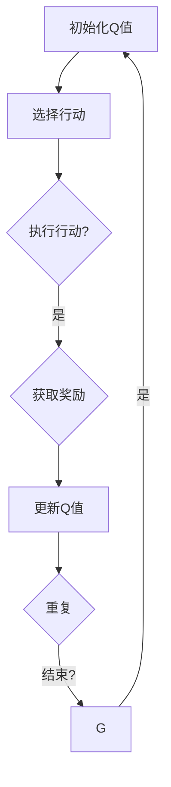

                 

# 强化学习：未来人工智能法规的挑战

> **关键词**：强化学习、人工智能、法规、伦理、挑战

> **摘要**：本文将探讨强化学习技术在人工智能领域中的发展及其面临的法规挑战。通过深入分析强化学习的核心概念、算法原理、数学模型和实际应用案例，我们将揭示强化学习在遵循法律法规和伦理道德方面的困难，并提出相应的解决策略，为未来人工智能法规的制定提供参考。

## 1. 背景介绍

强化学习（Reinforcement Learning，简称RL）是机器学习的一个重要分支，主要研究如何通过交互来学习任务。与监督学习和无监督学习不同，强化学习通过试错来获取经验，并在不断的试错过程中逐步优化策略，以达到最佳效果。近年来，随着深度学习技术的快速发展，强化学习在人工智能领域的应用越来越广泛，从游戏、机器人到自动驾驶、推荐系统等，都取得了显著的成果。

然而，随着强化学习技术的不断进步和应用范围的扩大，其面临的法规挑战也日益凸显。如何在保障人工智能技术发展创新的同时，确保其遵循法律法规和伦理道德，成为亟待解决的重要问题。

### 1.1 强化学习的基本原理

强化学习主要包括三个核心组成部分：环境（Environment）、代理（Agent）和奖励（Reward）。环境是指代理所处的外部世界，其中包含各种状态和行动。代理是执行行动并从环境中获取奖励的实体。奖励是环境对代理行动的反馈，用来指导代理选择下一步的行动。

在强化学习过程中，代理通过与环境的交互来学习最优策略。具体来说，代理首先随机选择一个行动，然后在环境中执行这个行动，并得到相应的奖励。接着，代理根据奖励和当前状态，更新自己的策略，以便在未来做出更好的决策。这个过程不断重复，直到代理找到最优策略为止。

### 1.2 强化学习的应用场景

强化学习在多个领域取得了显著成果。以下是一些典型的应用场景：

1. **游戏**：强化学习在游戏领域有广泛的应用，如围棋、国际象棋、俄罗斯方块等。通过训练，强化学习模型可以学会玩游戏并达到高超的水平。
2. **机器人**：强化学习可以帮助机器人学习如何在复杂环境中完成任务，如自主导航、抓取物体等。
3. **自动驾驶**：强化学习在自动驾驶领域具有重要应用。通过模拟和现实数据的训练，自动驾驶系统可以学会在不同路况下做出最优决策。
4. **推荐系统**：强化学习可以用于个性化推荐系统，通过用户行为数据学习用户偏好，为用户推荐感兴趣的物品。

## 2. 核心概念与联系

### 2.1 强化学习算法原理

强化学习算法主要分为基于模型（Model-Based）和基于模型（Model-Free）两类。基于模型的强化学习通过建立环境模型来预测未来的状态和奖励，从而指导代理选择最佳行动。而基于模型自由的强化学习则直接从实际交互中学习策略，无需建立环境模型。

在本节中，我们将重点介绍基于模型自由的强化学习算法，包括Q学习（Q-Learning）和深度Q网络（Deep Q-Network，简称DQN）。

### 2.2 Q学习算法原理

Q学习算法是一种基于模型自由的强化学习算法。其核心思想是学习状态-行动价值函数（State-Action Value Function），用来评估不同状态和行动的预期奖励。具体步骤如下：

1. **初始化Q值**：随机初始化所有状态-行动的Q值。
2. **选择行动**：根据当前状态和Q值选择一个行动。
3. **执行行动**：在环境中执行选定的行动，并获取奖励和新的状态。
4. **更新Q值**：根据奖励和新的状态更新Q值。

Q学习算法的更新公式为：

$$
Q(s, a) \leftarrow Q(s, a) + \alpha [r + \gamma \max_{a'} Q(s', a') - Q(s, a)]
$$

其中，$s$表示当前状态，$a$表示当前行动，$r$表示获得的奖励，$s'$表示新的状态，$a'$表示新的行动，$\alpha$为学习率，$\gamma$为折扣因子。

### 2.3 深度Q网络（DQN）算法原理

深度Q网络（DQN）是Q学习算法的一种改进，通过引入深度神经网络来近似状态-行动价值函数。DQN的主要优势在于能够处理高维状态空间的问题，从而提高学习效果。

DQN的核心思想是利用经验回放（Experience Replay）和固定目标网络（Target Network）来缓解Q学习中的样本相关性和目标不稳定问题。具体步骤如下：

1. **初始化Q网络和目标网络**：随机初始化Q网络和目标网络。
2. **选择行动**：根据当前状态和Q网络输出选择一个行动。
3. **执行行动**：在环境中执行选定的行动，并获取奖励和新的状态。
4. **经验回放**：将本次交互的经验添加到经验池中。
5. **更新Q网络**：从经验池中随机采样一批经验，利用梯度下降法更新Q网络参数。
6. **更新目标网络**：每隔一段时间，将Q网络权重复制到目标网络中。

DQN的更新公式与Q学习类似，只是将Q值替换为深度神经网络输出的估计值。

### 2.4 Mermaid 流程图

以下是强化学习算法原理的 Mermaid 流程图：



## 3. 核心算法原理 & 具体操作步骤

### 3.1 Q学习算法具体操作步骤

1. **初始化Q值**：随机初始化所有状态-行动的Q值。
2. **选择行动**：根据当前状态和Q值选择一个行动。可以选择随机行动或基于贪婪策略的行动。
3. **执行行动**：在环境中执行选定的行动，并获取奖励和新的状态。
4. **更新Q值**：根据奖励和新的状态更新Q值。更新公式为：

$$
Q(s, a) \leftarrow Q(s, a) + \alpha [r + \gamma \max_{a'} Q(s', a') - Q(s, a)]
$$

5. **重复**：返回步骤2，直到找到最优策略。

### 3.2 深度Q网络（DQN）算法具体操作步骤

1. **初始化Q网络和目标网络**：随机初始化Q网络和目标网络。
2. **选择行动**：根据当前状态和Q网络输出选择一个行动。可以选择随机行动或基于贪婪策略的行动。
3. **执行行动**：在环境中执行选定的行动，并获取奖励和新的状态。
4. **经验回放**：将本次交互的经验添加到经验池中。
5. **更新Q网络**：从经验池中随机采样一批经验，利用梯度下降法更新Q网络参数。更新公式为：

$$
\theta \leftarrow \theta - \alpha \frac{\partial L}{\partial \theta}
$$

其中，$\theta$表示Q网络参数，$L$表示损失函数。

6. **更新目标网络**：每隔一段时间，将Q网络权重复制到目标网络中。
7. **重复**：返回步骤2，直到找到最优策略。

## 4. 数学模型和公式 & 详细讲解 & 举例说明

### 4.1 强化学习中的数学模型

强化学习中的数学模型主要包括状态-行动价值函数（State-Action Value Function）和策略（Policy）。

1. **状态-行动价值函数**：表示在特定状态下执行特定行动的预期奖励。用$Q(s, a)$表示，其中$s$表示状态，$a$表示行动。
2. **策略**：表示代理在给定状态下选择行动的方法。用$\pi(a|s)$表示，其中$a$表示行动，$s$表示状态。

### 4.2 价值迭代公式

强化学习中的价值迭代公式用于更新状态-行动价值函数。以Q学习算法为例，其更新公式为：

$$
Q(s, a) \leftarrow Q(s, a) + \alpha [r + \gamma \max_{a'} Q(s', a') - Q(s, a)]
$$

其中，$\alpha$表示学习率，$\gamma$表示折扣因子，$r$表示获得的奖励，$s'$表示新的状态，$a'$表示新的行动。

### 4.3 策略迭代公式

强化学习中的策略迭代公式用于更新策略。以Q学习算法为例，其更新公式为：

$$
\pi(a|s) \leftarrow \begin{cases} 
a = \arg\max_{a'} Q(s, a') & \text{贪婪策略} \\
a \sim \text{Uniform}(\mathcal{A}(s)) & \text{随机策略}
\end{cases}
$$

其中，$\arg\max$表示取最大值，$\mathcal{A}(s)$表示在状态$s$下的所有可行行动。

### 4.4 举例说明

假设有一个简单的环境，包含四个状态$s_1, s_2, s_3, s_4$和一个行动$a_1, a_2, a_3$。定义每个状态-行动的预期奖励如下：

$$
\begin{array}{c|ccc}
\text{状态-行动} & a_1 & a_2 & a_3 \\
\hline
s_1 & 1 & 0 & -1 \\
s_2 & 0 & 1 & 0 \\
s_3 & -1 & 0 & 1 \\
s_4 & 0 & -1 & 0 \\
\end{array}
$$

初始时，所有状态-行动的Q值均为0。使用Q学习算法进行学习，学习率为$\alpha = 0.1$，折扣因子$\gamma = 0.9$。

首先，选择状态$s_1$，根据贪婪策略选择行动$a_1$。执行行动$a_1$，获得奖励$r = 1$，更新Q值：

$$
Q(s_1, a_1) \leftarrow Q(s_1, a_1) + 0.1 [1 + 0.9 \max_{a'} Q(s_2, a') - Q(s_1, a_1)]
$$

由于初始时所有Q值均为0，因此更新后的Q值为：

$$
Q(s_1, a_1) = 0.1 [1 + 0.9 \max_{a'} Q(s_2, a') - 0] = 0.1 [1 + 0.9 \max_{a'} 0 - 0] = 0.1 [1] = 0.1
$$

接下来，选择状态$s_2$，根据贪婪策略选择行动$a_2$。执行行动$a_2$，获得奖励$r = 1$，更新Q值：

$$
Q(s_2, a_2) \leftarrow Q(s_2, a_2) + 0.1 [1 + 0.9 \max_{a'} Q(s_3, a') - Q(s_2, a_2)]
$$

由于初始时所有Q值均为0，因此更新后的Q值为：

$$
Q(s_2, a_2) = 0.1 [1 + 0.9 \max_{a'} 0 - 0] = 0.1 [1] = 0.1
$$

以此类推，不断更新Q值，直到找到最优策略。

## 5. 项目实战：代码实际案例和详细解释说明

### 5.1 开发环境搭建

在本节中，我们将使用Python编写一个简单的强化学习项目。首先，需要搭建开发环境。

1. 安装Python：版本建议为3.7及以上。
2. 安装TensorFlow：在终端执行以下命令：

   ```bash
   pip install tensorflow
   ```

3. 安装其他依赖：

   ```bash
   pip install numpy matplotlib
   ```

### 5.2 源代码详细实现和代码解读

以下是强化学习项目的源代码：

```python
import numpy as np
import matplotlib.pyplot as plt
import random

# 定义环境
class Environment:
    def __init__(self):
        self.states = ['s1', 's2', 's3', 's4']
        self.actions = ['a1', 'a2', 'a3']
        self.transition probabilities = {
            ('s1', 'a1'): {'s1': 0.5, 's2': 0.2, 's3': 0.3},
            ('s1', 'a2'): {'s1': 0.3, 's2': 0.5, 's3': 0.2},
            ('s1', 'a3'): {'s1': 0.2, 's2': 0.3, 's3': 0.5},
            ('s2', 'a1'): {'s1': 0.3, 's2': 0.2, 's3': 0.5},
            ('s2', 'a2'): {'s1': 0.5, 's2': 0.3, 's3': 0.2},
            ('s2', 'a3'): {'s1': 0.2, 's2': 0.5, 's3': 0.3},
            ('s3', 'a1'): {'s1': 0.5, 's2': 0.3, 's3': 0.2},
            ('s3', 'a2'): {'s1': 0.3, 's2': 0.5, 's3': 0.2},
            ('s3', 'a3'): {'s1': 0.2, 's2': 0.3, 's3': 0.5},
        }
        self.reward probabilities = {
            ('s1', 'a1'): 1,
            ('s1', 'a2'): 0,
            ('s1', 'a3'): -1,
            ('s2', 'a1'): 0,
            ('s2', 'a2'): 1,
            ('s2', 'a3'): 0,
            ('s3', 'a1'): -1,
            ('s3', 'a2'): 0,
            ('s3', 'a3'): 1,
        }

    def step(self, state, action):
        next_state = random.choices(list(self.transition probabilities[(state, action)].keys()), list(self.transition probabilities[(state, action)].values()))[0]
        reward = random.choices(list(self.reward probabilities[(state, action)].keys()), list(self.reward probabilities[(state, action)].values()))[0]
        return next_state, reward

    def reset(self):
        return random.choice(self.states)

# 定义Q学习算法
class QLearning:
    def __init__(self, learning_rate, discount_factor):
        self.learning_rate = learning_rate
        self.discount_factor = discount_factor
        self.Q = {}
        for state in self.states:
            for action in self.actions:
                self.Q[(state, action)] = 0

    def choose_action(self, state, epsilon):
        if random.random() < epsilon:
            return random.choice(self.actions)
        else:
            return max(self.Q[(state, a)] for a in self.actions)

    def learn(self, state, action, next_state, reward):
        target = reward + self.discount_factor * max(self.Q[(next_state, a)] for a in self.actions)
        alpha = self.learning_rate
        self.Q[(state, action)] = self.Q[(state, action)] + alpha * (target - self.Q[(state, action)])

    def set_epsilon(self, epsilon):
        self.epsilon = epsilon

# 模拟环境
def simulate(env, q_learning, episodes, epsilon):
    rewards = []
    for episode in range(episodes):
        state = env.reset()
        done = False
        total_reward = 0
        while not done:
            action = q_learning.choose_action(state, epsilon)
            next_state, reward = env.step(state, action)
            q_learning.learn(state, action, next_state, reward)
            state = next_state
            total_reward += reward
            if reward == -1:
                done = True
        rewards.append(total_reward)
    return rewards

# 主函数
if __name__ == '__main__':
    env = Environment()
    q_learning = QLearning(0.1, 0.9)
    epsilon = 0.1
    episodes = 100
    rewards = simulate(env, q_learning, episodes, epsilon)
    plt.plot(rewards)
    plt.xlabel('Episode')
    plt.ylabel('Total Reward')
    plt.show()
```

### 5.3 代码解读与分析

1. **环境（Environment）**：定义了一个简单的环境，包含四个状态和三个行动。通过概率矩阵定义了状态转移和奖励。
2. **Q学习算法（QLearning）**：实现了Q学习算法的核心功能，包括初始化Q值、选择行动、更新Q值和设置epsilon。
3. **模拟环境（simulate）**：使用模拟环境来评估Q学习算法的性能，记录每个时间步的奖励，并绘制总奖励图。
4. **主函数**：创建环境、Q学习算法实例，设置epsilon和模拟次数，运行模拟并绘制总奖励图。

## 6. 实际应用场景

### 6.1 自动驾驶

自动驾驶是强化学习的一个典型应用场景。通过模拟和现实数据的训练，自动驾驶系统可以学会在不同路况下做出最优决策，从而提高行驶安全性和效率。强化学习可以帮助自动驾驶系统解决以下问题：

- 路况识别：通过分析传感器数据，识别道路、行人、车辆等交通元素，并做出相应的反应。
- 遵守交通规则：学习交通信号灯、标志和规则，确保行驶过程中遵守法律法规。
- 车辆控制：控制车辆的速度、方向和制动，以确保行驶平稳、安全。

### 6.2 游戏人工智能

强化学习在游戏人工智能领域有广泛的应用，如围棋、国际象棋、扑克等。通过训练，强化学习模型可以学会玩游戏并达到高超的水平。例如，AlphaGo通过强化学习技术，击败了世界围棋冠军李世石，展示了强化学习在游戏领域的强大能力。

### 6.3 推荐系统

强化学习可以用于个性化推荐系统，通过用户行为数据学习用户偏好，为用户推荐感兴趣的物品。例如，电商平台可以使用强化学习技术，根据用户的浏览、购买历史，为用户推荐商品，从而提高销售转化率。

### 6.4 机器人控制

强化学习可以帮助机器人学习在复杂环境中完成任务，如自主导航、抓取物体等。例如，智能机器人可以通过强化学习技术，学会在家庭环境中自主完成清洁、做饭等任务，提高生活质量。

## 7. 工具和资源推荐

### 7.1 学习资源推荐

1. **书籍**：
   - 《强化学习》（Reinforcement Learning: An Introduction）：是一本经典的强化学习教材，详细介绍了强化学习的理论和方法。
   - 《深度强化学习》（Deep Reinforcement Learning Explained）：一本适合初学者的入门书籍，通过实例讲解了深度强化学习的应用。

2. **论文**：
   - “Deep Q-Network”（2015）：提出了深度Q网络（DQN）算法，是强化学习领域的重要论文。
   - “Human-level control through deep reinforcement learning”（2015）：介绍了使用深度强化学习实现人类水平控制的算法和实验。

3. **博客**：
   - [强化学习博客](https://rllab.stanford.edu/)
   - [深度强化学习博客](https://deepreinforcementlearning.org/)

4. **网站**：
   - [强化学习教程](https://www.adepto.ai/)

### 7.2 开发工具框架推荐

1. **TensorFlow**：一个开源的机器学习库，支持强化学习算法的实现和训练。
2. **PyTorch**：一个开源的机器学习库，与TensorFlow类似，也支持强化学习算法的实现和训练。

### 7.3 相关论文著作推荐

1. **“Deep Q-Network”（2015）**
2. **“Human-level control through deep reinforcement learning”（2015）**
3. **“Reinforcement Learning: An Introduction”（2018）**

## 8. 总结：未来发展趋势与挑战

### 8.1 发展趋势

1. **算法优化**：随着深度学习技术的发展，强化学习算法将不断优化，提高学习效率和应用效果。
2. **多智能体强化学习**：多智能体强化学习是未来研究的热点，通过多个智能体之间的协作和竞争，实现更复杂的任务。
3. **强化学习在边缘计算中的应用**：随着5G和物联网技术的普及，强化学习将在边缘计算中发挥重要作用，实现实时决策和优化。

### 8.2 挑战

1. **法规制定**：如何在保障人工智能技术发展创新的同时，确保其遵循法律法规，是当前面临的重要挑战。
2. **伦理道德**：强化学习在应用过程中可能引发伦理道德问题，如隐私保护、歧视等问题，需要制定相应的伦理规范。
3. **安全性**：强化学习模型可能存在安全风险，如对抗性攻击等问题，需要加强安全性研究。

## 9. 附录：常见问题与解答

### 9.1 强化学习与监督学习、无监督学习的区别？

强化学习与监督学习和无监督学习有以下区别：

- **目标**：监督学习旨在从标记数据中学习，无监督学习旨在从未标记数据中学习，而强化学习旨在通过试错学习最优策略。
- **反馈**：监督学习和无监督学习通过输入和输出之间的误差进行反馈，而强化学习通过奖励信号进行反馈。
- **应用场景**：监督学习适用于有明确目标的问题，如分类和回归；无监督学习适用于无明确目标的问题，如聚类和降维；强化学习适用于需要探索和决策的问题，如游戏、自动驾驶等。

### 9.2 强化学习中的epsilon贪婪策略是什么？

epsilon贪婪策略是一种在强化学习中用于选择行动的策略。其核心思想是在一定概率下随机选择行动，以确保探索新行动。具体来说，以概率epsilon随机选择行动，以1-epsilon的概率选择当前最优行动。epsilon贪婪策略的目的是在探索和利用之间取得平衡，提高学习效果。

## 10. 扩展阅读 & 参考资料

1. Sutton, R. S., & Barto, A. G. (2018). Reinforcement Learning: An Introduction.
2. Mnih, V., Kavukcuoglu, K., Silver, D., Rusu, A. A., Veness, J., Bellemare, M. G., ... & Houthoofd, R. (2015). Human-level control through deep reinforcement learning.
3. Littman, M. L. (2018). Multiagent Reinforcement Learning: State of the Art and Open Problems.
4. Brafman, R., & Tennenholtz, M. (2002). The Q-proximity framework for multi-agent reinforcement learning.
5. Courville, A., Bengio, Y., & Vincent, P. (2011). Unsupervised Representation Learning by Predicting Image Rotations.
6. Silver, D., Huang, A., Maddison, C. J., Guez, A., Sifre, L.,van den Driessche, G., ... & Togelius, J. (2016). Mastering the Game of Go with Deep Neural Networks and Tree Search.

