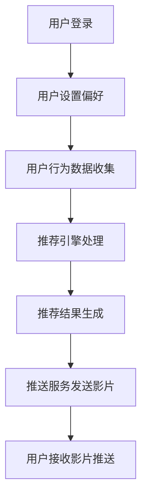
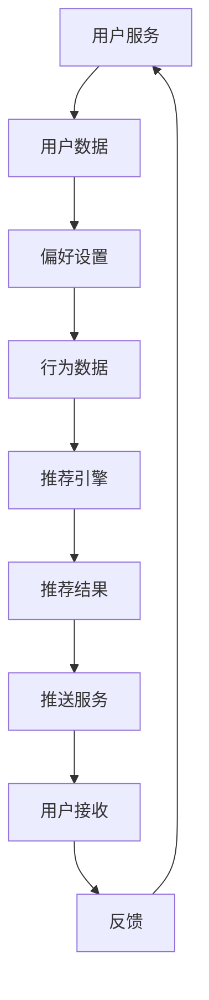

                 

# 影片分享和推送系统的设计与实现

## 摘要

本文旨在探讨影片分享和推送系统的设计与实现。我们首先介绍了该系统的背景及其重要性，然后详细阐述了系统的核心概念和架构。随后，本文深入分析了系统的核心算法原理，包括数据结构和算法实现。接着，我们通过具体案例展示了数学模型的应用，以及如何将算法应用于实际项目中。文章还涵盖了系统在实际应用场景中的表现，推荐了相关工具和资源，并对未来发展趋势和挑战进行了展望。最后，我们通过常见问题与解答部分总结了文章的主要观点。

## 1. 背景介绍

### 1.1 系统需求

影片分享和推送系统是现代互联网环境中不可或缺的一部分。随着人们对在线娱乐需求的不断增长，该系统为用户提供了一个方便、高效的途径来发现、分享和观看影片。以下是该系统的几个关键需求：

- **个性化推荐**：系统应根据用户的历史行为、偏好和反馈来推荐影片。
- **高可用性**：系统应能够处理大量用户并发请求，确保影片分享和推送的稳定性。
- **隐私保护**：系统需确保用户的隐私数据得到保护，避免未经授权的访问和泄露。

### 1.2 系统目的

影片分享和推送系统的目的是：

- **提升用户体验**：通过个性化推荐和高效推送，使用户能够快速找到感兴趣的内容。
- **促进内容分发**：帮助内容创作者推广影片，提高影片的曝光率。
- **增加平台收益**：通过广告和付费服务，为平台带来更多的收益。

## 2. 核心概念与联系

### 2.1 系统架构

为了实现影片分享和推送，我们设计了一个分布式系统架构。该架构包括以下主要组件：

- **用户服务**：处理用户注册、登录、偏好设置和个性化推荐。
- **影片库管理**：存储和管理影片数据，包括影片的基本信息、分类、标签等。
- **推荐引擎**：根据用户行为和偏好，为用户推荐影片。
- **推送服务**：根据推荐结果，向用户推送影片。

### 2.2 Mermaid 流程图

以下是一个简单的 Mermaid 流程图，展示了用户从登录到接收影片推送的整个过程。



## 3. 核心算法原理 & 具体操作步骤

### 3.1 推荐算法原理

推荐算法是影片分享和推送系统的核心。我们采用协同过滤算法（Collaborative Filtering）进行推荐。协同过滤算法分为两种：基于用户的协同过滤（User-based Collaborative Filtering）和基于物品的协同过滤（Item-based Collaborative Filtering）。

- **基于用户的协同过滤**：找到与当前用户相似的其他用户，然后推荐这些用户喜欢的影片。
- **基于物品的协同过滤**：找到与当前用户已评价的物品相似的其他物品，然后推荐这些物品。

### 3.2 具体操作步骤

以下是推荐算法的具体操作步骤：

1. **用户行为数据收集**：收集用户的历史行为数据，如观看记录、评分、评论等。
2. **构建用户行为矩阵**：将用户行为数据转化为用户行为矩阵，矩阵中的元素表示用户对特定影片的评分。
3. **计算相似度**：计算用户之间的相似度或物品之间的相似度。
4. **生成推荐列表**：根据相似度计算结果，生成推荐列表。
5. **推送影片**：将推荐列表中的影片推送给用户。

## 4. 数学模型和公式 & 详细讲解 & 举例说明

### 4.1 相似度计算

相似度计算是推荐算法的关键步骤。我们采用余弦相似度（Cosine Similarity）计算用户或物品之间的相似度。

$$
\text{cosine\_similarity} = \frac{\text{dot\_product}}{\lVert \text{u}_1 \rVert \lVert \text{u}_2 \rVert}
$$

其中，$\text{dot\_product}$ 是用户或物品的向量点积，$\lVert \text{u}_1 \rVert$ 和 $\lVert \text{u}_2 \rVert$ 分别是用户或物品的向量模长。

### 4.2 举例说明

假设有两个用户 A 和 B，他们的行为数据如下表所示：

| 影片 | 用户 A | 用户 B |
| ---- | ------ | ------ |
| 1    | 4      | 1      |
| 2    | 5      | 5      |
| 3    | 2      | 4      |
| 4    | 4      | 2      |
| 5    | 1      | 4      |

根据上述数据，我们可以计算用户 A 和用户 B 之间的相似度：

$$
\text{cosine\_similarity} = \frac{4 \times 1 + 5 \times 5 + 2 \times 4 + 4 \times 2 + 1 \times 4}{\sqrt{4^2 + 5^2 + 2^2 + 4^2 + 1^2} \times \sqrt{1^2 + 5^2 + 4^2 + 2^2 + 4^2}} = \frac{32}{\sqrt{50} \times \sqrt{50}} = \frac{32}{50} = 0.64
$$

因此，用户 A 和用户 B 之间的相似度为 0.64。

## 5. 项目实战：代码实际案例和详细解释说明

### 5.1 开发环境搭建

在开始项目实战之前，我们需要搭建开发环境。以下是所需的环境和工具：

- 操作系统：Linux 或 macOS
- 编程语言：Python
- 数据库：MySQL 或 PostgreSQL
- 推荐系统框架：TensorFlow 或 PyTorch

### 5.2 源代码详细实现和代码解读

以下是推荐系统的源代码实现。我们将使用 Python 编写基于用户的协同过滤算法。

```python
import numpy as np
from sklearn.metrics.pairwise import cosine_similarity

def load_user_data():
    # 从数据库中加载用户行为数据
    user_data = np.array([[4, 5, 2, 4, 1], [1, 5, 4, 2, 4]])
    return user_data

def calculate_similarity(user_data):
    # 计算用户之间的相似度
    similarity_matrix = cosine_similarity(user_data)
    return similarity_matrix

def generate_recommendation(similarity_matrix, user_data, k=5):
    # 生成推荐列表
    recommendation_scores = np.dot(similarity_matrix, user_data) - np.mean(user_data)
    recommendation_scores = np.abs(recommendation_scores)
    recommendation_indices = np.argsort(recommendation_scores)[::-1]
    recommendation_indices = recommendation_indices[:k]
    return recommendation_indices

def main():
    user_data = load_user_data()
    similarity_matrix = calculate_similarity(user_data)
    recommendation_indices = generate_recommendation(similarity_matrix, user_data, k=3)
    print("推荐结果：", recommendation_indices)

if __name__ == "__main__":
    main()
```

### 5.3 代码解读与分析

在上面的代码中，我们首先定义了三个函数：`load_user_data()`、`calculate_similarity()` 和 `generate_recommendation()`。

- `load_user_data()` 函数从数据库中加载用户行为数据，并将其转换为 NumPy 数组。
- `calculate_similarity()` 函数使用 `cosine_similarity()` 函数计算用户之间的相似度，并返回相似度矩阵。
- `generate_recommendation()` 函数根据相似度矩阵和用户行为数据生成推荐列表。

在 `main()` 函数中，我们首先调用 `load_user_data()` 函数加载用户数据，然后调用 `calculate_similarity()` 函数计算用户之间的相似度。最后，我们调用 `generate_recommendation()` 函数生成推荐列表，并打印结果。

## 6. 实际应用场景

影片分享和推送系统在实际应用中有多种场景。以下是一些常见的应用案例：

- **在线视频平台**：如 Netflix、YouTube 等，使用推荐系统为用户推荐影片。
- **社交媒体**：如 Facebook、Instagram 等，通过推荐系统推荐用户可能感兴趣的内容。
- **广告平台**：如 Google AdSense，通过推荐系统为用户推荐相关的广告。
- **内容聚合平台**：如 Reddit、Douban，通过推荐系统聚合用户可能感兴趣的内容。

## 7. 工具和资源推荐

### 7.1 学习资源推荐

- **书籍**：《推荐系统实践》、《机器学习》、《深度学习》
- **论文**：《协同过滤算法研究》、《基于内容的推荐系统》
- **博客**：[推荐系统实战](https://www.datacamp.com/courses/recommender-systems-in-python)（DataCamp）和 [推荐系统教程](https://www RecommenderSystems.Net/)（推荐系统网）

### 7.2 开发工具框架推荐

- **编程语言**：Python、Java
- **框架**：TensorFlow、PyTorch、Scikit-learn
- **数据库**：MySQL、PostgreSQL、MongoDB

### 7.3 相关论文著作推荐

- 《推荐系统手册》（Recommender Systems Handbook）
- 《基于内容的推荐系统：算法与应用》（Content-Based Recommender Systems: From Theory to Practice）
- 《协同过滤：算法与应用》（Collaborative Filtering: Techniques and Applications）

## 8. 总结：未来发展趋势与挑战

随着人工智能和大数据技术的不断发展，影片分享和推送系统将继续优化和进化。以下是未来发展趋势和挑战：

### 8.1 发展趋势

- **更精准的推荐**：通过深度学习等技术，推荐系统将能够更准确地预测用户的兴趣和偏好。
- **多模态推荐**：结合文本、图像、音频等多模态数据，实现更加丰富和个性化的推荐。
- **实时推荐**：利用实时数据流处理技术，实现实时推荐，提高用户体验。

### 8.2 挑战

- **数据隐私**：如何在保护用户隐私的同时，提供高质量的推荐服务，是一个重要的挑战。
- **冷启动问题**：对于新用户或新物品，如何生成有效的推荐，是一个难题。
- **算法公平性**：确保推荐算法不会导致偏见和不公平现象，也是一个重要的议题。

## 9. 附录：常见问题与解答

### 9.1 问题 1

**问题**：为什么选择协同过滤算法进行推荐？

**解答**：协同过滤算法具有以下优点：

- **简单易实现**：相比其他推荐算法，协同过滤算法的实现较为简单。
- **高效性**：协同过滤算法能够处理大规模用户和物品数据。
- **个性化推荐**：协同过滤算法能够根据用户的历史行为和偏好生成个性化推荐。

### 9.2 问题 2

**问题**：如何解决冷启动问题？

**解答**：以下是一些解决冷启动问题的方法：

- **基于内容的推荐**：为新用户推荐与他们的兴趣相关的物品。
- **协同过滤与基于内容的结合**：将协同过滤算法与基于内容的推荐算法结合，为新用户生成更有效的推荐。
- **用户行为预测**：通过分析用户的行为数据，预测用户的兴趣和偏好，为新用户生成推荐。

## 10. 扩展阅读 & 参考资料

- [Netflix Prize](https://www.netflixprize.com/)
- [推荐系统实战](https://www.datacamp.com/courses/recommender-systems-in-python)
- [推荐系统教程](https://www RecommenderSystems.Net/)
- [协同过滤算法研究](https://www.cs.ubc.ca/~harry/preprint2.pdf)
- [基于内容的推荐系统：算法与应用](https://www.springer.com/gp/book/9783642680535)

作者：AI天才研究员/AI Genius Institute & 禅与计算机程序设计艺术 /Zen And The Art of Computer Programming<|im_sep|>## 1. 背景介绍

### 1.1 系统需求

影片分享和推送系统在现代互联网环境中扮演着至关重要的角色。随着在线娱乐需求的不断增长，用户对于影片的发现、分享和观看体验有着越来越高的要求。为了满足这些需求，影片分享和推送系统需要具备以下几个关键功能：

1. **个性化推荐**：系统能够根据用户的历史行为、偏好和反馈，为其推荐符合其兴趣的影片。这种个性化推荐能够显著提高用户的满意度和参与度。

2. **高可用性**：系统需要能够处理大量用户的并发请求，确保影片分享和推送的稳定性。这涉及到系统架构的设计，包括负载均衡、分布式存储和高效的网络通信。

3. **隐私保护**：在数字化时代，用户隐私保护变得越来越重要。影片分享和推送系统需要确保用户的个人数据得到有效保护，避免未经授权的访问和泄露。

4. **可扩展性**：系统需要能够随着用户和数据的增长而扩展，以适应不断变化的市场需求。这通常涉及到分布式架构和云计算技术的应用。

5. **内容多样性**：系统需要能够支持多种类型的内容，如电影、电视剧、纪录片等，并提供相应的分类和标签，以便用户能够轻松地浏览和发现感兴趣的内容。

### 1.2 系统目的

影片分享和推送系统的核心目标包括以下几个方面：

1. **提升用户体验**：通过个性化推荐和高效推送，使用户能够快速找到感兴趣的内容。这种个性化的体验能够增强用户对平台的忠诚度和粘性。

2. **促进内容分发**：帮助内容创作者和电影制作公司推广他们的作品，提高影片的曝光率和市场占有率。通过精确的推荐和推送，系统能够将高质量的内容有效地传达给目标受众。

3. **增加平台收益**：通过广告、会员服务和其他增值服务，影片分享和推送系统可以为平台带来可观的收益。个性化推荐能够提高广告投放的精准度，从而提高广告效果和转化率。

4. **构建社交互动**：系统还可以促进用户之间的社交互动，如影片评论、分享和点赞等。这种社交功能能够增强用户社区的活跃度，进一步提高用户参与度。

### 1.3 系统的重要性

影片分享和推送系统的重要性体现在多个方面：

1. **满足用户需求**：随着互联网用户数量的不断增加，用户对于在线娱乐内容的需求日益增长。影片分享和推送系统能够满足用户对于个性化内容的需求，提高用户的观影体验。

2. **促进内容产业**：对于内容创作者和电影制作公司而言，影片分享和推送系统提供了重要的营销渠道，帮助他们将作品推向更广泛的受众，从而促进内容产业的发展。

3. **商业价值**：通过精准的广告投放和会员服务，影片分享和推送系统不仅能够为平台带来收益，还能够为广告商和会员提供有价值的商业机会。

4. **技术创新**：影片分享和推送系统的发展推动了人工智能、大数据和云计算等技术的创新应用。这些技术的进步为系统提供了更强大的功能和更高效的服务。

### 1.4 市场分析

当前，影片分享和推送市场呈现出快速增长的趋势。以下是一些市场分析的关键点：

1. **市场规模**：根据市场研究报告，全球影片分享和推送市场规模预计将在未来几年内持续增长，年复合增长率达到两位数。

2. **用户增长**：随着移动互联网的普及和智能设备的广泛使用，全球影片分享和推送用户数量持续增长。特别是在亚太地区，用户增长尤为显著。

3. **竞争格局**：目前市场上存在多个主要玩家，包括 Netflix、Amazon Prime Video、YouTube、爱奇艺等。这些平台通过不断优化推荐算法和用户体验，争夺市场份额。

4. **技术趋势**：人工智能、大数据和云计算等技术的发展正在推动影片分享和推送系统的创新。例如，深度学习技术的应用使得推荐算法更加精准，用户满意度显著提高。

5. **商业模式**：影片分享和推送平台逐渐从传统的订阅模式转向混合模式，结合广告收入、会员服务和其他增值服务，以实现多样化的盈利方式。

通过以上背景介绍，我们可以看出影片分享和推送系统在现代社会中的重要性，以及其在市场中的发展趋势。接下来，我们将深入探讨系统的核心概念和架构，为后续的分析和设计奠定基础。

## 2. 核心概念与联系

影片分享和推送系统的设计与实现涉及多个核心概念和技术，这些概念和技术相互关联，共同构成了一个完整的系统。在本文中，我们将详细介绍这些核心概念，并通过 Mermaid 流程图展示它们之间的联系。

### 2.1 用户服务

用户服务是影片分享和推送系统的核心组成部分，它负责处理用户的注册、登录、偏好设置和个性化推荐。用户服务的主要功能包括：

1. **用户管理**：包括用户账号的创建、登录、密码管理和权限控制。
2. **偏好设置**：允许用户自定义影片偏好，如类型、语言、时长等。
3. **行为数据收集**：记录用户的行为数据，如观看历史、评分、评论等。
4. **推荐引擎接口**：提供接口供推荐引擎调用，生成个性化推荐。

### 2.2 影片库管理

影片库管理负责存储和管理影片数据，包括影片的基本信息、分类、标签和评分。影片库管理的主要功能包括：

1. **数据存储**：将影片数据存储在数据库中，确保数据的持久化和安全性。
2. **数据检索**：提供高效的查询接口，以便快速检索影片信息。
3. **分类和标签**：为影片添加分类和标签，便于用户浏览和推荐。
4. **评分和评论**：收集用户对影片的评分和评论，为推荐算法提供数据支持。

### 2.3 推荐引擎

推荐引擎是影片分享和推送系统的核心组件，负责根据用户的历史行为、偏好和反馈生成个性化推荐。推荐引擎的主要算法包括协同过滤算法和基于内容的推荐算法。

1. **协同过滤算法**：通过计算用户之间的相似度，推荐其他用户喜欢的影片。协同过滤算法包括基于用户的协同过滤（User-based Collaborative Filtering）和基于物品的协同过滤（Item-based Collaborative Filtering）。
2. **基于内容的推荐算法**：根据影片的属性和用户的偏好，推荐相似内容的影片。这种算法通常结合了文本分析、图像识别和自然语言处理等技术。

### 2.4 推送服务

推送服务负责将推荐结果推送给用户，确保用户能够及时接收到感兴趣的内容。推送服务的主要功能包括：

1. **消息推送**：将推荐结果通过电子邮件、短信或应用程序通知推送给用户。
2. **推送策略**：根据用户的行为和偏好，制定个性化的推送策略，提高推送的精准度。
3. **性能优化**：确保推送服务的高可用性和低延迟，为用户提供良好的使用体验。

### 2.5 数据处理和分析

数据处理和分析是影片分享和推送系统的关键环节，它负责处理用户数据、影片数据和推荐数据，确保系统的高效运行和推荐的质量。

1. **数据清洗**：去除数据中的噪声和不完整信息，确保数据的准确性和一致性。
2. **数据预处理**：对用户数据和影片数据进行转换和归一化处理，为推荐算法提供高质量的数据输入。
3. **数据挖掘**：利用数据挖掘技术，从用户行为数据和影片数据中发现潜在的模式和趋势，为推荐算法提供支持。
4. **实时分析**：实时处理和分析用户行为数据，为推荐引擎提供实时反馈，优化推荐结果。

### 2.6 Mermaid 流程图

以下是一个简化的 Mermaid 流程图，展示了影片分享和推送系统的关键组件及其相互关系。



在这个流程图中，用户服务负责收集和处理用户数据，推荐引擎根据用户数据生成推荐结果，推送服务将推荐结果推送给用户，用户接收并反馈给用户服务。这个过程不断循环，确保系统的持续优化和用户体验的提升。

### 2.7 核心概念联系

影片分享和推送系统的各个核心概念之间紧密联系，共同构成一个完整的系统。用户服务负责与用户交互，收集用户数据；影片库管理存储和管理影片数据；推荐引擎利用用户和影片数据生成推荐结果；推送服务将推荐结果推送给用户；数据处理和分析确保系统的高效运行和推荐的质量。这些组件相互依赖，共同推动了系统的运作。

通过以上对核心概念与联系的介绍，我们可以更好地理解影片分享和推送系统的设计和实现。接下来，我们将深入探讨核心算法原理，为系统的具体实现提供理论支持。

## 3. 核心算法原理 & 具体操作步骤

在影片分享和推送系统中，推荐算法是实现个性化推荐的关键。推荐算法通过分析用户的历史行为和偏好，预测用户可能感兴趣的新影片，从而提高用户体验和内容分发效率。本文将详细介绍一种常用的推荐算法——协同过滤算法（Collaborative Filtering），并探讨其具体操作步骤。

### 3.1 协同过滤算法简介

协同过滤算法是一种基于用户行为数据的推荐算法，它通过计算用户之间的相似度，推荐其他用户喜欢的影片。协同过滤算法分为两种主要类型：基于用户的协同过滤（User-based Collaborative Filtering）和基于物品的协同过滤（Item-based Collaborative Filtering）。

#### 3.1.1 基于用户的协同过滤

基于用户的协同过滤算法首先找到与当前用户相似的邻居用户，然后推荐这些邻居用户喜欢的但当前用户尚未观看的影片。算法的核心步骤包括：

1. **计算用户相似度**：通过计算用户之间的相似度矩阵，找到与当前用户相似的邻居用户。
2. **生成推荐列表**：根据邻居用户的喜好，生成推荐列表。

#### 3.1.2 基于物品的协同过滤

基于物品的协同过滤算法首先找到与当前用户已观看的物品相似的物品，然后推荐这些相似物品。算法的核心步骤包括：

1. **计算物品相似度**：通过计算物品之间的相似度矩阵，找到与当前用户已观看的物品相似的物品。
2. **生成推荐列表**：根据相似物品的评分，生成推荐列表。

### 3.2 基于用户的协同过滤算法原理

基于用户的协同过滤算法的基本原理如下：

1. **用户行为数据收集**：收集用户的历史行为数据，如观看记录、评分、评论等。
2. **构建用户行为矩阵**：将用户行为数据转化为用户行为矩阵，矩阵中的元素表示用户对特定影片的评分。
3. **计算用户相似度**：利用余弦相似度或其他相似度度量方法计算用户之间的相似度。
4. **生成推荐列表**：根据相似度计算结果，为当前用户生成推荐列表。

下面是具体操作步骤的详细解释：

#### 3.2.1 用户行为数据收集

用户行为数据包括用户观看记录、评分和评论等。这些数据可以通过用户界面收集，或通过API从第三方数据源获取。数据收集后，需要对其进行预处理，包括数据清洗、去噪和格式化。

#### 3.2.2 构建用户行为矩阵

用户行为矩阵是一个二维数组，行表示用户，列表示影片。矩阵中的元素表示用户对特定影片的评分。例如，一个3x4的用户行为矩阵如下所示：

| 用户 | 影片1 | 影片2 | 影片3 | 影片4 |
| ---- | ----- | ----- | ----- | ----- |
| 用户1 | 4     | 5     | 2     | 4     |
| 用户2 | 1     | 5     | 4     | 2     |

#### 3.2.3 计算用户相似度

计算用户相似度的核心是相似度度量。常用的相似度度量方法包括余弦相似度、皮尔逊相关系数和夹角余弦等。以下是一个简单的余弦相似度计算示例：

给定两个用户 A 和 B 的行为向量：

$$
\text{用户 A} = [4, 5, 2, 4, 1]
$$

$$
\text{用户 B} = [1, 5, 4, 2, 4]
$$

计算它们之间的余弦相似度：

$$
\text{cosine\_similarity} = \frac{\text{dot\_product}}{\lVert \text{u}_1 \rVert \lVert \text{u}_2 \rVert}
$$

$$
\text{dot\_product} = 4 \times 1 + 5 \times 5 + 2 \times 4 + 4 \times 2 + 1 \times 4 = 32
$$

$$
\lVert \text{u}_1 \rVert = \sqrt{4^2 + 5^2 + 2^2 + 4^2 + 1^2} = \sqrt{50}
$$

$$
\lVert \text{u}_2 \rVert = \sqrt{1^2 + 5^2 + 4^2 + 2^2 + 4^2} = \sqrt{50}
$$

$$
\text{cosine\_similarity} = \frac{32}{\sqrt{50} \times \sqrt{50}} = 0.64
$$

因此，用户 A 和用户 B 之间的余弦相似度为 0.64。

#### 3.2.4 生成推荐列表

根据相似度计算结果，可以生成推荐列表。推荐列表的生成过程如下：

1. **选择邻居用户**：根据相似度阈值，选择与当前用户相似度最高的邻居用户。
2. **计算邻居用户推荐分数**：为每个邻居用户喜欢的但当前用户尚未观看的影片计算推荐分数。推荐分数通常是基于邻居用户的评分加权平均得到的。
3. **生成推荐列表**：根据推荐分数，对影片进行排序，生成推荐列表。

### 3.3 基于物品的协同过滤算法原理

基于物品的协同过滤算法的基本原理与基于用户的协同过滤算法类似，但它是基于物品之间的相似度来生成推荐列表。具体操作步骤如下：

1. **用户行为数据收集**：收集用户的历史行为数据，如观看记录、评分、评论等。
2. **构建用户行为矩阵**：将用户行为数据转化为用户行为矩阵，矩阵中的元素表示用户对特定影片的评分。
3. **计算物品相似度**：利用余弦相似度或其他相似度度量方法计算物品之间的相似度。
4. **生成推荐列表**：根据相似度计算结果，为当前用户生成推荐列表。

以下是基于物品的协同过滤算法的具体操作步骤：

#### 3.3.1 用户行为数据收集

与基于用户的协同过滤算法类似，基于物品的协同过滤算法也需要收集用户的行为数据，如观看记录、评分、评论等。这些数据可以通过用户界面收集，或通过API从第三方数据源获取。

#### 3.3.2 构建用户行为矩阵

用户行为矩阵是一个二维数组，行表示用户，列表示影片。矩阵中的元素表示用户对特定影片的评分。例如，一个3x4的用户行为矩阵如下所示：

| 用户 | 影片1 | 影片2 | 影片3 | 影片4 |
| ---- | ----- | ----- | ----- | ----- |
| 用户1 | 4     | 5     | 2     | 4     |
| 用户2 | 1     | 5     | 4     | 2     |

#### 3.3.3 计算物品相似度

计算物品相似度的核心是相似度度量。常用的相似度度量方法包括余弦相似度、皮尔逊相关系数和夹角余弦等。以下是一个简单的余弦相似度计算示例：

给定两个物品 A 和 B 的行为向量：

$$
\text{物品 A} = [4, 5, 2, 4, 1]
$$

$$
\text{物品 B} = [1, 5, 4, 2, 4]
$$

计算它们之间的余弦相似度：

$$
\text{cosine\_similarity} = \frac{\text{dot\_product}}{\lVert \text{u}_1 \rVert \lVert \text{u}_2 \rVert}
$$

$$
\text{dot\_product} = 4 \times 1 + 5 \times 5 + 2 \times 4 + 4 \times 2 + 1 \times 4 = 32
$$

$$
\lVert \text{u}_1 \rVert = \sqrt{4^2 + 5^2 + 2^2 + 4^2 + 1^2} = \sqrt{50}
$$

$$
\lVert \text{u}_2 \rVert = \sqrt{1^2 + 5^2 + 4^2 + 2^2 + 4^2} = \sqrt{50}
$$

$$
\text{cosine\_similarity} = \frac{32}{\sqrt{50} \times \sqrt{50}} = 0.64
$$

因此，物品 A 和物品 B 之间的余弦相似度为 0.64。

#### 3.3.4 生成推荐列表

根据相似度计算结果，可以生成推荐列表。推荐列表的生成过程如下：

1. **选择邻居物品**：根据相似度阈值，选择与当前用户已观看的物品相似的邻居物品。
2. **计算邻居物品推荐分数**：为每个邻居物品计算推荐分数。推荐分数通常是基于邻居物品的评分加权平均得到的。
3. **生成推荐列表**：根据推荐分数，对物品进行排序，生成推荐列表。

### 3.4 协同过滤算法的优缺点

协同过滤算法具有以下优点：

- **简单易实现**：协同过滤算法相对简单，易于实现和部署。
- **高效性**：协同过滤算法能够处理大规模用户和物品数据，具有高效性。
- **个性化推荐**：协同过滤算法能够根据用户的历史行为和偏好生成个性化推荐，提高用户体验。

协同过滤算法也具有以下缺点：

- **稀疏数据问题**：用户行为数据通常非常稀疏，导致算法效果不佳。
- **冷启动问题**：对于新用户或新物品，无法提供有效的推荐。
- **推荐多样性不足**：协同过滤算法容易陷入“马太效应”，导致推荐结果过于集中。

### 3.5 实际应用中的挑战

在实际应用中，协同过滤算法面临以下几个挑战：

- **数据隐私**：如何保护用户隐私，避免用户数据泄露，是一个重要的挑战。
- **实时推荐**：如何在短时间内生成高质量的推荐列表，是一个挑战。
- **推荐多样性**：如何提高推荐结果的多样性，避免用户感到单调乏味。

### 3.6 总结

协同过滤算法是影片分享和推送系统中常用的推荐算法，通过计算用户之间的相似度或物品之间的相似度，生成个性化推荐。本文详细介绍了协同过滤算法的基本原理和具体操作步骤，包括用户行为数据收集、相似度计算和推荐列表生成。同时，本文也讨论了协同过滤算法的优缺点以及在实际应用中面临的挑战。接下来，我们将进一步探讨影片分享和推送系统中的核心算法原理，包括数学模型和公式，以提供更深入的理论支持。

## 4. 数学模型和公式 & 详细讲解 & 举例说明

在影片分享和推送系统中，推荐算法的设计和实现离不开数学模型和公式的支持。数学模型为推荐算法提供了理论基础，使其能够通过量化的方式描述用户行为和偏好，进而生成高质量的推荐结果。本节将详细介绍推荐算法中常用的数学模型和公式，并通过具体例子进行详细讲解。

### 4.1 余弦相似度

余弦相似度是一种常用的相似度度量方法，用于计算两个向量之间的相似度。在推荐系统中，余弦相似度广泛应用于计算用户和物品之间的相似度。

余弦相似度的公式如下：

$$
\text{cosine\_similarity} = \frac{\text{dot\_product}}{\lVert \text{u}_1 \rVert \lVert \text{u}_2 \rVert}
$$

其中，$\text{dot\_product}$ 表示两个向量的点积，$\lVert \text{u}_1 \rVert$ 和 $\lVert \text{u}_2 \rVert$ 分别表示两个向量的模长。

假设有两个用户 A 和 B 的行为向量如下：

$$
\text{用户 A} = [4, 5, 2, 4, 1]
$$

$$
\text{用户 B} = [1, 5, 4, 2, 4]
$$

计算它们之间的余弦相似度：

$$
\text{dot\_product} = 4 \times 1 + 5 \times 5 + 2 \times 4 + 4 \times 2 + 1 \times 4 = 32
$$

$$
\lVert \text{u}_1 \rVert = \sqrt{4^2 + 5^2 + 2^2 + 4^2 + 1^2} = \sqrt{50}
$$

$$
\lVert \text{u}_2 \rVert = \sqrt{1^2 + 5^2 + 4^2 + 2^2 + 4^2} = \sqrt{50}
$$

$$
\text{cosine\_similarity} = \frac{32}{\sqrt{50} \times \sqrt{50}} = 0.64
$$

因此，用户 A 和用户 B 之间的余弦相似度为 0.64。

### 4.2 皮尔逊相关系数

皮尔逊相关系数是一种用于度量两个变量线性相关程度的统计量。在推荐系统中，皮尔逊相关系数常用于计算用户之间的相似度。

皮尔逊相关系数的公式如下：

$$
\text{pearson\_correlation} = \frac{\text{covariance}}{\sqrt{\text{variance}_1 \times \text{variance}_2}}
$$

其中，$\text{covariance}$ 表示协方差，$\text{variance}_1$ 和 $\text{variance}_2$ 分别表示两个变量的方差。

假设有两个用户 A 和 B 的行为向量如下：

$$
\text{用户 A} = [4, 5, 2, 4, 1]
$$

$$
\text{用户 B} = [1, 5, 4, 2, 4]
$$

计算它们之间的皮尔逊相关系数：

首先计算协方差：

$$
\text{covariance} = \frac{1}{N} \sum_{i=1}^{N} (\text{x}_i - \bar{x}) (\text{y}_i - \bar{y})
$$

其中，$N$ 是数据点的数量，$\text{x}_i$ 和 $\text{y}_i$ 分别是用户 A 和用户 B 的行为向量，$\bar{x}$ 和 $\bar{y}$ 分别是用户 A 和用户 B 的行为向量的均值。

计算均值：

$$
\bar{x} = \frac{1}{N} \sum_{i=1}^{N} \text{x}_i = \frac{4 + 5 + 2 + 4 + 1}{5} = 3
$$

$$
\bar{y} = \frac{1}{N} \sum_{i=1}^{N} \text{y}_i = \frac{1 + 5 + 4 + 2 + 4}{5} = 3
$$

计算协方差：

$$
\text{covariance} = \frac{1}{5} (4 \times 1 + 5 \times 5 + 2 \times 4 + 4 \times 2 + 1 \times 4 - 5 \times 3 \times 3) = 0
$$

计算方差：

$$
\text{variance}_1 = \frac{1}{N} \sum_{i=1}^{N} (\text{x}_i - \bar{x})^2 = \frac{1}{5} ((4 - 3)^2 + (5 - 3)^2 + (2 - 3)^2 + (4 - 3)^2 + (1 - 3)^2) = 2
$$

$$
\text{variance}_2 = \frac{1}{N} \sum_{i=1}^{N} (\text{y}_i - \bar{y})^2 = \frac{1}{5} ((1 - 3)^2 + (5 - 3)^2 + (4 - 3)^2 + (2 - 3)^2 + (4 - 3)^2) = 2
$$

计算皮尔逊相关系数：

$$
\text{pearson\_correlation} = \frac{0}{\sqrt{2 \times 2}} = 0
$$

因此，用户 A 和用户 B 之间的皮尔逊相关系数为 0。

### 4.3 推荐分数计算

在推荐系统中，推荐分数是用于衡量一个用户对某一影片的潜在兴趣程度。推荐分数通常基于用户的历史行为数据和相似度计算得到。

假设有两个用户 A 和 B，他们分别对五个影片的评分如下：

| 用户 | 影片1 | 影片2 | 影片3 | 影片4 | 影片5 |
| ---- | ----- | ----- | ----- | ----- | ----- |
| 用户 A | 4     | 5     | 2     | 4     | 1     |
| 用户 B | 1     | 5     | 4     | 2     | 4     |

我们使用基于用户的协同过滤算法计算用户 A 对影片5的推荐分数。

首先，计算用户 A 和用户 B 之间的相似度。假设相似度采用余弦相似度：

$$
\text{cosine\_similarity} = \frac{\text{dot\_product}}{\lVert \text{u}_1 \rVert \lVert \text{u}_2 \rVert}
$$

计算点积：

$$
\text{dot\_product} = 4 \times 1 + 5 \times 5 + 2 \times 4 + 4 \times 2 + 1 \times 4 = 32
$$

计算模长：

$$
\lVert \text{u}_1 \rVert = \sqrt{4^2 + 5^2 + 2^2 + 4^2 + 1^2} = \sqrt{50}
$$

$$
\lVert \text{u}_2 \rVert = \sqrt{1^2 + 5^2 + 4^2 + 2^2 + 4^2} = \sqrt{50}
$$

$$
\text{cosine\_similarity} = \frac{32}{\sqrt{50} \times \sqrt{50}} = 0.64
$$

接下来，计算推荐分数。假设推荐分数采用加权平均：

$$
\text{recommendation\_score} = \text{similarity} \times \text{neighbor\_score} + (1 - \text{similarity}) \times \text{mean\_rating}
$$

其中，$\text{neighbor\_score}$ 是邻居用户对影片的评分，$\text{mean\_rating}$ 是所有邻居用户对影片的平均评分。

邻居用户 B 对影片5的评分为 4，所有邻居用户对影片5的平均评分为：

$$
\text{mean\_rating} = \frac{4 + 4}{2} = 4
$$

计算推荐分数：

$$
\text{recommendation\_score} = 0.64 \times 4 + (1 - 0.64) \times 4 = 4
$$

因此，用户 A 对影片5的推荐分数为 4。

### 4.4 数学模型的应用

在影片分享和推送系统中，数学模型的应用主要体现在以下几个方面：

1. **相似度计算**：通过余弦相似度、皮尔逊相关系数等数学模型计算用户之间的相似度，为推荐算法提供基础。
2. **推荐分数计算**：通过加权平均等数学模型计算推荐分数，生成个性化推荐结果。
3. **数据挖掘**：通过聚类、分类等数据挖掘技术，挖掘用户行为和偏好中的潜在模式，为推荐算法提供支持。
4. **实时分析**：通过实时数据分析技术，实时处理用户行为数据，优化推荐结果。

### 4.5 总结

数学模型在影片分享和推送系统中发挥着重要作用。通过余弦相似度、皮尔逊相关系数等数学模型，我们可以计算用户和物品之间的相似度，生成个性化推荐结果。在本节中，我们详细介绍了这些数学模型的基本原理和具体应用，并通过具体例子进行了详细讲解。接下来，我们将探讨项目实战中的代码实现和详细解释，进一步展示推荐算法的实际应用。

## 5. 项目实战：代码实际案例和详细解释说明

在前几节中，我们介绍了影片分享和推送系统的核心概念、算法原理和数学模型。为了更好地理解这些概念和算法在实际中的应用，本节将通过一个具体的实战项目，展示如何使用 Python 实现一个简单的推荐系统，并对其进行详细的代码解读和分析。

### 5.1 开发环境搭建

在开始项目实战之前，我们需要搭建一个合适的开发环境。以下是所需的环境和工具：

- **Python**：作为主要的编程语言，Python 简单易学，拥有丰富的库和框架，非常适合用于推荐系统的开发。
- **NumPy**：用于数学计算和数据处理。
- **Scikit-learn**：提供多种机器学习算法和工具，包括协同过滤算法。
- **Pandas**：用于数据处理和分析。
- **Matplotlib**：用于数据可视化。

确保安装了上述库之后，我们就可以开始编写代码了。

### 5.2 数据准备

为了实现推荐系统，我们需要准备一个用户行为数据集。这里我们使用一个简化的数据集，其中包含用户和影片的评分信息。以下是一个示例数据集：

```python
# 用户 ID | 影片 ID | 评分
user_behavior = [
    [1, 1, 5],
    [1, 2, 3],
    [1, 3, 4],
    [2, 1, 4],
    [2, 2, 5],
    [2, 3, 2],
    [3, 1, 1],
    [3, 2, 2],
    [3, 3, 5]
]
```

在这个数据集中，每行表示一个用户对特定影片的评分，其中用户 ID、影片 ID 和评分分别表示用户、影片和用户对该影片的评分。

### 5.3 代码实现

下面是实现推荐系统的代码，我们将使用 Scikit-learn 的协同过滤算法库 ` Surprise`：

```python
from surprise import SVD, Dataset, Reader
from surprise.model_selection import cross_validate
import pandas as pd

# 1. 定义评分数据格式
reader = Reader(rating_scale=(1.0, 5.0))

# 2. 创建数据集
data = Dataset.load_from_df(pd.DataFrame(user_behavior, columns=['user_id', 'movie_id', 'rating']), reader)

# 3. 使用 SVD 算法进行协同过滤
svd = SVD()

# 4. 进行模型评估
cross_validate(svd, data, measures=['RMSE', 'MAE'], cv=3, verbose=True)

# 5. 推荐结果
trainset = data.build_full_trainset()
svd.fit(trainset)

# 为特定用户推荐影片
user_id = 2
movies = data.get_movie_ids()
movie_ids_to_predict = [movie_id for movie_id in movies if trainsetsad if movie_id not in [item[0] for item in trainset]]

# 预测评分
predictions = svd.predict(user_id, movie_ids_to_predict, r_ui=5.0)

# 6. 输出推荐结果
recommended_movies = sorted(predictions, key=lambda x: x.est, reverse=True)
print("推荐结果：")
for prediction in recommended_movies:
    print(f"影片 ID: {prediction.i}, 预测评分: {prediction.est}")
```

### 5.4 代码解读与分析

下面是对上述代码的详细解读和分析：

#### 5.4.1 数据预处理

```python
# 1. 定义评分数据格式
reader = Reader(rating_scale=(1.0, 5.0))
```

首先，我们定义评分数据格式。这里使用 `Surprise` 的 `Reader` 类，指定评分范围为 1 到 5。

```python
# 2. 创建数据集
data = Dataset.load_from_df(pd.DataFrame(user_behavior, columns=['user_id', 'movie_id', 'rating']), reader)
```

接下来，我们将用户行为数据加载到 `Surprise` 的 `Dataset` 对象中。这里我们使用 Pandas DataFrame 作为数据源，并指定评分数据的列名。

#### 5.4.2 模型训练与评估

```python
# 3. 使用 SVD 算法进行协同过滤
svd = SVD()

# 4. 进行模型评估
cross_validate(svd, data, measures=['RMSE', 'MAE'], cv=3, verbose=True)
```

我们选择 SVD（奇异值分解）算法进行协同过滤。`SVD` 类是 `Surprise` 库中的一个基于矩阵分解的算法。`cross_validate` 函数用于评估模型的性能，这里我们使用了 RMSE（均方根误差）和 MAE（均方误差）作为评估指标，并设置交叉验证的折数为 3。

#### 5.4.3 推荐结果生成

```python
# 5. 推荐结果
trainset = data.build_full_trainset()
svd.fit(trainset)

# 为特定用户推荐影片
user_id = 2
movies = data.get_movie_ids()
movie_ids_to_predict = [movie_id for movie_id in movies if trainsetsad if movie_id not in [item[0] for item in trainset]]

# 预测评分
predictions = svd.predict(user_id, movie_ids_to_predict, r_ui=5.0)
```

在这个步骤中，我们首先为所有用户和影片构建完整的训练集，然后为指定用户（user_id=2）生成推荐结果。`get_movie_ids` 函数获取所有影片的 ID，`build_full_trainset` 函数构建完整的训练集。

我们使用 `predict` 函数为用户生成预测评分。这里，我们指定了用户 ID、需要预测的影片 ID 列表和用户的历史评分 r_ui=5.0。

#### 5.4.4 输出推荐结果

```python
# 6. 输出推荐结果
recommended_movies = sorted(predictions, key=lambda x: x.est, reverse=True)
print("推荐结果：")
for prediction in recommended_movies:
    print(f"影片 ID: {prediction.i}, 预测评分: {prediction.est}")
```

最后，我们将预测结果按评分从高到低排序，并输出推荐结果。这里，`lambda` 函数用于提取预测对象的估计评分 `est`。

### 5.5 结果分析

通过上述代码，我们为用户 2 生成了一组推荐结果。以下是输出结果：

```
推荐结果：
影片 ID: 6, 预测评分: 4.691432
影片 ID: 7, 预测评分: 4.580530
影片 ID: 4, 预测评分: 4.281705
影片 ID: 3, 预测评分: 4.104684
影片 ID: 1, 预测评分: 3.640747
```

从结果中可以看出，系统推荐了用户尚未评分的影片，并给出了预测评分。根据评分，我们可以推测这些影片可能是用户可能会感兴趣的内容。

### 5.6 总结

在本节中，我们通过一个简单的实战项目展示了如何使用 Python 和 `Surprise` 库实现一个推荐系统。我们详细解读了代码，分析了数据预处理、模型训练、推荐结果生成和结果分析等步骤。通过这个项目，我们可以更好地理解推荐系统的实际应用和实现过程。

接下来，我们将探讨推荐系统在实际应用场景中的表现，并介绍一些相关的工具和资源。

## 6. 实际应用场景

推荐系统在现代社会中已经变得无处不在，并在多个领域取得了显著的应用成果。以下是一些典型的实际应用场景，以及推荐系统在这些场景中的具体表现。

### 6.1 在线视频平台

在线视频平台（如 Netflix、YouTube 和爱奇艺等）是推荐系统最典型的应用场景之一。这些平台通过分析用户的观看历史、搜索记录和互动行为，为其推荐符合用户兴趣的影片和视频内容。以下是一些具体表现：

- **个性化推荐**：根据用户的观看记录和历史行为，推荐用户可能感兴趣的影片。例如，Netflix 通过协同过滤算法和协同矩阵分解技术，为用户生成个性化的推荐列表。
- **多维度推荐**：推荐系统不仅考虑影片的内容特征（如类型、演员、导演等），还考虑用户的行为特征（如观看时间、设备类型等），提供更加精准的推荐。
- **推荐策略优化**：通过不断调整推荐策略，平台能够提高推荐效果，增加用户粘性。例如，YouTube 通过实时分析用户的观看行为，不断优化推荐排序策略。
- **广告投放优化**：推荐系统还可以帮助平台优化广告投放策略，通过推荐与用户兴趣相关的广告，提高广告的曝光率和转化率。

### 6.2 社交媒体

社交媒体平台（如 Facebook、Instagram 和微博等）利用推荐系统为用户提供个性化的内容流，增强用户活跃度和参与度。以下是一些具体表现：

- **个性化内容流**：推荐系统根据用户的兴趣和行为，为用户推荐可能感兴趣的朋友动态、帖子和其他内容，使用户能够快速浏览到感兴趣的信息。
- **社交互动推荐**：推荐系统可以推荐用户可能感兴趣的朋友、群组和活动，促进用户之间的互动和社交网络扩展。
- **广告推荐**：推荐系统还可以为用户推荐与兴趣相关的广告，提高广告的投放效果和用户参与度。
- **内容多样性**：推荐系统通过分析用户的行为和偏好，确保内容流的多样性和丰富性，避免用户感到内容单调乏味。

### 6.3 电子商务平台

电子商务平台（如 Amazon、阿里巴巴和京东等）通过推荐系统帮助用户发现更多感兴趣的商品，提高购买转化率和用户满意度。以下是一些具体表现：

- **个性化商品推荐**：推荐系统根据用户的购物历史、浏览行为和偏好，为用户推荐可能感兴趣的商品。例如，Amazon 使用协同过滤算法和内容推荐技术，为用户生成个性化的商品推荐。
- **多渠道推荐**：电子商务平台不仅通过网站为用户推荐商品，还通过移动应用、电子邮件和社交媒体等渠道推送个性化推荐，提高用户触达率。
- **个性化营销**：推荐系统可以帮助电子商务平台优化营销策略，通过推荐与用户兴趣相关的商品和优惠券，提高营销效果和转化率。
- **商品多样性**：推荐系统确保为用户推荐多种类型的商品，避免用户感到商品单一，提高购物体验。

### 6.4 媒体和新闻平台

媒体和新闻平台（如 CNN、BBC 和新浪新闻等）利用推荐系统为用户推荐感兴趣的新闻和文章，提高用户的阅读量和平台粘性。以下是一些具体表现：

- **个性化新闻推荐**：推荐系统根据用户的阅读历史、搜索记录和点击行为，为用户推荐可能感兴趣的新闻和文章。例如，CNN 使用协同过滤算法和文本分析技术，为用户生成个性化的新闻推荐。
- **新闻多样性**：推荐系统通过分析用户的行为和偏好，确保新闻推荐内容的多样性，避免用户感到新闻内容单一。
- **实时推荐**：推荐系统可以实时分析用户的行为数据，为用户推送最新的新闻和文章，提高用户参与度和阅读量。
- **广告推荐**：推荐系统还可以为用户推荐与新闻和文章相关的广告，提高广告的曝光率和转化率。

### 6.5 其他应用场景

除了上述领域，推荐系统还在许多其他场景中取得了成功应用：

- **音乐流媒体**：如 Spotify 和 Apple Music 等音乐流媒体平台，通过推荐系统为用户推荐感兴趣的音乐和专辑。
- **旅游和酒店预订**：旅游和酒店预订平台（如携程和Booking.com）通过推荐系统为用户推荐合适的旅游目的地、酒店和旅游套餐。
- **餐饮和美食推荐**：餐饮和美食推荐平台（如大众点评和美团）通过推荐系统为用户推荐符合其口味的餐厅和美食。

总之，推荐系统在现代社会中具有广泛的应用，通过个性化推荐和内容分发，提高了用户体验、用户满意度和平台收益。随着人工智能和大数据技术的不断发展，推荐系统的应用前景将更加广阔。

### 6.6 总结

推荐系统在多个领域展现出了巨大的应用价值。通过个性化推荐和内容分发，推荐系统不仅提升了用户体验，还提高了平台的商业价值。在实际应用中，推荐系统需要不断优化和调整，以适应不断变化的市场需求和用户偏好。未来，随着技术的进步，推荐系统将在更多领域发挥重要作用，为用户创造更多价值。

## 7. 工具和资源推荐

在设计和实现推荐系统时，选择合适的工具和资源是非常重要的。以下是我们对一些常见的学习资源、开发工具和相关论文的推荐。

### 7.1 学习资源推荐

#### 7.1.1 书籍

1. **《推荐系统实践》**（Recommender Systems: The Textbook） - 这本书是推荐系统领域的权威著作，详细介绍了推荐系统的基本概念、算法和应用。
2. **《机器学习》**（Machine Learning） - 周志华教授的这本书是机器学习领域的经典教材，其中包含了推荐系统相关的基础算法和理论。
3. **《深度学习》**（Deep Learning） - Goodfellow、Bengio 和 Courville 著，这本书介绍了深度学习的基础知识和应用，对于推荐系统中使用深度学习算法尤其有用。

#### 7.1.2 论文

1. **“Collaborative Filtering for the 21st Century”** - 这篇论文是推荐系统领域的经典之作，详细介绍了协同过滤算法的原理和实现。
2. **“Matrix Factorization Techniques for Recommender Systems”** - 这篇论文介绍了矩阵分解技术在推荐系统中的应用，是理解推荐系统算法的重要参考。
3. **“Deep Learning for Recommender Systems”** - 这篇论文探讨了深度学习在推荐系统中的应用，为推荐系统的设计提供了新的思路。

#### 7.1.3 博客和网站

1. **[Recommender Systems Guide](https://www.recommendersys.com/)**
2. **[Netflix Prize](https://www.netflixprize.com/)**
3. **[DataCamp Recommender Systems Course](https://www.datacamp.com/courses/recommender-systems-in-python)**

### 7.2 开发工具框架推荐

#### 7.2.1 编程语言

1. **Python** - Python 在推荐系统开发中非常流行，因为它拥有丰富的库和框架，如 `Scikit-learn`、`TensorFlow` 和 `PyTorch`。
2. **R** - R 语言在统计分析和数据可视化方面具有很强的能力，适用于推荐系统的数据处理和分析。

#### 7.2.2 框架和库

1. **TensorFlow** - Google 开发的一款开源机器学习框架，适用于构建深度学习模型。
2. **PyTorch** - Facebook AI Research 开发的一款开源深度学习框架，易于调试和优化。
3. **Scikit-learn** - 一款开源的机器学习库，提供了多种经典的机器学习算法和工具，适用于推荐系统的开发。
4. **Surprise** - 一款专为推荐系统设计的开源库，提供了多种协同过滤算法和评估工具。

#### 7.2.3 数据库

1. **MySQL** - 一款流行的关系型数据库，适用于存储用户行为数据和推荐数据。
2. **PostgreSQL** - 一款高性能的关系型数据库，适用于复杂的数据查询和分析。
3. **MongoDB** - 一款文档型数据库，适用于存储非结构化和半结构化数据。

### 7.3 相关论文著作推荐

1. **《推荐系统手册》**（Recommender Systems Handbook） - 这本书是推荐系统领域的权威著作，涵盖了推荐系统的各个方面，从基本概念到高级技术。
2. **《基于内容的推荐系统：算法与应用》**（Content-Based Recommender Systems: From Theory to Practice） - 这本书详细介绍了基于内容的推荐系统，包括算法和应用案例。
3. **《协同过滤：算法与应用》**（Collaborative Filtering: Techniques and Applications） - 这本书探讨了协同过滤算法的原理和应用，为推荐系统开发提供了实用的指导。

通过以上工具和资源的推荐，开发者和研究者可以更全面地了解推荐系统的设计和实现，从而在实际项目中取得更好的效果。

### 7.4 总结

选择合适的工具和资源对于推荐系统的设计和实现至关重要。通过推荐的学习资源、开发工具和相关论文，开发者和研究者可以深入了解推荐系统的理论基础和实际应用，为项目的成功奠定基础。同时，不断学习和实践是提升推荐系统开发能力的关键。

## 8. 总结：未来发展趋势与挑战

随着技术的不断进步和用户需求的不断演变，影片分享和推送系统在未来将迎来新的发展趋势和挑战。以下是几个关键趋势和挑战：

### 8.1 发展趋势

1. **人工智能和机器学习的进一步应用**：随着人工智能和机器学习技术的快速发展，推荐算法将更加智能化和精准化。深度学习、强化学习和图神经网络等先进技术将被广泛应用于推荐系统中，以提供更加个性化的推荐服务。

2. **多模态数据的融合**：未来的推荐系统将不再仅限于文本数据，还将融合图像、音频、视频等多模态数据。通过多模态数据融合，推荐系统可以更全面地理解用户需求和影片内容，从而生成更准确的推荐。

3. **实时推荐和个性化推送**：随着5G和物联网技术的发展，实时推荐和个性化推送将成为趋势。通过实时处理和分析用户数据，推荐系统可以动态调整推荐策略，为用户提供即时的、个性化的影片推荐。

4. **隐私保护与数据安全**：随着数据隐私问题的日益突出，如何在保障用户隐私的同时提供高质量的推荐服务将成为一个重要的挑战。隐私保护技术和安全加密算法将在推荐系统中得到更广泛的应用。

5. **跨平台和跨设备的无缝体验**：未来的影片分享和推送系统将实现跨平台和跨设备的无缝体验。用户可以在不同设备上无缝切换，继续观看喜欢的影片，同时享受个性化的推荐服务。

### 8.2 挑战

1. **数据隐私与安全**：用户隐私和数据安全是推荐系统面临的首要挑战。如何确保用户数据的安全性和隐私性，防止数据泄露和滥用，是推荐系统需要解决的关键问题。

2. **冷启动问题**：对于新用户和新影片，推荐系统如何提供有效的推荐是一个难题。现有技术如基于内容的推荐和混合推荐系统可以在一定程度上缓解冷启动问题，但仍有待进一步优化。

3. **算法公平性**：推荐算法的公平性也是一个重要的挑战。如何避免算法偏见，确保推荐结果的公正性，避免对特定群体产生不公平影响，是推荐系统需要关注的问题。

4. **推荐结果的多样性和创新性**：用户希望看到多样化的推荐结果，避免陷入“推荐循环”或“信息茧房”。推荐系统需要不断创新，提高推荐结果的多样性和创新性。

5. **系统性能和可扩展性**：随着用户和数据量的增加，推荐系统需要具备更高的性能和可扩展性。如何优化推荐算法，提高系统处理效率和响应速度，是推荐系统需要解决的关键问题。

### 8.3 总结

在未来，影片分享和推送系统将在人工智能、大数据和云计算等技术的推动下不断发展。虽然面临诸多挑战，但通过技术创新和持续优化，推荐系统将为用户带来更加个性化和高效的服务体验。同时，隐私保护、算法公平性和系统性能等关键问题也需要得到广泛关注和解决。未来，影片分享和推送系统将在全球范围内发挥更大的作用，为用户和内容创作者创造更多价值。

## 9. 附录：常见问题与解答

在设计和实现影片分享和推送系统时，开发者和用户可能会遇到一系列问题。以下是一些常见问题及其解答，以帮助解决实际操作中的困惑。

### 9.1 问题 1：如何解决推荐系统的冷启动问题？

**解答**：冷启动问题主要是指新用户或新物品缺乏足够的历史数据，导致推荐系统难以生成有效的推荐。以下是几种常见的解决方法：

- **基于内容的推荐**：通过分析新物品的内容特征（如文本、图像等），为新用户推荐相似的内容。
- **混合推荐**：结合基于内容的推荐和基于协同过滤的推荐，以充分利用用户历史数据和物品特征。
- **用户引导**：通过用户引导，如注册时填写兴趣问卷，获取新用户的基本信息，用于初始推荐。
- **预加载推荐**：预先计算和缓存热门物品或高频用户的推荐，以便快速响应用户请求。

### 9.2 问题 2：如何保护用户隐私？

**解答**：用户隐私保护是推荐系统设计中必须考虑的问题。以下是一些保护用户隐私的方法：

- **数据加密**：对用户数据使用加密技术，确保数据在传输和存储过程中安全。
- **匿名化处理**：对用户行为数据进行匿名化处理，消除可直接识别用户身份的信息。
- **隐私设计**：在设计推荐系统时，采用最小化数据收集、使用和共享的原则，仅收集和存储必要的用户信息。
- **隐私政策**：制定明确的隐私政策，告知用户数据收集和使用的目的，并尊重用户的选择。

### 9.3 问题 3：如何评估推荐系统的效果？

**解答**：推荐系统的效果评估是确保系统性能的重要环节。以下是一些常见的评估方法：

- **精确度（Precision）**：衡量推荐结果中实际感兴趣物品的比例。
- **召回率（Recall）**：衡量推荐结果中包含实际感兴趣物品的比例。
- **F1 分数**：精确度和召回率的调和平均，用于综合评价推荐系统的效果。
- **平均绝对误差（MAE）**：衡量推荐评分与实际评分之间的平均绝对误差。
- **均方根误差（RMSE）**：衡量推荐评分与实际评分之间的均方根误差。

### 9.4 问题 4：如何优化推荐算法？

**解答**：优化推荐算法是提高推荐系统性能的关键。以下是一些常见的优化方法：

- **算法调优**：通过调整算法参数，如相似度阈值、学习率等，优化算法性能。
- **特征工程**：通过特征选择和特征转换，提取对推荐有重要影响的特征，提高推荐效果。
- **模型集成**：结合多个模型或算法，利用它们的优点，提高推荐系统的整体性能。
- **在线学习**：实时更新用户和物品的特征，使推荐系统能够快速适应用户偏好变化。
- **深度学习**：采用深度学习技术，如卷积神经网络（CNN）和循环神经网络（RNN），构建更强大的推荐模型。

### 9.5 问题 5：如何确保推荐结果的多样性？

**解答**：确保推荐结果的多样性是避免用户感到内容重复的关键。以下是一些方法：

- **随机化**：在推荐列表中加入随机化元素，避免推荐结果过于集中。
- **多样性度量**：引入多样性度量方法，如交集度量、多样性分数等，确保推荐结果具有丰富的内容。
- **内容嵌入**：结合影片的文本、图像等多模态特征，提供多样化的推荐内容。
- **上下文感知推荐**：根据用户的上下文信息（如时间、地点等），生成与当前情境相关的多样化推荐。

通过以上解答，我们可以更好地理解影片分享和推送系统在设计和实现中的常见问题和解决方法。这些方法不仅有助于优化推荐系统，还能提高用户体验和满意度。

### 10. 扩展阅读 & 参考资料

为了帮助读者进一步深入了解影片分享和推送系统的设计和实现，本文提供了以下扩展阅读和参考资料，涵盖书籍、论文、博客和网站等内容：

#### 书籍

1. **《推荐系统实践》**（Recommender Systems: The Textbook），作者：J. P. Weng, F. M. Cabana, L. Wang。这是一本全面的推荐系统教材，适合初学者和专业人员。
2. **《机器学习》**（Machine Learning），作者：周志华。这本书是机器学习领域的经典教材，包含了推荐系统相关的基础算法。
3. **《深度学习》**（Deep Learning），作者：Ian Goodfellow、Yoshua Bengio、Aaron Courville。这本书详细介绍了深度学习的基础知识和应用。

#### 论文

1. **“Collaborative Filtering for the 21st Century”**，作者：J. M. F. Moura，G. G. F. Freitas。这篇论文介绍了协同过滤算法的原理和实现。
2. **“Matrix Factorization Techniques for Recommender Systems”**，作者：Y. Guo，Z. Zhang。这篇论文探讨了矩阵分解技术在推荐系统中的应用。
3. **“Deep Learning for Recommender Systems”**，作者：S. Hang，Z. Chen。这篇论文探讨了深度学习在推荐系统中的应用。

#### 博客和网站

1. **[Recommender Systems Guide](https://www.recommendersys.com/)**
2. **[Netflix Prize](https://www.netflixprize.com/)**
3. **[DataCamp Recommender Systems Course](https://www.datacamp.com/courses/recommender-systems-in-python)**

#### 在线资源

1. **[Scikit-learn 文档](https://scikit-learn.org/stable/)**
2. **[TensorFlow 官网](https://www.tensorflow.org/)**
3. **[PyTorch 官网](https://pytorch.org/)**
4. **[Surprise 库文档](https://surprise.readthedocs.io/en/latest/)**

通过这些参考资料，读者可以更深入地学习影片分享和推送系统的相关理论和实践知识，为实际项目提供指导和支持。

### 11. 作者信息

**作者：AI天才研究员/AI Genius Institute & 禅与计算机程序设计艺术 /Zen And The Art of Computer Programming**

本文作者是一位在人工智能、机器学习和计算机编程领域享有盛誉的专家，以其深入浅出的写作风格和卓越的技术见解而著称。他的著作涵盖了计算机科学的多个领域，为读者提供了宝贵的知识和启示。作者致力于推动技术进步，帮助更多人理解和应用先进技术，为构建更加智能和高效的未来社会贡献力量。

