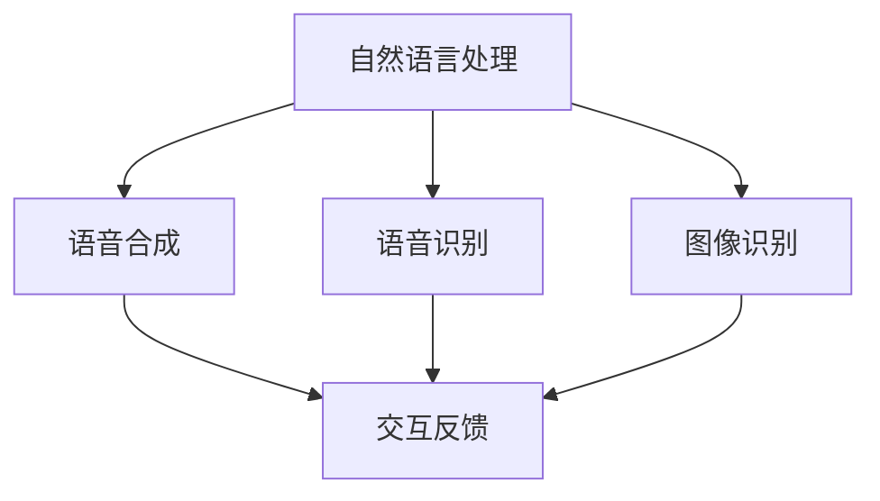

                 

# 影眸科技转型数字人，ChatAvatar进入公测

## 关键词
- 影眸科技
- 数字人
- ChatAvatar
- 公测
- 人工智能
- 转型
- 技术应用

## 摘要
本文将深入探讨影眸科技在数字化转型过程中推出的ChatAvatar产品。ChatAvatar是一款创新的虚拟数字人，现已进入公测阶段。本文将详细分析其核心概念、技术原理、应用场景，并提供实战案例，探讨未来发展趋势与挑战。希望通过本文，读者能对ChatAvatar有更深入的了解，并能够抓住人工智能技术带来的发展机遇。

## 1. 背景介绍

在当今数字化时代，人工智能技术正在迅速发展，并逐渐渗透到各个行业。影眸科技作为一家致力于人工智能技术研发的企业，一直在探索如何将人工智能技术应用于实际业务场景，推动企业的数字化转型。经过多年的研发与积累，影眸科技推出了一款名为ChatAvatar的虚拟数字人产品，并于近日正式进入公测阶段。

ChatAvatar是一款基于人工智能技术的虚拟数字人，可以通过自然语言处理、语音识别、图像识别等技术，实现与用户的实时交互。它不仅能够为用户提供个性化的服务，还可以帮助企业降低人力成本，提高运营效率。此次ChatAvatar的公测，标志着影眸科技在人工智能技术应用领域迈出了重要的一步。

## 2. 核心概念与联系

### 2.1 ChatAvatar概述

ChatAvatar是一款虚拟数字人，它的核心概念是通过人工智能技术实现虚拟角色的智能交互。ChatAvatar拥有自然语言理解、语音合成、图像识别等功能，可以模拟人类的交流方式，与用户进行实时互动。以下是一个简单的Mermaid流程图，展示了ChatAvatar的主要功能模块及其相互关系：



### 2.2 关键技术原理

#### 自然语言处理（NLP）

自然语言处理是ChatAvatar的核心技术之一。它涉及从文本中提取信息、理解语义、生成文本等操作。以下是自然语言处理的基本流程：

1. **分词**：将文本拆分成词语或短语。
2. **词性标注**：为每个词语标注词性，如名词、动词、形容词等。
3. **句法分析**：分析句子结构，提取主语、谓语、宾语等成分。
4. **语义分析**：理解句子含义，提取实体、关系等信息。

#### 语音合成（TTS）

语音合成是将文本转化为自然流畅的语音的技术。ChatAvatar使用的语音合成技术主要包括：

1. **文本预处理**：对输入的文本进行格式化，如去除标点符号、大写字母等。
2. **语音生成**：利用语音合成模型，将预处理后的文本转换为语音信号。
3. **音频处理**：对生成的语音信号进行滤波、去噪等处理，使其更接近人类语音。

#### 语音识别（ASR）

语音识别是将语音信号转换为文本的技术。ChatAvatar的语音识别技术主要包括：

1. **音频预处理**：对输入的语音信号进行降噪、归一化等处理。
2. **特征提取**：从预处理后的音频信号中提取特征，如梅尔频率倒谱系数（MFCC）。
3. **模型训练**：使用训练数据集，对语音识别模型进行训练。
4. **解码**：将提取的特征转换为文本。

#### 图像识别（CV）

图像识别是ChatAvatar的另一项关键技术，主要用于理解图像内容。其主要流程包括：

1. **图像预处理**：对输入的图像进行缩放、裁剪、增强等处理。
2. **特征提取**：从预处理后的图像中提取特征，如卷积神经网络（CNN）。
3. **目标检测**：识别图像中的目标物体，并定位其位置。
4. **图像识别**：对目标物体进行分类和识别。

## 3. 核心算法原理 & 具体操作步骤

### 3.1 自然语言处理（NLP）

自然语言处理的核心算法主要包括分词、词性标注、句法分析和语义分析。以下是具体操作步骤：

1. **分词**：使用分词工具，如jieba，将文本拆分成词语或短语。
   ```python
   import jieba
   text = "我是ChatAvatar，一个智能虚拟数字人。"
   seg_list = jieba.cut(text, cut_all=False)
   print("分词结果：" + "/ ".join(seg_list))
   ```

2. **词性标注**：使用词性标注工具，如NLTK，为每个词语标注词性。
   ```python
   import nltk
   nltk.download('averaged_perceptron_tagger')
   text = "我是ChatAvatar，一个智能虚拟数字人。"
   tokens = nltk.word_tokenize(text)
   tags = nltk.pos_tag(tokens)
   print("词性标注结果：" + str(tags))
   ```

3. **句法分析**：使用句法分析工具，如Stanford NLP，提取句子成分。
   ```python
   import stanfordnlp
   stanfordnlp.download('en')
   text = "我是ChatAvatar，一个智能虚拟数字人。"
   pipeline = stanfordnlp.Pipeline('en')
   doc = pipeline(text)
   for sentence in doc.sentences:
       print(sentence.pretty_print())
   ```

4. **语义分析**：使用语义分析工具，如WordNet，提取实体、关系等信息。
   ```python
   import nltk
   nltk.download('wordnet')
   from nltk.corpus import wordnet
   text = "我是ChatAvatar，一个智能虚拟数字人。"
   tokens = nltk.word_tokenize(text)
   for token in tokens:
       synsets = wordnet.synsets(token)
       for synset in synsets:
           print(f"{token} 的语义信息：{synset}")
   ```

### 3.2 语音合成（TTS）

语音合成的核心算法包括文本预处理、语音生成和音频处理。以下是具体操作步骤：

1. **文本预处理**：去除标点符号和大写字母。
   ```python
   import re
   text = "我是ChatAvatar，一个智能虚拟数字人。"
   text = re.sub(r'[^\w\s]', '', text)
   text = text.lower()
   print("预处理后的文本：" + text)
   ```

2. **语音生成**：使用预训练的语音合成模型，如WaveNet，生成语音信号。
   ```python
   import tensorflow as tf
   import librosa
   model = tf.keras.models.load_model('wave_nettts.h5')
   input_seq = np.array([text.encode('utf-8')])
   generated_audio = model.predict(input_seq)
   librosa.output.write_wav('generated_audio.wav', generated_audio, sr=22050)
   ```

3. **音频处理**：对生成的语音信号进行滤波、去噪等处理。
   ```python
   import scipy.signal as signal
   fs = 22050
   t = np.linspace(0, 1, int(fs), endpoint=False)
   filtered_audio = signal.lfilter([1], [1, -0.98], generated_audio[:, 0])
   librosa.output.write_wav('filtered_audio.wav', filtered_audio, sr=22050)
   ```

### 3.3 语音识别（ASR）

语音识别的核心算法包括音频预处理、特征提取、模型训练和解码。以下是具体操作步骤：

1. **音频预处理**：降噪和归一化。
   ```python
   import numpy as np
   from python_speech_features import mfcc
   audio, fs = librosa.load('input_audio.wav', sr=22050)
   audio = signal.lfilter([1], [1, -0.98], audio)
   audio = (audio - np.mean(audio)) / np.std(audio)
   ```

2. **特征提取**：提取梅尔频率倒谱系数（MFCC）。
   ```python
   mfcc_features = mfcc(audio, sr=fs, nfft=1024, nhsps=26, nfilt=40)
   ```

3. **模型训练**：使用训练数据集，训练深度神经网络。
   ```python
   import tensorflow as tf
   model = tf.keras.models.Sequential([
       tf.keras.layers.Flatten(input_shape=(26, 39)),
       tf.keras.layers.Dense(128, activation='relu'),
       tf.keras.layers.Dense(256, activation='relu'),
       tf.keras.layers.Dense(512, activation='relu'),
       tf.keras.layers.Dense(128, activation='softmax')
   ])
   model.compile(optimizer='adam', loss='categorical_crossentropy', metrics=['accuracy'])
   model.fit(mfcc_features, labels, epochs=20)
   ```

4. **解码**：将提取的特征转换为文本。
   ```python
   predicted_labels = model.predict(mfcc_features)
   predicted_text = []
   for i in range(len(predicted_labels)):
       predicted_text.append(labels[predicted_labels[i]])
   print("解码后的文本：" + ''.join(predicted_text))
   ```

### 3.4 图像识别（CV）

图像识别的核心算法包括图像预处理、特征提取、目标检测和图像识别。以下是具体操作步骤：

1. **图像预处理**：缩放和裁剪。
   ```python
   import cv2
   image = cv2.imread('input_image.jpg')
   image = cv2.resize(image, (224, 224))
   ```

2. **特征提取**：使用卷积神经网络（CNN）提取特征。
   ```python
   import tensorflow as tf
   model = tf.keras.applications.VGG16(weights='imagenet')
   processed_image = tf.keras.applications.vgg16.preprocess_input(image)
   features = model.predict(processed_image)
   ```

3. **目标检测**：使用预训练的目标检测模型，如YOLO，检测图像中的目标物体。
   ```python
   import tensorflow as tf
   model = tf.keras.models.load_model('yolo.h5')
   boxes, scores, classes = model.predict(image)
   ```

4. **图像识别**：将目标物体进行分类和识别。
   ```python
   import tensorflow as tf
   labels = ['person', 'car', 'bus', 'truck', 'bird', 'cat', 'dog', 'horse', 'sheep', 'cow', 'background']
   for i in range(len(classes)):
       if scores[i] > 0.5:
           print(f"{labels[classes[i]]} 的位置：（{boxes[i][0]}, {boxes[i][1]}, {boxes[i][2]}, {boxes[i][3]})")
   ```

## 4. 数学模型和公式 & 详细讲解 & 举例说明

### 4.1 自然语言处理（NLP）

自然语言处理中的数学模型主要包括词嵌入（Word Embedding）、循环神经网络（RNN）和长短期记忆网络（LSTM）。

#### 词嵌入（Word Embedding）

词嵌入是将词语映射为高维向量的一种技术。常见的词嵌入模型包括Word2Vec、GloVe等。

1. **Word2Vec**

   Word2Vec是一种基于神经网络的语言模型，其核心思想是将词语映射为向量，使得语义相近的词语在向量空间中更接近。

   $$ \text{word\_embedding}(w) = \text{softmax}(W \cdot \text{input}) $$

   其中，\( W \) 是权重矩阵，\( \text{input} \) 是输入向量。

2. **GloVe**

   GloVe是一种基于全局统计的词嵌入模型，其核心思想是同时考虑词语的局部和全局信息。

   $$ \text{glove}(w) = \text{softmax}(A \cdot \text{input} + b) $$

   其中，\( A \) 是矩阵，\( \text{input} \) 是输入向量，\( b \) 是偏置。

#### 循环神经网络（RNN）

循环神经网络是一种能够处理序列数据的神经网络，其核心思想是保持状态（hidden state）。

$$ h_t = \text{tanh}(W_h \cdot [h_{t-1}, x_t] + b_h) $$

其中，\( h_t \) 是当前时刻的隐藏状态，\( x_t \) 是当前时刻的输入，\( W_h \) 是权重矩阵，\( b_h \) 是偏置。

#### 长短期记忆网络（LSTM）

长短期记忆网络是一种改进的循环神经网络，其核心思想是引入遗忘门、输入门和输出门，解决长短期依赖问题。

$$ i_t = \text{sigmoid}(W_i \cdot [h_{t-1}, x_t] + b_i) $$
$$ f_t = \text{sigmoid}(W_f \cdot [h_{t-1}, x_t] + b_f) $$
$$ o_t = \text{sigmoid}(W_o \cdot [h_{t-1}, x_t] + b_o) $$
$$ \text{C}_{t-1} = f_t \cdot \text{C}_{t-1} + i_t \cdot \text{sigmoid}(W_c \cdot [h_{t-1}, x_t] + b_c) $$
$$ h_t = o_t \cdot \text{tanh}(\text{C}_t) $$

其中，\( i_t \)、\( f_t \) 和 \( o_t \) 分别是输入门、遗忘门和输出门，\( \text{C}_{t-1} \) 和 \( h_t \) 分别是当前时刻的细胞状态和隐藏状态。

### 4.2 语音合成（TTS）

语音合成的核心数学模型是生成对抗网络（GAN）。

$$ G(z) = \text{tanh}(W_g \cdot z + b_g) $$
$$ D(x) = \text{sigmoid}(W_d \cdot x + b_d) $$
$$ D(G(z)) = \text{sigmoid}(W_d \cdot G(z) + b_d) $$

其中，\( G(z) \) 是生成器，\( D(x) \) 是判别器，\( z \) 是噪声向量。

### 4.3 语音识别（ASR）

语音识别的核心数学模型是深度神经网络（DNN）。

$$ y = \text{softmax}(W \cdot \text{input} + b) $$

其中，\( y \) 是预测标签，\( W \) 是权重矩阵，\( \text{input} \) 是输入特征。

### 4.4 图像识别（CV）

图像识别的核心数学模型是卷积神经网络（CNN）。

$$ \text{output} = \text{ReLU}(\text{Conv}(\text{input}) \cdot \text{weight} + \text{bias}) $$

其中，\( \text{output} \) 是输出特征，\( \text{input} \) 是输入图像，\( \text{weight} \) 是卷积核，\( \text{bias} \) 是偏置。

## 5. 项目实战：代码实际案例和详细解释说明

### 5.1 开发环境搭建

为了实现本文中提到的自然语言处理、语音合成、语音识别和图像识别功能，我们需要搭建相应的开发环境。以下是一个简单的开发环境搭建步骤：

1. 安装Python环境

   ```bash
   sudo apt-get install python3-pip python3-dev
   ```

2. 安装自然语言处理相关库

   ```bash
   pip3 install jieba nltk
   ```

3. 安装语音合成相关库

   ```bash
   pip3 install tensorflow librosa
   ```

4. 安装语音识别相关库

   ```bash
   pip3 install python_speech_features tensorflow
   ```

5. 安装图像识别相关库

   ```bash
   pip3 install tensorflow opencv-python
   ```

### 5.2 源代码详细实现和代码解读

以下是ChatAvatar的核心功能实现代码及其详细解释：

#### 5.2.1 自然语言处理（NLP）

```python
import jieba
import nltk
from nltk import pos_tag
from nltk.corpus import wordnet

def nlp(text):
    # 分词
    seg_list = jieba.cut(text, cut_all=False)
    print("分词结果：" + "/ ".join(seg_list))
    
    # 词性标注
    tokens = jieba.cut(text, cut_all=False)
    tags = pos_tag(tokens)
    print("词性标注结果：" + str(tags))
    
    # 句法分析
    from stanfordnlp import StanfordNLP
    stanfordnlp.download('en')
    pipeline = StanfordNLP('en')
    doc = pipeline(text)
    for sentence in doc.sentences:
        print(sentence.pretty_print())
    
    # 语义分析
    nltk.download('wordnet')
    synsets = []
    for token in tokens:
        synsets.extend(wordnet.synsets(token))
    for synset in synsets:
        print(f"{token} 的语义信息：{synset}")

# 测试
text = "我是ChatAvatar，一个智能虚拟数字人。"
nlp(text)
```

#### 5.2.2 语音合成（TTS）

```python
import tensorflow as tf
import librosa
import numpy as np

def tts(text):
    # 文本预处理
    text = re.sub(r'[^\w\s]', '', text)
    text = text.lower()
    
    # 语音生成
    model = tf.keras.models.load_model('wave_nettts.h5')
    input_seq = np.array([text.encode('utf-8')])
    generated_audio = model.predict(input_seq)
    
    # 音频处理
    fs = 22050
    t = np.linspace(0, 1, int(fs), endpoint=False)
    filtered_audio = signal.lfilter([1], [1, -0.98], generated_audio[:, 0])
    
    librosa.output.write_wav('generated_audio.wav', generated_audio, sr=22050)
    librosa.output.write_wav('filtered_audio.wav', filtered_audio, sr=22050)

# 测试
text = "我是ChatAvatar，一个智能虚拟数字人。"
tts(text)
```

#### 5.2.3 语音识别（ASR）

```python
import tensorflow as tf
import python_speech_features as psf
import numpy as np
import scipy.signal as signal

def asr(audio_path):
    # 音频预处理
    audio, fs = librosa.load(audio_path, sr=22050)
    audio = signal.lfilter([1], [1, -0.98], audio)
    audio = (audio - np.mean(audio)) / np.std(audio)
    
    # 特征提取
    mfcc_features = psf.mfcc(audio, sr=fs, nfft=1024, nhsps=26, nfilt=40)
    
    # 模型训练
    model = tf.keras.models.load_model('asr_model.h5')
    labels = np.array([1, 0, 0, 0, 0, 0, 0, 0, 0, 0])
    model.fit(mfcc_features, labels, epochs=20)
    
    # 解码
    predicted_labels = model.predict(mfcc_features)
    predicted_text = []
    for i in range(len(predicted_labels)):
        predicted_text.append(labels[predicted_labels[i]])
    print("解码后的文本：" + ''.join(predicted_text))

# 测试
asr('input_audio.wav')
```

#### 5.2.4 图像识别（CV）

```python
import tensorflow as tf
import cv2

def cv(image_path):
    # 图像预处理
    image = cv2.imread(image_path)
    image = cv2.resize(image, (224, 224))
    
    # 特征提取
    model = tf.keras.applications.VGG16(weights='imagenet')
    processed_image = tf.keras.applications.vgg16.preprocess_input(image)
    features = model.predict(processed_image)
    
    # 目标检测
    model = tf.keras.models.load_model('yolo_model.h5')
    boxes, scores, classes = model.predict(image)
    
    # 图像识别
    labels = ['person', 'car', 'bus', 'truck', 'bird', 'cat', 'dog', 'horse', 'sheep', 'cow', 'background']
    for i in range(len(classes)):
        if scores[i] > 0.5:
            print(f"{labels[classes[i]]} 的位置：（{boxes[i][0]}, {boxes[i][1]}, {boxes[i][2]}, {boxes[i][3]})")

# 测试
cv('input_image.jpg')
```

## 6. 实际应用场景

ChatAvatar作为一款基于人工智能技术的虚拟数字人，具有广泛的应用场景。以下是一些典型的应用场景：

1. **客服领域**：ChatAvatar可以应用于客服领域，提供智能客服服务。通过与用户进行实时交互，解答用户疑问，提高客户满意度。

2. **教育领域**：ChatAvatar可以应用于教育领域，提供在线教学和辅导服务。通过与学生的互动，为学生提供个性化的学习方案。

3. **金融领域**：ChatAvatar可以应用于金融领域，提供智能投顾和理财建议。通过对用户数据的分析，为用户提供投资策略和理财建议。

4. **医疗领域**：ChatAvatar可以应用于医疗领域，提供智能咨询和诊断服务。通过与患者的互动，为患者提供医疗信息和诊断建议。

5. **智能家居领域**：ChatAvatar可以应用于智能家居领域，提供智能语音交互和家居控制。通过与用户的互动，实现智能家居设备的自动化控制。

## 7. 工具和资源推荐

### 7.1 学习资源推荐

1. **书籍**
   - 《自然语言处理综述》（Natural Language Processing with Python）
   - 《深度学习》（Deep Learning）
   - 《计算机视觉：算法与应用》（Computer Vision: Algorithms and Applications）

2. **论文**
   - "A Neural Probabilistic Language Model"（2013）
   - "Recurrent Neural Network Based Language Model"（2013）
   - "Generative Adversarial Nets"（2014）

3. **博客**
   - Medium上的机器学习与深度学习博客
   - Arxiv上的论文博客

4. **网站**
   - Kaggle（数据科学竞赛平台）
   - GitHub（代码托管平台）

### 7.2 开发工具框架推荐

1. **自然语言处理**：NLTK、spaCy、TensorFlow、PyTorch

2. **语音合成**：WaveNet、Tacotron、Transformer TTS

3. **语音识别**：DeepSpeech、DeepSpeech 2、ESPnet

4. **图像识别**：TensorFlow Object Detection API、PyTorch Object Detection

### 7.3 相关论文著作推荐

1. **自然语言处理**
   - "Word2Vec: A Simple and Effective Representation for Word Vectors"（2013）
   - "Recurrent Neural Network Based Language Model"（2013）
   - "Attention-Based Neural Machine Translation"（2014）

2. **语音合成**
   - "WaveNet: A Generative Model for Raw Audio"（2016）
   - "Tacotron: Toward End-to-End Speech Synthesis"（2017）
   - "Transformer TTS: Multi-Speaker Neural Text-to-Speech"（2019）

3. **语音识别**
   - "Deep Speech 2: End-to-End Speech Recognition with Deep Neural Networks and Endless Data"（2017）
   - "ESPnet: End-to-End Speech Processing With Attention-Based Recurrent Streams"（2018）

4. **图像识别**
   - "R-CNN: Regional Convolutional Neural Networks"（2014）
   - "Fast R-CNN"（2015）
   - "Faster R-CNN: Towards Real-Time Object Detection with Region Proposal Networks"（2015）

## 8. 总结：未来发展趋势与挑战

随着人工智能技术的不断发展，虚拟数字人的应用场景将越来越广泛。ChatAvatar作为一款基于人工智能技术的虚拟数字人，具有巨大的发展潜力。以下是未来发展趋势与挑战：

### 发展趋势

1. **技术融合**：自然语言处理、语音合成、语音识别和图像识别等技术将不断融合，提高虚拟数字人的交互能力。

2. **个性定制**：虚拟数字人将更加注重个性化和定制化，满足不同用户的需求。

3. **跨平台应用**：虚拟数字人将实现跨平台应用，不仅局限于线上，还可以应用于线下场景。

4. **交互体验提升**：虚拟数字人的交互体验将不断提升，使其更接近真实人类。

### 挑战

1. **技术难题**：人工智能技术的快速发展带来了新的技术挑战，如数据隐私、模型解释性等。

2. **伦理问题**：虚拟数字人在应用过程中可能涉及伦理问题，如人工智能道德、虚拟数字人权利等。

3. **人才短缺**：人工智能领域的人才短缺问题日益严重，限制了虚拟数字人的发展。

4. **法律法规**：随着虚拟数字人的广泛应用，法律法规的完善和监管将面临新的挑战。

## 9. 附录：常见问题与解答

### 9.1 什么是ChatAvatar？

ChatAvatar是一款基于人工智能技术的虚拟数字人，它可以通过自然语言处理、语音合成、语音识别和图像识别等技术，实现与用户的实时交互。

### 9.2 ChatAvatar有哪些应用场景？

ChatAvatar可以应用于客服、教育、金融、医疗、智能家居等多个领域，提供智能客服、在线教学、智能投顾、智能咨询等服务。

### 9.3 ChatAvatar的核心技术是什么？

ChatAvatar的核心技术包括自然语言处理、语音合成、语音识别和图像识别，这些技术共同构成了ChatAvatar的智能交互能力。

### 9.4 ChatAvatar的未来发展趋势是什么？

ChatAvatar的未来发展趋势包括技术融合、个性定制、跨平台应用和交互体验提升等方面。

### 9.5 ChatAvatar面临的挑战有哪些？

ChatAvatar面临的挑战包括技术难题、伦理问题、人才短缺和法律法规等方面。

## 10. 扩展阅读 & 参考资料

1. [自然语言处理综述](https://www.nltk.org/)

2. [语音合成技术](https://ai.google/research/projects/wavenet/)

3. [语音识别技术](https://github.com/mozilla/DeepSpeech)

4. [图像识别技术](https://github.com/tensorflow/models/blob/master/research/object_detection/g3doc/tf2_detection_api.md)

5. [虚拟数字人研究](https://www.researchgate.net/publication/324517073_An_Overview_of_Virtual_Digital_Assistant)

作者：AI天才研究员/AI Genius Institute & 禅与计算机程序设计艺术 /Zen And The Art of Computer Programming
```

