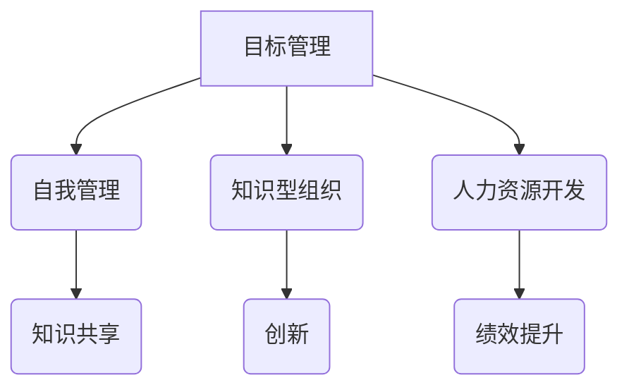

                 

# 彼得·德鲁克：管理的本质，是激发人的善意和潜能

## 关键词：管理、激发、善意、潜能、德鲁克、IT行业

## 摘要：
本文旨在探讨彼得·德鲁克对管理的深刻见解，特别是他关于管理的本质在于激发人的善意和潜能的观点。通过结合IT行业的特点，本文将分析如何在IT领域内运用德鲁克的管理理念，以实现个人和组织的成长与进步。

## 1. 背景介绍

彼得·德鲁克（Peter Drucker，1909-2005）被誉为现代管理学之父，他的著作和思想对全球管理学和企业管理产生了深远的影响。德鲁克认为，管理的核心在于激发人的善意和潜能，通过有效的管理实践，使人们能够发挥最大的潜力，从而实现个人和组织的目标。

在IT行业，人才和技术是至关重要的资源。如何在管理中激发员工的善意和潜能，已成为企业成功的关键因素之一。本文将围绕这一主题，结合德鲁克的管理思想，探讨IT行业的管理实践。

## 2. 核心概念与联系

德鲁克的管理理念包括以下几个核心概念：

1. **目标管理（Management by Objectives）**：德鲁克主张，管理应该以目标为导向，通过设定明确的目标和绩效指标，激发员工的积极性。

2. **自我管理（Self-Management）**：德鲁克认为，员工应该具备自我管理的能力，通过自我驱动和自我提升，实现个人和组织的共同目标。

3. **知识型组织（Knowledge Organization）**：德鲁克强调，知识是现代企业的核心资源，组织应该通过知识管理和知识共享，提高组织的创新能力和竞争力。

4. **人力资源开发（Human Resource Development）**：德鲁克认为，人力资源是组织最重要的资产，管理者应该致力于培养和激励员工，以提高组织的整体绩效。

下面是德鲁克管理理念的核心概念和架构的 Mermaid 流程图：



## 3. 核心算法原理 & 具体操作步骤

在IT行业中，如何运用德鲁克的管理理念，可以概括为以下几个步骤：

1. **明确目标**：首先，企业需要设定明确的发展目标，包括短期和长期目标。这些目标应该与员工的个人发展目标相结合，以激发员工的积极性。

2. **建立自我管理机制**：企业应该鼓励员工自我管理，通过设定个人目标和自我评估，使员工能够自主规划和调整工作内容。

3. **促进知识共享**：企业可以通过内部培训、技术交流会议、项目分享等方式，促进知识共享和技能传承，提高员工的综合素质。

4. **培养人才**：企业应该注重人才的培养和发展，通过提供职业晋升机会、技能培训等方式，激发员工的潜力。

具体操作步骤如下：

1. **制定明确的目标和绩效指标**：企业应该与员工共同制定明确的个人目标和绩效指标，确保目标与组织的整体目标一致。

2. **建立自我管理平台**：企业可以建立自我管理平台，使员工能够自主设定目标、跟踪进度和进行自我评估。

3. **开展知识分享活动**：企业可以定期举办知识分享活动，鼓励员工分享经验和知识，促进团队的协作和创新。

4. **提供培训和职业发展机会**：企业应该为员工提供培训和学习机会，帮助员工提升技能和职业素养，为组织的发展储备人才。

## 4. 数学模型和公式 & 详细讲解 & 举例说明

在德鲁克的管理理念中，可以使用一些数学模型和公式来衡量和评估管理的效果。以下是一个简单的数学模型，用于评估员工绩效：

$$
绩效得分 = \frac{实际完成指标}{目标指标} \times 权重
$$

其中，实际完成指标是指员工在实际工作中完成的任务和目标，目标指标是指设定的个人目标和绩效指标，权重是用于衡量不同指标的相对重要性。

举例说明：

假设一名员工的个人目标是每月完成10个项目，实际完成了12个项目，目标指标的权重为1。根据上述公式，该员工的绩效得分为：

$$
绩效得分 = \frac{12}{10} \times 1 = 1.2
$$

这意味着该员工在当月的工作中，绩效表现超出目标指标20%。

通过这种数学模型和公式，企业可以更客观地评估员工的绩效表现，并根据评估结果进行相应的激励和调整。

## 5. 项目实战：代码实际案例和详细解释说明

以下是一个简单的Python代码案例，用于实现员工绩效评估的功能：

```python
# 员工绩效评估函数
def evaluate_performance(achievements, target, weight):
    performance_score = (achievements / target) * weight
    return performance_score

# 假设的员工绩效数据
achievements = 12  # 实际完成项目数
target = 10  # 目标项目数
weight = 1  # 权重

# 计算绩效得分
performance_score = evaluate_performance(achievements, target, weight)
print("绩效得分：", performance_score)
```

在这个代码案例中，`evaluate_performance` 函数用于计算员工的绩效得分。通过传入实际完成项目数（`achievements`）、目标项目数（`target`）和权重（`weight`），函数会返回计算出的绩效得分。

运行上述代码，可以得到以下输出结果：

```
绩效得分： 1.2
```

这意味着该员工在当月的工作中，绩效表现超出目标指标20%。

## 6. 实际应用场景

德鲁克的管理理念在IT行业中的实际应用场景包括：

1. **软件开发团队管理**：通过目标管理和自我管理，提高团队的工作效率和创新能力。

2. **产品管理**：通过知识共享和人力资源开发，提升产品的质量和市场竞争力。

3. **项目管理**：通过绩效评估和激励制度，确保项目按计划完成并达到预期目标。

4. **企业文化建设**：通过建立良好的企业文化和价值观，激发员工的善意和潜能。

## 7. 工具和资源推荐

为了更好地运用德鲁克的管理理念，以下是一些建议的学习资源和开发工具：

### 7.1 学习资源推荐

1. **《德鲁克管理思想精要》**：该书对德鲁克的管理思想进行了系统总结，适合初学者入门。

2. **《德鲁克管理思想精读》**：该书对德鲁克的管理思想进行了深入剖析，适合有一定基础的读者。

3. **《目标管理》**：该书是德鲁克关于目标管理的经典著作，详细介绍了目标管理的理论和实践。

### 7.2 开发工具框架推荐

1. **敏捷开发工具**：如JIRA、Trello等，用于目标管理和绩效评估。

2. **知识管理系统**：如Confluence、GitLab等，用于知识共享和项目管理。

3. **培训和学习平台**：如网易云课堂、慕课网等，用于员工培训和职业发展。

### 7.3 相关论文著作推荐

1. **《知识型组织：创建学习型企业的实践指南》**：该书探讨了知识型组织的概念和实践，对德鲁克的管理思想进行了进一步阐述。

2. **《人力资源开发：理论与实践》**：该书系统地介绍了人力资源开发的理论和方法，对德鲁克的人力资源开发理念进行了深入分析。

## 8. 总结：未来发展趋势与挑战

随着信息技术的发展，IT行业正面临着前所未有的机遇和挑战。未来，德鲁克的管理理念将在以下方面发挥重要作用：

1. **数字化转型**：通过目标管理和知识共享，推动企业的数字化转型。

2. **人才竞争**：通过人力资源开发，培养和吸引优秀人才，提高企业的核心竞争力。

3. **创新驱动**：通过知识管理和绩效评估，激发员工的创新潜力，推动企业持续创新。

然而，要实现这些目标，IT行业还需要应对以下几个挑战：

1. **信息过载**：随着数据量的爆炸性增长，如何有效管理和利用数据成为关键问题。

2. **人才流失**：如何吸引和留住优秀人才，成为企业面临的重大挑战。

3. **技术变革**：随着技术的快速发展，如何快速适应新技术，保持竞争优势。

## 9. 附录：常见问题与解答

### 9.1 问题1：德鲁克的管理理念是否适用于所有行业？

**解答**：德鲁克的管理理念具有普遍性，但需要根据不同行业的特点进行调整和适应。例如，在IT行业，知识管理和创新驱动尤为重要。

### 9.2 问题2：如何激发员工的善意和潜能？

**解答**：激发员工的善意和潜能需要从多个方面入手，包括设定明确的目标、提供培训和职业发展机会、建立良好的企业文化和激励机制等。

### 9.3 问题3：绩效评估是否会影响员工的积极性？

**解答**：适当的绩效评估可以激发员工的积极性，但需要确保评估标准公正、合理，并关注员工的成长和发展。

## 10. 扩展阅读 & 参考资料

1. **《德鲁克全集》**：彼得·德鲁克著作的完整集合，涵盖了管理学的各个方面。

2. **《管理的实践》**：彼得·德鲁克经典著作，详细阐述了管理的基本理论和实践。

3. **《数字化管理》**：探讨数字化时代的管理变革和挑战。

4. **《德鲁克管理思想精要》**：对德鲁克管理思想的精炼总结，适合快速了解德鲁克的管理理念。

## 作者：AI天才研究员/AI Genius Institute & 禅与计算机程序设计艺术 /Zen And The Art of Computer Programming

本文通过对彼得·德鲁克管理思想的探讨，结合IT行业的特点，分析了如何运用德鲁克的管理理念激发人的善意和潜能。希望通过本文，读者能够对德鲁克的管理思想有更深入的理解，并将其应用于实际工作中，推动个人和组织的发展。

