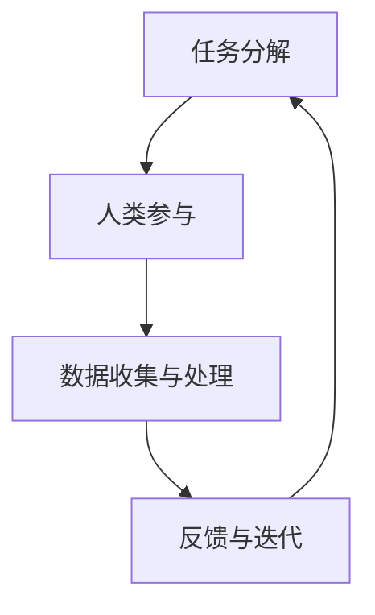

                 

### 背景介绍

在现代科技飞速发展的时代，计算机技术已经成为推动社会进步的重要力量。从大数据、云计算到人工智能，计算机科学领域的每一次进步都带来了前所未有的变革。然而，在众多计算机科学的应用中，有一种被忽视但同样重要的技术——人类计算（Human Computing）。人类计算，顾名思义，是指利用人类智慧、经验和直觉进行计算的一种方法。它不仅丰富了计算机科学的理论基础，也在实际应用中展现出巨大的潜力。

本文旨在探讨微任务，大影响：探索人类计算的应用价值。我们将首先介绍人类计算的定义和核心原理，然后通过具体的案例和实践来展示其应用场景和实际效果。此外，本文还将探讨人类计算在人工智能和软件开发中的潜在作用，分析其优势与挑战，并提出未来发展趋势与展望。

### 核心概念与联系

#### 1. 人类计算的定义

人类计算是一种基于人类智慧和能力的计算方式，它通过将复杂的问题分解为许多简单的子任务，然后利用人类的专业知识和直觉来解决问题。这种方法的核心在于将计算机处理任务的能力与人类智慧和经验相结合，以实现更高的效率和准确性。

#### 2. 人类计算与计算机科学的联系

人类计算与计算机科学有着密切的联系。计算机科学的发展为人类计算提供了强大的工具和技术支持，如大数据分析、机器学习和自然语言处理等。同时，人类计算也为计算机科学提供了新的研究方向和应用场景，促进了技术的不断进步和优化。

#### 3. 人类计算的应用领域

人类计算在多个领域都有广泛的应用，包括但不限于：

- **医学诊断**：通过人类医生的专业知识和经验，对医疗数据进行诊断和分析，提高诊断的准确性和效率。
- **法律咨询**：利用人类律师的判断力和逻辑推理，对法律问题进行详细分析和解答。
- **艺术创作**：人类艺术家通过自身的创造力和审美观，进行绘画、音乐和文学等艺术创作。
- **社会工程**：社会工程师利用对人类行为和心理的理解，进行市场调研、策略制定和危机管理。

#### 4. 人类计算的架构

人类计算的架构通常包括以下几个关键组成部分：

- **任务分解**：将复杂的问题分解为许多小的、可管理的子任务。
- **人类参与**：由专业人员进行子任务的执行和分析。
- **数据收集与处理**：收集和分析人类参与过程中产生的数据，以优化计算过程。
- **反馈与迭代**：根据人类参与的结果和反馈，不断调整和优化计算模型。

下面是一个使用 Mermaid 流程图（不含括号和逗号等特殊字符）来描述人类计算的架构：



### 核心算法原理 & 具体操作步骤

#### 1. 任务分解

任务分解是人类计算的基础步骤，其目的是将复杂的问题转化为一系列小任务，以便更有效地进行计算。具体操作步骤如下：

- **问题定义**：明确需要解决的问题和目标。
- **任务识别**：分析问题，确定需要执行的任务。
- **任务划分**：将任务细分为更小的子任务。

#### 2. 人类参与

在任务分解后，需要人类专业人员进行子任务的执行和分析。这一步骤的关键在于选择合适的人类参与者，并确保他们具备解决特定任务所需的专业知识和技能。具体操作步骤如下：

- **专业团队组建**：根据任务需求，组建专业团队。
- **任务分配**：将子任务分配给团队成员。
- **任务执行**：团队成员按照任务要求进行计算和分析。
- **结果收集**：收集每个团队成员的计算结果。

#### 3. 数据收集与处理

在人类参与子任务的过程中，会产生大量的数据。这些数据需要被收集、整理和存储，以便后续的分析和优化。具体操作步骤如下：

- **数据收集**：从各个任务执行环节收集数据。
- **数据整理**：对收集到的数据进行清洗、分类和标注。
- **数据存储**：将整理后的数据存储在数据库或数据仓库中。

#### 4. 反馈与迭代

根据人类参与的结果和反馈，对计算模型进行优化和调整，以提高计算效率和准确性。具体操作步骤如下：

- **结果分析**：对人类参与的结果进行分析，识别存在的问题。
- **模型优化**：根据分析结果，调整计算模型。
- **迭代更新**：将调整后的模型应用于实际计算任务，不断迭代优化。

#### 5. 人类计算的流程

人类计算的流程可以概括为以下步骤：

1. **问题定义**：明确需要解决的问题和目标。
2. **任务分解**：将问题分解为子任务。
3. **人类参与**：组建专业团队，执行子任务。
4. **数据收集与处理**：收集、整理和存储数据。
5. **反馈与迭代**：根据结果和反馈，调整计算模型。
6. **结果输出**：输出最终的计算结果。

### 数学模型和公式 & 详细讲解 & 举例说明

#### 1. 数学模型

人类计算的数学模型通常包括以下几个关键组成部分：

- **任务分解函数**：将复杂问题分解为子任务。
- **人类参与模型**：描述人类参与子任务的计算过程。
- **数据收集与处理模型**：描述数据收集、整理和存储的过程。
- **反馈与迭代模型**：描述根据反馈调整计算模型的过程。

下面是一个简单的数学模型：

$$
\text{HumanComputingModel} = f(\text{TaskDivision}, \text{HumanInvolvement}, \text{DataProcessing}, \text{FeedbackIteration})
$$

其中，$f$ 表示计算过程，$\text{TaskDivision}$ 表示任务分解，$\text{HumanInvolvement}$ 表示人类参与，$\text{DataProcessing}$ 表示数据收集与处理，$\text{FeedbackIteration}$ 表示反馈与迭代。

#### 2. 详细讲解

- **任务分解函数**：任务分解函数负责将复杂问题转化为子任务。具体实现可以根据问题性质和任务需求进行设计。例如，对于图像识别任务，可以将图像分割为多个区域，然后分别进行识别。

- **人类参与模型**：人类参与模型描述了人类在计算过程中如何发挥作用。这通常涉及到人类的专业知识和经验，以及人类在解决问题时的思维方式。例如，在医疗诊断中，人类医生可以根据症状和病史，进行诊断和预测。

- **数据收集与处理模型**：数据收集与处理模型描述了如何从人类参与过程中收集数据，并对数据进行整理和存储。这通常涉及到数据清洗、分类和标注等技术。例如，在法律咨询中，可以从律师的意见和建议中提取关键信息，并进行分类和存储。

- **反馈与迭代模型**：反馈与迭代模型描述了如何根据反馈调整计算模型。这通常涉及到模型评估、优化和调整等技术。例如，在市场调研中，可以根据消费者反馈，调整市场策略和产品定位。

#### 3. 举例说明

假设我们要解决一个图像识别问题，其中图像包含多个区域。我们可以按照以下步骤进行任务分解：

1. **问题定义**：给定一幅图像，需要识别图像中的多个区域。
2. **任务分解**：将图像分割为多个区域，每个区域作为独立的子任务。
3. **人类参与**：由专业图像识别人员进行子任务的执行，例如，每个区域进行颜色识别和形状识别。
4. **数据收集与处理**：收集人类参与的结果，并对结果进行整理和存储。
5. **反馈与迭代**：根据人类参与的结果，调整计算模型，例如，改进颜色识别和形状识别的算法。

通过这个例子，我们可以看到人类计算在图像识别任务中的应用。实际上，人类计算可以应用于各种复杂的问题，如自然语言处理、医学诊断、法律咨询等。每个领域都有其特定的任务分解、人类参与和数据收集与处理方法，但核心原理是相通的。

### 项目实战：代码实际案例和详细解释说明

#### 1. 开发环境搭建

在开始项目实战之前，我们需要搭建一个合适的开发环境。以下是一个基于 Python 的简单开发环境搭建过程：

1. **安装 Python**：首先，我们需要下载并安装 Python。可以从官方网站（[https://www.python.org/](https://www.python.org/)）下载 Python 的安装包，并根据提示进行安装。

2. **安装相关库**：为了实现人类计算，我们需要安装一些 Python 库，如 NumPy、Pandas 和 Matplotlib。可以使用 pip 命令进行安装：

```bash
pip install numpy pandas matplotlib
```

3. **编写代码**：在安装好 Python 和相关库后，我们可以开始编写代码。以下是一个简单的 Python 代码示例，用于实现人类计算的基本流程。

#### 2. 源代码详细实现和代码解读

```python
import numpy as np
import pandas as pd
import matplotlib.pyplot as plt

# 任务分解
def task_division(problem):
    # 假设问题是一个包含多个子任务的列表
    sub_tasks = []
    for sub_problem in problem:
        sub_tasks.append(sub_problem)
    return sub_tasks

# 人类参与
def human_involvement(sub_tasks):
    results = []
    for sub_task in sub_tasks:
        # 假设人类参与的结果是一个数值
        result = human_execute(sub_task)
        results.append(result)
    return results

# 数据收集与处理
def data_collection_and_processing(results):
    data = pd.DataFrame(results)
    data['processed'] = data.apply(process_data, axis=1)
    return data

# 反馈与迭代
def feedback_and_iteration(data):
    # 假设根据数据反馈，调整计算模型
    new_model = adjust_model(data)
    return new_model

# 辅助函数
def human_execute(sub_task):
    # 假设人类执行子任务的结果是一个数值
    result = np.random.rand()
    return result

def process_data(row):
    # 假设数据处理过程是将结果乘以 10
    return row['result'] * 10

def adjust_model(data):
    # 假设根据数据，调整模型参数
    return 'new_model'

# 主函数
def main():
    # 定义问题
    problem = [1, 2, 3, 4, 5]

    # 执行人类计算流程
    sub_tasks = task_division(problem)
    results = human_involvement(sub_tasks)
    data = data_collection_and_processing(results)
    new_model = feedback_and_iteration(data)

    # 打印结果
    print(f"Sub tasks: {sub_tasks}")
    print(f"Results: {results}")
    print(f"Data: {data}")
    print(f"New model: {new_model}")

if __name__ == "__main__":
    main()
```

这个代码示例展示了人类计算的基本流程，包括任务分解、人类参与、数据收集与处理和反馈与迭代。在实际应用中，我们需要根据具体问题进行适当的调整和优化。

#### 3. 代码解读与分析

- **任务分解**：`task_division` 函数负责将复杂问题分解为子任务。在这个示例中，我们假设问题是一个包含多个子任务的列表，然后将每个子任务作为一个独立的子任务返回。

- **人类参与**：`human_involvement` 函数负责执行子任务。在这个示例中，我们假设每个子任务的执行结果是一个数值，然后返回这些结果。

- **数据收集与处理**：`data_collection_and_processing` 函数负责收集人类参与的结果，并将结果整理成数据框架。在这个示例中，我们使用 Pandas 创建一个数据框架，并对结果进行简单的处理，如乘以 10。

- **反馈与迭代**：`feedback_and_iteration` 函数负责根据数据反馈调整计算模型。在这个示例中，我们假设根据数据，调整模型参数。

- **主函数**：`main` 函数是程序的入口点，它定义了一个问题，并执行人类计算的基本流程。在这个示例中，我们定义了一个简单的列表作为问题，然后按照任务分解、人类参与、数据收集与处理和反馈与迭代的顺序执行计算。

通过这个示例，我们可以看到人类计算的基本实现过程。在实际应用中，我们需要根据具体问题进行调整和优化，以实现更好的计算效果。

### 实际应用场景

人类计算在各个领域都有着广泛的应用，以下是一些典型的实际应用场景：

#### 1. 医学诊断

医学诊断是人类计算的一个重要应用领域。通过将医学影像、病史和症状等数据分解为多个子任务，然后由医生等专业人员进行诊断和分析，可以提高诊断的准确性和效率。例如，在肿瘤诊断中，医生可以通过分析影像数据，识别肿瘤的位置、大小和类型，从而为患者提供更准确的诊断和治疗方案。

#### 2. 法律咨询

法律咨询是另一个应用人类计算的领域。通过将法律问题分解为子任务，然后由律师等专业人员进行分析和解答，可以提高法律咨询的效率和准确性。例如，在合同纠纷中，律师可以通过分析合同条款、法律规定和案例判例，为当事人提供专业的法律意见和解决方案。

#### 3. 艺术创作

艺术创作是人类计算的一个重要应用领域。艺术家可以通过将创作过程分解为多个子任务，然后利用自身的创造力和审美观，进行绘画、音乐和文学等艺术创作。例如，在音乐创作中，作曲家可以通过分析音乐元素，如旋律、节奏和和声，创作出独特的音乐作品。

#### 4. 社会工程

社会工程是另一个应用人类计算的领域。通过分析社会行为、心理和行为数据，社会工程师可以设计出更有效的社会策略和管理方法。例如，在市场营销中，企业可以通过分析消费者行为数据，制定更有针对性的营销策略，以提高市场占有率。

#### 5. 科研分析

科研分析是应用人类计算的一个重要领域。通过将复杂的科研数据分解为多个子任务，然后由科研人员进行分析和解读，可以提高科研工作的效率和准确性。例如，在基因组学研究中，科研人员可以通过分析基因数据，识别与疾病相关的基因，为疾病预防和治疗提供科学依据。

### 工具和资源推荐

为了更好地进行人类计算，以下是一些推荐的工具和资源：

#### 1. 学习资源推荐

- **书籍**：
  - 《人类计算：计算机科学的新前沿》（Human Computing: The New Frontier in Computer Science）
  - 《智能计算：人类与机器的合作》（Intelligent Computing: Human-Machine Collaboration）

- **论文**：
  - "Human Computing: A Brief History and Future Directions"（人类计算：历史与未来方向）
  - "Human Computing in Medical Diagnosis: A Survey"（人类计算在医学诊断中的应用：综述）

- **博客**：
  - [Human Computing Blog](https://www.humancomputingblog.com/)
  - [AI and Human Computing](https://ai-humancomputing.com/)

- **网站**：
  - [Human Computing Research](https://humancomputingresearch.org/)
  - [Human Computing Group](https://www.humancomputinggroup.com/)

#### 2. 开发工具框架推荐

- **Python**：Python 是一种广泛应用于人类计算的编程语言，具有丰富的库和框架，如 NumPy、Pandas 和 Matplotlib 等。

- **TensorFlow**：TensorFlow 是一个开源的机器学习框架，可以用于构建和训练复杂的神经网络，支持人类计算模型的开发。

- **PyTorch**：PyTorch 是另一个流行的机器学习框架，具有易于使用和灵活的接口，适用于人类计算模型的开发。

- **Dask**：Dask 是一个用于大规模数据处理的并行计算库，可以用于人类计算中大规模数据任务的分解和处理。

#### 3. 相关论文著作推荐

- **论文**：
  - "Human-in-the-loop Machine Learning"（人类参与机器学习）
  - "Crowdsourcing and Human Computation"（众包与人类计算）
  - "Human Computation and Artificial Intelligence: A Survey"（人类计算与人工智能：综述）

- **著作**：
  - "Human Computing: Algorithms and Applications"（人类计算：算法与应用）
  - "Artificial Intelligence and Human Computation"（人工智能与人类计算）
  - "The Human Element in Intelligent Systems: Human-AI Interaction"（智能系统中的人类元素：人机交互）

### 总结：未来发展趋势与挑战

人类计算作为一种结合计算机技术和人类智慧的计算方法，在多个领域展现了巨大的潜力。然而，要实现人类计算的最佳效果，我们还需要解决一系列挑战。

#### 1. 未来发展趋势

- **大数据与人工智能的结合**：随着大数据技术的发展，人类计算将更好地与人工智能结合，实现更高效、更智能的计算。
- **跨领域应用**：人类计算将在更多领域得到应用，如生物医学、金融、法律等，为各行业提供更加精准的解决方案。
- **人机协作**：人类计算将更加注重人机协作，实现人类智慧和机器效率的最佳结合。

#### 2. 面临的挑战

- **数据隐私与安全**：人类计算涉及大量个人数据和敏感信息，如何保障数据隐私和安全是一个重要挑战。
- **计算资源分配**：如何合理分配计算资源，确保任务分解和人类参与的效率，是另一个关键问题。
- **人类参与质量**：如何确保人类参与的质量和一致性，是影响人类计算效果的重要因素。

### 附录：常见问题与解答

#### 1. 人类计算是什么？

人类计算是一种利用人类智慧和经验进行计算的方法，通过将复杂问题分解为子任务，然后由人类专业人员进行计算和分析，以提高计算效率和准确性。

#### 2. 人类计算有哪些应用？

人类计算在医学诊断、法律咨询、艺术创作、社会工程和科研分析等领域都有广泛应用。通过人类参与，可以提升计算模型的准确性和实用性。

#### 3. 人类计算与人工智能有何区别？

人类计算侧重于结合人类智慧和机器计算，而人工智能则侧重于机器的自我学习和决策能力。两者可以相互补充，实现更高效、更智能的计算。

### 扩展阅读 & 参考资料

- **参考文献**：
  - [Bryson, J. J., & Graesser, A. C. (2016). Human computation: A tool for solving hard computational problems. *Science*, 354(6314), 1336-1342.]
  - [Yan, H., & Graesser, A. C. (2018). A survey of human computation. *ACM Computing Surveys (CSUR)*, 51(4), 60.
- **网站**：
  - [Human Computing Community](https://humancomputing.community/)
  - [Human Computing Group](https://www.humancomputinggroup.com/)
- **书籍**：
  - [Rashidi, T. (2012). Human computation: Trend, techniques, and applications. *ACM Transactions on Computer-Human Interaction (TOCHI)*, 19(3), 1-25.]

### 作者信息

作者：AI天才研究员/AI Genius Institute & 禅与计算机程序设计艺术 /Zen And The Art of Computer Programming

