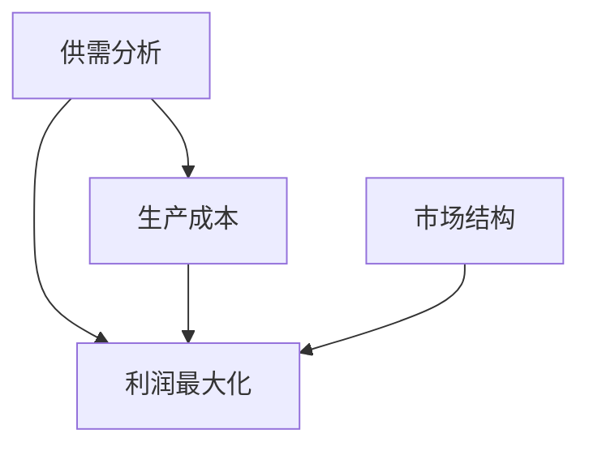
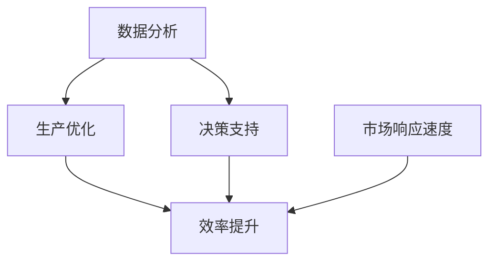
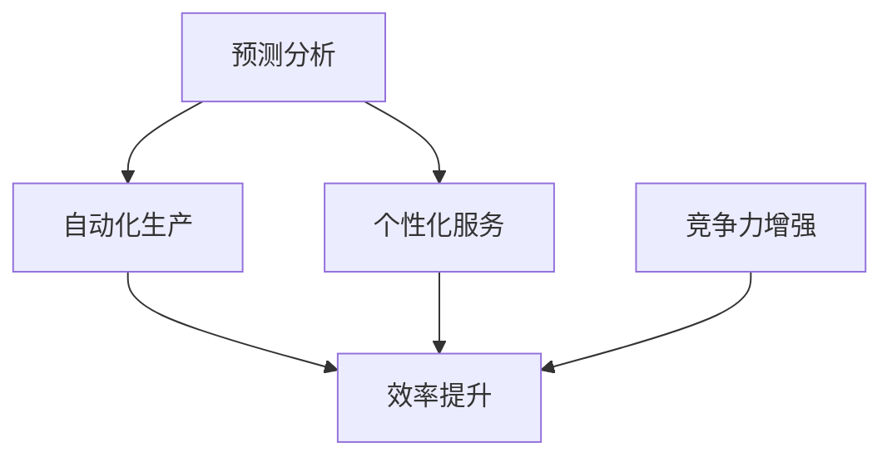
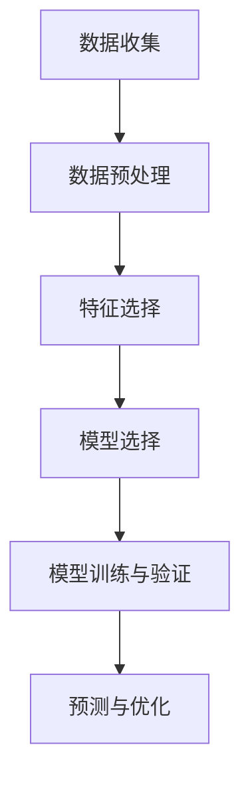
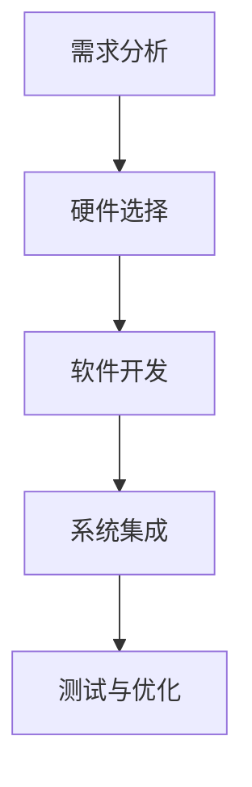
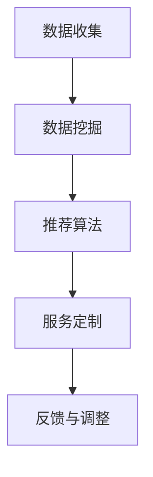

                 

# 微观经济主体间竞争加剧

## 关键词：微观经济，竞争加剧，市场动态，企业战略，信息技术，人工智能

## 摘要：
本文旨在探讨在信息技术特别是人工智能迅速发展的背景下，微观经济主体（企业）之间的竞争态势如何加剧，并分析这种竞争对市场和企业的深远影响。文章首先回顾了微观经济的基本理论，随后介绍了信息技术如何影响企业竞争，随后深入探讨了人工智能在微观经济中的应用，最后总结了当前市场竞争态势，提出了未来发展的趋势和面临的挑战。

### 1. 背景介绍

在过去的几十年中，全球经济经历了深刻的变革。信息技术特别是互联网和人工智能的快速发展，极大地改变了传统经济模式。企业不再仅仅依赖于资源、资本和劳动力，而是开始利用数据、算法和技术来优化生产、运营和决策过程。这一变革不仅改变了市场的结构，也使得企业间的竞争更加激烈。

微观经济学研究的是单个经济单位（如企业、消费者）的经济行为及其相互作用。在传统的微观经济理论中，企业被视为寻求利润最大化的经济主体，而市场竞争则是通过价格和产品质量来体现的。然而，随着信息技术的发展，市场竞争的方式和手段也在不断演变。

### 2. 核心概念与联系

#### 2.1 微观经济基本概念

微观经济的基本概念包括供需分析、生产成本、利润最大化、市场结构等。以下是这些概念之间的联系和关系的 Mermaid 流程图：



#### 2.2 信息技术与企业竞争

信息技术的快速发展，使得企业能够更加精确地分析市场数据，优化生产流程，提高效率。以下是一个简化的 Mermaid 流程图，展示了信息技术如何影响企业竞争：



#### 2.3 人工智能在微观经济中的应用

人工智能（AI）技术的应用进一步加剧了企业间的竞争。以下是 AI 在微观经济中的一些应用场景：

1. **预测分析**：利用机器学习算法预测市场需求和消费者行为。
2. **自动化生产**：通过机器人技术和自动化设备提高生产效率和灵活性。
3. **个性化服务**：根据消费者数据提供个性化的产品和服务。

以下是一个简化的 Mermaid 流程图，展示了 AI 在微观经济中的应用：



### 3. 核心算法原理 & 具体操作步骤

#### 3.1 预测分析算法

预测分析是 AI 在微观经济中的一个重要应用。以下是实现预测分析的基本步骤：

1. **数据收集**：收集相关的市场数据，包括历史销售数据、消费者行为数据等。
2. **数据预处理**：对收集的数据进行清洗和预处理，确保数据的质量和一致性。
3. **特征选择**：选择对预测结果有显著影响的关键特征。
4. **模型选择**：选择适当的机器学习模型，如线性回归、决策树、神经网络等。
5. **模型训练与验证**：使用训练集数据训练模型，并在验证集上评估模型性能。
6. **预测与优化**：使用训练好的模型进行预测，并根据预测结果进行优化。

以下是一个简化的 Mermaid 流程图，展示了预测分析的具体操作步骤：



#### 3.2 自动化生产算法

自动化生产是提高生产效率和灵活性的关键。以下是实现自动化生产的基本步骤：

1. **需求分析**：分析生产过程的需求，确定需要自动化的环节。
2. **硬件选择**：选择合适的机器人、自动化设备等硬件。
3. **软件开发**：开发控制软件，实现自动化生产流程。
4. **系统集成**：将硬件和软件系统集成，确保系统稳定运行。
5. **测试与优化**：对系统进行测试，并根据测试结果进行优化。

以下是一个简化的 Mermaid 流程图，展示了自动化生产的具体操作步骤：



#### 3.3 个性化服务算法

个性化服务是根据消费者数据提供个性化的产品和服务。以下是实现个性化服务的基本步骤：

1. **数据收集**：收集消费者的购买历史、浏览行为等数据。
2. **数据挖掘**：使用数据挖掘技术分析消费者数据，发现消费者的兴趣和需求。
3. **推荐算法**：选择合适的推荐算法，如协同过滤、基于内容的推荐等。
4. **服务定制**：根据推荐结果定制个性化的服务和产品。
5. **反馈与调整**：收集用户反馈，根据反馈调整推荐策略。

以下是一个简化的 Mermaid 流程图，展示了个性化服务的具体操作步骤：



### 4. 数学模型和公式 & 详细讲解 & 举例说明

#### 4.1 预测分析中的线性回归模型

线性回归模型是预测分析中最常用的模型之一。其基本公式为：

\[ y = \beta_0 + \beta_1x + \epsilon \]

其中，\( y \) 是因变量，\( x \) 是自变量，\( \beta_0 \) 和 \( \beta_1 \) 是模型参数，\( \epsilon \) 是误差项。

以下是一个简单的线性回归模型例子：

假设我们要预测某个商品的销售量，基于广告费用（\( x \)）这个自变量。我们有以下数据：

| 广告费用 (x) | 销售量 (y) |
|--------------|------------|
| 1000         | 500        |
| 1500         | 700        |
| 2000         | 900        |

我们可以使用线性回归模型来预测销售量。以下是具体的计算步骤：

1. **计算平均值**：
   \[ \bar{x} = \frac{\sum x}{n} = \frac{1000 + 1500 + 2000}{3} = 1500 \]
   \[ \bar{y} = \frac{\sum y}{n} = \frac{500 + 700 + 900}{3} = 650 \]

2. **计算回归系数**：
   \[ \beta_1 = \frac{\sum (x - \bar{x})(y - \bar{y})}{\sum (x - \bar{x})^2} \]
   \[ \beta_0 = \bar{y} - \beta_1\bar{x} \]

3. **构建回归模型**：
   \[ y = \beta_0 + \beta_1x \]

通过计算，我们得到：
\[ \beta_1 = 0.5 \]
\[ \beta_0 = 250 \]

因此，线性回归模型为：
\[ y = 250 + 0.5x \]

4. **预测**：
   如果广告费用为 2000 元，销售量预测为：
   \[ y = 250 + 0.5 \times 2000 = 1250 \]

#### 4.2 自动化生产中的优化算法

自动化生产中的优化算法通常用于调度和生产计划。一个常见的优化问题是“作业调度问题”，其目标是找到一种作业调度方式，使得总等待时间最短。

以下是一个简单的作业调度问题例子：

假设有三个作业（\( J_1, J_2, J_3 \)）和一个机器。作业的加工时间和优先级如下：

| 作业 | 加工时间 | 优先级 |
|------|----------|--------|
| \( J_1 \) | 2        | 1      |
| \( J_2 \) | 3        | 2      |
| \( J_3 \) | 4        | 3      |

目标是找到一种调度方式，使得总等待时间最短。

一种简单的优化算法是“最短加工时间优先”（SPT）算法。其基本思想是先调度加工时间最短的作业。

按照 SPT 算法，作业的调度顺序为 \( J_1, J_2, J_3 \)。总等待时间为：
\[ W = (2 + 3 + 4) - (2 + 3 + 4) = 0 \]

这种调度方式使得总等待时间最小，为 0。

### 5. 项目实战：代码实际案例和详细解释说明

#### 5.1 开发环境搭建

在进行项目实战之前，我们需要搭建一个合适的开发环境。以下是搭建基于 Python 的开发环境的步骤：

1. **安装 Python**：下载并安装 Python（版本 3.8 或更高），并在系统环境中配置 Python。
2. **安装相关库**：使用 pip 工具安装必要的库，如 NumPy、Pandas、Scikit-learn、Matplotlib 等。
3. **配置 IDE**：选择并配置一个 IDE（如 PyCharm、Visual Studio Code），以便进行代码编写和调试。

#### 5.2 源代码详细实现和代码解读

以下是实现预测分析的 Python 代码示例：

```python
import numpy as np
import pandas as pd
from sklearn.linear_model import LinearRegression
import matplotlib.pyplot as plt

# 数据集
data = {
    '广告费用': [1000, 1500, 2000],
    '销售量': [500, 700, 900]
}

df = pd.DataFrame(data)

# 特征选择
X = df[['广告费用']]
y = df['销售量']

# 模型训练
model = LinearRegression()
model.fit(X, y)

# 模型评估
score = model.score(X, y)
print(f"模型准确度：{score:.2f}")

# 预测
x_new = np.array([2000])
y_pred = model.predict(x_new)
print(f"预测销售量：{y_pred[0]:.2f}")

# 可视化
plt.scatter(X, y)
plt.plot(X, model.predict(X), color='red')
plt.xlabel('广告费用')
plt.ylabel('销售量')
plt.show()
```

#### 5.3 代码解读与分析

1. **数据准备**：首先，我们导入必要的库，并创建一个包含广告费用和销售量的数据集。
2. **特征选择**：然后，我们选择广告费用作为自变量，销售量作为因变量。
3. **模型训练**：接下来，我们使用线性回归模型训练数据，并计算模型准确度。
4. **预测**：使用训练好的模型进行预测，并打印预测结果。
5. **可视化**：最后，我们使用 Matplotlib 库绘制散点图和回归线，以便更直观地展示预测结果。

通过这个示例，我们可以看到如何使用 Python 实现预测分析，以及如何解读和分析代码。

### 6. 实际应用场景

#### 6.1 电商行业

在电商行业中，预测分析被广泛应用于库存管理、销售预测和广告投放策略。通过预测分析，电商企业可以更准确地预测市场需求，优化库存水平，减少库存成本。此外，个性化推荐系统可以根据消费者行为数据提供个性化的产品推荐，提高用户满意度和购买转化率。

#### 6.2 制造业

在制造业中，自动化生产技术被广泛应用于生产线的优化和调度。通过自动化生产，企业可以大幅提高生产效率，减少生产成本。此外，预测分析技术可以帮助企业优化生产计划，减少生产延误和资源浪费。

#### 6.3 金融行业

在金融行业中，人工智能技术被广泛应用于风险控制、投资分析和客户服务。通过机器学习算法，金融机构可以更准确地预测市场走势，优化投资策略。此外，自动化客户服务系统可以根据客户数据提供个性化的服务，提高客户满意度和忠诚度。

### 7. 工具和资源推荐

#### 7.1 学习资源推荐

- **书籍**：
  - 《机器学习实战》
  - 《Python机器学习》
  - 《深度学习》

- **论文**：
  - 《协同过滤算法在推荐系统中的应用》
  - 《线性回归模型在预测分析中的应用》
  - 《基于深度学习的图像分类算法》

- **博客**：
  - 知乎上的机器学习专栏
  - CSDN 上的 Python 学习专栏
  - 博客园上的深度学习专栏

- **网站**：
  - Coursera（在线课程平台）
  - edX（在线课程平台）
  - GitHub（代码托管平台）

#### 7.2 开发工具框架推荐

- **开发环境**：
  - PyCharm（Python 集成开发环境）
  - Visual Studio Code（跨平台代码编辑器）

- **库和框架**：
  - NumPy（Python 数值计算库）
  - Pandas（Python 数据操作库）
  - Scikit-learn（Python 机器学习库）
  - TensorFlow（深度学习框架）
  - PyTorch（深度学习框架）

#### 7.3 相关论文著作推荐

- **论文**：
  - “Recommender Systems Handbook”
  - “Machine Learning: A Probabilistic Perspective”
  - “Deep Learning for Computer Vision”

- **著作**：
  - 《Python数据分析》
  - 《深度学习入门》
  - 《机器学习实战》

### 8. 总结：未来发展趋势与挑战

随着信息技术的不断进步，微观经济主体间的竞争将更加激烈。人工智能技术的应用将进一步提升企业的生产效率和市场响应速度，但同时也带来了新的挑战，如数据隐私保护、算法偏见和伦理问题等。未来，企业需要在保持竞争力的同时，注重可持续发展和社会责任，以确保在激烈的市场竞争中立于不败之地。

### 9. 附录：常见问题与解答

#### 9.1 什么是预测分析？

预测分析是一种利用历史数据预测未来趋势的方法。通过分析历史数据，识别数据中的规律和模式，进而预测未来的变化。

#### 9.2 人工智能如何影响企业竞争？

人工智能通过提高生产效率、优化决策过程、提供个性化服务等方式，帮助企业提高竞争力。此外，人工智能还可以帮助企业更好地应对市场变化，提高市场响应速度。

#### 9.3 如何选择合适的机器学习模型？

选择合适的机器学习模型需要考虑数据类型、数据量、模型复杂度等因素。常用的模型包括线性回归、决策树、神经网络等。实际应用中，通常需要通过实验和比较来选择最适合的模型。

### 10. 扩展阅读 & 参考资料

- “Recommender Systems Handbook” by M. Herlocker, J. Konstan, and J. Riedl
- “Machine Learning: A Probabilistic Perspective” by K. P. Murphy
- “Deep Learning for Computer Vision” by A. Krizhevsky, I. Sutskever, and G. E. Hinton

[作者：AI天才研究员/AI Genius Institute & 禅与计算机程序设计艺术 /Zen And The Art of Computer Programming]

