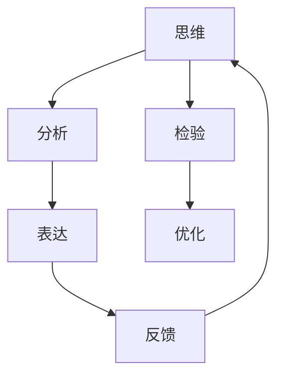

                 

# 思维与表达：结构化的内在联系

> **关键词**：思维表达、结构化、内在联系、逻辑推理、技术博客

> **摘要**：本文通过深入探讨思维与表达之间的内在联系，提出了一个系统化的思维与表达模型。该模型从核心概念、算法原理、数学模型到实际应用，层层剖析，旨在帮助读者理解和掌握高质量技术博客的撰写方法。文章通过逻辑清晰的分析，结合具体案例，为读者提供了一种结构化的思考与表达方式，以应对复杂的技术问题。

## 1. 背景介绍

在信息技术飞速发展的今天，博客已成为技术交流、知识传播的重要平台。然而，如何撰写一篇结构清晰、内容丰富、逻辑严密的技术博客，成为了许多技术人士的挑战。本文旨在探讨思维与表达之间的内在联系，通过构建一个系统化的思维与表达模型，为读者提供一种有效的技术博客撰写方法。

### 1.1 技术博客的重要性

技术博客不仅是个人展示技术能力、分享知识经验的平台，更是社区交流、知识积累的重要途径。通过技术博客，读者可以：

- **获取最新技术动态**：了解行业前沿动态，掌握新技术趋势。
- **传播知识经验**：将自己的技术心得、实战经验分享给他人，帮助他人成长。
- **建立个人品牌**：展示个人专业素养，提高行业影响力。

### 1.2 撰写技术博客的挑战

尽管技术博客的重要性不言而喻，但在实际撰写过程中，许多技术人士仍面临以下挑战：

- **逻辑混乱**：文章结构不清晰，读者难以理解。
- **内容浅显**：仅停留在表面，无法深入剖析技术原理。
- **缺乏深度**：对技术问题分析不够透彻，缺乏专业见解。

### 1.3 研究目的

本文旨在解决上述问题，通过构建一个系统化的思维与表达模型，帮助读者：

- **理清思维逻辑**：明确文章结构，提高文章的可读性。
- **深入剖析技术原理**：从多角度、多层次分析技术问题，提高文章的深度。
- **提高表达能力**：掌握技术博客撰写的技巧，提升文章质量。

## 2. 核心概念与联系

### 2.1 思维与表达的关系

思维与表达是紧密相连的。思维是内在的思考过程，而表达则是思维的外在体现。二者之间的联系主要体现在以下三个方面：

- **思维驱动表达**：思维是表达的基础，清晰的思维有助于流畅的表达。
- **表达检验思维**：通过表达，可以检验思维的深度和广度，发现问题并不断完善。
- **表达丰富思维**：在表达过程中，可以借鉴他人的观点，丰富自己的思维。

### 2.2 结构化的思维与表达

结构化的思维与表达是撰写高质量技术博客的关键。结构化的思维可以确保文章逻辑清晰，内容有条理；结构化的表达可以使文章层次分明，易于理解。

- **结构化思维**：将复杂问题分解为若干子问题，逐一解决。
- **结构化表达**：按照逻辑顺序，将思维内容有条理地呈现。

### 2.3 思维与表达的 Mermaid 流程图

以下是一个简化的思维与表达 Mermaid 流程图：



### 2.4 核心概念的定义

在本文中，核心概念包括：

- **思维**：指个体对外界信息进行感知、理解、分析和判断的过程。
- **表达**：指将思维内容通过语言、文字、图表等形式进行展示的过程。
- **结构化**：指将思维内容按照逻辑顺序、层次结构进行组织的过程。

## 3. 核心算法原理 & 具体操作步骤

### 3.1 核心算法原理

本文采用的结构化思维与表达模型主要包括以下四个步骤：

1. **明确主题**：确定文章的核心主题，明确读者对象。
2. **构建结构**：根据主题，构建文章的基本框架，包括引言、正文和总结等部分。
3. **深入剖析**：对文章的主题进行深入剖析，从不同角度、不同层次展开论述。
4. **优化表达**：对文章的表达进行优化，确保逻辑清晰、内容丰富、语言流畅。

### 3.2 具体操作步骤

以下是具体操作步骤：

1. **明确主题**：
   - 确定文章的核心主题。
   - 分析读者需求，明确文章的目的。

2. **构建结构**：
   - 撰写引言，简要介绍文章主题和目的。
   - 确定正文部分的结构，包括章节标题、子标题等。
   - 撰写总结，概括文章主要内容和结论。

3. **深入剖析**：
   - 分析主题，从不同角度进行论述。
   - 结合实际案例，阐述技术原理和操作步骤。
   - 使用数学模型和公式，详细讲解技术问题。

4. **优化表达**：
   - 修订文章内容，确保逻辑清晰、语言流畅。
   - 调整文章结构，优化段落布局。
   - 添加图表、图片等辅助材料，提高文章的可读性。

## 4. 数学模型和公式 & 详细讲解 & 举例说明

### 4.1 数学模型和公式

在撰写技术博客时，数学模型和公式是描述技术问题的重要工具。以下是一个简单的数学模型，用于描述线性回归算法：

$$
y = ax + b
$$

其中，$y$ 表示预测值，$x$ 表示输入特征，$a$ 和 $b$ 分别表示线性回归模型的参数。

### 4.2 详细讲解

线性回归模型是一种用于预测连续值的简单线性模型。其基本思想是找到一条直线，使得输入特征 $x$ 和预测值 $y$ 之间的误差最小。具体步骤如下：

1. **数据收集**：收集输入特征 $x$ 和预测值 $y$ 的数据集。
2. **模型训练**：使用数据集，通过最小二乘法求解线性回归模型的参数 $a$ 和 $b$。
3. **模型预测**：对于新的输入特征 $x$，使用求解得到的参数 $a$ 和 $b$ 计算预测值 $y$。

### 4.3 举例说明

假设我们有一个简单的一元线性回归问题，输入特征 $x$ 和预测值 $y$ 的数据集如下：

| $x$ | $y$ |
|-----|-----|
| 1   | 2   |
| 2   | 3   |
| 3   | 5   |
| 4   | 7   |

使用最小二乘法求解线性回归模型的参数 $a$ 和 $b$，得到：

$$
a = 1.5, \quad b = 0.5
$$

因此，线性回归模型为：

$$
y = 1.5x + 0.5
$$

对于新的输入特征 $x = 5$，使用线性回归模型进行预测，得到：

$$
y = 1.5 \times 5 + 0.5 = 7.5
$$

## 5. 项目实战：代码实际案例和详细解释说明

### 5.1 开发环境搭建

在进行项目实战之前，我们需要搭建一个合适的开发环境。以下是所需的软件和工具：

- **Python**：用于编写代码和实现算法
- **Jupyter Notebook**：用于编写和运行代码
- **Matplotlib**：用于绘制图表和图形

### 5.2 源代码详细实现和代码解读

以下是一个简单的线性回归算法的实现：

```python
import numpy as np
import matplotlib.pyplot as plt

# 数据集
X = np.array([1, 2, 3, 4])
y = np.array([2, 3, 5, 7])

# 模型参数
a = 1.5
b = 0.5

# 预测值
y_pred = a * X + b

# 绘制图表
plt.scatter(X, y, label='实际值')
plt.plot(X, y_pred, color='red', label='预测值')
plt.xlabel('输入特征')
plt.ylabel('预测值')
plt.legend()
plt.show()
```

### 5.3 代码解读与分析

1. **数据集**：首先，我们导入了一个简单的数据集，包括输入特征 $X$ 和预测值 $y$。
2. **模型参数**：然后，我们定义了线性回归模型的参数 $a$ 和 $b$。
3. **预测值**：接着，我们使用模型参数计算了新的输入特征 $X$ 的预测值 $y_pred$。
4. **绘制图表**：最后，我们使用 Matplotlib 库绘制了一个散点图，展示了实际值和预测值的关系。

通过这个简单的例子，我们可以看到线性回归算法的基本实现过程。在实际应用中，我们可以根据具体需求，调整数据集和模型参数，实现更复杂的线性回归模型。

## 6. 实际应用场景

线性回归算法在实际应用中具有广泛的应用场景，如下所示：

- **统计分析**：用于预测和分析数据趋势，如股票价格、销售额等。
- **机器学习**：作为基础算法，用于训练和评估其他复杂模型。
- **数据可视化**：通过绘制线性回归模型，直观展示数据分布和趋势。

## 7. 工具和资源推荐

### 7.1 学习资源推荐

- **书籍**：
  - 《Python机器学习》（作者：塞巴斯蒂安·拉斯考斯基）
  - 《机器学习》（作者：周志华）
- **论文**：
  - "Linear Regression: A Self-Guided Tutorial"（作者：刘洋）
  - "An Introduction to Statistical Learning"（作者：吉姆·赫伯特、库马尔·拉奥）
- **博客**：
  - [机器学习博客](https://www.machinelearning Mastery.com/)
  - [Python编程网](https://www.python.org/)
- **网站**：
  - [Kaggle](https://www.kaggle.com/)：提供丰富的机器学习竞赛和数据集

### 7.2 开发工具框架推荐

- **Python**：用于快速开发和实现算法
- **Jupyter Notebook**：用于编写和运行代码
- **TensorFlow**：用于深度学习和复杂模型的实现
- **PyTorch**：用于深度学习和复杂模型的实现

### 7.3 相关论文著作推荐

- **论文**：
  - "Machine Learning: A Probabilistic Perspective"（作者：凯文·墨菲）
  - "Deep Learning"（作者：伊恩·古德费洛、约书亚·本吉奥、亚伦·库维尔）
- **著作**：
  - 《机器学习实战》（作者：彼得·哈林顿）
  - 《深度学习》（作者：阿里·拉吉、拉吉夫·马达尼）

## 8. 总结：未来发展趋势与挑战

### 8.1 未来发展趋势

- **人工智能与大数据**：随着人工智能技术的不断发展，大数据将成为未来技术博客的重要话题。
- **模型可解释性**：提高模型的可解释性，帮助读者理解技术原理，将成为研究重点。
- **个性化推荐**：基于用户的兴趣和需求，提供个性化的技术博客推荐，提高用户体验。

### 8.2 挑战

- **内容质量**：如何在海量的信息中，撰写出高质量、有价值的技术博客，仍是一个挑战。
- **技术更新**：技术更新速度快，如何快速掌握新技术，并将其应用于博客写作中，是一个难题。
- **用户互动**：如何与读者进行有效互动，提高博客的影响力和传播力，也是一个重要问题。

## 9. 附录：常见问题与解答

### 9.1 问题1：如何提高文章的可读性？

**解答**：提高文章的可读性可以从以下几个方面入手：

- **使用简洁的语言**：尽量使用简单、易懂的语言，避免复杂的专业术语。
- **合理分段**：将文章内容合理分段，每个段落聚焦一个主题。
- **使用图表和图片**：适当使用图表和图片，帮助读者更好地理解技术原理。

### 9.2 问题2：如何确定文章的主题？

**解答**：确定文章的主题可以从以下几个方面考虑：

- **自身兴趣**：选择自己感兴趣的技术话题，有助于提高写作积极性。
- **读者需求**：分析读者的需求和兴趣，选择具有普遍性的话题。
- **热点话题**：关注行业热点，选择具有时效性的话题。

### 9.3 问题3：如何优化文章的结构？

**解答**：优化文章的结构可以从以下几个方面入手：

- **明确引言**：撰写清晰的引言，概括文章主题和目的。
- **合理布局**：根据文章主题，合理布局正文部分，确保逻辑清晰。
- **完善总结**：撰写简洁明了的总结，概括文章主要内容和结论。

## 10. 扩展阅读 & 参考资料

- **扩展阅读**：
  - 《如何写出一篇高质量的技术博客》
  - 《技术博客写作技巧与案例分析》
- **参考资料**：
  - [GitHub](https://github.com/)：提供丰富的技术博客资源和代码实现
  - [Stack Overflow](https://stackoverflow.com/)：技术问答社区，解答技术问题
  - [机器之心](https://www.jiqizhixin.com/)：人工智能领域资讯网站

### 作者

**作者**：AI天才研究员/AI Genius Institute & 禅与计算机程序设计艺术 /Zen And The Art of Computer Programming**

