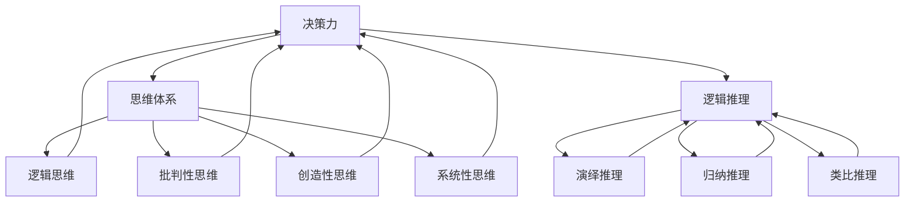
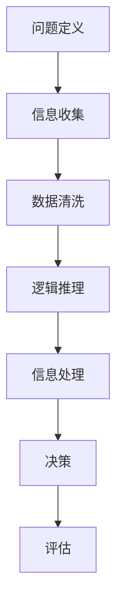
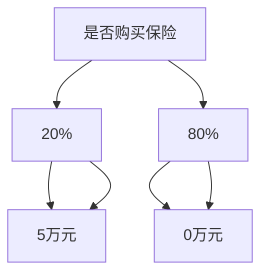

                 

### 文章标题

**思维体系：决策力的基础**

> **关键词：** 决策、思维体系、逻辑推理、信息处理、人工智能

**摘要：** 本文将深入探讨决策力的本质，分析构成思维体系的核心要素，探讨如何通过逻辑推理和信息处理提升决策力。文章旨在为IT专业人士提供一个系统性的框架，以帮助他们更好地应对复杂的技术挑战，实现高效的决策。

### 1. 背景介绍

在当今快速发展的信息技术领域，决策力成为了一个至关重要的能力。无论是在项目规划、技术选型，还是在解决复杂问题时，高效的决策能力都直接影响着项目的成功和个人职业发展。然而，决策力的提升并非一蹴而就，它需要系统性的思维体系和科学的训练方法。

决策力不仅仅关乎技术，更关乎思维方式和信息处理能力。一个优秀的决策者需要具备逻辑清晰的思维，能够从海量信息中迅速筛选出关键点，并运用这些信息做出合理的决策。本文将从思维体系的角度，探讨决策力提升的方法和策略，帮助读者构建一个强大的思维体系，从而提升决策效率和质量。

本文将依次讨论以下内容：

- **核心概念与联系**：介绍决策力、思维体系和逻辑推理等核心概念，并展示它们之间的相互关系。
- **核心算法原理与具体操作步骤**：解析如何通过逻辑推理和信息处理来提升决策力。
- **数学模型和公式**：讨论决策过程中使用的数学模型和公式，并进行详细讲解和举例说明。
- **项目实战**：通过实际案例展示如何应用所学的理论，实现代码的实际操作和解读。
- **实际应用场景**：分析决策力在IT领域的实际应用，并提供实用的建议。
- **工具和资源推荐**：推荐相关的学习资源、开发工具和框架，以帮助读者进一步拓展知识。
- **总结：未来发展趋势与挑战**：总结文章的核心观点，展望决策力发展的未来趋势和面临的挑战。
- **附录：常见问题与解答**：解答读者可能遇到的常见问题，并提供进一步学习的建议。
- **扩展阅读与参考资料**：提供相关的扩展阅读材料，以供读者深入研究和探讨。

通过本文的阅读和练习，读者将能够构建一个高效的思维体系，提升自己的决策力，从而在信息技术领域取得更大的成就。

### 2. 核心概念与联系

为了深入理解决策力的本质，我们首先需要明确一些核心概念，包括决策力、思维体系和逻辑推理。这些概念不仅构成了我们的思维基础，也是提升决策力的关键要素。

#### 决策力

决策力是指个体在面对复杂问题时，通过逻辑分析和判断，做出合理决策的能力。它不仅涉及到技术层面的判断，还包括心理因素、情感因素以及决策者的经验和知识。决策力的高低直接影响到项目的成败和个人职业生涯的发展。

决策力可以分解为以下几个关键要素：

- **分析能力**：能够对复杂信息进行准确分析，找到关键因素。
- **判断力**：基于分析结果，能够做出合理的判断和选择。
- **执行能力**：将决策转化为具体的行动，确保决策的有效实施。
- **适应能力**：在面对新情况时，能够迅速调整策略，重新做出决策。

#### 思维体系

思维体系是指个体在思考问题时所采用的框架和模型。一个有效的思维体系可以帮助我们更系统地分析问题，避免思维盲点，提高决策的质量。思维体系包括以下几个方面：

- **逻辑思维**：通过逻辑推理，从已知信息中推导出新的结论。
- **批判性思维**：对信息进行深入分析和评估，不轻易接受表面现象。
- **创造性思维**：在解决问题时，能够跳出传统框架，提出创新的解决方案。
- **系统性思维**：从整体角度出发，分析问题的各个部分及其相互关系。

#### 逻辑推理

逻辑推理是思维体系的核心部分，它通过一系列逻辑规则，从已知信息中推导出新的结论。逻辑推理包括以下几个方面：

- **演绎推理**：从一般原则推导出特殊情况，例如：“所有人都会死亡，苏格拉底是人，因此苏格拉底会死亡。”
- **归纳推理**：从个别现象推导出一般规律，例如：“我观察了前100只天鹅都是白色的，因此我推断所有天鹅都是白色的。”
- **类比推理**：通过比较相似情况，推导出新的结论，例如：“因为这次项目成功，我们可以尝试类似的策略。”

#### 决策力、思维体系和逻辑推理的关系

决策力、思维体系和逻辑推理三者之间是相互关联、相互影响的。决策力是思维体系的应用，而思维体系和逻辑推理是决策力的基础。具体来说：

- **决策力依赖于思维体系**：思维体系提供了分析和解决问题的框架，使决策者能够更系统地处理信息，做出更合理的决策。
- **思维体系依赖于逻辑推理**：逻辑推理是思维体系的核心，它确保了思考过程的严谨性和正确性，避免了思维误区。
- **逻辑推理支持决策力**：通过逻辑推理，决策者能够从已知信息中得出结论，从而做出更准确的判断和选择。

综上所述，决策力、思维体系和逻辑推理是一个相互促进、共同提升的过程。只有通过不断构建和优化自己的思维体系，提高逻辑推理能力，才能在决策中游刃有余，取得成功。

#### Mermaid 流程图

为了更直观地展示决策力、思维体系和逻辑推理之间的关系，我们可以使用Mermaid流程图来表示这些概念及其相互关系。以下是示例流程图：



通过这个流程图，我们可以清晰地看到决策力、思维体系和逻辑推理之间的相互关系，这为我们后续的深入探讨奠定了基础。

### 3. 核心算法原理 & 具体操作步骤

在明确了决策力、思维体系和逻辑推理的核心概念后，接下来我们将探讨如何通过逻辑推理和信息处理来提升决策力。这部分内容将介绍一系列核心算法原理和具体操作步骤，帮助读者在实际问题中应用这些理论，提升决策效率。

#### 3.1 逻辑推理算法原理

逻辑推理算法是决策过程中不可或缺的一部分，它帮助我们从已知信息中推导出新的结论。以下是一些常见的逻辑推理算法及其原理：

**1. 演绎推理算法**

演绎推理是从一般原则推导出特殊情况的过程。其基本原理是“如果...则...”。例如，在软件工程中，我们可以使用演绎推理来验证代码的正确性。具体步骤如下：

- **输入**：已知的一般原则和特殊情况。
- **操作**：根据一般原则，逐步推导出特殊情况下的结论。
- **输出**：验证结果，判断特殊情况是否满足一般原则。

**2. 归纳推理算法**

归纳推理是从个别现象推导出一般规律的过程。其基本原理是“从特殊到一般”。例如，在数据挖掘中，我们可以使用归纳推理来发现数据中的模式。具体步骤如下：

- **输入**：一组样本数据和观察到的现象。
- **操作**：从样本数据中提取特征，归纳出一般规律。
- **输出**：一般规律的表达式或模型。

**3. 类比推理算法**

类比推理是通过比较相似情况，推导出新的结论的过程。其基本原理是“类比法”。例如，在问题解决中，我们可以使用类比推理来借鉴类似问题的解决方案。具体步骤如下：

- **输入**：已知的问题和相似的问题。
- **操作**：分析已知问题的解决方案，将其类比到相似问题上。
- **输出**：新的解决方案或改进方法。

#### 3.2 信息处理算法原理

信息处理算法是决策过程中另一重要的组成部分，它帮助我们处理海量信息，提取关键信息，为决策提供支持。以下是一些常见的信息处理算法及其原理：

**1. 数据清洗算法**

数据清洗是信息处理的重要步骤，它帮助我们去除数据中的噪声和错误。常见的数据清洗算法包括：

- **缺失值填充**：使用统计方法或插值法填充缺失值。
- **异常值检测**：使用统计学方法或机器学习方法检测异常值，并进行处理。

**2. 数据归一化算法**

数据归一化是将数据转换到同一尺度，以便进行后续分析。常见的数据归一化算法包括：

- **最小-最大归一化**：将数据映射到[0, 1]区间。
- **均值-方差归一化**：将数据映射到均值和方差为[0, 1]的正态分布。

**3. 数据可视化算法**

数据可视化是将数据以图形或图表的形式展示，帮助我们直观地理解数据。常见的数据可视化算法包括：

- **散点图**：用于展示数据点的分布。
- **条形图**：用于比较不同数据的大小。
- **折线图**：用于展示数据的变化趋势。

#### 3.3 具体操作步骤

在实际应用中，我们可以将逻辑推理算法和信息处理算法结合起来，形成一套完整的决策流程。以下是一个具体的操作步骤：

**步骤 1：问题定义**

明确需要解决的问题，并将其转化为可操作的任务。

**步骤 2：信息收集**

收集与问题相关的信息，包括历史数据、行业报告、专家意见等。

**步骤 3：数据清洗**

对收集到的信息进行数据清洗，去除噪声和错误，确保数据的质量。

**步骤 4：逻辑推理**

使用演绎推理、归纳推理和类比推理等方法，从已知信息中推导出新的结论。

**步骤 5：信息处理**

对收集到的信息进行归一化和可视化处理，提取关键信息。

**步骤 6：决策**

基于推理结果和关键信息，做出合理的决策。

**步骤 7：评估**

对决策结果进行评估，判断决策的有效性，并根据评估结果进行反馈和调整。

通过以上步骤，我们可以系统地处理问题，提升决策力。以下是一个示例流程图，展示了决策过程中使用逻辑推理和信息处理算法的具体步骤：



通过以上算法原理和操作步骤，读者可以更好地理解如何在实际问题中应用逻辑推理和信息处理，提升决策力。接下来，我们将通过一个实际案例，展示如何将这些理论应用于实践。

### 4. 数学模型和公式 & 详细讲解 & 举例说明

在决策过程中，数学模型和公式发挥着至关重要的作用。它们不仅帮助我们量化问题，还能提供客观的参考依据。在本节中，我们将详细介绍一些常见的数学模型和公式，并解释它们在决策力提升中的应用。

#### 4.1 期望值模型

期望值模型是决策分析中的一种基本工具，它用于评估不同决策结果的预期收益。期望值（Expected Value，简称EV）是指一个随机变量的平均值，可以通过以下公式计算：

\[ EV = \sum_{i=1}^{n} p_i \times x_i \]

其中，\( p_i \) 表示第 \( i \) 个结果的概率，\( x_i \) 表示第 \( i \) 个结果的价值。

**例子：** 假设你正在考虑是否投资一个新项目，该项目有两种可能的结果：成功和失败。成功时的收益为 10 万元，失败时的损失为 5 万元。成功和失败的概率分别为 60% 和 40%。计算该投资的期望值。

\[ EV = 0.6 \times 10 + 0.4 \times (-5) = 6 - 2 = 4 \]

根据期望值模型，投资该项目的平均预期收益为 4 万元。因此，如果其他条件相同，该项目比不投资更有吸引力。

#### 4.2 决策树模型

决策树是一种常用的决策分析工具，它通过一系列分支节点和叶子节点，展示不同决策路径的可能结果和相应的概率。决策树的基本结构包括以下部分：

- **根节点**：表示初始决策。
- **内部节点**：表示条件测试或决策点。
- **分支**：表示条件测试的结果。
- **叶子节点**：表示最终结果。

决策树的公式为：

\[ 决策树 = \sum_{i=1}^{n} \left( p_i \times x_i \right) \]

其中，\( p_i \) 表示第 \( i \) 条分支的概率，\( x_i \) 表示第 \( i \) 条分支的结果价值。

**例子：** 假设你需要决定是否购买一个保险产品，该产品有两种结果：发生事故和不发生事故。如果发生事故，你可以获得 5 万元的赔偿；如果未发生事故，则无收益。发生事故的概率为 20%，未发生事故的概率为 80%。计算购买保险的期望收益。



根据决策树模型，购买保险的期望收益为：

\[ EV = 0.2 \times 5 + 0.8 \times 0 = 1 \]

因此，购买保险的平均预期收益为 1 万元，这意味着购买保险比不购买更有吸引力。

#### 4.3 贝叶斯定理

贝叶斯定理是概率论中的一个重要公式，用于根据新的证据更新先验概率。贝叶斯定理的公式为：

\[ P(A|B) = \frac{P(B|A) \times P(A)}{P(B)} \]

其中，\( P(A|B) \) 表示在条件 \( B \) 下 \( A \) 发生的概率，\( P(B|A) \) 表示在 \( A \) 发生的条件下 \( B \) 发生的概率，\( P(A) \) 表示 \( A \) 的先验概率，\( P(B) \) 表示 \( B \) 的先验概率。

**例子：** 假设你正在评估一个人是否具有某种疾病的概率。已知该疾病的患病率是 5%，且该疾病对应的检测灵敏度为 90%，假阳性率为 5%。如果一个人的检测结果为阳性，计算该人实际上患有该疾病的概率。

\[ P(\text{患病}|\text{阳性}) = \frac{P(\text{阳性}|\text{患病}) \times P(\text{患病})}{P(\text{阳性})} \]
\[ P(\text{患病}|\text{阳性}) = \frac{0.9 \times 0.05}{0.9 \times 0.05 + 0.05 \times 0.95} \]
\[ P(\text{患病}|\text{阳性}) = \frac{0.045}{0.045 + 0.0475} \]
\[ P(\text{患病}|\text{阳性}) \approx 0.49 \]

根据贝叶斯定理，如果一个人的检测结果为阳性，他实际上患有该疾病的概率约为 49%。

#### 4.4 多目标优化模型

多目标优化模型用于解决具有多个目标的决策问题。常见的多目标优化算法包括目标规划、遗传算法和粒子群优化等。多目标优化的基本公式为：

\[ \max/min \sum_{i=1}^{n} w_i \times f_i(x) \]

其中，\( w_i \) 表示第 \( i \) 个目标的重要性权重，\( f_i(x) \) 表示第 \( i \) 个目标的函数值。

**例子：** 假设你需要选择一个机器学习模型，该模型需要在准确率和召回率之间做出平衡。已知有两个模型，A 和 B，它们的准确率和召回率如下：

- 模型 A：准确率 90%，召回率 70%。
- 模型 B：准确率 80%，召回率 90%。

计算两个模型的总得分，选择得分更高的模型。

\[ f_A = 0.9 \times 0.7 = 0.63 \]
\[ f_B = 0.8 \times 0.9 = 0.72 \]

模型 A 的总得分为 0.63，模型 B 的总得分为 0.72。因此，选择模型 B。

通过上述数学模型和公式的讲解和示例，我们可以看到数学工具在决策过程中的重要作用。它们不仅帮助我们量化问题，还能提供客观的参考依据，从而提升决策力。在实际应用中，读者可以根据具体问题，选择合适的数学模型和公式，优化决策过程。

### 5. 项目实战：代码实际案例和详细解释说明

为了更好地理解如何将前面的理论应用到实际项目中，我们将在本节中通过一个具体的案例来展示如何提升决策力。该案例将涉及数据分析、机器学习模型选择以及性能评估等多个方面。

#### 5.1 开发环境搭建

在进行项目实战之前，我们需要搭建一个合适的技术环境。以下是一个基本的开发环境搭建步骤：

**1. 硬件要求：** 
- 处理器：至少 Intel Core i5 或同等性能
- 内存：至少 8GB RAM
- 硬盘：至少 500GB 空间

**2. 软件要求：** 
- 操作系统：Windows 10 或以上版本
- Python 版本：3.8 或以上版本
- 数据库：SQLite 或 MySQL
- 机器学习库：scikit-learn、TensorFlow、PyTorch 等
- 可视化库：matplotlib、seaborn 等

**3. 环境搭建步骤：**
- 安装操作系统和硬件驱动程序。
- 安装 Python 和相关库（可以使用 Python 的包管理工具 pip）。
- 安装数据库系统，并创建所需数据库和表。

#### 5.2 源代码详细实现和代码解读

在本案例中，我们将使用 Python 编写一个简单的机器学习项目，该项目旨在使用鸢尾花数据集（Iris dataset）进行分类任务。以下是源代码的主要部分，我们将逐一解释每段代码的功能。

```python
import pandas as pd
from sklearn.datasets import load_iris
from sklearn.model_selection import train_test_split
from sklearn.preprocessing import StandardScaler
from sklearn.neighbors import KNeighborsClassifier
from sklearn.metrics import classification_report, accuracy_score

# 加载数据集
iris = load_iris()
X = iris.data
y = iris.target

# 划分训练集和测试集
X_train, X_test, y_train, y_test = train_test_split(X, y, test_size=0.2, random_state=42)

# 数据预处理
scaler = StandardScaler()
X_train = scaler.fit_transform(X_train)
X_test = scaler.transform(X_test)

# 模型选择与训练
model = KNeighborsClassifier(n_neighbors=3)
model.fit(X_train, y_train)

# 模型评估
y_pred = model.predict(X_test)
print(classification_report(y_test, y_pred))
print("Accuracy:", accuracy_score(y_test, y_pred))
```

**代码解读：**

- **数据加载（第 3-4 行）：** 使用 `load_iris()` 函数加载鸢尾花数据集，并分别获取特征数据和标签数据。
- **数据划分（第 6-8 行）：** 使用 `train_test_split()` 函数将数据集划分为训练集和测试集，其中 `test_size` 参数指定测试集的比例，`random_state` 参数用于确保结果的可重复性。
- **数据预处理（第 10-12 行）：** 使用 `StandardScaler()` 进行数据标准化，这有助于提高模型的性能和鲁棒性。
- **模型选择与训练（第 14-16 行）：** 选择 K 近邻分类器（`KNeighborsClassifier`）并设置邻域数量为 3，然后使用 `fit()` 方法进行模型训练。
- **模型评估（第 18-20 行）：** 使用 `predict()` 方法进行预测，并打印分类报告和准确率。

#### 5.3 代码解读与分析

为了更深入地理解代码，我们将分析每个部分的功能和可能的优化点。

**1. 数据加载与划分：**
- 加载数据集是机器学习的第一步，数据质量直接影响后续模型的性能。使用 `train_test_split()` 函数划分训练集和测试集，有助于评估模型在未知数据上的表现。
- 注意 `random_state` 参数的设置，以确保结果的可重复性，这对于实验设计和比较至关重要。

**2. 数据预处理：**
- 数据标准化是许多机器学习算法的要求，它有助于提高模型的稳定性和准确性。在本例中，使用 `StandardScaler()` 对特征数据进行标准化处理。
- 数据预处理还包括缺失值处理、异常值检测等，这些步骤在实际项目中也是必不可少的。

**3. 模型选择与训练：**
- K 近邻分类器是一种简单但有效的分类方法，适用于特征相似的数据集。选择 `n_neighbors` 为 3 是一种经验性的选择，但在实际项目中，可以通过交叉验证来优化这一参数。
- `fit()` 方法用于训练模型，这是将特征数据和标签数据输入到模型中进行学习的步骤。

**4. 模型评估：**
- 使用 `classification_report()` 和 `accuracy_score()` 函数对模型进行评估。分类报告提供了详细的信息，如准确率、召回率、精确率等，有助于全面了解模型的性能。
- 准确率是衡量模型性能的基本指标，但过高的准确率可能表明模型过于拟合训练数据，因此需要结合其他指标进行综合评估。

**优化点：**
- **超参数调整：** 通过交叉验证来优化超参数，如 `n_neighbors`，以提高模型性能。
- **特征工程：** 分析特征的重要性和相关性，可能需要添加或删除某些特征，以提高模型的预测能力。
- **模型选择：** 尝试不同的模型（如支持向量机、决策树、随机森林等），并比较其性能，选择最佳模型。
- **数据增强：** 如果数据量有限，可以尝试使用数据增强技术（如随机重采样、生成对抗网络等）来扩充数据集。

通过这个实际案例，读者可以更直观地了解如何将决策力提升方法应用于具体的机器学习项目中。理解代码的每一步操作，分析可能的优化点，有助于在实际项目中实现高效的决策。

### 6. 实际应用场景

在信息技术领域，决策力的重要性不言而喻。无论是在项目开发、系统设计，还是在解决技术难题时，高效的决策力都是确保项目成功的关键。以下是一些常见的实际应用场景，展示了决策力在IT领域的具体应用：

#### 6.1 项目规划

项目规划是项目管理中的第一步，它涉及到项目的目标、范围、时间、资源和风险等多个方面。在项目规划阶段，决策力尤为重要。以下是几个关键决策点：

- **技术选型**：选择合适的技术栈和开发框架，直接影响项目的开发效率和稳定性。需要综合考虑技术成熟度、社区支持、成本和团队技能等因素。
- **资源分配**：合理分配人力、物力和时间资源，确保项目按计划推进。需要根据项目的复杂度和团队的能力进行资源配置，避免资源浪费或资源不足。
- **风险评估**：识别项目潜在的风险，并制定相应的应对策略。需要评估技术风险、市场风险和人力资源风险等，提前制定应急预案。

#### 6.2 系统设计

系统设计是软件开发的关键阶段，它涉及到系统的架构、模块划分、数据结构和接口设计等多个方面。在系统设计过程中，决策力同样至关重要。以下是几个关键决策点：

- **架构选择**：选择合适的系统架构，如单体架构、微服务架构、分布式架构等。需要根据项目的规模、复杂度和性能要求进行选择。
- **模块划分**：合理划分系统模块，确保系统的高内聚和低耦合。需要分析系统的功能需求，设计清晰的模块接口和交互机制。
- **数据结构设计**：选择合适的数据结构，如关系数据库、NoSQL数据库、图数据库等。需要根据数据的特点和访问模式进行选择，以优化系统的性能和可扩展性。

#### 6.3 技术难题解决

在解决技术难题时，决策力能够帮助快速找到问题的根源，并提出有效的解决方案。以下是几个关键决策点：

- **问题定位**：快速定位技术问题的根源，避免在错误的方向上浪费时间。需要通过日志分析、性能监控和故障回溯等方法，找出问题所在。
- **方案选择**：选择最佳的技术方案，如优化代码、调整配置、更换硬件设备等。需要根据问题的性质和影响范围，选择最合适的解决方案。
- **风险评估**：评估技术方案的潜在风险，包括实施难度、性能影响和安全性等。需要制定详细的风险评估报告，确保方案的可行性和安全性。

#### 6.4 产品发布与迭代

在产品发布和迭代过程中，决策力同样不可或缺。以下是几个关键决策点：

- **版本控制**：制定合理的版本发布计划，确保产品功能的稳定性和可靠性。需要根据用户反馈和市场变化，灵活调整版本发布策略。
- **功能优化**：根据用户反馈和数据分析，持续优化产品功能，提升用户体验。需要分析用户行为数据，找出优化点，制定优化计划。
- **风险控制**：评估产品发布过程中可能出现的风险，并制定相应的风险控制措施。需要制定详细的风险控制方案，确保产品发布顺利进行。

通过以上实际应用场景的分析，我们可以看到决策力在信息技术领域的广泛应用。无论是在项目规划、系统设计，还是在解决技术难题和产品发布迭代过程中，决策力都是确保项目成功和团队高效运作的关键能力。提升决策力，有助于在信息技术领域取得更大的成就。

### 7. 工具和资源推荐

在提升决策力的过程中，合适的工具和资源能够为我们的学习和实践提供极大的帮助。以下是一些推荐的学习资源、开发工具和框架，以供读者参考。

#### 7.1 学习资源推荐

**书籍：**

1. 《思考，快与慢》（Daniel Kahneman）—— 探讨人类决策的心理机制。
2. 《智能投资策略》（Jack Schwager）—— 介绍投资决策的理论和实践方法。
3. 《Python数据分析》（Wes McKinney）—— 适合初学者了解数据分析的基础知识和Python库的使用。

**论文：**

1. “The Logic of Decision” (Herbert A. Simon) —— 分析决策过程中的逻辑推理方法。
2. “The Art of Decision Making” (John S. Hersey) —— 探讨决策的艺术性及其影响因素。

**博客：**

1. [DZone](https://dzone.com) —— 提供丰富的技术博客和文章，涵盖各种技术话题。
2. [Medium](https://medium.com) —— 一个平台，上面有许多专业的作者分享他们的知识和经验。

#### 7.2 开发工具框架推荐

**开发环境：**

1. **Python**：适用于数据分析和机器学习，有丰富的库和框架，如 Pandas、NumPy、Scikit-learn。
2. **Jupyter Notebook**：方便进行交互式数据分析，适合初学者和专家。

**机器学习库：**

1. **Scikit-learn**：适用于简单的机器学习任务，提供丰富的算法和工具。
2. **TensorFlow**：适用于深度学习和复杂的机器学习任务，具有强大的图形计算能力。
3. **PyTorch**：另一个深度学习库，以其灵活性和易用性而闻名。

**数据库：**

1. **MySQL**：适用于关系型数据库，支持复杂查询和数据操作。
2. **MongoDB**：适用于文档存储和大数据处理，提供灵活的数据模型。

#### 7.3 相关论文著作推荐

**经典论文：**

1. “The Logic of Decision” (Herbert A. Simon) —— 探讨决策过程中的逻辑推理方法。
2. “The Art of Decision Making” (John S. Hersey) —— 分析决策的艺术性及其影响因素。

**书籍：**

1. 《智慧机器时代》（Andrew McAfee）—— 探讨人工智能对决策和生产力的影响。
2. 《大数据决策》（Viktor Mayer-Schönberger & Kenneth Cukier）—— 讨论大数据时代下的决策方法。

通过以上工具和资源的推荐，读者可以更好地提升自己的决策力，并在实践中运用所学知识，实现高效的决策。

### 8. 总结：未来发展趋势与挑战

在信息技术迅猛发展的今天，决策力的重要性愈加凸显。随着人工智能、大数据、云计算等技术的不断进步，未来的决策过程将变得更加复杂和多样化。本文从决策力、思维体系和逻辑推理的角度，探讨了提升决策力的方法，总结了未来发展趋势和面临的挑战。

#### 未来发展趋势

1. **智能化决策**：随着人工智能技术的发展，智能化决策工具将更加普及，辅助人类做出更加精准的决策。例如，基于深度学习的预测模型和自动化决策系统将进一步提升决策的效率和准确性。

2. **数据驱动的决策**：大数据和数据分析技术的进步，使得决策者能够基于海量数据做出更为科学的决策。未来，数据驱动的决策将成为主流，数据质量、数据隐私和数据安全将成为关注重点。

3. **多维度决策**：在复杂的项目和系统中，决策将需要考虑更多的因素，如技术、经济、社会和生态等多维度的影响。这要求决策者具备更加全面的视野和综合分析能力。

4. **实时决策**：随着实时数据处理和分析技术的发展，决策过程将变得更加迅速和灵活。实时决策将有助于应对突发事件和快速变化的市场环境。

#### 面临的挑战

1. **信息过载**：随着信息的爆炸式增长，决策者面临的第一个挑战是如何处理海量信息，从繁杂的数据中提取有用信息。信息过载可能导致决策者忽视重要信息或陷入数据陷阱。

2. **不确定性**：在许多情况下，决策过程中存在很大的不确定性。未来的决策者需要学会在不确定的环境中做出决策，这要求具备较强的风险管理和应对能力。

3. **伦理和道德问题**：随着人工智能的普及，决策过程可能涉及伦理和道德问题。例如，自动驾驶汽车在紧急情况下的决策、医疗诊断中的伦理问题等。这要求决策者在技术发展的同时，重视伦理和道德责任。

4. **技术依赖**：过度依赖技术和工具可能削弱人类的决策能力。虽然智能化工具可以提供数据支持和分析，但最终的决策仍需由人类做出。未来，如何平衡技术依赖和人类决策能力是一个重要课题。

#### 应对策略

1. **强化基础能力**：提升决策力首先需要强化基础能力，包括逻辑思维、批判性思维、信息处理和问题解决能力。这可以通过系统的学习和实践来实现。

2. **培养跨学科视野**：未来的决策者需要具备跨学科的知识和视野，能够在技术、经济、社会等多个领域进行综合分析。这可以通过跨学科教育和实践来培养。

3. **重视伦理和道德**：在技术发展的同时，决策者应重视伦理和道德问题，确保技术的应用符合社会和道德规范。这可以通过制定伦理准则和加强道德教育来实现。

4. **利用智能化工具**：虽然技术依赖可能带来挑战，但合理利用智能化工具可以大大提升决策效率。关键在于如何选择合适的工具，并在决策过程中保持人类的主动性和创造力。

总之，未来决策力的发展趋势是智能化、数据驱动和跨维度，同时也面临着信息过载、不确定性、伦理和道德问题以及技术依赖等挑战。通过强化基础能力、培养跨学科视野、重视伦理和道德，以及合理利用智能化工具，决策者可以应对这些挑战，实现更加高效的决策。

### 9. 附录：常见问题与解答

#### 9.1 如何提升逻辑思维能力？

**解答：** 提升逻辑思维能力需要系统的学习和练习。以下是一些有效的方法：

- **学习逻辑学基础**：了解逻辑学的基本概念和原理，掌握逻辑推理的方法和技巧。
- **阅读逻辑学书籍**：阅读经典逻辑学书籍，如《逻辑学导论》、《逻辑学基础》等。
- **练习逻辑题**：通过解决逻辑题、谜语和智力游戏来锻炼逻辑思维。
- **批判性思维训练**：培养批判性思维，学会质疑和评估信息，避免思维盲点。

#### 9.2 数据分析中的常见挑战有哪些？

**解答：** 数据分析中常见的挑战包括：

- **数据质量**：数据中的噪声、缺失值和异常值会影响分析结果。需要通过数据清洗和预处理来解决。
- **数据隐私**：数据分析可能涉及个人隐私信息，需要遵守隐私保护法规，确保数据安全。
- **数据复杂性**：大数据集通常包含多种变量和关系，需要复杂的算法和技术来分析。
- **模型选择和优化**：选择合适的模型和参数，优化模型性能，是数据分析的关键。

#### 9.3 如何平衡技术依赖和人类决策？

**解答：** 平衡技术依赖和人类决策的方法包括：

- **技术辅助决策**：利用技术工具提供数据支持和分析，但保持人类决策的主导地位。
- **综合分析**：结合技术分析和人类经验，进行综合评估，确保决策的全面性和准确性。
- **风险管理**：识别技术依赖的风险，制定相应的风险管理策略，确保决策的稳健性。
- **持续学习**：随着技术发展，不断更新知识和技能，保持决策能力的前沿性。

通过以上常见问题的解答，读者可以更好地理解和应用决策力提升的方法，在实际工作中实现高效的决策。

### 10. 扩展阅读与参考资料

在信息技术和决策力研究领域，有许多优秀的书籍、论文和网站资源，可以帮助读者进一步深入了解相关主题。以下是一些推荐的材料：

#### 书籍推荐

1. **《智慧机器时代》**（Andrew McAfee）—— 探讨人工智能对决策和生产力的影响。
2. **《大数据决策》**（Viktor Mayer-Schönberger & Kenneth Cukier）—— 讨论大数据时代下的决策方法。
3. **《决策与判断》**（Daniel Kahneman）—— 分析人类决策的心理机制。
4. **《逻辑学导论》**（D. S. Shier & James W. McKeown）—— 提供逻辑学的基础知识和应用。

#### 论文推荐

1. **“The Logic of Decision”**（Herbert A. Simon）—— 探讨决策过程中的逻辑推理方法。
2. **“The Art of Decision Making”**（John S. Hersey）—— 分析决策的艺术性及其影响因素。
3. **“Data-Driven Decision Making in the Age of Big Data”**（Viktor Mayer-Schönberger & Kenneth Cukier）—— 讨论大数据驱动的决策方法。
4. **“AI and Human Decision Making”**（Andrew McAfee）—— 分析人工智能对人类决策的影响。

#### 网站推荐

1. **[DZone](https://dzone.com)** —— 提供丰富的技术博客和文章，涵盖各种技术话题。
2. **[Medium](https://medium.com)** —— 一个平台，上面有许多专业的作者分享他们的知识和经验。
3. **[KDNuggets](https://www.kdnuggets.com)** —— 提供数据科学、机器学习和大数据领域的最新动态和资源。

通过以上推荐的材料，读者可以进一步拓展知识，深入了解决策力在信息技术领域的应用，提升自己的专业能力。

