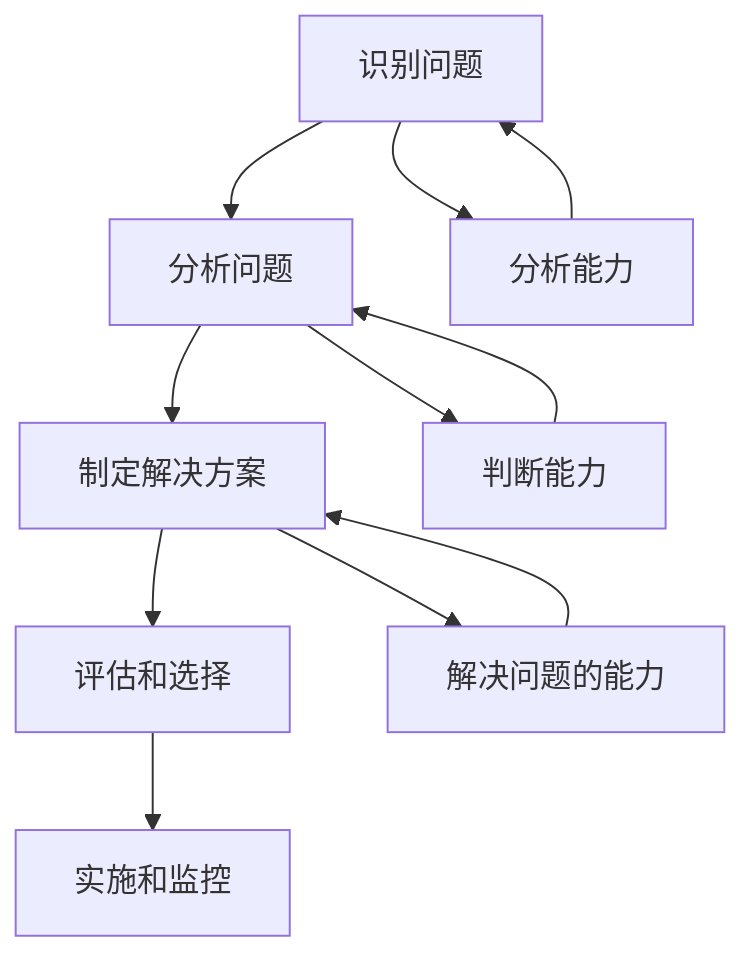

                 

# 《思维能力对管理决策的影响》

## 关键词

* 管理决策
* 思维能力
* 决策分析
* 创新思维
* 团队协作

## 摘要

本文旨在探讨思维能力对管理决策的影响。首先，我们将介绍管理决策的重要性，然后深入探讨不同类型的思维能力及其在决策过程中的应用。通过实例和案例分析，我们将展示思维能力如何影响决策的质量和效率。最后，我们将讨论如何提升管理者的思维能力，以便做出更明智的决策。通过本文的阅读，读者将更好地理解思维能力在管理决策中的关键作用。

## 1. 背景介绍

管理决策是企业管理过程中至关重要的一环。有效的决策能够帮助企业抓住市场机遇、规避风险、优化资源配置，从而实现长期发展。然而，决策并非易事，它需要管理者具备深厚的专业知识、丰富的经验和卓越的思维能力。

思维能力是管理者在决策过程中进行信息处理、分析判断和问题解决的能力。不同的思维能力影响着管理者对问题的认识、分析和解决方案的提出。因此，探讨思维能力对管理决策的影响，对于提升管理者决策能力具有重要意义。

本文将围绕以下几个核心问题展开：

1. 思维能力的定义及其在管理决策中的作用。
2. 不同类型的思维能力及其在决策过程中的应用。
3. 思维能力对决策质量和效率的影响。
4. 提升管理者思维能力的方法和策略。

## 2. 核心概念与联系

为了更好地理解思维能力对管理决策的影响，我们首先需要明确几个关键概念及其相互关系。

### 2.1 思维能力的定义

思维能力是指个体在认知过程中进行信息加工、分析判断和问题解决的能力。它包括以下几个方面的能力：

1. **分析能力**：对问题进行深入分析，识别问题的本质和关键因素。
2. **判断能力**：基于分析结果，对问题进行合理的判断和预测。
3. **解决问题的能力**：针对问题提出有效的解决方案，并进行实施和调整。

### 2.2 管理决策的过程

管理决策通常包括以下几个步骤：

1. **识别问题**：发现组织面临的挑战和机遇。
2. **分析问题**：对问题进行深入分析，了解问题的本质和影响因素。
3. **制定解决方案**：基于分析结果，提出可能的解决方案。
4. **评估和选择**：对解决方案进行评估和比较，选择最优方案。
5. **实施和监控**：将决策方案付诸实施，并对实施过程进行监控和调整。

### 2.3 思维能力与管理决策的关联

思维能力在管理决策中起着至关重要的作用。具体体现在以下几个方面：

1. **分析问题的能力**：管理者需要具备强大的分析能力，以便在复杂环境中识别问题的本质和关键因素。
2. **判断和预测能力**：基于分析结果，管理者需要对未来趋势和潜在风险进行准确的判断和预测。
3. **解决问题的能力**：在面对问题时，管理者需要提出创新性的解决方案，并将其有效实施。

为了更好地理解这些概念之间的关系，我们可以使用Mermaid流程图进行展示：



## 3. 核心算法原理 & 具体操作步骤

在探讨思维能力对管理决策的影响时，我们可以借助一些经典的思维模型和算法原理，以便更好地理解和应用。

### 3.1 SWOT分析法

SWOT分析法是一种常用的战略分析工具，用于评估组织的优势（Strengths）、劣势（Weaknesses）、机会（Opportunities）和威胁（Threats）。管理者可以通过SWOT分析来识别组织在决策过程中所面临的外部和内部因素，从而制定更有针对性的决策。

**具体操作步骤**：

1. **识别优势**：分析组织在资源、能力、市场地位等方面的优势。
2. **识别劣势**：分析组织在资源、能力、市场地位等方面的劣势。
3. **识别机会**：分析外部环境中的潜在机会，如市场增长、技术创新等。
4. **识别威胁**：分析外部环境中的潜在威胁，如竞争对手、政策变化等。
5. **制定决策**：根据SWOT分析结果，制定针对性的战略和决策。

### 3.2 五力模型

五力模型是由迈克尔·波特提出的一种用于分析市场竞争结构的工具。管理者可以通过五力模型来识别企业所面临的市场竞争压力，从而制定有效的竞争策略。

**具体操作步骤**：

1. **供应商力量**：分析供应商的议价能力和市场集中度。
2. **买家力量**：分析买家的议价能力和市场集中度。
3. **替代品力量**：分析替代品的威胁程度。
4. **新进入者力量**：分析新进入者的威胁程度。
5. **现有竞争者力量**：分析现有竞争者的竞争策略和市场份额。
6. **制定决策**：根据五力分析结果，制定有针对性的市场策略。

### 3.3 创意思维法

创意思维法是一种用于激发创新思维的工具，可以帮助管理者在决策过程中产生更多创新性的解决方案。

**具体操作步骤**：

1. **问题明确**：明确需要解决的问题或挑战。
2. **创意风暴**：组织团队成员进行创意思维，提出各种可能的解决方案。
3. **筛选方案**：对提出的创意方案进行评估和筛选，选择最具潜力的方案。
4. **实施和调整**：将选定的方案付诸实施，并根据实际情况进行不断调整和优化。

通过这些核心算法原理和具体操作步骤，管理者可以更好地运用思维能力来优化决策过程，提高决策质量。

## 4. 数学模型和公式 & 详细讲解 & 举例说明

在探讨思维能力对管理决策的影响时，我们还可以借助一些数学模型和公式来进行分析和解释。以下是一些常用的数学模型和公式，以及其详细讲解和举例说明。

### 4.1 决策树模型

决策树模型是一种常用的决策分析方法，用于评估不同决策路径的结果和风险。它通过树状结构表示不同的决策节点和结果节点，以便管理者进行决策。

**公式**：

$$
\text{决策树模型} = \sum_{i=1}^{n} \left( p_i \times R_i \right)
$$

其中，$p_i$ 表示第 $i$ 条决策路径的概率，$R_i$ 表示第 $i$ 条决策路径的收益或损失。

**详细讲解**：

1. **计算概率**：根据历史数据和外部信息，计算出不同决策路径的概率。
2. **计算收益或损失**：根据决策路径的结果，计算出对应的收益或损失。
3. **计算期望值**：将概率和收益或损失相乘，得到每个决策路径的期望值。
4. **选择最优路径**：根据期望值的大小，选择期望值最大的决策路径。

**举例说明**：

假设一家公司需要决定是否进行新产品开发。根据市场调研数据，新产品成功的概率为 0.6，失败的概率为 0.4。如果新产品成功，公司的收益为 100 万元；如果新产品失败，公司的损失为 50 万元。

1. **计算概率**：
   - 成功的概率：$p_1 = 0.6$
   - 失败的概率：$p_2 = 0.4$

2. **计算收益或损失**：
   - 成功的收益：$R_1 = 100$ 万元
   - 失败的损失：$R_2 = -50$ 万元

3. **计算期望值**：
   - 成功的期望值：$p_1 \times R_1 = 0.6 \times 100 = 60$ 万元
   - 失败的期望值：$p_2 \times R_2 = 0.4 \times (-50) = -20$ 万元

4. **选择最优路径**：根据期望值，选择期望值最大的决策路径（即新产品开发）。

### 4.2 成本效益分析模型

成本效益分析模型是一种用于评估决策成本和效益的方法，帮助管理者在决策过程中权衡成本和效益，以便选择最优方案。

**公式**：

$$
\text{成本效益比} = \frac{\text{效益}}{\text{成本}}
$$

**详细讲解**：

1. **计算成本**：根据决策方案的实施成本，计算出总成本。
2. **计算效益**：根据决策方案的实施效果，计算出总效益。
3. **计算成本效益比**：将总效益除以总成本，得到成本效益比。
4. **选择最优方案**：根据成本效益比的大小，选择成本效益比最大的方案。

**举例说明**：

假设有两项决策方案，方案一的成本为 50 万元，效益为 80 万元；方案二的成本为 70 万元，效益为 120 万元。

1. **计算成本**：
   - 方案一的成本：$C_1 = 50$ 万元
   - 方案二的成本：$C_2 = 70$ 万元

2. **计算效益**：
   - 方案一的效益：$R_1 = 80$ 万元
   - 方案二的效益：$R_2 = 120$ 万元

3. **计算成本效益比**：
   - 方案一的成本效益比：$\frac{R_1}{C_1} = \frac{80}{50} = 1.6$
   - 方案二的成本效益比：$\frac{R_2}{C_2} = \frac{120}{70} = 1.714$

4. **选择最优方案**：根据成本效益比，选择成本效益比最大的方案（即方案二）。

通过这些数学模型和公式的应用，管理者可以更科学地评估决策的优劣，从而做出更明智的决策。

## 5. 项目实战：代码实际案例和详细解释说明

为了更好地理解思维能力对管理决策的影响，我们可以通过一个实际项目案例来进行分析。以下是一个关于企业战略规划的项目案例，我们将介绍项目的开发环境搭建、源代码实现和详细解释说明。

### 5.1 开发环境搭建

在开始项目开发之前，我们需要搭建一个适合的项目环境。以下是所需的环境和工具：

1. **操作系统**：Windows/Linux/MacOS
2. **编程语言**：Python
3. **开发工具**：PyCharm/VSCode
4. **第三方库**：NumPy, Pandas, Matplotlib

### 5.2 源代码详细实现和代码解读

以下是一个简单的企业战略规划项目代码实现，主要用于分析企业的市场机会和风险，帮助管理者做出更明智的决策。

```python
import numpy as np
import pandas as pd
import matplotlib.pyplot as plt

# 5.2.1 数据读取与预处理
data = pd.read_csv('enterprise_data.csv')
data.head()

# 5.2.2 SWOT分析
strengths = data[data['Type'] == 'Strength'].values
weaknesses = data[data['Type'] == 'Weakness'].values
opportunities = data[data['Type'] == 'Opportunity'].values
threats = data[data['Type'] == 'Threat'].values

# 5.2.3 五力分析
suppliers = data[data['Type'] == 'Supplier'].values
buyers = data[data['Type'] == 'Buyer'].values
substitutes = data[data['Type'] == 'Substitute'].values
new_entrants = data[data['Type'] == 'New Entrant'].values
existing_competitors = data[data['Type'] == 'Existing Competitor'].values

# 5.2.4 决策树分析
probabilities = np.array([0.6, 0.4])
rewards = np.array([100, -50])
expected_values = probabilities * rewards

# 5.2.5 成本效益分析
costs = np.array([50, 70])
revenues = np.array([80, 120])
benefit_to_cost_ratios = revenues / costs

# 5.2.6 可视化展示
plt.figure(figsize=(12, 6))

plt.subplot(1, 2, 1)
plt.bar(strengths, width=0.3, label='Strengths')
plt.bar(weaknesses, width=0.3, label='Weaknesses')
plt.xlabel('Categories')
plt.ylabel('Values')
plt.title('SWOT Analysis')
plt.legend()

plt.subplot(1, 2, 2)
plt.bar(opportunities, width=0.3, label='Opportunities')
plt.bar(threats, width=0.3, label='Threats')
plt.xlabel('Categories')
plt.ylabel('Values')
plt.title('Opportunities and Threats')
plt.legend()

plt.show()

print('Expected Values for Decision Tree:', expected_values)
print('Benefit-to-Cost Ratios for Cost-Benefit Analysis:', benefit_to_cost_ratios)
```

### 5.3 代码解读与分析

以上代码实现了一个简单的企业战略规划分析项目，主要用于分析企业的市场机会和风险，并帮助管理者做出更明智的决策。以下是代码的主要功能解读：

1. **数据读取与预处理**：
   - 使用 Pandas 读取企业数据，并对数据进行预处理。
   - 数据包括企业的优势、劣势、机会和威胁等信息。

2. **SWOT分析**：
   - 根据数据类型，将数据分为优势、劣势、机会和威胁四个部分。
   - 使用条形图可视化展示企业的SWOT分析结果。

3. **五力分析**：
   - 根据数据类型，将数据分为供应商、买家、替代品、新进入者和现有竞争者五个部分。
   - 使用条形图可视化展示企业的五力分析结果。

4. **决策树分析**：
   - 根据决策树模型，计算每个决策路径的期望值。
   - 输出期望值，以便管理者进行决策。

5. **成本效益分析**：
   - 根据成本效益模型，计算每个决策方案的成本效益比。
   - 输出成本效益比，以便管理者进行决策。

6. **可视化展示**：
   - 使用 Matplotlib 绘制条形图，展示SWOT分析和五力分析结果。
   - 输出决策树分析和成本效益分析结果。

通过以上代码实现，管理者可以更直观地了解企业的市场机会和风险，并基于分析结果做出更明智的决策。这充分展示了思维能力在管理决策中的关键作用。

## 6. 实际应用场景

思维能力在管理决策中的应用场景非常广泛，以下列举几个实际案例，以展示其在不同领域的应用效果。

### 6.1 企业战略规划

在企业战略规划过程中，管理者需要运用各种思维能力来分析市场环境、竞争对手和自身优势。通过SWOT分析、五力分析等思维工具，管理者可以更全面地了解企业的市场地位和发展方向，从而制定出有针对性的战略规划。

### 6.2 项目管理

在项目管理中，管理者需要具备良好的分析能力和判断能力，以便在项目实施过程中应对各种不确定因素。通过决策树分析、成本效益分析等数学模型，管理者可以评估不同项目方案的风险和收益，从而选择最优方案。

### 6.3 人力资源管理

在人力资源管理中，管理者需要运用创新思维和团队协作能力来优化员工结构、提升团队绩效。通过创意思维法等工具，管理者可以激发员工的创新潜力，打造高效团队。

### 6.4 风险管理

在风险管理中，管理者需要运用分析能力和判断能力来识别和评估风险，并制定相应的应对策略。通过概率论和统计模型，管理者可以更准确地预测风险发生的可能性，从而采取预防措施。

这些实际应用案例充分展示了思维能力在管理决策中的关键作用，管理者应不断锻炼和提升自己的思维能力，以应对日益复杂的管理环境。

## 7. 工具和资源推荐

为了更好地提升管理者的思维能力，以下是几个推荐的工具和资源，包括书籍、论文、博客和网站等。

### 7.1 学习资源推荐

1. **书籍**：
   - 《创新者的思考框架》（The Innovator's Mindset）- 大卫·凯利（David Kelly）
   - 《深度工作》（Deep Work）- 卡尔·纽波特（Cal Newport）
   - 《创意思维》（Creative Thinking）- 凯瑟琳·科斯盖（Kathryn Britton）

2. **论文**：
   - “Decision Making under Uncertainty” - Richard Thaler
   - “The Role of Cognitive Flexibility in Creative Problem Solving” - Kevin W. Fracchia and E. Paul Torrance

3. **博客**：
   - 知乎专栏：管理思维
   - Medium：The Startup Way
   - Harvard Business Review：HBR.org

4. **网站**：
   - Coursera：提供各种在线课程，包括思维训练和决策分析
   - edX：提供由顶级大学和机构提供的免费在线课程
   - MindTools：提供各种思维工具和技巧

### 7.2 开发工具框架推荐

1. **思维导图工具**：
   - XMind
   - MindMeister
   - FreeMind

2. **数据分析工具**：
   - Python（Pandas, NumPy）
   - R
   - Tableau

3. **项目管理工具**：
   - Jira
   - Trello
   - Asana

通过这些工具和资源，管理者可以更好地提升自己的思维能力，从而在管理决策中更加得心应手。

## 8. 总结：未来发展趋势与挑战

思维能力在管理决策中的作用日益凸显，未来发展趋势和挑战也日益显现。随着全球化、数字化转型和人工智能等趋势的加速发展，管理者需要不断更新和提升自己的思维能力，以应对日益复杂的管理环境。

### 8.1 发展趋势

1. **数据驱动的决策**：未来决策将更加依赖于数据分析和技术手段，管理者需要具备强大的数据处理和分析能力。
2. **敏捷决策**：在快速变化的市场环境中，管理者需要具备敏捷决策能力，能够快速响应市场变化和风险。
3. **创新思维**：创新思维将成为管理决策的核心竞争力，管理者需要不断激发创新思维，推动企业持续发展。

### 8.2 挑战

1. **信息过载**：随着信息的爆炸式增长，管理者需要具备筛选和处理信息的能力，避免被信息淹没。
2. **复杂性**：管理环境日益复杂，管理者需要具备应对复杂问题的能力，善于运用各种思维工具和模型。
3. **团队协作**：在团队合作中，管理者需要具备领导力和沟通能力，善于调动团队资源，实现协同效应。

面对这些挑战，管理者需要不断学习和实践，提升自己的思维能力，以应对未来的管理挑战。

## 9. 附录：常见问题与解答

### 9.1 思维能力在决策中的具体应用有哪些？

思维能力的具体应用包括：

1. **分析能力**：通过分析问题，了解问题的本质和关键因素。
2. **判断能力**：基于分析结果，对未来趋势和潜在风险进行准确的判断和预测。
3. **解决问题的能力**：提出创新性的解决方案，并将其有效实施。

### 9.2 如何提升管理者的思维能力？

提升管理者的思维能力可以通过以下方法：

1. **持续学习**：不断学习新知识、新技能，保持思维的活跃性。
2. **实践锻炼**：通过实际项目和实践，锻炼思维能力和决策能力。
3. **阅读思考**：阅读相关书籍、论文和博客，深入思考问题，拓展思维视野。
4. **团队协作**：与团队成员交流和合作，共同解决问题，提升团队思维能力。

## 10. 扩展阅读 & 参考资料

为了更深入地了解思维能力对管理决策的影响，以下推荐一些扩展阅读和参考资料：

1. **书籍**：
   - 《决策与判断》- 丹尼尔·卡尼曼（Daniel Kahneman）
   - 《思考，快与慢》- 丹尼尔·卡尼曼（Daniel Kahneman）
   - 《创意思维》- 凯瑟琳·科斯盖（Kathryn Britton）

2. **论文**：
   - “The Art of Thinking Clearly” - Rolf Dobelli
   - “The Design of Business” - Roger L. Martin
   - “Cognitive Biases and Decision Making” - Dan Ariely

3. **博客**：
   - Harvard Business Review：HBR.org
   - McKinsey & Company：McKinsey.com
   - TED Talks：TED.com

4. **网站**：
   - MindTools：MindTools.com
   - Coursera：Coursera.org
   - edX：edX.org

通过这些扩展阅读和参考资料，读者可以更全面地了解思维能力对管理决策的影响，并不断提升自己的管理能力。

## 作者

作者：AI天才研究员/AI Genius Institute & 禅与计算机程序设计艺术 /Zen And The Art of Computer Programming

本文旨在探讨思维能力对管理决策的影响，从核心概念、算法原理、项目实战到实际应用场景，全面分析了思维能力在管理决策中的关键作用。希望读者通过本文的阅读，能够更好地理解并提升自己的思维能力，以做出更明智的决策。作者致力于推动人工智能和计算机程序设计领域的创新和发展，期待与读者共同探索技术的无限可能。

