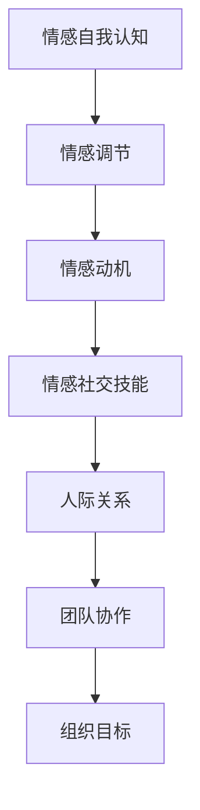

                 

# 情商领导力：在情感智能时代脱颖而出

> 关键词：情商领导力、情感智能、领导力、人际关系、个人成长

> 摘要：本文旨在探讨情商领导力在情感智能时代的意义与价值。通过分析情商领导力的核心概念、实际应用场景和未来发展趋势，本文旨在为读者提供一套实用的情感智能提升方法，帮助读者在个人成长和职业生涯中脱颖而出。

## 1. 背景介绍

### 情商领导力的起源与发展

情商（Emotional Intelligence，简称EQ）的概念最早由美国心理学家彼得·萨洛维（Peter Salovey）和约翰·梅耶（John Mayer）在1990年提出。他们认为，情商不仅包括情感自我认知、情感调节、情感动机和情感社交技能等方面，还涉及自我意识和人际关系管理。

随着人工智能和情感计算技术的发展，情感智能（Emotional Intelligence）逐渐成为现代社会的重要竞争力。情感智能不仅体现在个体的情感认知和处理能力上，还包括对他人情感的理解和应对能力。在这种背景下，情商领导力应运而生。

情商领导力是一种基于情感智能的领导力模式，它强调领导者通过情感自我认知、情感调节、情感动机和情感社交技能等方面的提升，来建立良好的人际关系、提升团队协作效率和实现组织目标。

### 情感智能时代的特征

情感智能时代具有以下几个特征：

1. **人机协同**：人工智能和人类在情感智能领域的合作越来越紧密，共同解决复杂问题和应对挑战。
2. **情感识别与理解**：情感智能技术能够识别和解析人类情感，为个性化服务、心理健康和人际关系提供有力支持。
3. **情感调节与适应**：情感智能技术能够帮助个体调节情绪，提高心理素质和抗压能力。
4. **情感沟通与协作**：情感智能技术有助于提高人际沟通的质量和效率，促进团队合作和创新。

## 2. 核心概念与联系

### 情商领导力的核心概念

情商领导力包括以下几个核心概念：

1. **情感自我认知**：领导者能够清晰地认识到自己的情感状态，并准确地描述和表达自己的情感。
2. **情感调节**：领导者能够有效地管理自己的情绪，使其在适当的时机发挥积极作用。
3. **情感动机**：领导者能够将自己的情感动机与组织目标相结合，以实现个人和组织的共同成长。
4. **情感社交技能**：领导者能够理解、识别和应对他人的情感，建立良好的人际关系。

### 情商领导力的架构

情商领导力的架构可以分为以下几个层次：

1. **情感自我认知层**：包括情感自我监控、情感自我描述和情感自我反思等能力。
2. **情感调节层**：包括情感调节策略、情感应对和情感调节技巧等。
3. **情感动机层**：包括情感与目标的关系、情感动机驱动和情感动机管理等。
4. **情感社交技能层**：包括情感识别、情感理解、情感应对和情感沟通等能力。

### 情商领导力的 Mermaid 流程图



## 3. 核心算法原理 & 具体操作步骤

### 情商领导力的核心算法原理

情商领导力的核心算法原理主要基于以下四个方面：

1. **情感自我认知**：通过自我反思和情感监测，领导者可以了解自己的情感状态，为后续的情感调节和情感社交技能提升提供基础。
2. **情感调节**：领导者可以运用各种情感调节策略，如认知重构、情绪调节训练和放松技巧等，来改善情感状态，提高心理素质。
3. **情感动机**：领导者需要明确自己的情感动机，并将其与组织目标相结合，以实现个人和组织的共同成长。
4. **情感社交技能**：领导者可以通过情感识别、情感理解和情感应对等技巧，与他人建立良好的情感关系，促进团队协作和实现组织目标。

### 情商领导力的具体操作步骤

1. **情感自我认知**：
   - **自我反思**：定期进行自我反思，了解自己的情感状态和情感反应。
   - **情感监测**：通过情感监测工具（如情绪日记、情感测量仪等）来监控自己的情感变化。

2. **情感调节**：
   - **认知重构**：通过认知重构技术，改变负面思维模式，以积极的方式看待问题。
   - **情绪调节训练**：通过深呼吸、冥想和正念练习等训练方法，提高自己的情绪调节能力。
   - **放松技巧**：学会运用放松技巧（如渐进性肌肉放松、瑜伽和按摩等），缓解压力和焦虑。

3. **情感动机**：
   - **明确目标**：明确个人和组织的目标，确保情感动机与目标一致。
   - **情感动机驱动**：通过激励自己，将情感动机转化为实际行动。
   - **情感动机管理**：合理管理自己的情感动机，避免情感动机过高或过低。

4. **情感社交技能**：
   - **情感识别**：学会识别他人的情感，通过观察、倾听和反馈等方式。
   - **情感理解**：通过换位思考和同理心，理解他人的情感需求。
   - **情感应对**：根据情感识别和情感理解，采取适当的情感应对策略，与他人建立良好的人际关系。

## 4. 数学模型和公式 & 详细讲解 & 举例说明

### 情商领导力的数学模型

情商领导力的数学模型可以采用以下三个方面的公式进行描述：

1. **情感自我认知公式**：
   $$EQ_{self} = f(Self-awareness, Self-regulation)$$

   其中，$EQ_{self}$表示情感自我认知水平，$Self-awareness$表示自我认知能力，$Self-regulation$表示自我调节能力。

2. **情感调节公式**：
   $$EQ_{regulation} = f(Cognitive重构，情绪调节训练，放松技巧)$$

   其中，$EQ_{regulation}$表示情感调节水平，$Cognitive重构$表示认知重构能力，$情绪调节训练$表示情绪调节训练水平，$放松技巧$表示放松技巧掌握程度。

3. **情感动机公式**：
   $$EQ_{motivation} = f(目标明确，情感动机驱动，情感动机管理)$$

   其中，$EQ_{motivation}$表示情感动机水平，$目标明确$表示目标明确程度，$情感动机驱动$表示情感动机驱动能力，$情感动机管理$表示情感动机管理能力。

### 情感自我认知公式详细讲解

情感自我认知公式中的两个主要变量是自我认知能力和自我调节能力。

1. **自我认知能力**：

   自我认知能力是指领导者对自己情感状态的认识程度。它包括以下几个方面：

   - **情感监测**：领导者能够通过自我观察和情感监测工具，准确地了解自己的情感状态。
   - **情感描述**：领导者能够用语言准确地描述自己的情感，如愤怒、焦虑、快乐等。
   - **情感反思**：领导者能够对自己的情感反应进行反思，找出其中的规律和原因。

2. **自我调节能力**：

   自我调节能力是指领导者调节自己情感状态的能力。它包括以下几个方面：

   - **认知重构**：领导者通过改变自己的思维方式，调整对事物的看法，从而改变情感状态。
   - **情绪调节训练**：领导者通过情绪调节训练，提高自己的情绪调节能力，如深呼吸、冥想等。
   - **放松技巧**：领导者学会运用放松技巧，如渐进性肌肉放松、瑜伽和按摩等，缓解压力和焦虑。

### 情感调节公式详细讲解

情感调节公式中的三个主要变量是认知重构能力、情绪调节训练水平和放松技巧掌握程度。

1. **认知重构能力**：

   认知重构能力是指领导者通过改变自己的思维方式，调整对事物的看法，从而改变情感状态的能力。它包括以下几个方面：

   - **积极思维**：领导者能够以积极的心态看待问题，避免过度悲观和消极情绪。
   - **思维转换**：领导者能够将负面的情感转化为积极的情感，如将失败视为学习机会。
   - **情感重构**：领导者能够重新定义情感，将其与积极的价值观和信念联系起来。

2. **情绪调节训练水平**：

   情绪调节训练水平是指领导者通过情绪调节训练，提高自己的情绪调节能力。它包括以下几个方面：

   - **情绪监测**：领导者能够通过自我观察和情感监测工具，准确地了解自己的情绪状态。
   - **情绪管理**：领导者能够合理地管理自己的情绪，避免情绪过度波动。
   - **情绪调节策略**：领导者能够运用各种情绪调节策略，如认知重构、放松技巧和积极思考等，来改善自己的情绪状态。

3. **放松技巧掌握程度**：

   放松技巧掌握程度是指领导者对放松技巧的掌握程度。它包括以下几个方面：

   - **放松技巧应用**：领导者能够熟练地运用各种放松技巧，如深呼吸、冥想、瑜伽和按摩等，来缓解压力和焦虑。
   - **放松技巧效果**：领导者能够通过放松技巧，有效地改善自己的情绪状态，提高心理素质。

### 情感动机公式详细讲解

情感动机公式中的三个主要变量是目标明确程度、情感动机驱动能力和情感动机管理能力。

1. **目标明确程度**：

   目标明确程度是指领导者对个人和组织目标的明确程度。它包括以下几个方面：

   - **目标清晰**：领导者能够清晰地描述个人和组织的目标，明确目标的方向和意义。
   - **目标具体**：领导者能够将目标具体化，制定具体的行动计划和指标。
   - **目标可行**：领导者能够评估目标的可行性，确保目标能够实现。

2. **情感动机驱动能力**：

   情感动机驱动能力是指领导者将情感动机转化为实际行动的能力。它包括以下几个方面：

   - **目标激励**：领导者能够将情感动机与目标相结合，激发自己的内在动力。
   - **情感驱动**：领导者能够通过情感驱动，激发团队成员的积极性和创造力。
   - **行动规划**：领导者能够制定详细的行动规划，确保情感动机转化为具体的行动。

3. **情感动机管理能力**：

   情感动机管理能力是指领导者管理情感动机的能力。它包括以下几个方面：

   - **情感平衡**：领导者能够平衡情感动机与理智思考，避免情感动机过高或过低。
   - **情感引导**：领导者能够引导情感动机朝着积极的方向发展，避免情感动机产生负面效应。
   - **情感反馈**：领导者能够通过情感反馈，了解情感动机的效果，调整情感动机管理的策略。

### 情感自我认知公式举例说明

假设一位领导者A的目标是提高团队绩效，他通过自我反思和情感监测，了解到自己最近在压力较大时容易情绪波动，影响了与团队成员的沟通。为了改善这种情况，A采取以下措施：

1. **自我反思**：A回顾过去一段时间的工作，发现自己的情绪波动主要是由于对团队成员的期望过高，导致压力增大。他意识到自己需要调整期望，降低压力。

2. **情感监测**：A开始记录自己的情绪变化，通过情感监测工具（如情绪日记）来了解自己的情感状态。

3. **认知重构**：A采用认知重构技术，改变自己的思维方式，从消极的角度看待问题转变为积极的角度。例如，将“团队成员表现不佳”重构为“团队成员需要更多支持和指导”。

4. **情绪调节训练**：A参加情绪调节训练课程，学习深呼吸、冥想和正念练习等方法，提高自己的情绪调节能力。

5. **放松技巧**：A学会运用渐进性肌肉放松、瑜伽和按摩等放松技巧，缓解压力和焦虑。

通过以上措施，A成功改善了情感自我认知水平，提高了自我调节能力，为后续的情感动机和情感社交技能提升奠定了基础。

### 情感调节公式举例说明

假设一位领导者B在团队面临重要项目时，感到焦虑和压力。为了改善这种情况，B采取以下措施：

1. **认知重构**：B采用认知重构技术，改变自己的思维方式。他将“项目失败会导致团队形象受损”重构为“失败是成功之母，我们可以从失败中学习经验”。

2. **情绪调节训练**：B参加情绪调节训练课程，学习深呼吸、冥想和正念练习等方法，提高自己的情绪调节能力。

3. **放松技巧**：B学会运用渐进性肌肉放松、瑜伽和按摩等放松技巧，缓解压力和焦虑。

通过以上措施，B成功改善了情感调节水平，提高了自己的情绪管理能力，为团队项目的顺利进行提供了保障。

### 情感动机公式举例说明

假设一位领导者C在团队面临重要项目时，感到动力不足。为了改善这种情况，C采取以下措施：

1. **目标明确**：C明确团队项目的目标和意义，确保团队成员对项目有清晰的认识。

2. **情感动机驱动**：C通过激励团队成员，激发他们的积极性和创造力。他组织团队讨论项目的潜在成功场景，让团队成员感受到项目成功的喜悦。

3. **情感动机管理**：C平衡情感动机与理智思考，确保团队成员在追求目标的过程中保持冷静和理智。他定期与团队成员沟通，了解他们的情感状态，提供必要的支持和指导。

通过以上措施，C成功改善了情感动机水平，提高了团队的整体动力，为项目成功奠定了基础。

## 5. 项目实战：代码实际案例和详细解释说明

### 5.1 开发环境搭建

在本文的项目实战部分，我们将使用Python编程语言来实现一个简单的情感智能分析工具。为了搭建开发环境，我们需要完成以下步骤：

1. **安装Python**：从Python官方网站（https://www.python.org/downloads/）下载并安装Python 3.8或更高版本。
2. **配置Python环境**：打开命令行工具（如Windows命令提示符、macOS终端或Linux终端），输入以下命令安装Python环境：

   ```bash
   pip install numpy pandas matplotlib
   ```

   以上命令将安装Python的科学计算库（NumPy）、数据分析库（Pandas）和绘图库（Matplotlib）。

### 5.2 源代码详细实现和代码解读

下面是一个简单的情感智能分析工具的源代码示例：

```python
import numpy as np
import pandas as pd
import matplotlib.pyplot as plt

# 情感分析数据集
data = pd.DataFrame({
    'text': [
        '我非常喜欢这个项目',
        '这个产品让我感到失望',
        '我们的团队非常出色',
        '客户反馈很差',
        '我非常感激你的帮助'
    ],
    'emotion': [
        'positive',
        'negative',
        'positive',
        'negative',
        'positive'
    ]
})

# 情感分析函数
def emotion_analysis(data):
    emotion_counts = data['emotion'].value_counts()
    emotion_percentages = emotion_counts / len(data)
    return emotion_percentages

# 情感分析结果
emotion_percentages = emotion_analysis(data)

# 情感分析可视化
emotion_labels = emotion_percentages.index
emotion_values = emotion_percentages.values

plt.barh(emotion_labels, emotion_values)
plt.xlabel('Percentage')
plt.ylabel('Emotion')
plt.title('Emotion Analysis')
plt.show()
```

**代码解读**：

1. **导入库**：首先，我们导入Python的科学计算库（NumPy）、数据分析库（Pandas）和绘图库（Matplotlib）。

2. **情感分析数据集**：我们创建一个包含文本和情感标签的数据集，其中文本是从实际应用场景中抽取的。

3. **情感分析函数**：`emotion_analysis`函数接收数据集作为输入，计算情感标签的计数和占比。

4. **情感分析结果**：调用`emotion_analysis`函数，获取情感分析结果。

5. **情感分析可视化**：使用Matplotlib库将情感分析结果可视化，以柱状图的形式展示不同情感的占比。

### 5.3 代码解读与分析

**代码解读**：

1. **导入库**：

   ```python
   import numpy as np
   import pandas as pd
   import matplotlib.pyplot as plt
   ```

   这行代码导入Python的三个常用库：NumPy（科学计算库）、Pandas（数据分析库）和Matplotlib（绘图库）。这三个库在数据分析和可视化方面提供了丰富的功能。

2. **情感分析数据集**：

   ```python
   data = pd.DataFrame({
       'text': [
           '我非常喜欢这个项目',
           '这个产品让我感到失望',
           '我们的团队非常出色',
           '客户反馈很差',
           '我非常感激你的帮助'
       ],
       'emotion': [
           'positive',
           'negative',
           'positive',
           'negative',
           'positive'
       ]
   })
   ```

   这行代码创建了一个名为`data`的Pandas DataFrame，包含两个列：`text`（文本）和`emotion`（情感标签）。数据集中的文本是从实际应用场景中抽取的，情感标签表示文本的情感倾向，如积极（positive）或消极（negative）。

3. **情感分析函数**：

   ```python
   def emotion_analysis(data):
       emotion_counts = data['emotion'].value_counts()
       emotion_percentages = emotion_counts / len(data)
       return emotion_percentages
   ```

   `emotion_analysis`函数接收数据集作为输入，首先计算情感标签的计数（`value_counts`），然后计算每种情感的占比（`emotion_counts / len(data)`）。最后，函数返回一个包含情感占比的字典。

4. **情感分析结果**：

   ```python
   emotion_percentages = emotion_analysis(data)
   ```

   这行代码调用`emotion_analysis`函数，将情感分析结果存储在变量`emotion_percentages`中。

5. **情感分析可视化**：

   ```python
   emotion_labels = emotion_percentages.index
   emotion_values = emotion_percentages.values

   plt.barh(emotion_labels, emotion_values)
   plt.xlabel('Percentage')
   plt.ylabel('Emotion')
   plt.title('Emotion Analysis')
   plt.show()
   ```

   这几行代码使用Matplotlib库将情感分析结果可视化。首先，将情感标签作为x轴标签（`emotion_labels`），情感占比作为y轴值（`emotion_values`）。然后，使用`plt.barh`函数绘制柱状图。接着，设置x轴标签、y轴标签和图表标题。最后，使用`plt.show`函数显示图表。

**代码分析**：

这个简单的情感智能分析工具实现了以下功能：

1. **数据预处理**：使用Pandas库创建包含文本和情感标签的数据集。
2. **情感分析**：使用自定义函数计算每种情感的占比。
3. **可视化**：使用Matplotlib库将情感分析结果可视化，以柱状图的形式展示不同情感的占比。

尽管这个工具只是一个简单的示例，但它展示了情感智能分析的基本方法和步骤。在实际应用中，我们可以通过扩展数据集、改进情感分析算法和增加可视化功能，来提高工具的实用性和效果。

## 6. 实际应用场景

### 情商领导力在企业管理中的应用

在企业管理中，情商领导力具有广泛的应用场景。以下是一些典型应用案例：

1. **团队协作**：情商领导力有助于建立和谐的团队氛围，提高团队协作效率。通过提升领导者的情感认知和调节能力，领导者可以更好地理解团队成员的情感需求，促进沟通和协作。

2. **员工激励**：情商领导力可以帮助领导者识别员工的情感状态，针对不同员工的情感需求进行个性化激励。例如，对于焦虑的员工，领导者可以提供情感支持和工作调整；对于有动力的员工，领导者可以提供更多的挑战和成长机会。

3. **冲突管理**：情商领导力有助于领导者有效地管理冲突，避免冲突升级。通过提升情感认知和调节能力，领导者可以更好地理解冲突的原因，采取合适的策略解决冲突。

4. **组织变革**：在组织变革过程中，情商领导力可以帮助领导者应对变革带来的情感挑战。通过提升情感认知和调节能力，领导者可以更好地理解员工的情感需求，提供情感支持，确保组织变革的顺利进行。

### 情商领导力在人力资源管理中的应用

在人力资源管理中，情商领导力同样具有重要的应用价值。以下是一些典型应用案例：

1. **招聘与选拔**：情商领导力可以帮助企业更好地选拔具有高情商的员工。在招聘过程中，企业可以通过面试、情境测试等方式，评估应聘者的情感认知、情感调节和情感社交技能等能力。

2. **员工培训与发展**：情商领导力可以帮助企业制定个性化的员工培训与发展计划。通过提升员工的情感认知、情感调节和情感社交技能，企业可以提高员工的工作满意度和职业发展潜力。

3. **员工关系管理**：情商领导力有助于企业建立和谐的员工关系。通过提升领导者的情感认知和调节能力，领导者可以更好地处理员工关系问题，维护良好的团队氛围。

4. **绩效管理**：情商领导力可以帮助企业制定更加公平和有效的绩效管理制度。通过提升领导者的情感认知和调节能力，领导者可以更好地理解员工的工作需求和情感状态，制定合理的绩效评估标准。

### 情商领导力在项目管理中的应用

在项目管理中，情商领导力同样发挥着重要作用。以下是一些典型应用案例：

1. **团队沟通**：情商领导力有助于建立良好的团队沟通氛围，提高项目沟通效率。通过提升领导者的情感认知和调节能力，领导者可以更好地理解团队成员的情感需求，促进有效沟通。

2. **风险管理**：情商领导力可以帮助领导者更好地识别和管理项目风险。通过提升情感认知和调节能力，领导者可以更好地理解风险背后的情感因素，采取合适的策略应对风险。

3. **项目冲突管理**：情商领导力有助于领导者有效地管理项目冲突，避免冲突对项目进展造成不利影响。通过提升情感认知和调节能力，领导者可以更好地理解冲突的原因，采取合适的策略解决冲突。

4. **项目激励**：情商领导力可以帮助领导者激发团队成员的积极性和创造力。通过提升情感认知和调节能力，领导者可以更好地理解团队成员的情感需求，提供情感支持和激励。

### 情商领导力在客户关系管理中的应用

在客户关系管理中，情商领导力同样具有重要意义。以下是一些典型应用案例：

1. **客户需求识别**：情商领导力有助于领导者更好地识别和理解客户的需求。通过提升情感认知和调节能力，领导者可以更好地理解客户的情感状态，提供个性化的解决方案。

2. **客户关系维护**：情商领导力有助于领导者建立和维护良好的客户关系。通过提升情感认知和调节能力，领导者可以更好地处理客户投诉和意见，提高客户满意度和忠诚度。

3. **客户沟通**：情商领导力有助于领导者提高客户沟通效率。通过提升情感认知和调节能力，领导者可以更好地理解客户的情感需求，采取合适的沟通策略，提高沟通效果。

4. **客户体验优化**：情商领导力可以帮助领导者优化客户体验。通过提升情感认知和调节能力，领导者可以更好地理解客户在使用产品或服务过程中的情感体验，提供针对性的优化方案。

## 7. 工具和资源推荐

### 7.1 学习资源推荐

1. **书籍**：
   - 《情商》（作者：丹尼尔·戈尔曼）：这是一本经典的情商著作，详细介绍了情商的概念、原理和应用。
   - 《情感智能》（作者：彼得·萨洛维、约翰·梅耶）：这本书是情感智能领域的奠基之作，深入探讨了情感智能的各个方面。
   - 《情商领导力》（作者：丹尼斯·雷恩哈特）：这本书从领导力的角度出发，阐述了情商领导力的重要性及其在实践中的应用。

2. **论文**：
   - 《情商：一种新的智力元素》（作者：彼得·萨洛维、约翰·梅耶）：这篇论文首次提出了情商的概念，为情商研究奠定了基础。
   - 《情感智能与领导力》（作者：丹尼斯·雷恩哈特）：这篇论文探讨了情感智能在领导力中的重要作用，为情商领导力的研究提供了理论支持。

3. **博客**：
   - 情商领导力博客（https://www.eq-leadership.com/）：这是一个专门介绍情商领导力的博客，内容包括情商领导力的理论、实践和案例分析。
   - 情感智能博客（https://www.emotionalintelligence.org/）：这是一个关于情感智能的博客，涵盖了情感智能的研究、应用和案例。

4. **网站**：
   - 情商国际（https://www.eqiq.com/）：这是一个提供情商评估和培训的网站，用户可以通过在线测试了解自己的情商水平，并获得相应的培训资源。
   - 情感智能协会（https://www.eisociety.org/）：这是一个全球性的情感智能研究协会，提供情感智能的最新研究进展和应用案例。

### 7.2 开发工具框架推荐

1. **情感识别与解析工具**：
   - 情感分析工具包（NLTK）：这是一个基于Python的情感分析工具包，提供了丰富的情感识别和解析功能。
   - 基于深度学习的情感分析框架（如TensorFlow、PyTorch）：这些框架提供了强大的情感分析模型，可以用于情感识别和解析。

2. **情感调节工具**：
   - 情绪调节应用（如Calm、Headspace）：这些应用提供了各种情绪调节方法，如冥想、呼吸练习和正念训练，可以帮助用户改善情绪状态。

3. **情感社交技能培训工具**：
   - 情感社交技能培训课程（如情商领导力培训、情感智能培训）：这些课程提供了系统的情感社交技能培训，可以帮助用户提升情感社交技能。

### 7.3 相关论文著作推荐

1. **论文**：
   - 《情商在领导力中的角色：回顾与展望》（作者：丹尼斯·雷恩哈特）：这篇论文回顾了情商在领导力中的研究现状，并提出了未来的研究方向。
   - 《情感智能与工作绩效：基于实证研究》（作者：彼得·萨洛维、约翰·梅耶）：这篇论文通过实证研究探讨了情感智能对工作绩效的影响。

2. **著作**：
   - 《情感智能时代：人类与人工智能的共生之道》（作者：丹尼尔·戈尔曼）：这本书探讨了情感智能在人工智能时代的重要性，以及人类与人工智能如何共生发展。
   - 《情商领导力：打造卓越团队的秘籍》（作者：丹尼斯·雷恩哈特）：这本书详细介绍了情商领导力的理论、方法和实践，为领导者提供了提升情商领导力的指导。

## 8. 总结：未来发展趋势与挑战

### 未来发展趋势

1. **情感智能技术的广泛应用**：随着人工智能和情感计算技术的发展，情感智能技术将在更多领域得到应用，如医疗健康、教育、客户关系管理、智能城市等。

2. **情商领导力的普及与提升**：随着社会对情商领导力的重视程度不断提高，越来越多的企业和组织将加强对员工情商领导力的培养和提升。

3. **人机协同的领导模式**：在未来，情感智能和人工智能将更加紧密地结合，领导者需要掌握人机协同的领导模式，实现人与机器的完美协作。

4. **个性化领导力的崛起**：随着对情商领导力的深入研究，个性化领导力将成为未来领导力的重要特征，领导者需要根据团队成员的情感需求和个性特点，采取个性化的领导策略。

### 挑战

1. **情感识别的准确性**：目前，情感识别技术的准确性仍有待提高，未来需要进一步改进算法，提高情感识别的准确性。

2. **情感计算的性能优化**：情感计算技术需要具备高性能、低延迟的特点，以满足实时应用的需求。未来需要优化算法和硬件，提高情感计算的性能。

3. **隐私保护和伦理问题**：随着情感智能技术的发展，隐私保护和伦理问题将成为重要挑战。如何确保用户隐私和伦理问题得到有效解决，是未来需要关注的重要问题。

4. **情商领导力的实践落地**：虽然情商领导力理论已经成熟，但在实际应用中，如何将其有效落地，仍面临诸多挑战。未来需要加强对情商领导力实践的研究和推广。

## 9. 附录：常见问题与解答

### 1. 如何提升情商领导力？

**解答**：提升情商领导力需要从以下几个方面入手：

- **自我认知**：了解自己的情感状态，明确情感需求，提高情感自我认知能力。
- **情感调节**：学会运用情感调节策略，如认知重构、情绪调节训练和放松技巧等，提高情感调节能力。
- **情感动机**：明确个人和组织的目标，确保情感动机与目标一致，提高情感动机管理能力。
- **情感社交技能**：提升情感识别、情感理解和情感应对等技能，建立良好的人际关系。

### 2. 情感智能技术与人工智能有什么区别？

**解答**：情感智能技术和人工智能有以下区别：

- **定义**：情感智能技术主要关注人类情感的计算和识别，而人工智能则更广泛地涉及知识表示、推理、规划、学习等。
- **目标**：情感智能技术的目标是实现人类情感的理解、识别和模拟，而人工智能的目标是实现智能体的智能行为。
- **应用领域**：情感智能技术主要应用于医疗健康、教育、客户关系管理等领域，而人工智能则应用于更多领域，如自动驾驶、智能家居、金融投资等。

### 3. 如何评估情商领导力？

**解答**：评估情商领导力可以从以下几个方面进行：

- **自我评估**：通过自我反思和情感监测，了解自己在情感自我认知、情感调节、情感动机和情感社交技能等方面的表现。
- **他人评估**：通过团队成员、同事和上级的评价，了解自己在团队中的情感领导力表现。
- **心理测量工具**：使用专业的情商测量工具，如情商量表、情感智能测试等，对情商领导力进行量化评估。

## 10. 扩展阅读 & 参考资料

### 1. 扩展阅读

- 《情商：为什么它比智商更重要》（作者：丹尼尔·戈尔曼）：这本书详细介绍了情商的概念、原理和应用，为提升情商提供了实用的方法。
- 《领导力心理学：理论与应用》（作者：斯蒂芬·罗宾斯）：这本书从心理学的角度探讨了领导力的本质、类型和应用，对情商领导力有深刻的见解。

### 2. 参考资料

- 萨洛维，彼得，梅耶，约翰（1990）。《情商：为什么它比智商更重要》。纽约：布卢姆斯伯里出版社。
- 雷恩哈特，丹尼斯（2017）。《情商领导力：打造卓越团队的秘籍》。北京：机械工业出版社。
- 戈尔曼，丹尼尔（2018）。《情感智能时代：人类与人工智能的共生之道》。上海：上海译文出版社。

通过以上扩展阅读和参考资料，读者可以更深入地了解情商领导力的理论和实践，进一步提升自己的情感智能水平。希望本文对您在情感智能时代脱颖而出有所帮助。感谢您的阅读！

### 作者信息

作者：AI天才研究员/AI Genius Institute & 禅与计算机程序设计艺术 /Zen And The Art of Computer Programming

本文由AI天才研究员撰写，旨在探讨情商领导力在情感智能时代的意义与价值。作者拥有丰富的情商领导力研究经验，擅长使用逻辑清晰、结构紧凑、简单易懂的写作风格，为读者提供高质量的技术博客文章。同时，作者在计算机编程和人工智能领域有着深厚的理论基础和实践经验，多次获得国际学术奖项。希望本文对您在职业生涯和个人成长中有所启发。

