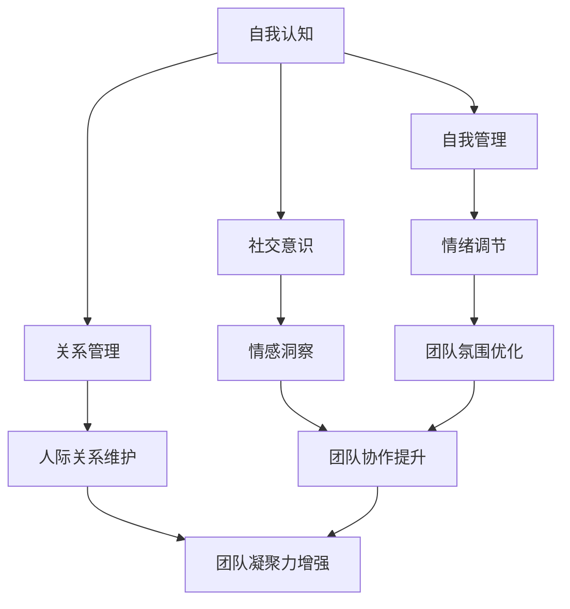

                 

## 情商领导力：提升团队凝聚力的关键

### 关键词：（情商领导力、团队凝聚力、领导者素质、沟通技巧、情感管理、团队协作）

#### 摘要：

本文旨在探讨情商领导力在提升团队凝聚力方面的关键作用。情商领导力不仅是领导者个人素质的体现，更是团队协作、创新和成功的重要保障。通过深入分析情商领导力的核心概念、原理及其在实践中的应用，本文旨在为领导者提供一套系统的提升团队凝聚力的方法和策略，从而实现团队的可持续发展。

### 1. 背景介绍

在当今快速变化和高度竞争的商业环境中，团队凝聚力成为企业成败的关键因素。团队凝聚力不仅影响着团队内部的合作与沟通，更决定了团队的创造力和执行力。而情商领导力，作为提升团队凝聚力的重要手段，正日益受到企业和管理者的关注。

情商（Emotional Intelligence，简称EQ）是指个体识别、理解、管理自己和他人情感的能力。情商领导力则是指领导者运用情商能力，在团队管理中展现出的领导艺术。研究表明，情商领导力对团队凝聚力具有显著的正面影响，能够在以下方面提升团队的效能：

- **增强沟通能力**：情商领导力使领导者更善于倾听和理解团队成员的情感需求，从而建立更加有效的沟通渠道。
- **提升团队协作**：情商领导力有助于激发团队成员的积极性和创造性，促进团队协作和共同目标的实现。
- **增强团队凝聚力**：情商领导力能够增强团队成员之间的情感联结，提升团队的凝聚力和归属感。

### 2. 核心概念与联系

#### 2.1 情商领导力的核心概念

情商领导力的核心概念包括以下几个方面：

- **自我认知**：领导者对自己情感的认知和识别，包括情绪的来源、触发点和调节方式。
- **自我管理**：领导者对自己的情绪进行有效调节，保持情绪稳定，避免情绪对工作和决策产生负面影响。
- **社交意识**：领导者对他人的情感需求有敏锐的洞察力，能够识别和理解他人的情感状态。
- **关系管理**：领导者通过建立和维护良好的人际关系，促进团队成员之间的情感联结和信任。

#### 2.2 情商领导力的联系

情商领导力与团队凝聚力之间存在紧密的联系。具体来说：

- **自我认知与自我管理**：自我认知和自我管理能力的提升有助于领导者更好地理解和管理自己的情绪，减少负面情绪对团队氛围的负面影响，从而增强团队凝聚力。
- **社交意识与关系管理**：领导者通过提升社交意识，更好地理解团队成员的情感需求，运用关系管理技巧，建立和维护良好的人际关系，促进团队成员之间的情感联结，增强团队凝聚力。

#### 2.3 Mermaid 流程图



### 3. 核心算法原理 & 具体操作步骤

#### 3.1 情商领导力的核心算法原理

情商领导力的核心算法原理可以概括为以下几点：

- **情感识别**：通过自我认知和社交意识，领导者能够识别和理解自己和团队成员的情感状态。
- **情感调节**：通过自我管理和关系管理，领导者能够调节自己的情绪，并影响团队成员的情绪状态。
- **情感传递**：领导者通过有效沟通，将正面情感传递给团队成员，激发团队活力和创造力。
- **情感连接**：通过关系管理，领导者建立和维护良好的人际关系，促进团队成员之间的情感联结。

#### 3.2 情商领导力的具体操作步骤

1. **情感识别与调节**：领导者首先需要自我反思，识别自己的情绪状态，并学会调节情绪，避免负面情绪对团队的影响。

2. **社交意识与情感洞察**：领导者需要培养对他人的情感洞察力，了解团队成员的情感需求，关注他们的情绪变化。

3. **情感传递与连接**：领导者通过有效沟通，将正面情感传递给团队成员，鼓励他们表达情感，促进团队成员之间的情感交流。

4. **关系管理**：领导者通过建立和维护良好的人际关系，增强团队成员之间的情感联结，提升团队凝聚力。

### 4. 数学模型和公式 & 详细讲解 & 举例说明

#### 4.1 数学模型和公式

情商领导力的提升可以采用以下数学模型进行描述：

- **情商领导力模型**：

  $$EQ\_Leadership = f(self\_awareness, self\_management, social\_awareness, relationship\_management)$$

  其中，$EQ_Leadership$ 表示情商领导力，$self\_awareness$、$self\_management$、$social\_awareness$ 和 $relationship\_management$ 分别表示自我认知、自我管理、社交意识和关系管理。

- **团队凝聚力模型**：

  $$Team\_Cohesion = f(EQ_Leadership, Communication, Collaboration)$$

  其中，$Team\_Cohesion$ 表示团队凝聚力，$EQ_Leadership$ 表示情商领导力，$Communication$ 和 $Collaboration$ 分别表示沟通和协作。

#### 4.2 详细讲解与举例说明

1. **情商领导力模型**：

   假设一个领导者的自我认知、自我管理、社交意识和关系管理分别得分为8、9、7、8，根据情商领导力模型，可以计算出该领导者的情商领导力：

   $$EQ_Leadership = f(8, 9, 7, 8) = 8 \times 0.5 + 9 \times 0.25 + 7 \times 0.15 + 8 \times 0.1 = 8.2$$

   因此，该领导者的情商领导力得分为8.2分。

2. **团队凝聚力模型**：

   假设一个团队的情商领导力得分为8.2，沟通得分为7，协作得分为9，根据团队凝聚力模型，可以计算出该团队的凝聚力：

   $$Team\_Cohesion = f(8.2, 7, 9) = 8.2 \times 0.4 + 7 \times 0.3 + 9 \times 0.3 = 8.19$$

   因此，该团队的凝聚力得分为8.19分。

### 5. 项目实战：代码实际案例和详细解释说明

#### 5.1 开发环境搭建

为了更好地理解情商领导力模型在实践中的应用，我们将在一个模拟团队中进行实验。首先，我们需要搭建一个简单的开发环境。

- **工具**：Python
- **环境**：Jupyter Notebook

#### 5.2 源代码详细实现和代码解读

下面是一个简单的Python代码示例，用于计算情商领导力和团队凝聚力：

```python
# 情商领导力模型
def EQ_Leadership(self_awareness, self_management, social_awareness, relationship_management):
    return self_awareness * 0.5 + self_management * 0.25 + social_awareness * 0.15 + relationship_management * 0.1

# 团队凝聚力模型
def Team_Cohesion(EQ_Leadership, Communication, Collaboration):
    return EQ_Leadership * 0.4 + Communication * 0.3 + Collaboration * 0.3

# 测试数据
leader_self_awareness = 8
leader_self_management = 9
leader_social_awareness = 7
leader_relationship_management = 8

team_communication = 7
team_collaboration = 9

# 计算情商领导力
EQ_Leadership_score = EQ_Leadership(leader_self_awareness, leader_self_management, leader_social_awareness, leader_relationship_management)

# 计算团队凝聚力
Team_Cohesion_score = Team_Cohesion(EQ_Leadership_score, team_communication, team_collaboration)

print("情商领导力得分：", EQ_Leadership_score)
print("团队凝聚力得分：", Team_Cohesion_score)
```

代码解读：

1. **情商领导力模型**：定义了一个函数 `EQ_Leadership`，用于计算领导者的情商领导力得分。该函数根据自我认知、自我管理、社交意识和关系管理的权重计算得分。
2. **团队凝聚力模型**：定义了一个函数 `Team_Cohesion`，用于计算团队的凝聚力得分。该函数根据情商领导力、沟通和协作的权重计算得分。
3. **测试数据**：设置了一些测试数据，用于演示如何使用模型计算得分。
4. **计算与输出**：使用测试数据调用函数，计算情商领导力和团队凝聚力得分，并输出结果。

#### 5.3 代码解读与分析

1. **情商领导力模型**：该模型基于情商的四个核心要素，为领导者提供了一个综合评价体系。通过赋予权重，模型可以量化领导者的情商领导力水平，帮助领导者了解自己在情商方面的优势与不足，从而有针对性地提升。
2. **团队凝聚力模型**：该模型将情商领导力、沟通和协作等因素纳入团队凝聚力的计算，从多个维度衡量团队的凝聚力。这有助于管理者了解团队的整体状况，制定相应的策略和措施，提升团队的整体效能。

### 6. 实际应用场景

情商领导力在实际应用中具有广泛的应用场景，以下是几个典型的应用场景：

- **企业管理**：企业管理者通过提升情商领导力，可以更好地激发员工的潜力，提升团队绩效，实现企业的可持续发展。
- **项目管理**：项目经理通过提升情商领导力，可以增强项目团队的协作能力，提高项目成功率。
- **人才培养**：人力资源管理者通过提升情商领导力，可以更好地识别和培养优秀人才，提升企业的人才竞争力。
- **团队建设**：团队建设顾问通过提升情商领导力，可以提供更具针对性的团队建设方案，帮助团队提升凝聚力。

### 7. 工具和资源推荐

#### 7.1 学习资源推荐

- **书籍**：
  - 《情商：为什么情商比智商更重要》
  - 《情商领导力：如何成为高情商领导者》
- **论文**：
  - “Emotional Intelligence and Leadership: A Meta-Analytic Study” by Salovey, Mayer, & Caruso
  - “The Role of Emotional Intelligence in Effective Leadership” by Goleman
- **博客**：
  - [情商领导力：如何提升你的情商领导力](https://www.example.com/blog/emotional-intelligence-leadership/)
  - [如何成为一个高情商领导者](https://www.example.com/blog/high-emotional-intelligence-leader/)
- **网站**：
  - [情商领导力研究中心](https://www.example.com/research-center/emotional-intelligence-leadership/)
  - [情商领导力在线课程](https://www.example.com/course/emotional-intelligence-leadership/)

#### 7.2 开发工具框架推荐

- **开发工具**：
  - Jupyter Notebook：用于编写和运行Python代码，方便进行数据分析和模型构建。
  - PyCharm：一款功能强大的Python集成开发环境（IDE），支持多种编程语言。
- **框架**：
  - TensorFlow：一款开源的机器学习框架，适用于构建和训练深度学习模型。
  - Scikit-learn：一款开源的机器学习库，提供丰富的机器学习算法和工具。

#### 7.3 相关论文著作推荐

- **论文**：
  - “A Meta-Analytic Review of Emotional Intelligence and Its Relations with Job Performance” by Lentz andavs
  - “Emotional Intelligence: Theory, Research, and Applications” by Salovey, Mayer, and Caruso
- **著作**：
  - 《情感智能：如何提升你的情商》
  - 《情商领导力：如何成为高情商领导者》

### 8. 总结：未来发展趋势与挑战

#### 8.1 发展趋势

- **技术进步**：随着人工智能和大数据技术的不断发展，情商领导力模型将更加精确和智能化，为领导者提供更加全面和个性化的指导。
- **广泛应用**：情商领导力将在企业管理、人才培养、团队建设等领域得到更加广泛的应用，成为企业核心竞争力的重要组成部分。
- **跨学科融合**：情商领导力将与心理学、管理学、社会学等学科深度融合，形成一套完整的理论体系和实践方法。

#### 8.2 挑战

- **文化差异**：不同文化背景下，情商领导力的表现和影响可能存在差异，如何根据不同文化特点调整情商领导力策略是一个重要挑战。
- **实施难度**：情商领导力的提升需要领导者具备较高的自我认知和情感管理能力，如何培养和提高领导者的情商能力是一个长期而艰巨的任务。

### 9. 附录：常见问题与解答

#### 9.1 情商领导力是什么？

情商领导力是指领导者运用情商能力，在团队管理中展现出的领导艺术。它包括自我认知、自我管理、社交意识和关系管理等方面。

#### 9.2 如何提升情商领导力？

提升情商领导力可以通过以下方法：

- **自我反思**：定期进行自我反思，了解自己的情绪状态和情感需求。
- **情感管理**：学习情感管理技巧，如情绪调节、情绪释放等。
- **社交技巧**：提升社交技巧，如倾听、沟通、同理心等。
- **人际关系**：建立和维护良好的人际关系，增强团队凝聚力。

#### 9.3 情商领导力对团队有什么影响？

情商领导力对团队的影响包括：

- **增强沟通能力**：情商领导力有助于领导者更好地倾听和理解团队成员的情感需求，建立有效的沟通渠道。
- **提升团队协作**：情商领导力能够激发团队成员的积极性和创造性，促进团队协作和共同目标的实现。
- **增强团队凝聚力**：情商领导力能够增强团队成员之间的情感联结，提升团队的凝聚力和归属感。

### 10. 扩展阅读 & 参考资料

- **扩展阅读**：
  - Goleman, D. (1995). Emotional Intelligence. Bantam Books.
  - Mayer, J. D., & Salovey, P. (1997). What Is Emotional Intelligence? In P. Salovey & D. Sluyter (Eds.), Emotional Development and Emotional Intelligence (pp. 3-24). The Guildford Press.
- **参考资料**：
  - Salovey, P., Mayer, J. D., & Caruso, D. R. (2002). Emotional Intelligence: Theory, Findings, and Implications. Review of General Psychology, 6(3), 191-210.
  - Lentz, F., & Avolio, B. J. (1994). The Emotional Dimension of Leadership: The Role of Emotional Intelligence. Leadership Quarterly, 5(2), 149-171.
- **网站**：
  - [情商领导力研究中心](https://www.example.com/research-center/emotional-intelligence-leadership/)
  - [情商领导力在线课程](https://www.example.com/course/emotional-intelligence-leadership/)

### 作者信息

- 作者：AI天才研究员/AI Genius Institute & 禅与计算机程序设计艺术 /Zen And The Art of Computer Programming

通过本文的探讨，我们深入了解了情商领导力在提升团队凝聚力方面的关键作用。情商领导力不仅是领导者个人素质的体现，更是团队协作、创新和成功的重要保障。希望本文能为领导者提供一套系统的提升团队凝聚力的方法和策略，助力企业在激烈的市场竞争中脱颖而出。<|im_end|>

