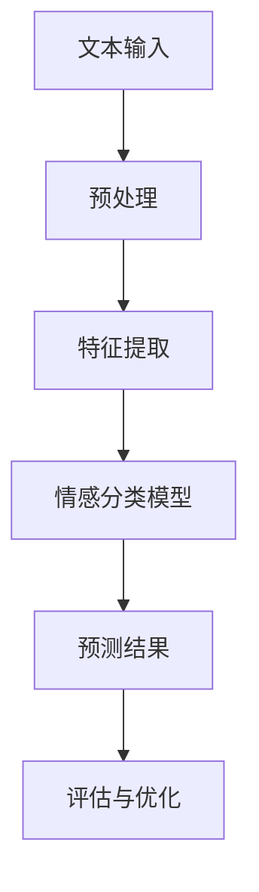

                 

# 情感分析技术：AI理解用户

> **关键词**：情感分析、自然语言处理、机器学习、文本分类、情感识别

> **摘要**：本文将深入探讨情感分析技术，解析其基本概念、核心算法原理以及实际应用场景。通过详细的数学模型和公式讲解，并结合实际代码案例，读者将了解如何使用人工智能技术来理解和分析用户情感，从而为开发更加智能化的应用程序提供理论基础和实战指导。

## 1. 背景介绍

### 1.1 情感分析的定义

情感分析（Sentiment Analysis），又称意见挖掘，是自然语言处理（NLP）领域中的一种重要技术。它的目标是自动识别和分类文本中的情感倾向，即判断文本是积极、消极还是中性。这一技术广泛应用于市场调研、社交媒体分析、客户反馈处理等多个领域。

### 1.2 情感分析的发展历程

情感分析技术起源于20世纪90年代，随着互联网的兴起和社交媒体的繁荣，情感分析逐渐成为NLP研究的热点。早期的情感分析主要依赖于规则方法，如正则表达式和关键字匹配。随后，机器学习技术的引入，尤其是深度学习的发展，使得情感分析精度得到了大幅提升。

### 1.3 情感分析的重要性

情感分析不仅可以帮助企业了解消费者情绪，优化产品和服务，还可以用于社交媒体监控，发现潜在的风险和问题。同时，情感分析技术在金融、医疗、教育等领域也有着广泛的应用前景。

## 2. 核心概念与联系

### 2.1 情感分类与标注

情感分类是情感分析的基础，常见的情感分类体系包括二分类（积极/消极）和多分类（积极/中性/消极）。标注数据是训练情感分析模型的关键，通过人工或半自动化的方式对大规模文本数据进行标注，以构建训练集。

### 2.2 文本特征提取

文本特征提取是将原始文本转换为机器可以理解的向量表示的过程。常见的方法包括词袋模型（Bag of Words, BOW）、TF-IDF（Term Frequency-Inverse Document Frequency）、Word2Vec（Word Embedding）等。

### 2.3 情感分析算法

情感分析算法可分为基于规则的方法和基于机器学习的方法。基于规则的方法主要依靠人工设计的规则来识别情感，如正则表达式和关键字匹配。基于机器学习的方法则利用训练数据，通过学习文本特征与情感标签之间的关系来进行预测。常见的算法包括朴素贝叶斯（Naive Bayes）、支持向量机（SVM）、决策树（Decision Tree）、随机森林（Random Forest）、神经网络（Neural Network）等。

### 2.4 Mermaid 流程图



## 3. 核心算法原理 & 具体操作步骤

### 3.1 朴素贝叶斯算法

朴素贝叶斯（Naive Bayes）是一种基于贝叶斯定理和特征条件独立假设的分类算法。其基本原理是通过计算每个类别的条件概率来预测文本的情感倾向。

#### 3.1.1 贝叶斯定理

贝叶斯定理描述了在某个事件已经发生的条件下，该事件发生的概率。公式如下：

$$P(A|B) = \frac{P(B|A) \cdot P(A)}{P(B)}$$

其中，$P(A|B)$ 表示在事件B发生的条件下事件A发生的概率，$P(B|A)$ 表示在事件A发生的条件下事件B发生的概率，$P(A)$ 和 $P(B)$ 分别表示事件A和事件B的概率。

#### 3.1.2 特征条件独立假设

朴素贝叶斯算法假设特征之间相互独立，即给定一个类别，每个特征的概率是相互独立的。这个假设虽然简单，但在实际应用中效果却非常好。

#### 3.1.3 操作步骤

1. 数据预处理：对文本进行分词、去停用词等操作，将文本转换为词袋模型。
2. 构建词袋模型：统计每个类别下各个词语的词频。
3. 计算条件概率：对于每个类别，计算每个词语的条件概率。
4. 预测情感：对于新的文本，计算其在每个类别下的概率，选择概率最大的类别作为预测结果。

### 3.2 支持向量机算法

支持向量机（SVM）是一种经典的二分类算法，其目标是在特征空间中找到一个最优的超平面，使得不同类别的数据点被最大化分离。

#### 3.2.1 最大间隔分类器

SVM的核心思想是找到特征空间中的最大间隔分类器，即找到一个超平面，使得正负样本之间的间隔最大。

#### 3.2.2 核函数

SVM通过核函数将低维特征空间映射到高维特征空间，从而实现线性不可分数据的分类。常用的核函数包括线性核、多项式核、径向基函数（RBF）等。

#### 3.2.3 操作步骤

1. 数据预处理：对文本进行分词、去停用词等操作，将文本转换为词袋模型。
2. 特征提取：将文本特征向量输入到SVM模型中。
3. 训练模型：使用训练数据训练SVM模型。
4. 预测情感：对于新的文本，将特征向量输入到训练好的SVM模型中，输出分类结果。

### 3.3 深度学习算法

深度学习在情感分析领域取得了显著的效果，常见的深度学习算法包括卷积神经网络（CNN）、循环神经网络（RNN）、长短期记忆网络（LSTM）等。

#### 3.3.1 卷积神经网络

卷积神经网络（CNN）是一种在图像处理领域取得巨大成功的深度学习模型，其主要思想是使用卷积层提取图像特征。

#### 3.3.2 循环神经网络

循环神经网络（RNN）是一种处理序列数据的深度学习模型，其核心思想是通过循环连接实现序列信息的传递。

#### 3.3.3 长短期记忆网络

长短期记忆网络（LSTM）是RNN的一种改进，通过引入门控机制来解决RNN的梯度消失和梯度爆炸问题。

#### 3.3.4 操作步骤

1. 数据预处理：对文本进行分词、去停用词等操作，将文本转换为词袋模型或Word2Vec向量。
2. 构建深度学习模型：根据任务需求选择合适的深度学习模型，如CNN、RNN、LSTM等。
3. 训练模型：使用训练数据训练深度学习模型。
4. 预测情感：对于新的文本，将特征向量输入到训练好的深度学习模型中，输出分类结果。

## 4. 数学模型和公式 & 详细讲解 & 举例说明

### 4.1 朴素贝叶斯算法

#### 4.1.1 条件概率

条件概率是指在某个事件已经发生的条件下，该事件发生的概率。例如，假设有100个评论，其中70个是积极的，30个是消极的。现在我们要判断一个评论是积极的概率，可以使用条件概率公式：

$$P(积极|评论) = \frac{P(评论|积极) \cdot P(积极)}{P(评论)}$$

其中，$P(积极|评论)$ 表示在评论已经发生的条件下积极评论的概率，$P(评论|积极)$ 表示在评论是积极的情况下评论的概率，$P(积极)$ 和 $P(评论)$ 分别表示积极评论和评论的总数。

#### 4.1.2 特征条件独立假设

在朴素贝叶斯算法中，特征条件独立假设是指给定一个类别，每个特征的概率是相互独立的。这个假设可以用公式表示：

$$P(特征_i | 类别) = P(特征_i)$$

其中，$特征_i$ 表示第i个特征，$类别$ 表示类别。

### 4.2 支持向量机算法

#### 4.2.1 最大间隔分类器

最大间隔分类器的目标是找到一个超平面，使得正负样本之间的间隔最大。这个目标可以用以下公式表示：

$$\max \frac{1}{\|w\|}$$

其中，$w$ 表示超平面的法向量，$\|w\|$ 表示法向量的长度。

#### 4.2.2 核函数

核函数是一种将低维特征空间映射到高维特征空间的方法。常用的核函数包括线性核、多项式核、径向基函数（RBF）等。线性核可以用以下公式表示：

$$K(x, y) = \langle x, y \rangle$$

多项式核可以用以下公式表示：

$$K(x, y) = ( \langle x, y \rangle + 1 )^d$$

RBF核可以用以下公式表示：

$$K(x, y) = \exp(-\gamma \|x - y\|^2)$$

### 4.3 深度学习算法

#### 4.3.1 卷积神经网络

卷积神经网络（CNN）是一种在图像处理领域取得巨大成功的深度学习模型。其核心思想是使用卷积层提取图像特征。卷积层的计算可以用以下公式表示：

$$h_{ij}^l = \sum_{k=1}^{C_{l-1}} w_{ikj}^l * g_{kj}^{l-1} + b_j^l$$

其中，$h_{ij}^l$ 表示第l层的第i个卷积核在第j个位置上的输出，$w_{ikj}^l$ 表示第l层的第i个卷积核的第k个权重，$g_{kj}^{l-1}$ 表示第l-1层的第k个神经元输出，$b_j^l$ 表示第l层的第j个偏置。

#### 4.3.2 循环神经网络

循环神经网络（RNN）是一种处理序列数据的深度学习模型。其核心思想是通过循环连接实现序列信息的传递。RNN的计算可以用以下公式表示：

$$h_t = \sigma(W_h \cdot [h_{t-1}, x_t] + b_h)$$

$$o_t = \sigma(W_o \cdot h_t + b_o)$$

其中，$h_t$ 表示第t个时间步的隐藏状态，$x_t$ 表示第t个时间步的输入，$o_t$ 表示第t个时间步的输出，$W_h$ 和 $W_o$ 分别表示隐藏层和输出层的权重，$b_h$ 和 $b_o$ 分别表示隐藏层和输出层的偏置，$\sigma$ 表示激活函数。

#### 4.3.3 长短期记忆网络

长短期记忆网络（LSTM）是RNN的一种改进，通过引入门控机制来解决RNN的梯度消失和梯度爆炸问题。LSTM的计算可以用以下公式表示：

$$i_t = \sigma(W_i \cdot [h_{t-1}, x_t] + b_i)$$

$$f_t = \sigma(W_f \cdot [h_{t-1}, x_t] + b_f)$$

$$g_t = \tanh(W_g \cdot [h_{t-1}, x_t] + b_g)$$

$$o_t = \sigma(W_o \cdot [h_{t-1}, x_t] + b_o)$$

$$h_t = o_t \odot g_t$$

其中，$i_t$、$f_t$、$g_t$ 和 $o_t$ 分别表示输入门、遗忘门、生成门和输出门，$W_i$、$W_f$、$W_g$ 和 $W_o$ 分别表示输入门、遗忘门、生成门和输出门的权重，$b_i$、$b_f$、$b_g$ 和 $b_o$ 分别表示输入门、遗忘门、生成门和输出门的偏置，$\sigma$ 表示激活函数，$\odot$ 表示元素乘操作。

## 5. 项目实战：代码实际案例和详细解释说明

### 5.1 开发环境搭建

在本案例中，我们将使用Python语言和Scikit-learn库来实现一个简单的情感分析项目。首先，确保已经安装了Python和Scikit-learn库。如果没有安装，可以使用以下命令进行安装：

```bash
pip install python
pip install scikit-learn
```

### 5.2 源代码详细实现和代码解读

以下是实现情感分析项目的源代码：

```python
from sklearn.feature_extraction.text import TfidfVectorizer
from sklearn.model_selection import train_test_split
from sklearn.naive_bayes import MultinomialNB
from sklearn.metrics import accuracy_score
import pandas as pd

# 5.2.1 数据准备
data = pd.read_csv('sentiment_data.csv')
X = data['text']
y = data['label']

# 5.2.2 特征提取
vectorizer = TfidfVectorizer(stop_words='english')
X_vectorized = vectorizer.fit_transform(X)

# 5.2.3 数据划分
X_train, X_test, y_train, y_test = train_test_split(X_vectorized, y, test_size=0.2, random_state=42)

# 5.2.4 模型训练
model = MultinomialNB()
model.fit(X_train, y_train)

# 5.2.5 模型评估
y_pred = model.predict(X_test)
accuracy = accuracy_score(y_test, y_pred)
print(f'Accuracy: {accuracy:.2f}')

# 5.2.6 代码解读
# 5.2.6.1 数据准备
# 读取 sentiment_data.csv 文件，其中包含文本数据和情感标签。
# X 表示文本数据，y 表示情感标签。

# 5.2.6.2 特征提取
# 使用 TfidfVectorizer 对文本数据进行特征提取，去除英语中的停用词。
# vectorizer.fit_transform(X) 返回文本数据的TF-IDF特征向量。

# 5.2.6.3 数据划分
# 将文本数据和情感标签划分为训练集和测试集，测试集占比20%。

# 5.2.6.4 模型训练
# 使用 MultinomialNB 算法训练情感分类模型。

# 5.2.6.5 模型评估
# 使用测试集对模型进行评估，计算准确率。

```

### 5.3 代码解读与分析

#### 5.3.1 数据准备

首先，我们读取包含文本数据和情感标签的CSV文件。在这里，我们假设CSV文件的名称为`s

