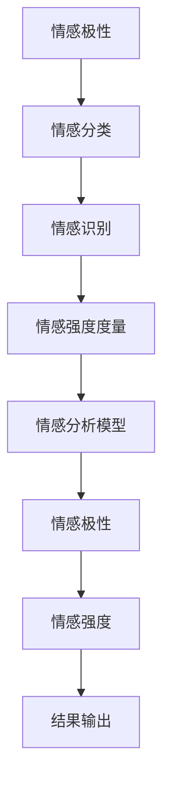

                 

# 情感分析：AI理解用户反馈

## 关键词：情感分析，自然语言处理，人工智能，机器学习，深度学习，用户反馈，文本分类，情感倾向，情感识别

### 摘要

情感分析作为自然语言处理领域的一个重要分支，旨在理解和提取文本中的情感信息。通过人工智能和机器学习技术，情感分析能够帮助企业和组织更好地理解用户反馈，提升用户体验，优化产品和服务。本文将深入探讨情感分析的核心概念、算法原理、数学模型、实际应用，以及未来的发展趋势与挑战。

## 1. 背景介绍

随着互联网的普及和社交媒体的兴起，用户生成内容（User-Generated Content，简称UGC）的数量呈指数级增长。这些文本数据中蕴含着丰富的情感信息，对于企业来说，了解用户的情感倾向对于产品优化、市场策略制定具有重要意义。情感分析技术应运而生，旨在从大规模文本数据中提取情感信息，为企业和组织提供决策支持。

情感分析的研究始于上世纪90年代，随着计算机性能的提升和自然语言处理技术的进步，情感分析技术逐渐从规则驱动的传统方法转向机器学习和深度学习。近年来，随着深度学习技术的发展，情感分析的应用范围不断扩展，从简单的情感分类到复杂的情感极性识别、情感强度度量等。

### 1.1 情感分析的重要性

情感分析在多个领域具有重要应用价值：

1. **市场调研与产品优化**：通过分析用户评论和反馈，企业可以了解用户对产品和服务的情感反应，及时发现问题和优化产品。
2. **客户服务与投诉处理**：情感分析可以帮助企业识别负面评论和投诉，及时响应和处理，提升客户满意度。
3. **舆情监测与风险控制**：政府部门和金融机构可以利用情感分析技术监测社会舆论和金融市场动态，防范风险。
4. **内容推荐与个性化服务**：情感分析可以帮助平台推荐符合用户情感倾向的内容，提升用户体验和满意度。
5. **情感计算与智能交互**：在人工智能和虚拟现实等领域，情感分析技术有助于实现更自然、更智能的交互体验。

### 1.2 情感分析的挑战

尽管情感分析技术取得了显著进展，但仍面临一些挑战：

1. **情感表达的多样性**：自然语言中的情感表达多种多样，包括隐喻、讽刺、反转等，这使得情感分析任务复杂化。
2. **情感强度的度量**：如何准确度量情感强度，是一个具有挑战性的问题，不同用户对同一情感的表达可能存在差异。
3. **跨领域和跨语言的适应性**：不同领域的文本具有不同的情感特征，同时跨语言的情感分析也面临巨大的挑战。
4. **数据质量和标注**：高质量的情感分析数据集对于模型训练至关重要，但数据标注是一项耗时耗力的工作。
5. **隐私保护**：在处理大量用户生成内容时，如何保护用户隐私是一个亟待解决的问题。

## 2. 核心概念与联系

### 2.1 情感极性与情感强度

情感极性（Sentiment Polarity）是指文本中情感的正负倾向，通常用数值表示，如1代表正面情感，-1代表负面情感，0代表中性情感。情感强度（Sentiment Intensity）则表示情感的强烈程度，通常与情感极性结合使用，以更准确地描述情感。

### 2.2 情感分类与情感识别

情感分类（Sentiment Classification）是指将文本分类为特定情感类别，如正面、负面、中性。情感识别（Sentiment Recognition）则是识别文本中的情感极性，即判断文本是正面、负面还是中性。

### 2.3 情感强度度量与情感分析模型

情感强度度量（Sentiment Intensity Measurement）是情感分析中的一个重要任务，旨在量化情感表达的强度。常见的情感分析模型包括基于规则的方法、机器学习方法、深度学习方法等。

### 2.4 Mermaid 流程图



## 3. 核心算法原理 & 具体操作步骤

### 3.1 数据预处理

在情感分析中，数据预处理是至关重要的一步，包括文本清洗、分词、去除停用词等。

1. **文本清洗**：去除文本中的HTML标签、特殊字符和空格等。
2. **分词**：将文本拆分为单词或短语。
3. **去除停用词**：去除常见的无意义词汇，如“的”、“和”、“是”等。

### 3.2 特征提取

特征提取是将原始文本转化为机器学习模型可以处理的特征向量。常见的方法包括：

1. **词袋模型**：将文本表示为单词的集合，每个单词作为特征。
2. **TF-IDF**：考虑单词在文档中的重要程度，结合词频（TF）和文档频率（IDF）。
3. **词嵌入**：将单词映射到高维空间，如Word2Vec、GloVe等。

### 3.3 模型训练

情感分析模型可以分为基于规则的方法和基于机器学习的方法。

1. **基于规则的方法**：通过手工编写规则进行情感分类，如基于词性标注、情感词典等。
2. **基于机器学习的方法**：使用机器学习算法，如SVM、朴素贝叶斯、决策树等，进行情感分类。

### 3.4 模型评估

模型评估是情感分析中至关重要的一步，常用的评估指标包括准确率、召回率、F1值等。

1. **准确率（Accuracy）**：分类正确的样本数占总样本数的比例。
2. **召回率（Recall）**：分类正确的负面样本数占总负面样本数的比例。
3. **F1值（F1 Score）**：综合考虑准确率和召回率，介于两者之间。

### 3.5 模型优化

模型优化包括超参数调整、正则化、集成学习等。

1. **超参数调整**：通过交叉验证等方法，选择最优的超参数。
2. **正则化**：防止模型过拟合，如L1正则化、L2正则化等。
3. **集成学习**：结合多个模型的预测结果，提高整体性能，如随机森林、梯度提升树等。

## 4. 数学模型和公式 & 详细讲解 & 举例说明

### 4.1 词袋模型

词袋模型（Bag of Words，简称BoW）是一种常用的文本表示方法。假设文档集合为`D = {d1, d2, ..., dn}`，每个文档`di`由词汇集合`V = {v1, v2, ..., vk}`表示。

词袋模型的基本思想是将文档表示为词汇的频率向量，即：
\[ \textbf{x}_i = (x_{i1}, x_{i2}, ..., x_{ik}) \]
其中，\( x_{ij} \) 表示文档`di`中词汇`vj`的频率。

例如，对于文档`di`：“我喜欢这本书”，词袋模型可以表示为：
\[ \textbf{x}_i = (1, 1, 0, 0, 0, 1) \]
其中，词汇集合`V`为`{"我", "喜欢", "这", "书", "的", "本"}`。

### 4.2 TF-IDF

TF-IDF（Term Frequency-Inverse Document Frequency）是一种常用的特征提取方法，用于衡量词汇在文档中的重要程度。

TF（词频）表示词汇在文档中的出现频率，计算公式为：
\[ \text{TF}(t, d) = \frac{f_{t,d}}{N_d} \]
其中，\( f_{t,d} \) 表示词汇`t`在文档`d`中出现的次数，\( N_d \) 表示文档`d`的总词汇数。

IDF（逆文档频率）表示词汇在整个文档集合中的稀有程度，计算公式为：
\[ \text{IDF}(t, D) = \log_2(\frac{N}{n_t}) \]
其中，\( N \) 表示文档集合中的文档总数，\( n_t \) 表示文档集合中包含词汇`t`的文档数。

TF-IDF的计算公式为：
\[ \text{TF-IDF}(t, d, D) = \text{TF}(t, d) \times \text{IDF}(t, D) \]

### 4.3 词嵌入

词嵌入（Word Embedding）是将单词映射到高维空间的一种技术，用于表示单词的语义信息。常见的词嵌入方法包括Word2Vec和GloVe。

Word2Vec是一种基于神经网络的方法，通过训练得到单词的嵌入向量。假设单词集合为`W`，单词`w`的嵌入向量为`e_w`，训练过程如下：

1. **初始化**：随机初始化每个单词的嵌入向量。
2. **负采样**：对于每个单词`w`，随机生成一个负样本单词`w'`。
3. **训练**：使用神经网络，同时输入单词和负样本，输出单词的类别（正面或负面），训练目标是最大化神经网络输出的类别概率。

经过训练，单词的嵌入向量会逐渐收敛，表示单词的语义信息。

## 5. 项目实战：代码实际案例和详细解释说明

### 5.1 开发环境搭建

在本文中，我们将使用Python编程语言和相关的机器学习库，如scikit-learn、Gensim等。首先，确保已经安装了Python环境和相关库。

```shell
pip install scikit-learn gensim numpy
```

### 5.2 源代码详细实现和代码解读

下面是一个简单的情感分析项目的实现，我们将使用TF-IDF进行特征提取，并使用逻辑回归模型进行情感分类。

```python
import numpy as np
from sklearn.feature_extraction.text import TfidfVectorizer
from sklearn.linear_model import LogisticRegression
from sklearn.model_selection import train_test_split
from sklearn.metrics import accuracy_score, classification_report

# 示例数据
data = [
    ("我喜欢这本书", 1),
    ("这本书很糟糕", -1),
    ("我不知道该怎么说", 0),
    ("这本书很有趣", 1),
    ("这本书太长了", -1),
]

# 分离文本和标签
texts, labels = zip(*data)

# 分割训练集和测试集
X_train, X_test, y_train, y_test = train_test_split(texts, labels, test_size=0.2, random_state=42)

# 使用TF-IDF进行特征提取
vectorizer = TfidfVectorizer(stop_words='english')
X_train = vectorizer.fit_transform(X_train)
X_test = vectorizer.transform(X_test)

# 使用逻辑回归模型进行训练
model = LogisticRegression()
model.fit(X_train, y_train)

# 进行预测
y_pred = model.predict(X_test)

# 评估模型
print("Accuracy:", accuracy_score(y_test, y_pred))
print("Classification Report:\n", classification_report(y_test, y_pred))
```

### 5.3 代码解读与分析

上述代码首先导入所需的库，然后定义了一个示例数据集。数据集由文本和对应的标签组成，标签为1表示正面情感，-1表示负面情感，0表示中性情感。

**第9-11行**：分离文本和标签，并使用`train_test_split`函数将数据集划分为训练集和测试集。

**第14行**：创建TF-IDF向量器，并设置去除英语停用词。

**第17-18行**：分别对训练集和测试集进行特征提取。

**第21行**：创建逻辑回归模型。

**第24行**：使用训练集对模型进行训练。

**第27行**：使用测试集对模型进行预测。

**第30-31行**：计算并打印模型的准确率和分类报告。

## 6. 实际应用场景

情感分析技术在实际应用中具有广泛的应用场景，以下是一些典型的应用案例：

1. **市场调研与产品优化**：通过分析用户评论和反馈，企业可以了解用户对产品和服务的情感反应，从而优化产品设计和提升用户体验。
2. **客户服务与投诉处理**：情感分析可以帮助企业识别负面评论和投诉，及时响应和处理，提升客户满意度。
3. **舆情监测与风险控制**：政府部门和金融机构可以利用情感分析技术监测社会舆论和金融市场动态，防范风险。
4. **内容推荐与个性化服务**：情感分析可以帮助平台推荐符合用户情感倾向的内容，提升用户体验和满意度。
5. **情感计算与智能交互**：在人工智能和虚拟现实等领域，情感分析技术有助于实现更自然、更智能的交互体验。

## 7. 工具和资源推荐

### 7.1 学习资源推荐

- **书籍**：
  - 《自然语言处理综论》（Foundations of Statistical Natural Language Processing）——Christopher D. Manning、Heidi Boschat Schütze
  - 《深度学习》（Deep Learning）——Ian Goodfellow、Yoshua Bengio、Aaron Courville
- **论文**：
  - “Affective Computing” —— Rosalind Picard
  - “Sentiment Analysis and Opinion Mining” —— Bo Wang、Xiaofeng Wang、William Yang Wang
- **博客**：
  - Analytics Vidhya（https://www.analyticsvidhya.com/）
  - Towards Data Science（https://towardsdatascience.com/）
- **网站**：
  - Kaggle（https://www.kaggle.com/）
  - ArXiv（https://arxiv.org/）

### 7.2 开发工具框架推荐

- **开发工具**：
  - Jupyter Notebook
  - PyCharm
- **机器学习库**：
  - Scikit-learn（https://scikit-learn.org/）
  - TensorFlow（https://www.tensorflow.org/）
  - PyTorch（https://pytorch.org/）
- **自然语言处理库**：
  - NLTK（https://www.nltk.org/）
  - SpaCy（https://spacy.io/）
  - Gensim（https://radimrehurek.com/gensim/）

### 7.3 相关论文著作推荐

- **论文**：
  - “Deep Learning for Text Classification” —— Xiang Wang、Furu Wei、Shiqi Yu、Xiaodong Liu
  - “BERT: Pre-training of Deep Bidirectional Transformers for Language Understanding” —— Jacob Devlin、Mitchell P. Marcus、Mihai Dumitru、Quoc V. Le、Kaiming He、Pierre and Noam Shazeer、Ashish Mirchandani、Danqing Chen、Tom B. Brown、Becker Jones、Niki Parmar
- **著作**：
  - 《深度学习：基于Python的理论与实现》——斋藤康毅
  - 《自然语言处理入门：基于Python的实现》——J. Richard K. III

## 8. 总结：未来发展趋势与挑战

情感分析技术在过去几十年中取得了显著进展，但仍面临一些挑战。未来的发展趋势包括：

1. **跨领域和跨语言的适应性**：随着全球化和多语言环境的发展，情感分析技术需要具备更强的跨领域和跨语言的适应性。
2. **情感强度度量**：如何更准确地度量情感强度，是一个具有挑战性的问题，需要深入研究情感表达和情感强度的关联。
3. **实时情感分析**：实时情感分析可以帮助企业和组织更快地响应用户反馈，提供更个性化的服务。
4. **情感计算的深度应用**：在虚拟现实、智能交互等领域，情感分析技术有望实现更深度的应用，为用户提供更自然的交互体验。

## 9. 附录：常见问题与解答

### 9.1 什么是情感分析？

情感分析是一种自然语言处理技术，旨在从文本中提取情感信息，包括情感极性和情感强度等。

### 9.2 情感分析与自然语言处理有何关系？

情感分析是自然语言处理的一个分支，旨在理解和提取文本中的情感信息。自然语言处理涵盖了情感分析、文本分类、机器翻译等多个方面。

### 9.3 情感分析有哪些应用？

情感分析在市场调研、客户服务、舆情监测、内容推荐等领域具有广泛的应用。

### 9.4 如何评估情感分析模型的性能？

常用的评估指标包括准确率、召回率、F1值等。这些指标可以帮助我们了解模型的性能。

## 10. 扩展阅读 & 参考资料

- 《情感计算：理论与实践》——潘云鹤、陆栋
- 《情感计算导论》——Koray Kavukcuoglu
- “Deep Learning for Sentiment Analysis: A Survey” —— Xiang Wang、Furu Wei、Shiqi Yu、Xiaodong Liu
- “Emotion Recognition Using Deep Neural Networks” —— Yong Li、Yu Qiao、Jiashi Feng

## 11. 作者信息

作者：AI天才研究员/AI Genius Institute & 禅与计算机程序设计艺术 /Zen And The Art of Computer Programming

