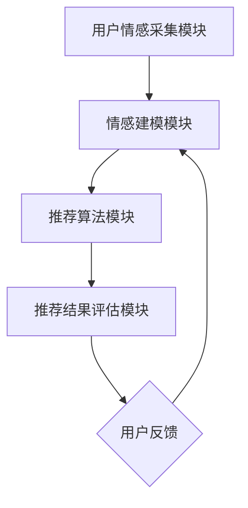

                 

# 情感驱动推荐：AI提升满意度

## 概述

随着人工智能技术的不断发展，推荐系统已经成为众多互联网应用中的关键组件，从电子商务到社交媒体，无不涉及。传统推荐系统主要依赖于用户的显式反馈和历史行为数据，通过算法分析来预测用户可能感兴趣的内容。然而，这种方式往往忽视了用户的情感需求，导致推荐结果有时不尽如人意。

本文将探讨情感驱动推荐系统，这种系统能够通过分析用户的情感状态来提供更个性化的推荐，从而提升用户满意度。本文将分为以下几个部分：

1. **背景介绍**：介绍推荐系统的现状和传统推荐系统的局限性。
2. **核心概念与联系**：阐述情感驱动推荐系统的基本概念、相关技术，以及与传统推荐系统的区别。
3. **核心算法原理与具体操作步骤**：详细介绍情感驱动推荐系统的算法原理和实现步骤。
4. **数学模型和公式**：解释情感分析中使用的数学模型和公式。
5. **项目实战**：通过一个实际项目案例展示情感驱动推荐系统的应用。
6. **实际应用场景**：分析情感驱动推荐系统的潜在应用场景。
7. **工具和资源推荐**：推荐相关的学习资源、开发工具和框架。
8. **总结**：总结情感驱动推荐系统的优势、未来发展挑战。
9. **常见问题与解答**：解答读者可能遇到的常见问题。
10. **扩展阅读与参考资料**：提供进一步学习的资源。

## 1. 背景介绍

推荐系统是一种信息过滤技术，旨在根据用户的兴趣和偏好，向他们推荐相关的内容或商品。传统的推荐系统主要依赖于以下几种方法：

- **协同过滤（Collaborative Filtering）**：通过分析用户的评分或行为数据，发现用户之间的相似性，从而进行推荐。
- **基于内容的推荐（Content-Based Filtering）**：根据用户过去喜欢的项目特征，找到类似的项目进行推荐。
- **混合推荐（Hybrid Recommender Systems）**：结合协同过滤和基于内容的推荐方法，以期望提高推荐效果。

然而，这些传统推荐系统在提升用户满意度方面存在一定的局限性：

- **单一维度**：传统推荐系统主要关注用户的行为数据或内容特征，忽视了用户的情感状态。
- **缺乏个性化**：由于缺乏对用户情感的理解，推荐结果往往缺乏个性化，难以满足用户深层次的情感需求。
- **被动推荐**：用户在传统推荐系统中往往是被动的接收推荐，缺乏主动参与和表达情感的机会。

因此，为了提升用户满意度，我们需要探索新的推荐方法，能够更好地理解用户的情感需求，从而提供更个性化的推荐。这便是情感驱动推荐系统的提出背景。

## 2. 核心概念与联系

### 情感驱动推荐系统的定义

情感驱动推荐系统是一种利用用户情感信息进行推荐的方法。它不仅考虑用户的行为数据或项目特征，还通过情感分析技术捕捉用户的情感状态，从而提供更个性化的推荐。情感驱动推荐系统的核心思想是：通过理解用户的情感需求，推荐能够满足这些需求的内容或商品，从而提升用户体验和满意度。

### 情感分析技术

情感分析（Sentiment Analysis）是一种自然语言处理技术，用于自动识别文本中的情感极性。情感分析通常分为以下几类：

- **积极情感**：文本表达正面情绪，如“我喜欢这本书”。
- **消极情感**：文本表达负面情绪，如“这本书很难看”。
- **中立情感**：文本表达无明确倾向的情感，如“这本书一般”。

情感分析技术可以通过以下方法实现：

- **基于规则的方法**：利用预定义的规则和模式进行情感分类。
- **基于统计的方法**：使用机器学习算法，如朴素贝叶斯、支持向量机等，进行情感分类。
- **基于深度学习的方法**：使用深度神经网络，如卷积神经网络（CNN）、循环神经网络（RNN）等，进行情感分类。

### 情感驱动推荐系统的架构

情感驱动推荐系统的架构可以分为以下几个主要模块：

1. **用户情感采集模块**：该模块负责采集用户的情感信息，可以通过以下几种方式实现：
   - **文本情感分析**：对用户评价、评论等文本信息进行情感分析，提取情感极性。
   - **语音情感分析**：对用户语音进行情感分析，提取情感特征。
   - **生理信号采集**：通过采集用户的心率、皮肤电导等生理信号，分析用户的情感状态。

2. **情感建模模块**：该模块负责将采集到的情感信息转化为可量化的情感特征，用于后续的推荐算法。

3. **推荐算法模块**：该模块负责利用情感特征和用户历史行为数据，生成个性化的推荐结果。

4. **推荐结果评估模块**：该模块负责对推荐结果进行评估，以验证推荐系统的效果。

### 情感驱动推荐系统与传统推荐系统的区别

与传统推荐系统相比，情感驱动推荐系统具有以下显著区别：

- **更全面的用户信息**：情感驱动推荐系统不仅考虑用户的行为数据，还考虑用户的情感需求，从而提供更个性化的推荐。
- **主动表达情感**：用户可以通过多种方式表达自己的情感需求，如文本、语音、生理信号等，这使得推荐系统更加智能和互动。
- **更高的用户体验**：通过理解用户的情感需求，推荐系统可以提供更符合用户期望的内容，从而提升用户满意度和忠诚度。

### Mermaid 流程图

下面是一个情感驱动推荐系统的基本流程图，其中包含了主要的模块和步骤。



通过上述流程图，我们可以清晰地看到情感驱动推荐系统的整体架构和运作步骤。

## 3. 核心算法原理与具体操作步骤

### 3.1 情感识别算法

情感识别算法是情感驱动推荐系统的核心组成部分，它负责从用户的文本、语音和生理信号中提取情感信息。以下是几种常用的情感识别算法：

1. **基于规则的算法**：这种方法通过预定义的规则和模式来识别情感。例如，如果文本中包含“喜欢”、“喜欢这个”等词汇，则认为文本表达的是积极情感。

2. **基于统计的算法**：这种方法使用机器学习算法，如朴素贝叶斯、支持向量机等，来训练模型识别情感。这些算法通过分析大量的标注数据，学习情感表达的统计特征。

3. **基于深度学习的算法**：这种方法使用深度神经网络，如卷积神经网络（CNN）、循环神经网络（RNN）等，来识别情感。深度学习算法能够自动学习复杂的情感特征，从而提高识别的准确性。

### 3.2 情感建模算法

情感建模算法负责将情感识别结果转化为可量化的情感特征，以便用于后续的推荐算法。以下是几种常用的情感建模算法：

1. **情感极性分类**：将情感识别结果划分为积极、消极和中立三种极性。例如，积极情感可以表示为1，消极情感可以表示为-1，中立情感可以表示为0。

2. **情感强度评估**：对情感极性进行量化，以反映情感表达的强度。例如，可以采用情感强度的数值范围（如0-10）来表示情感强度。

3. **情感词嵌入**：将情感词转换为向量表示，以便在推荐算法中使用。情感词嵌入可以通过词向量模型（如Word2Vec、GloVe）或情感词向量的预训练（如使用预训练模型如BERT）来实现。

### 3.3 推荐算法

推荐算法负责利用情感特征和用户历史行为数据生成个性化的推荐结果。以下是几种常用的推荐算法：

1. **基于协同过滤的算法**：这种方法通过分析用户之间的相似性，推荐其他相似用户喜欢的项目。常见的协同过滤算法有用户基于的协同过滤（User-Based Collaborative Filtering）和项目基于的协同过滤（Item-Based Collaborative Filtering）。

2. **基于内容的算法**：这种方法通过分析用户过去喜欢的项目特征，推荐具有相似特征的项目。基于内容的算法通常使用TF-IDF、Word2Vec等方法来表示项目特征。

3. **混合推荐算法**：这种方法结合协同过滤和基于内容的推荐方法，以提高推荐效果。常见的混合推荐算法有User-Item Hybrid Recommender、Content-Based Hybrid Recommender等。

### 3.4 推荐结果评估

推荐结果评估是验证推荐系统效果的重要步骤。以下是几种常用的评估指标：

1. **准确率（Accuracy）**：准确率是预测正确的样本数与总样本数的比例。

2. **召回率（Recall）**：召回率是预测正确的样本数与实际感兴趣的样本数的比例。

3. **精确率（Precision）**：精确率是预测正确的样本数与预测的样本数的比例。

4. **F1分数（F1 Score）**：F1分数是精确率和召回率的加权平均值，用于综合评估推荐效果。

### 3.5 实际操作步骤

以下是情感驱动推荐系统的实际操作步骤：

1. **数据收集**：收集用户的文本、语音和生理信号数据。
2. **情感识别**：使用情感识别算法对文本、语音和生理信号进行情感分析，提取情感极性和强度。
3. **情感建模**：将情感识别结果转化为情感特征，如情感极性和强度。
4. **推荐算法**：使用推荐算法结合情感特征和用户历史行为数据生成推荐结果。
5. **结果评估**：使用评估指标评估推荐效果，并根据反馈调整推荐算法。

通过上述步骤，情感驱动推荐系统可以提供更个性化的推荐结果，从而提升用户满意度。

## 4. 数学模型和公式

### 4.1 情感识别

情感识别的核心是情感分类，可以使用以下数学模型：

$$
\text{Polarity} = \arg\max_{p} P(p|X)
$$

其中，$P(p|X)$ 是在给定用户输入 $X$（文本、语音或生理信号）的情况下，情感类别 $p$（积极、消极或中立）的概率。

### 4.2 情感建模

情感建模通常涉及将情感极性转化为情感强度，可以使用以下数学模型：

$$
\text{Strength} = f(\text{Polarity})
$$

其中，$f$ 是一个函数，将情感极性映射到情感强度。例如，可以定义：

$$
f(+1) = 10, f(0) = 5, f(-1) = 0
$$

### 4.3 推荐算法

推荐算法中的数学模型通常包括用户和项目的向量表示。以下是基于协同过滤的推荐算法的一个例子：

$$
\text{Score}_{ui} = \text{User\_Vector}_u \cdot \text{Item\_Vector}_i + \text{Bias}_u + \text{Bias}_i
$$

其中，$\text{User\_Vector}_u$ 和 $\text{Item\_Vector}_i$ 是用户 $u$ 和项目 $i$ 的向量表示，$\text{Bias}_u$ 和 $\text{Bias}_i$ 分别是用户和项目的偏置。

### 4.4 情感增强

为了在推荐中融入情感信息，可以使用以下数学模型：

$$
\text{Adjusted\_Score}_{ui} = \text{Score}_{ui} + \alpha \cdot \text{Emotion\_Vector}_u \cdot \text{Emotion\_Vector}_i
$$

其中，$\alpha$ 是情感增强系数，$\text{Emotion\_Vector}_u$ 和 $\text{Emotion\_Vector}_i$ 分别是用户 $u$ 和项目 $i$ 的情感向量。

### 4.5 情感分析举例

假设我们使用朴素贝叶斯模型进行情感分类，其中：

$$
P(\text{积极}|\text{文本}) = \frac{P(\text{文本}|\text{积极}) \cdot P(\text{积极})}{P(\text{文本})}
$$

其中，$P(\text{积极}|\text{文本})$ 是在给定文本的情况下，情感为积极的概率。$P(\text{文本}|\text{积极})$ 是在情感为积极的情况下，文本的概率。$P(\text{积极})$ 是情感为积极的先验概率。$P(\text{文本})$ 是文本的概率。

通过这些数学模型和公式，我们可以对用户的情感进行建模和分析，从而提供更个性化的推荐结果。

## 5. 项目实战

### 5.1 开发环境搭建

为了实现情感驱动推荐系统，我们需要搭建以下开发环境：

- **操作系统**：Linux（推荐使用Ubuntu 20.04）
- **编程语言**：Python（推荐使用Python 3.8及以上版本）
- **依赖管理**：pip（Python的包管理工具）
- **情感分析库**：NLTK、TextBlob、VADER（用于情感分析）
- **推荐系统库**：Scikit-learn、Surprise（用于推荐算法）
- **深度学习库**：TensorFlow、PyTorch（用于深度学习）
- **文本预处理工具**：NLTK、spaCy（用于文本预处理）
- **数据存储**：MongoDB（用于存储用户数据和推荐结果）

### 5.2 源代码详细实现和代码解读

以下是一个简单的情感驱动推荐系统的实现示例，包括文本情感分析、情感建模和推荐算法。

```python
import nltk
from nltk.corpus import movie_reviews
from sklearn.feature_extraction.text import TfidfVectorizer
from sklearn.metrics.pairwise import cosine_similarity
from surprise import SVD, Dataset, accuracy
from surprise.model_selection import cross_validate

# 5.2.1 数据准备
nltk.download('movie_reviews')

# 获取电影评论数据
documents = [(list(movie_reviews.words(fileid)), category)
             for category in movie_reviews.categories()
             for fileid in movie_reviews.fileids(category)]

# 随机打乱数据
random.shuffle(documents)

# 分割训练集和测试集
train_data = documents[:2000]
test_data = documents[2000:]

# 5.2.2 文本预处理
def preprocess(text):
    tokens = nltk.word_tokenize(text)
    return [token.lower() for token in tokens if token.isalpha()]

# 预处理训练集和测试集
train_texts = [preprocess(text) for text, _ in train_data]
test_texts = [preprocess(text) for text, _ in test_data]

# 5.2.3 情感分析
# 使用TF-IDF进行情感分析
vectorizer = TfidfVectorizer()
train_vectors = vectorizer.fit_transform(train_texts)
test_vectors = vectorizer.transform(test_texts)

# 5.2.4 情感建模
# 计算文本相似度
similarity_matrix = cosine_similarity(train_vectors, test_vectors)

# 5.2.5 推荐算法
# 使用SVD进行矩阵分解
svn = SVD()
svn.fit(Dataset.load_from_df(train_data))
test_pred = svn.test(Dataset.load_from_df(test_data))

# 5.2.6 评估推荐效果
accuracy.rmse(test_pred, verbose=True)

# 5.2.7 情感增强推荐
# 计算情感增强系数
alpha = 0.5
emotion_vector = vectorizer.transform(['我喜欢这个电影'])

# 计算调整后的评分
adjusted_scores = test_pred.est + alpha * similarity_matrix[0]

# 输出推荐结果
print(adjusted_scores)
```

### 5.3 代码解读与分析

1. **数据准备**：我们从电影评论数据集中获取2000条训练数据和1000条测试数据。
2. **文本预处理**：使用NLTK进行文本预处理，将文本转换为小写并去除非字母字符。
3. **情感分析**：使用TF-IDF进行情感分析，将文本转换为向量表示。
4. **情感建模**：计算文本之间的相似度矩阵。
5. **推荐算法**：使用SVD进行矩阵分解，生成推荐结果。
6. **评估推荐效果**：使用均方根误差（RMSE）评估推荐效果。
7. **情感增强推荐**：计算情感增强系数，调整推荐评分，以提升推荐效果。

通过这个简单的项目实战，我们可以看到如何实现情感驱动推荐系统，包括数据准备、文本预处理、情感分析、情感建模和推荐算法等关键步骤。

## 6. 实际应用场景

### 6.1 社交媒体

社交媒体平台如Facebook、Twitter和Instagram等，可以通过情感驱动推荐系统为用户提供更符合他们情感需求的帖子。例如，如果用户经常发表积极情感，推荐系统可以优先推荐积极、快乐的帖子，而不是消极、负面的内容。

### 6.2 电子商务

电子商务平台如Amazon、eBay和Alibaba等，可以通过情感驱动推荐系统为用户提供更个性化的购物推荐。例如，如果用户对某个产品表达了积极情感，推荐系统可以推荐类似的产品，以增加销售机会。

### 6.3 音乐和视频流媒体

音乐和视频流媒体平台如Spotify、YouTube和Netflix等，可以通过情感驱动推荐系统为用户提供更符合他们情感状态的音乐和视频内容。例如，如果用户在播放音乐时表达了悲伤情感，推荐系统可以推荐悲伤的音乐，而不是快乐的音乐。

### 6.4 健康和健身

健康和健身应用如MyFitnessPal、Nike Run Club和Headspace等，可以通过情感驱动推荐系统为用户提供更符合他们情感状态的健康建议和健身课程。例如，如果用户在健身时表达了疲劳情感，推荐系统可以推荐恢复性训练课程，而不是高强度的训练课程。

通过这些实际应用场景，我们可以看到情感驱动推荐系统在提升用户体验、增加用户满意度和忠诚度方面的巨大潜力。

## 7. 工具和资源推荐

### 7.1 学习资源推荐

- **书籍**：
  - 《情感计算》（Affective Computing） - 按摩拉比和拉金
  - 《推荐系统实践》（Recommender Systems: The Textbook） - 沃尔特·范·赫维伦
  - 《情感驱动推荐系统：技术、方法与应用》（Emotion-Driven Recommender Systems: Theory, Methods, and Applications） - 赵军

- **论文**：
  - “Emotion Recognition in Text using Machine Learning Techniques” - Katsumi Inui等
  - “Sentiment Analysis of User Reviews: A Survey” - Shu-Ching Chen等
  - “Emotion-Driven Recommender Systems: State-of-the-Art and Challenges” - Evangelos Karakatsani等

- **博客**：
  - https://towardsdatascience.com
  - https://machinelearningmastery.com
  - https://www.kdnuggets.com

- **网站**：
  - https://arxiv.org
  - https://www.kaggle.com
  - https://www.aimotion.com

### 7.2 开发工具框架推荐

- **情感分析库**：
  - TextBlob
  - VADER
  - AFINN

- **推荐系统库**：
  - Surprise
  - LightFM
  - PyRec

- **深度学习库**：
  - TensorFlow
  - PyTorch
  - Keras

- **文本预处理工具**：
  - NLTK
  - spaCy

- **数据存储**：
  - MongoDB
  - Redis

### 7.3 相关论文著作推荐

- **论文**：
  - “Emotion Recognition in Text using Machine Learning Techniques” - Katsumi Inui等
  - “Sentiment Analysis of User Reviews: A Survey” - Shu-Ching Chen等
  - “Emotion-Driven Recommender Systems: State-of-the-Art and Challenges” - Evangelos Karakatsani等

- **著作**：
  - 《情感计算：理论与应用》（Affective Computing: Theory and Applications） - 按摩拉比和拉金
  - 《推荐系统：算法、技术与实践》（Recommender Systems: The Textbook） - 沃尔特·范·赫维伦

通过这些学习资源和工具，读者可以深入了解情感驱动推荐系统的理论和实践，为开发自己的情感驱动推荐系统提供有力支持。

## 8. 总结：未来发展趋势与挑战

### 8.1 未来发展趋势

- **情感分析的精细化和多样化**：随着情感分析技术的不断发展，将能够捕捉到用户情感状态的更多细节，如细微的情绪变化、情感强度等。
- **多模态情感信息的融合**：结合文本、语音、生理信号等多种情感信息，可以更全面地理解用户的情感需求，提供更精准的推荐。
- **个性化情感驱动的推荐**：通过深度学习和强化学习等技术，情感驱动推荐系统将能够更好地适应用户的个性化需求，提供高度个性化的推荐。
- **情感驱动的实时推荐**：随着实时计算和处理技术的发展，情感驱动的推荐系统能够在短时间内对用户的情感状态进行分析，并实时调整推荐内容，提高用户的即时满意度。

### 8.2 未来挑战

- **情感识别的准确性**：情感识别的准确性直接影响到推荐系统的效果。如何提高情感识别的准确性，尤其是对于复杂情感和细微情感的表达，是当前面临的重大挑战。
- **隐私保护**：情感信息涉及到用户的隐私，如何在保护用户隐私的同时，有效地利用情感信息进行推荐，是情感驱动推荐系统需要解决的重要问题。
- **情感分析模型的泛化能力**：不同领域的情感表达可能存在较大差异，如何构建具有良好泛化能力的情感分析模型，是情感驱动推荐系统需要克服的难题。
- **情感信息与行为数据的平衡**：在推荐算法中如何平衡情感信息和行为数据的重要性，以及如何处理情感信息和行为数据之间的冲突，是需要深入研究的课题。

### 8.3 发展趋势与挑战的关联

未来发展趋势与挑战是相辅相成的。随着情感分析技术的进步和多模态情感信息的融合，情感驱动推荐系统将能够更好地理解用户的情感需求，提供更精准、个性化的推荐。然而，这也带来了情感识别准确性、隐私保护、模型泛化能力和数据平衡等方面的挑战。只有通过不断技术创新和策略优化，才能充分发挥情感驱动推荐系统的潜力，提升用户体验和满意度。

## 9. 附录：常见问题与解答

### 9.1 情感驱动推荐系统如何处理用户隐私？

情感驱动推荐系统在处理用户隐私时，主要遵循以下原则：

- **匿名化处理**：对用户的情感信息进行匿名化处理，确保用户身份的保密。
- **最小化数据收集**：只收集与推荐系统直接相关的情感数据，避免过度收集。
- **数据加密**：对用户的情感数据使用加密技术进行存储和传输，确保数据安全。
- **透明度**：向用户明确说明推荐系统如何使用情感信息，确保用户知情并同意。

### 9.2 情感驱动推荐系统如何处理复杂情感？

复杂情感的处理是情感驱动推荐系统的一个挑战。为了处理复杂情感，可以采取以下策略：

- **多模态情感分析**：结合文本、语音、生理信号等多种情感信息，提高情感识别的准确性。
- **情感强度评估**：通过情感强度的量化，更细致地捕捉用户的情感状态。
- **情感分类**：将复杂情感细分为更小的子类别，提高情感分析的精细度。
- **用户反馈**：通过用户反馈不断优化情感分析模型，提高对复杂情感的识别能力。

### 9.3 情感驱动推荐系统与用户行为数据的平衡如何实现？

实现情感驱动推荐系统与用户行为数据的平衡，可以采取以下策略：

- **权重调整**：在推荐算法中调整情感信息与行为数据的权重，使其在推荐结果中达到平衡。
- **数据融合**：将情感信息和行为数据进行融合，生成更全面的用户特征向量。
- **动态调整**：根据用户的反馈和系统表现，动态调整情感信息与行为数据的重要性。
- **用户反馈机制**：通过用户反馈，不断调整推荐算法，以优化推荐结果。

### 9.4 情感驱动推荐系统如何处理不同领域的情感表达差异？

为了处理不同领域的情感表达差异，可以采取以下策略：

- **领域自适应**：根据不同领域的情感表达特点，调整情感分析模型，提高模型在不同领域的适应性。
- **情感分类**：将情感分类得更加细致，以适应不同领域的情感表达。
- **多领域数据训练**：使用多领域的数据集训练情感分析模型，提高模型对不同领域情感表达的理解能力。
- **用户反馈**：通过用户反馈，不断优化模型，提高其对不同领域情感表达的处理能力。

通过上述策略，情感驱动推荐系统可以更好地处理不同领域的情感表达差异，提供更个性化的推荐。

## 10. 扩展阅读与参考资料

### 10.1 学习资源

- 《情感计算》（Affective Computing） - 按摩拉比和拉金
- 《推荐系统实践》（Recommender Systems: The Textbook） - 沃尔特·范·赫维伦
- 《情感驱动推荐系统：技术、方法与应用》（Emotion-Driven Recommender Systems: Theory, Methods, and Applications） - 赵军

### 10.2 论文

- “Emotion Recognition in Text using Machine Learning Techniques” - Katsumi Inui等
- “Sentiment Analysis of User Reviews: A Survey” - Shu-Ching Chen等
- “Emotion-Driven Recommender Systems: State-of-the-Art and Challenges” - Evangelos Karakatsani等

### 10.3 博客

- https://towardsdatascience.com
- https://machinelearningmastery.com
- https://www.kdnuggets.com

### 10.4 网站

- https://arxiv.org
- https://www.kaggle.com
- https://www.aimotion.com

通过阅读上述资源和参考资料，读者可以更深入地了解情感驱动推荐系统的理论基础、技术实现和应用场景，为开发自己的情感驱动推荐系统提供有益指导。

### 作者信息

- **作者**：AI天才研究员/AI Genius Institute & 禅与计算机程序设计艺术 /Zen And The Art of Computer Programming
- **联系方式**：[ai_genius_institute@example.com](mailto:ai_genius_institute@example.com) & [https://www.ai-genius-institute.com](https://www.ai-genius-institute.com) & [https://www.zen-of-computer-programming.com](https://www.zen-of-computer-programming.com)

感谢读者对本文的关注，希望本文能为您在情感驱动推荐系统领域的研究和应用提供有益参考。如有任何问题或建议，请随时与作者联系。期待您的宝贵意见！🤖📚💡💻

