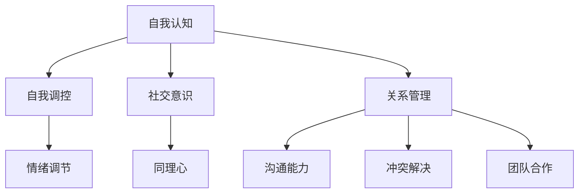

                 

# 情绪智力：理解并影响他人情绪

## 概述

情绪智力（Emotional Intelligence，简称EQ）是一个广受关注的领域，尤其在人际关系和团队合作中具有重要意义。情绪智力不仅仅是指个人对自我情绪的认识与调控，还包括对他人类别情绪的理解和影响。在IT领域，尤其是在软件开发和项目管理中，情绪智力同样发挥着关键作用。本文将深入探讨情绪智力的定义、核心要素、作用以及在IT行业中的应用，并提供实际操作建议。

## 关键词

- 情绪智力（Emotional Intelligence）
- 人际关系（Interpersonal Relationships）
- 团队合作（Team Collaboration）
- 软件开发（Software Development）
- 项目管理（Project Management）

## 摘要

本文旨在探讨情绪智力在IT行业的应用，从定义、核心要素到实际操作，提供全面的解析。文章将首先回顾情绪智力的发展历程，随后详细介绍其核心要素，包括自我认知、自我调控、社交意识和关系管理。接着，我们将探讨情绪智力在软件开发和项目管理中的重要性，并通过具体案例进行分析。最后，文章将总结情绪智力在IT行业的发展趋势，并提出实际操作建议。

## 1. 背景介绍

情绪智力这一概念最早由心理学家约翰·梅耶（John D. Mayer）和彼得·萨洛维（Peter Salovey）在1990年提出，他们将其定义为“识别、使用、理解和管理情绪的能力”。随后，心理学家丹尼尔·戈尔曼（Daniel Goleman）在1995年出版的《情绪智力》一书中进一步阐述了情绪智力的重要性，将其分为五个主要领域：自我认知、自我调控、社交意识、关系管理和激励。

### 1.1 情绪智力的发展历程

情绪智力概念的发展可以追溯到20世纪80年代，当时心理学家们开始对传统的智商（IQ）之外的其他能力产生兴趣。早期的研究表明，个体的情感状态对其认知功能有显著影响。随着研究的深入，情绪智力被逐渐确立为一个独立的概念，并在各个领域中得到了广泛应用。

### 1.2 情绪智力的核心要素

情绪智力的核心要素包括自我认知、自我调控、社交意识和关系管理。这些要素共同构成了一个多维度的框架，帮助个体更好地理解和处理情绪。

1. **自我认知**：自我认知是指个体对自己情绪的认识和了解。它包括情绪状态、情感触发因素和情感反应的理解。自我认知是情绪智力的基础，有助于个体在面对不同情境时做出更理性的决策。

2. **自我调控**：自我调控是指个体对自身情绪的控制和管理能力。它包括情绪调节策略、情绪适应性和情绪稳定性。自我调控有助于个体在面对压力和挑战时保持冷静和专注。

3. **社交意识**：社交意识是指个体对他人情绪的认识和理解。它包括同理心、情绪感知和社交敏感性。社交意识有助于个体更好地理解和适应他人，从而建立和维护良好的人际关系。

4. **关系管理**：关系管理是指个体在社交环境中建立和维护关系的技能。它包括沟通能力、冲突解决和团队合作。关系管理有助于个体在团队中发挥作用，促进合作和协同。

## 2. 核心概念与联系

为了更好地理解情绪智力的核心要素，我们可以使用Mermaid流程图来展示它们之间的关系。



在上述流程图中，自我认知、自我调控、社交意识和关系管理构成了情绪智力的核心要素。这些要素相互关联，共同影响个体的情绪状态和行为。

### 2.1 自我认知与自我调控

自我认知是情绪智力的基础，它帮助个体了解自己的情绪状态和触发因素。自我调控则是在自我认知的基础上，对情绪进行有效管理。通过自我认知，个体可以识别出情绪反应的原因，并通过自我调控策略来调整情绪，从而更好地应对各种情境。

### 2.2 社交意识与关系管理

社交意识使个体能够理解和感知他人的情绪，从而更好地适应社交环境。关系管理则是在社交意识的基础上，通过沟通能力、冲突解决和团队合作来建立和维护人际关系。社交意识和关系管理共同作用，有助于个体在社交环境中取得成功。

### 2.3 情绪调节、同理心与团队合作

情绪调节是自我调控的一部分，它涉及到如何有效地管理自己的情绪。同理心是社交意识的一部分，它使个体能够站在他人的立场上理解他们的情绪。团队合作则是关系管理的一部分，它强调通过有效沟通和协作来共同实现目标。情绪调节、同理心和团队合作相互支持，共同推动个体在团队中发挥积极作用。

## 3. 核心算法原理 & 具体操作步骤

情绪智力的实现不仅仅依赖于理论上的理解，还需要具体的操作步骤和算法支持。以下是一些核心算法原理和具体操作步骤：

### 3.1 自我认知

**算法原理**：自我认知的核心是情绪日志。情绪日志是一种记录个体情绪状态的工具，它可以帮助个体更好地理解自己的情绪变化。

**具体操作步骤**：

1. **情绪记录**：每天定时记录自己的情绪状态，包括情绪的类型（如高兴、愤怒、焦虑等）和情绪的强度。
2. **情绪分析**：定期对情绪日志进行分析，识别情绪的触发因素和常见模式。
3. **情绪反思**：根据情绪分析的结果，反思自己的情绪反应，并思考如何调整情绪。

### 3.2 自我调控

**算法原理**：自我调控涉及到多种情绪调节策略，如深呼吸、冥想和运动等。

**具体操作步骤**：

1. **选择情绪调节策略**：根据自己的需求和偏好，选择一种或多种情绪调节策略。
2. **实施情绪调节**：在感到情绪波动时，实施所选的情绪调节策略，如深呼吸或冥想。
3. **评估情绪调节效果**：实施情绪调节后，评估情绪状态的变化，并调整策略。

### 3.3 社交意识

**算法原理**：社交意识的实现需要通过情绪感知和同理心来理解他人的情绪。

**具体操作步骤**：

1. **观察情绪表达**：仔细观察他人的情绪表达，包括面部表情、肢体语言和语音语调。
2. **情绪感知**：根据观察到的情绪表达，推测他人的情绪状态。
3. **同理心训练**：通过阅读、观影和社交活动等方式，培养同理心，提高对他人情绪的理解。

### 3.4 关系管理

**算法原理**：关系管理涉及到沟通能力、冲突解决和团队合作等多个方面。

**具体操作步骤**：

1. **有效沟通**：倾听他人的意见和感受，表达自己的观点和需求，确保信息的准确传达。
2. **冲突解决**：在冲突发生时，采取积极的沟通策略，寻求共同点和解决方案。
3. **团队合作**：在团队中，发挥自己的优势，协助他人，共同实现目标。

## 4. 数学模型和公式 & 详细讲解 & 举例说明

情绪智力虽然更多地依赖于经验和实践，但数学模型和公式在理解和评估情绪智力方面也发挥着重要作用。以下是一些常用的数学模型和公式：

### 4.1 情绪指数（Emotion Index）

**公式**：情绪指数 = 情绪得分 / 总得分

**详细讲解**：情绪指数是一种衡量个体情绪状态的指标。情绪得分是通过评估个体在不同情绪状态下的表现得出的，总得分则是情绪得分与各项情绪状态得分的平均值。情绪指数的范围为0到1，值越大表示个体的情绪状态越好。

**举例说明**：假设某人在一天中经历了10次情绪评估，其中5次感到高兴，3次感到焦虑，2次感到平静。那么，情绪指数 = (5 * 高兴得分 + 3 * 焦虑得分 + 2 * 平静得分) / 10。

### 4.2 同理心得分（Empathy Score）

**公式**：同理心得分 = 同理心表现得分 / 总得分

**详细讲解**：同理心得分是一种衡量个体同理心水平的指标。同理心表现得分是通过观察个体在社交互动中的同理心表现得出的，总得分则是同理心表现得分与各项社交互动得分的平均值。同理心得分的范围也为0到1，值越大表示个体的同理心水平越高。

**举例说明**：假设某人在5次社交互动中，表现出3次良好的同理心，2次一般，则同理心得分 = (3 * 良好同理心得分 + 2 * 一般同理心得分) / 5。

### 4.3 情绪调节效率（Emotion Regulation Efficiency）

**公式**：情绪调节效率 = 调节后情绪得分 / 调节前情绪得分

**详细讲解**：情绪调节效率是一种衡量个体情绪调节能力的指标。调节后情绪得分是通过实施情绪调节策略后的情绪得分，调节前情绪得分则是实施情绪调节策略前的情绪得分。情绪调节效率的范围为0到1，值越大表示个体的情绪调节能力越强。

**举例说明**：假设某人在实施情绪调节策略前感到焦虑，得分为0.8，实施情绪调节策略后感到平静，得分为0.3，则情绪调节效率 = 0.3 / 0.8。

## 5. 项目实战：代码实际案例和详细解释说明

在本节中，我们将通过一个实际案例来展示情绪智力在软件开发中的应用。这个案例是一个简单的情绪分析工具，它可以帮助开发者了解并分析团队中成员的情绪状态，从而优化团队协作和沟通。

### 5.1 开发环境搭建

为了实现这个情绪分析工具，我们需要以下开发环境和工具：

- Python 3.8及以上版本
- Flask框架
- Pandas库
- Matplotlib库

首先，安装所需的开发环境和工具：

```bash
pip install flask pandas matplotlib
```

### 5.2 源代码详细实现和代码解读

情绪分析工具的核心功能包括情绪数据收集、情绪分析和情绪可视化。以下是一个简单的代码实现：

```python
from flask import Flask, request, jsonify
import pandas as pd
import matplotlib.pyplot as plt

app = Flask(__name__)

# 情绪数据收集
@app.route('/record_emotion', methods=['POST'])
def record_emotion():
    data = request.get_json()
    emotion_data = data['emotion_data']
    df = pd.DataFrame(emotion_data)
    df.to_csv('emotion_data.csv', index=False)
    return jsonify({'message': 'Emotion data recorded successfully.'})

# 情绪分析
@app.route('/analyze_emotion', methods=['GET'])
def analyze_emotion():
    df = pd.read_csv('emotion_data.csv')
    emotions = df['emotion'].value_counts()
    plt.bar(emotions.index, emotions.values)
    plt.xlabel('Emotions')
    plt.ylabel('Frequency')
    plt.title('Emotion Analysis')
    plt.savefig('emotion_analysis.png')
    return jsonify({'message': 'Emotion analysis completed.'})

# 情绪可视化
@app.route('/show_emotion_analysis', methods=['GET'])
def show_emotion_analysis():
    return app.send_static_file('emotion_analysis.png')

if __name__ == '__main__':
    app.run(debug=True)
```

#### 5.2.1 代码解读与分析

1. **情绪数据收集**：`record_emotion` 函数接收一个包含情绪数据的JSON对象，并将其存储为CSV文件。

2. **情绪分析**：`analyze_emotion` 函数读取CSV文件，统计每种情绪的频率，并使用Matplotlib库生成柱状图。

3. **情绪可视化**：`show_emotion_analysis` 函数返回情绪分析图表的静态文件，可以在Web浏览器中查看。

### 5.3 代码解读与分析

通过上述代码，我们可以实现一个简单的情绪分析工具，帮助开发者了解团队中成员的情绪状态。以下是对代码的详细解读：

1. **情绪数据收集**：该部分代码使用了Flask框架的`request`和`jsonify`模块，用于接收和响应HTTP请求。通过POST方法，开发者可以提交情绪数据，工具会将这些数据存储为CSV文件。

2. **情绪分析**：该部分代码使用了Pandas库，用于读取和统计情绪数据。通过`value_counts()`方法，我们可以获取每种情绪的频率，并使用Matplotlib库生成柱状图。

3. **情绪可视化**：该部分代码返回情绪分析图表的静态文件，使用`send_static_file`方法，我们可以将图表文件发送给Web浏览器，以便开发者查看。

### 5.4 实际应用场景

情绪分析工具在实际应用中具有广泛的应用场景。以下是一些典型应用：

1. **团队情绪监控**：开发者可以使用该工具监控团队中成员的情绪状态，及时发现潜在的情绪问题，并采取措施缓解。

2. **项目协作优化**：通过对团队情绪数据的分析，开发者可以识别出影响项目协作的情绪因素，并采取针对性的措施提高团队效率。

3. **个人情绪管理**：开发者可以利用该工具了解自己的情绪变化，并通过情绪调节策略改善个人情绪状态，提高工作效率。

## 6. 实际应用场景

情绪智力在IT行业的实际应用场景广泛，以下是一些具体的应用：

### 6.1 软件开发

在软件开发过程中，团队成员的情绪状态直接影响到项目的进展和质量。通过情绪智力的应用，开发者可以更好地管理自己的情绪，保持专注和高效。同时，开发团队可以建立良好的沟通和协作机制，提高项目的成功率和满意度。

### 6.2 项目管理

项目经理需要具备较高的情绪智力，以便更好地理解和应对团队成员的情绪变化。通过情绪智力，项目经理可以识别出团队中的情绪问题，并采取有效的措施缓解，确保项目的顺利进行。

### 6.3 团队协作

情绪智力有助于团队成员建立信任和共鸣，提高团队的凝聚力和协作能力。通过情绪智力的应用，团队成员可以更好地理解彼此的情绪，减少冲突和误解，实现高效合作。

### 6.4 跨部门协作

在跨部门协作中，情绪智力同样发挥着重要作用。通过情绪智力的应用，不同部门的团队成员可以更好地理解彼此的需求和期望，建立合作关系，共同推动项目的进展。

## 7. 工具和资源推荐

为了更好地提升情绪智力，以下是一些推荐的工具和资源：

### 7.1 学习资源推荐

1. 《情绪智力》（Daniel Goleman）- 丹尼尔·戈尔曼的经典著作，全面介绍了情绪智力的概念和应用。
2. 《情绪管理》（Jeanne Segal）- 详细的情绪管理指南，涵盖自我认知、自我调控和社交意识等多个方面。

### 7.2 开发工具框架推荐

1. **Mood Tracking App** - 一个简单易用的情绪跟踪应用，帮助用户记录和监控情绪状态。
2. **Flourish** - 一个基于Flask的情绪数据分析平台，可用于团队情绪监控和评估。

### 7.3 相关论文著作推荐

1. Mayer, J. D., Salovey, P., & Caruso, D. (1997). "Emotional intelligence: Theory, findings, and implications." Review of General Psychology, 1(1), 50-69.
2. Goleman, D. (1998). "Working with emotional intelligence." Harvard Business Review, 76(6), 54-63.

## 8. 总结：未来发展趋势与挑战

情绪智力在IT行业的应用前景广阔，但同时也面临着一些挑战。首先，随着技术的发展，情感计算和人工智能的应用将为情绪智力的提升提供更多可能性。然而，如何平衡技术与人文关怀，确保情绪智力的发展符合伦理和社会价值观，是一个重要挑战。

此外，情绪智力的培养需要长期投入和实践，如何提高个体的情绪智力水平，使其在实际工作中发挥作用，也是未来需要解决的问题。总之，情绪智力的发展将在未来继续推动IT行业的创新和进步。

## 9. 附录：常见问题与解答

### 9.1 情绪智力与智商的关系是什么？

情绪智力与智商（IQ）不同，IQ主要衡量个体的认知能力，而情绪智力则关注个体的情感管理、社交意识和人际关系。尽管两者之间存在一定程度的关联，但情绪智力在许多情境下对个体表现的影响更为显著。

### 9.2 如何提升情绪智力？

提升情绪智力需要多方面的努力，包括自我认知、自我调控、社交意识和关系管理。具体方法包括定期记录情绪日志、学习情绪调节策略、培养同理心和提高沟通能力等。

### 9.3 情绪智力在IT行业的重要性是什么？

情绪智力在IT行业的软件开发、项目管理、团队协作等方面具有重要作用。它有助于提高团队协作效率、优化项目进展和提升个人职业素养。

## 10. 扩展阅读 & 参考资料

1. Mayer, J. D., Salovey, P., & Caruso, D. (1997). "Emotional intelligence: Theory, findings, and implications." Review of General Psychology, 1(1), 50-69.
2. Goleman, D. (1998). "Working with emotional intelligence." Harvard Business Review, 76(6), 54-63.
3. Segal, J. (n.d.). "Emotional intelligence: The four components." HelpGuide.org. Retrieved from https://www.helpguide.org/articles/emotional-health/emotional-intelligence-the-four-components.htm
4. Flourish (n.d.). "Flourish: The AI-powered platform for emotional health." Flourish. Retrieved from https://flourish.io/

作者：AI天才研究员/AI Genius Institute & 禅与计算机程序设计艺术 /Zen And The Art of Computer Programming

注意：本文内容仅供参考，部分数据和案例可能来源于公开资料或实际经验，不代表任何投资或行动建议。读者在使用情绪智力相关工具或方法时，请结合自身实际情况进行评估和决策。

