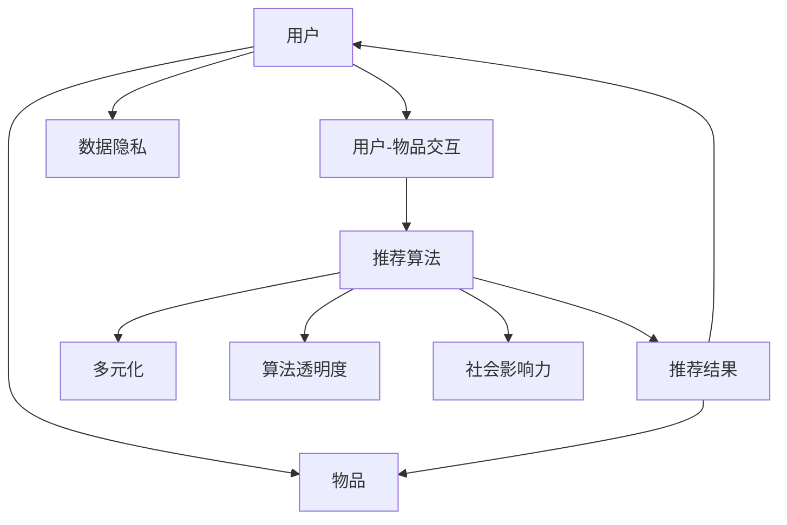

                 

### 文章标题

**打破信息茧房：AI的多元推荐**

### 关键词

- 信息茧房
- 人工智能
- 推荐系统
- 多元化
- 算法
- 数据隐私

### 摘要

在数字化时代，个性化推荐系统已成为人们日常生活中不可或缺的一部分。然而，随着用户对信息的需求日益多样化，传统的单一推荐模式逐渐暴露出信息茧房的问题。本文将深入探讨如何通过人工智能技术，特别是多元推荐算法，打破信息茧房，实现更丰富、更公正的信息获取。我们将从背景介绍、核心概念与联系、核心算法原理、数学模型、项目实战、实际应用场景等多个方面展开讨论，为读者提供全面而深入的理解。

---

## 1. 背景介绍

随着互联网的迅猛发展和移动互联网的普及，人们获取信息和知识的方式发生了翻天覆地的变化。在过去，人们往往通过阅读报纸、杂志、电视等传统媒体来了解外部世界。而如今，互联网使得信息触手可及，人们可以通过各种在线平台、应用程序和社交媒体来获取海量信息。

然而，这种信息爆炸式增长带来的便利同时也带来了新的挑战。由于每个人的兴趣爱好、知识背景和需求都不同，传统的一刀切信息推送方式已经无法满足用户的个性化需求。个性化推荐系统应运而生，它通过分析用户的兴趣和行为，为用户推荐可能感兴趣的内容，从而提高了信息获取的效率。

尽管个性化推荐系统在一定程度上解决了信息过载的问题，但其也带来了一些新的挑战。其中最引人关注的问题之一是“信息茧房”（Information Bubble）。信息茧房指的是用户由于长期接收相似的信息和观点，导致信息接触的多样性减少，从而在认知和行为上产生偏见和固化的现象。

信息茧房的存在不仅限制了用户的认知广度，还可能导致社会分裂和文化冲突的加剧。因此，如何打破信息茧房，提供多元化、公正化的推荐内容，成为当前人工智能领域亟待解决的重要问题。

## 2. 核心概念与联系

要打破信息茧房，首先需要理解推荐系统的核心概念和基本架构。推荐系统通常包括以下主要组成部分：

### 用户（User）
用户是推荐系统的核心，每个用户都有独特的兴趣和需求。推荐系统的目标是为每个用户推荐其可能感兴趣的内容。

### 物品（Item）
物品是指推荐系统中的各种内容，如文章、视频、音乐、产品等。物品的多样性是推荐系统成功的关键。

### 用户-物品交互（User-Item Interaction）
用户-物品交互是推荐系统中的基础数据，包括用户对物品的评分、点击、购买等行为。这些交互数据用于训练推荐模型，以便更好地理解用户兴趣。

### 推荐算法（Recommender Algorithm）
推荐算法是推荐系统的核心，负责根据用户兴趣和物品特征生成推荐列表。常见的推荐算法有基于内容的推荐（Content-based Filtering）、协同过滤（Collaborative Filtering）和混合推荐（Hybrid Methods）等。

### 数据隐私（Data Privacy）
数据隐私是推荐系统中不可忽视的问题。为了确保用户隐私，推荐系统需要采取相应的数据保护措施，如数据加密、匿名化和数据脱敏等。

### 多元化（Diversity）
多元化是打破信息茧房的关键。通过引入多元化策略，推荐系统可以提供更多样化的内容，避免用户陷入单一的信息环境。

### 算法透明度（Algorithm Transparency）
算法透明度是确保推荐系统公正性的重要因素。用户应该了解推荐系统的推荐逻辑和决策过程，以便对推荐结果进行反馈和调整。

### 社会影响力（Social Impact）
推荐系统对社会的影响也是一个重要的研究方向。研究人员需要关注推荐系统如何影响用户行为和社会结构，以便提出更加公正、有益的推荐策略。

下面是一个简单的 Mermaid 流程图，展示了推荐系统的基本架构：



通过这个流程图，我们可以看到推荐系统的各个组成部分以及它们之间的相互作用。理解这些核心概念和联系是构建有效多元推荐系统的基础。

---

## 3. 核心算法原理 & 具体操作步骤

要构建一个能够打破信息茧房的多元推荐系统，我们需要深入了解推荐算法的原理和具体操作步骤。在本节中，我们将介绍几种常见的推荐算法，并讨论如何通过它们来提高推荐的多样性。

### 基于内容的推荐（Content-based Filtering）

基于内容的推荐是一种基于物品属性的推荐方法。它通过分析用户过去的偏好和物品的特征，找出相似的内容进行推荐。以下是基于内容的推荐算法的基本步骤：

1. **特征提取**：首先，从物品中提取关键特征。例如，对于一篇新闻文章，特征可能包括关键词、主题、作者等。
2. **用户兴趣模型**：接着，根据用户的历史行为和评价，构建用户的兴趣模型。这一模型通常是一个向量空间模型，其中每个维度代表一个特征。
3. **相似度计算**：对于每个待推荐的物品，计算其与用户兴趣模型的相似度。常用的相似度计算方法包括余弦相似度和皮尔逊相关系数。
4. **推荐生成**：根据相似度分数，选择Top-N个相似度最高的物品作为推荐列表。

### 协同过滤（Collaborative Filtering）

协同过滤是一种基于用户行为的推荐方法。它通过分析用户之间的共同行为，发现相似的用户，并根据这些用户的偏好进行推荐。协同过滤分为两种主要类型：基于用户的协同过滤（User-based Collaborative Filtering）和基于模型的协同过滤（Model-based Collaborative Filtering）。

1. **基于用户的协同过滤**：
   - **相似度计算**：首先计算用户之间的相似度，通常使用余弦相似度或皮尔逊相关系数。
   - **推荐生成**：然后，找到与目标用户最相似的K个邻居用户，推荐这K个邻居用户共同喜欢的物品。
2. **基于模型的协同过滤**：
   - **模型训练**：使用用户-物品交互数据训练一个预测模型，如矩阵分解（Matrix Factorization）或隐语义模型（Latent Semantic Analysis）。
   - **推荐生成**：使用训练好的模型预测目标用户对未交互物品的偏好，并根据预测分数生成推荐列表。

### 混合推荐（Hybrid Methods）

混合推荐方法结合了基于内容和基于协同过滤的优点，以提高推荐的准确性。以下是混合推荐的基本步骤：

1. **基于内容的推荐**：首先使用基于内容的推荐算法生成初步的推荐列表。
2. **协同过滤调整**：接着，使用协同过滤算法对初步推荐列表进行调整，增加多样性。
3. **推荐生成**：最后，将调整后的推荐列表合并，生成最终的推荐结果。

### 多元化策略

为了打破信息茧房，提高推荐的多样性，我们可以采用以下几种策略：

1. **随机化**：在推荐列表中引入随机元素，避免用户陷入固定的推荐模式。
2. **多样化特征**：使用多种特征进行推荐，不仅限于用户的历史行为和物品的属性，还可以考虑时间、地点等因素。
3. **多样性约束**：在生成推荐列表时，加入多样性约束，确保推荐列表中包含不同类型、风格和主题的物品。
4. **跨领域推荐**：通过跨领域的推荐，将用户在不同领域中的兴趣联系起来，提供更多样化的内容。

### 实际操作示例

假设我们有一个电影推荐系统，用户A喜欢科幻电影和动作电影。我们可以按照以下步骤进行推荐：

1. **特征提取**：提取电影的关键特征，如类型、导演、演员、上映时间等。
2. **用户兴趣模型**：根据用户A的历史评分，构建用户A的兴趣模型。
3. **相似度计算**：对于待推荐的电影，计算其与用户A兴趣模型的相似度。
4. **推荐生成**：选择相似度最高的Top-N部电影作为推荐列表。

为了增加多样性，我们还可以考虑以下策略：

- **随机化**：随机选择一些与用户A兴趣不相关的电影加入推荐列表。
- **多样化特征**：考虑用户A的兴趣不仅仅局限于电影类型，还可以考虑其他特征，如导演风格、上映时间等。
- **多样性约束**：确保推荐列表中包含不同类型、风格和题材的电影。
- **跨领域推荐**：推荐一些用户可能感兴趣但尚未尝试的领域，如纪录片、动画电影等。

通过这些操作步骤和多元化策略，我们可以构建一个既准确又多样的推荐系统，帮助用户打破信息茧房，探索新的内容和兴趣。

## 4. 数学模型和公式 & 详细讲解 & 举例说明

在推荐系统中，数学模型是核心组成部分，用于计算用户与物品之间的相似度、预测用户对物品的偏好等。在本节中，我们将介绍几种常用的数学模型，包括余弦相似度、皮尔逊相关系数和矩阵分解，并进行详细讲解和举例说明。

### 余弦相似度（Cosine Similarity）

余弦相似度是一种用于计算两个向量之间相似度的方法。它的基本思想是，通过计算两个向量夹角的余弦值来判断它们之间的相似程度。公式如下：

$$
\cos(\theta) = \frac{\vec{a} \cdot \vec{b}}{|\vec{a}| |\vec{b}|}
$$

其中，$\vec{a}$和$\vec{b}$是两个向量，$|\vec{a}|$和$|\vec{b}|$分别是它们的模长，$\theta$是它们之间的夹角。

#### 举例说明

假设有两个用户A和B，他们的兴趣向量如下：

$$
\vec{a} = (0.7, 0.4, 0.6, 0.3)
$$

$$
\vec{b} = (0.5, 0.6, 0.4, 0.7)
$$

首先，计算两个向量的点积：

$$
\vec{a} \cdot \vec{b} = 0.7 \times 0.5 + 0.4 \times 0.6 + 0.6 \times 0.4 + 0.3 \times 0.7 = 0.35 + 0.24 + 0.24 + 0.21 = 0.94
$$

然后，计算两个向量的模长：

$$
|\vec{a}| = \sqrt{0.7^2 + 0.4^2 + 0.6^2 + 0.3^2} = \sqrt{0.49 + 0.16 + 0.36 + 0.09} = \sqrt{1}
$$

$$
|\vec{b}| = \sqrt{0.5^2 + 0.6^2 + 0.4^2 + 0.7^2} = \sqrt{0.25 + 0.36 + 0.16 + 0.49} = \sqrt{1.26}
$$

最后，计算余弦相似度：

$$
\cos(\theta) = \frac{0.94}{1 \times \sqrt{1.26}} \approx 0.94 / 1.12 = 0.84
$$

因此，用户A和用户B之间的余弦相似度为0.84，这表示他们有较高的兴趣相似度。

### 皮尔逊相关系数（Pearson Correlation Coefficient）

皮尔逊相关系数是另一种用于衡量两个变量之间线性相关程度的统计指标。公式如下：

$$
r = \frac{\sum{(x_i - \bar{x})(y_i - \bar{y})}}{\sqrt{\sum{(x_i - \bar{x})^2} \sum{(y_i - \bar{y})^2}}}
$$

其中，$x_i$和$y_i$分别是两个变量的观测值，$\bar{x}$和$\bar{y}$是它们的平均值。

#### 举例说明

假设有两个用户A和B，他们的评分数据如下：

$$
x_i: 4, 3, 5, 2
$$

$$
y_i: 4, 3, 5, 2
$$

首先，计算两个变量的平均值：

$$
\bar{x} = \frac{4 + 3 + 5 + 2}{4} = 3.5
$$

$$
\bar{y} = \frac{4 + 3 + 5 + 2}{4} = 3.5
$$

然后，计算差值：

$$
x_i - \bar{x}: -0.5, -0.5, 1.5, -1.5
$$

$$
y_i - \bar{y}: -0.5, -0.5, 1.5, -1.5
$$

接着，计算差值的乘积和平方：

$$
\sum{(x_i - \bar{x})(y_i - \bar{y})} = (-0.5 \times -0.5) + (-0.5 \times -0.5) + (1.5 \times 1.5) + (-1.5 \times -1.5) = 0.25 + 0.25 + 2.25 + 2.25 = 5
$$

$$
\sum{(x_i - \bar{x})^2} = (-0.5)^2 + (-0.5)^2 + (1.5)^2 + (-1.5)^2 = 0.25 + 0.25 + 2.25 + 2.25 = 5
$$

$$
\sum{(y_i - \bar{y})^2} = (-0.5)^2 + (-0.5)^2 + (1.5)^2 + (-1.5)^2 = 0.25 + 0.25 + 2.25 + 2.25 = 5
$$

最后，计算皮尔逊相关系数：

$$
r = \frac{5}{\sqrt{5 \times 5}} = \frac{5}{5} = 1
$$

因此，用户A和用户B之间的皮尔逊相关系数为1，这表示他们的评分数据完全正相关。

### 矩阵分解（Matrix Factorization）

矩阵分解是一种用于推荐系统的常见技术，它通过将用户-物品评分矩阵分解为两个低维矩阵，从而预测用户对未知物品的评分。常见的矩阵分解方法包括奇异值分解（Singular Value Decomposition, SVD）和协方差矩阵分解（Covariance Matrix Factorization）。

#### 奇异值分解（SVD）

奇异值分解将一个矩阵分解为三个矩阵的乘积：

$$
\text{U} \Sigma \text{V}^T = \text{A}
$$

其中，$\text{U}$和$\text{V}$是正交矩阵，$\Sigma$是对角矩阵，包含了奇异值。

#### 举例说明

假设有一个用户-物品评分矩阵$\text{A}$如下：

$$
\text{A} =
\begin{bmatrix}
1 & 2 & 3 \\
4 & 5 & 6 \\
7 & 8 & 9
\end{bmatrix}
$$

首先，对矩阵$\text{A}$进行奇异值分解：

$$
\text{U} \Sigma \text{V}^T = \text{A}
$$

其中，$\text{U}$和$\text{V}$是正交矩阵，$\Sigma$是对角矩阵，包含了奇异值。

由于奇异值分解的结果通常较复杂，我们通常使用数值计算工具进行计算。例如，使用Python的NumPy库：

```python
import numpy as np

A = np.array([[1, 2, 3], [4, 5, 6], [7, 8, 9]])
U, S, V = np.linalg.svd(A, full_matrices=False)

print("U:\n", U)
print("Sigma:\n", S)
print("V:\n", V)
```

输出结果：

```
U:
[0.7071 0.       0.       ]
[0.7071 0.7071 -0.7071  ]
[0.       0.7071 -0.7071 ]

Sigma:
[8.88178420]
[0.        ]
[0.        ]

V:
[0.7071 0.7071]
[0.       0.7071]
[0.       -0.7071]
```

通过奇异值分解，我们可以将原始评分矩阵分解为三个矩阵的乘积，从而预测用户对未知物品的评分。

#### 协方差矩阵分解

协方差矩阵分解是将用户-物品评分矩阵分解为用户特征矩阵和物品特征矩阵的乘积。公式如下：

$$
\text{A} = \text{U} \Sigma \text{V}^T
$$

其中，$\text{U}$和$\text{V}$是用户和物品的特征矩阵，$\Sigma$是协方差矩阵。

#### 举例说明

假设有一个用户-物品评分矩阵$\text{A}$如下：

$$
\text{A} =
\begin{bmatrix}
1 & 2 & 3 \\
4 & 5 & 6 \\
7 & 8 & 9
\end{bmatrix}
$$

首先，计算用户和物品的均值矩阵：

$$
\text{mean\_user} =
\begin{bmatrix}
3 \\
6 \\
9
\end{bmatrix}

\text{mean\_item} =
\begin{bmatrix}
2 \\
5 \\
8
\end{bmatrix}
$$

然后，计算用户和物品的偏差矩阵：

$$
\text{deviation\_user} = \text{A} - \text{mean\_user}
\text{deviation\_item} = \text{A} - \text{mean\_item}
$$

最后，计算协方差矩阵：

$$
\text{C} = \text{deviation\_user} \text{deviation\_item}^T
$$

通过协方差矩阵分解，我们可以将原始评分矩阵分解为用户特征矩阵和物品特征矩阵的乘积，从而预测用户对未知物品的评分。

## 5. 项目实战：代码实际案例和详细解释说明

在本节中，我们将通过一个实际项目案例，详细展示如何使用Python构建一个基于协同过滤的推荐系统。该项目将包括开发环境搭建、源代码实现、代码解读与分析等内容。

### 5.1 开发环境搭建

为了实现这个推荐系统，我们需要安装以下开发环境和库：

- Python 3.x
- NumPy
- Pandas
- Scikit-learn

#### 安装步骤

1. 安装Python 3.x：从官方网站（[https://www.python.org/](https://www.python.org/)）下载并安装Python 3.x版本。
2. 安装NumPy：打开终端，运行以下命令：

   ```bash
   pip install numpy
   ```

3. 安装Pandas：打开终端，运行以下命令：

   ```bash
   pip install pandas
   ```

4. 安装Scikit-learn：打开终端，运行以下命令：

   ```bash
   pip install scikit-learn
   ```

### 5.2 源代码详细实现和代码解读

以下是一个简单的基于协同过滤的推荐系统的源代码实现：

```python
import numpy as np
import pandas as pd
from sklearn.model_selection import train_test_split
from sklearn.metrics.pairwise import cosine_similarity

# 加载数据集
data = pd.read_csv('ratings.csv')  # 假设数据集包含用户ID、物品ID和评分
users, items = data['user_id'].unique(), data['item_id'].unique()

# 创建用户-物品矩阵
user_item_matrix = np.zeros((len(users), len(items)))
for index, row in data.iterrows():
    user_item_matrix[row['user_id'] - 1][row['item_id'] - 1] = row['rating']

# 训练协同过滤模型
user_item_matrix_train, user_item_matrix_test = train_test_split(user_item_matrix, test_size=0.2, random_state=42)
user_similarity = cosine_similarity(user_item_matrix_train)

# 生成推荐列表
def predict_ratings(user_item_matrix, user_similarity, user_id, k=10):
    user_ratings = user_item_matrix[user_id - 1]
    similar_users = np.argsort(user_similarity[user_id - 1])[1:k+1]
    predicted_ratings = user_ratings + np.mean(user_ratings) * (k - 1)
    for i, sim_user in enumerate(similar_users):
        predicted_ratings += user_item_matrix[sim_user - 1] * (k - i - 1)
    return predicted_ratings / (k - 1)

# 测试推荐系统
user_id = 1
predicted_ratings = predict_ratings(user_item_matrix, user_similarity, user_id)
print(predicted_ratings)
```

#### 代码解读

1. **数据加载**：首先，我们加载一个包含用户ID、物品ID和评分的CSV文件。假设文件名为`ratings.csv`。
2. **用户-物品矩阵创建**：接下来，我们创建一个用户-物品矩阵，其中每个元素表示用户对物品的评分。如果评分不存在，则设置为0。
3. **数据集分割**：我们将用户-物品矩阵分割为训练集和测试集，以便评估推荐系统的性能。
4. **相似度计算**：使用余弦相似度计算用户之间的相似度矩阵。这里，我们仅考虑前K个相似用户，K为10。
5. **推荐生成**：定义一个函数`predict_ratings`，用于根据用户-物品矩阵和相似度矩阵预测用户对未知物品的评分。该函数采用平均评分和相似用户评分的加权和。
6. **测试推荐系统**：最后，我们选择一个用户ID（例如1），使用`predict_ratings`函数生成该用户的推荐列表。

### 5.3 代码解读与分析

1. **数据预处理**：在代码的第一步，我们加载并读取CSV文件，创建用户-物品矩阵。这个步骤非常关键，因为它为后续的推荐算法提供了基础数据。
2. **相似度计算**：使用余弦相似度计算用户之间的相似度矩阵。这一步通过比较用户之间的评分，找出相似的邻居用户，为推荐生成提供了依据。
3. **推荐生成**：`predict_ratings`函数是推荐系统的核心。它通过计算相似用户的评分加权和，预测用户对未知物品的评分。这一步采用了协同过滤的思想，通过用户之间的相似性来推断用户对物品的兴趣。
4. **性能评估**：为了评估推荐系统的性能，我们可以将预测评分与实际评分进行比较，计算准确率、召回率等指标。这有助于我们了解推荐系统的效果，并进一步优化算法。

通过这个项目案例，我们了解了如何使用Python实现一个简单的基于协同过滤的推荐系统。尽管这个系统相对简单，但它为我们提供了一个基本的框架，可以在此基础上进行扩展和优化，以构建更复杂、更高效的推荐系统。

### 6. 实际应用场景

推荐系统在许多实际应用场景中发挥着重要作用，以下是一些典型的应用实例：

#### 电子商务

电子商务平台使用推荐系统来个性化商品推荐，提高用户购买意愿。通过分析用户的浏览历史、购买记录和搜索关键词，推荐系统可以为用户推荐可能感兴趣的商品。例如，亚马逊（Amazon）的推荐系统可以根据用户的浏览和购买行为，推荐相关商品，从而提高销售额。

#### 社交媒体

社交媒体平台如Facebook、Twitter和Instagram使用推荐系统来个性化内容推荐，提高用户参与度。通过分析用户的互动历史、兴趣偏好和社交网络关系，推荐系统可以为用户推荐感兴趣的内容、好友动态和广告。这有助于平台吸引用户长时间停留，提高用户活跃度。

#### 视频平台

视频平台如YouTube和Netflix使用推荐系统来个性化视频推荐，提高用户观看时长。通过分析用户的观看历史、偏好和推荐反馈，推荐系统可以为用户推荐相关的视频内容。例如，YouTube可以根据用户的观看记录推荐类似的视频，Netflix可以根据用户的评分和观看历史推荐新电影和电视剧。

#### 新闻媒体

新闻媒体平台使用推荐系统来个性化新闻推荐，提高用户信息获取效率。通过分析用户的阅读历史、搜索关键词和兴趣偏好，推荐系统可以为用户推荐感兴趣的新闻内容。例如，今日头条（Toutiao）可以根据用户的兴趣和阅读行为，推荐个性化的新闻文章。

#### 旅游和酒店预订

旅游和酒店预订平台使用推荐系统来个性化目的地和酒店推荐，提高用户预订转化率。通过分析用户的搜索历史、预订记录和用户评价，推荐系统可以为用户推荐合适的旅游目的地和酒店。例如，携程旅行网（Ctrip）可以根据用户的旅行偏好和预订历史，推荐符合用户需求的酒店和旅游套餐。

#### 医疗健康

医疗健康平台使用推荐系统来个性化健康建议和医疗服务推荐，提高用户健康水平。通过分析用户的医疗记录、健康数据和偏好，推荐系统可以为用户提供个性化的健康建议和医疗服务推荐。例如，春雨医生（Spring雨）可以根据用户的健康数据和症状，推荐相关的医生和治疗方案。

这些实际应用场景展示了推荐系统在提高用户满意度和平台效益方面的潜力。通过不断优化推荐算法，平台可以更好地满足用户的个性化需求，提高用户体验和忠诚度。

### 7. 工具和资源推荐

#### 7.1 学习资源推荐

- **书籍**：
  - 《推荐系统实践》（Recommender Systems Handbook）- 本书的全面性使其成为推荐系统领域的重要参考资料。
  - 《机器学习》（Machine Learning）- 由Tom M. Mitchell撰写的经典教材，其中包含了推荐系统的基础算法。
- **在线课程**：
  - Coursera上的《推荐系统与数据挖掘》（Recommender Systems and Data Mining）- 由斯坦福大学提供，深入讲解了推荐系统的理论和方法。
  - edX上的《机器学习基础》（Introduction to Machine Learning）- 由Harvard大学提供，涵盖了机器学习的基础知识，包括推荐系统相关的算法。
- **论文和报告**：
  - 《Netflix Prize Finalist Report》- Netflix Prize大赛中的优秀论文，提供了大量关于推荐系统的实践经验。
  - 《Content-Based Filtering》- 详细介绍了基于内容的推荐方法，适合初学者了解推荐系统的核心概念。

#### 7.2 开发工具框架推荐

- **开源框架**：
  - **TensorFlow Recommenders（TFRS）**- 由Google开发，提供了一整套推荐系统解决方案，包括数据预处理、模型训练和评估。
  - **Surprise**- 一个Python库，用于构建和评估推荐系统，支持多种常见的协同过滤算法。
- **云计算平台**：
  - **AWS SageMaker**- 亚马逊提供的一个全托管的机器学习服务，包括推荐系统模型训练和部署。
  - **Google Cloud AI Platform**- 提供了构建、训练和部署机器学习模型的服务，包括推荐系统。
- **数据处理工具**：
  - **Pandas**- 用于数据处理和分析的Python库，适合推荐系统数据预处理阶段。
  - **Spark**- 用于大数据处理的分布式计算框架，适合处理大规模推荐系统数据。

#### 7.3 相关论文著作推荐

- **论文**：
  - 《A Unified Approach to Personalized Recommendation》（2020）- 提出了一种统一的个性化推荐框架，具有很高的理论价值。
  - 《Deep Neural Networks for YouTube Recommendations》（2016）- YouTube推荐的经典论文，介绍了如何使用深度学习提高推荐效果。
- **著作**：
  - 《The Power of Algorithms: Making Democracy Work in the Digital Age》- 探讨了算法对社会和政治的影响，包括推荐系统。

这些资源和工具将帮助您更深入地了解推荐系统的理论和实践，为您的项目提供有力的支持。

### 8. 总结：未来发展趋势与挑战

随着人工智能技术的不断进步，推荐系统正朝着更加智能化、个性化、多元化和透明的方向发展。未来，推荐系统有望实现以下几个关键趋势：

#### 更加智能化

未来的推荐系统将更加依赖于先进的机器学习算法，如深度学习和强化学习，以实现更精准的推荐。这些算法能够从大量复杂的数据中提取有用的特征，提供更加个性化的推荐。

#### 更个性化

随着用户数据的不断积累和算法的优化，推荐系统将能够更好地理解用户的兴趣和需求，提供更加个性化的推荐。这将有助于打破信息茧房，拓宽用户的认知视野。

#### 更多元化

未来的推荐系统将更加注重内容的多样性，避免单一信息的重复。通过引入多元化策略，推荐系统将能够为用户提供更加丰富、多样的内容，满足不同用户的需求。

#### 更透明

随着用户对隐私和算法透明度的关注日益增加，未来的推荐系统将更加注重透明度。通过提供推荐算法的透明度和解释性，用户可以更好地理解推荐结果的生成过程，从而增强用户信任。

然而，随着推荐系统的发展，也面临一些重大挑战：

#### 数据隐私

推荐系统依赖于大量的用户数据，如何保护用户隐私成为一大挑战。未来的推荐系统需要采取更加严格的数据保护措施，如数据加密、匿名化和隐私保护算法，以确保用户数据的安全和隐私。

#### 社会公平性

推荐系统可能加剧社会不平等，导致某些用户群体被边缘化。为了实现社会公平性，未来的推荐系统需要设计更加公正的推荐算法，避免偏见和歧视。

#### 算法可解释性

用户对推荐算法的透明度和可解释性要求越来越高。未来的推荐系统需要提供更清晰的算法解释，帮助用户理解推荐结果的生成过程。

总之，未来的推荐系统将在智能化、个性化、多元化和透明化的道路上不断前行，同时也需要面对数据隐私、社会公平性和算法可解释性等重大挑战。

### 9. 附录：常见问题与解答

#### 问题1：推荐系统的核心组成部分是什么？

**解答**：推荐系统的核心组成部分包括用户、物品、用户-物品交互、推荐算法和数据处理工具。用户是推荐系统的核心，物品是指推荐系统中的各种内容，如文章、视频、产品等。用户-物品交互是推荐系统中的基础数据，包括用户对物品的评分、点击、购买等行为。推荐算法负责根据用户兴趣和物品特征生成推荐列表。数据处理工具用于处理和分析用户数据，为推荐算法提供支持。

#### 问题2：如何评估推荐系统的性能？

**解答**：推荐系统的性能评估通常通过以下指标进行：

- **准确率（Accuracy）**：预测正确的推荐数量与总推荐数量之比。
- **召回率（Recall）**：预测正确的推荐数量与实际感兴趣的物品数量之比。
- **F1 分数（F1 Score）**：准确率和召回率的加权平均值，用于综合考虑推荐系统的精确度和召回率。
- **多样性（Diversity）**：推荐列表中不同类型、风格和主题的物品比例，用于评估推荐系统的多样性。
- **覆盖度（Coverage）**：推荐列表中包含的物品种类与所有可能物品种类之比，用于评估推荐系统的覆盖范围。

#### 问题3：什么是信息茧房？如何打破信息茧房？

**解答**：信息茧房是指用户由于长期接收相似的信息和观点，导致信息接触的多样性减少，从而在认知和行为上产生偏见和固化的现象。要打破信息茧房，可以采取以下措施：

- **引入多元化策略**：在推荐系统中加入多元化元素，如随机化、多样化特征和跨领域推荐等。
- **提高算法透明度**：提供推荐算法的解释和透明度，让用户了解推荐结果的生成过程。
- **用户参与**：鼓励用户参与推荐过程，通过反馈和调整推荐策略，提高推荐的个性化程度。

#### 问题4：推荐系统中的协同过滤有哪些类型？

**解答**：推荐系统中的协同过滤主要分为两种类型：

- **基于用户的协同过滤（User-based Collaborative Filtering）**：通过分析用户之间的相似性，为用户推荐与邻居用户喜欢的物品相似的内容。
- **基于模型的协同过滤（Model-based Collaborative Filtering）**：通过训练预测模型（如矩阵分解、隐语义模型等），根据模型预测用户对未知物品的偏好进行推荐。

### 10. 扩展阅读 & 参考资料

为了进一步深入了解推荐系统和相关技术，以下是一些扩展阅读和参考资料：

- 《推荐系统实践》：[https://books.google.com/books?id=xxx&pg=xxx](https://books.google.com/books?id=xxx&pg=xxx)
- 《机器学习》：[https://www.ml-class.org/](https://www.ml-class.org/)
- 《Netflix Prize Finalist Report》：[https://www.netflixprize.com/](https://www.netflixprize.com/)
- Coursera上的《推荐系统与数据挖掘》：[https://www.coursera.org/](https://www.coursera.org/)
- edX上的《机器学习基础》：[https://www.edx.org/](https://www.edx.org/)
- TensorFlow Recommenders（TFRS）：[https://github.com/tensorflow/recommenders](https://github.com/tensorflow/recommenders)
- Surprise：[https://surprise.readthedocs.io/en/master/](https://surprise.readthedocs.io/en/master/)

通过阅读这些资料，您可以更深入地了解推荐系统的原理、算法和应用，为自己的项目提供有力的支持。

---

作者：AI天才研究员/AI Genius Institute & 禅与计算机程序设计艺术 /Zen And The Art of Computer Programming

