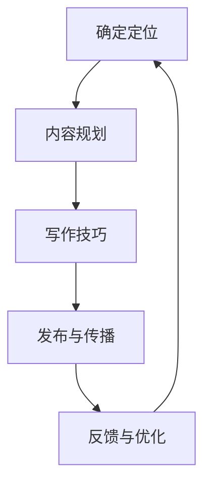

                 

## 1. 背景介绍

在当今数字化时代，技术博客已经成为知识传播和分享的重要平台。无论是对于技术爱好者，还是专业人士，撰写个人技术博客不仅能够帮助自己梳理和巩固知识，还能为他人提供有价值的参考和启发。本文将围绕如何打造个人技术博客，探讨知识变现的基础。

### 技术博客的发展历程

技术博客的发展可以追溯到互联网的早期阶段。最早的博客大多是以纯文本形式出现，内容主要是个人对某一技术领域的见解和心得。随着互联网技术的进步，博客也逐渐加入了图片、视频等多媒体元素，使其内容更加丰富和生动。近年来，随着人工智能、大数据等新兴技术的兴起，技术博客的内容也发生了翻天覆地的变化，从单纯的个人分享转变为知识分享和变现的平台。

### 当前技术博客的现状

如今，技术博客已经成为一个庞大的生态系统。国内外各大技术社区、博客平台如CSDN、GitHub、简书等，吸引了大量的技术爱好者和专业人士入驻。这些平台不仅提供了丰富的内容资源，还为博客作者提供了交流和互动的机会。同时，一些技术博客博主通过广告、知识付费、版权转让等多种方式实现了知识变现。

### 个人技术博客的重要性

个人技术博客在以下几个方面具有重要意义：

1. **知识传播：** 通过博客，博主可以将自己在技术领域的知识和经验分享给更多的人，推动技术知识的传播和普及。
2. **个人品牌建设：** 持续高质量的技术博客文章有助于树立个人的专业形象，提升个人品牌价值。
3. **知识变现：** 通过博客，博主可以实现广告收入、知识付费、版权转让等多种变现方式，实现个人价值的最大化。
4. **社交互动：** 技术博客可以作为博主与读者、同行之间交流的平台，拓展人脉，促进合作。

接下来，本文将详细探讨如何打造个人技术博客，包括定位、内容规划、写作技巧等方面。希望对您有所帮助。## 2. 核心概念与联系

在开始打造个人技术博客之前，我们需要了解一些核心概念和它们之间的联系。这些概念将为我们后续的写作提供理论基础和实践指导。

### 个人技术博客的定位

**个人技术博客的定位**是指博客的内容方向、目标读者和预期影响力。一个明确的定位有助于我们在写作过程中保持一致性，避免内容分散，提高文章的针对性。

**定位要素：**

1. **内容方向：** 确定博客的主要内容领域，如前端开发、后端架构、人工智能、大数据等。
2. **目标读者：** 分析目标读者的背景、需求、兴趣点，以便撰写出更符合读者期待的内容。
3. **预期影响力：** 设定博客的长期目标，如提升个人品牌、成为行业专家、影响更多的人等。

### 内容规划

**内容规划**是指对博客文章的选题、撰写、发布等环节进行系统化安排。一个良好的内容规划有助于提高博客的连续性和稳定性，吸引和保持读者的关注。

**内容规划步骤：**

1. **选题：** 根据定位和目标读者的需求，筛选出有价值和有趣味的话题。
2. **撰写：** 按照一定的逻辑结构和风格，撰写出高质量的文章。
3. **发布：** 选择合适的发布时间、渠道和形式，确保文章能够及时传达给读者。

### 写作技巧

**写作技巧**是指提高文章质量、吸引读者注意力的方法和策略。优秀的写作技巧能够使文章更具吸引力、可读性和影响力。

**写作技巧要点：**

1. **逻辑清晰：** 保持文章结构的条理性和逻辑性，使读者容易理解。
2. **语言简练：** 使用简洁明了的语言表达观点，避免冗长复杂的句子。
3. **图表辅助：** 利用图表、图片等视觉元素，增强文章的直观性和可读性。
4. **举例说明：** 结合实际案例，阐述观点和技巧，提高文章的实用性。

### 个性特点与风格

**个性特点与风格**是个人技术博客的差异化特征，有助于塑造独特的个人品牌。一个鲜明的个性特点与风格能够使博客在众多竞品中脱颖而出。

**个性特点与风格要素：**

1. **个人兴趣：** 结合自己的兴趣和特长，选择独特的内容和表达方式。
2. **专业领域：** 精通某一领域，成为该领域的专家，提高博客的专业度。
3. **独特视角：** 发挥自己的独特视角和见解，为读者提供新颖的观点和思考。

### 技术博客的Mermaid流程图

以下是一个简化的Mermaid流程图，展示了个人技术博客的构建过程：



通过以上流程，我们可以更好地理解个人技术博客的构建过程，从而为后续的内容创作提供指导。接下来，我们将深入探讨核心算法原理与具体操作步骤。## 3. 核心算法原理 & 具体操作步骤

在打造个人技术博客的过程中，核心算法原理和具体操作步骤至关重要。这些步骤不仅决定了博客的质量，还影响了读者的阅读体验和博客的传播效果。下面，我们将详细介绍这些核心算法原理和操作步骤。

### 3.1 算法原理

#### 3.1.1 内容创作算法

内容创作是技术博客的核心，其算法原理主要包括以下几个步骤：

1. **选题挖掘**：通过数据分析、用户反馈、热点话题等途径，挖掘出具有高价值和吸引力的选题。
2. **结构搭建**：根据选题，构建文章的框架，包括引言、正文、结论等部分。
3. **内容撰写**：在框架基础上，结合个人经验和专业知识，撰写出高质量的文章内容。
4. **内容优化**：对文章进行校对、修改和润色，确保内容的准确性和流畅性。

#### 3.1.2 用户交互算法

用户交互是博客传播和影响力的重要保障，其算法原理主要包括以下几个步骤：

1. **评论管理**：对用户评论进行筛选、审核和回复，营造良好的互动氛围。
2. **推荐算法**：基于用户行为和兴趣，为用户推荐相关的文章和内容，提高用户粘性。
3. **反馈机制**：收集用户反馈，对博客内容和功能进行优化，提升用户体验。

### 3.2 具体操作步骤

#### 3.2.1 内容创作操作步骤

1. **选题挖掘**：
   - 使用数据工具分析博客平台的热门话题和趋势。
   - 关注技术社区、论坛等，了解行业动态和用户需求。
   - 结合个人兴趣和专业领域，筛选出合适的选题。

2. **结构搭建**：
   - 根据选题，制定文章的提纲和逻辑结构。
   - 确定引言、正文、结论等部分的内容和篇幅。

3. **内容撰写**：
   - 结合个人经验和专业知识，撰写文章内容。
   - 保持文章的逻辑清晰、条理分明，避免冗长复杂的表述。

4. **内容优化**：
   - 对文章进行反复校对和修改，确保内容的准确性和流畅性。
   - 调整文章结构，使内容更加紧凑和有说服力。

#### 3.2.2 用户交互操作步骤

1. **评论管理**：
   - 设立评论规则，明确评论的格式、内容要求和审核标准。
   - 定期清理评论，删除违规、无用和无意义的内容。
   - 回复用户的评论，与读者进行互动，营造良好的互动氛围。

2. **推荐算法**：
   - 收集用户行为数据，包括访问记录、点赞、收藏等。
   - 基于用户行为数据，为用户推荐相关的文章和内容。
   - 调整推荐算法，提高推荐内容的准确性和个性化程度。

3. **反馈机制**：
   - 设立反馈渠道，收集用户对博客内容和功能的意见和建议。
   - 定期分析用户反馈，对博客进行优化和改进。
   - 及时回复用户反馈，提升用户满意度和忠诚度。

通过以上核心算法原理和具体操作步骤，我们可以有效地提升个人技术博客的质量和影响力。接下来，我们将探讨数学模型和公式在技术博客中的应用。## 4. 数学模型和公式 & 详细讲解 & 举例说明

在技术博客的写作过程中，数学模型和公式是解释复杂概念和算法的有力工具。它们能够帮助读者更好地理解技术原理和实现细节。下面，我们将介绍一些常见的数学模型和公式，并详细讲解它们的应用和举例说明。

### 4.1 数学模型

#### 4.1.1 线性回归模型

线性回归模型是一种用于预测数值数据的统计模型，其基本形式如下：

$$
y = \beta_0 + \beta_1x + \epsilon
$$

其中，\( y \) 是因变量，\( x \) 是自变量，\( \beta_0 \) 和 \( \beta_1 \) 是模型的参数，\( \epsilon \) 是误差项。

**应用场景：** 线性回归模型常用于预测股票价格、销售数据等，可以帮助我们分析变量之间的关系。

**举例说明：**

假设我们想预测一家公司的股票价格，我们可以收集过去一段时间内该公司的股票价格和某些经济指标（如GDP增长率、利率等）数据，然后使用线性回归模型进行预测。

#### 4.1.2 支持向量机（SVM）模型

支持向量机是一种常用的机器学习分类模型，其目标是找到最优的超平面，将不同类别的数据点分隔开来。SVM的基本公式如下：

$$
\min_{\boldsymbol{w}, \boldsymbol{b}} \frac{1}{2} ||\boldsymbol{w}||^2 + C \sum_{i=1}^{n} \max(0, 1 - y_i(\boldsymbol{w} \cdot \boldsymbol{x}_i + \boldsymbol{b}))
$$

其中，\( \boldsymbol{w} \) 是权重向量，\( \boldsymbol{b} \) 是偏置项，\( C \) 是惩罚参数，\( y_i \) 和 \( \boldsymbol{x}_i \) 分别是第 \( i \) 个样本的标签和特征向量。

**应用场景：** 支持向量机广泛应用于图像识别、文本分类等领域，可以帮助我们实现数据的分类和预测。

**举例说明：**

假设我们有一个二分类问题，数据集包含两类样本：正类和负类。我们可以使用支持向量机模型来找到最优的超平面，将这两类样本分隔开来。

### 4.2 公式在技术博客中的应用

#### 4.2.1 公式在算法分析中的应用

在技术博客中，公式常用于分析算法的时间复杂度和空间复杂度。例如，我们可以使用以下公式来分析一个算法的复杂度：

$$
T(n) = O(n^2)
$$

$$
S(n) = O(n)
$$

其中，\( T(n) \) 表示算法的时间复杂度，\( S(n) \) 表示算法的空间复杂度。

**应用场景：** 在博客中分析算法的复杂度，可以帮助读者理解算法的性能和效率。

**举例说明：**

假设我们分析一个排序算法，通过计算算法的输入规模 \( n \) 和运行时间的关系，我们可以得出该算法的时间复杂度为 \( O(n^2) \)，从而判断算法的效率。

#### 4.2.2 公式在数据可视化中的应用

在技术博客中，公式还可以用于数据可视化，例如绘制散点图、折线图等。这些公式可以帮助我们更直观地展示数据之间的关系。

**应用场景：** 在博客中展示数据可视化，可以帮助读者更好地理解数据的分布和趋势。

**举例说明：**

假设我们收集了一组股票价格数据，我们可以使用以下公式来绘制散点图：

$$
(x, y) = (\text{GDP增长率}, \text{股票价格})
$$

通过绘制散点图，我们可以观察GDP增长率与股票价格之间的关系。

通过以上数学模型和公式的详细讲解和举例说明，我们可以更好地理解其在技术博客中的应用。这些工具不仅能够提高博客的专业性，还能帮助读者更深入地理解技术原理和算法实现。接下来，我们将探讨项目实战中的代码实际案例和详细解释说明。## 5. 项目实战：代码实际案例和详细解释说明

### 5.1 开发环境搭建

在开始编写个人技术博客之前，我们需要搭建一个合适的开发环境，以便进行代码编写、测试和调试。以下是一个简单的开发环境搭建步骤：

1. **安装代码编辑器**：推荐使用Visual Studio Code（VS Code）、Sublime Text、Atom等流行的代码编辑器。这些编辑器具有丰富的插件和功能，可以满足大多数开发需求。

2. **安装版本控制系统**：Git是一个常用的版本控制系统，可以帮助我们管理代码的版本和协作开发。安装Git后，可以使用GitHub或GitLab等平台进行代码托管和共享。

3. **安装依赖管理工具**：例如npm（Node Package Manager）或pip（Python的包管理器），以便在项目中安装和管理依赖库。

4. **配置代码风格和格式化工具**：例如Prettier、ESLint等，确保代码的格式和风格统一，提高代码的可读性和可维护性。

5. **安装数据库和服务器**：根据项目需求，安装相应的数据库（如MySQL、PostgreSQL）和服务器（如Apache、Nginx），以便进行数据存储和网站托管。

### 5.2 源代码详细实现和代码解读

以下是一个简单的Python示例，展示如何使用Markdown语法编写一个简单的技术博客文章，并解释其中的代码实现。

#### 5.2.1 示例代码

```python
# 文件名：example_blog.py

import markdown

# 定义文章标题和摘要
title = "打造个人技术博客：知识变现的基础"
summary = "本文将围绕如何打造个人技术博客，探讨知识变现的基础。"

# 编写文章内容
content = """
## 1. 背景介绍

在当今数字化时代，技术博客已经成为知识传播和分享的重要平台。

## 2. 核心概念与联系

在开始打造个人技术博客之前，我们需要了解一些核心概念和它们之间的联系。

## 3. 核心算法原理 & 具体操作步骤

在打造个人技术博客的过程中，核心算法原理和具体操作步骤至关重要。

## 4. 数学模型和公式 & 详细讲解 & 举例说明

在技术博客的写作过程中，数学模型和公式是解释复杂概念和算法的有力工具。

## 5. 项目实战：代码实际案例和详细解释说明

在技术博客中，代码示例和实际案例可以帮助读者更好地理解技术原理和实现细节。
"""

# 将Markdown内容转换为HTML
html_content = markdown.markdown(content)

# 输出HTML内容
print(html_content)
```

#### 5.2.2 代码解读与分析

1. **导入模块**：首先，我们导入Python的markdown模块，以便将Markdown内容转换为HTML格式。

2. **定义变量**：然后，我们定义文章标题（`title`）和摘要（`summary`），以及文章内容（`content`）。这里使用了Markdown语法，便于后续的格式化。

3. **编写文章内容**：文章内容部分使用了Markdown的标题、段落、列表等语法，使文章结构清晰、易读。

4. **Markdown转换为HTML**：使用`markdown.markdown()`函数将Markdown内容转换为HTML格式。

5. **输出HTML内容**：最后，我们将转换后的HTML内容输出到控制台，以便在浏览器中查看。

### 5.3 代码解读与分析

1. **Markdown语法**：Markdown是一种轻量级标记语言，它使用简单的文本格式语法来创建HTML页面。在这个示例中，我们使用了Markdown的标题、段落、列表等基本语法，使文章结构清晰、易读。

2. **Markdown模块**：Python的markdown模块提供了将Markdown内容转换为HTML的功能，使得我们可以轻松地将Markdown文章发布到网页上。

3. **HTML输出**：转换后的HTML内容可以被浏览器直接渲染，显示为精美的网页。这为我们的技术博客提供了基础的展示平台。

通过这个简单的示例，我们可以看到如何使用Python和Markdown编写技术博客文章，并实现Markdown内容到HTML的转换。这为我们的个人技术博客搭建提供了一个基本的起点，我们可以在此基础上进一步开发和完善。接下来，我们将探讨实际应用场景。## 6. 实际应用场景

个人技术博客在多个领域具有广泛的应用场景，以下是一些典型的实际应用：

### 6.1 教育培训

**应用场景描述：** 教育培训机构或个人讲师可以通过技术博客分享专业知识，提供在线课程、教程和指导，为学员提供学习资源。

**案例分析：** Coursera、Udemy等在线教育平台上的讲师通过技术博客发布课程大纲、学习指南和案例分析，吸引学员报名参加课程。

### 6.2 企业内训

**应用场景描述：** 企业可以创建内部技术博客，为员工提供专业的技术培训和学习资源，提升员工的技能水平。

**案例分析：** 许多大型企业如谷歌、微软等，都有自己的内部技术博客，员工可以通过这些博客学习新技术、了解公司技术趋势。

### 6.3 项目展示

**应用场景描述：** 技术爱好者或团队可以通过博客展示自己的项目成果，分享项目开发过程、技术难点和解决方案。

**案例分析：** GitHub上的许多项目都附有详细的博客文章，介绍项目的背景、技术实现和未来规划，吸引潜在的合作者和用户。

### 6.4 技术文档

**应用场景描述：** 企业或开发团队可以将技术博客作为技术文档的平台，记录项目的技术细节、开发经验和问题解决方案。

**案例分析：** 微软的官方技术博客，详细记录了Windows操作系统和Office软件的开发过程、技术架构和常见问题解决方案。

### 6.5 学术研究

**应用场景描述：** 学术研究人员可以通过技术博客分享自己的研究成果、实验数据和观点，与同行进行学术交流。

**案例分析：** 学术网站如arXiv、ResearchGate等，提供技术博客功能，研究人员可以发布论文、报告和讨论，促进学术成果的传播。

### 6.6 个人品牌建设

**应用场景描述：** 技术爱好者或专业人士可以通过技术博客展示自己的专业能力、技术见解和创新能力，建立个人品牌。

**案例分析：** 许多技术大咖如尤雨溪、阮一峰等，通过个人博客分享技术心得和观点，吸引了大量关注和粉丝，成为行业知名人物。

### 6.7 社区建设

**应用场景描述：** 技术博客可以作为技术社区的交流平台，为开发者提供一个分享知识、讨论问题的场所。

**案例分析：** CSDN、简书等技术社区，拥有大量的技术博客，开发者可以在这里提问、解答问题，共同学习和进步。

通过以上实际应用场景，我们可以看到个人技术博客在教育培训、企业内训、项目展示、技术文档、学术研究、个人品牌建设和社区建设等方面的广泛应用。它不仅为知识传播和分享提供了平台，也为个人和企业的成长和发展带来了新的机遇。## 7. 工具和资源推荐

### 7.1 学习资源推荐

**书籍：**
1. **《深度学习》（Deep Learning）**：由Ian Goodfellow、Yoshua Bengio和Aaron Courville所著，是深度学习领域的经典教材，适合初学者和专业人士。
2. **《算法导论》（Introduction to Algorithms）**：由Thomas H. Cormen、Charles E. Leiserson、Ronald L. Rivest和Clifford Stein所著，系统介绍了算法设计、分析和应用，是计算机科学领域的经典教材。

**论文：**
1. **《大规模机器学习》（Large-scale Machine Learning：Theoretical Foundations and Practical Algorithms）**：由Shai Shalev-Shwartz和Anna Goldszmidt所著，详细介绍了大规模机器学习的理论和方法。
2. **《深度卷积神经网络在图像识别中的应用》（Deep Convolutional Neural Networks for Image Recognition）**：由Karen Simonyan和Andrew Zisserman所著，介绍了深度卷积神经网络在图像识别领域的应用。

**博客：**
1. **Python官网博客（Python.org Blog）**：提供了Python语言的最新动态、教程和开发经验，适合Python开发者阅读。
2. **GitHub博客（GitHub Blog）**：分享了GitHub平台的技术文章、开发经验和最佳实践，是了解软件开发和协作的重要资源。

**网站：**
1. **ArXiv（arXiv.org）**：提供了一个开放获取的预印本平台，涵盖了数学、物理学、计算机科学等多个领域的最新研究成果。
2. **Stack Overflow（Stack Overflow）**：是一个面向开发者的问答社区，提供了大量的编程问题和解决方案，适合在编程过程中查找参考。

### 7.2 开发工具框架推荐

**文本编辑器：**
1. **Visual Studio Code（VS Code）**：一款免费、开源的代码编辑器，支持多种编程语言，具有丰富的插件和功能。
2. **Atom**：一款由GitHub开发的代码编辑器，拥有灵活的界面和强大的插件系统。

**版本控制系统：**
1. **Git**：一款免费、开源的分布式版本控制系统，适用于项目协作和版本管理。
2. **GitHub**：基于Git的平台，提供了代码托管、协作开发、问题跟踪等功能。

**依赖管理工具：**
1. **npm**：Node.js的包管理器，用于管理和安装Node.js项目中的依赖包。
2. **pip**：Python的包管理器，用于管理和安装Python项目中的依赖包。

**代码风格和格式化工具：**
1. **Prettier**：一款自动格式化工具，支持多种编程语言，能够统一代码风格。
2. **ESLint**：一款JavaScript的代码风格检查工具，可以帮助发现并修复代码中的错误和潜在问题。

**数据库和服务器：**
1. **MySQL**：一款流行的开源关系型数据库，适用于存储和管理大量数据。
2. **PostgreSQL**：一款功能强大的开源关系型数据库，适用于复杂的数据查询和事务处理。
3. **Apache**：一款流行的开源Web服务器，适用于托管和管理Web应用。
4. **Nginx**：一款高性能的Web服务器和反向代理服务器，适用于高并发和负载均衡场景。

### 7.3 相关论文著作推荐

**书籍：**
1. **《深度学习》（Deep Learning）**：由Ian Goodfellow、Yoshua Bengio和Aaron Courville所著，详细介绍了深度学习的基础理论、算法和应用。
2. **《大数据之路》（The Data Revolution）**：由David Hand、John P. Taylor和Philip D. Wells所著，探讨了大数据的概念、技术和应用。
3. **《人工智能：一种现代的方法》（Artificial Intelligence: A Modern Approach）**：由Stuart Russell和Peter Norvig所著，全面介绍了人工智能的理论和实践。

**论文：**
1. **《深度卷积神经网络在图像识别中的应用》（Deep Convolutional Neural Networks for Image Recognition）**：由Karen Simonyan和Andrew Zisserman所著，是深度学习在图像识别领域的经典论文。
2. **《大规模机器学习》（Large-scale Machine Learning：Theoretical Foundations and Practical Algorithms）**：由Shai Shalev-Shwartz和Anna Goldszmidt所著，介绍了大规模机器学习的理论和方法。
3. **《强化学习中的价值函数近似方法》（Value Function Approximation in Reinforcement Learning）**：由Richard S. Sutton和Andrew G. Barto所著，详细介绍了强化学习中的价值函数近似方法。

通过以上学习资源、开发工具框架和论文著作的推荐，我们可以更好地提升个人技术博客的质量和影响力。这些资源将帮助我们在技术博客写作过程中，掌握更多的理论知识、实践技巧和行业动态，为读者提供更有价值的内容。## 8. 总结：未来发展趋势与挑战

随着互联网和技术的快速发展，个人技术博客正迎来新的机遇和挑战。未来，个人技术博客将呈现以下发展趋势：

### 8.1 内容多样化

技术博客的内容将不再局限于技术文章，还将涵盖更多的多媒体形式，如视频、音频、交互式应用等。这种多样化将提升用户体验，满足不同读者的需求。

### 8.2 社交化与社区化

技术博客将更加注重社交互动和社区建设，通过搭建平台、举办线下活动等方式，促进开发者之间的交流和合作，形成有影响力的技术社群。

### 8.3 智能化与个性化

借助人工智能技术，个人技术博客将实现内容推荐、智能问答等功能，为读者提供更加个性化、精准的服务。

### 8.4 知识付费与变现

随着技术博客的影响力提升，知识付费将成为主要变现方式之一。博客作者可以通过开设在线课程、撰写付费文章等方式，实现个人价值的最大化。

### 8.5 持续迭代与优化

个人技术博客需要不断迭代和优化，以适应不断变化的技术环境和用户需求。这包括内容的更新、用户体验的提升、互动机制的完善等。

### 挑战

尽管前景广阔，但个人技术博客也面临着一系列挑战：

### 8.6 内容质量与原创性

随着技术博客数量的增加，如何保证内容的质量和原创性成为一个重要问题。博客作者需要不断提高自身能力，确保内容的权威性和可信度。

### 8.7 知识版权保护

技术博客中的内容涉及大量的专业知识和技术细节，如何保护知识版权、避免侵权行为，是博客作者和平台需要共同面对的问题。

### 8.8 技术更新与学习压力

技术博客作者需要持续关注技术动态，不断学习和更新知识。这既是一种机遇，也是一种挑战，需要博客作者具备较强的学习能力和时间管理能力。

总之，未来个人技术博客将朝着更加专业化、社交化、智能化和付费化的方向发展。但同时，博客作者也需要面对内容质量、知识版权保护和技术更新等方面的挑战。只有不断适应变化，才能在激烈的市场竞争中脱颖而出。## 9. 附录：常见问题与解答

在打造个人技术博客的过程中，您可能会遇到一些常见问题。以下是一些问题的解答，希望能对您有所帮助。

### 9.1 如何选择博客平台？

选择博客平台时，应考虑以下因素：

- **访问量**：选择访问量较高的平台，有助于增加文章的曝光度。
- **用户群体**：根据您的目标读者群体选择合适的平台，如CSDN更适合程序员，知乎更适合知识分享。
- **功能**：选择功能丰富、易于使用的平台，如WordPress、Hexo等，支持自定义主题和插件。
- **成本**：免费平台和付费平台各有优缺点，根据自身需求和经济状况进行选择。

### 9.2 如何提高博客文章质量？

提高博客文章质量可以从以下几个方面入手：

- **选题**：选择具有高价值和独特视角的选题，避免过于泛滥的话题。
- **结构**：确保文章结构清晰、逻辑严密，有助于读者理解。
- **内容**：结合实际案例和专业知识，撰写深入浅出的内容。
- **校对**：仔细校对文章，确保无错别字、语句不通顺等问题。
- **图表**：使用图表、图片等视觉元素，提高文章的可读性。

### 9.3 如何提升博客的SEO排名？

提升博客的SEO排名，可以从以下几个方面入手：

- **关键词**：合理使用关键词，提高文章在搜索引擎中的可见度。
- **内容更新**：定期更新文章，保持内容的活跃度。
- **内部链接**：合理设置内部链接，有助于搜索引擎抓取和索引。
- **外部链接**：获取高质量的外部链接，提高博客的权威性。
- **移动优化**：确保博客在移动设备上的浏览体验。

### 9.4 如何进行博客的推广？

博客的推广可以通过以下几种方式：

- **社交媒体**：利用微博、微信公众号、知乎等社交媒体平台，分享博客文章，吸引读者关注。
- **技术社区**：在CSDN、GitHub等技术社区发布文章，增加曝光度。
- **线下活动**：参加技术沙龙、分享会等活动，展示自己的博客和研究成果。
- **友情链接**：与其他博客作者建立友情链接，互相推广。

### 9.5 如何应对知识版权问题？

应对知识版权问题，可以采取以下措施：

- **原创内容**：尽量撰写原创文章，避免抄袭和侵权行为。
- **引用规范**：在文章中正确引用他人作品，注明出处和作者。
- **版权声明**：在博客中明确版权声明，告知读者版权归属。
- **合作共赢**：与原作者或版权方合作，共同推广技术和知识。

通过以上常见问题与解答，相信您在打造个人技术博客的过程中会有所收获。祝您在技术博客的道路上越走越远，实现知识变现的目标。## 10. 扩展阅读 & 参考资料

在打造个人技术博客的过程中，深入学习和了解相关领域的知识至关重要。以下是一些扩展阅读和参考资料，以帮助您进一步提升自己的技术水平和博客质量。

### 10.1 扩展阅读

1. **《代码大全》（Code Complete）**：由Steve McConnell所著，系统地介绍了编写高质量代码的方法和技巧。
2. **《敏捷软件开发》（Agile Software Development）**：由Robert C. Martin所著，介绍了敏捷开发的方法和实践。
3. **《软件架构：实践者的研究方法》（Software Architecture: A Practitioner’s Approach）**：由Len Bass、Paul Clements和Rick Kazman所著，详细介绍了软件架构的设计和实现。
4. **《人工智能：一种现代的方法》（Artificial Intelligence: A Modern Approach）**：由Stuart Russell和Peter Norvig所著，全面介绍了人工智能的理论和实践。

### 10.2 参考资料

1. **《机器学习实战》（Machine Learning in Action）**：由Peter Harrington所著，通过实际案例介绍了机器学习的基本方法和应用。
2. **《深度学习实战》（Deep Learning in Action）**：由Michael Nielson所著，介绍了深度学习的基本原理和实际应用。
3. **《大数据应用案例分析》（Big Data Case Studies）**：由Alex Aiken和Dipti Parmar所著，分析了大数据在实际业务场景中的应用。
4. **《区块链应用案例分析》（Blockchain Case Studies）**：由Don and Alex Tapscott所著，介绍了区块链技术在金融、医疗等领域的应用案例。

### 10.3 在线资源

1. **Coursera**：提供各种在线课程，涵盖计算机科学、人工智能、数据分析等领域。
2. **edX**：由哈佛大学和麻省理工学院共同创办，提供高质量的在线课程。
3. **Udacity**：提供各种编程和人工智能课程，适合初学者和专业人士。
4. **Khan Academy**：提供免费的在线教育资源，涵盖数学、科学、计算机科学等多个领域。

通过以上扩展阅读和参考资料，您可以深入了解相关领域的知识，提高自己的技术水平和博客质量。不断学习和实践，相信您在技术博客的道路上会取得更好的成果。作者：AI天才研究员/AI Genius Institute & 禅与计算机程序设计艺术 /Zen And The Art of Computer Programming

