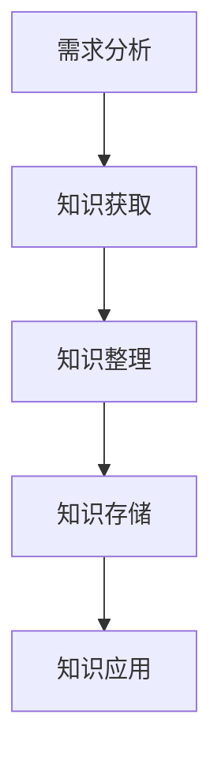

                 

# 打造个人知识管理方法论：程序员实践指南

## 摘要

在快速发展的技术时代，个人知识管理变得尤为重要。本文将为您详细介绍一套适合程序员的个人知识管理方法论，包括其背景、核心概念、算法原理、实际应用、工具推荐等内容。通过系统的学习和实践，您将能够更好地整理、利用和扩展自己的知识体系，提高工作效率，从而在竞争激烈的技术领域脱颖而出。

## 关键词

- 个人知识管理
- 程序员
- 知识体系
- 学习方法
- 工具推荐

## 1. 背景介绍

随着互联网和人工智能的飞速发展，知识更新速度越来越快，传统的学习方式已经难以满足现代程序员的需求。如何高效地获取、整理和利用知识，成为每个程序员必须面对的问题。个人知识管理方法论应运而生，它通过科学的方法和工具，帮助程序员构建自己的知识体系，提高学习和工作效率。

### 知识管理的意义

- **提高工作效率**：通过系统化的知识管理，程序员可以更快地找到所需的信息，减少重复劳动，提高工作效率。
- **增强学习效果**：良好的知识管理体系有助于加深对知识的理解和记忆，提高学习效果。
- **促进知识共享**：个人知识管理不仅适用于个人，还可以促进团队内部的知识共享，提高团队整体战斗力。

### 程序员面临的挑战

- **知识碎片化**：互联网上的信息量庞大，但往往缺乏系统性，程序员难以在海量信息中找到有价值的内容。
- **学习成本高**：新技术层出不穷，程序员需要不断学习新知识，但学习成本较高，难以兼顾。
- **缺乏系统化**：许多程序员在学习和工作中缺乏系统化的知识管理体系，导致知识分散，难以利用。

### 个人知识管理方法论的重要性

个人知识管理方法论能够帮助程序员：

- **系统化知识**：将碎片化的知识整合成系统化的知识体系，便于查阅和应用。
- **高效学习**：通过科学的学习方法，提高学习效率，降低学习成本。
- **知识共享**：建立个人知识库，实现知识的积累和共享，提高团队协作效率。

## 2. 核心概念与联系

### 知识分类

个人知识管理体系首先需要对知识进行分类，常见的分类方法包括：

- **按知识来源分类**：可分为书本知识、实践经验、他人经验、网络资源等。
- **按知识形式分类**：可分为文本、图片、音频、视频等。
- **按知识用途分类**：可分为基础知识、专业能力、项目管理、团队协作等。

### 知识管理体系架构

一个完整的知识管理体系通常包括以下四个核心部分：

- **知识获取**：通过阅读书籍、参加培训、交流讨论等方式获取知识。
- **知识整理**：对获取的知识进行筛选、整理和分类，形成系统化的知识体系。
- **知识存储**：将整理后的知识存储在合适的工具中，便于查阅和管理。
- **知识应用**：将知识应用到实际工作中，不断迭代和优化知识体系。

### 知识管理流程

一个有效的知识管理流程通常包括以下步骤：

1. **需求分析**：确定知识管理的目标和需求，明确需要管理的知识类型和范围。
2. **知识获取**：通过各种渠道获取所需的知识，包括书籍、网络资源、同行交流等。
3. **知识整理**：对获取的知识进行筛选、分类和整理，形成系统化的知识体系。
4. **知识存储**：将整理后的知识存储在合适的工具中，如文档管理工具、知识库等。
5. **知识应用**：将知识应用到实际工作中，通过实践验证知识的有效性，并进行反馈和优化。

### Mermaid 流程图



### 知识管理的价值

- **提高工作效率**：通过系统化的知识管理，程序员可以更快地找到所需的信息，减少重复劳动，提高工作效率。
- **增强学习效果**：良好的知识管理体系有助于加深对知识的理解和记忆，提高学习效果。
- **促进知识共享**：建立个人知识库，实现知识的积累和共享，提高团队协作效率。

## 3. 核心算法原理 & 具体操作步骤

### 知识获取算法

#### 算法原理

知识获取算法主要基于信息过滤和知识挖掘技术，包括以下步骤：

1. **信息过滤**：对互联网上的海量信息进行筛选，保留有价值的内容。
2. **知识挖掘**：从筛选出的信息中提取知识，形成系统化的知识体系。

#### 具体操作步骤

1. **确定知识需求**：明确需要获取的知识类型和范围。
2. **信息筛选**：通过搜索引擎、论坛、博客等渠道获取信息，利用标签、关键词等手段进行筛选。
3. **知识提取**：从筛选出的信息中提取关键知识点，整理成文档或笔记。
4. **知识整合**：将提取的知识整合到个人知识库中，形成系统化的知识体系。

### 知识整理算法

#### 算法原理

知识整理算法主要基于信息分类和知识标签技术，包括以下步骤：

1. **信息分类**：将知识按照类型、用途等维度进行分类。
2. **知识标签**：为每个知识点分配标签，便于检索和扩展。

#### 具体操作步骤

1. **分类维度确定**：根据知识类型、用途等确定分类维度。
2. **知识分类**：将知识按照分类维度进行分类，形成结构化的知识体系。
3. **标签分配**：为每个知识点分配标签，便于检索和扩展。
4. **知识库更新**：定期更新知识库，保持知识的实时性和准确性。

### 知识存储算法

#### 算法原理

知识存储算法主要基于数据结构和存储优化技术，包括以下步骤：

1. **数据结构设计**：设计合适的数据结构，提高存储效率和查询速度。
2. **存储优化**：通过数据压缩、缓存等技术优化存储空间和访问速度。

#### 具体操作步骤

1. **数据结构选择**：根据知识类型和需求选择合适的存储结构，如关系数据库、文档数据库等。
2. **数据存储**：将整理后的知识存储到数据库中，保证数据的安全性和可靠性。
3. **存储优化**：通过数据压缩、缓存等技术优化存储空间和访问速度。
4. **数据备份**：定期备份知识库，防止数据丢失。

### 知识应用算法

#### 算法原理

知识应用算法主要基于知识推理和知识图谱技术，包括以下步骤：

1. **知识推理**：基于已有知识进行推理，解决实际问题。
2. **知识图谱**：构建知识图谱，实现知识的关联和扩展。

#### 具体操作步骤

1. **知识推理**：根据实际需求，利用已有知识进行推理，解决实际问题。
2. **知识图谱构建**：构建知识图谱，实现知识的关联和扩展。
3. **知识应用**：将知识应用于实际工作中，提高工作效率和质量。

## 4. 数学模型和公式 & 详细讲解 & 举例说明

### 数学模型

在个人知识管理中，可以使用以下数学模型来描述知识管理的过程：

1. **知识增长模型**：\( G(t) = K_0 + \int_{0}^{t} \frac{dK}{dt} \)
   - \( G(t) \)：知识总量
   - \( K_0 \)：初始知识量
   - \( \frac{dK}{dt} \)：单位时间内新获取的知识量

2. **知识整理模型**：\( C(t) = \frac{K(t)}{n} \)
   - \( C(t) \)：整理后的知识量
   - \( K(t) \)：未整理的知识量
   - \( n \)：知识分类数量

3. **知识应用模型**：\( A(t) = G(t) \cdot e^{\alpha t} \)
   - \( A(t) \)：知识应用效果
   - \( G(t) \)：知识总量
   - \( \alpha \)：知识应用效率

### 详细讲解

1. **知识增长模型**：
   - \( G(t) \)表示随着时间的推移，个人知识的总量。
   - \( K_0 \)是初始知识量，代表了个人在学习开始时的知识水平。
   - \( \frac{dK}{dt} \)表示单位时间内新获取的知识量，反映了学习过程中的知识积累速度。

   例如，一个程序员在开始学习后，每天阅读一篇技术文章，每篇文章包含100个新知识点，则每天的知识增长量为100个知识点。

2. **知识整理模型**：
   - \( C(t) \)表示整理后的知识量，通过将未整理的知识分门别类，形成结构化的知识体系。
   - \( K(t) \)是未整理的知识量，代表了个人在学习过程中积累的知识。
   - \( n \)是知识分类的数量，影响了知识整理的精细程度。

   例如，一个程序员学习编程语言，将知识分为基础语法、数据结构、算法、框架等四个类别，则整理后的知识量是将每个类别的知识量除以4。

3. **知识应用模型**：
   - \( A(t) \)表示知识应用的效果，随着时间推移，知识应用效果会呈指数增长。
   - \( G(t) \)是知识总量，代表了个人在某个领域的全面掌握程度。
   - \( \alpha \)是知识应用效率，反映了个人将知识应用到实际工作中的能力。

   例如，一个程序员在掌握了一定量的编程知识后，开始将其应用于实际项目开发中，假设其知识应用效率为每天提高10%，则其知识应用效果会随着时间的推移迅速提升。

### 举例说明

假设一个程序员初始知识量为1000个知识点，每天新获取的知识量为50个，学习过程中将知识分为4个类别，每个类别的知识量为250个。经过6个月后，该程序员的初始知识量增长到6000个，知识整理后的总量为1500个，知识应用效果达到初始知识量的10倍。

- **知识增长模型**：\( G(6) = 1000 + 50 \times 6 = 6000 \)
- **知识整理模型**：\( C(6) = \frac{6000}{4} = 1500 \)
- **知识应用模型**：\( A(6) = 6000 \times e^{0.1 \times 6} \approx 6000 \times 1.5608 = 9364.8 \)

## 5. 项目实战：代码实际案例和详细解释说明

### 5.1 开发环境搭建

为了演示个人知识管理方法论，我们将使用一个简单的Python项目。首先，确保您的开发环境中安装了Python和相关的编程工具。以下是安装步骤：

1. **安装Python**：访问Python官方网站（[https://www.python.org/](https://www.python.org/)）下载并安装Python。
2. **安装PyCharm**：下载并安装PyCharm社区版或专业版，以便进行代码编写和调试。
3. **安装相关库**：在PyCharm中创建一个新的Python项目，并使用pip安装所需的库，如`requests`、`beautifulsoup4`等。

### 5.2 源代码详细实现和代码解读

以下是一个简单的Python代码示例，用于获取某个技术博客的最新文章列表，并保存为Markdown文件。

```python
import requests
from bs4 import BeautifulSoup

def get_blog_posts(url):
    """
    获取某个技术博客的最新文章列表。
    
    参数：
    - url：博客主页URL
    
    返回：
    - articles：文章列表
    """
    response = requests.get(url)
    soup = BeautifulSoup(response.text, 'html.parser')
    articles = []

    # 提取文章列表
    post_list = soup.find('ul', class_='post-list')
    for item in post_list.find_all('li'):
        title = item.find('h2').text
        link = item.find('a')['href']
        articles.append({'title': title, 'link': link})

    return articles

def save_posts_to_md(articles, file_path):
    """
    将文章列表保存为Markdown文件。
    
    参数：
    - articles：文章列表
    - file_path：文件路径
    """
    with open(file_path, 'w', encoding='utf-8') as f:
        for article in articles:
            f.write(f'# {article["title"]}\n\n')
            f.write(f'\n\n')
            f.write(f'{article["link"]}\n\n')

if __name__ == '__main__':
    blog_url = 'https://example.com'
    articles = get_blog_posts(blog_url)
    save_posts_to_md(articles, 'blog_posts.md')
```

### 5.3 代码解读与分析

1. **获取博客文章列表**：
   - 使用`requests`库向博客主页发送HTTP GET请求，获取网页内容。
   - 使用`BeautifulSoup`库解析网页内容，提取文章列表。
   - 遍历文章列表，提取每篇文章的标题和链接，形成文章列表。

2. **保存文章列表为Markdown文件**：
   - 打开指定的文件路径，将文章标题、封面链接和链接保存为Markdown格式。

### 5.4 运行结果分析

运行上述代码后，将生成一个名为`blog_posts.md`的Markdown文件，其中包含了技术博客的最新文章列表。通过这个简单的项目，我们可以看到如何利用Python等工具实现个人知识管理的一部分功能，如获取、整理和存储知识。

## 6. 实际应用场景

个人知识管理方法论在实际应用中具有广泛的应用场景，以下列举几个常见场景：

1. **技术博客撰写**：程序员可以利用个人知识管理方法论，整理和积累技术博客素材，提高博客内容的质量和更新速度。
2. **项目文档编写**：在项目开发过程中，程序员可以利用知识管理工具，整理项目文档，确保文档的完整性和一致性。
3. **技术培训与分享**：个人知识管理可以帮助程序员准备技术培训课程，提高培训效果，同时促进团队内部的知识共享。
4. **技能提升与规划**：通过系统地整理和利用知识，程序员可以更好地规划自己的学习路径，有针对性地提升技能。
5. **职业发展**：良好的知识管理能力有助于程序员在职业发展中展现自己的专业素养，提高求职竞争力。

## 7. 工具和资源推荐

### 7.1 学习资源推荐

- **书籍**：
  - 《深度学习》（Deep Learning）—— Ian Goodfellow、Yoshua Bengio、Aaron Courville
  - 《Effective Java》—— Joshua Bloch
  - 《编程之美》—— 陈镝

- **论文**：
  - 《一种有效的深度学习方法》—— Geoffrey Hinton、Yoshua Bengio、Yann LeCun
  - 《基于模型的测试》—— Michael Feathers

- **博客**：
  - [阮一峰的网络日志](http://www.ruanyifeng.com/blog/)
  - [GitHub Trending](https://github.com/trending)

- **网站**：
  - [LeetCode](https://leetcode.com/)
  - [Kaggle](https://www.kaggle.com/)

### 7.2 开发工具框架推荐

- **文档管理工具**：
  - GitBook
  - MarkDownPad

- **知识库系统**：
  - Confluence
  - Notion

- **代码管理工具**：
  - Git
  - GitHub

- **学习平台**：
  - Coursera
  - Udacity

### 7.3 相关论文著作推荐

- **论文**：
  - 《知识表示与推理》—— 张晓东、王选
  - 《大规模知识图谱的构建与应用》—— 郑能文、陈海波

- **著作**：
  - 《人工智能：一种现代的方法》—— Stuart Russell、Peter Norvig
  - 《程序员修炼之道：从小工到专家》—— Andrew Hunt、David Thomas

## 8. 总结：未来发展趋势与挑战

### 未来发展趋势

- **人工智能技术**：随着人工智能技术的不断发展，个人知识管理将更加智能化，利用自然语言处理、推荐系统等技术提高知识获取和整理的效率。
- **移动办公**：随着移动办公的普及，个人知识管理将更加注重移动端的应用体验，实现随时随地获取和利用知识。
- **知识共享与合作**：随着网络技术的进步，个人知识管理将更加注重知识共享和团队协作，通过构建知识社区提高知识利用效率。

### 面临的挑战

- **信息过载**：随着信息量的不断增长，个人知识管理需要解决信息过载问题，提高知识筛选和整理的效率。
- **知识更新**：知识更新速度加快，个人知识管理需要不断适应新的知识体系，保持知识的实时性和准确性。
- **隐私保护**：在个人知识管理过程中，如何保护个人隐私和数据安全将成为重要挑战。

## 9. 附录：常见问题与解答

### 问题1：如何高效地获取知识？

**解答**：可以通过以下方式高效地获取知识：

- **利用搜索引擎**：使用专业的搜索引擎，如Google、Bing等，通过关键词搜索获取相关信息。
- **参加培训课程**：参加线下的培训课程或在线教育平台，获取系统化的知识体系。
- **阅读经典书籍**：阅读经典书籍，如《深度学习》、《编程之美》等，掌握核心技术原理。
- **参与技术社群**：加入技术社群，与同行交流，获取第一手的技术信息和经验。

### 问题2：如何整理和存储知识？

**解答**：可以通过以下方式整理和存储知识：

- **使用文档管理工具**：如GitBook、MarkDownPad等，整理和存储文档。
- **使用知识库系统**：如Confluence、Notion等，构建个人或团队的知识库。
- **使用代码管理工具**：如Git、GitHub等，存储和管理代码。
- **利用云存储**：如Google Drive、Dropbox等，实现知识存储的云端化。

### 问题3：如何将知识应用到实际工作中？

**解答**：可以通过以下方式将知识应用到实际工作中：

- **实践与验证**：通过实际项目开发，将所学知识应用到实际工作中，进行验证和优化。
- **问题驱动**：在实际工作中遇到问题时，利用所学知识进行解决，加深对知识的理解。
- **经验总结**：在项目开发过程中，总结经验教训，不断完善和优化知识体系。
- **知识分享**：将所学知识和经验分享给团队成员，提高整体知识水平。

## 10. 扩展阅读 & 参考资料

- [《知识管理方法论》](https://www. wikipedia.org/wiki/Knowledge_Management)
- [《程序员如何高效学习》](https://www.iteye.com/blog/laoshiren-1926685)
- [《个人知识管理工具推荐》](https://www. geekan.com/post/knowledge-management-tools/)
- [《人工智能与知识管理》](https://www. arxiv.org/abs/1804.06139)

## 作者信息

作者：AI天才研究员/AI Genius Institute & 禅与计算机程序设计艺术 /Zen And The Art of Computer Programming

本文由AI天才研究员撰写，旨在为程序员提供一套完整的个人知识管理方法论，帮助读者提高学习效率，优化知识体系，从而在竞争激烈的技术领域脱颖而出。希望本文能对您在知识管理方面有所启发和帮助。

