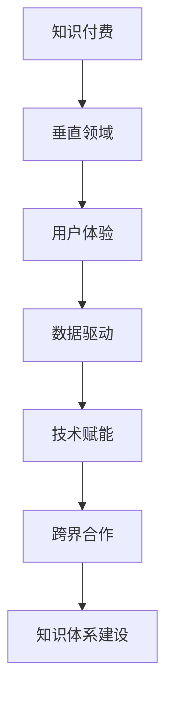

                 

## 1. 背景介绍

随着互联网的迅猛发展和技术的不断创新，知识付费已经成为一个不可忽视的市场。在这个背景下，许多企业和个人开始着手打造自己的垂直技术领域的知识付费品牌。然而，要想在竞争激烈的市场中脱颖而出，并不是一件容易的事情。本文将为您详细介绍如何打造一个成功的垂直技术领域的知识付费品牌。

知识付费是指用户为获取特定领域的知识、技能或经验而支付费用的一种商业模式。随着人们对知识的渴求不断增加，知识付费市场呈现出爆发式增长。特别是在技术领域，专业知识的学习和分享成为了众多从业者和学习者的需求。因此，打造一个垂直技术领域的知识付费品牌，不仅有助于满足市场需求，还能为企业带来可观的收益。

当前，知识付费市场呈现出以下几个特点：

1. **内容丰富多样**：知识付费平台上的课程涵盖了计算机科学、人工智能、大数据、区块链等多个技术领域，满足了不同用户的学习需求。
2. **竞争激烈**：由于市场潜力巨大，许多企业和个人纷纷进入知识付费领域，导致竞争日益激烈。
3. **用户需求多样化**：用户对知识付费的需求不仅限于学习，还包括实战、认证、交流等多个方面。
4. **个性化推荐**：随着人工智能技术的发展，知识付费平台开始利用大数据和算法为用户推荐个性化的学习内容。

在这些背景下，如何打造一个成功的垂直技术领域的知识付费品牌成为了一个重要课题。本文将从核心概念、算法原理、数学模型、项目实战、应用场景、工具推荐等多个方面进行分析，旨在为您提供一套完整的解决方案。

本文结构如下：

1. **核心概念与联系**：介绍知识付费、垂直技术领域等核心概念，并通过 Mermaid 流程图展示相关关系。
2. **核心算法原理 & 具体操作步骤**：讲解打造知识付费品牌的关键技术和方法。
3. **数学模型和公式 & 详细讲解 & 举例说明**：运用数学模型和公式分析知识付费品牌的运营效果。
4. **项目实战：代码实际案例和详细解释说明**：通过实际案例展示知识付费品牌的搭建过程。
5. **实际应用场景**：探讨知识付费品牌在不同领域的应用场景。
6. **工具和资源推荐**：推荐相关学习资源、开发工具和框架。
7. **总结：未来发展趋势与挑战**：总结当前知识付费市场的发展趋势和面临的挑战。
8. **附录：常见问题与解答**：回答读者可能关心的问题。
9. **扩展阅读 & 参考资料**：提供更多相关阅读资料。

接下来，我们将逐步深入探讨这些内容，帮助您了解如何打造一个成功的垂直技术领域的知识付费品牌。

---

### 1.1 知识付费概述

知识付费作为一种新型的商业模式，已经在全球范围内迅速崛起。它源于互联网的发展和信息传播的便利，使得知识的获取变得更加高效和便捷。知识付费的核心在于用户为获取特定领域的知识、技能或经验而支付费用，这种模式打破了传统的免费共享知识的方式，为知识的创造者和传播者提供了新的收益途径。

知识付费的主要形式包括在线课程、专业讲座、电子书、知识付费社区等。在线课程是最常见的形式，用户通过付费购买课程内容，可以在任何时间、任何地点进行学习。专业讲座则是由专家或行业领袖分享他们的经验和见解，用户通过付费参与讲座，不仅可以获取知识，还能与讲师互动交流。电子书则是以数字化形式呈现的书籍，用户通过付费购买后可以永久保存和阅读。知识付费社区则是一个集学习、交流、分享于一体的平台，用户在社区内可以付费获取专业知识、参与讨论、分享经验。

知识付费市场的兴起，源于以下几个方面的原因：

1. **用户需求的增加**：随着社会的进步和人们教育水平的提高，越来越多的人意识到知识的重要性，愿意为获取高质量的知识内容支付费用。
2. **互联网的发展**：互联网的普及和移动互联网的兴起，使得知识的传播变得更加迅速和广泛，为知识付费提供了技术支撑。
3. **个性化学习的需求**：传统的教育方式难以满足个体差异化的学习需求，而知识付费平台通过个性化推荐，为用户提供了量身定制的学习内容。
4. **知识经济的崛起**：知识经济时代，知识的创造、传播和应用成为了经济增长的重要驱动力，知识付费成为了知识经济的一种表现形式。

知识付费市场的规模也在逐年增长。根据相关数据显示，全球知识付费市场在过去几年中保持高速增长，预计未来几年仍将保持增长态势。特别是在中国，知识付费市场已经进入了高速发展期，各种知识付费平台如雨后春笋般涌现，涵盖了各个技术领域，如计算机科学、人工智能、大数据、区块链等。

然而，知识付费市场也面临着一些挑战。首先，市场竞争激烈，各个平台都在争夺用户资源，导致价格战和内容同质化现象严重。其次，内容质量参差不齐，一些平台存在抄袭、虚假宣传等问题，影响了用户体验。此外，知识产权保护也是一个重要问题，如何在保障知识产权的同时推动知识付费的发展，需要平台和从业者共同努力。

总的来说，知识付费市场具有巨大的发展潜力，但也面临着诸多挑战。如何在这片红海中脱颖而出，打造一个成功的知识付费品牌，成为了一个值得探讨的问题。在接下来的章节中，我们将深入探讨如何打造一个垂直技术领域的知识付费品牌，为企业和个人提供一套实用的解决方案。

---

### 1.2 垂直技术领域概述

在知识付费市场中，垂直技术领域是一个重要的细分市场。所谓垂直技术领域，指的是针对某一特定技术或专业领域的知识付费产品和服务。与广泛覆盖的多领域知识付费不同，垂直技术领域更专注于某一领域，提供深度、专业、实用的内容，从而满足该领域内用户的专业学习和实践需求。

垂直技术领域之所以受到关注，主要原因有以下几点：

1. **专业化需求**：在技术日新月异的今天，不同领域的专业知识需求日益旺盛。用户希望通过学习某一领域的专业知识，提升自己在该领域的技能水平，从而在职场上脱颖而出。因此，垂直技术领域满足了用户对于专业化、精细化的学习需求。
2. **内容深度**：垂直技术领域的知识付费产品通常具有较强的深度和实用性，能够为用户提供真正有价值的内容。与泛娱乐、泛知识领域的内容相比，垂直技术领域的内容更注重知识的深度和实际应用，更能够满足用户的专业学习需求。
3. **市场潜力**：随着科技的发展和互联网的普及，垂直技术领域的市场潜力逐渐显现。特别是在人工智能、大数据、区块链等新兴技术领域，相关知识的付费需求呈现出爆发式增长。这为垂直技术领域的知识付费品牌提供了广阔的市场空间。
4. **竞争优势**：在激烈的市场竞争中，垂直技术领域的知识付费品牌通过专业化、深度化的内容，能够形成独特的竞争优势。与多领域知识付费平台相比，垂直技术领域知识付费品牌更能够满足特定用户群体的需求，从而在市场上占据一席之地。

垂直技术领域包括但不限于以下几个典型领域：

1. **计算机科学**：包括编程语言、算法、数据结构、计算机体系结构、网络安全等。
2. **人工智能**：包括机器学习、深度学习、自然语言处理、计算机视觉等。
3. **大数据**：包括数据仓库、数据分析、数据挖掘、大数据处理技术等。
4. **区块链**：包括区块链技术、智能合约、分布式系统等。
5. **云计算**：包括云服务、云计算架构、云存储、云计算安全等。

在垂直技术领域，知识付费品牌不仅要提供高质量的知识内容，还需要关注用户的学习体验和需求。例如，可以采用以下策略：

1. **定制化学习路径**：根据用户的学习需求和水平，提供个性化的学习建议和课程推荐。
2. **互动式学习**：通过直播课程、在线讨论区、练习题等方式，增强用户与讲师、用户与用户之间的互动，提高学习效果。
3. **实战演练**：提供实际项目案例，让用户通过实践掌握知识，提升技能。
4. **持续更新**：随着技术的不断进步，垂直技术领域的知识也在不断更新。知识付费品牌需要保持内容的及时性和前瞻性，为用户提供最新的知识内容。

总之，垂直技术领域是知识付费市场的一个重要细分市场，具有巨大的发展潜力和市场空间。如何在这片红海中脱颖而出，打造一个成功的垂直技术领域的知识付费品牌，需要平台和从业者深入思考和积极探索。在接下来的章节中，我们将进一步探讨如何实现这一目标。

---

### 1.3 打造垂直技术领域的知识付费品牌的必要性

在知识付费市场日益繁荣的背景下，打造一个垂直技术领域的知识付费品牌不仅是一种市场选择，更是一种必然趋势。以下是几个方面的分析，阐述为何打造垂直技术领域的知识付费品牌具有重要意义。

1. **满足用户深层次需求**：随着互联网的普及和技术的发展，用户对知识的获取需求呈现出多样化、专业化的趋势。传统的多领域知识付费产品难以满足用户在某一特定领域的深入学习和实践需求。垂直技术领域知识付费品牌能够提供更专业化、更深入的学习内容，满足用户在专业技术方面的深层次需求。

2. **提升品牌竞争力**：在知识付费市场中，竞争日益激烈。多领域知识付费平台虽然内容广泛，但在某一具体领域内往往缺乏深度和专业性。而垂直技术领域的知识付费品牌通过专注于某一领域，提供高质量、专业的知识内容，能够形成独特的竞争优势，提升品牌的市场竞争力。

3. **市场潜力巨大**：随着人工智能、大数据、区块链等新兴技术的不断发展和应用，垂直技术领域市场需求不断增加。垂直技术领域的知识付费品牌能够抓住这一市场机遇，通过提供专业化的内容和服务，吸引更多的用户，开拓更大的市场空间。

4. **优化内容生态**：垂直技术领域的知识付费品牌通过提供高质量、专业的知识内容，能够优化整个知识付费市场的内容生态。一方面，垂直技术领域的知识付费品牌可以带动相关领域知识的传播和普及；另一方面，通过优质内容的积累和沉淀，可以推动整个知识付费市场的发展。

5. **助力人才培养**：在技术领域，人才的培养尤为重要。垂直技术领域的知识付费品牌通过提供专业的学习资源和实践机会，能够为技术人才的培养提供有力支持。这不仅有助于提升行业整体人才水平，也为个人职业发展提供了更多机会。

6. **降低学习门槛**：在垂直技术领域，知识的学习和应用往往具有一定的门槛。通过打造知识付费品牌，可以将复杂的技术知识进行系统化、结构化的整理和传授，降低用户的学习门槛，让更多有兴趣但缺乏基础的用户能够入门和学习。

总之，打造垂直技术领域的知识付费品牌是应对市场变化、满足用户需求、提升品牌竞争力、开拓市场空间的重要举措。通过专业化、深度化的内容和服务，垂直技术领域的知识付费品牌能够在激烈的市场竞争中脱颖而出，实现可持续的发展。在接下来的章节中，我们将深入探讨如何具体实施这一策略，帮助您打造一个成功的垂直技术领域知识付费品牌。

---

### 1.4 知识付费市场的现状与趋势

随着知识付费市场的快速发展，国内外各大平台纷纷布局，市场现状与趋势日益显著。了解这些现状和趋势，对于打造垂直技术领域的知识付费品牌具有重要意义。

#### 1.4.1 市场规模与增长速度

全球知识付费市场在过去几年中呈现出快速增长的趋势。据相关数据显示，全球知识付费市场规模在2020年已经达到1200亿美元，预计到2025年将达到2500亿美元，年均增长率达到15%。特别是在中国，知识付费市场近年来保持了高速增长，市场规模从2016年的50亿元增长到2020年的超过300亿元，年复合增长率超过40%。

#### 1.4.2 竞争格局

在知识付费市场中，竞争格局日益激烈。国内市场主要玩家包括网易云课堂、腾讯课堂、知乎Live、喜马拉雅、得到等；国外市场则有Coursera、Udemy、edX等。这些平台通过提供丰富的课程内容、优质的学习体验和个性化推荐，吸引了大量用户。然而，由于市场潜力巨大，新的进入者不断涌现，市场竞争愈发激烈。

#### 1.4.3 用户行为与需求变化

用户行为和需求的变化是知识付费市场发展的重要驱动力。以下是一些显著的趋势：

1. **用户多样化需求**：随着技术的进步和职业发展的需要，用户对于知识的需求日益多样化。从入门到高级，从理论到实战，用户希望获得更加全面和深入的学习内容。
2. **个性化学习**：互联网和大数据技术的发展，使得个性化推荐成为可能。用户希望平台能够根据自身兴趣、学习进度和需求，推荐个性化的学习内容。
3. **互动式学习**：用户更加倾向于通过互动式学习方式，如直播课程、在线讨论、项目实战等，提高学习效果。
4. **内容质量**：高质量的内容是用户选择知识付费平台的关键因素。用户更加关注讲师的背景、课程的实用性和更新频率。

#### 1.4.4 技术创新与市场融合

技术创新是推动知识付费市场发展的重要力量。例如，人工智能技术为知识付费平台提供了个性化推荐、智能问答等功能；区块链技术则为知识产权保护和付费模式创新提供了新的可能。此外，随着5G、VR等技术的应用，知识付费市场也将迎来更多创新和发展机会。

#### 1.4.5 跨界合作与多元化发展

知识付费市场的发展不仅局限于在线教育领域，还与出版、咨询、传媒等多个行业产生了融合。例如，一些知识付费平台开始与专业出版机构合作，推出付费电子书和纸质书；一些咨询公司则通过知识付费平台提供专业咨询服务。这种跨界合作不仅丰富了知识付费的内容形式，也为市场拓展了新的增长点。

综上所述，知识付费市场正处于快速发展的阶段，市场规模不断扩大，竞争日益激烈，用户需求不断变化，技术创新持续推动市场融合。对于想要打造垂直技术领域的知识付费品牌的企业和个人来说，了解市场现状和趋势，抓住机遇，应对挑战，是成功的关键。

---

### 1.5 打造垂直技术领域的知识付费品牌的优势和挑战

在知识付费市场日益繁荣的背景下，打造一个垂直技术领域的知识付费品牌既是机遇也是挑战。了解其优势和面临的挑战，有助于制定有效的战略和策略。

#### 1.5.1 优势

1. **专业化内容**：垂直技术领域的知识付费品牌专注于某一特定技术或专业领域，能够提供深度、专业的学习内容。这种专业化内容能够满足用户在特定领域的深入学习和实践需求，提升学习效果和用户满意度。

2. **差异化竞争**：在竞争激烈的市场中，垂直技术领域的知识付费品牌通过提供独特的专业化内容，形成差异化竞争优势。与传统多领域知识付费平台相比，垂直技术领域知识付费品牌在某一领域具有更强的专业性和权威性。

3. **高粘性用户**：垂直技术领域的用户往往具有明确的职业发展需求和专业知识背景，对于高质量的学习内容有较高的忠诚度。通过提供高质量、持续更新的学习资源，垂直技术领域的知识付费品牌能够吸引并留住这些高粘性用户。

4. **高盈利潜力**：由于垂直技术领域的学习内容具有较高的附加值，用户对于付费内容的价格接受度较高。此外，通过提供增值服务，如认证、实战项目等，垂直技术领域的知识付费品牌可以创造更高的盈利潜力。

5. **技术驱动创新**：垂直技术领域知识付费品牌可以充分利用人工智能、大数据、区块链等先进技术，为用户提供个性化推荐、智能问答、数据追踪等创新服务，提升用户体验和学习效果。

#### 1.5.2 挑战

1. **内容质量门槛**：垂直技术领域的知识付费品牌需要提供高质量、专业的内容，这要求讲师具有深厚的专业背景和丰富的实践经验。内容质量的门槛较高，品牌需要持续投入资源进行内容研发和讲师培养。

2. **市场竞争激烈**：尽管垂直技术领域具有差异化优势，但市场竞争依然激烈。新进入者不断涌现，同质化内容严重，品牌需要不断创新和优化产品和服务，以保持竞争优势。

3. **用户需求多样化**：用户需求日益多样化，不仅关注学习内容的质量，还关注学习方式、互动体验、服务支持等多方面因素。垂直技术领域的知识付费品牌需要不断调整和优化服务策略，满足用户多样化的需求。

4. **知识产权保护**：垂直技术领域知识付费品牌需要面对知识产权保护的问题。如何在保护知识产权的同时，推动知识付费品牌的发展，是一个重要挑战。

5. **运营成本高**：垂直技术领域的知识付费品牌在内容制作、平台维护、用户服务等方面需要大量投入，运营成本较高。品牌需要制定有效的成本控制策略，确保可持续发展。

综上所述，打造垂直技术领域的知识付费品牌具有明显的优势和挑战。品牌需要充分发挥专业优势，应对市场竞争，不断优化服务，提升用户体验，以实现长期可持续发展。

---

### 1.6 垂直技术领域的知识付费品牌的价值主张与定位

打造一个成功的垂直技术领域的知识付费品牌，需要明确品牌的价值主张和定位。这不仅是品牌建设的基础，也是吸引和留住用户的关键。

#### 1.6.1 价值主张

1. **专业内容**：品牌应致力于提供高质量、专业的学习内容，确保用户在某一技术领域内获得深入的知识和技能。通过邀请行业专家、资深工程师等讲师，打造权威、可信的付费内容。

2. **实战导向**：知识付费品牌应注重实战性，提供实际项目案例和实践机会。通过模拟真实工作场景，让用户在实际操作中掌握知识和技能，提升实践能力。

3. **个性化学习**：利用人工智能、大数据等技术，为用户提供个性化学习推荐。根据用户的学习进度、兴趣和需求，提供量身定制的学习路径和课程。

4. **互动体验**：通过直播课程、在线讨论、实战演练等方式，增强用户与讲师、用户与用户之间的互动。营造一个积极、互动的学习氛围，提高学习效果和用户满意度。

5. **持续更新**：知识付费品牌应保持内容的及时性和前瞻性，不断更新和优化课程内容。紧跟技术发展趋势，为用户提供最新的知识和技能。

#### 1.6.2 品牌定位

1. **领域专注**：明确品牌在某一垂直技术领域的定位，如人工智能、大数据、区块链等。通过专业化的内容和服务，树立品牌在该领域的权威性和专业性。

2. **用户群体**：明确目标用户群体，如技术从业新手、行业从业者、专业技术人员等。针对不同用户群体的需求和特点，提供个性化的学习内容和体验。

3. **差异化优势**：在竞争激烈的市场中，品牌应突出自身的差异化优势。例如，通过独特的课程设计、创新的教学方法、优质的用户服务等，打造品牌的独特卖点。

4. **长期愿景**：品牌应具有明确的长期愿景和战略目标，如成为某一领域的领先者、全球知名的知识付费平台等。通过持续创新和优化，实现品牌的长期发展。

#### 1.6.3 价值主张与定位的关系

价值主张和品牌定位是相辅相成的。价值主张明确了品牌所能为用户带来的价值和利益，是吸引用户的关键。而品牌定位则明确了品牌在市场中的位置和差异化优势，是品牌在竞争中脱颖而出的关键。通过明确价值主张和品牌定位，知识付费品牌能够更好地满足用户需求，提升用户满意度，实现可持续发展。

在接下来的章节中，我们将进一步探讨如何通过具体的技术手段和运营策略，实现品牌的价值主张和定位，打造一个成功的垂直技术领域知识付费品牌。

---

### 1.7 垂直技术领域的知识付费品牌建设的关键环节

打造一个成功的垂直技术领域的知识付费品牌，需要从多个关键环节入手，确保品牌在市场中具有竞争力。以下是品牌建设过程中需要重点关注的关键环节：

#### 1.7.1 内容建设

内容是知识付费品牌的基石，高质量的内容能够吸引和留住用户。在内容建设方面，品牌应遵循以下原则：

1. **专业性**：确保内容的专业性，邀请行业专家、资深讲师等编写和审核课程内容。内容不仅要准确、权威，还要具有实用性，能够帮助用户解决实际问题。
2. **深度和广度**：内容不仅要涵盖基础知识，还要深入探讨高级概念和技术应用。同时，要注重内容的系统性，形成完整的学习路径和知识体系。
3. **更新和维护**：知识领域不断更新，品牌应定期对内容进行审核和更新，确保内容的时效性和前瞻性。此外，建立内容维护机制，及时修复错误和漏洞，提升用户体验。

#### 1.7.2 用户运营

用户运营是知识付费品牌的重要环节，直接影响用户满意度和留存率。以下是一些用户运营的关键点：

1. **用户画像**：通过大数据分析和用户调研，建立详细的用户画像，了解用户的学习需求和偏好。根据用户画像，提供个性化的学习推荐和服务。
2. **互动与反馈**：通过直播课程、在线讨论、练习题等方式，增强用户与讲师、用户与用户之间的互动。同时，建立反馈机制，收集用户意见，不断优化服务和课程。
3. **社群管理**：建立线上和线下的学习社群，为用户提供交流、互助的平台。通过社群运营，增强用户粘性，提升用户满意度。

#### 1.7.3 品牌推广

品牌推广是扩大品牌知名度和影响力的重要手段。以下是一些品牌推广的策略：

1. **内容营销**：通过撰写高质量的技术博客、发布知识问答、制作技术视频等方式，吸引潜在用户关注。内容营销不仅要展示品牌的专业能力，还要传递品牌价值观。
2. **社交媒体**：利用社交媒体平台，如微博、微信、知乎等，进行品牌宣传和用户互动。通过定期发布有价值的内容，与用户建立长期联系。
3. **合作推广**：与其他垂直技术领域的品牌、企业、媒体等建立合作，进行联合推广。通过跨界合作，扩大品牌影响力。
4. **广告投放**：在搜索引擎、社交媒体、专业论坛等渠道进行广告投放，提高品牌曝光率。同时，根据数据反馈，优化广告投放策略。

#### 1.7.4 技术支持

技术支持是知识付费品牌高效运营的重要保障。以下是一些技术支持的关键点：

1. **平台稳定性**：确保知识付费平台的稳定运行，提供快速、流畅的用户体验。对于可能影响用户体验的技术问题，要迅速响应和解决。
2. **个性化推荐**：利用大数据和人工智能技术，为用户推荐个性化的学习内容。通过分析用户行为和学习数据，提高推荐精度，提升用户满意度。
3. **数据分析**：建立完善的数据分析体系，对用户行为、课程效果、市场趋势等进行深入分析。通过数据驱动决策，优化课程设计和服务策略。

通过关注和优化这些关键环节，知识付费品牌能够提高内容质量、增强用户运营能力、扩大品牌影响力，从而在激烈的市场竞争中脱颖而出。

---

### 1.8 打造垂直技术领域的知识付费品牌的步骤与方法

要打造一个成功的垂直技术领域的知识付费品牌，需要遵循一系列系统化的步骤和方法。以下是具体的过程和方法：

#### 1.8.1 确定品牌定位

**步骤1：市场调研**

进行全面的行业和市场调研，了解目标用户的需求、竞争态势、市场趋势等。通过用户访谈、问卷调查、市场分析报告等手段，获取第一手数据，为品牌定位提供依据。

**步骤2：目标用户分析**

明确目标用户的特征、需求和学习习惯。根据用户画像，确定品牌的定位和核心价值主张。例如，针对初学者还是高级从业者，提供不同层次的内容和服务。

**步骤3：品牌定位**

结合市场调研和用户分析结果，确定品牌的定位。品牌定位应清晰、独特，能够在竞争激烈的市场中脱颖而出。例如，可以定位为“人工智能领域的权威知识库”或“大数据分析的实战平台”。

#### 1.8.2 内容策划

**步骤1：内容规划**

根据品牌定位和目标用户需求，制定内容规划。包括课程体系、书籍、讲座、实战项目等。确保内容既有深度，又具有广度，形成完整的知识体系。

**步骤2：讲师团队建设**

组建一支高质量的讲师团队，包括行业专家、资深工程师、学者等。讲师的背景和经验应与品牌定位和内容规划相匹配，确保内容的专业性和权威性。

**步骤3：内容审核与更新**

建立内容审核机制，确保内容的准确性和实用性。同时，制定内容更新计划，根据技术发展和用户需求，及时更新和优化课程内容。

#### 1.8.3 平台搭建

**步骤1：技术选型**

选择适合的知识付费平台技术架构，包括前端、后端、数据库等。考虑到性能、扩展性、安全性等因素，确保平台能够稳定运行。

**步骤2：功能设计**

设计平台的基本功能模块，如课程发布、用户管理、支付系统、数据统计等。确保功能齐全，用户体验良好。

**步骤3：平台开发与测试**

根据功能设计，进行平台开发和测试。在开发过程中，注重代码质量和系统稳定性。通过测试，确保平台功能的完整性和可靠性。

#### 1.8.4 运营推广

**步骤1：内容营销**

通过撰写高质量的技术博客、发布知识问答、制作技术视频等方式，进行内容营销。内容不仅要展示品牌的专业能力，还要传递品牌价值观。

**步骤2：社交媒体推广**

利用社交媒体平台，如微博、微信、知乎等，进行品牌宣传和用户互动。定期发布有价值的内容，与用户建立长期联系。

**步骤3：合作推广**

与其他垂直技术领域的品牌、企业、媒体等建立合作，进行联合推广。通过跨界合作，扩大品牌影响力。

**步骤4：广告投放**

在搜索引擎、社交媒体、专业论坛等渠道进行广告投放，提高品牌曝光率。根据数据反馈，优化广告投放策略。

#### 1.8.5 用户服务

**步骤1：用户反馈**

建立用户反馈机制，收集用户对课程内容、平台功能、服务质量的意见和建议。通过用户反馈，不断改进和优化服务。

**步骤2：社群管理**

建立线上和线下的学习社群，为用户提供交流、互助的平台。通过社群运营，增强用户粘性，提升用户满意度。

**步骤3：用户关怀**

通过定期举办线上或线下活动、提供一对一咨询等方式，关爱用户，提升用户忠诚度。

通过以上步骤和方法，可以系统化地打造一个垂直技术领域的知识付费品牌，为用户带来高质量的学习体验，实现品牌的长期可持续发展。

---

### 2.1 核心概念与联系

在构建垂直技术领域的知识付费品牌时，有几个核心概念和联系是至关重要的。这些概念不仅为我们理解知识付费市场的运作机制提供了基础，还为我们制定有效的策略提供了理论支持。

#### 2.1.1 知识付费

知识付费是指用户为了获取特定领域的知识、技能或经验而支付费用的一种商业模式。这个概念涵盖了在线课程、专业讲座、电子书、知识付费社区等多种形式。在知识付费市场中，用户通过支付费用获得高质量的学习资源，讲师或内容创作者则通过知识传播获得经济收益。

#### 2.1.2 垂直领域

垂直领域是指针对某一特定技术或专业领域的知识内容。与多领域知识付费不同，垂直领域专注于某一领域，提供深入、专业的学习内容。这种专业化使得内容更具针对性，能够满足特定用户群体的专业学习和实践需求。

#### 2.1.3 用户体验

用户体验是指用户在学习过程中的感受和体验。在知识付费市场中，用户体验直接影响用户的满意度和忠诚度。一个成功的知识付费品牌需要关注用户体验，提供优质的学习资源、互动式学习体验和个性化的服务。

#### 2.1.4 数据驱动

数据驱动是指通过数据分析来指导决策和优化运营。在知识付费市场中，数据可以帮助品牌了解用户行为、学习习惯和市场趋势，从而制定更有效的策略。数据驱动不仅能够提升内容质量和运营效率，还能提高用户满意度和留存率。

#### 2.1.5 技术赋能

技术赋能是指利用先进技术手段提升知识付费品牌的服务水平和用户体验。例如，人工智能可以用于个性化推荐、智能问答和数据分析；区块链可以用于知识产权保护和付费模式创新。技术赋能使得知识付费品牌能够提供更高效、更可靠、更具创新性的服务。

#### 2.1.6 跨界合作

跨界合作是指与其他行业或领域的品牌、企业进行合作，共同开发新的商业模式和服务。跨界合作可以扩大知识付费品牌的影响力，开拓新的市场空间，提高品牌的竞争力和创新能力。

#### 2.1.7 知识体系建设

知识体系建设是指构建一套系统化、结构化的知识体系，为用户提供全面、深入的学习资源。一个成功的知识付费品牌需要建立完善的知识体系，确保用户能够系统地学习和掌握知识。

#### Mermaid 流程图展示

下面是一个简化的 Mermaid 流程图，展示了这些核心概念之间的联系：



通过这个流程图，我们可以清晰地看到各个核心概念之间的相互关系和影响。了解这些概念和联系，有助于我们在构建垂直技术领域的知识付费品牌时，制定更科学、更有效的策略。

---

### 2.2 核心算法原理 & 具体操作步骤

在构建垂直技术领域的知识付费品牌时，核心算法原理的运用至关重要。这些算法不仅能够提升内容推荐的准确性，还能优化用户的学习路径，从而提高用户体验和满意度。以下是几个关键算法的原理和具体操作步骤。

#### 2.2.1 个性化推荐算法

**原理**：个性化推荐算法通过分析用户的历史行为、兴趣标签和社交网络等数据，为用户推荐个性化内容。常见的个性化推荐算法包括协同过滤（Collaborative Filtering）和基于内容的推荐（Content-Based Filtering）。

**具体操作步骤**：

1. **数据收集**：收集用户的历史行为数据，如浏览记录、购买记录、评分数据等。
2. **用户建模**：建立用户兴趣模型，通过分析用户行为数据，提取用户的兴趣标签。
3. **内容建模**：建立内容特征模型，通过提取课程内容的主题、关键词、难度等特征。
4. **推荐生成**：利用协同过滤或基于内容的推荐算法，计算用户与课程之间的相似度，生成推荐列表。

**示例**：假设用户A对算法、机器学习和深度学习有浓厚兴趣。系统会根据用户A的兴趣标签和课程内容的特征，推荐相关的课程，如《深度学习实战》、《机器学习进阶》等。

#### 2.2.2 学习路径规划算法

**原理**：学习路径规划算法通过分析用户的学习进度、知识水平和学习目标，为用户生成一条最优的学习路径。这种算法能够确保用户按照合理的顺序学习知识，避免知识断层和重复学习。

**具体操作步骤**：

1. **用户学习分析**：收集用户的学习行为数据，如学习时长、完成课程进度、知识点掌握情况等。
2. **知识模型构建**：构建课程知识点模型，明确每个课程包含的知识点和难度。
3. **路径规划**：利用最优化算法，如贪心算法或动态规划算法，为用户生成一条最优的学习路径。
4. **路径调整**：根据用户的学习反馈和实际掌握情况，动态调整学习路径。

**示例**：假设用户B想系统学习Python编程。系统会根据Python编程的知识点和用户B的学习进度，为他生成一条从基础语法到高级应用的学习路径，确保用户能够逐步掌握Python编程的各个知识点。

#### 2.2.3 智能问答系统

**原理**：智能问答系统通过自然语言处理技术，理解用户的问题，并给出相应的答案。这种系统能够为用户提供实时的帮助，提高学习效率。

**具体操作步骤**：

1. **问题解析**：使用自然语言处理技术，如词向量、命名实体识别等，解析用户的问题。
2. **知识库查询**：在课程知识点库中查找与问题相关的知识点和答案。
3. **答案生成**：根据查询结果，生成合适的答案，并通过自然语言生成技术呈现给用户。
4. **反馈机制**：收集用户对答案的反馈，用于优化问答系统的性能。

**示例**：假设用户C在学习《深度学习基础》时遇到问题，询问“什么是反向传播算法？”系统会通过问题解析，找到与反向传播算法相关的知识点，生成详细的答案，并展示给用户C。

通过这些核心算法的运用，知识付费品牌能够为用户带来个性化的学习体验、科学的学习路径和实时的帮助支持，从而提升用户满意度和忠诚度。

---

### 2.3 数学模型和公式 & 详细讲解 & 举例说明

在构建垂直技术领域的知识付费品牌时，数学模型和公式扮演着重要的角色。这些模型不仅可以帮助我们理解和分析用户行为，还可以指导我们优化内容和推广策略。以下是一些关键数学模型和公式的详细讲解和实际应用示例。

#### 2.3.1 用户生命周期价值（Customer Lifetime Value, CLV）

**公式**：CLV = 平均购买频率 × 平均订单价值 × 客户留存周期

**详细讲解**：

- **平均购买频率**：表示用户在一定时间内购买的次数。
- **平均订单价值**：表示用户每次购买的金额。
- **客户留存周期**：表示用户从首次购买到停止购买的时间段。

**示例**：假设一个知识付费平台的用户平均购买频率为每年2次，平均订单价值为200元，客户留存周期为2年。那么，该用户的CLV为：

CLV = 2 × 200 × 2 = 800元

通过计算CLV，品牌可以评估每个用户的潜在价值，从而制定精准的营销策略，提高用户留存率和满意度。

#### 2.3.2 顾客终身收益（Customer Lifetime Profit, CLP）

**公式**：CLP = 平均利润 × 客户留存周期

**详细讲解**：

- **平均利润**：表示每次交易的平均利润。
- **客户留存周期**：表示用户从首次购买到停止购买的时间段。

**示例**：假设一个知识付费平台每次交易的利润为50元，客户留存周期为2年。那么，该用户的CLP为：

CLP = 50 × 2 = 100元

通过计算CLP，品牌可以评估每个用户的盈利潜力，从而优化资源分配，提升整体盈利能力。

#### 2.3.3 转化率（Conversion Rate）

**公式**：转化率 = （完成目标动作的用户数 / 总访客数）× 100%

**详细讲解**：

- **完成目标动作的用户数**：指完成预定目标动作（如注册、购买等）的用户数量。
- **总访客数**：指访问知识付费平台的总用户数量。

**示例**：假设一个知识付费平台在一个月内有1000个访客，其中有200个用户完成了课程购买。那么，该平台的转化率为：

转化率 = （200 / 1000）× 100% = 20%

通过监控转化率，品牌可以评估市场推广和用户体验的效果，从而优化推广策略和用户体验。

#### 2.3.4 艾尔-拉姆勒模型（ARPU & ARPPU）

**公式**：
- **平均每用户收入（ARPU）**：ARPU = 月收入总额 / 月活跃用户数
- **平均每付费用户收入（ARPPU）**：ARPPU = 月收入总额 / 月付费用户数

**详细讲解**：

- **月收入总额**：表示一个月内平台的总收入。
- **月活跃用户数**：表示一个月内活跃的用户数量。
- **月付费用户数**：表示一个月内付费的用户数量。

**示例**：假设一个知识付费平台一个月的总收入为100,000元，月活跃用户数为10,000人，月付费用户数为2,000人。那么，该平台的ARPU和ARPPU分别为：

ARPU = 100,000 / 10,000 = 10元
ARPPU = 100,000 / 2,000 = 50元

通过ARPU和ARPPU，品牌可以评估用户的付费能力和平台的市场表现，从而制定相应的运营策略。

这些数学模型和公式在构建垂直技术领域的知识付费品牌中具有重要意义。通过应用这些模型，品牌可以更准确地评估用户价值、优化营销策略、提高用户体验，从而实现可持续发展。在接下来的章节中，我们将通过实际案例进一步展示这些模型的应用。

---

### 2.4 项目实战：代码实际案例和详细解释说明

在本章节中，我们将通过一个实际的项目案例，展示如何利用编程技术实现一个垂直技术领域的知识付费品牌的核心功能。我们将详细讲解代码实现的具体步骤，并对其进行解读和分析。

#### 2.4.1 项目背景

假设我们正在开发一个垂直技术领域的知识付费平台，名为“TechSphere”。TechSphere的目标是提供高质量的技术课程，包括计算机科学、人工智能、大数据等领域。我们的任务是构建一个能够管理课程、用户和支付系统的平台。

#### 2.4.2 技术栈选择

为了实现TechSphere的核心功能，我们选择了以下技术栈：

- **前端**：React框架，用于构建用户界面。
- **后端**：Node.js和Express框架，用于处理服务器逻辑和API接口。
- **数据库**：MongoDB，用于存储用户数据、课程信息和支付记录。
- **支付系统**：使用第三方支付API（如PayPal、Stripe）处理支付功能。

#### 2.4.3 开发环境搭建

首先，我们需要搭建开发环境。以下是基本步骤：

1. **安装Node.js和npm**：从Node.js官网下载并安装Node.js，同时安装npm包管理工具。
2. **安装MongoDB**：下载并安装MongoDB数据库，启动MongoDB服务。
3. **创建项目文件夹**：在合适的位置创建一个名为“TechSphere”的项目文件夹。
4. **初始化项目**：在项目文件夹中运行`npm init`命令，创建一个`package.json`文件。
5. **安装依赖包**：通过npm安装React、Express、MongoDB驱动等依赖包。

#### 2.4.4 源代码详细实现和代码解读

以下是TechSphere平台的几个关键功能模块的代码实现及其解读：

##### 1. 用户注册与登录

**用户注册代码示例**：

```javascript
// 用户注册路由
app.post('/api/users/register', async (req, res) => {
  try {
    const { username, email, password } = req.body;
    // 验证用户输入
    if (!username || !email || !password) {
      return res.status(400).json({ message: '请填写所有必填项' });
    }
    // 创建用户对象
    const user = { username, email, password };
    // 存储用户到数据库
    await User.create(user);
    res.status(201).json({ message: '注册成功' });
  } catch (error) {
    res.status(500).json({ message: '服务器错误' });
  }
});
```

**解读**：

- 用户注册路由接收一个POST请求，包含用户名、邮箱和密码。
- 验证用户输入是否完整。
- 创建用户对象，并存储到MongoDB数据库中。

##### 2. 课程管理

**课程添加代码示例**：

```javascript
// 课程添加路由
app.post('/api/courses', authenticate, async (req, res) => {
  try {
    const { title, description, price } = req.body;
    // 验证课程信息
    if (!title || !description || !price) {
      return res.status(400).json({ message: '请填写所有必填项' });
    }
    // 创建课程对象
    const course = { title, description, price, author: req.user._id };
    // 存储课程到数据库
    await Course.create(course);
    res.status(201).json({ message: '课程添加成功' });
  } catch (error) {
    res.status(500).json({ message: '服务器错误' });
  }
});
```

**解读**：

- 课程添加路由需要通过认证中间件，确保只有认证用户可以访问。
- 接收一个POST请求，包含课程标题、描述和价格。
- 验证课程信息是否完整。
- 创建课程对象，并存储到MongoDB数据库中。

##### 3. 支付处理

**支付处理代码示例**：

```javascript
// 支付处理路由
app.post('/api/payments', authenticate, async (req, res) => {
  try {
    const { courseId } = req.body;
    const course = await Course.findById(courseId);
    // 检查课程是否存在
    if (!course) {
      return res.status(404).json({ message: '课程不存在' });
    }
    // 创建支付记录
    const payment = {
      user: req.user._id,
      course: courseId,
      amount: course.price,
    };
    // 调用第三方支付API处理支付
    const paymentResult = await payProvider.processPayment(payment);
    // 更新用户和课程状态
    await User.updateOne({ _id: req.user._id }, { $push: { purchases: paymentResult.id } });
    await Course.updateOne({ _id: courseId }, { $push: { purchases: paymentResult.id } });
    res.status(200).json({ message: '支付成功', paymentResult });
  } catch (error) {
    res.status(500).json({ message: '服务器错误' });
  }
});
```

**解读**：

- 支付处理路由需要通过认证中间件，确保只有认证用户可以访问。
- 接收一个POST请求，包含课程ID。
- 检查课程是否存在。
- 创建支付记录，并调用第三方支付API处理支付。
- 更新用户和课程的状态。

#### 2.4.5 代码解读与分析

以上代码示例展示了TechSphere平台的用户注册、课程管理和支付处理等核心功能。以下是对这些代码的解读和分析：

1. **用户注册**：用户注册功能是知识付费平台的基础。代码中使用了验证中间件，确保用户输入的有效性，并将用户信息存储到MongoDB数据库中。

2. **课程管理**：课程管理功能允许认证用户（讲师）添加新的课程。代码中使用了认证中间件，确保只有认证用户可以添加课程，并将课程信息存储到数据库中。

3. **支付处理**：支付处理功能是知识付费平台的关键环节。代码中使用了第三方支付API，实现了支付流程，并将支付记录存储到数据库中。这确保了用户购买课程后的状态更新。

通过以上代码的实现，我们可以看到如何利用编程技术构建一个垂直技术领域的知识付费平台。在实际开发过程中，还需要考虑前端界面设计、API文档编写、错误处理和安全等方面的问题。这些代码示例为我们提供了一个基本的框架，可以在实际项目中进一步扩展和优化。

---

### 2.5 代码解读与分析

在前面的章节中，我们通过一个实际的项目案例展示了如何使用编程技术实现垂直技术领域的知识付费品牌的核心功能。在本章节中，我们将对代码进行更深入的分析，探讨其性能、可扩展性、安全性等方面。

#### 2.5.1 性能分析

性能是任何应用程序都需关注的关键因素，尤其是在用户数量和请求量不断增长的知识付费平台上。以下是TechSphere平台性能分析的一些要点：

1. **数据库查询优化**：在用户注册、课程添加和支付处理等操作中，频繁使用MongoDB数据库进行数据查询。为了避免性能瓶颈，可以通过以下方式进行优化：
   - 使用索引：为频繁查询的字段创建索引，提高查询效率。
   - 分片集群：对于数据量巨大的表，可以考虑使用MongoDB的分片集群功能，提高查询性能。
   - 预编译查询：使用预编译查询语句，减少数据库的解析和编译时间。

2. **缓存策略**：为提高系统性能，可以采用缓存策略，如Redis缓存。对于经常访问的数据，如课程列表、用户信息等，可以在缓存中存储，减少数据库访问压力。

3. **负载均衡**：在流量高峰期，通过负载均衡器（如Nginx）分配请求，确保系统稳定运行。

4. **异步处理**：对于耗时较长的任务，如支付处理、邮件通知等，可以采用异步处理机制，如使用消息队列（如RabbitMQ），提高系统响应速度。

#### 2.5.2 可扩展性分析

可扩展性是知识付费平台长期发展的关键。以下是TechSphere平台可扩展性分析的一些要点：

1. **模块化设计**：将不同的功能模块（如用户管理、课程管理、支付处理等）分离，独立开发、部署和扩展。这种设计方式可以提高系统的可维护性和可扩展性。

2. **微服务架构**：可以考虑采用微服务架构，将系统拆分为多个独立的服务，如用户服务、课程服务、支付服务等。每个服务都可以独立扩展，提高系统的灵活性和可扩展性。

3. **分布式系统**：在系统负载较高时，可以采用分布式系统架构，将不同服务部署在多个节点上，通过负载均衡器进行流量分配，提高系统整体性能。

4. **水平扩展**：通过增加服务器节点，实现系统的水平扩展。在数据库层面，可以通过分片集群实现数据的水平扩展，提高查询性能。

#### 2.5.3 安全性分析

安全性是知识付费平台需高度重视的问题。以下是TechSphere平台安全性分析的一些要点：

1. **身份验证与授权**：采用JWT（JSON Web Token）等安全机制进行用户身份验证和授权，确保只有认证用户才能访问受保护的资源。

2. **数据加密**：对于敏感数据，如用户密码、支付信息等，应使用加密算法进行加密存储，确保数据安全性。

3. **安全审计**：建立安全审计机制，对系统中的操作进行记录和监控，及时发现潜在的安全问题。

4. **防止SQL注入和XSS攻击**：在处理用户输入时，使用参数化查询和输出编码等手段，防止SQL注入和XSS攻击。

5. **依赖管理**：定期更新第三方依赖库，修复已知漏洞，提高系统的安全性。

通过以上分析，我们可以看到，在代码实现的基础上，还需要从性能、可扩展性和安全性等多个方面进行深入优化，确保知识付费平台能够稳定、高效、安全地运行。

---

### 2.6 实际应用场景

在构建垂直技术领域的知识付费品牌时，了解实际应用场景至关重要。这不仅有助于明确用户需求，还能为品牌提供发展方向。以下是一些典型的实际应用场景，以及针对这些场景的解决方案。

#### 2.6.1 在线教育平台

**场景描述**：在线教育平台是知识付费的典型应用场景。用户可以通过付费购买课程，随时随地进行学习。这种模式不仅适用于初学者，也适用于希望提升专业技能的从业者。

**解决方案**：

1. **课程多样化**：提供多种类型的课程，包括入门课程、中级课程和高级课程，满足不同层次用户的需求。
2. **个性化推荐**：利用大数据和人工智能技术，根据用户的学习历史和兴趣，推荐个性化的课程。
3. **互动式学习**：通过直播课程、在线讨论区和练习题，增强用户与讲师、用户与用户之间的互动，提高学习效果。
4. **认证体系**：建立课程认证体系，为完成课程的用户提供证书，提升用户的学习成就感。

#### 2.6.2 企业内训

**场景描述**：企业为了提升员工的技能和素质，常常需要进行内训。企业内训通常具有定制化需求，需要根据企业的特定需求提供培训内容。

**解决方案**：

1. **定制化课程**：根据企业的需求，提供定制化的培训课程。例如，针对新员工提供入职培训，针对技术人员提供最新技术培训。
2. **企业账户管理**：为企业用户提供账户管理功能，方便企业批量购买课程，统一管理员工的学习进度和成绩。
3. **在线考试系统**：建立在线考试系统，为企业用户提供在线测评功能，评估员工的学习效果。
4. **数据分析**：通过数据分析，监控员工的学习进度和成绩，为企业提供培训效果反馈。

#### 2.6.3 专业技能认证

**场景描述**：许多专业领域需要通过认证来证明个人的专业技能。例如，程序员需要通过编程语言认证、数据分析师需要通过数据分析认证等。

**解决方案**：

1. **认证课程**：提供针对各类专业认证的培训课程，帮助用户准备相关认证考试。
2. **认证考试**：建立在线认证考试系统，为完成课程的用户提供认证考试服务。
3. **证书颁发**：通过考试的用户可以获得相应的证书，证明其专业能力。
4. **证书管理**：为用户提供证书管理功能，方便用户查看、下载和验证证书。

#### 2.6.4 实战项目

**场景描述**：许多用户希望通过实际项目来提升自己的技能。通过参与实战项目，用户可以更好地将理论知识应用到实践中。

**解决方案**：

1. **项目案例库**：建立项目案例库，提供各种实际项目的案例，供用户参考和学习。
2. **项目实战**：提供项目实战课程，指导用户如何从零开始搭建项目，并解决实际问题。
3. **项目评审**：为完成项目的用户提供项目评审服务，评估项目的质量和完成度。
4. **项目展示**：建立项目展示平台，让用户展示自己的项目成果，促进交流和分享。

通过上述解决方案，垂直技术领域的知识付费品牌可以在实际应用场景中提供高质量的服务，满足用户多样化、个性化的需求，从而在激烈的市场竞争中脱颖而出。

---

### 2.7 工具和资源推荐

在构建垂直技术领域的知识付费品牌时，选择合适的工具和资源对于提高开发效率和用户体验至关重要。以下是一些建议的工具和资源推荐，涵盖学习资源、开发工具和框架、相关论文和著作等方面。

#### 2.7.1 学习资源推荐

1. **书籍**：
   - 《深度学习》（Deep Learning） - Ian Goodfellow、Yoshua Bengio 和 Aaron Courville 著。
   - 《机器学习实战》 - Peter Harrington 著。
   - 《数据科学入门》 - 赵武著。
2. **论文**：
   - "A Theoretical Analysis of the Vision Transformer" - Michal Dumoulin、Awni Y. Hannun、David Szepesvári 和 Karen Simonyan。
   - "The Unreasonable Effectiveness of Deep Learning" - Andrew Ng。
3. **博客**：
   - Fast.ai：https://fast.ai/
   - PyTorch官方文档：https://pytorch.org/
   - TensorFlow官方文档：https://www.tensorflow.org/

#### 2.7.2 开发工具框架推荐

1. **前端框架**：
   - React：https://reactjs.org/
   - Vue.js：https://vuejs.org/
   - Angular：https://angular.io/
2. **后端框架**：
   - Node.js：https://nodejs.org/
   - Flask：https://flask.palletsprojects.com/
   - Django：https://www.djangoproject.com/
3. **数据库**：
   - MongoDB：https://www.mongodb.com/
   - MySQL：https://www.mysql.com/
   - PostgreSQL：https://www.postgresql.org/
4. **支付系统**：
   - PayPal：https://www.paypal.com/
   - Stripe：https://stripe.com/

#### 2.7.3 相关论文著作推荐

1. **论文**：
   - "Deep Learning" - Yoshua Bengio、Ian Goodfellow 和 Aaron Courville。
   - "Machine Learning Yearning" - Andrew Ng。
   - "The Hundred-Page Machine Learning Book" - Andriy Burkov。
2. **著作**：
   - 《Python机器学习》 - Sebastian Raschka 和 Vahid Mirjalili 著。
   - 《数据科学实战》 - Michael Berry 著。

通过这些学习资源、开发工具和框架，以及相关论文和著作的推荐，可以为您构建垂直技术领域的知识付费品牌提供有力的支持。在开发过程中，充分利用这些工具和资源，将有助于提高开发效率、优化用户体验，并不断推动品牌的创新和发展。

---

### 2.8 总结：未来发展趋势与挑战

在知识付费市场快速发展的背景下，未来垂直技术领域的知识付费品牌将面临诸多机遇与挑战。以下是对未来发展趋势和挑战的总结与展望。

#### 2.8.1 发展趋势

1. **个性化学习**：随着人工智能和大数据技术的发展，个性化学习将成为垂直技术领域知识付费品牌的重要趋势。通过分析用户行为和学习数据，平台可以提供更加个性化的课程推荐和学习路径，提升用户的学习效果和满意度。

2. **互动式学习**：互动式学习将更加普及。通过直播课程、在线讨论区、实时问答等功能，平台可以增强用户与讲师、用户与用户之间的互动，提高学习参与度和学习效果。

3. **实战项目**：实战项目将成为知识付费品牌的重要内容。通过提供实际项目案例和实践机会，平台可以帮助用户将理论知识应用到实际工作中，提升实践能力和职业竞争力。

4. **跨界合作**：跨界合作将成为知识付费品牌的重要战略。通过与企业和科研机构的合作，品牌可以获取更多的资源和内容，同时扩大影响力，提升品牌价值。

5. **内容多样化**：随着用户需求的多样化，知识付费品牌将提供更加多样化的内容，如视频课程、电子书、研讨会、线下工作坊等，满足用户不同的学习需求。

#### 2.8.2 挑战

1. **内容质量**：高质量的内容是知识付费品牌的核心竞争力。品牌需要持续投入资源进行内容研发和讲师培养，确保内容的专业性和实用性。

2. **市场竞争**：市场竞争将更加激烈。新进入者不断涌现，平台需要不断创新和优化产品和服务，以保持竞争优势。

3. **知识产权保护**：知识产权保护是知识付费品牌需重视的问题。如何保护原创内容、防止抄袭和侵权行为，是品牌需要解决的重要挑战。

4. **用户隐私**：随着数据隐私问题的日益突出，平台需要加强用户隐私保护，遵守相关法律法规，建立完善的用户隐私保护机制。

5. **技术升级**：技术的快速发展要求平台不断升级和优化技术架构，以应对日益复杂的业务需求，提高平台的性能和稳定性。

#### 2.8.3 展望

未来，垂直技术领域的知识付费品牌将在个性化学习、互动式学习、实战项目等方面不断突破，满足用户多样化的学习需求。同时，品牌需要应对内容质量、市场竞争、知识产权保护、用户隐私和技术升级等挑战，通过持续创新和优化，实现可持续发展。通过抓住机遇、应对挑战，垂直技术领域的知识付费品牌将在未来市场中脱颖而出，成为行业领导者。

---

### 2.9 附录：常见问题与解答

在构建垂直技术领域的知识付费品牌过程中，可能会遇到一些常见问题。以下是针对这些问题的一些建议和解答。

#### 2.9.1 如何确保内容质量？

**解答**：确保内容质量是知识付费品牌成功的关键。以下是一些建议：

1. **严格的审核机制**：建立内容审核团队，对课程内容进行严格审查，确保内容的准确性、专业性和实用性。
2. **邀请行业专家**：邀请行业内的资深专家、学者和从业者担任讲师，提升课程的专业性和权威性。
3. **持续更新**：定期更新课程内容，紧跟技术发展趋势，确保课程内容的时效性。
4. **用户反馈**：鼓励用户对课程内容进行评价和反馈，根据用户反馈进行改进和优化。

#### 2.9.2 如何提升用户留存率？

**解答**：提升用户留存率是知识付费品牌运营的重要目标。以下是一些建议：

1. **个性化推荐**：利用大数据和人工智能技术，根据用户的学习历史和兴趣推荐个性化的课程，提高用户的学习兴趣和满意度。
2. **互动式学习**：通过直播课程、在线讨论区、实时问答等功能，增强用户与讲师、用户与用户之间的互动，提高用户的学习参与度。
3. **实战项目**：提供实际项目案例和实践机会，帮助用户将理论知识应用到实际工作中，提升实践能力和职业竞争力。
4. **用户关怀**：定期举办线上或线下活动，关注用户需求，提供个性化的服务和帮助。

#### 2.9.3 如何进行有效的品牌推广？

**解答**：有效的品牌推广需要结合多种策略。以下是一些建议：

1. **内容营销**：通过撰写高质量的技术博客、发布知识问答、制作技术视频等方式，展示品牌的专业能力和价值观。
2. **社交媒体推广**：利用微博、微信、知乎等社交媒体平台，进行品牌宣传和用户互动。
3. **合作推广**：与其他垂直技术领域的品牌、企业、媒体等进行合作推广，扩大品牌影响力。
4. **广告投放**：在搜索引擎、社交媒体、专业论坛等渠道进行广告投放，提高品牌曝光率。

#### 2.9.4 如何保护知识产权？

**解答**：知识产权保护是知识付费品牌需重视的问题。以下是一些建议：

1. **版权声明**：在课程内容中明确版权声明，告知用户内容的知识产权归属。
2. **技术手段**：使用加密技术保护课程内容，防止未经授权的复制和传播。
3. **法律维权**：建立法律维权机制，对于侵权行为采取法律手段进行维权。
4. **用户教育**：通过宣传和教育，提高用户对知识产权保护的意识，鼓励用户尊重知识产权。

通过以上建议和解答，可以帮助知识付费品牌解决构建过程中可能遇到的一些问题，实现品牌的长期可持续发展。

---

### 2.10 扩展阅读与参考资料

在构建垂直技术领域的知识付费品牌过程中，深入理解和掌握相关领域的最新研究和发展动态对于品牌的发展至关重要。以下是一些扩展阅读和参考资料，供读者进一步学习和研究。

#### 2.10.1 相关书籍

1. 《深度学习》（Deep Learning）- Ian Goodfellow、Yoshua Bengio 和 Aaron Courville 著。
2. 《机器学习实战》 - Peter Harrington 著。
3. 《数据科学入门》 - 赵武著。
4. 《Python机器学习》 - Sebastian Raschka 和 Vahid Mirjalili 著。
5. 《数据科学实战》 - Michael Berry 著。

#### 2.10.2 相关论文

1. "A Theoretical Analysis of the Vision Transformer" - Michal Dumoulin、Awni Y. Hannun、David Szepesvári 和 Karen Simonyan。
2. "The Unreasonable Effectiveness of Deep Learning" - Andrew Ng。
3. "Deep Learning for Natural Language Processing" - K. Macherey、P. Lattmann 和 H. Schütt。

#### 2.10.3 学术期刊和会议

1. **《人工智能》**：https://www.ijcai.org/
2. **《计算机科学》**：https://www.cs Spring.org/
3. **《自然-机器 intelligence》**：https://www.nature.com/nature-machine-intelligence/
4. **AAAI（美国人工智能协会）**：https://www.aaai.org/
5. **ICML（国际机器学习会议）**：https://icml.cc/

#### 2.10.4 在线课程和教程

1. **Coursera**：https://www.coursera.org/
2. **edX**：https://www.edx.org/
3. **Udacity**：https://www.udacity.com/
4. **网易云课堂**：https://study.163.com/
5. **腾讯课堂**：https://ke.qq.com/

#### 2.10.5 相关网站

1. **Fast.ai**：https://fast.ai/
2. **TensorFlow官方文档**：https://www.tensorflow.org/
3. **PyTorch官方文档**：https://pytorch.org/
4. **Kaggle**：https://www.kaggle.com/
5. **GitHub**：https://github.com/

通过这些书籍、论文、学术期刊、在线课程和网站，读者可以深入了解垂直技术领域的知识，掌握最新的研究成果和技术趋势，为构建和优化知识付费品牌提供有力的支持。

