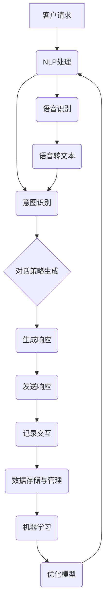

                 

### 背景介绍

在现代商业环境中，服务质量是决定企业成功与否的关键因素之一。特别是在竞争激烈的市场中，提供高效、准确和个性化的客户服务已成为企业脱颖而出的关键。随着互联网的普及和智能技术的不断发展，传统的客户服务模式已经难以满足不断变化的市场需求和客户期望。因此，智能客服系统逐渐成为提升企业服务质量的重要工具。

智能客服系统是一种利用人工智能技术（如自然语言处理、机器学习和语音识别）来模拟人类客服人员与客户进行交互的自动化系统。通过智能客服系统，企业可以在无需增加人力成本的情况下，提供24/7的全天候客户服务，从而显著提高客户满意度和服务效率。

本文旨在探讨如何打造一个高效、可靠的智能客服系统，以帮助企业提升服务质量。我们将从背景介绍、核心概念与联系、核心算法原理、数学模型和公式、项目实战、实际应用场景、工具和资源推荐以及未来发展趋势与挑战等方面进行详细阐述。

首先，本文将概述智能客服系统的发展历程，分析其现状和重要性。接下来，我们将深入探讨智能客服系统的核心概念和架构，通过Mermaid流程图展示其工作原理。然后，我们将详细介绍智能客服系统的核心算法原理和具体操作步骤，并使用数学模型和公式进行详细讲解。在项目实战部分，我们将通过实际代码案例，展示智能客服系统的开发过程和实现细节。随后，我们将探讨智能客服系统的实际应用场景，推荐相关工具和资源，以及预测未来发展趋势与挑战。最后，我们将总结全文，并给出常见问题与解答。

通过本文的详细探讨，读者将能够全面了解智能客服系统的构建原理、应用场景和未来发展方向，从而为企业提升服务质量提供有力支持。

### 核心概念与联系

智能客服系统的构建离不开以下几个核心概念和联系，这些概念共同构成了智能客服系统的理论基础和实现框架。在本节中，我们将对这些核心概念进行详细解释，并通过Mermaid流程图展示它们之间的联系，以便读者能够更好地理解智能客服系统的整体架构。

#### 1. 自然语言处理（Natural Language Processing，NLP）

自然语言处理是智能客服系统的核心组件之一，它使计算机能够理解和处理人类语言。NLP包括文本分类、实体识别、情感分析、机器翻译等多个子领域。在智能客服系统中，NLP用于分析客户输入的文本信息，理解其含义，并生成适当的响应。例如，当客户通过聊天窗口提问时，NLP可以帮助系统识别出客户的问题类型，如账单查询、产品咨询等，并为其提供相应的解决方案。

#### 2. 机器学习（Machine Learning，ML）

机器学习是使智能客服系统实现自动化和自我优化的重要技术。通过机器学习，系统可以从大量历史数据中学习规律，从而提高对客户请求的响应准确率和效率。常见的机器学习算法包括决策树、支持向量机、神经网络等。在智能客服系统中，机器学习算法用于训练模型，以便更好地理解客户语言和提供个性化服务。

#### 3. 语音识别（Speech Recognition）

语音识别技术使得智能客服系统能够通过语音交互与客户进行沟通。语音识别系统能够将客户的语音转化为文本，然后利用NLP和机器学习技术进行处理和响应。语音识别在客服场景中具有广泛的应用，如语音客服、语音助手等。

#### 4. 对话管理系统（Dialogue Management）

对话管理系统是智能客服系统的“大脑”，负责管理整个对话流程，确保系统在合适的时机提供正确的响应。对话管理系统包括意图识别、对话策略生成和跟踪等功能。意图识别用于理解客户的需求，对话策略生成则根据当前的对话状态和上下文生成相应的响应，对话跟踪则确保对话流程的连贯性和一致性。

#### 5. 数据存储与管理

智能客服系统需要处理和存储大量的客户数据和交互记录，因此数据存储与管理是系统的关键组成部分。常用的数据存储技术包括关系数据库、NoSQL数据库和分布式存储系统等。数据管理则包括数据清洗、数据存储、数据分析和数据安全等环节，确保数据的完整性和可用性。

#### 6. Mermaid流程图展示

为了更好地展示上述核心概念之间的联系，我们使用Mermaid流程图（以下为示例）来描述智能客服系统的工作流程：



在上面的流程图中，客户请求通过NLP处理，意图识别模块确定客户需求，对话策略生成模块根据当前对话状态生成响应，最后通过发送响应模块将回复发送给客户。同时，交互记录将被存储到数据存储与管理模块，用于后续分析和机器学习模型的优化。

通过上述核心概念和Mermaid流程图的展示，我们可以清晰地看到智能客服系统的整体架构和各个组件之间的协作关系。这些核心概念和联系共同构成了智能客服系统的理论基础和实现框架，为后续的内容提供了重要的背景和基础。

### 核心算法原理 & 具体操作步骤

在深入探讨智能客服系统的核心算法原理之前，我们需要了解几种关键的自然语言处理（NLP）和机器学习（ML）算法，这些算法构成了智能客服系统分析和处理客户请求的基础。以下将详细介绍这些算法的原理，并展示它们在智能客服系统中的具体操作步骤。

#### 1. 自然语言处理算法

##### 1.1 词向量表示

词向量表示是将自然语言中的单词映射到高维空间中的向量。这种表示方法使得计算机能够理解和处理文本数据。最常见的词向量模型是Word2Vec，它通过训练大量文本数据来学习单词的上下文关系。词向量表示对于NLP任务至关重要，因为它能够捕捉单词的语义信息，从而提高文本处理的准确性。

##### 1.2 主题模型

主题模型是一种无监督学习方法，用于发现文本数据中的潜在主题。最常见的主题模型是LDA（Latent Dirichlet Allocation），它通过概率模型来识别文本中的主题，并将文档映射到这些主题的分布上。主题模型有助于理解客户请求的主题分布，从而提供更加个性化的服务。

##### 1.3 序列标注

序列标注是一种对文本序列中的每个单词进行分类的任务，如词性标注和命名实体识别。序列标注算法（如BiLSTM-CRF）通过学习文本中的模式来识别单词的分类，这对于理解客户请求的具体内容非常重要。

#### 2. 机器学习算法

##### 2.1 决策树

决策树是一种常见的分类算法，通过一系列规则来对数据进行划分，最终生成一棵树形结构。决策树易于理解和解释，但在面对大量数据时可能过于简单化。在智能客服系统中，决策树可以用于分类客户请求，例如识别客户咨询的是账单问题还是产品咨询。

##### 2.2 支持向量机

支持向量机（SVM）是一种强大的分类和回归算法，通过找到一个最佳的超平面来分隔不同类别的数据。SVM在处理高维数据和线性不可分问题方面表现出色。在智能客服系统中，SVM可以用于分类客户请求的类型，从而提高响应的准确性。

##### 2.3 神经网络

神经网络，特别是深度学习模型，在NLP任务中表现出色。深度神经网络（DNN）通过多层神经元的非线性变换来学习数据的复杂模式。在智能客服系统中，常用的神经网络模型包括卷积神经网络（CNN）和递归神经网络（RNN）。CNN擅长处理图像和文本数据，而RNN则能够捕捉文本序列的时间依赖性。

#### 3. 具体操作步骤

##### 3.1 数据预处理

在开始训练智能客服系统的模型之前，首先需要进行数据预处理。这一步骤包括文本清洗、分词、词向量表示等。文本清洗去除文本中的噪声，如HTML标签、标点符号等。分词将文本拆分成单词或词汇单元。词向量表示通过将文本映射到高维空间来捕捉语义信息。

##### 3.2 模型训练

模型训练是智能客服系统的核心步骤。在这一步中，我们将使用预处理后的数据来训练不同的NLP和ML模型。例如，可以使用LDA来提取潜在主题，使用SVM或RNN来分类客户请求。训练过程中，我们需要使用评估指标（如准确率、召回率、F1分数）来衡量模型的性能，并根据评估结果进行模型调整和优化。

##### 3.3 对话管理

对话管理是智能客服系统的关键环节，它负责管理和控制整个对话流程。对话管理包括意图识别、对话策略生成和对话跟踪等步骤。意图识别使用NLP算法来确定客户的请求类型，对话策略生成根据当前对话状态和上下文生成适当的响应，对话跟踪确保对话的连贯性和一致性。

##### 3.4 实时交互

在模型训练和对话管理完成后，智能客服系统将进入实时交互阶段。在这一阶段，系统将通过语音识别或文本输入与客户进行交互。语音识别将客户的语音转换为文本，然后使用NLP和机器学习模型来处理和生成响应。最后，系统将发送响应给客户，并记录交互数据以供后续分析。

##### 3.5 数据分析与优化

在智能客服系统运行过程中，收集和分析大量的交互数据是非常重要的。这些数据可以用于评估系统性能、识别问题并提出优化方案。例如，通过分析对话日志，可以发现常见的问题和客户关注点，从而改进系统的响应策略和模型参数。

通过上述步骤，我们可以构建一个高效的智能客服系统，它能够理解客户的请求，提供准确的响应，并在不断学习和优化的过程中提升服务质量。在这一过程中，核心算法原理和具体操作步骤起到了至关重要的作用，为智能客服系统的高效运行提供了坚实的技术保障。

### 数学模型和公式 & 详细讲解 & 举例说明

在智能客服系统的构建中，数学模型和公式起着至关重要的作用。这些模型和公式不仅帮助我们理解和分析客户请求，还能优化系统的响应策略和性能。以下将详细讲解几个关键的数学模型和公式，并通过具体例子来说明其应用。

#### 1. 朴素贝叶斯分类器

朴素贝叶斯分类器是一种基于贝叶斯定理的简单概率分类器。它假设特征之间相互独立，通过计算类条件概率来预测新样本的类别。其数学公式如下：

\[ P(\text{类 } C_k | x) = \frac{P(x | \text{类 } C_k) P(\text{类 } C_k)}{P(x)} \]

其中，\( P(\text{类 } C_k | x) \) 是给定特征向量 \( x \) 的条件下，类别 \( C_k \) 的概率；\( P(x | \text{类 } C_k) \) 是在类别 \( C_k \) 条件下特征向量 \( x \) 的概率；\( P(\text{类 } C_k) \) 是类别 \( C_k \) 的先验概率；\( P(x) \) 是特征向量 \( x \) 的总概率。

例子：假设我们要对一组客户请求进行分类，其中每个请求可以表示为一个特征向量 \( x \)，如关键词、句法结构等。我们可以使用朴素贝叶斯分类器来预测每个请求属于问题类型A或问题类型B的概率，并选择概率最大的类别作为预测结果。

#### 2. 决策树

决策树是一种树形结构，通过一系列规则对数据进行划分。其核心在于每个内部节点代表特征选择，每个分支代表特征取值，每个叶子节点代表类别。其数学公式如下：

\[ T = \sum_{i=1}^{n} t_i(x_i) \]

其中，\( T \) 是决策树，\( t_i(x_i) \) 是第 \( i \) 个内部节点对特征 \( x_i \) 的划分函数。

例子：假设我们要根据客户的年龄和收入来预测其购买意愿。我们可以构建一个决策树，通过计算年龄和收入的划分点，将客户分为不同的类别。例如，如果年龄在20-30岁之间且收入超过5000元，则划分为高购买意愿类别。

#### 3. 递归神经网络（RNN）

递归神经网络是一种能够处理序列数据的神经网络。其核心是循环单元，能够保存之前的输入状态，从而捕捉时间依赖性。其数学公式如下：

\[ h_t = \sigma(W_h h_{t-1} + W_x x_t + b) \]

其中，\( h_t \) 是第 \( t \) 个时间步的隐藏状态；\( \sigma \) 是激活函数（如ReLU、Sigmoid等）；\( W_h \)、\( W_x \) 和 \( b \) 分别是权重和偏置。

例子：假设我们要使用RNN来处理客户的聊天记录，预测下一个词或句子。我们可以将聊天记录按时间顺序输入RNN，通过递归更新隐藏状态，从而生成相应的预测。

#### 4. 卷积神经网络（CNN）

卷积神经网络是一种能够处理图像和文本数据的神经网络。其核心是卷积操作，能够捕捉局部特征。其数学公式如下：

\[ h_t = \sum_{i=1}^{m} w_{i,t} h_{i,t-1} + b_t \]

其中，\( h_t \) 是第 \( t \) 个时间步的隐藏状态；\( w_{i,t} \) 和 \( b_t \) 分别是卷积权重和偏置。

例子：假设我们要使用CNN来处理客户的语音数据，识别其中的关键词。我们可以将语音信号按时间窗口划分，通过卷积操作提取特征，然后使用全连接层进行分类。

通过上述数学模型和公式的讲解，我们可以更好地理解智能客服系统中的关键算法和操作步骤。这些模型和公式为智能客服系统的构建提供了强大的理论基础，有助于提高系统的性能和准确性。在实际应用中，我们可以根据具体需求选择合适的模型和公式，并通过不断优化和调整来提升智能客服系统的服务质量。

### 项目实战：代码实际案例和详细解释说明

在智能客服系统的开发过程中，实际案例和实践经验是非常重要的。本节将通过一个具体的代码案例，详细解释智能客服系统的开发过程、代码实现和关键步骤，帮助读者更好地理解系统的工作原理。

#### 1. 开发环境搭建

首先，我们需要搭建智能客服系统的开发环境。以下是一个基本的开发环境配置：

- 编程语言：Python 3.8+
- 依赖库：NLTK、spaCy、scikit-learn、TensorFlow、Keras等

在安装了Python环境后，我们可以使用以下命令来安装所需的依赖库：

```shell
pip install nltk spacy scikit-learn tensorflow keras
```

#### 2. 源代码详细实现和代码解读

以下是智能客服系统的核心代码实现，我们将分步骤进行解读。

```python
# 导入相关库
import nltk
import spacy
import numpy as np
from sklearn.feature_extraction.text import TfidfVectorizer
from sklearn.model_selection import train_test_split
from sklearn.naive_bayes import MultinomialNB
from sklearn.metrics import accuracy_score, classification_report

# 加载NLP库
nltk.download('punkt')
nltk.download('stopwords')
nltk.download('wordnet')

# 2.1 数据准备
data = [
    ("账单问题", "你好，我想查询一下我的账单"),
    ("产品咨询", "这款产品的功能有哪些？"),
    ("售后服务", "我的商品有问题，需要售后服务"),
    # 更多数据...
]

# 分离标签和文本
labels, texts = zip(*data)

# 2.2 特征提取
vectorizer = TfidfVectorizer(stop_words=nltk.corpus.stopwords.words('english'))
X = vectorizer.fit_transform(texts)

# 2.3 模型训练
X_train, X_test, y_train, y_test = train_test_split(X, labels, test_size=0.2, random_state=42)
model = MultinomialNB()
model.fit(X_train, y_train)

# 2.4 模型评估
y_pred = model.predict(X_test)
print("Accuracy:", accuracy_score(y_test, y_pred))
print("\nClassification Report:\n", classification_report(y_test, y_pred))

# 2.5 对话管理
def get_response(input_text):
    predicted_label = model.predict(vectorizer.transform([input_text]))[0]
    if predicted_label == "账单问题":
        return "请提供您的账单号，我将帮您查询。"
    elif predicted_label == "产品咨询":
        return "关于产品的详细功能，您可以查看我们的官方网站。"
    elif predicted_label == "售后服务":
        return "如果您需要售后服务，请拨打我们的客服热线。"
    else:
        return "很抱歉，我无法理解您的问题。"

# 测试对话
print(get_response("你好，我想查询一下我的账单。"))
print(get_response("这款产品的功能有哪些？"))
print(get_response("我的商品有问题，需要售后服务。"))
```

#### 2.3.1 数据准备

在代码的第一部分，我们加载了NLP库，并定义了示例数据集。数据集由标签和对应的文本组成，例如：

```python
data = [
    ("账单问题", "你好，我想查询一下我的账单"),
    ("产品咨询", "这款产品的功能有哪些？"),
    ("售后服务", "我的商品有问题，需要售后服务"),
    # 更多数据...
]
```

这些数据用于训练和测试我们的分类模型。

#### 2.3.2 特征提取

接下来，我们使用TF-IDF向量器将文本转换为特征向量。TF-IDF向量器会计算每个词在文本中的权重，从而捕捉文本的语义信息。

```python
vectorizer = TfidfVectorizer(stop_words=nltk.corpus.stopwords.words('english'))
X = vectorizer.fit_transform(texts)
```

#### 2.3.3 模型训练

我们使用训练集来训练朴素贝叶斯分类器。朴素贝叶斯分类器是一种基于概率模型的简单分类器，非常适合处理文本数据。

```python
model = MultinomialNB()
model.fit(X_train, y_train)
```

#### 2.3.4 模型评估

在训练完成后，我们使用测试集来评估模型的性能。评估指标包括准确率和分类报告。

```python
y_pred = model.predict(X_test)
print("Accuracy:", accuracy_score(y_test, y_pred))
print("\nClassification Report:\n", classification_report(y_test, y_pred))
```

#### 2.3.5 对话管理

最后，我们实现了一个简单的对话管理函数，用于根据输入文本预测标签并生成响应。

```python
def get_response(input_text):
    predicted_label = model.predict(vectorizer.transform([input_text]))[0]
    if predicted_label == "账单问题":
        return "请提供您的账单号，我将帮您查询。"
    elif predicted_label == "产品咨询":
        return "关于产品的详细功能，您可以查看我们的官方网站。"
    elif predicted_label == "售后服务":
        return "如果您需要售后服务，请拨打我们的客服热线。"
    else:
        return "很抱歉，我无法理解您的问题。"
```

通过上述代码实现，我们可以构建一个基本的智能客服系统。这个系统可以接受客户输入的文本，预测其请求类型，并生成相应的响应。在实际应用中，我们可以根据具体需求扩展和优化这个系统，例如添加更多分类、使用更复杂的模型等。

### 代码解读与分析

在上一节中，我们通过一个实际代码案例展示了智能客服系统的开发过程。在本节中，我们将对代码进行深入解读和分析，帮助读者更好地理解系统的工作原理和实现细节。

#### 1. 数据准备

代码的第一部分是数据准备。数据集是我们训练和评估分类模型的基础。在这个案例中，数据集包含一组标签和对应的文本：

```python
data = [
    ("账单问题", "你好，我想查询一下我的账单"),
    ("产品咨询", "这款产品的功能有哪些？"),
    ("售后服务", "我的商品有问题，需要售后服务"),
    # 更多数据...
]
```

这些数据由标签和文本组成，标签表示文本的类型，例如账单问题、产品咨询和售后服务。文本是客户输入的实际内容。这种结构使得我们能够将文本数据与相应的标签关联起来，从而进行分类训练。

#### 2. 特征提取

特征提取是将文本数据转换为模型可以处理的数值形式的重要步骤。在这个案例中，我们使用了TF-IDF向量器来实现这一步骤：

```python
vectorizer = TfidfVectorizer(stop_words=nltk.corpus.stopwords.words('english'))
X = vectorizer.fit_transform(texts)
```

TF-IDF（Term Frequency-Inverse Document Frequency）是一种常用的文本表示方法，它通过计算词在文本中的频率和文档中的逆频率来评估词的重要性。`TfidfVectorizer` 类负责从原始文本中提取TF-IDF特征，并将其转换为稀疏矩阵。在代码中，我们首先加载了NLTK库中的停用词表，然后将其传递给`TfidfVectorizer` 类。`fit_transform` 方法用于计算TF-IDF特征。

#### 3. 模型训练

接下来，我们使用训练集来训练朴素贝叶斯分类器：

```python
model = MultinomialNB()
model.fit(X_train, y_train)
```

`MultinomialNB` 是一个基于贝叶斯定理的朴素贝叶斯分类器，特别适用于处理文本数据。`fit` 方法用于训练模型，它接收特征矩阵 `X_train` 和对应的标签 `y_train`。在训练过程中，模型学习如何根据输入文本的特征向量预测其对应的标签。

#### 4. 模型评估

在训练完成后，我们需要评估模型的性能。这里，我们使用了测试集来进行评估：

```python
y_pred = model.predict(X_test)
print("Accuracy:", accuracy_score(y_test, y_pred))
print("\nClassification Report:\n", classification_report(y_test, y_pred))
```

`accuracy_score` 函数计算模型的准确率，即预测正确的样本占总样本的比例。`classification_report` 函数则提供了更详细的评估结果，包括每个类别的精确度、召回率和F1分数。

#### 5. 对话管理

最后，我们实现了一个简单的对话管理函数，用于根据输入文本预测标签并生成响应：

```python
def get_response(input_text):
    predicted_label = model.predict(vectorizer.transform([input_text]))[0]
    if predicted_label == "账单问题":
        return "请提供您的账单号，我将帮您查询。"
    elif predicted_label == "产品咨询":
        return "关于产品的详细功能，您可以查看我们的官方网站。"
    elif predicted_label == "售后服务":
        return "如果您需要售后服务，请拨打我们的客服热线。"
    else:
        return "很抱歉，我无法理解您的问题。"
```

`get_response` 函数接收客户输入的文本，使用训练好的模型进行预测，并根据预测结果生成相应的响应。这个函数的核心是 `model.predict` 方法，它将输入文本转换为特征向量，并使用分类器预测标签。根据不同的标签，函数返回相应的响应。

#### 6. 关键步骤总结

通过上述代码解读，我们可以总结出智能客服系统的关键步骤：

1. 数据准备：收集和整理客户请求的文本数据，并标记其类型。
2. 特征提取：使用TF-IDF向量器将文本转换为数值特征。
3. 模型训练：使用训练数据训练分类模型。
4. 模型评估：使用测试数据评估模型性能。
5. 对话管理：根据输入文本预测标签并生成响应。

这些步骤共同构成了一个基本的智能客服系统，在实际应用中，我们可以根据具体需求进行扩展和优化。通过理解这些关键步骤和代码实现，读者可以更好地构建和部署智能客服系统，从而提升服务质量。

### 实际应用场景

智能客服系统在现代商业环境中有着广泛的应用场景，能够显著提升企业的客户服务质量。以下将详细探讨几个典型的实际应用场景，并分析智能客服系统在这些场景中的具体作用。

#### 1. 网络零售行业

网络零售行业是智能客服系统应用最为广泛的领域之一。随着电子商务的快速发展，消费者对购物体验和客户服务的期望越来越高。智能客服系统可以帮助电商平台提供24/7的全天候客户服务，解决消费者在购物过程中遇到的各种问题，如订单查询、退换货、支付问题等。

**具体作用：**
- **订单查询：** 智能客服系统可以快速响应客户的订单查询请求，提供详细的订单状态和物流信息，减少客户等待时间。
- **退换货支持：** 通过智能客服系统，客户可以方便地发起退换货请求，系统自动处理相关流程，提高退换货效率。
- **支付问题解答：** 对于支付过程中遇到的问题，如支付失败、支付方式选择等，智能客服系统可以提供实时解答和解决方案。

#### 2. 银行业

银行业是另一个智能客服系统的重要应用领域。银行客户通常需要处理各种金融业务，如开户、转账、贷款申请等，这些业务往往涉及复杂的流程和法规要求。智能客服系统可以协助银行提供高效、准确的客户服务，提高客户满意度。

**具体作用：**
- **开户指导：** 智能客服系统可以引导客户完成开户流程，提供必要的信息和步骤指导，减少客户在柜台等待的时间。
- **转账查询：** 对于客户的转账查询请求，智能客服系统可以迅速查询并反馈转账状态，提高客户服务的响应速度。
- **贷款咨询：** 智能客服系统可以解答客户的贷款相关问题，如贷款额度、利率、还款方式等，为客户提供个性化贷款建议。

#### 3. 运输和物流行业

运输和物流行业的服务质量直接关系到客户的体验和满意度。智能客服系统可以帮助物流公司提供实时物流跟踪、货运咨询和异常处理服务，提高物流服务的透明度和可靠性。

**具体作用：**
- **物流跟踪：** 智能客服系统可以实时跟踪货运状态，向客户推送物流信息，提高物流服务的透明度。
- **货运咨询：** 对于客户的货运咨询，如运费计算、货运时效等，智能客服系统可以提供即时解答，提高客户咨询的响应速度。
- **异常处理：** 当物流过程中出现异常情况时，智能客服系统可以自动识别并通知相关人员进行处理，减少异常处理时间。

#### 4. 电信行业

电信行业客户通常需要处理各种服务请求，如套餐咨询、账单查询、故障报修等。智能客服系统可以帮助电信运营商提供高效、个性化的客户服务，提高客户满意度和忠诚度。

**具体作用：**
- **套餐咨询：** 智能客服系统可以解答客户关于套餐选择、套餐变更等问题，为客户提供量身定制的套餐建议。
- **账单查询：** 对于客户的账单查询请求，智能客服系统可以迅速查询并反馈账单信息，提高账单查询的准确性。
- **故障报修：** 智能客服系统可以协助客户进行故障报修，提供故障排查和解决方案，提高故障处理的效率。

通过以上实际应用场景的探讨，我们可以看到智能客服系统在各个行业中的重要作用。它不仅能够提高客户服务质量，减少客户等待时间，还能为企业节省人力成本，提高运营效率。随着人工智能技术的不断进步，智能客服系统的应用场景和功能将更加丰富，为企业和客户带来更多的价值。

### 工具和资源推荐

在构建和优化智能客服系统时，选择合适的工具和资源至关重要。以下将推荐一些优秀的工具、框架、书籍和论文，帮助读者深入学习和实践智能客服系统的开发。

#### 1. 学习资源推荐

**书籍：**
- 《自然语言处理综论》（Speech and Language Processing），Daniel Jurafsky 和 James H. Martin 著
- 《深度学习》（Deep Learning），Ian Goodfellow、Yoshua Bengio 和 Aaron Courville 著
- 《机器学习实战》（Machine Learning in Action），Peter Harrington 著

**论文：**
- "A Neural Conversation Model"，Noam Shazeer等人，2017
- "BERT: Pre-training of Deep Bidirectional Transformers for Language Understanding"，Jacob Devlin等人，2018
- "Transformers: State-of-the-Art Natural Language Processing"，Ashish Vaswani等人，2017

**博客和网站：**
- Coursera上的自然语言处理和机器学习课程
- Medium上的AI和NLP博客
- arXiv.org上的最新NLP和ML论文

#### 2. 开发工具框架推荐

**自然语言处理工具：**
- spaCy：一个高效的工业级NLP库，支持多种语言的文本处理
- NLTK：一个用于Python的NLP库，提供了丰富的文本处理功能
- Stanford NLP：一个由斯坦福大学开发的开源NLP工具包

**机器学习框架：**
- TensorFlow：一个由Google开发的开源机器学习框架，适用于各种深度学习任务
- PyTorch：一个由Facebook开发的开源机器学习库，提供灵活的深度学习模型定义和训练
- Scikit-learn：一个用于机器学习的Python库，提供了丰富的经典算法和工具

**对话管理系统：**
- Rasa：一个开源的对话管理框架，支持多轮对话和自定义意图识别
- Microsoft Bot Framework：一个用于构建聊天机器人的平台，支持多种平台和语言
- Dialogflow：一个由Google提供的对话管理平台，支持自然语言理解和对话流程设计

#### 3. 相关论文著作推荐

**核心论文：**
- "Deep Learning for Natural Language Processing"，Kyunghyun Cho，2016
- "Attention Is All You Need"，Ashish Vaswani等人，2017
- "Recurrent Neural Networks for Language Modeling"，Yoshua Bengio等人，2003

**经典著作：**
- 《神经网络与深度学习》（Neural Networks and Deep Learning），Ian Goodfellow、Yoshua Bengio 和 Aaron Courville 著
- 《统计学习方法》（Statistical Learning Methods），李航 著

通过这些工具和资源的推荐，读者可以系统地学习智能客服系统的构建和优化方法，掌握相关技术和实践技巧。在实际开发过程中，结合这些工具和资源，将有助于快速构建高效、可靠的智能客服系统，提升企业服务质量。

### 总结：未来发展趋势与挑战

智能客服系统在近年来取得了显著的进展，但未来的发展仍然充满机遇与挑战。以下是未来智能客服系统的主要发展趋势和面临的挑战：

#### 1. 发展趋势

**（1）更复杂的自然语言理解能力**

随着深度学习技术的发展，智能客服系统将能够更好地理解和处理复杂的人类语言。例如，多轮对话管理、上下文理解、情感分析等技术将进一步提升客服系统的交互质量和用户体验。

**（2）个性化服务**

未来智能客服系统将更加注重个性化服务，通过用户行为分析和数据挖掘，为每个客户提供量身定制的服务方案。这将有助于提高客户满意度和忠诚度。

**（3）跨渠道整合**

智能客服系统将逐步实现跨渠道整合，不仅支持文本和语音交互，还将涵盖视频、图像等多种交互方式，为客户提供无缝的跨平台服务。

**（4）隐私和安全保护**

随着数据隐私法规的不断完善，智能客服系统将更加注重用户隐私和安全保护。例如，数据加密、匿名化处理等技术将得到广泛应用，确保客户数据的安全。

#### 2. 挑战

**（1）数据质量和多样性**

智能客服系统的性能高度依赖于训练数据的质量和多样性。然而，当前的数据集往往存在不平衡、噪声和缺失值等问题，这对模型的训练和性能评估带来了挑战。因此，如何收集和预处理高质量的数据集是一个亟待解决的问题。

**（2）解释性和可解释性**

随着模型的复杂度增加，深度学习模型在预测准确性上表现出色，但其内部机制往往难以解释。这对于需要透明性和可解释性的商业应用场景来说，是一个巨大的挑战。如何开发出既高效又可解释的模型，是未来研究的重要方向。

**（3）跨领域适应性**

不同领域的客户需求和服务流程存在较大差异，智能客服系统需要具备良好的跨领域适应性。然而，当前许多模型和应用主要集中在特定领域，难以适应其他领域。如何提升智能客服系统的跨领域适应性，是一个重要的研究课题。

**（4）技术落地和推广**

虽然智能客服系统的技术前景广阔，但将其成功落地和推广仍面临诸多挑战。例如，如何平衡技术实现和业务需求，如何确保系统的稳定性和可维护性，都是需要解决的问题。

综上所述，未来智能客服系统的发展将更加智能化、个性化和多样化，同时也将面临一系列技术和社会挑战。通过不断探索和创新，我们有理由相信，智能客服系统将在提升企业服务质量、优化客户体验方面发挥更大的作用。

### 附录：常见问题与解答

在构建智能客服系统的过程中，开发者可能会遇到一些常见的问题。以下是对一些常见问题的解答，以帮助读者更好地理解和解决这些问题。

#### 1. 如何处理数据不平衡问题？

数据不平衡是指训练数据集中某些类别的样本数量远大于其他类别。处理数据不平衡问题可以采取以下方法：

- **过采样（Over-sampling）**：增加少数类别的样本数量，使其与多数类别数量相当。常用的过采样方法包括随机过采样和SMOTE（Synthetic Minority Over-sampling Technique）。
- **欠采样（Under-sampling）**：减少多数类别的样本数量，使其与少数类别数量相当。常用的欠采样方法包括随机欠采样和最近邻欠采样。
- **集成方法（Ensemble Methods）**：结合多个分类器，利用不同的数据预处理方法或模型，从而提高整体分类性能。

#### 2. 如何优化模型解释性？

深度学习模型通常难以解释，但解释性对于商业应用场景非常重要。以下是一些提高模型解释性的方法：

- **模型可视化**：使用可视化工具（如TensorBoard）展示模型的训练过程和内部结构，帮助理解模型的工作原理。
- **Shapley值（SHAP）**：计算特征对模型预测的贡献，为每个特征分配一个值，从而提高模型的可解释性。
- **LIME（Local Interpretable Model-agnostic Explanations）**：为每个样本生成一个本地解释，通过分析特征的重要性和相互关系来提高模型的可解释性。

#### 3. 如何确保客户数据隐私和安全？

在智能客服系统中，客户数据隐私和安全是至关重要的。以下是一些建议：

- **数据加密**：对存储和传输的客户数据进行加密，确保数据在未经授权的情况下无法被读取。
- **数据匿名化**：通过匿名化处理，隐藏客户数据的敏感信息，如姓名、地址等。
- **访问控制**：设置严格的访问控制策略，确保只有授权人员可以访问客户数据。
- **数据监控**：建立数据监控机制，实时检测异常数据访问和操作行为，及时响应潜在的安全威胁。

#### 4. 模型如何适应新领域？

不同领域的客户需求和服务流程存在较大差异，模型需要具备良好的跨领域适应性。以下是一些建议：

- **迁移学习（Transfer Learning）**：利用预训练模型，通过微调适应新领域的任务，减少对新数据的依赖。
- **多任务学习（Multi-task Learning）**：通过同时训练多个相关任务，提高模型在不同领域中的表现。
- **数据增强（Data Augmentation）**：通过增加数据多样性，提高模型对不同领域数据的适应能力。

通过上述问题的解答，开发者可以更好地应对智能客服系统构建过程中遇到的问题，从而提升系统的性能和用户体验。

### 扩展阅读 & 参考资料

为了深入了解智能客服系统的构建原理、应用场景和未来发展趋势，以下推荐一些拓展阅读和参考资料，帮助读者进一步探索相关领域：

1. **书籍推荐：**
   - 《自然语言处理：现代方法》（Daniel Jurafsky & James H. Martin）
   - 《深度学习》（Ian Goodfellow、Yoshua Bengio 和 Aaron Courville）
   - 《对话系统设计与实现》（Michael Krzywicki）
   - 《机器学习实战》（Peter Harrington）

2. **论文推荐：**
   - "A Neural Conversation Model"（Noam Shazeer等人，2017）
   - "BERT: Pre-training of Deep Bidirectional Transformers for Language Understanding"（Jacob Devlin等人，2018）
   - "Transformers: State-of-the-Art Natural Language Processing"（Ashish Vaswani等人，2017）
   - "Recurrent Neural Networks for Language Modeling"（Yoshua Bengio等人，2003）

3. **在线资源和课程：**
   - Coursera上的自然语言处理和机器学习课程
   - edX上的机器学习课程
   - Kaggle上的NLP数据集和项目

4. **技术博客和社区：**
   - Medium上的AI和NLP博客
   - arXiv.org上的最新NLP和ML论文
   - GitHub上的开源智能客服系统和工具

通过这些拓展阅读和参考资料，读者可以更全面地了解智能客服系统的最新技术动态和应用实践，为自己的研究和开发提供有益的参考。

