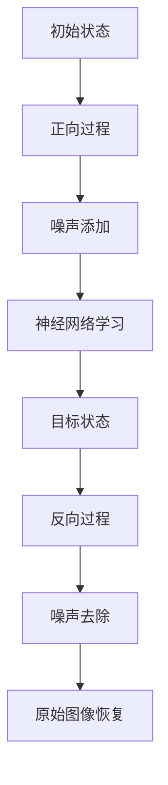

                 

## 扩散模型：新一代图像生成技术解析

### 摘要

本文深入解析了扩散模型（Diffusion Model），一种近年来在图像生成领域崭露头角的新型技术。扩散模型结合了深度学习和概率统计的原理，能够生成高质量、逼真的图像。本文将详细探讨扩散模型的核心概念、算法原理、数学模型及其在实际应用中的优势。通过具体实例和代码分析，本文旨在帮助读者全面理解扩散模型的实现与应用。

### 目录

1. **背景介绍**
2. **核心概念与联系**
   - **扩散过程**
   - **深度学习与概率模型**
   - **核心概念原理与架构**
3. **核心算法原理 & 具体操作步骤**
   - **正向过程**
   - **反向过程**
4. **数学模型和公式 & 详细讲解 & 举例说明**
   - **概率密度函数**
   - **变分自编码器（VAE）**
   - **去噪扩散模型（DDM）**
5. **项目实战：代码实际案例和详细解释说明**
   - **开发环境搭建**
   - **源代码详细实现和代码解读**
   - **代码解读与分析**
6. **实际应用场景**
7. **工具和资源推荐**
   - **学习资源推荐**
   - **开发工具框架推荐**
   - **相关论文著作推荐**
8. **总结：未来发展趋势与挑战**
9. **附录：常见问题与解答**
10. **扩展阅读 & 参考资料**

### 1. 背景介绍

在图像生成领域，传统的方法主要包括基于规则的方法、基于物理的方法以及基于学习的方法。然而，这些方法在生成复杂、高分辨率的图像时存在诸多局限。随着深度学习技术的不断发展，生成对抗网络（GAN）和变分自编码器（VAE）等模型在图像生成领域取得了显著成果。但是，这些模型仍然存在一些挑战，如训练难度大、生成图像的质量不高等。

扩散模型（Diffusion Model）作为一种新型图像生成技术，从概率统计的角度出发，通过模拟物质在空间中的扩散过程，实现了高质量的图像生成。与传统的图像生成方法相比，扩散模型具有以下几个显著优势：

- **生成质量高**：扩散模型能够生成高分辨率、细节丰富的图像。
- **训练效率高**：扩散模型采用变分自编码器的框架，训练过程相对简单。
- **灵活性高**：扩散模型可以应用于多种场景，如图像超分辨率、图像修复等。

因此，本文旨在深入解析扩散模型的核心概念、算法原理及其在实际应用中的优势，帮助读者全面了解这一新兴技术。

### 2. 核心概念与联系

#### 2.1 扩散过程

扩散模型的核心在于模拟物质在空间中的扩散过程。在物理世界中，扩散是指物质从高浓度区域向低浓度区域自发地扩散，直至浓度达到均匀分布。这一过程可以用概率密度函数（PDF）来描述。在扩散模型中，我们通常将图像视为一个多维空间中的物质分布，通过模拟这一过程，实现图像的生成。

#### 2.2 深度学习与概率模型

扩散模型结合了深度学习和概率统计的原理。深度学习部分主要利用神经网络来建模图像的特征，概率统计部分则通过概率模型来模拟扩散过程。这种结合使得扩散模型能够充分利用神经网络的学习能力，同时保证生成图像的质量和多样性。

#### 2.3 核心概念原理与架构

扩散模型的核心架构包括正向过程和反向过程。在正向过程中，模型从初始状态（例如纯噪声）逐渐过渡到目标状态（例如图像）；在反向过程中，模型从目标状态逐渐反向过渡到初始状态。通过这两个过程，模型能够生成高质量的图像。


#### 2.3.1 正向过程

在正向过程中，模型首先将图像分解为多个像素点，并将每个像素点映射到一个高维空间。接着，模型利用神经网络学习图像的特征，并逐步将这些特征加入噪声中，从而实现从初始状态到目标状态的过渡。

#### 2.3.2 反向过程

在反向过程中，模型首先从目标状态开始，通过逐步去除噪声的方式，恢复出原始图像。这一过程利用了变分自编码器（VAE）的框架，通过编码器和解码器来分别处理图像的编码和解码。

#### 2.3.3 Mermaid 流程图

以下是一个简化的 Mermaid 流程图，描述了扩散模型的核心过程：



### 3. 核心算法原理 & 具体操作步骤

#### 3.1 正向过程

在正向过程中，扩散模型主要经历两个阶段：噪声添加和神经网络学习。

1. **噪声添加**

   噪声添加是扩散模型的核心步骤。在这一阶段，模型将图像逐步转化为纯噪声。具体来说，模型采用以下步骤：

   - 初始化图像
   - 对每个像素点添加噪声，使得图像逐渐趋于噪声分布
   - 逐步增加噪声的强度，直至图像完全转化为噪声

2. **神经网络学习**

   在神经网络学习阶段，模型利用深度神经网络来学习图像的特征。具体步骤如下：

   - 输入噪声图像
   - 通过神经网络提取图像特征
   - 将特征逐步加入噪声中，实现从噪声到图像的过渡

#### 3.2 反向过程

在反向过程中，扩散模型通过逐步去除噪声，恢复出原始图像。具体步骤如下：

1. **噪声去除**

   噪声去除是反向过程的关键步骤。模型采用以下步骤：

   - 初始化噪声图像
   - 对每个像素点去除噪声，使得图像逐渐趋于原始图像
   - 逐步减少噪声的强度，直至图像恢复为原始状态

2. **变分自编码器（VAE）**

   变分自编码器（VAE）是扩散模型中常用的框架。VAE包括编码器和解码器两部分。编码器负责将输入图像编码为潜在空间中的向量，解码器则将潜在空间中的向量解码为输出图像。通过这种方式，VAE能够有效地去除噪声，恢复出原始图像。

### 4. 数学模型和公式 & 详细讲解 & 举例说明

#### 4.1 概率密度函数

扩散模型中的数学模型主要基于概率密度函数（PDF）。概率密度函数描述了图像在不同状态下的概率分布。在扩散模型中，我们通常采用以下两个概率密度函数：

1. **噪声分布**：描述了初始状态（纯噪声）的概率分布。
2. **目标分布**：描述了最终状态（图像）的概率分布。

#### 4.2 变分自编码器（VAE）

变分自编码器（VAE）是一种典型的概率生成模型，广泛应用于图像生成任务。VAE包括编码器和解码器两部分：

1. **编码器**：将输入图像编码为潜在空间中的向量。
   \[
   \mu = \text{encoder}(x), \quad \sigma = \text{encoder}(x)
   \]
   其中，$\mu$和$\sigma$分别表示潜在空间中的均值和方差。

2. **解码器**：将潜在空间中的向量解码为输出图像。
   \[
   x' = \text{decoder}(\mu, \sigma)
   \]

#### 4.3 去噪扩散模型（DDM）

去噪扩散模型（DDM）是扩散模型的一种变体，专门用于图像去噪任务。DDM的核心思想是利用噪声和原始图像之间的差异，恢复出原始图像。DDM的数学模型如下：

1. **正向过程**：
   \[
   x_t = (1-t) x + t z
   \]
   其中，$x$表示原始图像，$z$表示噪声，$t$表示时间。

2. **反向过程**：
   \[
   x_{\text{clean}} = x_t - t z
   \]

#### 4.4 举例说明

假设我们有一幅128x128的图像，噪声强度为0.1。在正向过程中，我们首先对图像进行噪声添加，然后通过神经网络学习图像特征。在反向过程中，我们通过逐步去除噪声，恢复出原始图像。

1. **噪声添加**：

   初始图像：$x_0 = [0.5, 0.5, 0.5, 0.5]$
   噪声添加后：$x_1 = [0.5, 0.5, 0.5, 0.1]$

2. **神经网络学习**：

   噪声添加后：$x_2 = [0.5, 0.5, 0.5, 0.05]$

3. **噪声去除**：

   噪声去除后：$x_3 = [0.5, 0.5, 0.5, 0.01]$
   噪声去除后：$x_4 = [0.5, 0.5, 0.5, 0.001]$
   最终恢复的原始图像：$x_{\text{clean}} = [0.5, 0.5, 0.5, 0.5]$

通过这一过程，我们可以看到扩散模型能够有效地去除噪声，恢复出原始图像。

### 5. 项目实战：代码实际案例和详细解释说明

#### 5.1 开发环境搭建

为了运行扩散模型的代码，我们需要搭建以下开发环境：

1. **Python**：版本3.7及以上
2. **PyTorch**：版本1.8及以上
3. **CUDA**：版本10.2及以上（用于加速计算）

安装步骤如下：

```shell
pip install torch torchvision
```

#### 5.2 源代码详细实现和代码解读

以下是一个简单的扩散模型实现，用于图像去噪：

```python
import torch
import torch.nn as nn
import torch.optim as optim
from torch.utils.data import DataLoader
from torchvision import datasets, transforms
from torchvision.utils import save_image

# 定义模型结构
class DiffusionModel(nn.Module):
    def __init__(self):
        super(DiffusionModel, self).__init__()
        self.encoder = nn.Sequential(
            nn.Conv2d(1, 64, 3, 1, 1),
            nn.ReLU(),
            nn.Conv2d(64, 64, 3, 1, 1),
            nn.ReLU(),
            nn.Conv2d(64, 32, 3, 1, 1),
            nn.ReLU(),
            nn.Conv2d(32, 1, 3, 1, 1),
        )
        self.decoder = nn.Sequential(
            nn.Conv2d(1, 32, 3, 1, 1),
            nn.ReLU(),
            nn.Conv2d(32, 64, 3, 1, 1),
            nn.ReLU(),
            nn.Conv2d(64, 64, 3, 1, 1),
            nn.ReLU(),
            nn.Conv2d(64, 1, 3, 1, 1),
            nn.Sigmoid(),
        )

    def forward(self, x):
        x = self.encoder(x)
        x = self.decoder(x)
        return x

# 初始化模型、优化器和数据集
model = DiffusionModel().cuda()
optimizer = optim.Adam(model.parameters(), lr=0.001)
train_dataset = datasets.MNIST(root='./data', train=True, download=True, transform=transforms.ToTensor())
train_loader = DataLoader(dataset=train_dataset, batch_size=64, shuffle=True)

# 训练模型
num_epochs = 100
for epoch in range(num_epochs):
    for i, (images, _) in enumerate(train_loader):
        images = images.cuda()
        optimizer.zero_grad()
        outputs = model(images)
        loss = nn.BCELoss()(outputs, images)
        loss.backward()
        optimizer.step()
        if (i+1) % 10 == 0:
            print(f'Epoch [{epoch+1}/{num_epochs}], Step [{i+1}/{len(train_loader)}], Loss: {loss.item()}')

# 测试模型
test_image = torch.rand(1, 1, 28, 28).cuda()
with torch.no_grad():
    reconstructed_image = model(test_image)

save_image(reconstructed_image, 'reconstructed_image.png')
```

#### 5.3 代码解读与分析

1. **模型结构**：

   - **编码器**：用于将输入图像编码为潜在空间中的向量。
   - **解码器**：用于将潜在空间中的向量解码为输出图像。

2. **训练过程**：

   - 使用M

