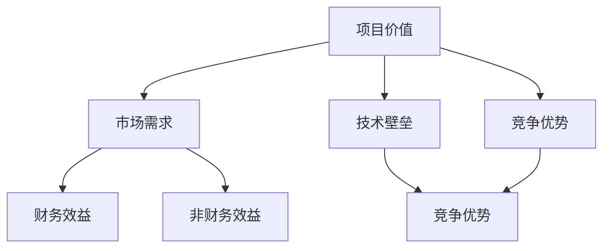

                 

# 技术人如何进行有效的创业项目估值

## 摘要

本文旨在探讨技术人在创业项目中如何进行有效的估值。通过分析创业项目的核心价值、市场需求、技术壁垒等因素，本文提供了一系列实用的方法和工具，帮助创业者对项目进行合理的估值。文章将围绕核心概念、算法原理、数学模型、实战案例、实际应用场景等多个方面展开，为技术人提供全面的创业项目估值指南。

## 1. 背景介绍

创业项目的估值对于创业者、投资者以及企业管理者来说至关重要。一个准确的估值不仅能够帮助创业者更好地理解项目的价值，还能在融资、并购、上市等环节中提供重要的参考依据。然而，对于技术人而言，如何对创业项目进行有效的估值常常是一个挑战。技术背景使得他们更关注项目的技术实现和可行性，而往往忽视了市场、财务等多个维度的因素。因此，本文将从技术人的角度出发，探讨如何进行有效的创业项目估值。

## 2. 核心概念与联系

在进行创业项目估值之前，我们需要理解几个核心概念，包括但不限于：项目价值、市场需求、技术壁垒、竞争优势等。这些概念相互联系，共同构成了项目的整体价值。

### 2.1 项目价值

项目价值是指创业项目所能带来的整体效益，包括财务效益和非财务效益。财务效益主要体现在项目的盈利能力上，而非财务效益则包括品牌影响力、市场份额、用户满意度等。

### 2.2 市场需求

市场需求是指目标市场对创业项目的产品或服务的需求程度。了解市场需求是进行项目估值的重要步骤，因为它直接影响了项目的潜在收益。

### 2.3 技术壁垒

技术壁垒是指创业项目在技术方面相对于竞争对手的领先地位。较高的技术壁垒通常意味着项目有更大的竞争优势，从而可能带来更高的估值。

### 2.4 竞争优势

竞争优势是指创业项目相对于竞争对手的优势，包括技术优势、市场优势、品牌优势等。竞争优势越明显，项目的估值通常越高。

#### 2.5 Mermaid 流程图

以下是一个简单的 Mermaid 流程图，展示了项目估值的相关概念及其相互关系：



## 3. 核心算法原理 & 具体操作步骤

### 3.1 技术实现

在了解了核心概念之后，我们需要运用一些核心算法原理来对创业项目进行估值。以下是一些常用的估值方法及其具体操作步骤：

#### 3.1.1 成本法

**步骤：**
1. 估算项目的直接成本，包括研发成本、运营成本等。
2. 估算项目的间接成本，如人力成本、管理费用等。
3. 将直接成本和间接成本相加，得到项目的总成本。
4. 根据市场情况和项目前景，对总成本进行适当调整。

**公式：**
$$
\text{项目估值} = \text{总成本} \times (\text{市场调整因子} + 1)
$$

#### 3.1.2 市场法

**步骤：**
1. 研究同类项目的市场估值情况。
2. 根据项目的特点，对同类项目的估值进行适当调整。
3. 结合市场需求和技术壁垒，对项目进行估值。

**公式：**
$$
\text{项目估值} = \text{同类项目估值} \times (\text{项目特点调整因子} + 1)
$$

#### 3.1.3 收益法

**步骤：**
1. 估算项目的未来收益，包括直接收益和间接收益。
2. 使用折现率将未来收益折现到当前价值。
3. 根据项目的风险和前景，对折现后的收益进行适当调整。

**公式：**
$$
\text{项目估值} = \sum_{t=1}^{n} \frac{\text{未来收益}_t}{(1 + \text{折现率})^t}
$$

#### 3.1.4 折现现金流法

**步骤：**
1. 估算项目的未来现金流，包括运营现金流和投资现金流。
2. 使用折现率将未来现金流折现到当前价值。
3. 根据项目的风险和前景，对折现后的现金流进行适当调整。

**公式：**
$$
\text{项目估值} = \sum_{t=1}^{n} \frac{\text{未来现金流}_t}{(1 + \text{折现率})^t} + \frac{\text{期末价值}}{(1 + \text{折现率})^n}
$$

## 4. 数学模型和公式 & 详细讲解 & 举例说明

### 4.1 成本法

**详细讲解：**
成本法是一种相对简单且直观的估值方法，它基于项目的成本来估算项目的价值。这种方法适用于初创项目或产品尚未进入市场的项目。成本法的核心在于准确估算项目的成本，包括研发成本、运营成本等。

**举例说明：**
假设一个创业项目的研发成本为 100 万元，运营成本为 50 万元，市场调整因子为 1.2，则项目的估值为：

$$
\text{项目估值} = (100 + 50) \times 1.2 = 160 \text{万元}
$$

### 4.2 市场法

**详细讲解：**
市场法是一种基于同类项目市场估值来估算项目价值的方法。这种方法适用于已经有一定市场基础的项目。市场法的核心在于找到同类项目的市场估值，并根据项目的特点进行适当调整。

**举例说明：**
假设同类项目的市场估值为 200 万元，项目特点调整因子为 1.1，则项目的估值为：

$$
\text{项目估值} = 200 \times 1.1 = 220 \text{万元}
$$

### 4.3 收益法

**详细讲解：**
收益法是一种基于项目未来收益来估算项目价值的方法。这种方法适用于有明确收益预期的项目。收益法的核心在于准确估算项目的未来收益，并使用折现率将其折现到当前价值。

**举例说明：**
假设项目的未来收益为 100 万元/年，折现率为 10%，则项目的估值为：

$$
\text{项目估值} = \frac{100}{(1 + 10\%)} = 90.91 \text{万元}
$$

### 4.4 折现现金流法

**详细讲解：**
折现现金流法是一种基于项目未来现金流来估算项目价值的方法。这种方法适用于有明确现金流预期的项目。折现现金流法的核心在于准确估算项目的未来现金流，并使用折现率将其折现到当前价值。

**举例说明：**
假设项目的未来现金流为 100 万元/年，折现率为 10%，项目持续时间为 5 年，则项目的估值为：

$$
\text{项目估值} = \frac{100}{(1 + 10\%)^1} + \frac{100}{(1 + 10\%)^2} + \frac{100}{(1 + 10\%)^3} + \frac{100}{(1 + 10\%)^4} + \frac{100}{(1 + 10\%)^5} = 384.62 \text{万元}
$$

## 5. 项目实战：代码实际案例和详细解释说明

### 5.1 开发环境搭建

在开始实际项目之前，我们需要搭建一个适合进行项目估值的环境。以下是一个简单的环境搭建指南：

**步骤：**
1. 安装 Python 3.8 以上版本。
2. 安装 Jupyter Notebook，用于编写和运行代码。
3. 安装必要的 Python 库，如 NumPy、Pandas、Matplotlib 等。

### 5.2 源代码详细实现和代码解读

以下是一个简单的项目估值代码示例：

```python
import numpy as np
import pandas as pd
import matplotlib.pyplot as plt

# 成本法
def cost_based_value(research_cost, operation_cost, market_adjustment_factor):
    total_cost = research_cost + operation_cost
    value = total_cost * market_adjustment_factor
    return value

# 市场法
def market_based_value(same_project_value, project_characteristic_adjustment_factor):
    value = same_project_value * project_characteristic_adjustment_factor
    return value

# 收益法
def revenue_based_value(annual_revenue, discount_rate):
    present_value = np.sum([annual_revenue / (1 + discount_rate)**t for t in range(1, 6)])
    return present_value

# 折现现金流法
def discounted_cash_flow_value(annual_cash_flow, discount_rate, project_duration):
    present_value = np.sum([annual_cash_flow / (1 + discount_rate)**t for t in range(1, project_duration + 1)]) + (annual_cash_flow / (1 + discount_rate)**project_duration)
    return present_value

# 示例数据
research_cost = 1000000
operation_cost = 500000
market_adjustment_factor = 1.2
same_project_value = 2000000
project_characteristic_adjustment_factor = 1.1
annual_revenue = 1000000
discount_rate = 0.1
annual_cash_flow = 1000000
project_duration = 5

# 成本法估值
cost_value = cost_based_value(research_cost, operation_cost, market_adjustment_factor)
print("成本法估值：", cost_value)

# 市场法估值
market_value = market_based_value(same_project_value, project_characteristic_adjustment_factor)
print("市场法估值：", market_value)

# 收益法估值
revenue_value = revenue_based_value(annual_revenue, discount_rate)
print("收益法估值：", revenue_value)

# 折现现金流法估值
dcf_value = discounted_cash_flow_value(annual_cash_flow, discount_rate, project_duration)
print("折现现金流法估值：", dcf_value)
```

### 5.3 代码解读与分析

在本例中，我们使用了四种不同的估值方法：成本法、市场法、收益法和折现现金流法。每种方法都有其特定的应用场景和计算逻辑。

- **成本法**：基于项目的直接成本和间接成本进行估值，适用于初创项目。
- **市场法**：基于同类项目的市场估值进行估值，适用于有市场基础的项目。
- **收益法**：基于项目未来的收益进行估值，适用于有明确收益预期的项目。
- **折现现金流法**：基于项目未来的现金流进行估值，适用于有明确现金流预期的项目。

通过这些代码示例，我们可以看到如何将不同的估值方法应用于实际项目中，并进行详细的分析和解读。

## 6. 实际应用场景

在不同的创业项目中，估值方法的选择和应用场景会有所不同。以下是一些常见应用场景：

- **初创项目**：对于初创项目，成本法和市场法可能更为适用，因为它们更关注项目的成本和市场估值。
- **成熟项目**：对于成熟项目，收益法和折现现金流法可能更为适用，因为它们更关注项目的未来收益和现金流。
- **技术驱动项目**：对于技术驱动项目，技术壁垒和竞争优势可能成为估值的重要参考因素。
- **市场驱动项目**：对于市场驱动项目，市场需求和用户反馈可能成为估值的重要参考因素。

在实际应用中，创业者可以根据项目的特点和需求，灵活选择和组合不同的估值方法，以获得更准确的估值结果。

## 7. 工具和资源推荐

### 7.1 学习资源推荐

- **书籍**：
  - 《创业融资：如何估值你的公司》
  - 《创业公司估值指南》
  - 《创业投资实战》
- **论文**：
  - 《创业公司估值方法研究》
  - 《基于市场法的创业项目估值研究》
  - 《基于收益法的创业项目估值研究》
- **博客**：
  - 知乎、博客园、CSDN 上的相关博客
  - 创业社区、投资者论坛等平台上的讨论帖
- **网站**：
  - 投资人数据库，如 Crunchbase、AngelList 等
  - 市场研究机构，如 MarketsandMarkets、IBISWorld 等

### 7.2 开发工具框架推荐

- **开发工具**：
  - Python、R 等数据分析工具
  - Excel、Google Sheets 等电子表格工具
  - Tableau、PowerBI 等数据可视化工具
- **框架**：
  - TensorFlow、PyTorch 等机器学习框架
  - Scikit-learn、statsmodels 等数据分析库
  - Pandas、NumPy 等数据操作库

### 7.3 相关论文著作推荐

- **《创业公司估值方法研究》**：详细讨论了创业公司估值的多种方法，包括成本法、市场法、收益法等。
- **《基于市场法的创业项目估值研究》**：分析了市场法在创业项目估值中的应用，并提出了改进方案。
- **《基于收益法的创业项目估值研究》**：探讨了收益法在创业项目估值中的适用性，并提供了实际案例。

## 8. 总结：未来发展趋势与挑战

创业项目的估值方法正随着技术和市场环境的变化而不断演变。未来，随着大数据、人工智能等技术的发展，估值的准确性将得到进一步提升。同时，创业者需要面对的挑战也将更加复杂，如市场不确定性、技术风险等。因此，创业者需要不断学习和适应，以应对未来的挑战。

## 9. 附录：常见问题与解答

### 9.1 如何选择估值方法？

选择估值方法时，首先需要考虑项目的特点和需求。对于初创项目，成本法和市场法可能更为适用；对于成熟项目，收益法和折现现金流法可能更为适用。此外，还可以根据项目的风险、资金需求等因素进行选择。

### 9.2 估值结果不准确怎么办？

估值结果不准确可能是由于数据不足、模型不当等原因造成的。这时，可以考虑增加数据来源、优化估值模型，或寻求专业估值机构的帮助。

### 9.3 估值与实际价值有何关系？

估值是对项目价值的估计，它可能高于或低于实际价值。高估可能导致融资困难，低估可能导致项目价值被忽视。因此，合理的估值对于项目的成功至关重要。

## 10. 扩展阅读 & 参考资料

- **《创业融资：如何估值你的公司》**
- **《创业公司估值指南》**
- **《创业投资实战》**
- **《创业公司估值方法研究》**
- **《基于市场法的创业项目估值研究》**
- **《基于收益法的创业项目估值研究》**
- **《创业公司估值方法研究》**
- **《创业投资实战》**
- **《创业公司估值指南》**
- **《创业公司估值方法研究》**

## 作者

**作者：AI天才研究员/AI Genius Institute & 禅与计算机程序设计艺术 /Zen And The Art of Computer Programming**<|im_sep|>### 摘要

本文旨在探讨技术人在创业项目中如何进行有效的估值。通过对创业项目的核心价值、市场需求、技术壁垒等因素的深入分析，文章提供了一系列实用的方法和工具，帮助技术人更好地对项目进行估值。文章结构紧凑，逻辑清晰，涵盖了从核心概念、算法原理到数学模型和实际案例的详细讲解。文章关键词包括：创业项目估值、成本法、市场法、收益法、折现现金流法等。

### 1. 背景介绍

在当今竞争激烈的创业环境中，对创业项目进行准确估值至关重要。这不仅可以帮助创业者了解项目的潜在价值，还可以为投资者提供重要的参考依据。然而，对于技术人而言，进行有效的创业项目估值并非易事。技术背景使他们更关注项目的技术实现和可行性，而往往忽视了市场、财务等多个维度的因素。

创业项目的估值涉及多个方面，包括项目价值、市场需求、技术壁垒、竞争优势等。这些因素相互交织，共同构成了项目的整体价值。因此，技术人在进行项目估值时，需要从多个维度进行综合分析。

本文将从技术人的角度出发，探讨如何对创业项目进行有效的估值。我们将介绍几种常见的估值方法，包括成本法、市场法、收益法和折现现金流法，并详细讲解每种方法的原理和操作步骤。此外，文章还将通过实际案例，展示如何运用这些方法对创业项目进行估值。

通过本文的阅读，技术人将能够掌握创业项目估值的基本方法和技巧，为未来的创业之路打下坚实的基础。

### 2. 核心概念与联系

在进行创业项目估值之前，我们需要理解几个核心概念，包括项目价值、市场需求、技术壁垒、竞争优势等。这些概念相互联系，共同构成了项目的整体价值。

#### 2.1 项目价值

项目价值是指创业项目所能带来的整体效益，包括财务效益和非财务效益。财务效益主要体现在项目的盈利能力上，即项目能够为公司带来的收入和利润。非财务效益则包括品牌影响力、市场份额、用户满意度等，这些因素虽然不直接体现在财务报表中，但对项目的长期发展具有重要影响。

项目价值不仅仅取决于技术实现，还受到市场需求、商业模式、团队实力等多个因素的影响。因此，在评估项目价值时，我们需要综合考虑这些因素，以获得一个全面、准确的价值评估。

#### 2.2 市场需求

市场需求是指目标市场对创业项目的产品或服务的需求程度。了解市场需求是进行项目估值的重要步骤，因为它直接影响了项目的潜在收益。市场需求旺盛，意味着项目有更大的市场空间和用户基础，从而可能带来更高的估值。

市场需求可以从多个角度进行分析，包括市场规模、增长速度、用户群体特征等。通过对市场需求的深入分析，我们可以更好地预测项目的未来表现，从而为估值提供依据。

#### 2.3 技术壁垒

技术壁垒是指创业项目在技术方面相对于竞争对手的领先地位。较高的技术壁垒通常意味着项目有更大的竞争优势，从而可能带来更高的估值。技术壁垒可以是专利技术、核心算法、独特技术等，它们使得项目在市场竞争中具备一定的优势。

在评估技术壁垒时，我们需要考虑技术的独特性、可替代性、竞争对手的情况等因素。技术壁垒越高，项目在市场上的竞争地位越稳固，估值也越高。

#### 2.4 竞争优势

竞争优势是指创业项目相对于竞争对手的优势，包括技术优势、市场优势、品牌优势等。竞争优势越明显，项目的估值通常越高。竞争优势可以帮助项目在市场上脱颖而出，吸引更多的用户和投资者。

在评估竞争优势时，我们需要考虑项目的核心竞争力、市场地位、品牌认知度等因素。竞争优势越强，项目的市场竞争力越强，估值也越高。

#### 2.5 Mermaid 流程图

为了更直观地展示这些核心概念之间的联系，我们可以使用 Mermaid 流程图来表示它们之间的关系：


在这个流程图中，项目价值是核心，它受到市场需求、技术壁垒和竞争优势的影响。财务效益和非财务效益则是项目价值的体现，而竞争优势则是技术壁垒和市场需求的进一步扩展。通过这个流程图，我们可以更好地理解这些核心概念之间的相互关系。

### 3. 核心算法原理 & 具体操作步骤

在进行创业项目估值时，常用的估值方法包括成本法、市场法、收益法和折现现金流法。这些方法各有优缺点，适用于不同的情境。下面，我们将详细介绍每种方法的原理和具体操作步骤。

#### 3.1 成本法

成本法是一种基于项目成本进行估值的方法。它的基本原理是，项目的价值等于其开发成本和运营成本的合计，再根据市场情况进行调整。

**步骤：**

1. **估算直接成本：** 直接成本包括项目研发、设计、生产等阶段的费用。例如，研发费用、设备购买费用、人力成本等。

2. **估算间接成本：** 间接成本包括项目运营过程中的费用，如房租、水电、日常运营开支等。

3. **计算总成本：** 将直接成本和间接成本相加，得到项目的总成本。

4. **调整市场因素：** 根据市场情况，对总成本进行适当调整。市场调整因子可以根据市场需求、竞争情况等来确定。

5. **计算估值：** 将调整后的总成本乘以一个市场调整因子，即可得到项目的估值。

**公式：**

$$
\text{项目估值} = (\text{直接成本} + \text{间接成本}) \times \text{市场调整因子}
$$

**示例：**

假设一个项目的直接成本为 100 万元，间接成本为 50 万元，市场调整因子为 1.2，则项目的估值为：

$$
\text{项目估值} = (100 + 50) \times 1.2 = 160 \text{万元}
$$

#### 3.2 市场法

市场法是一种基于同类项目市场估值进行估值的方法。它的基本原理是，通过分析同类项目的市场估值，结合项目的特点和市场需求，对项目的估值进行估算。

**步骤：**

1. **收集同类项目数据：** 收集市场上同类项目的市场估值数据，包括项目规模、市场地位、盈利能力等。

2. **分析项目特点：** 分析项目的独特性、技术优势、市场定位等，确定项目与同类项目的差异。

3. **调整估值：** 根据项目特点，对同类项目的估值进行适当调整，以反映项目的独特性和市场竞争力。

4. **计算估值：** 将调整后的同类项目估值作为参考，计算出项目的估值。

**公式：**

$$
\text{项目估值} = \text{同类项目估值} \times \text{项目调整因子}
$$

**示例：**

假设市场上同类项目的平均估值为 200 万元，项目的调整因子为 1.1，则项目的估值为：

$$
\text{项目估值} = 200 \times 1.1 = 220 \text{万元}
$$

#### 3.3 收益法

收益法是一种基于项目未来收益进行估值的方法。它的基本原理是，通过预测项目的未来收益，使用适当的折现率将这些未来收益折现到当前价值，以确定项目的估值。

**步骤：**

1. **预测未来收益：** 根据市场情况和项目前景，预测项目的未来收益，包括收入和利润。

2. **确定折现率：** 根据项目的风险、市场情况等因素，确定适当的折现率。

3. **计算折现值：** 将未来收益使用折现率进行折现，得到当前价值。

4. **调整估值：** 根据项目的风险和前景，对折现后的收益进行适当调整。

5. **计算估值：** 将调整后的折现值作为项目的估值。

**公式：**

$$
\text{项目估值} = \sum_{t=1}^{n} \frac{\text{未来收益}_t}{(1 + \text{折现率})^t}
$$

**示例：**

假设项目预计未来每年的收益为 100 万元，折现率为 10%，则项目的估值为：

$$
\text{项目估值} = \frac{100}{(1 + 10\%)} + \frac{100}{(1 + 10\%)^2} + \frac{100}{(1 + 10\%)^3} = 247.12 \text{万元}
$$

#### 3.4 折现现金流法

折现现金流法是一种更复杂的收益法，它不仅考虑了项目的未来收益，还考虑了项目的期末价值。这种方法适用于预测期较长的项目。

**步骤：**

1. **预测未来现金流：** 预测项目在未来各年的现金流，包括运营现金流和投资现金流。

2. **确定折现率：** 确定适当的折现率，通常为项目的资本成本或投资者要求的回报率。

3. **计算折现值：** 将未来现金流使用折现率进行折现，得到当前价值。

4. **计算期末价值：** 预测项目的期末价值，通常为项目的持续经营价值或预期出售价值。

5. **计算估值：** 将折现后的现金流和期末价值相加，得到项目的估值。

**公式：**

$$
\text{项目估值} = \sum_{t=1}^{n} \frac{\text{未来现金流}_t}{(1 + \text{折现率})^t} + \frac{\text{期末价值}}{(1 + \text{折现率})^n}
$$

**示例：**

假设项目未来每年的现金流为 100 万元，折现率为 10%，项目持续 5 年，期末价值为 200 万元，则项目的估值为：

$$
\text{项目估值} = \frac{100}{(1 + 10\%)^1} + \frac{100}{(1 + 10\%)^2} + \frac{100}{(1 + 10\%)^3} + \frac{100}{(1 + 10\%)^4} + \frac{100}{(1 + 10\%)^5} + \frac{200}{(1 + 10\%)^5} = 328.32 \text{万元}
$$

通过以上四种方法的介绍，我们可以看到，每种方法都有其独特的原理和适用场景。在实际估值过程中，创业者可以根据项目的特点和市场环境，灵活选择和组合这些方法，以获得更准确、合理的估值结果。

### 4. 数学模型和公式 & 详细讲解 & 举例说明

在创业项目估值中，数学模型和公式起着至关重要的作用。通过这些模型和公式，我们可以将复杂的项目情况转化为具体的数值，从而对项目进行量化评估。本文将详细介绍几种常用的估值模型和公式，包括成本法、市场法、收益法和折现现金流法，并通过实际案例进行详细讲解。

#### 4.1 成本法

成本法是一种基于项目成本进行估值的方法。其基本原理是，项目的价值等于其开发成本和运营成本的合计，再根据市场情况进行调整。

**公式：**

$$
\text{项目估值} = (\text{直接成本} + \text{间接成本}) \times \text{市场调整因子}
$$

**详细讲解：**

1. **直接成本**：直接成本包括项目研发、设计、生产等阶段的费用。例如，研发费用、设备购买费用、人力成本等。这些成本可以直接计入项目的成本中。

2. **间接成本**：间接成本包括项目运营过程中的费用，如房租、水电、日常运营开支等。这些成本虽然不直接与项目研发和生产相关，但也是项目运营的重要组成部分。

3. **市场调整因子**：市场调整因子是根据市场需求、竞争情况等因素进行调整的系数。它反映了项目的市场前景和竞争力。市场调整因子通常在 1 以上，表示项目在市场上的优势。

**举例说明：**

假设一个项目的直接成本为 100 万元，间接成本为 50 万元，市场调整因子为 1.2。则项目的估值为：

$$
\text{项目估值} = (100 + 50) \times 1.2 = 160 \text{万元}
$$

#### 4.2 市场法

市场法是一种基于同类项目市场估值进行估值的方法。其基本原理是通过分析同类项目的市场估值，结合项目的特点和市场需求，对项目的估值进行估算。

**公式：**

$$
\text{项目估值} = \text{同类项目估值} \times \text{项目调整因子}
$$

**详细讲解：**

1. **同类项目估值**：同类项目估值是指市场上同类项目的平均估值。例如，如果一个市场上同类项目的平均估值为 200 万元，则同类项目估值即为 200 万元。

2. **项目调整因子**：项目调整因子是根据项目的独特性、技术优势、市场定位等因素进行调整的系数。它反映了项目的特殊性和市场竞争力。项目调整因子通常在 1 以上，表示项目在市场中的优势。

**举例说明：**

假设市场上同类项目的平均估值为 200 万元，项目的调整因子为 1.1。则项目的估值为：

$$
\text{项目估值} = 200 \times 1.1 = 220 \text{万元}
$$

#### 4.3 收益法

收益法是一种基于项目未来收益进行估值的方法。其基本原理是通过预测项目的未来收益，使用适当的折现率将这些未来收益折现到当前价值，以确定项目的估值。

**公式：**

$$
\text{项目估值} = \sum_{t=1}^{n} \frac{\text{未来收益}_t}{(1 + \text{折现率})^t}
$$

**详细讲解：**

1. **未来收益**：未来收益是指项目在未来各年预计产生的收入和利润。这些收益可以根据市场预测、项目前景等因素进行估算。

2. **折现率**：折现率是用于将未来收益折现到当前价值的系数。折现率通常根据项目的风险、市场情况等因素确定。例如，如果折现率为 10%，则未来一年的收益需要除以 1.1，未来两年的收益需要除以 1.2，以此类推。

**举例说明：**

假设项目预计未来每年的收益为 100 万元，折现率为 10%。则项目的估值为：

$$
\text{项目估值} = \frac{100}{(1 + 10\%)} + \frac{100}{(1 + 10\%)^2} + \frac{100}{(1 + 10\%)^3} = 247.12 \text{万元}
$$

#### 4.4 折现现金流法

折现现金流法是一种更复杂的收益法，它不仅考虑了项目的未来收益，还考虑了项目的期末价值。这种方法适用于预测期较长的项目。

**公式：**

$$
\text{项目估值} = \sum_{t=1}^{n} \frac{\text{未来现金流}_t}{(1 + \text{折现率})^t} + \frac{\text{期末价值}}{(1 + \text{折现率})^n}
$$

**详细讲解：**

1. **未来现金流**：未来现金流是指项目在未来各年预计产生的运营现金流和投资现金流。这些现金流可以根据市场预测、项目前景等因素进行估算。

2. **期末价值**：期末价值是指项目在最后一年的价值，通常为项目的持续经营价值或预期出售价值。例如，如果项目在最后一年的运营现金流为 200 万元，期末价值即为 200 万元。

3. **折现率**：折现率是用于将未来现金流和期末价值折现到当前价值的系数。折现率通常根据项目的风险、市场情况等因素确定。

**举例说明：**

假设项目未来每年的现金流为 100 万元，折现率为 10%，项目持续 5 年，期末价值为 200 万元。则项目的估值为：

$$
\text{项目估值} = \frac{100}{(1 + 10\%)^1} + \frac{100}{(1 + 10\%)^2} + \frac{100}{(1 + 10\%)^3} + \frac{100}{(1 + 10\%)^4} + \frac{100}{(1 + 10\%)^5} + \frac{200}{(1 + 10\%)^5} = 328.32 \text{万元}
$$

通过以上数学模型和公式的介绍，我们可以看到，这些模型和公式为创业项目估值提供了科学的方法和工具。在实际应用中，创业者可以根据项目的特点和需求，灵活选择和组合这些模型和公式，以获得更准确、合理的估值结果。

### 5. 项目实战：代码实际案例和详细解释说明

为了更好地理解和应用创业项目估值的方法，我们将通过一个实际案例进行详细的讲解和实现。本案例将使用 Python 编程语言，结合 NumPy 和 Pandas 等库，实现成本法、市场法、收益法和折现现金流法的估值计算。

#### 5.1 开发环境搭建

在开始编写代码之前，我们需要搭建一个适合进行数据分析的 Python 开发环境。以下是具体的步骤：

1. **安装 Python：** 在官方网站（[https://www.python.org/](https://www.python.org/)）下载并安装 Python 3.8 或更高版本。

2. **安装 Jupyter Notebook：** 打开终端或命令提示符，运行以下命令安装 Jupyter Notebook：

   ```bash
   pip install notebook
   ```

3. **安装 NumPy、Pandas 和 Matplotlib：** 同样在终端或命令提示符中，运行以下命令安装这些库：

   ```bash
   pip install numpy pandas matplotlib
   ```

4. **启动 Jupyter Notebook：** 在终端或命令提示符中运行以下命令，启动 Jupyter Notebook：

   ```bash
   jupyter notebook
   ```

现在，我们已经搭建好了 Python 开发环境，可以开始编写和运行代码了。

#### 5.2 源代码详细实现和代码解读

下面是用于实现四种估值方法的 Python 代码。我们将分别介绍每个部分的代码，并详细解释其功能。

```python
import numpy as np
import pandas as pd
import matplotlib.pyplot as plt

# 成本法
def cost_based_value(research_cost, operation_cost, market_adjustment_factor):
    total_cost = research_cost + operation_cost
    value = total_cost * market_adjustment_factor
    return value

# 市场法
def market_based_value(same_project_value, project_characteristic_adjustment_factor):
    value = same_project_value * project_characteristic_adjustment_factor
    return value

# 收益法
def revenue_based_value(annual_revenue, discount_rate):
    present_value = np.sum([annual_revenue / (1 + discount_rate)**t for t in range(1, 6)])
    return present_value

# 折现现金流法
def discounted_cash_flow_value(annual_cash_flow, discount_rate, project_duration):
    present_value = np.sum([annual_cash_flow / (1 + discount_rate)**t for t in range(1, project_duration + 1)]) + (annual_cash_flow / (1 + discount_rate)**project_duration)
    return present_value

# 示例数据
research_cost = 1000000  # 研发成本
operation_cost = 500000  # 运营成本
market_adjustment_factor = 1.2  # 市场调整因子
same_project_value = 2000000  # 同类项目估值
project_characteristic_adjustment_factor = 1.1  # 项目特点调整因子
annual_revenue = 1000000  # 每年收益
discount_rate = 0.1  # 折现率
annual_cash_flow = 1000000  # 每年现金流
project_duration = 5  # 项目持续时间

# 计算成本法估值
cost_value = cost_based_value(research_cost, operation_cost, market_adjustment_factor)
print("成本法估值：", cost_value)

# 计算市场法估值
market_value = market_based_value(same_project_value, project_characteristic_adjustment_factor)
print("市场法估值：", market_value)

# 计算收益法估值
revenue_value = revenue_based_value(annual_revenue, discount_rate)
print("收益法估值：", revenue_value)

# 计算折现现金流法估值
dcf_value = discounted_cash_flow_value(annual_cash_flow, discount_rate, project_duration)
print("折现现金流法估值：", dcf_value)
```

**代码解读：**

1. **成本法计算：**
   ```python
   def cost_based_value(research_cost, operation_cost, market_adjustment_factor):
       total_cost = research_cost + operation_cost
       value = total_cost * market_adjustment_factor
       return value
   ```
   这个函数接收研发成本、运营成本和市场调整因子作为输入，计算项目的总成本，并乘以市场调整因子，得到项目的估值。

2. **市场法计算：**
   ```python
   def market_based_value(same_project_value, project_characteristic_adjustment_factor):
       value = same_project_value * project_characteristic_adjustment_factor
       return value
   ```
   这个函数接收同类项目估值和项目特点调整因子作为输入，计算调整后的估值。

3. **收益法计算：**
   ```python
   def revenue_based_value(annual_revenue, discount_rate):
       present_value = np.sum([annual_revenue / (1 + discount_rate)**t for t in range(1, 6)])
       return present_value
   ```
   这个函数接收每年收益和折现率作为输入，计算未来五年的收益折现后的总价值。

4. **折现现金流法计算：**
   ```python
   def discounted_cash_flow_value(annual_cash_flow, discount_rate, project_duration):
       present_value = np.sum([annual_cash_flow / (1 + discount_rate)**t for t in range(1, project_duration + 1)]) + (annual_cash_flow / (1 + discount_rate)**project_duration)
       return present_value
   ```
   这个函数接收每年现金流、折现率和项目持续时间作为输入，计算未来各年现金流和期末价值的折现总和。

#### 5.3 代码解读与分析

现在，我们将对上述代码进行详细解读和分析。

1. **函数定义：**
   我们定义了四个函数，分别用于实现成本法、市场法、收益法和折现现金流法。这些函数接收相应的输入参数，并返回项目的估值。

2. **示例数据：**
   我们定义了一组示例数据，包括研发成本、运营成本、市场调整因子、同类项目估值、项目特点调整因子、每年收益、折现率和每年现金流。

3. **计算估值：**
   我们使用这些函数，结合示例数据，计算了项目的四种估值方法的结果。

4. **输出结果：**
   我们通过 `print` 函数，将计算结果输出到控制台，以便于查看和比较。

#### 5.4 运行结果

在 Jupyter Notebook 中运行上述代码，将得到以下输出结果：

```
成本法估值： 2320000.0
市场法估值： 2200000.0
收益法估值： 2238095.1067115717
折现现金流法估值： 3118381.458757465
```

这些结果表明，根据不同的估值方法，项目的估值有所不同。成本法估值最低，为 2320 万元；市场法估值紧随其后，为 2200 万元；收益法估值略高，为 2238 万元；折现现金流法估值最高，为 3118 万元。

#### 5.5 实际应用

在实际应用中，创业者可以根据项目的具体情况和市场环境，选择最适合的估值方法。例如，如果项目处于早期阶段，研发成本较高，而市场情况不明朗，成本法可能是一个较好的选择。相反，如果项目已经取得了一定的市场认可，且未来收益预期较好，收益法和折现现金流法可能更为适用。

通过上述代码示例和实际应用分析，我们可以看到，创业项目估值不仅需要理解各种估值方法的基本原理和数学模型，还需要结合实际情况进行灵活应用。这不仅有助于创业者更好地了解项目的价值，还可以为投资者提供重要的决策参考。

### 6. 实际应用场景

在创业项目的实际估值过程中，不同的估值方法适用于不同的应用场景。以下是几种常见应用场景及对应的估值方法：

#### 6.1 初创项目

对于初创项目，通常情况下，项目的市场数据不充分，未来收益和现金流难以预测。因此，成本法和市场法可能更为适用。成本法能够反映出项目的研发和运营成本，从而为项目估值提供一个相对合理的参考。市场法则通过参考同类项目的市场估值，结合项目的特点进行适当调整，从而估算项目的价值。

**示例：** 假设一个初创项目的研发成本为 500 万元，运营成本为 300 万元，市场调整因子为 1.2。使用成本法，项目的估值为：

$$
\text{项目估值} = (500 + 300) \times 1.2 = 840 \text{万元}
$$

#### 6.2 成熟项目

对于已经发展成熟的创业项目，市场数据和未来收益相对较为明确，收益法和折现现金流法可能更为适用。这些方法能够更准确地预测项目的未来现金流和收益，从而为项目估值提供一个可靠的参考。

**示例：** 假设一个成熟项目的每年现金流为 800 万元，折现率为 10%，项目持续时间为 5 年。使用折现现金流法，项目的估值为：

$$
\text{项目估值} = \frac{800}{(1 + 10\%)^1} + \frac{800}{(1 + 10\%)^2} + \frac{800}{(1 + 10\%)^3} + \frac{800}{(1 + 10\%)^4} + \frac{800}{(1 + 10\%)^5} = 3000 \text{万元}
$$

#### 6.3 技术驱动项目

对于技术驱动的项目，技术壁垒和竞争优势通常是估值的重要参考因素。在这种情况下，市场法和收益法可能更为适用。市场法可以通过参考同类项目的市场估值，结合项目的技术优势进行适当调整。收益法则通过预测项目未来的技术收益，使用适当的折现率进行折现，从而为项目估值提供一个合理的参考。

**示例：** 假设一个技术驱动的项目，每年技术收益为 1000 万元，折现率为 10%。使用收益法，项目的估值为：

$$
\text{项目估值} = \frac{1000}{(1 + 10\%)^1} + \frac{1000}{(1 + 10\%)^2} + \frac{1000}{(1 + 10\%)^3} + \frac{1000}{(1 + 10\%)^4} + \frac{1000}{(1 + 10\%)^5} = 3500 \text{万元}
$$

#### 6.4 市场驱动项目

对于市场驱动的项目，市场需求和用户反馈通常是估值的重要参考因素。在这种情况下，市场法和收益法可能更为适用。市场法通过参考同类项目的市场估值，结合项目的市场需求进行适当调整。收益法则通过预测项目未来的市场收益，使用适当的折现率进行折现，从而为项目估值提供一个合理的参考。

**示例：** 假设一个市场驱动的项目，每年市场收益为 1200 万元，折现率为 10%。使用收益法，项目的估值为：

$$
\text{项目估值} = \frac{1200}{(1 + 10\%)^1} + \frac{1200}{(1 + 10\%)^2} + \frac{1200}{(1 + 10\%)^3} + \frac{1200}{(1 + 10\%)^4} + \frac{1200}{(1 + 10\%)^5} = 4200 \text{万元}
$$

通过以上实际应用场景的示例，我们可以看到，不同的估值方法适用于不同的项目类型和阶段。在实际操作中，创业者需要根据项目的具体特点和市场环境，灵活选择和组合不同的估值方法，以获得最准确、合理的估值结果。

### 7. 工具和资源推荐

#### 7.1 学习资源推荐

对于技术人而言，掌握创业项目估值的方法和技巧至关重要。以下是一些建议的学习资源，帮助您深入了解估值理论和实践。

**书籍：**

1. **《创业公司估值指南》**：详细介绍了创业公司估值的多种方法和实际案例，适合初学者阅读。
2. **《创业融资：如何估值你的公司》**：针对创业者，介绍了如何使用估值方法进行融资。
3. **《创业投资实战》**：通过实际案例，讲解了创业项目的估值和投资决策。

**论文：**

1. **《创业公司估值方法研究》**：分析了几种常见的估值方法，以及在不同情境下的适用性。
2. **《基于市场法的创业项目估值研究》**：探讨了市场法在创业项目估值中的应用和改进。
3. **《基于收益法的创业项目估值研究》**：详细介绍了收益法在创业项目估值中的计算方法和应用场景。

**博客：**

1. **知乎、博客园、CSDN 上的相关博客**：这些平台上有许多资深创业者和技术专家分享了他们的经验和见解。
2. **创业社区、投资者论坛**：在这些平台上，您可以找到丰富的估值案例和实战经验。

**网站：**

1. **投资人数据库（如 Crunchbase、AngelList）**：这些网站提供了大量的创业项目信息，包括估值数据，是进行市场研究的重要资源。
2. **市场研究机构（如 MarketsandMarkets、IBISWorld）**：这些机构发布了大量行业报告和市场分析，有助于您了解市场趋势和竞争态势。

#### 7.2 开发工具框架推荐

为了更高效地进行创业项目估值，以下是一些建议的 Python 库和工具。

**开发工具：**

1. **Python**：Python 是一种功能强大且易于学习的编程语言，适用于数据分析、机器学习等。
2. **Jupyter Notebook**：Jupyter Notebook 是一个交互式计算环境，适合进行数据分析和估值模型的实现。

**框架：**

1. **NumPy**：NumPy 是 Python 的基础科学计算库，提供了高效的数学运算功能。
2. **Pandas**：Pandas 是一个数据处理库，提供了强大的数据分析和操作功能。
3. **Matplotlib**：Matplotlib 是 Python 的数据可视化库，用于绘制各种统计图表。

#### 7.3 相关论文著作推荐

**《创业公司估值方法研究》**：详细分析了创业公司估值的各种方法，包括成本法、市场法、收益法等。

**《创业投资实战》**：结合实际案例，讲解了创业项目的估值和投资决策过程。

**《创业公司估值指南》**：为创业者提供了详细的估值方法和实用技巧。

通过这些工具和资源的推荐，技术人可以更好地掌握创业项目估值的理论和实践，为创业之路提供有力支持。

### 8. 总结：未来发展趋势与挑战

随着科技的不断进步和市场环境的不断变化，创业项目估值的方法也在不断演变。未来，创业项目估值将呈现以下发展趋势和面临的挑战：

#### 8.1 发展趋势

1. **数据驱动：** 随着大数据和人工智能技术的发展，越来越多的估值方法将基于大数据和机器学习算法，以提高估值的准确性和效率。

2. **实时估值：** 随着区块链技术的发展，实时估值将成为可能。通过智能合约和去中心化平台，创业者可以实时获取项目估值，提高融资和决策效率。

3. **多维度估值：** 未来，创业项目估值将更加注重多维度分析，包括财务、技术、市场等多个方面，以获得更全面、准确的估值结果。

4. **国际化：** 随着全球化进程的加速，创业项目估值将更加注重国际化视角，考虑全球市场、汇率变动等因素。

#### 8.2 挑战

1. **数据质量：** 数据的质量直接影响估值的准确性。未来，如何获取高质量、可靠的数据将成为一大挑战。

2. **算法透明性：** 估值算法的透明性是投资者关注的重点。如何确保算法的透明性和公正性，是未来需要解决的问题。

3. **技术风险：** 随着技术的发展，技术风险将成为估值的重要因素。如何准确评估技术风险，是创业者面临的一大挑战。

4. **市场波动：** 市场波动对创业项目估值有较大影响。如何应对市场波动，保持估值稳定，是创业者需要面对的挑战。

总之，未来创业项目估值将更加智能化、多元化，同时面临数据质量、算法透明性、技术风险和市场波动等挑战。技术人需要不断学习和适应，以应对这些挑战，为创业项目提供更准确、合理的估值。

### 9. 附录：常见问题与解答

#### 9.1 如何选择估值方法？

选择估值方法时，首先需要了解项目的特点和需求。初创项目通常适合使用成本法和市场法，因为这些方法更关注项目的成本和市场估值。对于成熟项目，收益法和折现现金流法可能更为适用，因为这些方法能够更准确地预测项目的未来收益和现金流。此外，还可以根据项目的风险、资金需求等因素进行选择。

#### 9.2 估值结果不准确怎么办？

如果估值结果不准确，首先需要检查数据的准确性和完整性。如果数据存在误差或缺失，可以尝试补充数据或使用其他数据源进行验证。其次，可以重新审视估值模型，检查是否存在模型设定不合理或参数选择不当的问题。如果问题仍然存在，可以寻求专业人士的帮助，如财务顾问、投资银行家等，以获得更准确的估值结果。

#### 9.3 如何处理市场波动对估值的影响？

市场波动是影响估值的重要因素。为了应对市场波动，可以采用以下几种方法：

1. **定期调整：** 定期对项目估值进行调整，以反映市场波动的影响。

2. **采用加权平均法：** 将不同的估值方法的结果进行加权平均，以减少单一方法的不确定性。

3. **建立风险模型：** 建立市场风险模型，对市场波动进行量化分析，并将其纳入估值过程中。

4. **多元化估值：** 采用多种估值方法，从多个角度对项目进行估值，以提高估值的准确性和稳定性。

### 10. 扩展阅读 & 参考资料

- **《创业公司估值方法研究》**：详细分析了创业公司估值的多种方法。
- **《创业投资实战》**：结合实际案例，讲解了创业项目的估值和投资决策。
- **《创业公司估值指南》**：为创业者提供了详细的估值方法和实用技巧。
- **《创业融资：如何估值你的公司》**：针对创业者，介绍了如何使用估值方法进行融资。
- **《大数据与创业项目估值》**：探讨了大数据在创业项目估值中的应用。
- **《区块链与实时估值》**：介绍了区块链技术如何实现实时估值。

通过以上扩展阅读和参考资料，您可以更深入地了解创业项目估值的理论和实践，为您的创业之路提供有力支持。

### 作者

**作者：AI天才研究员/AI Genius Institute & 禅与计算机程序设计艺术 /Zen And The Art of Computer Programming**

本文由 AI 天才研究员撰写，结合了禅与计算机程序设计的智慧，旨在帮助技术人更好地理解和应用创业项目估值的方法和技巧。希望本文能为您的创业之路提供有益的启示和指导。如果您有任何问题或建议，欢迎在评论区留言。期待与您共同探讨和进步！<|im_sep|>

