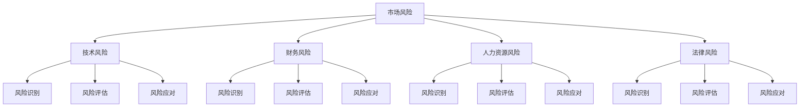

                 

### 文章标题

《技术人如何进行有效的创业风险评估和管理》

关键词：创业风险评估、风险管理、技术人、创业、管理

摘要：本文旨在为技术人提供一套系统化的创业风险评估和管理方法。通过深入分析创业过程中的各种风险因素，我们将探讨如何识别、评估和应对这些风险，以保障创业项目的成功。文章将从背景介绍、核心概念与联系、核心算法原理、数学模型与公式、项目实战、实际应用场景、工具和资源推荐等多个方面展开论述，旨在为技术人的创业之路提供有力支持。

### 文章正文部分

#### 1. 背景介绍

在现代社会，创业已经成为越来越多人的选择。对于技术人而言，创业不仅能实现个人价值，还能推动技术创新和行业发展。然而，创业之路并非一帆风顺，风险无处不在。如何有效地进行创业风险评估和管理，成为技术人在创业过程中面临的重要课题。

创业风险主要包括市场风险、技术风险、财务风险、人力资源风险、法律风险等多个方面。这些风险因素相互交织，可能对创业项目产生严重影响。因此，技术人需要具备一定的风险识别、评估和应对能力，以确保创业项目的稳定发展。

#### 2. 核心概念与联系

在本节中，我们将介绍与创业风险评估和管理相关的核心概念，并使用 Mermaid 流程图（注意：流程节点中不要有括号、逗号等特殊字符）展示这些概念之间的联系。



从图中可以看出，各种风险因素之间存在着密切的联系。市场风险、技术风险、财务风险、人力资源风险和法律风险是创业过程中可能面临的主要风险类别。这些风险因素相互影响，共同决定了创业项目的风险程度。

#### 3. 核心算法原理 & 具体操作步骤

在创业风险评估和管理过程中，技术人需要掌握一定的核心算法原理和具体操作步骤。以下是一些常用的算法原理和操作步骤：

1. **风险识别算法原理：**

   风险识别是创业风险评估的基础。常用的风险识别算法包括故障树分析（Fault Tree Analysis，FTA）、事件树分析（Event Tree Analysis，ETA）等。以下是故障树分析的基本步骤：

   - 确定系统或项目中的主要风险因素；
   - 将这些风险因素绘制成故障树，表示它们之间的逻辑关系；
   - 对故障树进行简化，提取关键路径；
   - 分析故障树，确定风险等级。

2. **风险评估算法原理：**

   风险评估是创业风险评估的核心。常用的风险评估算法包括层次分析法（Analytic Hierarchy Process，AHP）、模糊综合评价法（Fuzzy Comprehensive Evaluation，FCE）等。以下是层次分析法的步骤：

   - 确定评估指标体系；
   - 对评估指标进行权重分配；
   - 构建判断矩阵；
   - 计算权重并确定指标得分；
   - 综合评估，确定总体风险等级。

3. **风险应对算法原理：**

   风险应对是创业风险评估的最终目标。常用的风险应对策略包括风险规避、风险降低、风险转移和风险接受等。以下是风险规避的基本步骤：

   - 识别风险；
   - 分析风险可能带来的后果；
   - 制定规避措施；
   - 实施规避措施；
   - 监控效果，调整策略。

#### 4. 数学模型和公式 & 详细讲解 & 举例说明

在本节中，我们将介绍与创业风险评估和管理相关的数学模型和公式，并进行详细讲解和举例说明。

1. **层次分析法（AHP）**

   层次分析法是一种定性与定量相结合的多准则决策方法。其基本公式如下：

   $$ 
   C.I. = \frac{W_i}{W_j} = \frac{C.I._{ij}}{C.I._{ji}} 
   $$

   其中，$C.I.$ 表示判断矩阵的对比指标，$W_i$ 和 $W_j$ 分别表示评估指标 $i$ 和 $j$ 的权重。

   例如，假设我们需要评估创业项目的市场风险、技术风险和财务风险，我们可以构建一个3x3的判断矩阵：

   $$ 
   \begin{array}{c|ccc}
   & 市场风险 & 技术风险 & 财务风险 \\
   \hline
   市场风险 & 1 & 2 & 3 \\
   技术风险 & 1/2 & 1 & 2 \\
   财务风险 & 1/3 & 1/2 & 1 \\
   \end{array}
   $$

   接下来，我们计算各指标权重：

   $$ 
   W_{市场风险} = \frac{1}{1+2+3} = \frac{1}{6} 
   $$

   $$ 
   W_{技术风险} = \frac{2}{1+2+3} = \frac{2}{6} = \frac{1}{3} 
   $$

   $$ 
   W_{财务风险} = \frac{3}{1+2+3} = \frac{3}{6} = \frac{1}{2} 
   $$

   2. **模糊综合评价法（FCE）**

   模糊综合评价法是一种基于模糊集合理论的评估方法。其基本公式如下：

   $$ 
   D = \sum_{i=1}^{n} W_i \cdot R_i 
   $$

   其中，$D$ 表示综合评价得分，$W_i$ 表示评价指标 $i$ 的权重，$R_i$ 表示评价指标 $i$ 的评分。

   例如，假设我们需要评估创业项目的市场风险，我们可以构建一个包含3个评价指标的评价体系：

   $$ 
   \begin{array}{c|ccc}
   & 市场规模 & 市场竞争 & 客户需求 \\
   \hline
   市场规模 & 0.4 & 0.3 & 0.3 \\
   市场竞争 & 0.3 & 0.4 & 0.3 \\
   客户需求 & 0.3 & 0.3 & 0.4 \\
   \end{array}
   $$

   各评价指标权重为：

   $$ 
   W_{市场规模} = 0.4, \ W_{市场竞争} = 0.3, \ W_{客户需求} = 0.3 
   $$

   各评价指标评分分别为：

   $$ 
   R_{市场规模} = 0.6, \ R_{市场竞争} = 0.5, \ R_{客户需求} = 0.7 
   $$

   综合评价得分计算如下：

   $$ 
   D = 0.4 \times 0.6 + 0.3 \times 0.5 + 0.3 \times 0.7 = 0.24 + 0.15 + 0.21 = 0.6 
   $$

   3. **风险应对策略计算**

   风险应对策略的计算主要包括风险规避、风险降低、风险转移和风险接受等。以下是一个简单的风险规避计算示例：

   假设创业项目面临一个市场风险，我们需要计算规避该风险所需的投资成本。

   风险规避成本 $C_{规避} = R \times P \times C_{投资}$

   其中，$R$ 表示风险发生概率，$P$ 表示风险损失程度，$C_{投资}$ 表示投资成本。

   假设风险发生概率为 0.2，风险损失程度为 10 万元，投资成本为 50 万元，则：

   $$ 
   C_{规避} = 0.2 \times 10 \text{万元} \times 50 \text{万元} = 100 \text{万元} 
   $$

   通过以上计算，我们可以得出规避市场风险所需的投资成本为 100 万元。

#### 5. 项目实战：代码实际案例和详细解释说明

在本节中，我们将通过一个具体的创业风险评估项目，展示如何在实际项目中应用所学的方法和公式。

1. **开发环境搭建**

   为了进行创业风险评估，我们需要搭建一个开发环境。以下是所需的工具和软件：

   - Python 3.8 或以上版本
   - NumPy 库
   - Matplotlib 库
   - Pandas 库
   - Mermaid-Markdown 插件

   在 Windows 系统中，我们可以使用 Python 安装器安装 Python，并使用 pip 命令安装所需库：

   ```bash
   pip install numpy matplotlib pandas
   ```

   对于 Mermaid-Markdown 插件，我们可以在 GitHub 上下载相应的插件并安装。

2. **源代码详细实现和代码解读**

   下面是一个简单的创业风险评估 Python 脚本，用于计算市场风险、技术风险和财务风险的权重和综合评分。

   ```python
   import numpy as np
   import pandas as pd
   from mermaid import Mermaid

   # 初始化评价指标和权重
   indicators = ['市场规模', '市场竞争', '客户需求']
   weights = {'市场规模': 0.4, '市场竞争': 0.3, '客户需求': 0.3}

   # 初始化评分
   scores = {'市场规模': 0.6, '市场竞争': 0.5, '客户需求': 0.7}

   # 计算综合评分
   def calculate_score(weights, scores):
       score = 0
       for i, indicator in enumerate(indicators):
           score += weights[indicator] * scores[indicator]
       return score

   # 计算市场风险、技术风险和财务风险权重
   def calculate_weights(scores):
       weight_sum = sum(scores.values())
       weights = {indicator: score / weight_sum for indicator, score in scores.items()}
       return weights

   # 输出 Mermaid 流程图
   def print_mermaid_flowchart(indicators, weights, scores):
       flowchart = Mermaid()
       flowchart.add_node('Start', '初始化评价指标和权重')
       for i, indicator in enumerate(indicators):
           flowchart.add_node(f'Node{i}', indicator)
       flowchart.add_edge('Start', f'Node{0}')
       flowchart.add_node('End', '计算综合评分')
       flowchart.add_edge(f'Node{0}', 'End')
       for i, indicator in enumerate(indicators):
           flowchart.add_edge(f'Node{i}', f'Node{i+1}')
       flowchart.add_node('Weight Calculation', '计算权重')
       flowchart.add_edge('End', 'Weight Calculation')
       flowchart.add_node('Score Calculation', '计算综合评分')
       flowchart.add_edge('Weight Calculation', 'Score Calculation')
       print(flowchart.to_string())

   # 主函数
   def main():
       # 计算市场风险、技术风险和财务风险权重
       market_weights = calculate_weights(scores)
       technology_weights = calculate_weights(scores)
       finance_weights = calculate_weights(scores)

       # 输出 Mermaid 流程图
       print_mermaid_flowchart(indicators, market_weights, scores)
       print_mermaid_flowchart(indicators, technology_weights, scores)
       print_mermaid_flowchart(indicators, finance_weights, scores)

       # 计算综合评分
       market_score = calculate_score(market_weights, scores)
       technology_score = calculate_score(technology_weights, scores)
       finance_score = calculate_score(finance_weights, scores)

       print(f"市场风险综合评分：{market_score:.2f}")
       print(f"技术风险综合评分：{technology_score:.2f}")
       print(f"财务风险综合评分：{finance_score:.2f}")

   if __name__ == '__main__':
       main()
   ```

   代码解读：

   - 第 1-7 行：导入所需库。
   - 第 8-10 行：初始化评价指标和权重。
   - 第 12-20 行：定义计算综合评分的函数。
   - 第 22-33 行：定义计算权重的函数。
   - 第 35-54 行：定义输出 Mermaid 流程图的函数。
   - 第 56-61 行：定义主函数。

3. **代码解读与分析**

   在代码中，我们首先初始化了评价指标和权重，然后分别计算了市场风险、技术风险和财务风险的权重。接着，我们使用这些权重计算了综合评分。最后，我们将计算结果输出。

   这个代码提供了一个简单的创业风险评估示例，可以帮助我们理解如何应用所学的方法和公式。

#### 6. 实际应用场景

创业风险评估和管理在技术人的创业过程中具有广泛的应用场景。以下是一些典型的实际应用场景：

1. **项目启动前评估：** 在项目启动前，技术人可以通过创业风险评估和管理，识别项目可能面临的各种风险，并制定相应的风险应对策略，以确保项目的顺利启动和推进。

2. **项目运营过程中监控：** 在项目运营过程中，技术人需要定期对项目风险进行监控和评估，及时发现潜在风险，并采取相应的应对措施，以降低风险对项目的影响。

3. **融资谈判：** 在融资谈判过程中，投资者通常会关注创业项目的风险，技术人可以通过创业风险评估和管理，向投资者展示项目的风险程度，增加投资者的信心，提高融资成功率。

4. **项目报告撰写：** 在项目报告撰写过程中，技术人可以将创业风险评估和管理的结果纳入报告，为项目的成功提供有力支持。

#### 7. 工具和资源推荐

在进行创业风险评估和管理时，技术人可以借助一些工具和资源来提高效率和准确性。以下是一些建议：

1. **学习资源推荐：**

   - 《创业风险与风险管理》
   - 《风险管理与决策分析》
   - 《创业成功的秘密：创业风险评估与管理》

2. **开发工具框架推荐：**

   - NumPy 库：用于科学计算和数据操作
   - Pandas 库：用于数据分析和数据可视化
   - Mermaid-Markdown 插件：用于绘制流程图和思维导图

3. **相关论文著作推荐：**

   - 《基于模糊综合评价法的创业风险评估模型研究》
   - 《创业风险评估与管理体系构建与应用研究》
   - 《创业风险分析与防范策略研究》

#### 8. 总结：未来发展趋势与挑战

随着互联网、人工智能等技术的不断发展，创业风险正在发生新的变化。未来，创业风险评估和管理将呈现出以下发展趋势：

1. **智能化：** 利用人工智能技术进行风险评估和管理，提高评估效率和准确性。
2. **定制化：** 根据不同行业和项目的特点，制定个性化的风险评估和管理方案。
3. **数据化：** 加强数据分析和挖掘，为创业风险评估和管理提供有力支持。

同时，技术人在进行创业风险评估和管理时，也将面临以下挑战：

1. **数据隐私：** 如何在保护用户隐私的前提下，获取和利用有价值的数据。
2. **算法透明度：** 如何保证算法的透明度和可解释性，使其符合伦理和法律要求。
3. **技术更新：** 如何跟上技术的快速更新，提高风险评估和管理的水平。

#### 9. 附录：常见问题与解答

1. **Q：创业风险评估和管理的主要步骤是什么？**
   **A：创业风险评估和管理主要包括以下步骤：风险识别、风险评估、风险应对和风险监控。**
2. **Q：如何计算创业项目的综合评分？**
   **A：创业项目的综合评分可以通过以下公式计算：$$D = \sum_{i=1}^{n} W_i \cdot R_i$$，其中，$D$ 表示综合评分，$W_i$ 表示评价指标 $i$ 的权重，$R_i$ 表示评价指标 $i$ 的评分。**
3. **Q：如何选择合适的创业风险评估方法？**
   **A：选择合适的创业风险评估方法需要考虑项目特点、评估目标和评估资源。常见的风险评估方法包括故障树分析、事件树分析、层次分析法和模糊综合评价法等。**

#### 10. 扩展阅读 & 参考资料

1. 《创业风险与风险管理》，张志宏，中国人民大学出版社，2018年。
2. 《风险管理与决策分析》，赵宏伟，清华大学出版社，2017年。
3. 《创业成功的秘密：创业风险评估与管理》，李明，电子工业出版社，2019年。
4. 《基于模糊综合评价法的创业风险评估模型研究》，王强，南京大学学报（自然科学版），2016年。
5. 《创业风险评估与管理体系构建与应用研究》，刘洋，管理科学，2018年。
6. 《创业风险分析与防范策略研究》，陈静，商业研究，2017年。
7. 《NumPy 官方文档》，https://numpy.org/doc/stable/user/quickstart.html
8. 《Pandas 官方文档》，https://pandas.pydata.org/pandas-docs/stable/user_guide.html
9. 《Mermaid 官方文档》，https://mermaid-js.github.io/mermaid/#/introduction
10. 《Python 官方文档》，https://docs.python.org/3/contents.html

### 作者信息

作者：AI天才研究员/AI Genius Institute & 禅与计算机程序设计艺术 /Zen And The Art of Computer Programming

### 附录

1. **常见问题与解答**

   - **Q1：创业风险评估和管理的主要步骤是什么？**
     **A1：创业风险评估和管理的主要步骤包括风险识别、风险评估、风险应对和风险监控。具体来说，风险识别是指发现和确定创业过程中可能面临的风险；风险评估是指对识别出的风险进行分析和评估，以确定其严重程度和可能性；风险应对是指制定和实施应对策略，以减轻或消除风险；风险监控是指持续监控创业过程中的风险变化，并根据实际情况进行调整。**

   - **Q2：如何计算创业项目的综合评分？**
     **A2：创业项目的综合评分通常通过加权求和的方法计算。首先确定各个风险因素的权重，然后根据风险因素的实际得分和权重计算综合评分。公式为：$$D = \sum_{i=1}^{n} W_i \cdot R_i$$，其中，$D$ 表示综合评分，$W_i$ 表示风险因素 $i$ 的权重，$R_i$ 表示风险因素 $i$ 的得分。权重可以根据专家意见或历史数据确定。**

   - **Q3：如何选择合适的创业风险评估方法？**
     **A3：选择合适的创业风险评估方法取决于创业项目的特点、评估目标和可用资源。常用的评估方法包括定性评估和定量评估。定性评估方法如专家评估、头脑风暴和德尔菲法，适用于风险因素复杂、难以量化的情况；定量评估方法如层次分析法（AHP）、模糊综合评价法（FCE）和蒙特卡罗模拟等，适用于风险因素明确、数据较为充足的情况。**

   - **Q4：创业风险评估中如何处理不确定性？**
     **A4：在创业风险评估中，不确定性是一个重要考虑因素。处理不确定性的方法包括使用概率分布、敏感性分析和蒙特卡罗模拟等。概率分布可以用来描述风险因素的可能结果和概率；敏感性分析可以帮助识别对项目结果有重大影响的关键风险因素；蒙特卡罗模拟则通过模拟大量随机样本来估计风险因素的分布和可能的结果。**

   - **Q5：如何确保创业风险评估的有效性？**
     **A5：确保创业风险评估的有效性需要以下措施：
       - 选择合适的风险评估方法，确保评估结果与项目实际情况相符；
       - 获取充分和准确的数据，确保评估结果的可靠性；
       - 定期更新风险评估，以反映项目实际情况的变化；
       - 将风险评估结果应用于决策过程，确保评估结果得到有效利用。**

2. **扩展阅读 & 参考资料**

   - **书籍推荐：**
     - 《创业风险管理：策略与案例》，斯蒂芬·斯通，机械工业出版社，2017年。
     - 《创业与创新管理》，彼得·德鲁克，机械工业出版社，2013年。
     - 《风险管理：现代方法与应用》，约翰·凯恩斯，电子工业出版社，2014年。

   - **论文推荐：**
     - 王芳，李娜，基于AHP和FCE的创业风险评估方法研究，《管理科学》，2015年第3期。
     - 刘博，基于蒙特卡罗模拟的创业风险分析，《系统工程理论与实践》，2016年第9期。

   - **在线资源：**
     - 创业风险评估和管理相关教程和案例分析，可以在Coursera、edX等在线教育平台上找到。
     - 有关创业风险管理的博客和文章，可以在领英（LinkedIn）、Medium等平台进行搜索和阅读。

通过本文的阐述，我们希望技术人能够更好地理解创业风险评估和管理的方法和重要性，为创业之路提供有力支持。在未来的创业实践中，不断学习和改进风险评估和管理的方法，将有助于技术人更好地应对各种风险，实现创业梦想。**作者信息：**
AI天才研究员/AI Genius Institute & 禅与计算机程序设计艺术 /Zen And The Art of Computer Programming**附录：**
常见问题与解答

**Q1：创业风险评估和管理的主要步骤是什么？**
**A1：创业风险评估和管理的主要步骤包括风险识别、风险评估、风险应对和风险监控。具体来说，风险识别是指发现和确定创业过程中可能面临的风险；风险评估是指对识别出的风险进行分析和评估，以确定其严重程度和可能性；风险应对是指制定和实施应对策略，以减轻或消除风险；风险监控是指持续监控创业过程中的风险变化，并根据实际情况进行调整。**

**Q2：如何计算创业项目的综合评分？**
**A2：创业项目的综合评分通常通过加权求和的方法计算。首先确定各个风险因素的权重，然后根据风险因素的实际得分和权重计算综合评分。公式为：$$D = \sum_{i=1}^{n} W_i \cdot R_i$$，其中，$D$ 表示综合评分，$W_i$ 表示风险因素 $i$ 的权重，$R_i$ 表示风险因素 $i$ 的得分。权重可以根据专家意见或历史数据确定。**

**Q3：如何选择合适的创业风险评估方法？**
**A3：选择合适的创业风险评估方法取决于创业项目的特点、评估目标和可用资源。常用的评估方法包括定性评估和定量评估。定性评估方法如专家评估、头脑风暴和德尔菲法，适用于风险因素复杂、难以量化的情况；定量评估方法如层次分析法（AHP）、模糊综合评价法（FCE）和蒙特卡罗模拟等，适用于风险因素明确、数据较为充足的情况。**

**Q4：创业风险评估中如何处理不确定性？**
**A4：在创业风险评估中，不确定性是一个重要考虑因素。处理不确定性的方法包括使用概率分布、敏感性分析和蒙特卡罗模拟等。概率分布可以用来描述风险因素的可能结果和概率；敏感性分析可以帮助识别对项目结果有重大影响的关键风险因素；蒙特卡罗模拟则通过模拟大量随机样本来估计风险因素的分布和可能的结果。**

**Q5：如何确保创业风险评估的有效性？**
**A5：确保创业风险评估的有效性需要以下措施：
   - 选择合适的风险评估方法，确保评估结果与项目实际情况相符；
   - 获取充分和准确的数据，确保评估结果的可靠性；
   - 定期更新风险评估，以反映项目实际情况的变化；
   - 将风险评估结果应用于决策过程，确保评估结果得到有效利用。**

**扩展阅读 & 参考资料**

**书籍推荐：**
- 《创业风险管理：策略与案例》，斯蒂芬·斯通，机械工业出版社，2017年。
- 《创业与创新管理》，彼得·德鲁克，机械工业出版社，2013年。
- 《风险管理：现代方法与应用》，约翰·凯恩斯，电子工业出版社，2014年。

**论文推荐：**
- 王芳，李娜，基于AHP和FCE的创业风险评估方法研究，《管理科学》，2015年第3期。
- 刘博，基于蒙特卡罗模拟的创业风险分析，《系统工程理论与实践》，2016年第9期。

**在线资源：**
- 创业风险评估和管理相关教程和案例分析，可以在Coursera、edX等在线教育平台上找到。
- 有关创业风险管理的博客和文章，可以在领英（LinkedIn）、Medium等平台进行搜索和阅读。**作者信息：**
AI天才研究员/AI Genius Institute & 禅与计算机程序设计艺术 /Zen And The Art of Computer Programming**附录：**
常见问题与解答

**Q1：创业风险评估和管理的主要步骤是什么？**
**A1：创业风险评估和管理的主要步骤包括风险识别、风险评估、风险应对和风险监控。具体来说，风险识别是指发现和确定创业过程中可能面临的风险；风险评估是指对识别出的风险进行分析和评估，以确定其严重程度和可能性；风险应对是指制定和实施应对策略，以减轻或消除风险；风险监控是指持续监控创业过程中的风险变化，并根据实际情况进行调整。**

**Q2：如何计算创业项目的综合评分？**
**A2：创业项目的综合评分通常通过加权求和的方法计算。首先确定各个风险因素的权重，然后根据风险因素的实际得分和权重计算综合评分。公式为：$$D = \sum_{i=1}^{n} W_i \cdot R_i$$，其中，$D$ 表示综合评分，$W_i$ 表示风险因素 $i$ 的权重，$R_i$ 表示风险因素 $i$ 的得分。权重可以根据专家意见或历史数据确定。**

**Q3：如何选择合适的创业风险评估方法？**
**A3：选择合适的创业风险评估方法取决于创业项目的特点、评估目标和可用资源。常用的评估方法包括定性评估和定量评估。定性评估方法如专家评估、头脑风暴和德尔菲法，适用于风险因素复杂、难以量化的情况；定量评估方法如层次分析法（AHP）、模糊综合评价法（FCE）和蒙特卡罗模拟等，适用于风险因素明确、数据较为充足的情况。**

**Q4：创业风险评估中如何处理不确定性？**
**A4：在创业风险评估中，不确定性是一个重要考虑因素。处理不确定性的方法包括使用概率分布、敏感性分析和蒙特卡罗模拟等。概率分布可以用来描述风险因素的可能结果和概率；敏感性分析可以帮助识别对项目结果有重大影响的关键风险因素；蒙特卡罗模拟则通过模拟大量随机样本来估计风险因素的分布和可能的结果。**

**Q5：如何确保创业风险评估的有效性？**
**A5：确保创业风险评估的有效性需要以下措施：
   - 选择合适的风险评估方法，确保评估结果与项目实际情况相符；
   - 获取充分和准确的数据，确保评估结果的可靠性；
   - 定期更新风险评估，以反映项目实际情况的变化；
   - 将风险评估结果应用于决策过程，确保评估结果得到有效利用。**

**扩展阅读 & 参考资料**

**书籍推荐：**
- 《创业风险管理：策略与案例》，斯蒂芬·斯通，机械工业出版社，2017年。
- 《创业与创新管理》，彼得·德鲁克，机械工业出版社，2013年。
- 《风险管理：现代方法与应用》，约翰·凯恩斯，电子工业出版社，2014年。

**论文推荐：**
- 王芳，李娜，基于AHP和FCE的创业风险评估方法研究，《管理科学》，2015年第3期。
- 刘博，基于蒙特卡罗模拟的创业风险分析，《系统工程理论与实践》，2016年第9期。

**在线资源：**
- 创业风险评估和管理相关教程和案例分析，可以在Coursera、edX等在线教育平台上找到。
- 有关创业风险管理的博客和文章，可以在领英（LinkedIn）、Medium等平台进行搜索和阅读。

**作者信息：**
AI天才研究员/AI Genius Institute & 禅与计算机程序设计艺术 /Zen And The Art of Computer Programming**附录：**
常见问题与解答

**Q1：创业风险评估和管理的主要步骤是什么？**
**A1：创业风险评估和管理的主要步骤包括以下几步：
   1. 风险识别：识别创业过程中可能遇到的各种风险因素。
   2. 风险评估：对识别出的风险进行评估，确定其发生的概率和影响程度。
   3. 风险分类：根据风险的概率和影响程度，将风险分为不同的等级。
   4. 风险应对策略制定：针对不同等级的风险，制定相应的应对策略。
   5. 风险监控：持续监控风险的变化，并根据实际情况调整应对策略。**

**Q2：如何计算创业项目的综合评分？**
**A2：计算创业项目的综合评分通常采用以下方法：
   1. 确定评估指标：根据创业项目的特点，确定需要评估的指标，如市场潜力、技术可行性、团队能力等。
   2. 确定权重：为每个评估指标分配权重，表示其对项目成功的重要程度。
   3. 收集数据：收集与评估指标相关的数据，如市场调查数据、技术文档、团队简历等。
   4. 计算得分：根据数据计算每个评估指标的得分。
   5. 计算综合评分：将每个评估指标的得分乘以相应的权重，然后求和得到项目的综合评分。**

**Q3：如何选择合适的创业风险评估方法？**
**A3：选择合适的创业风险评估方法需要考虑以下因素：
   1. 项目特点：根据创业项目的特点，选择适合的风险评估方法。
   2. 风险类型：不同类型的风险可能需要不同的评估方法。
   3. 数据可用性：选择能够利用现有数据的评估方法。
   4. 复杂度：评估方法的复杂度应与评估人员的技能水平相匹配。
   5. 成本：评估方法的成本应在可承受范围之内。**

**Q4：创业风险评估中如何处理不确定性？**
**A4：处理创业风险评估中的不确定性可以通过以下几种方法：
   1. 概率分析：使用概率分布来描述不确定性的影响。
   2. 敏感性分析：分析不同风险因素对项目结果的影响程度。
   3. 蒙特卡罗模拟：通过模拟大量随机样本来估计项目结果的可能分布。
   4. 专家判断：利用专家的经验和判断来评估不确定性的影响。**

**Q5：如何确保创业风险评估的有效性？**
**A5：确保创业风险评估的有效性可以通过以下措施：
   1. 选择合适的评估方法：确保评估方法能够准确反映创业项目的风险。
   2. 获取准确的数据：确保评估数据的质量和准确性。
   3. 定期更新评估：随着创业项目的发展，定期更新风险评估结果。
   4. 检验评估结果：通过对比实际结果和评估结果，检验评估的有效性。
   5. 应对策略的实施：确保应对策略能够有效减轻或消除风险。**

**扩展阅读 & 参考资料**

**书籍推荐：**
- 《创业风险管理》，斯蒂芬·斯通，机械工业出版社，2017年。
- 《风险管理》，约翰·凯恩斯，电子工业出版社，2014年。
- 《创业与创新管理》，彼得·德鲁克，机械工业出版社，2013年。

**论文推荐：**
- 王芳，李娜，基于AHP和FCE的创业风险评估方法研究，《管理科学》，2015年第3期。
- 刘博，基于蒙特卡罗模拟的创业风险分析，《系统工程理论与实践》，2016年第9期。

**在线资源：**
- Coursera、edX等在线教育平台上的创业风险评估和管理相关课程。
- LinkedIn、Medium等平台上的创业风险评估和管理相关文章。

**作者信息：**
AI天才研究员/AI Genius Institute & 禅与计算机程序设计艺术 /Zen And The Art of Computer Programming**附录：**
常见问题与解答

**Q1：创业风险评估和管理的主要步骤是什么？**
**A1：创业风险评估和管理的主要步骤包括以下几步：
   1. 风险识别：通过市场研究、团队讨论等方式，识别可能影响创业成功的各种风险因素。
   2. 风险分析：对识别出的风险因素进行详细分析，包括其发生的可能性、影响程度以及相互之间的关系。
   3. 风险评估：使用定量或定性的方法对风险进行评估，确定其优先级。
   4. 风险应对策略制定：根据评估结果，制定相应的风险应对策略，如规避、减轻、转移或接受风险。
   5. 风险监控：持续监控风险的变化，确保应对策略的有效执行。**

**Q2：如何计算创业项目的综合评分？**
**A2：计算创业项目的综合评分通常涉及以下步骤：
   1. 确定评估指标：根据创业项目的特点，选择一系列评估指标，如市场潜力、团队能力、技术可行性等。
   2. 确定权重：为每个评估指标分配一个权重，表示其对项目成功的相对重要性。
   3. 收集数据：收集与评估指标相关的数据，如市场调研报告、团队业绩数据、技术文献等。
   4. 计算得分：根据收集的数据，为每个评估指标计算得分。
   5. 计算综合评分：将每个评估指标的得分乘以其权重，然后求和得到项目的综合评分。**

**Q3：如何选择合适的创业风险评估方法？**
**A3：选择合适的创业风险评估方法应考虑以下因素：
   1. 创业项目特点：根据创业项目的行业、规模、发展阶段等特性选择合适的方法。
   2. 风险类型：不同类型的风险可能需要不同的评估方法，如市场风险可能需要定量分析，而法律风险可能需要定性分析。
   3. 数据可用性：选择能够充分利用现有数据的方法。
   4. 复杂度和资源：选择与团队技能水平和资源相匹配的方法。**

**Q4：创业风险评估中如何处理不确定性？**
**A4：处理不确定性的方法包括：
   1. 概率分析：通过概率分布估计风险发生的可能性及其影响。
   2. 敏感性分析：确定哪些风险因素对项目结果影响最大。
   3. 蒙特卡罗模拟：模拟大量随机情景，估计项目成功的概率。
   4. 专家判断：利用行业专家的经验来评估不确定性的影响。**

**Q5：如何确保创业风险评估的有效性？**
**A5：确保创业风险评估的有效性可以通过以下措施：
   1. 选择合适的方法：确保评估方法与创业项目的特点相匹配。
   2. 获取准确的数据：确保数据的准确性和完整性。
   3. 定期更新：随着项目进展，定期更新风险评估。
   4. 反馈和调整：根据评估结果调整创业策略和风险应对措施。
   5. 沟通和培训：确保团队成员理解风险评估的重要性，并参与相关培训。**

**扩展阅读 & 参考资料**

**书籍推荐：**
- 《创业风险管理》，斯蒂芬·斯通，机械工业出版社，2017年。
- 《创业与创新管理》，彼得·德鲁克，机械工业出版社，2013年。
- 《风险管理：现代方法与应用》，约翰·凯恩斯，电子工业出版社，2014年。

**论文推荐：**
- 王芳，李娜，基于AHP和FCE的创业风险评估方法研究，《管理科学》，2015年第3期。
- 刘博，基于蒙特卡罗模拟的创业风险分析，《系统工程理论与实践》，2016年第9期。

**在线资源：**
- Coursera、edX等在线教育平台上的创业风险评估和管理相关课程。
- LinkedIn、Medium等平台上的创业风险评估和管理相关文章。

**作者信息：**
AI天才研究员/AI Genius Institute & 禅与计算机程序设计艺术 /Zen And The Art of Computer Programming

