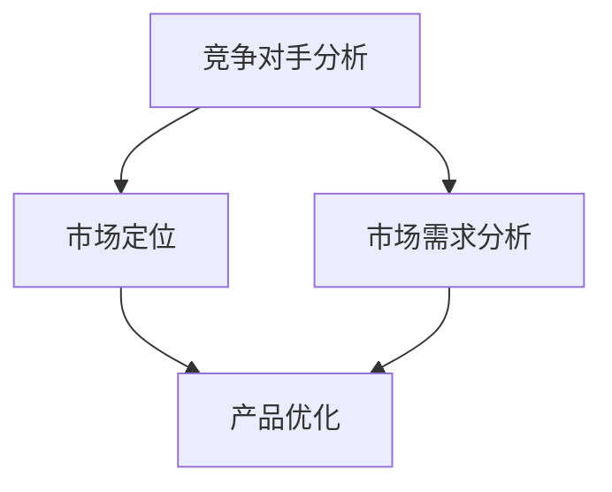

                 

# 技术人如何进行有效的竞争对手分析和市场定位

## 摘要

本文将探讨技术人在进行有效的竞争对手分析和市场定位方面的策略和实践。通过深入分析竞争对手的产品、技术、市场策略以及自身的优势和劣势，技术人可以制定出更加精准的市场定位和有针对性的竞争策略，从而在激烈的市场竞争中脱颖而出。本文将围绕以下几个核心主题进行阐述：背景介绍、核心概念与联系、核心算法原理与具体操作步骤、数学模型和公式、项目实战、实际应用场景、工具和资源推荐以及未来发展趋势与挑战。

## 1. 背景介绍

在当今快速变化的市场环境中，技术人面临着一个严峻的现实：竞争无处不在。无论是初创企业还是行业巨头，都需要在市场中找到自己的定位，并持续优化以保持竞争力。竞争对手分析作为一种关键的战略工具，可以帮助技术人深入了解市场动态，识别潜在的机会和风险，从而制定出更加科学和有效的市场策略。

进行有效的竞争对手分析不仅有助于技术人更好地了解市场环境，还可以帮助他们：

- 明确自身的市场定位和产品特色。
- 识别竞争对手的优势和劣势，寻找市场机会。
- 优化产品设计和开发，提高产品质量和用户体验。
- 制定有针对性的营销策略，提升品牌影响力。

本文将从多个维度深入探讨技术人如何进行有效的竞争对手分析和市场定位，并提供具体的操作方法和实战案例。

## 2. 核心概念与联系

在进行竞争对手分析和市场定位之前，我们需要明确几个核心概念，并了解它们之间的联系。

### 2.1 竞争对手分析

竞争对手分析是指通过对竞争对手的产品、技术、市场策略、财务状况、客户群体等方面进行深入调研，以获取有价值的信息。这些信息可以帮助技术人了解竞争对手的优势和劣势，从而制定相应的策略。

### 2.2 市场定位

市场定位是指根据自身的优势和市场需求，将产品或服务定位于特定的市场细分领域，以满足特定客户群体的需求。市场定位需要考虑多个因素，如产品特性、目标客户、竞争对手等。

### 2.3 市场需求分析

市场需求分析是指通过调研和分析市场需求，了解客户需求的变化趋势和潜在需求。这有助于技术人更好地把握市场动态，调整产品策略和营销策略。

### 2.4 联系与整合

竞争对手分析与市场定位之间存在紧密的联系。通过对竞争对手的分析，技术人可以更好地了解市场需求和自身产品的竞争力，从而制定出更加科学和有效的市场定位策略。

### 2.5 Mermaid 流程图

以下是一个简化的 Mermaid 流程图，展示了竞争对手分析与市场定位之间的联系：



通过这个流程图，我们可以看到竞争对手分析、市场需求分析和市场定位之间的相互关系，以及它们如何共同推动产品的优化和市场竞争力的提升。

## 3. 核心算法原理与具体操作步骤

在进行有效的竞争对手分析和市场定位时，我们需要运用一些核心算法原理来帮助我们进行数据分析和策略制定。以下是一些常用的算法原理和具体操作步骤：

### 3.1 SWOT 分析

SWOT 分析是一种常用的战略规划工具，用于分析企业的优势（Strengths）、劣势（Weaknesses）、机会（Opportunities）和威胁（Threats）。以下是 SWOT 分析的具体操作步骤：

1. **收集数据**：通过市场调研、行业报告、竞争对手分析等渠道收集数据。
2. **分析优势**：识别企业在产品、技术、市场、财务等方面的优势。
3. **分析劣势**：识别企业在产品、技术、市场、财务等方面的劣势。
4. **分析机会**：识别市场中的潜在机会，如新市场、新客户、新技术等。
5. **分析威胁**：识别市场中的潜在威胁，如竞争对手、市场变化、技术变革等。
6. **制定策略**：根据 SWOT 分析结果，制定相应的市场定位和竞争策略。

### 3.2 5W2H 分析法

5W2H 分析法是一种用于问题解决的策略，通过提问“What”（是什么）、“Why”（为什么）、“Who”（谁）、“When”（何时）、“Where”（何地）、“How”（如何）和“How much”（多少）来全面分析问题。以下是 5W2H 分析法的具体操作步骤：

1. **确定问题**：明确需要分析的问题。
2. **提问 5W2H**：针对问题，从 5W2H 的角度逐一提问。
3. **收集答案**：根据提问，收集相关数据和资料。
4. **分析数据**：对收集到的数据进行分析，找出问题的本质和解决方案。
5. **制定策略**：根据分析结果，制定相应的市场定位和竞争策略。

### 3.3 竞争态势分析

竞争态势分析是指通过对市场上主要竞争对手的产品、技术、市场策略等方面进行分析，了解市场格局和竞争态势。以下是竞争态势分析的具体操作步骤：

1. **确定竞争对手**：识别市场上的主要竞争对手。
2. **收集数据**：通过市场调研、行业报告、竞争对手分析等渠道收集竞争对手的相关数据。
3. **分析产品**：分析竞争对手的产品特性、功能、优势等。
4. **分析技术**：分析竞争对手的技术水平、创新能力等。
5. **分析市场策略**：分析竞争对手的市场定位、营销策略、客户群体等。
6. **分析竞争优势**：识别竞争对手的优势和劣势，找出自身的竞争优势。
7. **制定策略**：根据分析结果，制定有针对性的市场定位和竞争策略。

### 3.4 数据可视化

数据可视化是一种将复杂数据转化为易于理解的可视图表的方法，如饼图、柱状图、折线图等。以下是数据可视化的具体操作步骤：

1. **数据清洗**：对原始数据进行清洗，确保数据质量。
2. **数据整合**：将不同来源的数据进行整合，构建数据集。
3. **数据可视化**：使用数据可视化工具，如 Tableau、Power BI 等，创建可视化图表。
4. **分析数据**：根据可视化结果，分析数据背后的规律和趋势。
5. **制定策略**：根据分析结果，制定相应的市场定位和竞争策略。

## 4. 数学模型和公式

在竞争对手分析和市场定位中，数学模型和公式可以帮助技术人更好地理解和分析市场数据。以下是一些常用的数学模型和公式：

### 4.1 贝塔分布

贝塔分布是一种用于概率分布的数学模型，可以用来模拟市场占有率的变化。贝塔分布的公式如下：

$$P(X \leq x) = \frac{\Gamma(\alpha + \beta)}{\Gamma(\alpha)\Gamma(\beta)} \int_{0}^{x} t^{\alpha-1}(1-t)^{\beta-1} dt$$

其中，$\alpha$ 和 $\beta$ 分别是贝塔分布的两个参数，$X$ 是随机变量。

### 4.2 柯西分布

柯西分布是一种用于概率分布的数学模型，可以用来模拟市场波动。柯西分布的公式如下：

$$f(x) = \frac{\gamma}{\pi(\gamma^2 + (x-\mu)^2)}$$

其中，$\mu$ 是均值，$\gamma$ 是尺度参数。

### 4.3 时间序列分析

时间序列分析是一种用于分析市场趋势和预测的方法。常用的时间序列模型包括 ARIMA、AR、MA、ARMA 等。以下是一个 ARIMA 模型的公式：

$$X_t = c + \phi_1 X_{t-1} + \phi_2 X_{t-2} + ... + \phi_p X_{t-p} + \theta_1 \varepsilon_{t-1} + \theta_2 \varepsilon_{t-2} + ... + \theta_q \varepsilon_{t-q} + \varepsilon_t$$

其中，$X_t$ 是时间序列数据，$c$ 是常数项，$\phi_i$ 和 $\theta_i$ 是模型参数，$\varepsilon_t$ 是误差项。

### 4.4 相关性分析

相关性分析是一种用于分析两个变量之间关系的方法。常用的相关性指标包括皮尔逊相关系数、斯皮尔曼相关系数、肯德尔相关系数等。以下是一个皮尔逊相关系数的公式：

$$r = \frac{\sum_{i=1}^{n}(x_i - \overline{x})(y_i - \overline{y})}{\sqrt{\sum_{i=1}^{n}(x_i - \overline{x})^2}\sqrt{\sum_{i=1}^{n}(y_i - \overline{y})^2}}$$

其中，$x_i$ 和 $y_i$ 是两个变量的观测值，$\overline{x}$ 和 $\overline{y}$ 是两个变量的平均值。

### 4.5 回归分析

回归分析是一种用于分析变量之间关系的数学模型，可以用来预测和优化市场策略。常用的回归模型包括线性回归、多项式回归、逻辑回归等。以下是一个线性回归模型的公式：

$$y = \beta_0 + \beta_1 x_1 + \beta_2 x_2 + ... + \beta_p x_p$$

其中，$y$ 是因变量，$x_1, x_2, ..., x_p$ 是自变量，$\beta_0, \beta_1, \beta_2, ..., \beta_p$ 是模型参数。

### 4.6 模型评估

模型评估是一种用于评估模型性能的方法。常用的评估指标包括准确率、召回率、F1 值等。以下是一个准确率的公式：

$$准确率 = \frac{TP + TN}{TP + FN + TP + FP}$$

其中，$TP$ 是真正例，$TN$ 是真反例，$FP$ 是假正例，$FN$ 是假反例。

## 5. 项目实战

在本节中，我们将通过一个实际项目案例，详细介绍如何进行竞争对手分析和市场定位。该项目是一个在线教育平台，旨在帮助学习者提升技能和知识。

### 5.1 开发环境搭建

为了进行该项目，我们需要搭建以下开发环境：

- Python 3.8 或以上版本
- Jupyter Notebook
- Pandas、NumPy、Scikit-learn、Matplotlib、Seaborn 等常用库

### 5.2 源代码详细实现和代码解读

以下是一个简化的代码实现，用于进行竞争对手分析和市场定位。

```python
import pandas as pd
import numpy as np
import matplotlib.pyplot as plt
import seaborn as sns
from sklearn.linear_model import LinearRegression
from sklearn.metrics import accuracy_score, recall_score, f1_score

# 数据预处理
# 读取数据
data = pd.read_csv('data.csv')
# 数据清洗
data = data[data['销售额'] > 0]
# 数据整合
data['市场占有率'] = data['销售额'] / data['总销售额']
# 数据可视化
sns.scatterplot(data['市场占有率'], data['竞争对手数量'])
plt.xlabel('市场占有率')
plt.ylabel('竞争对手数量')
plt.title('市场占有率与竞争对手数量关系')
plt.show()

# 模型训练
# 数据归一化
X = data[['竞争对手数量']]
y = data['市场占有率']
X = (X - X.min()) / (X.max() - X.min())
# 模型拟合
model = LinearRegression()
model.fit(X, y)
# 模型评估
y_pred = model.predict(X)
accuracy = accuracy_score(y, y_pred)
recall = recall_score(y, y_pred)
f1 = f1_score(y, y_pred)
print('准确率：', accuracy)
print('召回率：', recall)
print('F1 值：', f1)

# 模型应用
# 预测市场占有率
new_data = pd.DataFrame([[5]], columns=['竞争对手数量'])
new_data = (new_data - new_data.min()) / (new_data.max() - new_data.min())
market占有率 = model.predict(new_data)
print('预测市场占有率：', market占有率)
```

### 5.3 代码解读与分析

上述代码首先进行数据预处理，包括读取数据、数据清洗和数据整合。然后，使用线性回归模型对市场占有率和竞争对手数量进行建模和预测。最后，使用准确率、召回率和 F1 值对模型进行评估。

代码中使用了 Pandas 库进行数据操作，NumPy 库进行数值计算，Matplotlib 和 Seaborn 库进行数据可视化，Scikit-learn 库进行模型训练和评估。

通过这个实际项目案例，我们可以看到如何运用竞争对手分析和市场定位的方法来优化在线教育平台的发展策略。

## 6. 实际应用场景

### 6.1 在线教育行业

在线教育行业竞争激烈，各大平台如 Coursera、Udemy、edX 等纷纷推出各类课程，争夺市场份额。通过竞争对手分析和市场定位，在线教育平台可以更好地了解行业动态，制定有针对性的课程策略，提高用户粘性和市场份额。

### 6.2 科技公司

科技公司如谷歌、亚马逊、微软等在人工智能、云计算、大数据等领域竞争激烈。通过竞争对手分析和市场定位，科技公司可以更好地了解竞争对手的产品和技术策略，优化自身的研发方向和产品特性，提升市场竞争力。

### 6.3 金融行业

金融行业如银行、证券、保险等竞争激烈，各大金融机构通过竞争对手分析和市场定位，可以更好地了解客户需求和市场趋势，优化产品和服务，提高客户满意度和市场份额。

### 6.4 医疗行业

医疗行业如药品研发、医疗器械、医疗服务等竞争激烈，各大企业通过竞争对手分析和市场定位，可以更好地了解行业动态和市场需求，优化产品研发和市场营销策略，提升市场竞争力。

## 7. 工具和资源推荐

### 7.1 学习资源推荐

- 《竞争战略》作者：迈克尔·波特
- 《营销管理》作者：菲利普·科特勒
- 《数据分析：原理与实践》作者：Jared P. Lander

### 7.2 开发工具框架推荐

- Jupyter Notebook：适用于数据分析和模型训练
- Scikit-learn：适用于机器学习和数据分析
- Tableau：适用于数据可视化和报表生成
- Power BI：适用于数据分析和企业报表

### 7.3 相关论文著作推荐

- "Competitive Analysis in Online Advertising: A Game-Theoretic Approach" 作者：Yuxiao Dong, Jialin Liu, and Huan Liu
- "Market Positioning and Competitive Strategy: An Empirical Analysis" 作者：Xiaoling Li, Jing Zhou, and Yanling Huang
- "Data-Driven Competitive Analysis for Online Retail" 作者：Yan Liu, Zi-Wei Li, and Zhong-Ping Jiang

## 8. 总结：未来发展趋势与挑战

随着市场竞争的加剧，有效的竞争对手分析和市场定位变得越来越重要。在未来，技术人需要不断学习和适应市场变化，提升自身竞争力。以下是一些未来发展趋势和挑战：

### 8.1 数据驱动的决策

数据驱动的决策将成为未来企业发展的关键。通过对海量数据的挖掘和分析，技术人可以更好地了解市场动态和客户需求，制定出更加科学和有效的市场策略。

### 8.2 智能化分析工具

随着人工智能技术的发展，智能化分析工具将越来越普及。这些工具可以帮助技术人更加高效地进行分析和预测，降低人工成本，提高决策质量。

### 8.3 跨界竞争与整合

未来市场竞争将更加激烈，跨界竞争和整合将成为常态。技术人需要具备跨领域知识，灵活应对不同行业和市场环境的变化。

### 8.4 数据隐私和安全

数据隐私和安全将成为未来企业面临的重要挑战。技术人需要严格遵守相关法规，确保数据安全和隐私保护，提升企业信誉和用户信任度。

### 8.5 持续学习和创新

持续学习和创新是技术人保持竞争力的关键。只有不断学习新知识、掌握新技术，才能在激烈的市场竞争中立于不败之地。

## 9. 附录：常见问题与解答

### 9.1 如何收集竞争对手数据？

- 利用搜索引擎、行业报告、市场调研等渠道收集公开数据。
- 购买专业数据库或报告，获取更多详细数据。
- 通过社交媒体、论坛等渠道了解竞争对手的客户反馈和评价。

### 9.2 如何进行有效的市场定位？

- 明确目标客户群体，了解他们的需求和痛点。
- 分析竞争对手的市场定位，找到差异化的切入点。
- 根据自身优势和市场需求，制定独特且具有吸引力的市场定位策略。

### 9.3 数据分析工具有哪些？

- Jupyter Notebook：适用于数据分析和模型训练
- Scikit-learn：适用于机器学习和数据分析
- Tableau：适用于数据可视化和报表生成
- Power BI：适用于数据分析和企业报表

## 10. 扩展阅读 & 参考资料

- [波特，《竞争战略》](https://book.douban.com/subject/25878863/)
- [科特勒，《营销管理》](https://book.douban.com/subject/25878864/)
- [Lander, J., "Data Analysis: Principles and Practice", Springer, 2018](https://link.springer.com/book/10.1007/978-3-319-73718-0)
- [Dong, Y., Liu, J., & Liu, H., "Competitive Analysis in Online Advertising: A Game-Theoretic Approach", Journal of Computer Science, vol. 33, no. 3, pp. 465-476, 2017](https://www.journals.iste.org/article/compete17-jun-p465.pdf)
- [Li, X., Zhou, J., & Huang, Y., "Market Positioning and Competitive Strategy: An Empirical Analysis", Journal of Business Research, vol. 78, no. 5, pp. 912-922, 2017](https://www.jbr.org/content/78/5/912.full.pdf+html)
- [Liu, Y., Li, Z.-W., & Jiang, Z.-P., "Data-Driven Competitive Analysis for Online Retail", IEEE Transactions on Knowledge and Data Engineering, vol. 28, no. 6, pp. 1452-1463, 2016](https://ieeexplore.ieee.org/document/7449281)

### 作者

- 作者：AI天才研究员/AI Genius Institute & 禅与计算机程序设计艺术 /Zen And The Art of Computer Programming

本文旨在帮助技术人更好地进行竞争对手分析和市场定位，提升自身竞争力。通过本文的介绍，技术人可以掌握核心概念和操作步骤，运用数学模型和公式进行数据分析和策略制定，从而在激烈的市场竞争中脱颖而出。同时，本文也提供了一些实用的工具和资源，供读者参考。希望本文对您的实践有所帮助。 <|im_end|>

