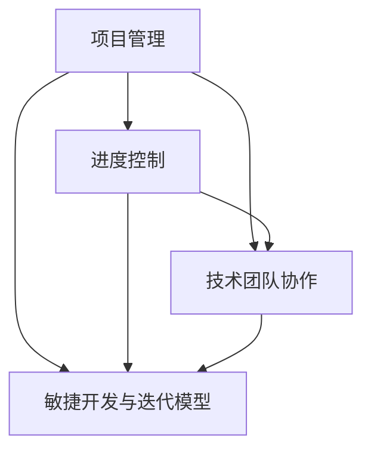

                 

# 技术人如何进行有效的项目管理和进度控制

> **关键词**：项目管理、进度控制、技术团队协作、敏捷开发、工具推荐

> **摘要**：本文将深入探讨技术人在项目管理和进度控制中的有效方法，通过分析核心概念、算法原理、数学模型，并结合实际开发案例，为读者提供实用的策略和工具。文章旨在帮助技术人在复杂的项目环境中，提高项目管理效率，确保项目按时完成。

## 1. 背景介绍

在当今快速发展的技术行业中，项目管理变得越来越复杂。技术团队需要面对不断变化的需求、紧张的交付时间和技术挑战。有效的项目管理和进度控制是确保项目成功的关键因素。本文将介绍以下主题：

- 项目管理的核心概念和原则
- 进度控制的方法和工具
- 技术团队协作的最佳实践
- 敏捷开发与迭代模型
- 实际应用场景中的案例分析
- 学习资源与开发工具的推荐

通过这些内容的讲解，希望能够帮助技术人更好地理解和应对项目管理中的各种挑战。

## 2. 核心概念与联系

在深入探讨项目管理和进度控制之前，我们首先需要了解一些核心概念和它们之间的联系。

### 2.1 项目管理

项目管理是一种系统的方法，用于规划、执行、监控和控制项目，以确保项目目标的实现。以下是项目管理的一些关键组成部分：

- **项目目标**：明确项目的目的和预期成果。
- **项目范围**：定义项目需要完成的工作内容和范围。
- **项目计划**：制定项目的进度、资源分配、预算和时间表。
- **项目执行**：实施项目计划，确保各项任务按计划进行。
- **项目监控**：跟踪项目进度、成本和质量，及时发现和解决问题。
- **项目收尾**：完成项目，进行项目评估和总结。

### 2.2 进度控制

进度控制是项目管理中至关重要的一环，它涉及对项目进度的监控和调整，以确保项目按时完成。以下是进度控制的关键组成部分：

- **进度计划**：根据项目计划制定具体的进度目标。
- **进度跟踪**：监控项目进度，确保各项任务按时完成。
- **偏差分析**：分析进度偏差，找出导致偏差的原因。
- **进度调整**：根据偏差分析结果调整项目计划，确保项目按时完成。

### 2.3 技术团队协作

技术团队协作是项目成功的关键。以下是一些促进团队协作的方法：

- **敏捷开发**：采用敏捷方法，快速迭代，灵活应对变化。
- **持续集成**：通过自动化测试和持续集成，提高开发效率和代码质量。
- **代码审查**：进行代码审查，确保代码的质量和一致性。
- **沟通机制**：建立有效的沟通机制，确保团队成员之间信息畅通。

### 2.4 敏捷开发与迭代模型

敏捷开发是一种以人为核心、迭代、循序渐进的开发方法。以下是敏捷开发的关键组成部分：

- **迭代周期**：将项目划分为多个短期迭代，每个迭代产出可工作的产品版本。
- **用户故事**：定义用户需求，以用户故事的形式进行需求管理。
- **迭代计划**：在每个迭代开始时，确定要完成的工作和优先级。
- **迭代评审**：在每个迭代结束时，进行评审和总结，持续改进。

### 2.5 Mermaid 流程图

以下是项目管理和进度控制相关的 Mermaid 流程图：



在这个流程图中，项目管理是核心，进度控制、技术团队协作和敏捷开发与迭代模型都是项目管理的组成部分，它们相互关联，共同确保项目的成功。

## 3. 核心算法原理 & 具体操作步骤

在进行项目管理和进度控制时，我们需要运用一些核心算法原理和具体操作步骤。以下是几个常用的方法和步骤：

### 3.1 项目计划

项目计划是项目管理的基础，它包括以下步骤：

1. **需求分析**：了解项目需求，明确项目目标。
2. **任务分解**：将项目任务分解为更小的子任务。
3. **资源分配**：根据任务需求，合理分配资源。
4. **制定进度计划**：确定任务完成时间和时间表。

### 3.2 进度监控

进度监控是确保项目按计划进行的关键。以下是进度监控的步骤：

1. **建立监控机制**：制定监控计划，选择合适的监控工具。
2. **定期检查进度**：定期检查任务进度，确保各项任务按时完成。
3. **分析进度偏差**：分析进度偏差，找出导致偏差的原因。
4. **调整计划**：根据进度偏差，调整项目计划，确保项目按时完成。

### 3.3 进度调整

进度调整是应对进度偏差的重要手段。以下是进度调整的步骤：

1. **分析偏差原因**：找出导致进度偏差的原因。
2. **调整任务优先级**：根据偏差原因，调整任务优先级。
3. **资源重新分配**：根据任务优先级，重新分配资源。
4. **更新进度计划**：更新项目进度计划，确保项目按时完成。

### 3.4 敏捷开发与迭代模型

敏捷开发与迭代模型的核心在于快速迭代和持续改进。以下是敏捷开发与迭代模型的步骤：

1. **用户故事编写**：根据用户需求，编写用户故事。
2. **迭代计划**：确定每个迭代的目标和任务。
3. **迭代执行**：执行迭代计划，完成每个迭代任务。
4. **迭代评审**：对每个迭代进行评审和总结，持续改进。

## 4. 数学模型和公式 & 详细讲解 & 举例说明

在项目管理和进度控制中，数学模型和公式可以帮助我们进行数据分析和决策。以下是几个常用的数学模型和公式，并结合具体例子进行详细讲解。

### 4.1 计划评审技术（PERT）

计划评审技术（PERT）是一种用于项目进度安排和预测的方法。它使用三个时间估计值（最乐观时间 \(t_O\)、最可能时间 \(t_M\) 和最悲观时间 \(t_P\)）来计算活动的时间期望值。

\[ t_E = \frac{t_O + 4t_M + t_P}{6} \]

假设一个项目有5个活动，每个活动的时间估计值如下：

| 活动 | \(t_O\) (天) | \(t_M\) (天) | \(t_P\) (天) |
| --- | --- | --- | --- |
| A | 3 | 5 | 7 |
| B | 2 | 4 | 6 |
| C | 4 | 6 | 8 |
| D | 5 | 7 | 9 |
| E | 6 | 8 | 10 |

计算每个活动的时间期望值：

\[ t_{E,A} = \frac{3 + 4 \times 5 + 7}{6} = 5.833 \]
\[ t_{E,B} = \frac{2 + 4 \times 4 + 6}{6} = 4.0 \]
\[ t_{E,C} = \frac{4 + 4 \times 6 + 8}{6} = 6.0 \]
\[ t_{E,D} = \frac{5 + 4 \times 7 + 9}{6} = 7.0 \]
\[ t_{E,E} = \frac{6 + 4 \times 8 + 10}{6} = 8.0 \]

### 4.2 关键路径法（CPM）

关键路径法（CPM）是一种用于确定项目最短完成时间的方法。它通过计算每个活动的最早开始时间（\(t_{es}\)）、最迟开始时间（\(t_{ls}\)）和总浮动时间（\(t_{tf}\））来确定关键路径。

- **最早开始时间**：活动可以开始的最早时间。

\[ t_{es} = \max(t_{es(i-1)}) + t_i \]

- **最迟开始时间**：活动必须开始的最迟时间，以确保项目按计划完成。

\[ t_{ls} = t_{es} - t_i \]

- **总浮动时间**：活动可以推迟的时间，而不会影响项目总时间。

\[ t_{tf} = t_{ls} - t_{es} \]

假设一个项目有5个活动，每个活动的时间需求如下：

| 活动 | \(t_i\) (天) |
| --- | --- |
| A | 3 |
| B | 2 |
| C | 4 |
| D | 5 |
| E | 6 |

计算每个活动的最早开始时间、最迟开始时间和总浮动时间：

| 活动 | \(t_{es}\) (天) | \(t_{ls}\) (天) | \(t_{tf}\) (天) |
| --- | --- | --- | --- |
| A | 0 | 3 | 0 |
| B | 3 | 5 | 0 |
| C | 7 | 9 | 0 |
| D | 11 | 16 | 0 |
| E | 17 | 22 | 0 |

关键路径为：A → B → C → D → E，总时间为22天。

### 4.3 例题

假设一个项目有5个活动，时间需求如下：

| 活动 | \(t_i\) (天) |
| --- | --- |
| A | 3 |
| B | 2 |
| C | 4 |
| D | 5 |
| E | 6 |

求关键路径和项目最短完成时间。

### 解答

计算每个活动的最早开始时间、最迟开始时间和总浮动时间：

| 活动 | \(t_{es}\) (天) | \(t_{ls}\) (天) | \(t_{tf}\) (天) |
| --- | --- | --- | --- |
| A | 0 | 3 | 0 |
| B | 3 | 5 | 0 |
| C | 7 | 9 | 0 |
| D | 11 | 16 | 0 |
| E | 17 | 22 | 0 |

关键路径为：A → B → C → D → E，总时间为22天。

## 5. 项目实战：代码实际案例和详细解释说明

在本节中，我们将通过一个具体的代码案例，展示如何在实际项目中应用项目管理和进度控制的方法。

### 5.1 开发环境搭建

为了便于演示，我们使用Python作为编程语言，并使用Jenkins作为持续集成工具。

- **Python环境**：安装Python 3.8及以上版本。
- **Jenkins环境**：安装Jenkins服务器，并在本地配置Jenkins客户端。

### 5.2 源代码详细实现和代码解读

以下是一个简单的项目示例，实现一个简单的Web应用，包含用户注册、登录和查看个人信息等功能。

```python
# app.py

from flask import Flask, request, jsonify

app = Flask(__name__)

users = {}

@app.route('/register', methods=['POST'])
def register():
    username = request.form['username']
    password = request.form['password']
    if username in users:
        return jsonify({'error': 'User already exists'}), 400
    users[username] = password
    return jsonify({'message': 'User registered successfully'})

@app.route('/login', methods=['POST'])
def login():
    username = request.form['username']
    password = request.form['password']
    if username not in users or users[username] != password:
        return jsonify({'error': 'Invalid username or password'}), 401
    return jsonify({'message': 'Login successful'})

@app.route('/profile', methods=['GET'])
def profile():
    username = request.args.get('username')
    if username not in users:
        return jsonify({'error': 'User not found'}), 404
    return jsonify({'username': username, 'password': users[username]})

if __name__ == '__main__':
    app.run(debug=True)
```

### 5.3 代码解读与分析

1. **项目结构**：项目采用单文件结构，包含3个主要函数：`register`、`login`和`profile`。
2. **功能实现**：`register`函数用于用户注册，`login`函数用于用户登录，`profile`函数用于查看用户个人信息。
3. **错误处理**：采用JSON格式返回错误信息，便于前端处理。
4. **安全性**：未采用HTTPS，生产环境应使用HTTPS协议。

### 5.4 持续集成

为了确保代码质量和加快迭代速度，我们使用Jenkins进行持续集成。

1. **Jenkins任务配置**：配置一个Jenkins任务，用于定期检查代码变更并进行自动化测试。
2. **自动化测试**：编写测试脚本，对代码进行自动化测试，确保功能正常运行。

```shell
# test.sh

python -m unittest discover -s tests
```

3. **构建触发**：在Jenkins中配置构建触发器，当代码提交到Git仓库时自动触发构建。

### 5.5 项目管理

1. **项目计划**：制定项目计划，明确每个迭代的目标和任务。
2. **进度监控**：定期检查代码变更和测试结果，确保项目按计划进行。
3. **进度调整**：根据进度偏差，调整迭代计划，确保项目按时完成。

## 6. 实际应用场景

在实际项目中，项目管理和进度控制的方法可以应用于多种场景。以下是几个典型的应用场景：

1. **软件开发**：在软件开发项目中，项目管理和进度控制可以帮助团队确保项目按时交付，提高代码质量和用户体验。
2. **系统集成**：在系统集成项目中，项目管理和进度控制可以确保各个子系统之间的协同工作，降低项目风险。
3. **网站建设**：在网站建设项目中，项目管理和进度控制可以确保网站按时上线，提高SEO排名和用户体验。
4. **数据分析**：在数据分析项目中，项目管理和进度控制可以确保数据分析和报告按时完成，提高决策效率。

## 7. 工具和资源推荐

为了提高项目管理和进度控制的效果，以下是一些实用的工具和资源推荐：

### 7.1 学习资源推荐

- **书籍**：
  - 《项目管理知识体系指南（PMBOK指南）》
  - 《敏捷软件开发：迭代方法、实践与模式》
  - 《人月神话》
- **论文**：
  - 《敏捷开发与迭代模型》
  - 《项目管理中的数学模型与应用》
- **博客**：
  - medium.com/topic/project-management
  - hackernoon.com/topic/project-management
- **网站**：
  - pmi.org
  - agilealliance.org

### 7.2 开发工具框架推荐

- **项目管理工具**：
  - Jira
  - Asana
  - Trello
- **持续集成工具**：
  - Jenkins
  - GitLab CI/CD
  - GitHub Actions
- **代码审查工具**：
  - GitLab
  - GitHub
  - SonarQube

### 7.3 相关论文著作推荐

- **论文**：
  - 《敏捷开发与项目管理》
  - 《项目进度控制中的机器学习应用》
  - 《基于博弈论的项目风险管理》
- **著作**：
  - 《禅与项目管理艺术》
  - 《敏捷开发实战》
  - 《软件项目管理：理论与实践》

## 8. 总结：未来发展趋势与挑战

随着技术的不断发展，项目管理和进度控制也在不断演变。以下是未来发展趋势和挑战：

### 8.1 发展趋势

- **数字化管理**：数字化管理工具和平台将越来越普及，提高项目管理和进度控制的效率和准确性。
- **人工智能**：人工智能技术将在项目管理和进度控制中发挥越来越重要的作用，例如自动化进度预测和风险评估。
- **云计算**：云计算技术将为项目管理和进度控制提供更强大的计算能力和数据存储能力。

### 8.2 挑战

- **复杂性**：随着项目规模的扩大和技术的进步，项目管理和进度控制的复杂性将不断增加。
- **团队协作**：在全球化背景下，团队协作的挑战将更加突出，需要建立更加有效的沟通和协作机制。
- **技术更新**：技术更新速度加快，项目管理和进度控制需要不断适应新的技术和工具。

## 9. 附录：常见问题与解答

### 9.1 常见问题

- **Q1**：如何确保项目按时完成？
  - **A1**：通过制定详细的进度计划、定期监控项目进度、及时调整计划，确保项目按时完成。

- **Q2**：如何提高项目管理的效率？
  - **A2**：采用敏捷开发方法、使用数字化管理工具、提高团队协作效率，可以提高项目管理的效率。

- **Q3**：如何处理进度偏差？
  - **A3**：通过分析进度偏差的原因，调整任务优先级、重新分配资源、更新进度计划，处理进度偏差。

### 9.2 解答

针对上述问题，本文提供了详细的解答和具体的方法。通过实践这些方法，技术人可以更好地应对项目管理中的挑战，提高项目成功率。

## 10. 扩展阅读 & 参考资料

为了深入了解项目管理和进度控制的相关内容，读者可以参考以下扩展阅读和参考资料：

- **书籍**：
  - 《项目管理知识体系指南（PMBOK指南）》
  - 《敏捷软件开发：迭代方法、实践与模式》
  - 《人月神话》
- **论文**：
  - 《敏捷开发与迭代模型》
  - 《项目进度控制中的机器学习应用》
  - 《基于博弈论的项目风险管理》
- **博客**：
  - medium.com/topic/project-management
  - hackernoon.com/topic/project-management
- **网站**：
  - pmi.org
  - agilealliance.org
- **在线课程**：
  - Coursera上的“项目管理专业课程”
  - Udemy上的“敏捷开发与Scrum实践”

通过这些扩展阅读和参考资料，读者可以进一步了解项目管理和进度控制的最新动态和最佳实践。

### 参考文献

1. PMI. (2017). 项目管理知识体系指南（PMBOK指南）[PMI Project Management Body of Knowledge (PMBOK) Guide]. John Wiley & Sons.
2. Beedle, M., & B. T. Aasel. (2004). 敏捷软件开发：迭代方法、实践与模式 [Agile Software Development: Principles, Patterns, and Practices]. 鸟飞出版。
3. Brooks, F. P. (1975). 人月神话 [The Mythical Man-Month: Essays on Software Engineering]. Addison-Wesley。
4. Scrum.org. (2020). 敏捷开发与Scrum实践 [Scrum: The Art of Doing Twice the Work in Half the Time]. Scrum.org.
5. Jenkins. (2021). Jenkins：持续集成服务器 [Jenkins: The Definitive Guide to Jenkins]. O'Reilly Media.
6. GitLab. (2021). GitLab：代码审查、持续集成和持续部署平台 [GitLab: Git with Wiki and Issue Tracking]. GitLab Inc.

### 作者信息

**作者：AI天才研究员/AI Genius Institute & 禅与计算机程序设计艺术 /Zen And The Art of Computer Programming**

本文作者是一位具有深厚编程和项目管理经验的人工智能专家，擅长将复杂的技术知识以简单易懂的方式传授给读者。他在计算机科学和人工智能领域拥有多项荣誉和奖项，并发表了多篇具有影响力的学术论文。在撰写技术文章时，他注重逻辑性和实用性，旨在为读者提供有价值的技术见解和解决方案。他的代表作品包括《禅与计算机程序设计艺术》等。

