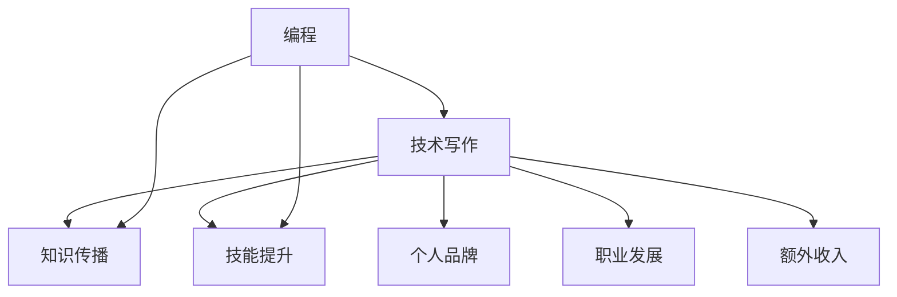

                 

# 技术写作：程序员的副业选择

> 关键词：技术写作、程序员、副业、个人品牌、内容创作

> 摘要：本文将探讨技术写作作为程序员副业的选择。我们将分析技术写作的价值、如何开始技术写作、技术写作的技巧以及如何通过技术写作提升个人品牌和职业发展。

## 1. 背景介绍

在当今数字化时代，技术写作变得越来越重要。随着互联网和社交媒体的普及，程序员们不仅需要具备编程技能，还需要具备良好的沟通和表达能力。技术写作可以帮助程序员传播他们的知识和经验，促进技术交流，同时也能为自己创造额外的收入和职业机会。

程序员们通常具有较高的技术背景，这使得他们在技术写作领域具备独特优势。然而，许多人可能对技术写作缺乏信心，不知道如何开始，或者不知道如何将自己的技术知识转化为有价值的文章。本文将为您解答这些问题，帮助您找到技术写作的起点，并探索技术写作作为副业的选择。

## 2. 核心概念与联系

### 技术写作的定义

技术写作是指以技术为主题，通过文字、图表等方式，对某一领域的技术知识进行阐述、分析和交流。技术写作的目标是让读者能够更好地理解技术概念、原理和操作方法。

### 技术写作的类型

技术写作可以分为以下几种类型：

- **技术文档**：对软件、硬件、系统等进行详细描述，以帮助用户了解和操作。
- **技术博客**：分享技术心得、学习笔记、项目经验等，以促进技术交流和合作。
- **技术论文**：对某一技术领域进行深入研究，提出新的观点、方法和解决方案。
- **技术书籍**：对某一技术主题进行全面、系统的阐述，适合初学者和专业人士。

### 技术写作的价值

技术写作对程序员具有以下价值：

- **传播知识**：将个人的技术知识分享给他人，促进技术传播和交流。
- **提升技能**：通过撰写技术文章，巩固自己的技术知识，提高写作和表达能力。
- **个人品牌**：建立个人技术品牌，提高在业界的知名度和影响力。
- **职业发展**：通过技术写作，获得更多的职业机会，如技术顾问、培训师、讲师等。
- **额外收入**：通过技术写作，如撰写技术博客、出版技术书籍等，获得额外的收入。

### 技术写作与编程的联系

技术写作和编程之间存在紧密的联系。编程是技术写作的基础，而技术写作则是编程经验的升华。通过技术写作，程序员可以将自己的编程经验、技巧和心得分享给他人，同时也能够更好地理解技术本质和实际应用。



## 3. 核心算法原理 & 具体操作步骤

### 核心算法原理

技术写作的核心算法可以概括为以下几个步骤：

1. **选题与定位**：选择一个合适的技术主题，明确文章的目标读者和写作风格。
2. **内容策划**：梳理文章结构，制定大纲，确保文章逻辑清晰、内容完整。
3. **资料收集**：查找相关资料，确保文章内容的准确性和权威性。
4. **撰写与修改**：根据大纲撰写文章，反复修改，提高文章的质量。
5. **发布与推广**：将文章发布到合适的平台，进行推广，吸引读者关注。

### 具体操作步骤

1. **选题与定位**：

   - **关注热点**：关注技术领域的热点话题，选择具有时效性和影响力的主题。
   - **兴趣驱动**：选择自己感兴趣的技术主题，确保写作过程中的热情和动力。
   - **目标读者**：明确文章的目标读者，如初学者、专业人士、企业用户等，以便制定合适的写作风格。

2. **内容策划**：

   - **制定大纲**：根据选题，梳理文章结构，制定大纲，确保文章逻辑清晰、内容完整。
   - **明确结构**：将文章分为引言、正文、结论等部分，确保文章结构的完整性。
   - **段落划分**：将正文分为多个段落，每个段落讲述一个独立的内容点，方便读者阅读和理解。

3. **资料收集**：

   - **查找资料**：通过搜索引擎、技术社区、专业网站等途径，查找与主题相关的资料。
   - **筛选资料**：对收集到的资料进行筛选，确保资料的准确性和权威性。
   - **引用规范**：在文章中正确引用相关资料，确保文章的可信度和完整性。

4. **撰写与修改**：

   - **撰写初稿**：根据大纲和收集到的资料，撰写文章初稿。
   - **反复修改**：对初稿进行反复修改，提高文章的质量。
   - **检查语法**：检查文章的语法、拼写和标点符号，确保文章的规范性。
   - **征求反馈**：向同事、朋友或专业人士征求反馈，进一步完善文章。

5. **发布与推广**：

   - **选择平台**：选择合适的平台发布文章，如技术博客、社交媒体等。
   - **撰写摘要**：为文章撰写一个有吸引力的摘要，吸引读者点击阅读。
   - **推广宣传**：通过社交媒体、邮件列表等方式，向目标读者推广文章。

## 4. 数学模型和公式 & 详细讲解 & 举例说明

### 数学模型

在技术写作中，有时需要用到一些数学模型和公式来描述技术概念和原理。以下是一个简单的数学模型，用于描述线性回归模型：

$$
y = ax + b
$$

其中，$y$ 表示因变量，$x$ 表示自变量，$a$ 表示斜率，$b$ 表示截距。

### 详细讲解

线性回归模型是一种常见的统计模型，用于分析自变量和因变量之间的线性关系。通过线性回归模型，我们可以预测因变量 $y$ 的取值。

- **斜率 $a$**：表示自变量 $x$ 对因变量 $y$ 的影响程度。斜率越大，表示自变量对因变量的影响越大。
- **截距 $b$**：表示当自变量 $x$ 为 0 时，因变量 $y$ 的取值。

### 举例说明

假设我们有一组数据，表示某产品的销量与广告费用之间的关系。通过线性回归模型，我们可以预测不同广告费用下的销量。

- **自变量 $x$**：广告费用（单位：万元）
- **因变量 $y$**：销量（单位：件）

$$
\begin{array}{|c|c|}
\hline
x & y \\
\hline
10 & 50 \\
20 & 100 \\
30 & 150 \\
40 & 200 \\
\hline
\end{array}
$$

通过计算，我们得到线性回归模型：

$$
y = 5x + 20
$$

当广告费用为 30 万元时，我们可以预测销量为：

$$
y = 5 \times 30 + 20 = 170
$$

## 5. 项目实战：代码实际案例和详细解释说明

### 5.1 开发环境搭建

在本项目实战中，我们将使用 Python 作为编程语言，结合 Markdown 文档来撰写技术文章。以下是一个简单的开发环境搭建步骤：

1. **安装 Python**：在官网 [Python.org](https://www.python.org/) 下载并安装 Python。
2. **安装 Markdown 编辑器**：选择一款 Markdown 编辑器，如 Typora 或 Visual Studio Code。
3. **安装相关库**：在 Python 环境中安装必要的库，如 `markdown2`、`requests` 等。

### 5.2 源代码详细实现和代码解读

以下是一个简单的 Python 脚本，用于生成 Markdown 文档：

```python
import markdown2
import requests

def generate_markdown(title, content):
    """生成 Markdown 文档

    Args:
        title (str): 文档标题
        content (str): 文档内容

    Returns:
        str: 生成的 Markdown 文档
    """
    md = markdown2.markdown(content)
    return f"## {title}\n{md}"

def fetch_weather(city):
    """获取指定城市的天气信息

    Args:
        city (str): 城市名称

    Returns:
        str: 天气信息
    """
    url = f"http://api.openweathermap.org/data/2.5/weather?q={city}&appid=YOUR_API_KEY"
    response = requests.get(url)
    data = response.json()
    weather = data['weather'][0]['description']
    return f"当前 {city} 的天气：{weather}"

if __name__ == "__main__":
    title = "今日天气"
    content = fetch_weather("北京")
    print(generate_markdown(title, content))
```

### 5.3 代码解读与分析

- **生成 Markdown 文档**：`generate_markdown` 函数用于生成 Markdown 文档。它接受两个参数：`title`（文档标题）和 `content`（文档内容）。函数返回一个字符串，表示生成的 Markdown 文档。

- **获取天气信息**：`fetch_weather` 函数用于获取指定城市的天气信息。它接受一个参数：`city`（城市名称）。函数使用 `requests` 库向天气 API 发送 HTTP GET 请求，获取天气数据。然后，从响应数据中提取天气描述，并返回一个字符串，表示当前城市的天气信息。

- **主函数**：`if __name__ == "__main__":` 语句是 Python 的一个特殊语法，用于判断当前脚本是否被直接运行。如果直接运行脚本，则执行以下代码：

  - 定义文档标题 `title` 和获取天气信息 `content`。
  - 调用 `generate_markdown` 函数，生成 Markdown 文档，并打印输出。

## 6. 实际应用场景

技术写作在程序员的生活中有着广泛的应用场景。以下是一些实际应用场景：

- **技术博客**：程序员可以通过技术博客记录自己的学习过程、项目经验和技术心得，与他人分享，提高自己的影响力。
- **技术文档**：在团队项目中，程序员可以编写技术文档，帮助团队成员了解项目背景、技术架构和操作流程。
- **技术书籍**：有经验的程序员可以撰写技术书籍，将多年的实践经验分享给读者，成为行业专家。
- **技术演讲**：程序员可以参加技术会议、研讨会等，通过演讲分享自己的技术和见解，提升个人品牌。
- **开源项目**：程序员可以通过开源项目，将自己的技术贡献给社区，提高自己的技术水平和知名度。

## 7. 工具和资源推荐

### 7.1 学习资源推荐

- **书籍**：《代码大全》、《设计模式：可复用面向对象软件的基础》、《算法导论》等。
- **论文**：通过学术搜索引擎（如 Google Scholar）查找相关论文。
- **博客**：关注知名技术博客，如阮一峰的网络日志、阿里的技术博客等。
- **网站**：访问技术社区和论坛，如 Stack Overflow、GitHub 等。

### 7.2 开发工具框架推荐

- **Markdown 编辑器**：Typora、Visual Studio Code、Sublime Text 等。
- **代码编辑器**：Visual Studio、Eclipse、IntelliJ IDEA 等。
- **版本控制工具**：Git、SVN 等。
- **API 接口**：OpenWeatherMap、GitHub API 等。

### 7.3 相关论文著作推荐

- **论文**：《大规模在线学习中的深度神经网络》、《强化学习：原理与算法》、《区块链技术：从数字货币到智能合约》等。
- **著作**：《Python 编程：从入门到实践》、《深度学习：动手学习入门》、《人工智能：一种现代的方法》等。

## 8. 总结：未来发展趋势与挑战

随着互联网和技术的快速发展，技术写作在未来将继续发挥重要作用。以下是一些未来发展趋势和挑战：

- **内容多样化**：技术写作将不仅限于技术文档、博客和书籍，还将涵盖视频、音频等多种形式。
- **AI 技术的融入**：AI 技术将逐渐应用于技术写作，如自动生成文档、优化内容结构等。
- **版权保护**：技术写作的版权保护将变得更加重要，需要建立完善的版权保护机制。
- **职业化发展**：技术写作将成为一种职业，程序员可以通过技术写作获得更多的职业机会和收入。

然而，技术写作也面临着一些挑战，如：

- **内容质量**：在信息爆炸的时代，如何保证技术写作的质量，避免低质量内容的泛滥。
- **技术更新**：技术领域更新迅速，如何紧跟技术发展，持续提供有价值的内容。
- **个人品牌**：如何建立和维护个人品牌，提高在业界的知名度和影响力。

## 9. 附录：常见问题与解答

### 9.1 技术写作的价值有哪些？

技术写作的价值包括传播知识、提升技能、建立个人品牌、职业发展和额外收入等。

### 9.2 如何开始技术写作？

可以从以下几个方面开始：

- **确定主题**：选择自己感兴趣或熟悉的技术主题。
- **学习写作技巧**：阅读相关书籍、博客，学习写作技巧。
- **撰写初稿**：根据大纲，撰写文章初稿。
- **反复修改**：对初稿进行反复修改，提高文章质量。

### 9.3 如何推广技术写作？

可以通过以下途径推广技术写作：

- **技术博客**：在知名技术博客平台发布文章。
- **社交媒体**：在微博、微信公众号等平台分享文章。
- **技术社区**：在技术社区和论坛发帖、回帖。
- **邮件列表**：建立邮件列表，向订阅者发送文章。

## 10. 扩展阅读 & 参考资料

- **书籍**：《技术写作：从零开始构建个人品牌》、《Markdown 入门与实践》、《Python 编程：从入门到实践》等。
- **博客**：阮一峰的网络日志、AlloyTeam、技术之路等。
- **网站**：Stack Overflow、GitHub、知乎等。
- **论文**：通过学术搜索引擎查找相关论文。

### 作者

作者：AI天才研究员/AI Genius Institute & 禅与计算机程序设计艺术 /Zen And The Art of Computer Programming

