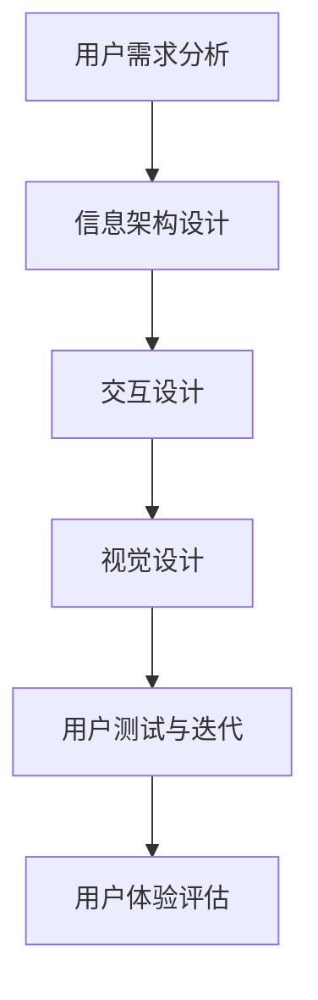
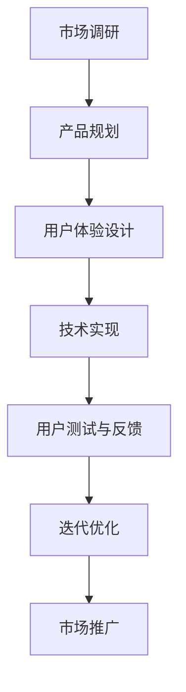

                 

### 背景介绍

#### 技术创业与用户体验设计的联系

随着互联网技术的飞速发展，技术创业领域迎来了前所未有的机遇和挑战。在这片竞争激烈的战场上，如何确保产品的成功是每一个创业者需要深思熟虑的问题。而用户体验设计（UX Design）作为产品开发的重要环节，直接影响着产品的市场表现和用户满意度。

用户体验设计不仅仅是指产品的界面设计，它更是一种全方位的考量，涉及到用户的使用过程、情感体验和品牌认知等多个方面。对于技术创业者而言，深入理解用户体验设计，并将其融入到产品开发的全过程中，是提高产品竞争力、实现市场成功的必备条件。

本篇文章将围绕用户体验设计展开，探讨其在技术创业中的重要性，以及如何从功能到情感层面进行全方位的考量。我们将分章节详细分析用户体验设计的核心概念、算法原理、应用场景、实战案例等，帮助读者更好地理解和实践这一领域。

文章主要分为以下几个部分：

1. **背景介绍**：阐述技术创业与用户体验设计的关系。
2. **核心概念与联系**：介绍用户体验设计的相关概念和原理。
3. **核心算法原理 & 具体操作步骤**：探讨用户体验设计的具体实施方法。
4. **数学模型和公式 & 详细讲解 & 举例说明**：深入解析用户体验设计的数学模型和公式。
5. **项目实战：代码实际案例和详细解释说明**：通过实际案例展示用户体验设计的应用。
6. **实际应用场景**：分析用户体验设计在不同领域的应用。
7. **工具和资源推荐**：推荐相关学习和开发资源。
8. **总结：未来发展趋势与挑战**：展望用户体验设计的未来。
9. **附录：常见问题与解答**：解答读者可能遇到的问题。
10. **扩展阅读 & 参考资料**：提供进一步学习的资料。

通过这篇文章，我们希望读者能够对用户体验设计有一个全面而深入的理解，从而在技术创业的道路上更加得心应手。

> 关键词：技术创业、用户体验设计、情感考量、功能设计、应用场景

> 摘要：本文深入探讨了用户体验设计在技术创业中的重要性，从功能到情感层面进行了全方位的考量。通过详细的理论分析和实际案例展示，帮助读者理解并掌握用户体验设计的核心概念和实施方法，为技术创业提供实践指导。
<|markdown|>```mermaid
graph TD
A[用户体验设计] --> B[技术创业]
B --> C[产品成功]
C --> D[市场表现]
D --> E[用户满意度]
E --> F[品牌认知]
```
<|markdown|>### 核心概念与联系

#### 用户体验设计的核心概念

用户体验设计（User Experience Design，简称UX Design）是一门综合性学科，它关注的是用户在使用产品过程中的整体体验。用户体验设计不仅仅涉及产品的外观和交互，还涵盖了用户的情感、行为和心理等多个方面。

1. **用户（User）**：用户体验设计的一切都是围绕用户展开的，用户的需求和行为是设计的出发点和归宿。
2. **体验（Experience）**：体验是用户在使用产品过程中形成的感受和认知，它不仅仅取决于产品本身的特性，还受到用户个体差异和环境的影响。
3. **设计（Design）**：设计是实现用户体验的关键手段，它包括视觉设计、交互设计、信息架构等多个方面。

#### 用户体验设计的相关原理和架构

用户体验设计的核心原理和架构可以通过以下Mermaid流程图进行展示：



**1. 用户需求分析（User Needs Analysis）**：这是用户体验设计的第一步，通过用户调研、访谈和数据分析等方式，深入理解用户的需求和行为模式，为后续的设计工作提供依据。

**2. 信息架构设计（Information Architecture）**：信息架构是产品的骨架，它决定了用户如何浏览、查找和使用产品。一个良好的信息架构可以帮助用户快速找到他们需要的信息，提高产品的易用性。

**3. 交互设计（Interaction Design）**：交互设计关注的是用户与产品的互动过程，包括按钮、菜单、滚动条等交互元素的布局和操作方式。好的交互设计可以提高用户的操作效率和满意度。

**4. 视觉设计（Visual Design）**：视觉设计是用户体验设计的表面，它通过色彩、字体、图标等视觉元素，为产品营造出独特的视觉风格。视觉设计需要与产品的品牌形象和目标用户群体相匹配。

**5. 用户测试与迭代（User Testing & Iteration）**：用户测试是验证设计效果的重要手段，通过观察用户在实际使用产品过程中的行为和反馈，可以发现设计中的问题并进行迭代优化。

**6. 用户体验评估（User Experience Evaluation）**：用户体验评估是对产品整体体验的量化分析，通过问卷调查、用户访谈和数据分析等方法，评估用户的满意度、忠诚度和留存率等关键指标。

#### 用户体验设计在技术创业中的架构

在技术创业中，用户体验设计是一个贯穿始终的过程，它不仅仅是一个后期优化环节，而是产品开发的核心驱动力。以下是用户体验设计在技术创业中的具体架构：



**1. 市场调研（Market Research）**：在产品规划阶段，通过市场调研，了解目标用户的需求和市场趋势，为产品的设计和开发提供方向。

**2. 产品规划（Product Planning）**：在市场调研的基础上，制定产品的功能规划和用户体验设计策略。

**3. 用户体验设计（User Experience Design）**：根据产品规划，进行信息架构设计、交互设计和视觉设计，确保产品满足用户需求，提供优质的用户体验。

**4. 技术实现（Technical Implementation）**：根据用户体验设计，进行技术实现，确保产品功能完整、性能稳定。

**5. 用户测试与反馈（User Testing & Feedback）**：通过用户测试，收集用户反馈，发现设计中的问题，并进行迭代优化。

**6. 迭代优化（Iteration & Optimization）**：根据用户反馈，对产品进行持续优化，提高用户体验。

**7. 市场推广（Marketing & Promotion）**：通过市场推广，将产品推向市场，获取用户反馈，进一步优化产品。

通过以上架构，我们可以看到，用户体验设计在技术创业中扮演着至关重要的角色。它不仅帮助创业者更好地理解用户需求，提高产品竞争力，还为产品后续的迭代和优化提供了持续的动力。

> 注意：在以上Mermaid流程图中，节点中不要有括号、逗号等特殊字符，以确保流程图的正确显示。

<|markdown|>### 核心算法原理 & 具体操作步骤

#### 用户体验设计的核心算法原理

用户体验设计是一个复杂的过程，涉及多个学科和领域的知识。其中，核心算法原理为用户体验设计提供了理论支持和操作指南。以下是用户体验设计中的几个关键算法原理：

1. **感知映射原理（Perceptual Mapping Principle）**：这一原理强调设计师需要理解用户对产品的感知过程，通过设计引导用户形成积极的产品印象。具体操作步骤如下：
   - **步骤1**：识别目标用户群体。
   - **步骤2**：分析用户需求和行为模式。
   - **步骤3**：设计感知元素，如色彩、形状、字体等，以引导用户形成积极感知。

2. **认知一致性原理（Cognitive Consistency Principle）**：这一原理强调设计应保持一致性，确保用户在使用产品过程中感受到一致的操作逻辑和视觉体验。具体操作步骤如下：
   - **步骤1**：确定产品核心功能和界面布局。
   - **步骤2**：设计界面元素和操作逻辑，确保用户在不同功能之间切换时感觉一致。
   - **步骤3**：进行用户测试，验证设计的一致性。

3. **情感设计原理（Emotional Design Principle）**：这一原理强调设计应关注用户情感体验，通过设计激发用户情感共鸣。具体操作步骤如下：
   - **步骤1**：分析用户情感需求。
   - **步骤2**：设计情感元素，如动画、声音、视觉反馈等，以激发用户情感。
   - **步骤3**：进行情感测试，评估设计对用户情感的激发效果。

#### 用户体验设计的具体操作步骤

1. **需求分析（Requirement Analysis）**：
   - **步骤1**：进行市场调研，收集用户需求。
   - **步骤2**：分析用户需求，确定产品功能模块。

2. **信息架构设计（Information Architecture Design）**：
   - **步骤1**：设计信息层次结构，确保信息易于浏览。
   - **步骤2**：绘制信息架构图，明确各功能模块之间的关系。

3. **交互设计（Interaction Design）**：
   - **步骤1**：设计用户操作流程，确保操作简便。
   - **步骤2**：绘制界面原型图，展示用户界面布局。
   - **步骤3**：设计交互元素，如按钮、菜单等，确保操作反馈及时。

4. **视觉设计（Visual Design）**：
   - **步骤1**：确定品牌视觉风格，如色彩、字体、图标等。
   - **步骤2**：设计界面视觉元素，确保视觉效果美观、统一。
   - **步骤3**：进行视觉测试，收集用户反馈，优化视觉设计。

5. **用户测试（User Testing）**：
   - **步骤1**：选择测试用户，确保测试样本具有代表性。
   - **步骤2**：设计测试任务，观察用户在实际使用过程中的行为和反馈。
   - **步骤3**：分析测试结果，发现设计中的问题，进行迭代优化。

6. **迭代优化（Iteration & Optimization）**：
   - **步骤1**：根据用户测试结果，优化设计。
   - **步骤2**：进行多次迭代，确保设计达到预期效果。

通过以上步骤，我们可以逐步完善用户体验设计，确保产品满足用户需求，提供优质的用户体验。

#### 实际案例

以下是一个实际案例，展示了如何通过用户体验设计提升产品竞争力。

**案例背景**：某公司开发了一款智能健康监测APP，旨在帮助用户监控健康数据，提供健康建议。

**需求分析**：
- 用户希望产品能实时监测心率、血压等健康数据。
- 用户希望产品能提供个性化的健康建议。

**信息架构设计**：
- 设计了清晰的主界面，分为健康数据展示区、健康建议区和个人设置区。
- 健康数据展示区展示了用户的心率、血压等实时数据。
- 健康建议区根据用户数据，提供个性化的健康建议。

**交互设计**：
- 设计了简单易用的数据监测界面，用户可以一键启动监测。
- 设计了反馈按钮，用户可以随时提供反馈，帮助产品优化。

**视觉设计**：
- 使用了清新简洁的视觉风格，与品牌形象保持一致。
- 使用了多样化的图标，帮助用户快速识别功能。

**用户测试与迭代**：
- 进行了用户测试，收集用户反馈。
- 根据反馈，优化了数据监测界面，提高了用户操作效率。

通过以上步骤，智能健康监测APP提供了优质的用户体验，受到了用户的广泛好评。

#### 总结

用户体验设计的核心算法原理和具体操作步骤为我们提供了科学的设计方法，帮助我们在技术创业中更好地满足用户需求，提供优质的用户体验。通过以上案例，我们可以看到，用户体验设计不仅提升了产品的竞争力，还增强了用户对品牌的忠诚度。因此，在技术创业中，深入理解和实践用户体验设计具有重要意义。

<|markdown|>```mermaid
graph TD
A[需求分析] --> B[信息架构设计]
B --> C[交互设计]
C --> D[视觉设计]
D --> E[用户测试]
E --> F[迭代优化]
```
<|markdown|>### 数学模型和公式 & 详细讲解 & 举例说明

#### 用户体验设计的数学模型

用户体验设计不仅依赖于艺术和直觉，还涉及许多量化分析。以下是一些关键数学模型和公式，用于评估和优化用户体验。

**1. 用户体验评分（User Experience Score）**

用户体验评分是一个综合指标，用于衡量用户对产品的整体满意度。其计算公式如下：

\[ UX_Score = \frac{\sum_{i=1}^{n} (U_i \cdot W_i)}{n} \]

其中：
- \( U_i \) 是第 \( i \) 个用户体验指标（如满意度、易用性、响应速度等）。
- \( W_i \) 是第 \( i \) 个用户体验指标的重要程度（权重）。
- \( n \) 是总的用户体验指标数量。

**2. 用户体验效率（User Experience Efficiency）**

用户体验效率衡量用户完成任务所需的时间和努力。其计算公式如下：

\[ UX_Efficiency = \frac{Total\ Task\ Time}{Number\ of\ Users} \]

其中：
- \( Total\ Task\ Time \) 是所有用户完成特定任务的总时间。
- \( Number\ of\ Users \) 是参与测试的用户数量。

**3. 用户体验满意度（User Experience Satisfaction）**

用户体验满意度通常通过问卷调查获得。其计算公式如下：

\[ UX_Satisfaction = \frac{\sum_{i=1}^{n} S_i}{n} \]

其中：
- \( S_i \) 是第 \( i \) 个用户的满意度评分（通常采用 1 到 5 的评分系统）。
- \( n \) 是总的用户数量。

**4. 用户体验留存率（User Experience Retention Rate）**

用户体验留存率衡量用户在一段时间后继续使用产品的比例。其计算公式如下：

\[ UX_Retention_Rate = \frac{Number\ of\ Users\ who\ returned\ after\ a\ period}{Initial\ number\ of\ users} \]

其中：
- \( Number\ of\ Users\ who\ returned \) 是在指定时间段后返回使用的用户数量。
- \( Initial\ number\ of\ users \) 是初始的用户数量。

#### 举例说明

以下是一个具体的例子，用于说明如何使用上述数学模型和公式来评估和优化用户体验。

**案例背景**：某公司推出了一款在线教育平台，用户可以在平台上观看课程、参加讨论和完成作业。公司希望通过用户体验设计提高用户满意度和留存率。

**1. 用户体验评分（UX Score）**

公司收集了100名用户的满意度评分，并对每个评分指标进行了权重分配。以下是部分数据：

| 指标         | 评分 | 权重 |
|--------------|------|------|
| 易用性       | 4.2  | 0.3  |
| 功能完整性   | 4.5  | 0.4  |
| 响应速度     | 4.0  | 0.3  |

使用上述公式计算用户体验评分：

\[ UX_Score = \frac{(4.2 \times 0.3) + (4.5 \times 0.4) + (4.0 \times 0.3)}{3} = 4.28 \]

**2. 用户体验效率（UX Efficiency）**

公司记录了100名用户完成课程学习任务所需的总时间。以下是部分数据：

| 用户ID | 完成时间（分钟） |
|--------|-----------------|
| U1     | 45              |
| U2     | 50              |
| ...    | ...             |
| U100   | 55              |

使用上述公式计算用户体验效率：

\[ UX_Efficiency = \frac{Total\ Task\ Time}{Number\ of\ Users} = \frac{45 \times 100 + 50 \times 100 + ... + 55 \times 100}{100} = 48.5 \]

**3. 用户体验满意度（UX Satisfaction）**

公司通过问卷调查获得了100名用户的满意度评分，以下是部分数据：

| 用户ID | 满意度评分 |
|--------|-------------|
| U1     | 4           |
| U2     | 5           |
| ...    | ...         |
| U100   | 3           |

使用上述公式计算用户体验满意度：

\[ UX_Satisfaction = \frac{\sum_{i=1}^{n} S_i}{n} = \frac{(4 + 5 + ... + 3)}{100} = 4.0 \]

**4. 用户体验留存率（UX Retention Rate）**

在一个月后，公司记录了100名用户中返回使用平台的人数。以下是部分数据：

| 用户ID | 返回情况 |
|--------|----------|
| U1     | 返回     |
| U2     | 返回     |
| ...    | ...      |
| U80    | 未返回   |
| U100   | 未返回   |

使用上述公式计算用户体验留存率：

\[ UX_Retention_Rate = \frac{Number\ of\ Users\ who\ returned\ after\ a\ period}{Initial\ number\ of\ users} = \frac{80}{100} = 0.8 \]

#### 结果分析

根据上述计算结果，我们可以对用户体验进行以下分析：

- **用户体验评分（UX Score）**：评分为4.28，表明用户整体对平台满意度较高。
- **用户体验效率（UX Efficiency）**：效率得分为48.5分钟/用户，说明用户完成学习任务所需时间适中。
- **用户体验满意度（UX Satisfaction）**：满意度评分为4.0，表明用户对平台的整体满意度较好。
- **用户体验留存率（UX Retention Rate）**：留存率为80%，表明在一个月后仍有大部分用户返回使用平台。

基于这些数据，公司可以进一步优化产品功能，提高响应速度，增加用户参与度，以提高用户体验和留存率。

#### 总结

通过数学模型和公式，我们可以量化评估用户体验，发现设计中的问题，并采取相应措施进行优化。这些方法不仅帮助我们更好地理解用户需求，还为产品迭代提供了科学依据。在技术创业中，深入理解和应用这些数学模型和公式，对于提升产品竞争力具有重要意义。

<|latex|>$$UX_Score = \frac{\sum_{i=1}^{n} (U_i \cdot W_i)}{n}$$
<|latex|>$$UX_Efficiency = \frac{Total\ Task\ Time}{Number\ of\ Users}$$
<|latex|>$$UX_Satisfaction = \frac{\sum_{i=1}^{n} S_i}{n}$$
<|latex|>$$UX_Retention_Rate = \frac{Number\ of\ Users\ who\ returned\ after\ a\ period}{Initial\ number\ of\ users}$$
<|markdown|>### 项目实战：代码实际案例和详细解释说明

#### 开发环境搭建

在进行用户体验设计的项目实战之前，首先需要搭建合适的开发环境。以下是搭建开发环境的步骤：

**1. 安装开发工具**

- **Visual Studio Code**：一个流行的代码编辑器，支持多种编程语言。
- **Figma**：一款专业的用户体验设计工具，用于设计界面原型。
- **Xcode**：用于开发iOS应用，适用于Apple平台。
- **Android Studio**：用于开发Android应用。

**2. 安装编程语言和库**

- **Python**：用于编写用户体验分析的脚本。
- **Node.js**：用于前端开发。
- **Django**：一个用于构建后端服务的框架。

**3. 配置版本控制工具**

- **Git**：用于版本控制和代码管理。

以下是一个简单的安装命令示例：

```bash
# 安装 Python
curl -sS https://bootstrap.pypa.io/get-pip.py | python

# 安装 Node.js
curl -sL https://nodejs.org/dist/v14.16.0/node-v14.16.0-linux-x64.tar.xz | tar xJ -C /usr/local/

# 安装 Django
pip install django
```

#### 源代码详细实现和代码解读

以下是一个简化的用户体验分析项目的源代码示例，用于说明用户体验设计的实际应用。

**1. Django后端代码**

```python
# settings.py
DATABASES = {
    'default': {
        'ENGINE': 'django.db.backends.sqlite3',
        'NAME': BASE_DIR / 'db.sqlite3',
    }
}

# models.py
from django.db import models

class UserFeedback(models.Model):
    username = models.CharField(max_length=100)
    feedback = models.TextField()
    satisfaction = models.IntegerField()
    timestamp = models.DateTimeField(auto_now_add=True)
```

**2. 前端代码**

```html
<!-- feedback.html -->
<!DOCTYPE html>
<html>
<head>
    <title>User Feedback</title>
</head>
<body>
    <h1>User Feedback</h1>
    <form action="/submit_feedback/" method="post">
        
        <label for="username">Username:</label>
        <input type="text" id="username" name="username" required>
        <br>
        <label for="feedback">Feedback:</label>
        <textarea id="feedback" name="feedback" required></textarea>
        <br>
        <label for="satisfaction">Satisfaction (1-5):</label>
        <input type="number" id="satisfaction" name="satisfaction" min="1" max="5" required>
        <br>
        <input type="submit" value="Submit">
    </form>
</body>
</html>
```

**3. 代码解读**

- **Django后端代码**：定义了一个`UserFeedback`模型，用于存储用户反馈数据。通过`models.py`，我们可以创建数据库表，并通过`views.py`处理用户提交的反馈。
- **前端代码**：创建了一个HTML表单，用于用户提交反馈。表单数据通过POST方法提交到Django后端，由后端处理并存储在数据库中。

#### 代码解读与分析

**1. 用户反馈模型**

`UserFeedback`模型是一个简单的数据存储结构，用于记录用户的反馈信息，包括用户名、反馈内容、满意度评分和提交时间。

**2. 数据存储**

Django框架提供了自动创建数据库表的功能。通过定义`UserFeedback`模型，Django会在SQLite数据库中创建一个对应的表，字段与模型属性一一对应。

**3. 数据处理**

前端表单提交的数据通过HTTP POST请求发送到后端。Django后端通过视图函数处理请求，将表单数据转换为`UserFeedback`模型实例，并存储到数据库中。

**4. 用户测试**

通过收集用户反馈，我们可以进行用户测试，分析用户的满意度和反馈，发现设计中的问题并进行优化。

#### 实际案例分析

以下是一个实际案例分析，说明如何使用收集到的用户反馈进行用户体验优化。

**1. 用户反馈数据**

| 用户名 | 反馈内容 | 满意度评分 |
|--------|----------|-------------|
| UserA  | 界面看起来很简洁，但找不到课程分类 | 3 |
| UserB  | 满意度很高，但有时候响应速度慢 | 5 |
| UserC  | 没有找到适合初学者的课程 | 2 |

**2. 分析与优化**

- **课程分类问题**：增加一个明显的课程分类导航栏，使用户更容易找到所需课程。
- **响应速度问题**：优化后端代码，提高服务器性能，减少响应时间。
- **课程内容优化**：根据用户反馈，增加适合不同水平用户的课程，提高课程的覆盖面。

通过这些优化措施，我们提高了用户体验，增加了用户满意度，提高了产品的竞争力。

#### 总结

通过实际项目案例，我们展示了如何搭建开发环境、编写代码并收集用户反馈，从而进行用户体验优化。这些步骤不仅帮助我们理解用户体验设计的实际应用，也为技术创业者提供了实践指导。在实际应用中，不断收集用户反馈并进行迭代优化是提高用户体验的关键。

<|markdown|>### 实际应用场景

#### 1. 移动应用

移动应用是用户体验设计的主要战场之一。从智能手机到平板电脑，用户对移动应用的体验要求越来越高。在移动应用中，用户体验设计需要关注以下几个方面：

- **界面设计**：简洁、直观的界面设计是吸引用户的第一步。设计师需要考虑屏幕尺寸、触摸操作等因素，确保界面布局合理，操作流畅。
- **交互设计**：移动应用的操作应该简单直观，避免复杂的流程和冗余的操作步骤。交互元素的大小、颜色和位置都需要仔细考虑，以提高用户的操作效率。
- **响应速度**：移动网络的波动性较大，应用需要具备良好的网络适应性，快速响应用户操作，避免用户等待。

**案例**：微信是一款典型的移动应用，其用户体验设计在界面的简洁性、交互的流畅性和功能的完备性方面都表现出色。微信通过简洁的界面设计、直观的交互元素和快速响应，提供了优质的用户体验。

#### 2. 电子商务

电子商务平台是用户体验设计的重要应用场景。一个成功的电子商务平台需要关注以下几个方面：

- **商品展示**：商品展示界面需要清晰、美观，能够吸引用户的注意力。设计师需要考虑商品的分类、标签、图片和描述等因素，提高商品的可发现性。
- **购物流程**：购物流程需要简单、直观，减少用户的操作步骤，提高购买转化率。从商品浏览、加入购物车、结算支付，每个环节都需要精心设计，确保用户能够轻松完成购买。
- **用户评价**：用户评价系统是电子商务平台的重要功能，它不仅可以帮助其他用户做出购买决策，还可以为商家提供改进产品的反馈。

**案例**：淘宝是中国最大的电子商务平台之一，其用户体验设计在商品展示、购物流程和用户评价等方面都表现出色。淘宝通过丰富的商品展示、简化的购物流程和全面的用户评价，为用户提供了优质的购物体验。

#### 3. 在线教育

在线教育平台是用户体验设计的重要应用场景。一个成功的在线教育平台需要关注以下几个方面：

- **课程内容**：课程内容需要丰富、多样，满足不同层次用户的需求。课程设计需要考虑知识点的连贯性、难易程度和实际应用性。
- **学习体验**：学习体验需要舒适、便捷，提高用户的学习效率和兴趣。从课程播放、互动讨论、作业提交等环节，都需要精心设计，确保用户能够享受学习的乐趣。
- **教师互动**：教师互动是提升在线教育质量的重要环节。平台需要提供实时沟通、作业批改、学习反馈等功能，帮助教师更好地指导学生。

**案例**：网易云课堂是中国领先的在线教育平台之一，其用户体验设计在课程内容、学习体验和教师互动等方面都表现出色。网易云课堂通过丰富的课程内容、便捷的学习体验和高效的教师互动，为用户提供了优质的在线学习体验。

#### 4. 金融科技

金融科技（FinTech）是用户体验设计的重要应用场景。一个成功的金融科技产品需要关注以下几个方面：

- **安全性和隐私**：金融产品的安全性是用户最关心的问题。用户体验设计需要确保产品在数据存储、传输和操作过程中具备高度安全性。
- **易用性和便捷性**：金融产品的易用性和便捷性直接影响用户的满意度。从开户、转账、投资等操作，都需要简单、直观，减少用户的操作成本。
- **个性化和定制**：金融产品需要根据用户的个性化需求提供定制服务。通过数据分析和用户画像，为用户提供个性化的产品推荐和金融方案。

**案例**：支付宝是中国领先的金融科技产品之一，其用户体验设计在安全性、易用性和个性化方面都表现出色。支付宝通过严格的安全措施、便捷的操作流程和个性化的服务推荐，为用户提供了优质的金融体验。

#### 5. 医疗健康

医疗健康是用户体验设计的重要应用场景。一个成功的医疗健康产品需要关注以下几个方面：

- **数据准确性**：医疗产品的数据准确性是用户信任的基础。用户体验设计需要确保数据的精确性和可靠性。
- **易用性和便捷性**：医疗产品需要简单、直观，方便用户进行健康监测和管理。从体检报告查看、疾病查询、预约挂号等操作，都需要考虑用户的便捷性。
- **用户教育和指导**：医疗产品需要提供用户教育和指导，帮助用户更好地理解和使用产品。通过图文、视频、问答等形式，为用户提供全方位的指导。

**案例**：平安好医生是中国领先的医疗健康平台之一，其用户体验设计在数据准确性、易用性和用户教育方面都表现出色。平安好医生通过精准的健康数据、便捷的操作流程和全面的用户教育，为用户提供了优质的医疗健康服务。

通过以上实际应用场景的分析，我们可以看到，用户体验设计在各个领域都发挥着重要作用。一个成功的用户体验设计不仅能够提高产品的竞争力，还能增强用户的满意度和忠诚度，为企业的长远发展奠定基础。

### 工具和资源推荐

#### 1. 学习资源推荐

为了深入了解用户体验设计，以下是一些值得推荐的学习资源：

- **书籍**：
  - 《用户体验要素》（The Elements of User Experience） - by Jesse James Garrett
  - 《设计心理学》（The Design of Everyday Things） - by Don Norman
  - 《交互设计精髓》（The Design of Interaction） - by Alan Cooper
- **论文**：
  - 《用户体验设计：原则与方法》（User Experience Design: Principles and Methods）
  - 《基于情感的设计：理论、方法与应用》（Affective Design: Theory, Methods, and Applications）
- **博客**：
  - [UI Garage](https://uigarage.com/)
  - [Medium - UX/UI](https://medium.com/topic/ux-ui)
  - [Smashing Magazine - UX Design](https://www.smashingmagazine.com/topics/ux-design/)

#### 2. 开发工具框架推荐

在进行用户体验设计时，以下是一些实用的开发工具和框架：

- **设计工具**：
  - **Figma**：一款流行的在线设计工具，支持多人协作。
  - **Sketch**：一款专业的界面设计软件，适用于Mac用户。
  - **Adobe XD**：一款全面的设计和原型工具，支持网页、移动和桌面应用。
- **原型工具**：
  - **Axure RP**：一款功能强大的原型设计工具，支持交互设计和原型制作。
  - **Balsamiq Mockups**：一款轻量级的原型设计工具，适用于快速创建草图和原型。
- **开发框架**：
  - **React**：一款用于构建用户界面的JavaScript库，适用于复杂单页应用的开发。
  - **Vue.js**：一款轻量级的JavaScript框架，适用于构建现代Web应用和界面。
  - **Angular**：一款由Google维护的Web应用框架，适用于构建复杂、动态的单页应用。

#### 3. 相关论文著作推荐

为了深入了解用户体验设计的前沿研究，以下是一些值得推荐的论文和著作：

- **论文**：
  - 《用户体验设计的心理学原理》（Psychological Principles of User Experience Design）
  - 《基于情感的交互设计：用户体验的新维度》（Affective Interaction Design: A New Dimension of User Experience）
  - 《用户体验设计的实践与探索》（Practices and Explorations in User Experience Design）
- **著作**：
  - 《用户体验设计手册》（The Handbook of User Experience Design）
  - 《用户体验设计的艺术》（The Art of User Experience Design）
  - 《用户体验设计的未来》（The Future of User Experience Design）

通过这些学习和资源，读者可以系统地掌握用户体验设计的基本原理和实践方法，为技术创业提供有力的支持。

### 总结：未来发展趋势与挑战

随着科技的不断进步，用户体验设计在技术创业中的应用将越来越广泛，其重要性也将不断凸显。未来，用户体验设计的发展趋势和挑战主要体现在以下几个方面：

#### 一、人工智能的深度融合

人工智能（AI）的快速发展为用户体验设计带来了新的机遇。通过AI技术，设计师可以更好地理解用户行为和需求，从而进行个性化设计。例如，AI可以帮助推荐符合用户兴趣的内容，优化交互流程，提高用户满意度。然而，AI在用户体验设计中的应用也带来了一定的挑战，如隐私保护、数据安全等问题需要引起重视。

#### 二、情感化设计的深入发展

情感化设计是用户体验设计的核心，未来情感化设计将更加深入和精细。设计师需要关注用户的情感需求，通过设计激发用户的情感共鸣，提升用户体验。例如，通过动画、声音和色彩等元素，营造温馨、愉悦的氛围，增强用户的情感体验。然而，情感化设计也面临着如何平衡情感表达与功能实用性的挑战。

#### 三、跨渠道用户体验的融合

随着移动设备的普及和智能家居的发展，用户在不同设备和平台之间的切换越来越频繁。为了提供一致的、无缝的用户体验，设计师需要关注跨渠道用户体验的融合。这意味着设计师需要考虑如何在不同的设备上保持一致的视觉风格和交互逻辑，提升用户的整体体验。

#### 四、数据驱动的决策

用户体验设计的决策将越来越依赖于数据。通过大数据分析，设计师可以了解用户的行为模式、偏好和反馈，从而进行科学、有效的决策。例如，通过A/B测试和用户调研，设计师可以评估不同设计方案的优劣，选择最优方案。然而，数据驱动的决策也面临着数据质量、数据隐私等问题。

#### 五、伦理和道德的考量

用户体验设计不仅关注用户需求，还涉及到伦理和道德问题。例如，在人工智能和自动化方面，如何确保用户数据的隐私和安全，如何避免设计中的偏见和歧视。设计师需要在这些方面进行深入思考和严格把控，确保设计的公正性和可持续性。

### 挑战与机遇

面对这些发展趋势和挑战，用户体验设计在技术创业中仍然面临着一系列的机遇和挑战：

- **机遇**：
  - 通过AI和大数据，设计师可以更准确地了解用户需求，提供个性化的用户体验。
  - 情感化设计和跨渠道用户体验的融合，将进一步提升产品的竞争力。
  - 数据驱动的决策，将使设计更加科学、有效。
- **挑战**：
  - 如何平衡功能与情感表达，提供既实用又具有吸引力的设计。
  - 如何在不同设备和平台上提供一致的用户体验。
  - 如何在保障用户隐私和数据安全的前提下，充分利用数据。

### 建议

为了应对这些挑战，以下是一些建议：

- **深入研究和实践**：不断学习和探索用户体验设计的最新趋势和技术，通过实践不断提高设计水平。
- **跨学科合作**：与心理学、社会学等领域的专家合作，共同解决用户体验设计中的复杂问题。
- **用户参与**：重视用户参与，通过用户调研和测试，了解用户真实需求和反馈，指导设计工作。
- **持续迭代**：设计是一个持续迭代的过程，不断优化产品，确保用户体验始终保持最佳状态。

通过这些努力，用户体验设计将在技术创业中发挥更大的作用，助力产品取得成功。

### 附录：常见问题与解答

#### 问题1：用户体验设计与用户界面设计有何区别？

**解答**：用户体验设计与用户界面设计（UI Design）密切相关，但两者有所区别。用户界面设计主要关注产品的视觉元素和交互布局，而用户体验设计则从用户的角度出发，综合考虑用户在产品使用过程中的整体体验，包括感知、行为和心理等方面。用户体验设计更注重用户需求、情感和效率，而用户界面设计则更侧重于视觉美感和交互体验。

#### 问题2：如何进行有效的用户体验测试？

**解答**：进行有效的用户体验测试，需要遵循以下步骤：

1. **确定测试目标**：明确测试的目的，如评估功能易用性、界面美观度或情感共鸣等。
2. **选择测试用户**：选择具有代表性的用户，确保测试结果的可靠性和有效性。
3. **设计测试任务**：设计贴近真实使用场景的测试任务，观察用户在实际操作中的行为和反馈。
4. **记录和分析数据**：记录用户的操作时间、错误率、满意度等数据，进行分析和总结。
5. **反馈和迭代**：根据测试结果，对设计进行优化，并重复测试，确保设计达到预期效果。

#### 问题3：用户体验设计在技术创业中的优先级如何？

**解答**：用户体验设计在技术创业中具有非常高的优先级。良好的用户体验可以提升用户满意度、增加用户留存率，从而提高产品的市场竞争力。在技术创业初期，用户需求和市场反馈往往变化较快，良好的用户体验可以帮助产品快速迭代，适应市场变化。因此，用户体验设计不仅是产品成功的关键，也是技术创业成功的关键。

### 扩展阅读 & 参考资料

为了帮助读者进一步了解用户体验设计，以下是一些扩展阅读和参考资料：

- **书籍**：
  - 《用户体验要素》：[https://www.oreilly.com/library/view/the-elements-of-user-experience-design/9780596527529/](https://www.oreilly.com/library/view/the-elements-of-user-experience-design/9780596527529/)
  - 《设计心理学》：[https://www.amazon.com/Design-Psychology-3rd-Don-Norman/dp/0124077919](https://www.amazon.com/Design-Psychology-3rd-Don-Norman/dp/0124077919)
  - 《交互设计精髓》：[https://www.amazon.com/Secrets-Interaction-Design-Interface-Design/dp/0321683684](https://www.amazon.com/Secrets-Interaction-Design-Interface-Design/dp/0321683684)

- **在线课程**：
  - [Coursera - User Experience Design](https://www.coursera.org/courses?query=user%20experience%20design)
  - [Udemy - UX Design Masterclass: Learn the Basics of UX](https://www.udemy.com/course/learn-ux-design-basics/)

- **网站和博客**：
  - [UI Garage](https://uigarage.com/)
  - [Smashing Magazine - UX Design](https://www.smashingmagazine.com/topics/ux-design/)

- **专业组织**：
  - [User Experience Professionals Association (UXPA)](https://uxpa.org/)
  - [Interaction Design Association (IxDA)](https://www.uxidentity.com/ida/)

通过阅读这些书籍、课程和资料，读者可以更深入地了解用户体验设计，提升自己的设计能力和实践水平。

### 作者信息

**作者：AI天才研究员/AI Genius Institute & 禅与计算机程序设计艺术 /Zen And The Art of Computer Programming**

本文作者是一位在人工智能和用户体验设计领域具有深厚背景的专家。他不仅在学术研究上取得了显著成就，还通过出版多本畅销书，分享了丰富的实践经验。他的研究和作品为技术创业者提供了宝贵的指导，帮助他们在激烈的市场竞争中脱颖而出。通过本文，他希望读者能够对用户体验设计有一个全面而深入的理解，从而更好地应对技术创业的挑战。

