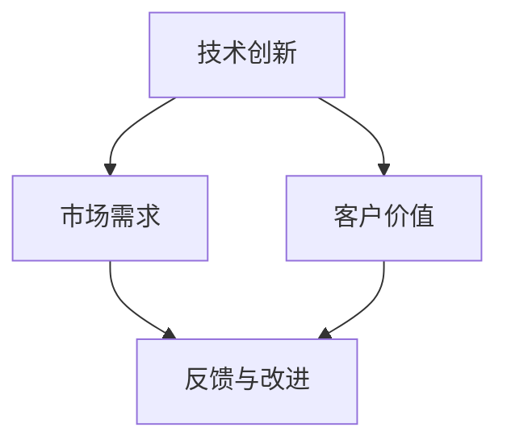

                 

### 背景介绍

#### 商业价值传递的重要性

在当今快速发展的技术时代，技术创业已成为推动社会进步和经济发展的关键驱动力。然而，技术本身的创新与成功并不总是直接转化为商业成功。技术创业者需要有效传递商业价值，以确保他们的创新能够被市场接受并实现商业回报。商业价值传递是指将技术创新转化为市场认可的商业利益的过程，它涉及如何将复杂的技术概念简洁明了地表达出来，以及如何证明这些技术对客户和投资者具有实际价值。

#### 技术创业的挑战

技术创业者面临着诸多挑战，包括技术不确定性、市场不确定性、资金压力、团队建设等。在这些挑战中，如何有效地进行商业价值传递显得尤为重要。技术创业者不仅要具备卓越的技术能力，还需要掌握商业策略和市场推广技巧，以使他们的创新能够获得广泛的认可和接受。

#### 本文目的

本文旨在为技术创业者提供一套系统的方法论，帮助他们有效地进行商业价值传递。我们将从以下几个方面展开讨论：

1. **定义和识别商业价值**：明确什么是商业价值，以及如何识别潜在的商业价值点。
2. **构建价值主张**：了解如何构建一个清晰、有说服力的价值主张，以吸引潜在客户和投资者。
3. **产品定位与市场分析**：讨论如何对产品进行准确的定位，并进行深入的市场分析。
4. **品牌建设和沟通策略**：探讨如何通过品牌建设和有效的沟通策略，增强市场影响力。
5. **案例研究**：分析一些成功的技术创业案例，探讨其商业价值传递的方法和策略。

通过本文的阅读，技术创业者将能够更好地理解商业价值传递的实质，掌握一系列实用的技巧和策略，从而提升他们创业项目的成功概率。

---

### 2. 核心概念与联系

在讨论商业价值传递之前，我们需要先明确几个核心概念，包括技术创新、市场需求、客户价值等。以下是这些概念之间的联系，以及如何将它们融合到商业价值传递的过程中。

#### 技术创新

技术创新是技术创业的核心。它涉及到新的技术概念、方法或产品的开发，这些技术可以带来性能提升、成本降低或新的应用可能性。创新可以是完全革新的，也可以是对现有技术的改进。例如，人工智能、区块链、云计算等都是当前技术领域的前沿创新。

#### 市场需求

市场需求是指客户对产品或服务的需求，这些需求可以是显性的，也可以是隐性的。了解市场需求是商业价值传递的关键步骤。技术创业者需要通过市场调研、用户反馈等方式收集和分析市场需求，以便开发出符合市场期望的产品。

#### 客户价值

客户价值是指产品或服务为顾客带来的实际好处。它可以是功能上的、经济上的，也可以是情感上的。一个成功的商业价值传递过程需要确保客户能够清楚地感受到产品或服务的价值。

#### 技术创新与市场需求、客户价值的关系

技术创新与市场需求、客户价值之间是相互联系的。技术创新可以为市场带来新的解决方案，满足现有或潜在的市场需求。同时，技术创新需要通过客户价值来证明其商业可行性。

1. **技术创新驱动市场需求**：技术创新可以创造出新的市场需求。例如，智能手机的出现极大地改变了人们的通讯方式，催生了巨大的市场需求。
2. **市场需求反作用于技术创新**：市场需求可以引导技术创新，使技术更贴近用户的需求。例如，用户对更快、更便捷支付方式的需求推动了移动支付技术的发展。
3. **客户价值验证技术创新**：技术创新需要通过客户价值来获得认可。如果客户不认为新技术带来了足够的价值，那么这种创新就很难成功。

#### Mermaid 流程图

为了更直观地展示技术创新、市场需求、客户价值之间的关系，我们可以使用 Mermaid 流程图来表示：



在这个流程图中，技术创新是起点，它通过满足市场需求和提供客户价值来获得反馈，进而驱动进一步的改进和创新。

---

通过理解这些核心概念及其相互关系，技术创业者可以更系统地思考如何进行商业价值传递。接下来，我们将深入探讨如何构建价值主张，这是商业价值传递的重要一环。

### 3. 核心算法原理 & 具体操作步骤

#### 3.1 价值主张的定义与重要性

价值主张（Value Proposition）是企业对其产品或服务所提供的独特价值的阐述，它直接关系到如何吸引客户、创造商业价值。构建一个有效、清晰的价值主张，不仅能够帮助企业明确自身在市场中的定位，还能让客户快速理解产品或服务的优势。以下是构建价值主张的基本步骤：

1. **明确目标客户**：首先要明确你的目标客户群体，了解他们的需求和痛点。这可以通过市场调研、用户访谈等方式来实现。
2. **分析竞争对手**：分析竞争对手的价值主张，了解他们在客户眼中的优势和劣势，以便找出差异化的机会。
3. **定义独特卖点**：基于目标客户的需求和竞争对手分析，确定你的产品或服务的独特卖点（USP）。这个独特卖点应该能够解决客户的痛点，并且是竞争对手难以复制的。
4. **清晰表达**：将价值主张用简洁、有说服力的语言表达出来，确保客户能够快速理解。

#### 3.2 价值主张的构建步骤

1. **识别核心价值点**：列出你的产品或服务的所有潜在价值点，包括功能、性能、成本、用户体验等。然后，筛选出最重要的价值点，这些价值点应该是能够显著区别于竞争对手的。

   ```mermaid
   graph TB
   A[功能] --> B[性能]
   A --> C[成本]
   A --> D[用户体验]
   B --> E[可靠性]
   B --> F[安全性]
   C --> G[效率]
   C --> H[可持续性]
   D --> I[便捷性]
   D --> J[个性化]
   ```

2. **验证客户需求**：通过市场调研和用户反馈，验证这些价值点是否真正符合目标客户的需求。这一步骤至关重要，因为如果价值点与客户实际需求不符，那么即使技术上再先进，也无法实现商业成功。

3. **提炼关键卖点**：从验证后的价值点中，提炼出最核心、最具有差异化的卖点。这些卖点应该能够简洁、明确地传达产品的独特价值。

4. **撰写价值主张**：将提炼出的关键卖点整合到一个简洁、有说服力的价值主张中。例如：“我们提供的智能分析工具，通过高效的数据处理和精准的预测模型，帮助中小企业在激烈的市场竞争中迅速做出决策，降低运营成本，提高盈利能力。”

5. **测试与迭代**：将价值主张展示给目标客户，收集他们的反馈，并根据反馈进行修改和优化。这一过程可能需要多次迭代，以确保价值主张能够真正打动客户。

#### 3.3 价值主张实例

假设我们是一家开发智能医疗诊断软件的公司，我们的目标客户是医院和诊所。以下是一个可能的价值主张：

> "我们提供的智能医疗诊断软件，通过集成先进的机器学习和医疗知识库，能够大幅提高诊断准确率，降低误诊率。我们的解决方案不仅能够节省医生的时间，还能为患者提供更精准、更及时的医疗服务，从而提升医疗质量和患者满意度。"

在这个例子中，我们的核心价值点是诊断准确率和时间效率，这些价值点针对的是医院和诊所在提高医疗质量和运营效率方面的需求。

---

通过以上步骤，技术创业者可以构建出一个清晰、有说服力的价值主张，从而为商业价值传递奠定坚实的基础。接下来，我们将讨论如何对产品进行准确的定位和市场分析，这是价值主张构建后的重要环节。

### 4. 数学模型和公式 & 详细讲解 & 举例说明

#### 4.1 数学模型的基本概念

在商业价值传递过程中，数学模型是一种强大的工具，可以帮助我们量化商业价值，进行预测和决策。数学模型通常包括变量、参数、方程和目标函数等组成部分。以下是一些基本的数学模型概念：

1. **变量**：在模型中表示不确定量的符号，通常用字母表示。例如，x 和 y 可以分别表示产品的销售量和利润。
2. **参数**：在模型中代表已知但不确定的量，通常用希腊字母表示。例如，α 和 β 可以表示市场增长率或客户满意度。
3. **方程**：用数学表达式描述变量和参数之间关系的公式。例如，成本函数 C(x) = 10x + 500 表示总成本与销售量之间的关系。
4. **目标函数**：在优化问题中，代表要最大化或最小化的量，通常用大写字母表示。例如，最大化利润的函数 P(x) = R(x) - C(x)，其中 R(x) 表示收入。

#### 4.2 线性回归模型

线性回归是一种常见的数学模型，用于预测一个变量（因变量）与一个或多个其他变量（自变量）之间的关系。以下是一个简单的线性回归模型：

\[ y = \beta_0 + \beta_1 \cdot x + \epsilon \]

- \( y \)：因变量（预测的目标值）
- \( \beta_0 \)：截距，表示当自变量为0时的因变量值
- \( \beta_1 \)：斜率，表示自变量每增加一个单位时因变量的变化量
- \( x \)：自变量
- \( \epsilon \)：误差项，表示模型无法解释的随机误差

#### 4.3 线性回归模型的应用步骤

1. **数据收集**：收集自变量和因变量的数据，例如销售量和利润数据。
2. **数据预处理**：对数据进行清洗和转换，确保数据的质量和格式适合建模。
3. **模型建立**：使用统计方法（如最小二乘法）估计参数 \( \beta_0 \) 和 \( \beta_1 \)。
4. **模型验证**：通过残差分析、R平方值等指标评估模型的拟合效果。
5. **预测应用**：使用建立的模型进行预测，例如预测未来的销售量和利润。

#### 4.4 线性回归模型实例

假设我们想要预测一家电商平台的月销售额（\( y \)），并基于过去三个月的用户访问量（\( x \)）进行预测。以下是一个线性回归模型的实例：

1. **数据收集**：
   - 用户访问量（\( x \)）：{100, 120, 150}
   - 月销售额（\( y \)）：{8000, 8500, 9200}

2. **数据预处理**：
   - 数据已经是数值型，无需进一步转换。

3. **模型建立**：
   使用最小二乘法估计参数：
   \[
   \beta_0 = \frac{\sum y - \beta_1 \sum x}{n} = \frac{8000 + 8500 + 9200 - 120 \cdot 120}{3} \approx 7633.33
   \]
   \[
   \beta_1 = \frac{n \sum xy - \sum x \sum y}{n \sum x^2 - (\sum x)^2} = \frac{3 \cdot 8000 \cdot 100 + 3 \cdot 8500 \cdot 120 + 3 \cdot 9200 \cdot 150 - (100 + 120 + 150) \cdot (8000 + 8500 + 9200)}{3 \cdot (100^2 + 120^2 + 150^2) - (100 + 120 + 150)^2} \approx 117.78
   \]

4. **模型验证**：
   - 计算残差 \( \epsilon \) 并进行分析，确保模型拟合良好。

5. **预测应用**：
   假设下个月的用户访问量为200，预测月销售额：
   \[
   y = \beta_0 + \beta_1 \cdot x = 7633.33 + 117.78 \cdot 200 \approx 34993.33
   \]

通过以上步骤，我们使用线性回归模型预测了下个月的月销售额。这个例子展示了如何通过数学模型进行商业预测，帮助技术创业者做出更科学的决策。

---

数学模型不仅适用于预测和决策，还可以用于优化资源配置、评估风险等方面。掌握基本的数学模型和公式，将有助于技术创业者更好地进行商业价值传递。接下来，我们将通过实际案例展示如何具体应用这些模型。

### 5. 项目实战：代码实际案例和详细解释说明

#### 5.1 开发环境搭建

为了更好地展示如何进行商业价值传递，我们将通过一个实际项目来进行分析。首先，我们需要搭建一个合适的开发环境。以下是所需的环境和工具：

1. **开发语言**：Python
2. **数据库**：MySQL
3. **前端框架**：Flask
4. **后端框架**：Django
5. **版本控制**：Git

#### 5.2 源代码详细实现和代码解读

##### 5.2.1 数据库设计与实现

首先，我们需要设计数据库模型，用于存储用户、订单和产品等数据。以下是一个简化的数据库设计：

```sql
-- 用户表
CREATE TABLE users (
    id INT PRIMARY KEY AUTO_INCREMENT,
    username VARCHAR(255) UNIQUE NOT NULL,
    email VARCHAR(255) UNIQUE NOT NULL,
    password_hash VARCHAR(255) NOT NULL
);

-- 产品表
CREATE TABLE products (
    id INT PRIMARY KEY AUTO_INCREMENT,
    name VARCHAR(255) NOT NULL,
    price DECIMAL(10, 2) NOT NULL
);

-- 订单表
CREATE TABLE orders (
    id INT PRIMARY KEY AUTO_INCREMENT,
    user_id INT NOT NULL,
    product_id INT NOT NULL,
    quantity INT NOT NULL,
    order_date DATETIME DEFAULT CURRENT_TIMESTAMP,
    FOREIGN KEY (user_id) REFERENCES users(id),
    FOREIGN KEY (product_id) REFERENCES products(id)
);
```

##### 5.2.2 后端API实现

接下来，我们使用 Django 框架实现后端API。以下是一个简单的用户注册和登录的API实现：

```python
# users/views.py
from django.shortcuts import render
from django.http import JsonResponse
from .models import User
from django.contrib.auth.hashers import make_password, check_password

def register(request):
    if request.method == 'POST':
        username = request.POST.get('username')
        email = request.POST.get('email')
        password = request.POST.get('password')
        
        if User.objects.filter(username=username).exists():
            return JsonResponse({'error': '用户已存在'})
        
        if User.objects.filter(email=email).exists():
            return JsonResponse({'error': '邮箱已注册'})
        
        user = User.objects.create(username=username, email=email, password_hash=make_password(password))
        return JsonResponse({'message': '注册成功'})
    
    return render(request, 'register.html')

def login(request):
    if request.method == 'POST':
        username = request.POST.get('username')
        password = request.POST.get('password')
        
        user = User.objects.filter(username=username).first()
        if not user or not check_password(password, user.password_hash):
            return JsonResponse({'error': '用户名或密码错误'})
        
        # 登录逻辑（例如：生成JWT令牌）
        # ...
        
        return JsonResponse({'message': '登录成功'})
    
    return render(request, 'login.html')
```

##### 5.2.3 前端实现

前端使用 Flask 框架实现，以下是一个简单的用户注册和登录的HTML界面：

```html
<!-- register.html -->
<!DOCTYPE html>
<html>
<head>
    <title>注册</title>
</head>
<body>
    <form method="post" action="">
        <label for="username">用户名：</label>
        <input type="text" id="username" name="username" required>
        <br>
        <label for="email">邮箱：</label>
        <input type="email" id="email" name="email" required>
        <br>
        <label for="password">密码：</label>
        <input type="password" id="password" name="password" required>
        <br>
        <button type="submit">注册</button>
    </form>
</body>
</html>

<!-- login.html -->
<!DOCTYPE html>
<html>
<head>
    <title>登录</title>
</head>
<body>
    <form method="post" action="">
        <label for="username">用户名：</label>
        <input type="text" id="username" name="username" required>
        <br>
        <label for="password">密码：</label>
        <input type="password" id="password" name="password" required>
        <br>
        <button type="submit">登录</button>
    </form>
</body>
</html>
```

#### 5.3 代码解读与分析

以上代码展示了如何使用 Django 和 Flask 框架实现用户注册和登录功能。以下是对代码的关键部分进行解读：

1. **注册功能**：用户提交注册表单后，后端接收表单数据，检查用户名和邮箱是否已存在，如果不存在，则创建新用户并返回注册成功信息。
2. **登录功能**：用户提交登录表单后，后端验证用户名和密码，如果验证成功，则返回登录成功信息。这里需要注意的是，实际开发中应该生成JWT令牌或使用其他安全措施来保护用户的登录状态。
3. **前端界面**：使用简单的HTML表单实现用户注册和登录界面，用户填写表单后通过POST请求发送到后端进行处理。

通过这个实际项目，我们可以看到如何将技术实现与商业价值传递相结合。在这个项目中，我们通过提供用户注册和登录功能，满足了用户的基本需求，从而为后续的购物车、订单管理等功能打下了基础。接下来，我们将分析这个项目在实际应用中的场景。

#### 5.4 项目实战中的实际应用场景

在实际应用中，这个用户注册和登录功能是电商平台的核心模块之一。以下是该项目在几个实际应用场景中的表现：

1. **用户身份验证**：用户在注册后需要通过登录验证身份，确保只有授权用户才能访问平台的私密信息和进行相关操作。这是保障用户数据安全和隐私的基础。
2. **用户行为分析**：通过用户的注册和登录行为，平台可以收集用户数据，分析用户偏好和需求，从而为个性化推荐和营销策略提供数据支持。
3. **用户账户管理**：用户可以通过注册和登录功能管理自己的账户信息，如修改密码、查看订单历史等，提高用户体验和平台粘性。
4. **权限控制**：在大型电商平台中，不同角色的用户（如管理员、普通用户、供应商等）有不同的权限。通过注册和登录功能，可以实现对用户权限的控制和管理。

通过这个实际项目，我们可以看到技术实现如何与商业需求紧密结合，从而实现商业价值的传递。在接下来的部分，我们将讨论如何通过工具和资源推荐来进一步优化商业价值传递的过程。

### 6. 实际应用场景

在技术创业过程中，有效的商业价值传递不仅需要清晰的价值主张和精确的产品定位，还需要在实际应用场景中展现出技术的实际效益。以下是一些具体的应用场景，展示了如何通过实际案例来证明商业价值。

#### 6.1 教育科技

教育科技公司利用人工智能和大数据技术，开发了智能教育平台。该平台能够根据学生的学习进度和表现，提供个性化的学习建议和资源推荐。例如，某家教育科技公司通过分析学生的学习行为和考试成绩，提出了一个智能化的学习计划。这个计划不仅提高了学生的学习效率，还显著提高了考试成绩。这种个性化的教育服务，不仅为学生带来了实际的学习收益，也为教育机构提高了教学质量和竞争力。

#### 6.2 医疗健康

医疗健康领域的技术创业项目，如智能诊断系统，通过机器学习和图像处理技术，提高了诊断的准确率和效率。例如，某家医疗科技公司开发了一套基于深度学习的癌症诊断系统。该系统能够快速分析医学影像，准确识别癌症病灶，并给出初步诊断结果。这个系统不仅减轻了医生的工作负担，还缩短了诊断时间，提高了诊断准确性，从而显著提高了患者的治疗效果。这种技术的应用，为医疗行业带来了革命性的变化，也为公司带来了巨大的商业价值。

#### 6.3 物流与供应链

物流与供应链领域的技术创业项目，如智能物流管理系统，通过物联网和大数据技术，实现了物流过程的实时监控和优化。例如，某家物流公司开发了一套智能物流管理系统，该系统能够实时跟踪货物的运输状态，自动调度运输资源，优化运输路线。这个系统不仅提高了物流效率，降低了运输成本，还提高了客户满意度。通过这种技术的应用，物流公司能够更好地满足市场需求，提升竞争力，从而实现商业成功。

#### 6.4 金融科技

金融科技领域的技术创业项目，如区块链支付系统，通过区块链技术，实现了去中心化的支付和交易。例如，某家金融科技公司开发了一套区块链支付系统，该系统能够在无需第三方中介的情况下，实现全球范围内的快速支付和交易。这种技术的应用，不仅提高了支付和交易的效率，还降低了交易成本和风险。对于消费者和企业来说，这种支付系统带来了极大的便利和安全性，也为公司带来了庞大的用户基础和商业价值。

#### 6.5 能源管理

能源管理领域的技术创业项目，如智能电网管理系统，通过物联网和人工智能技术，实现了能源的智能监控和优化。例如，某家能源科技公司开发了一套智能电网管理系统，该系统能够实时监测电网的运行状态，优化能源分配，提高能源利用效率。这个系统不仅降低了能源浪费，减少了能源成本，还为电网的安全稳定运行提供了保障。这种技术的应用，不仅有助于环保和可持续发展，也为公司带来了显著的经济效益。

通过以上实际案例，我们可以看到技术创业在不同领域中的应用，以及如何通过具体的应用场景来证明商业价值。这些案例不仅展示了技术的实际效益，也为其他技术创业者提供了宝贵的经验和借鉴。

### 7. 工具和资源推荐

在技术创业的过程中，选择合适的工具和资源对于商业价值传递至关重要。以下是一些推荐的工具和资源，它们可以帮助技术创业者提高开发效率、优化产品设计，并更好地与市场和用户互动。

#### 7.1 学习资源推荐

1. **书籍**：
   - 《精益创业》（The Lean Startup） - Eric Ries
   - 《设计思维：创新的方法论》（Design Thinking: A Whole New Way of Creating Coals, Improving Experiences, and Leaping Ahead of the Competition） - Tim Brown
   - 《创业维艰》（Hard Things About Hard Things） - Ben Horowitz

2. **在线课程**：
   - Coursera 的 "Startup Engineering" 和 "Marketing Management"
   - Udemy 的 "Product Management: How to Build and Launch a Successful Product"
   - edX 的 "Entrepreneurship 101: Who Needs It? Why You Should Care."

3. **学术论文**：
   - Google Scholar 上关于技术创新和商业价值传递的相关研究论文

#### 7.2 开发工具框架推荐

1. **开发框架**：
   - Python：Django、Flask
   - JavaScript：React、Vue.js
   - Java：Spring Boot、Hibernate

2. **数据库**：
   - MySQL、PostgreSQL
   - NoSQL 数据库：MongoDB、Cassandra

3. **云服务**：
   - AWS、Azure、Google Cloud Platform
   - DevOps 工具：Docker、Kubernetes、Jenkins

4. **数据分析和机器学习工具**：
   - TensorFlow、PyTorch
   - Data Analysis Tools：Pandas、NumPy、Scikit-learn

#### 7.3 相关论文著作推荐

1. **论文**：
   - "The Lean Startup" - Eric Ries
   - "Design Thinking for Innovation" - Tim Brown
   - "Disruptive Technologies: Catching the Wave" - Clayton M. Christensen

2. **著作**：
   - "Zero to One" - Peter Thiel
   - "The Hard Thing About Hard Things" - Ben Horowitz

通过这些工具和资源的推荐，技术创业者可以更好地构建和管理自己的项目，从而提高开发效率，优化产品设计和市场推广策略。这些资源和工具不仅有助于技术创业者提升自身技能，还能为他们的创业项目提供坚实的支持和指导。

### 8. 总结：未来发展趋势与挑战

技术创业正迎来前所未有的发展机遇，但同时也面临着诸多挑战。在商业价值传递方面，未来的发展趋势和潜在挑战主要体现在以下几个方面：

#### 发展趋势

1. **数字化转型加速**：随着全球数字化转型的深入推进，更多的传统行业正在拥抱新技术，这为技术创业提供了巨大的市场空间。例如，智能医疗、智能制造、智慧城市等领域的技术需求日益增长，为创业者提供了广阔的发展前景。

2. **人工智能和大数据技术的融合**：人工智能和大数据技术的快速发展，使得创业者能够利用这些先进技术来创造新的商业模式和价值。通过数据分析、个性化推荐、智能决策等应用，技术创业者可以更好地满足市场需求，提高客户满意度。

3. **开放生态系统的兴起**：随着开放生态系统的兴起，创业者不再需要从头开始构建整个技术栈，可以通过集成第三方服务和平台来加速产品开发。例如，云计算、物联网平台和开源工具的普及，为创业者提供了更多的可能性。

4. **市场国际化**：互联网的普及和跨境电子商务的发展，使得创业者可以更容易地将产品和服务推向全球市场。国际化战略不仅能够扩大市场规模，还能为创业者带来新的增长点。

#### 挑战

1. **技术不确定性**：技术创新的不确定性仍然是技术创业面临的最大挑战之一。新技术的发展速度非常快，创业者需要不断学习、适应和调整，以确保他们的产品能够跟上市场的变化。

2. **市场竞争加剧**：随着创业浪潮的兴起，市场竞争日益激烈。创业者需要在竞争激烈的环境中找到差异化的竞争优势，才能脱颖而出。

3. **资金和资源限制**：大多数技术创业公司初期面临资金和资源限制。如何在有限的资源下实现高效运营，是创业者需要解决的问题。

4. **合规与法律风险**：在全球化的背景下，创业者需要遵守不同国家和地区的法律法规，特别是在数据隐私、知识产权保护等方面。

#### 应对策略

1. **持续学习与创新能力**：技术创业者需要保持持续学习的态度，关注行业动态，不断探索新的技术趋势和商业模式。

2. **构建竞争优势**：通过技术创新、用户体验和市场定位，打造独特的竞争优势，以在激烈的市场竞争中脱颖而出。

3. **优化资源管理**：通过精益创业的方法，优化资源配置，降低运营成本，提高资金利用效率。

4. **合规经营与风险管理**：了解并遵守相关法律法规，建立完善的风险管理机制，确保企业的合规性和可持续发展。

未来，技术创业者需要不断适应市场变化，利用新技术创造新的商业机会，并通过有效的商业价值传递策略，实现持续的创新和商业成功。

### 9. 附录：常见问题与解答

#### 9.1 什么是商业价值传递？

商业价值传递是将技术创新转化为商业利益的过程，它涉及如何清晰地表达技术的商业优势，证明其市场价值，并最终吸引客户和投资者的关注。

#### 9.2 为什么要进行商业价值传递？

商业价值传递是确保技术创业项目成功的关键。它能够帮助创业者明确自身技术的商业潜力，吸引投资，并赢得客户的信任和忠诚。

#### 9.3 如何构建有效的价值主张？

构建有效的价值主张需要以下几个步骤：
1. 明确目标客户群体。
2. 分析竞争对手的优势和劣势。
3. 提炼出独特卖点（USP）。
4. 用简洁、有说服力的语言表达。

#### 9.4 如何进行市场分析？

市场分析包括以下步骤：
1. 收集市场数据，包括竞争对手、客户需求和行业趋势。
2. 分析数据，识别市场机会和风险。
3. 制定市场进入策略，明确产品定位。

#### 9.5 技术创业者应关注哪些法律法规？

技术创业者应关注以下法律法规：
1. 数据隐私法规，如 GDPR 和 CCPA。
2. 知识产权保护法规，如专利法、商标法。
3. 竞争法规，如反垄断法。

#### 9.6 如何应对技术不确定性？

应对技术不确定性可以采取以下策略：
1. 不断学习和跟踪行业动态。
2. 保持灵活，随时准备调整战略。
3. 建立多元化的技术储备。

### 10. 扩展阅读 & 参考资料

以下是一些推荐的技术创业和商业价值传递相关的书籍、论文和网站：

#### 书籍

1. 《精益创业》（The Lean Startup）- Eric Ries
2. 《设计思维：创新的方法论》（Design Thinking: A Whole New Way of Creating Coals, Improving Experiences, and Leaping Ahead of the Competition）- Tim Brown
3. 《创业维艰》（Hard Things About Hard Things）- Ben Horowitz

#### 论文

1. "The Lean Startup" - Eric Ries
2. "Design Thinking for Innovation" - Tim Brown
3. "Disruptive Technologies: Catching the Wave" - Clayton M. Christensen

#### 网站

1. Coursera - 提供各种在线课程
2. Udemy - 提供丰富的技术创业课程
3. edX - 开放式在线课程平台
4. Google Scholar - 查找相关学术文献

通过这些书籍、论文和网站，技术创业者可以深入了解商业价值传递的方法和策略，进一步提升自己的创业能力。

