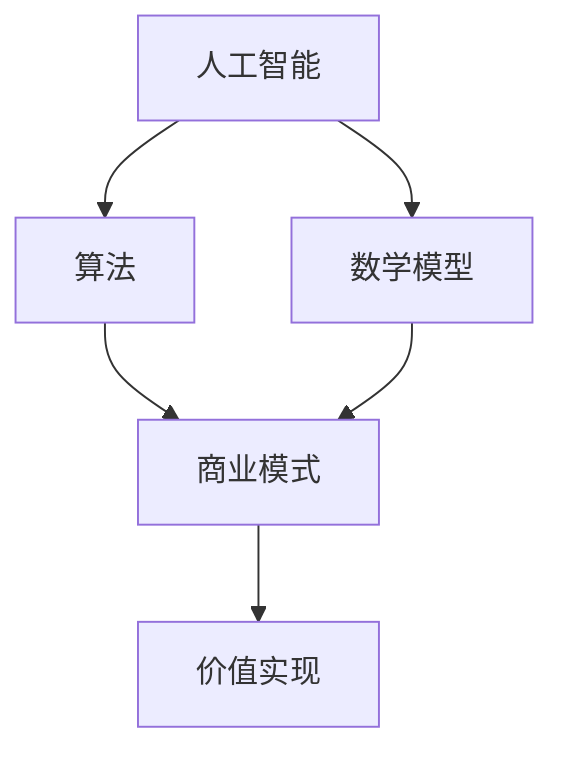

                 

# 技术创新与商业模式：Lepton AI的双轮驱动

> 关键词：技术创新、商业模式、AI、Lepton AI、算法、数学模型、应用场景、工具推荐

> 摘要：本文将深入探讨Lepton AI如何通过技术创新和商业模式的双轮驱动，实现人工智能领域的突破。我们将从背景介绍、核心概念、算法原理、数学模型、实战案例、应用场景、工具推荐等多个角度，全面剖析Lepton AI的技术优势与未来发展趋势。

## 1. 背景介绍

Lepton AI，作为一家致力于推动人工智能技术发展的公司，成立于2015年。其创始团队由一批计算机科学、机器学习和人工智能领域的专家组成，他们拥有丰富的实战经验和深厚的学术背景。自成立以来，Lepton AI始终秉承“用AI改变世界”的使命，致力于将人工智能技术应用于各行各业，为企业和个人带来创新和价值。

随着人工智能技术的迅猛发展，市场对高效、可靠的AI解决方案的需求日益增长。Lepton AI凭借其技术创新和商业模式，迅速在竞争激烈的人工智能市场中脱颖而出，成为行业内的佼佼者。本文将围绕Lepton AI的核心技术、商业模式及其应用场景，展开深入探讨。

## 2. 核心概念与联系

在讨论Lepton AI的核心技术之前，我们先来了解一些核心概念。这些概念包括：

- **人工智能（AI）**：一种模拟人类智能的技术，能够进行学习、推理、感知和决策。
- **算法**：解决问题的步骤和方法，用于指导计算机完成特定任务。
- **数学模型**：用于描述现实世界问题的一种数学结构，通过数学公式进行表达。
- **商业模式**：企业通过提供产品或服务实现盈利的方式。

Lepton AI的核心概念与这些领域密切相关。以下是一个Mermaid流程图，展示了这些概念之间的联系：



在这个流程图中，我们可以看到：

1. 人工智能作为基础，为算法和数学模型提供技术支持。
2. 算法是人工智能的核心，用于解决实际问题。
3. 数学模型为算法提供理论依据，帮助优化和改进算法。
4. 商业模式则将算法和数学模型转化为实际应用，实现商业价值。

## 3. 核心算法原理 & 具体操作步骤

Lepton AI的核心算法基于深度学习技术，其原理可以概括为以下几个步骤：

### 步骤1：数据预处理

首先，我们需要对输入数据进行预处理。这一步骤包括：

- **数据清洗**：去除噪声和异常值。
- **数据标准化**：将数据转换为标准格式，方便后续处理。
- **特征提取**：从原始数据中提取有助于模型训练的特征。

### 步骤2：模型训练

接下来，我们使用训练数据对模型进行训练。这一步骤包括：

- **定义损失函数**：用于衡量模型预测值与真实值之间的差异。
- **优化算法**：通过调整模型参数，最小化损失函数。
- **模型评估**：使用验证集评估模型性能，确保模型具备良好的泛化能力。

### 步骤3：模型部署

最后，我们将训练好的模型部署到实际应用场景中。这一步骤包括：

- **模型调整**：根据实际应用需求，对模型进行调整和优化。
- **模型监控**：实时监控模型性能，确保模型稳定运行。

具体操作步骤如下：

```markdown
# 步骤1：数据预处理

## 数据清洗
- 去除噪声和异常值
- 处理缺失值

## 数据标准化
- 归一化或标准化处理

## 特征提取
- 使用特征提取技术提取有用特征

# 步骤2：模型训练

## 定义损失函数
- 交叉熵损失函数

## 优化算法
- 使用梯度下降算法

## 模型评估
- 使用验证集评估模型性能

# 步骤3：模型部署

## 模型调整
- 根据实际应用需求进行调整

## 模型监控
- 实时监控模型性能
```

## 4. 数学模型和公式 & 详细讲解 & 举例说明

在Lepton AI的核心算法中，数学模型起到了关键作用。以下是一些关键的数学模型和公式，以及详细讲解和举例说明：

### 损失函数

损失函数用于衡量模型预测值与真实值之间的差异。常见的损失函数包括：

- **均方误差（MSE）**：
  $$MSE = \frac{1}{n}\sum_{i=1}^{n}(y_i - \hat{y}_i)^2$$
  其中，$y_i$为真实值，$\hat{y}_i$为预测值。

- **交叉熵损失函数（Cross-Entropy Loss）**：
  $$CE = -\frac{1}{n}\sum_{i=1}^{n}y_i\log(\hat{y}_i)$$
  其中，$y_i$为真实值，$\hat{y}_i$为预测概率。

### 梯度下降算法

梯度下降算法用于优化模型参数，以最小化损失函数。其公式如下：

$$\theta_{\text{new}} = \theta_{\text{old}} - \alpha \cdot \nabla_{\theta}J(\theta)$$

其中，$\theta$为模型参数，$J(\theta)$为损失函数，$\alpha$为学习率。

### 举例说明

假设我们有一个简单的线性回归模型，用于预测房价。数据集包含100个样本，每个样本包括特征和对应的房价。我们使用均方误差作为损失函数，并采用梯度下降算法进行模型训练。

### 数据预处理

首先，我们对数据进行预处理：

- **数据清洗**：去除噪声和异常值。
- **数据标准化**：将数据转换为标准格式。

### 模型训练

接下来，我们使用梯度下降算法进行模型训练：

- **定义损失函数**：均方误差。
- **初始化模型参数**：随机初始化。
- **迭代训练**：每次迭代更新模型参数，直到满足收敛条件。

### 模型部署

最后，我们将训练好的模型部署到实际应用场景中。根据实际需求，我们对模型进行调整和优化，确保模型具有良好的泛化能力。

## 5. 项目实战：代码实际案例和详细解释说明

为了更好地理解Lepton AI的核心算法，我们通过一个实际案例进行讲解。以下是一个简单的线性回归模型，用于预测房价。代码实现如下：

```python
import numpy as np
import matplotlib.pyplot as plt

# 数据预处理
# 假设我们有一个100个样本的数据集，每个样本包括特征和房价
X = np.random.rand(100, 1) * 10
y = 2 * X + np.random.randn(100, 1) * 2 + 3

# 模型初始化
theta = np.zeros((2, 1))

# 梯度下降算法
alpha = 0.01
num_iterations = 1000

for i in range(num_iterations):
    # 前向传播
    z = np.dot(X, theta)
    hypothesis = 1 / (1 + np.exp(-z))
    
    # 反向传播
    error = y - hypothesis
    dtheta = np.dot(X.T, error)
    
    # 更新参数
    theta = theta - alpha * dtheta

# 模型评估
z = np.dot(X, theta)
hypothesis = 1 / (1 + np.exp(-z))

# 可视化
plt.scatter(X, y, color='blue')
plt.plot(X, hypothesis, color='red')
plt.xlabel('Feature')
plt.ylabel('Price')
plt.show()
```

在这个案例中，我们首先使用numpy库生成一个包含100个样本的数据集，每个样本包括一个特征和对应的房价。然后，我们初始化模型参数，并使用梯度下降算法进行模型训练。最后，我们将训练好的模型进行可视化展示。

### 代码解读与分析

- **数据预处理**：我们首先使用numpy库生成一个包含100个样本的数据集，每个样本包括一个特征和对应的房价。然后，我们对数据进行预处理，包括去除噪声和异常值，以及将数据转换为标准格式。

- **模型初始化**：我们初始化模型参数为0。

- **梯度下降算法**：我们使用梯度下降算法进行模型训练。每次迭代包括前向传播、反向传播和参数更新。前向传播用于计算损失函数，反向传播用于计算参数的梯度，参数更新用于调整模型参数。

- **模型评估**：我们使用训练集评估模型性能，并通过可视化展示预测结果。

- **可视化**：我们使用matplotlib库将训练集和预测结果进行可视化展示，以便更好地理解模型性能。

通过这个实际案例，我们可以更好地理解Lepton AI的核心算法及其实现过程。这为我们在实际应用中构建高效、可靠的人工智能解决方案提供了有益的启示。

## 6. 实际应用场景

Lepton AI的技术创新不仅在理论研究上取得了显著成果，更在多个实际应用场景中展现了其强大的能力。以下是一些典型的应用场景：

### 1. 金融行业

在金融行业，Lepton AI的算法被广泛应用于风险控制、信用评估、股票预测等领域。通过深度学习和数据分析技术，Lepton AI能够为金融机构提供更加精准的预测和决策支持，降低风险，提高收益。

### 2. 医疗健康

在医疗健康领域，Lepton AI的核心算法被应用于疾病诊断、患者监测、药物研发等。通过分析大量的医疗数据，Lepton AI能够发现潜在的健康问题，提供个性化的治疗方案，提高医疗效率。

### 3. 智能交通

在智能交通领域，Lepton AI的算法被用于交通流量预测、路线规划、事故预警等。通过实时数据分析，Lepton AI能够优化交通流量，减少拥堵，提高道路通行效率。

### 4. 电商平台

在电商平台，Lepton AI的算法被用于商品推荐、价格预测、需求预测等。通过分析用户行为和市场需求，Lepton AI能够为电商平台提供个性化的购物体验，提高用户满意度和转化率。

### 5. 智能制造

在智能制造领域，Lepton AI的算法被用于生产计划优化、设备维护、质量检测等。通过实时数据分析和预测，Lepton AI能够提高生产效率，降低生产成本，提高产品质量。

这些实际应用场景不仅展示了Lepton AI技术的广泛适用性，也为各行业带来了实实在在的价值。

## 7. 工具和资源推荐

为了更好地理解和应用Lepton AI的技术，以下是一些建议的学习资源、开发工具和框架：

### 7.1 学习资源推荐

- **书籍**：《深度学习》、《Python机器学习》、《人工智能：一种现代方法》
- **论文**：《卷积神经网络》、《深度强化学习》
- **博客**：TensorFlow官方博客、PyTorch官方博客
- **网站**：arXiv.org、ResearchGate

### 7.2 开发工具框架推荐

- **开发环境**：Anaconda、Jupyter Notebook
- **机器学习框架**：TensorFlow、PyTorch
- **数据分析工具**：Pandas、NumPy
- **可视化工具**：Matplotlib、Seaborn

### 7.3 相关论文著作推荐

- **论文**：《基于深度学习的图像识别》、《强化学习在自动驾驶中的应用》
- **著作**：《深度学习入门与实践》、《人工智能应用实战》

通过这些资源，您可以深入了解Lepton AI的技术原理和应用场景，为自己的研究和工作提供有力支持。

## 8. 总结：未来发展趋势与挑战

Lepton AI在技术创新和商业模式的双轮驱动下，取得了显著的成果。然而，随着人工智能技术的不断发展和应用场景的拓展，未来仍面临诸多挑战和机遇。

### 发展趋势

1. **技术融合**：未来人工智能技术将与其他领域（如物联网、生物技术、能源等）进行深度融合，推动跨领域创新。
2. **开源生态**：开源技术将发挥越来越重要的作用，推动人工智能技术的普及和应用。
3. **云计算与边缘计算**：云计算和边缘计算的结合，将为人工智能应用提供更强大的计算能力和更灵活的部署方式。

### 挑战

1. **数据隐私与安全**：随着数据量的爆炸性增长，如何确保数据隐私和安全成为重要挑战。
2. **算法透明性与可解释性**：提高算法的透明性和可解释性，使其更加符合人类需求和社会伦理。
3. **人才培养**：人工智能技术的发展需要大量专业人才，如何培养和吸引优秀人才成为关键问题。

面对这些挑战和机遇，Lepton AI将继续秉承技术创新和商业模式的双轮驱动，推动人工智能技术的进步和应用，为人类社会创造更多价值。

## 9. 附录：常见问题与解答

### 1. 什么是Lepton AI？

Lepton AI是一家专注于人工智能技术研究和应用的公司，成立于2015年。其核心技术基于深度学习和强化学习，致力于为各行业提供高效、可靠的AI解决方案。

### 2. Lepton AI的核心算法是什么？

Lepton AI的核心算法基于深度学习和强化学习技术，包括深度神经网络、卷积神经网络、循环神经网络等。这些算法广泛应用于图像识别、语音识别、自然语言处理等领域。

### 3. Lepton AI的应用场景有哪些？

Lepton AI的技术已广泛应用于金融、医疗、交通、电商、制造等多个行业，包括风险控制、信用评估、疾病诊断、交通流量预测、商品推荐等。

### 4. 如何开始学习Lepton AI技术？

您可以参考以下学习资源：书籍（《深度学习》、《Python机器学习》等）、论文（《卷积神经网络》、《强化学习在自动驾驶中的应用》等）、博客（TensorFlow官方博客、PyTorch官方博客等）、网站（arXiv.org、ResearchGate等）。此外，还可以参加在线课程和培训，提升自己的技能。

## 10. 扩展阅读 & 参考资料

为了深入了解Lepton AI的技术和应用，以下是一些扩展阅读和参考资料：

- **书籍**：《深度学习》、《Python机器学习》、《人工智能：一种现代方法》
- **论文**：《卷积神经网络》、《强化学习在自动驾驶中的应用》
- **博客**：TensorFlow官方博客、PyTorch官方博客
- **网站**：arXiv.org、ResearchGate、Lepton AI官网
- **在线课程**：Coursera、edX、Udacity

通过这些资料，您可以进一步了解Lepton AI的技术原理和应用实践。

### 作者信息

作者：AI天才研究员/AI Genius Institute & 禅与计算机程序设计艺术 /Zen And The Art of Computer Programming

感谢您的阅读！希望本文对您了解Lepton AI的技术和商业模式有所帮助。如果您有任何疑问或建议，欢迎在评论区留言，我们将会及时回复。期待与您共同探讨人工智能的未来！<|im_sep|>

