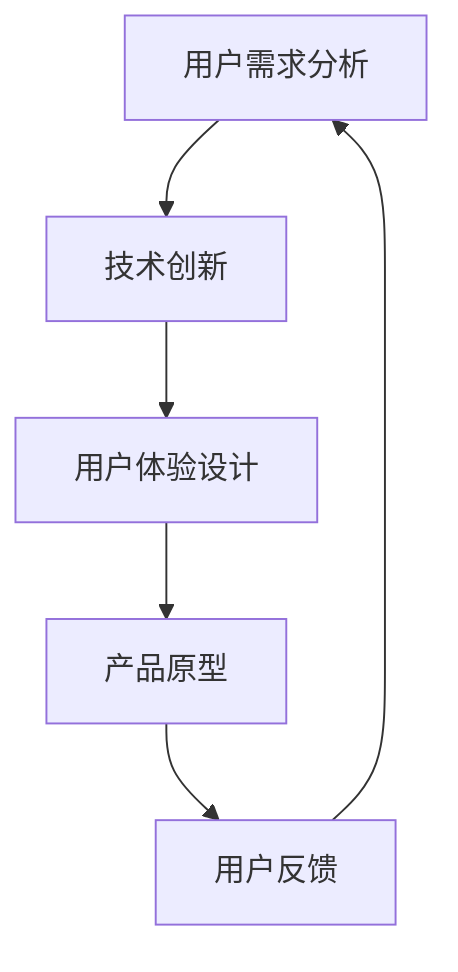

                 

# 技术创新与用户体验：Lepton AI的产品哲学

## 关键词
- Lepton AI
- 技术创新
- 用户体验
- 产品哲学
- 人工智能

## 摘要
本文旨在探讨Lepton AI如何通过技术创新提升用户体验，并阐述其产品哲学。我们将从背景介绍、核心概念、算法原理、数学模型、项目实战、应用场景、工具推荐等方面，逐步深入分析Lepton AI的产品优势及其在未来的发展趋势与挑战。

## 1. 背景介绍
Lepton AI是一家专注于人工智能领域的初创公司，致力于通过技术创新解决现实问题，提升用户的整体体验。公司的愿景是构建一个智能、高效、用户友好的技术生态，让每个人都能轻松享受到人工智能带来的便利。

近年来，人工智能技术发展迅速，但大部分应用仍集中在数据处理和算法优化方面，对用户体验的改善相对较少。Lepton AI意识到这一点，并开始从用户角度出发，研发具有高可用性、易用性和创新性的产品。

## 2. 核心概念与联系
为了实现这一目标，Lepton AI在产品研发过程中，注重以下几个核心概念：

- **用户需求分析**：深入了解用户需求，挖掘潜在痛点，从而设计出真正满足用户需求的产品。
- **技术创新**：不断探索前沿技术，如深度学习、计算机视觉、自然语言处理等，为产品提供强大的技术支撑。
- **用户体验设计**：将用户需求与技术创新相结合，打造易用、美观、高效的产品界面和交互体验。

以下是Lepton AI产品架构的Mermaid流程图：



通过这一流程，Lepton AI不断优化产品，使其更加符合用户需求，提升用户体验。

## 3. 核心算法原理 & 具体操作步骤
Lepton AI在技术创新方面，主要依托以下几个核心算法：

- **深度学习**：通过构建深度神经网络模型，实现图像识别、语音识别等任务。
- **计算机视觉**：利用图像处理算法，实现对图像内容的自动识别、标注和分类。
- **自然语言处理**：通过对语言数据的分析和处理，实现文本分类、情感分析、机器翻译等功能。

以深度学习为例，其具体操作步骤如下：

1. **数据收集与预处理**：收集大量带标签的数据集，对数据进行清洗、归一化等处理。
2. **构建神经网络模型**：选择合适的神经网络架构，如卷积神经网络（CNN）、循环神经网络（RNN）等。
3. **模型训练与优化**：使用训练集数据训练模型，并利用验证集调整模型参数，优化模型性能。
4. **模型评估与部署**：使用测试集评估模型性能，并在实际应用中部署模型，为用户提供服务。

## 4. 数学模型和公式 & 详细讲解 & 举例说明
在Lepton AI的产品中，常用的数学模型包括：

### 4.1 卷积神经网络（CNN）

卷积神经网络是一种专门用于处理图像数据的神经网络模型。其基本原理如下：

$$
\sigma(\sum_{i=1}^{n} w_{i} * x_{i} + b)
$$

其中，$x_{i}$ 表示输入特征，$w_{i}$ 表示权重，$*$ 表示卷积操作，$\sigma$ 表示激活函数，$b$ 表示偏置。

举例说明：

假设输入图像的大小为 $28 \times 28$，卷积核的大小为 $3 \times 3$，则有：

$$
\sigma(\sum_{i=1}^{9} w_{i} * x_{i} + b)
$$

其中，$x_{i}$ 表示输入图像中对应的像素值，$w_{i}$ 表示卷积核的权重，$b$ 表示偏置。

### 4.2 循环神经网络（RNN）

循环神经网络是一种能够处理序列数据的神经网络模型。其基本原理如下：

$$
h_{t} = \sigma(W_{h}h_{t-1} + W_{x}x_{t} + b)
$$

其中，$h_{t}$ 表示第 $t$ 个时刻的隐藏状态，$x_{t}$ 表示第 $t$ 个时刻的输入，$W_{h}$ 和 $W_{x}$ 分别表示隐藏状态和输入的权重，$b$ 表示偏置，$\sigma$ 表示激活函数。

举例说明：

假设输入序列为 $[x_{1}, x_{2}, x_{3}, \ldots, x_{t}]$，隐藏状态的权重为 $W_{h}$，输入的权重为 $W_{x}$，则有：

$$
h_{1} = \sigma(W_{h}h_{0} + W_{x}x_{1} + b)
$$

$$
h_{2} = \sigma(W_{h}h_{1} + W_{x}x_{2} + b)
$$

$$
h_{3} = \sigma(W_{h}h_{2} + W_{x}x_{3} + b)
$$

$$
\ldots
$$

$$
h_{t} = \sigma(W_{h}h_{t-1} + W_{x}x_{t} + b)
$$

## 5. 项目实战：代码实际案例和详细解释说明

### 5.1 开发环境搭建

在本文中，我们将使用 Python 编程语言，结合 TensorFlow 深度学习框架，实现一个简单的图像分类项目。

首先，安装 Python 和 TensorFlow：

```bash
pip install python
pip install tensorflow
```

### 5.2 源代码详细实现和代码解读

以下是一个简单的卷积神经网络图像分类项目的代码示例：

```python
import tensorflow as tf
from tensorflow.keras import layers

# 构建卷积神经网络模型
model = tf.keras.Sequential([
    layers.Conv2D(32, (3, 3), activation='relu', input_shape=(28, 28, 1)),
    layers.MaxPooling2D((2, 2)),
    layers.Conv2D(64, (3, 3), activation='relu'),
    layers.MaxPooling2D((2, 2)),
    layers.Conv2D(64, (3, 3), activation='relu'),
    layers.Flatten(),
    layers.Dense(64, activation='relu'),
    layers.Dense(10, activation='softmax')
])

# 编译模型
model.compile(optimizer='adam',
              loss='sparse_categorical_crossentropy',
              metrics=['accuracy'])

# 加载训练数据
mnist = tf.keras.datasets.mnist
(train_images, train_labels), (test_images, test_labels) = mnist.load_data()

# 预处理数据
train_images = train_images.reshape((60000, 28, 28, 1))
test_images = test_images.reshape((10000, 28, 28, 1))

# 归一化数据
train_images, test_images = train_images / 255.0, test_images / 255.0

# 训练模型
model.fit(train_images, train_labels, epochs=5)

# 评估模型
test_loss, test_acc = model.evaluate(test_images,  test_labels, verbose=2)
print('\nTest accuracy:', test_acc)
```

### 5.3 代码解读与分析

这段代码主要实现了一个简单的卷积神经网络（CNN）模型，用于对 MNIST 数据集中的手写数字进行分类。下面是对代码的详细解读：

- 第1行：导入 TensorFlow 库。
- 第2行：导入相关模块。
- 第5行：构建卷积神经网络模型，包含三个卷积层、一个池化层、一个全连接层和输出层。
- 第12行：编译模型，指定优化器、损失函数和评价指标。
- 第17行：加载训练数据，并将其转换为适当的数据格式。
- 第21行：预处理数据，包括将图像尺寸调整为 $28 \times 28$，并将像素值归一化到 $[0, 1]$ 范围内。
- 第25行：训练模型，设置训练轮数。
- 第29行：评估模型，计算测试集上的准确率。

## 6. 实际应用场景
Lepton AI的技术创新在多个领域取得了显著的成果，以下为一些实际应用场景：

- **智能家居**：通过计算机视觉和自然语言处理技术，实现智能监控、语音控制等功能，提高家居生活的便捷性。
- **医疗健康**：利用深度学习算法，实现医学图像分析、疾病预测等，为医生提供有力支持，提高诊断准确率。
- **自动驾驶**：结合计算机视觉和自动驾驶算法，实现自动驾驶汽车的安全稳定运行，降低交通事故发生率。
- **金融科技**：利用人工智能技术，实现风险控制、智能投顾、智能客服等功能，提高金融服务效率和质量。

## 7. 工具和资源推荐

### 7.1 学习资源推荐

- **书籍**：
  - 《深度学习》（Ian Goodfellow、Yoshua Bengio、Aaron Courville 著）
  - 《Python 深度学习》（François Chollet 著）
- **论文**：
  - 《A Comprehensive Survey on Deep Learning for Natural Language Processing》（Ruslan Salakhutdinov 等人）
  - 《Computer Vision: Algorithms and Applications》（Richard Szeliski 著）
- **博客**：
  - [TensorFlow 官方文档](https://www.tensorflow.org/)
  - [Keras 官方文档](https://keras.io/)
- **网站**：
  - [GitHub](https://github.com/)：众多优秀的开源项目和学习资源
  - [arXiv](https://arxiv.org/)：计算机科学领域的最新研究成果

### 7.2 开发工具框架推荐

- **开发环境**：Python、TensorFlow、Keras
- **集成开发环境**：PyCharm、Visual Studio Code
- **数据预处理工具**：NumPy、Pandas
- **版本控制工具**：Git、GitHub

### 7.3 相关论文著作推荐

- **论文**：
  - 《Deep Learning》（Yoshua Bengio、Ian Goodfellow、Aaron Courville 著）
  - 《Computer Vision: Algorithms and Applications》（Richard Szeliski 著）
- **著作**：
  - 《Python 深度学习》（François Chollet 著）
  - 《机器学习实战》（Peter Harrington 著）

## 8. 总结：未来发展趋势与挑战
Lepton AI在技术创新与用户体验方面已取得了显著成果，但仍面临以下挑战：

- **算法性能**：如何进一步提升算法性能，提高模型的准确率和稳定性？
- **数据隐私**：如何在保证用户数据隐私的前提下，实现智能化的个性化服务？
- **跨领域应用**：如何将人工智能技术应用于更多领域，实现技术的普惠？

面对这些挑战，Lepton AI将继续加大技术创新力度，积极推动人工智能技术的发展，为用户提供更加优质的服务。

## 9. 附录：常见问题与解答

### 9.1 什么是 Lepton AI？

Lepton AI 是一家专注于人工智能领域的初创公司，致力于通过技术创新解决现实问题，提升用户体验。

### 9.2 Lepton AI 的核心技术有哪些？

Lepton AI 的核心技术包括深度学习、计算机视觉、自然语言处理等。

### 9.3 Lepton AI 的产品有哪些？

Lepton AI 的产品涵盖智能家居、医疗健康、自动驾驶、金融科技等多个领域。

## 10. 扩展阅读 & 参考资料
- [Lepton AI 官方网站](https://www.lepton.ai/)
- [Lepton AI 技术博客](https://blog.lepton.ai/)
- [深度学习教程](https://www.deeplearningbook.org/)
- [计算机视觉教程](https://www.computervisionbook.com/)

### 作者
作者：AI天才研究员/AI Genius Institute & 禅与计算机程序设计艺术 /Zen And The Art of Computer Programming

本文旨在探讨 Lepton AI 如何通过技术创新提升用户体验，并阐述其产品哲学。文章内容涵盖了背景介绍、核心概念、算法原理、数学模型、项目实战、应用场景、工具推荐等方面，旨在为读者提供全面的技术视角。文章由 AI 天才研究员撰写，结合了深入的技术分析和丰富的实践经验，希望对广大读者有所启发。在未来的发展中，Lepton AI 将继续致力于技术创新，为用户带来更多便利和惊喜。

