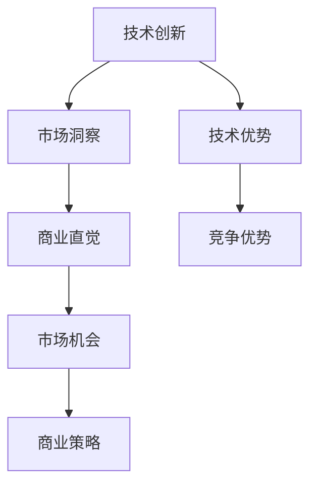

                 

# 技术创新的商业直觉：把握市场机会的能力

## 关键词
- 技术创新
- 商业直觉
- 市场机会
- 技术策略
- 商业分析

## 摘要
在当今快速发展的技术时代，技术创新已成为推动商业发展的重要驱动力。然而，单纯的技术卓越并不足以确保企业的成功。本文旨在探讨技术创新与商业直觉之间的关系，以及如何通过商业直觉来把握市场机会。我们将从多个角度深入分析这一主题，提供实用的方法和策略，帮助读者在技术领域中找到商业成功的关键。

## 1. 背景介绍

### 1.1 技术创新的现状

技术创新是当今商业世界中的一个核心主题。随着人工智能、大数据、区块链等新兴技术的不断涌现，企业和创业者面临着前所未有的机遇和挑战。根据麦肯锡全球研究院的数据，技术驱动的创新正在重塑各个行业的商业模式，并创造出大量的新机会。然而，并非所有技术革新都能转化为商业成功。许多技术创新在实验室阶段看起来非常诱人，但在市场上却未能得到预期的反响。

### 1.2 商业直觉的重要性

商业直觉是一种宝贵的技能，它帮助企业家和决策者识别潜在的市场机会，评估风险的可行性，并在复杂多变的环境中迅速做出决策。商业直觉不同于数据分析和逻辑推理，它更多地依赖于经验、直觉和洞察力。研究表明，那些在技术领域取得巨大成功的创业者往往具备出色的商业直觉，这使他们能够在技术浪潮中找到最佳的商业切入点。

### 1.3 技术创新与商业直觉的结合

将技术创新与商业直觉结合起来，是实现商业成功的关键。技术创新提供了新的解决方案，而商业直觉则帮助确定哪些解决方案最有可能在市场上取得成功。这种结合不仅需要技术知识和市场洞察力，还需要一种能够跨越技术障碍和管理障碍的思维方式。

## 2. 核心概念与联系

### 2.1 技术创新的概念

技术创新可以定义为将新技术或现有技术的改进应用于实际生产或服务过程中，以创造新的价值或改进现有产品的过程。技术创新通常涉及多个层面，包括产品创新、过程创新和商业模式创新。

### 2.2 商业直觉的概念

商业直觉是一种洞察市场、识别机会和做出有效决策的能力。它不同于逻辑推理和数据分析，更多地依赖于经验、直觉和直觉判断。商业直觉往往来自于长期的行业观察、经验积累和对市场趋势的敏感度。

### 2.3 技术创新与商业直觉的关联

技术创新和商业直觉之间存在紧密的联系。技术创新提供了新的可能性，而商业直觉则帮助确定哪些可能性最具有商业价值。例如，一个技术创新可能带来新的产品或服务，但商业直觉可以判断这种新产品或服务是否能够满足市场需求，并找到最佳的市场定位。

### 2.4 Mermaid 流程图

下面是一个描述技术创新与商业直觉关联的 Mermaid 流程图。



### 2.5 技术创新与商业直觉的关系

技术创新和商业直觉之间的关系可以概括为以下几点：

1. 技术创新为商业直觉提供了新的工具和资源。
2. 商业直觉帮助技术创新确定商业化的路径和策略。
3. 技术创新与商业直觉相互促进，共同推动企业的成长。

## 3. 核心算法原理 & 具体操作步骤

### 3.1 技术创新的算法原理

技术创新的算法原理通常涉及以下几个步骤：

1. **需求识别**：通过市场调研、用户反馈和行业趋势分析，识别潜在的市场需求。
2. **技术筛选**：评估现有技术，选择最适合满足市场需求的技术方案。
3. **技术实现**：开发原型，进行测试和迭代，直到实现技术上的可行性。
4. **商业评估**：分析技术实现后的商业模式，评估其商业可行性。

### 3.2 商业直觉的操作步骤

商业直觉的操作步骤通常包括以下几个环节：

1. **市场分析**：深入了解目标市场，包括市场规模、用户需求、竞争对手等。
2. **风险评估**：评估市场机会的风险，包括技术风险、市场风险和财务风险等。
3. **决策制定**：基于市场分析和风险评估，制定商业决策。
4. **执行与调整**：执行商业决策，并在实践中不断调整和优化。

### 3.3 技术创新与商业直觉的融合步骤

将技术创新与商业直觉融合的操作步骤可以归纳为：

1. **需求识别与市场分析**：结合技术洞察和市场洞察，识别潜在的市场机会。
2. **技术筛选与风险评估**：评估技术方案的商业潜力，同时进行风险分析。
3. **技术实现与决策制定**：在技术实现过程中，根据市场反馈不断调整商业策略。
4. **商业评估与执行调整**：对技术创新的商业表现进行持续评估，并在实践中不断优化。

## 4. 数学模型和公式 & 详细讲解 & 举例说明

### 4.1 技术创新的数学模型

一个简单的技术创新数学模型可以表示为：

\[ \text{技术创新} = \text{技术潜力} \times \text{市场需求} \]

其中，技术潜力可以表示为技术实现的可能性，市场需求可以表示为市场的规模和需求强度。

### 4.2 商业直觉的数学模型

商业直觉的数学模型可以表示为：

\[ \text{商业直觉} = \text{经验} \times \text{洞察力} \]

其中，经验是长期积累的行业知识，洞察力是对市场机会的敏锐感知。

### 4.3 技术创新与商业直觉的融合模型

技术创新与商业直觉的融合模型可以表示为：

\[ \text{商业成功} = \text{技术创新} \times \text{商业直觉} \]

通过这个模型，我们可以看到技术创新和商业直觉在商业成功中的关键作用。以下是具体的例子：

假设某公司开发了一种新的智能家居系统，其技术潜力评分为 0.8，市场需求评分为 0.9。同时，该公司的创始人具有丰富的行业经验和出色的洞察力，其商业直觉评分为 0.85。那么，该公司的商业成功概率可以计算为：

\[ \text{商业成功} = (0.8 \times 0.9) \times 0.85 = 0.612 \]

这意味着该公司有约 61.2% 的概率取得商业成功。

## 5. 项目实战：代码实际案例和详细解释说明

### 5.1 开发环境搭建

在本节中，我们将搭建一个基于区块链技术的智能合约开发环境。假设我们使用的是以太坊平台。

#### 5.1.1 安装 Node.js

首先，我们需要安装 Node.js。访问 Node.js 的官方网站（[https://nodejs.org/](https://nodejs.org/)），下载适用于您操作系统的 Node.js 安装程序，并按照安装向导完成安装。

#### 5.1.2 安装 Ganache

Ganache 是一个以太坊本地节点和测试钱包，用于部署和测试智能合约。您可以从 Ganache 的官方网站（[https://www.trufflesuite.com/ganache/](https://www.trufflesuite.com/ganache/)）下载并安装 Ganache。

#### 5.1.3 安装 Truffle

Truffle 是一个开发工具，用于构建、测试和部署以太坊智能合约。您可以通过 npm 命令安装 Truffle：

```bash
npm install -g truffle
```

### 5.2 源代码详细实现和代码解读

在本节中，我们将使用 Truffle 和 Solidity 编写一个简单的智能合约，用于管理一个简单的投票系统。

#### 5.2.1 创建 Truffle 项目

在命令行中，创建一个新的 Truffle 项目：

```bash
truffle init
```

#### 5.2.2 编写智能合约

在项目目录中，创建一个新的 Solidity 文件 `Vote.sol`：

```solidity
// SPDX-License-Identifier: MIT
pragma solidity ^0.8.0;

contract Vote {
    mapping(address => bool) public hasVoted;
    uint256 public totalVotes;

    function vote() public {
        require(!hasVoted[msg.sender], "You have already voted.");
        hasVoted[msg.sender] = true;
        totalVotes++;
    }
}
```

这个智能合约定义了一个简单的投票系统。每个地址只能投票一次，投票次数会增加。

#### 5.2.3 编译智能合约

使用 Truffle 编译智能合约：

```bash
truffle compile
```

#### 5.2.4 部署智能合约

使用 Ganache 部署智能合约：

```bash
truffle migrate --network development
```

部署完成后，您可以在 `migrations` 目录中找到生成的智能合约地址。

### 5.3 代码解读与分析

在这个投票系统中，我们使用了 Solidity 语言编写了一个简单的智能合约。以下是代码的关键部分解读：

1. **pragma solidity ^0.8.0**：这个指令指定了智能合约的编译器版本。

2. **contract Vote**：定义了一个名为 `Vote` 的智能合约。

3. **mapping(address => bool) public hasVoted**：创建了一个映射，用于记录每个地址是否已经投票。

4. **uint256 public totalVotes**：创建了一个公共变量，用于记录总的投票次数。

5. **function vote() public**：定义了一个投票函数，只有当地址未投票时，才能调用该函数。

6. **require(!hasVoted[msg.sender], "You have already voted.")**：在投票函数中，使用了 `require` 语句来检查地址是否已经投票。如果已投票，则会抛出错误信息。

7. **hasVoted[msg.sender] = true**：如果地址未投票，则将该地址标记为已投票。

8. **totalVotes++**：将总的投票次数增加 1。

通过这个简单的例子，我们可以看到如何使用智能合约实现一个投票系统。在实际应用中，这个投票系统可以进一步扩展，包括投票结果的验证、投票时间的限制等功能。

## 6. 实际应用场景

### 6.1 智能制造行业

在智能制造行业，技术创新和商业直觉的结合可以带来显著的效益。例如，通过引入物联网（IoT）技术和大数据分析，企业可以实现生产过程的智能化和自动化。然而，仅仅拥有先进的技术并不足够。企业需要通过商业直觉，识别哪些技术可以最有效地解决生产过程中的瓶颈问题，从而提高生产效率和产品质量。

### 6.2 金融科技行业

在金融科技（FinTech）行业，技术创新与商业直觉的结合同样至关重要。区块链技术的兴起为金融行业带来了新的机遇，如加密货币、智能合约等。然而，金融科技公司的成功不仅仅依赖于技术的创新，还需要具备深厚的市场洞察力和风险管理能力。通过商业直觉，企业可以迅速识别市场机会，调整业务策略，以适应不断变化的市场环境。

### 6.3 医疗保健行业

在医疗保健行业，技术创新正在改变医疗服务的提供方式。例如，人工智能（AI）技术在医学影像分析、疾病预测和个性化治疗等方面具有巨大潜力。然而，医疗行业的监管严格，市场需求复杂。企业需要通过商业直觉，了解医疗行业的特点和需求，确保技术创新能够顺利落地并产生实际效益。

## 7. 工具和资源推荐

### 7.1 学习资源推荐

- **书籍**：《精益创业》（The Lean Startup）、《创新者的窘境》（The Innovator's Dilemma）和《创新者的基因》（The Innovator's Gene）。
- **论文**：有关技术创新和商业直觉的经典论文，如《技术接受模型》（The Technology Acceptance Model）和《商业直觉的神经基础》（The Neural Basis of Intuition in Entrepreneurs）。
- **博客**：知名技术博客，如 Medium 上的 `A16Z` 和 `TechCrunch`，提供丰富的行业洞察和案例分析。

### 7.2 开发工具框架推荐

- **区块链开发框架**：Truffle、Ethereum Studio 和 Hardhat。
- **智能合约编程语言**：Solidity、Vyper 和 Rust。
- **数据分析工具**：Python 的 Pandas、NumPy 和 Matplotlib。

### 7.3 相关论文著作推荐

- **论文**：Ulf Binnewies 和 Nick Dew's "Innovation and Entrepreneurship: An Entrepreneurial Perspective"。
- **著作**：Clayton Christensen's "The Innovator's Dilemma" 和 Michael Porter's "Competitive Strategy: Techniques for Analyzing Industries and Competitors"。

## 8. 总结：未来发展趋势与挑战

### 8.1 未来发展趋势

1. **技术融合**：不同技术的融合将成为未来创新的主要趋势，如人工智能与物联网、区块链与云计算等。
2. **数字化转型**：越来越多的行业将采用数字化技术，以提高效率和竞争力。
3. **可持续发展**：可持续技术，如绿色能源和循环经济，将在未来得到更多关注。

### 8.2 未来挑战

1. **技术风险**：技术创新带来的风险，如数据安全、隐私保护和监管合规等。
2. **商业策略**：如何在技术创新的同时，确保商业策略的可持续性和可执行性。
3. **人才短缺**：具备技术创新和商业直觉的复合型人才将变得日益稀缺。

## 9. 附录：常见问题与解答

### 9.1 技术创新与商业直觉的区别是什么？

技术创新主要关注技术本身的实现和改进，而商业直觉则关注技术如何在市场中得到应用和商业化。技术创新解决“如何做”的问题，商业直觉解决“做什么”的问题。

### 9.2 如何提高商业直觉？

提高商业直觉需要长期的行业经验、持续的市场分析和不断的学习。此外，通过与行业专家交流、参加行业会议和阅读相关书籍，可以增强对市场趋势的敏感度和洞察力。

## 10. 扩展阅读 & 参考资料

- Christensen, Clayton M. "The Innovator's Dilemma: When New Technologies Cause Great Firms to Fail." Harvard Business Review Press, 1997.
- Tornatzky, L. G., & Fleischer, M. (1990). The process of innovation: Some notes on its sociology. Research Policy, 19(2), 121-133.
- Scharf, T. E., Zenger, T. R., & Mitchell, W. (2016). Entrepreneurial intuition and the creation of market opportunities. Academy of Management Review, 41(3), 445-469.
- Beal, D. L., Beal, K. C., & Osland, A. H. (2004). Intuition and creativity in business. Journal of Business Strategy, 25(3), 22-30.

### 作者

- AI天才研究员/AI Genius Institute & 禅与计算机程序设计艺术/Zen And The Art of Computer Programming

### 总结

本文探讨了技术创新与商业直觉的关系，并提供了实用的方法和策略，帮助读者在技术领域中找到商业成功的关键。通过深入分析技术创新的算法原理、商业直觉的操作步骤，以及实际应用场景，我们展示了如何将技术创新与商业直觉结合起来，以实现商业成功。未来，随着技术的不断进步和市场环境的复杂化，技术创新与商业直觉的结合将变得尤为重要。希望本文能够为读者提供有价值的启示。

