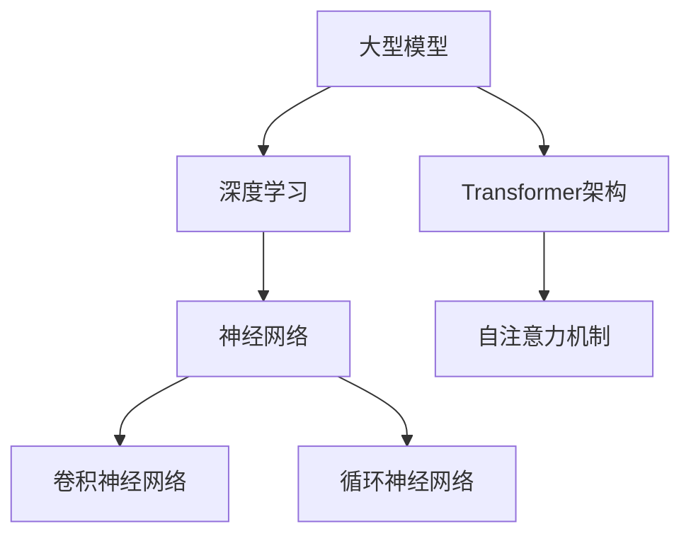

                 

### 背景介绍

在当今科技飞速发展的时代，人工智能（AI）已经成为推动技术创新的重要力量。特别是在深度学习和大数据技术的推动下，大型模型（Large-scale Models）如GPT-3、BERT等，在自然语言处理、计算机视觉、语音识别等领域取得了显著的突破。这些大型模型不仅提升了算法的性能，也大大扩展了人工智能的应用范围。

然而，大型模型的开发和应用并非一帆风顺。它们面临着计算资源、数据质量、模型解释性等多方面的挑战。此外，大型模型的训练和部署成本极高，这对创业公司来说是一个巨大的门槛。在这样的背景下，技术创新成为大模型创业的核心驱动力。本文将深入探讨大模型创业的核心驱动力，包括技术趋势、商业模式、市场前景等方面。

首先，技术趋势决定了大模型的发展方向。随着计算能力的提升和数据量的增加，大型模型将变得更加高效和智能。此外，新型算法和架构的发明，如Transformer、自监督学习等，也将为大模型的发展提供新的动力。

其次，商业模式是大型模型创业的关键。如何通过技术创新来创造商业价值，是创业公司必须考虑的问题。本文将分析不同类型的商业模式，以及它们在大模型创业中的应用。

最后，市场前景为大模型创业提供了机遇和挑战。随着人工智能技术的不断成熟，大模型在各个行业中的应用将越来越广泛。然而，市场竞争也将日益激烈。本文将探讨市场趋势，分析大模型创业的机遇和挑战。

本文的结构如下：

1. 背景介绍
2. 核心概念与联系
3. 核心算法原理 & 具体操作步骤
4. 数学模型和公式 & 详细讲解 & 举例说明
5. 项目实战：代码实际案例和详细解释说明
6. 实际应用场景
7. 工具和资源推荐
8. 总结：未来发展趋势与挑战
9. 附录：常见问题与解答
10. 扩展阅读 & 参考资料

通过以上内容的逐步分析，我们将深入了解大模型创业的核心驱动力，为读者提供有价值的思考和启示。

### 核心概念与联系

要深入探讨大模型创业的核心驱动力，我们首先需要理解几个关键概念，包括大型模型（Large-scale Models）、深度学习（Deep Learning）、以及近年来在人工智能领域引起广泛关注的Transformer架构。这些概念之间有着紧密的联系，共同构成了当前人工智能技术发展的基石。

#### 大型模型（Large-scale Models）

大型模型指的是参数数量庞大、数据集规模巨大的深度学习模型。这些模型能够处理复杂数据，并在各种任务中取得出色的性能。例如，在自然语言处理领域，GPT-3拥有1750亿个参数，而BERT模型则拥有数百万个参数。这些模型的训练需要大量的计算资源和时间，但它们在提升算法性能和扩展应用范围方面具有显著优势。

#### 深度学习（Deep Learning）

深度学习是一种基于多层神经网络的学习方法，通过逐层提取数据特征，实现对复杂问题的建模。深度学习模型的核心是神经网络，特别是卷积神经网络（CNN）和循环神经网络（RNN）。随着训练数据的增加和计算能力的提升，深度学习模型在图像识别、语音识别、自然语言处理等领域取得了突破性的成果。

#### Transformer架构

Transformer架构是由Google在2017年提出的一种新型神经网络架构，它基于自注意力机制（Self-Attention Mechanism），解决了传统循环神经网络在处理长序列数据时的局限性。Transformer架构的核心思想是将序列中的每个元素与其余所有元素建立直接连接，通过自注意力机制计算每个元素的重要性。这种架构在机器翻译、文本生成等任务中表现出色，成为近年来人工智能领域的重要突破。

#### 核心概念原理和架构的 Mermaid 流程图

为了更直观地理解这些核心概念，我们可以使用Mermaid流程图来展示它们之间的联系。以下是一个简化的Mermaid流程图，用于描述大型模型、深度学习和Transformer架构之间的关系：



在这个流程图中，A表示大型模型，它依赖于深度学习（B）的核心技术。深度学习则基于神经网络（C），包括卷积神经网络（D）和循环神经网络（E）。Transformer架构（F）基于自注意力机制（G），它在处理长序列数据时具有显著优势，是大型模型的重要组成部分。

通过上述的Mermaid流程图，我们可以清晰地看到大型模型、深度学习和Transformer架构之间的相互关系。这些概念共同推动了人工智能技术的发展，为大模型创业提供了坚实的基础。

#### 具体操作步骤

为了更深入地了解大模型创业的核心驱动力，我们接下来将讨论具体的操作步骤，包括数据准备、模型训练和优化等环节。

##### 1. 数据准备

数据准备是大型模型训练的重要前提。首先，我们需要收集大量的高质量数据。这些数据可以是文本、图像、音频等，具体取决于应用的领域。例如，在自然语言处理领域，我们可以使用大规模的语料库，如维基百科、Common Crawl等。在计算机视觉领域，常见的数据集包括ImageNet、CIFAR-10等。

数据收集完成后，我们需要对数据进行清洗和预处理。这包括去除噪声、填充缺失值、标准化数据等步骤。对于文本数据，我们可能还需要进行分词、词干提取、词性标注等操作。对于图像数据，可能需要进行裁剪、旋转、缩放等预处理。

##### 2. 模型选择与设计

在选择模型时，我们需要根据具体的任务和应用场景来决定。例如，对于文本生成任务，我们可以选择基于Transformer的模型，如GPT系列。对于图像分类任务，我们可以选择基于卷积神经网络的模型，如ResNet、VGG等。

在设计模型时，我们需要考虑以下几个关键因素：

- **模型架构**：选择合适的神经网络架构，如CNN、RNN、Transformer等。
- **参数规模**：根据计算资源和训练数据量，确定模型的参数规模。大型模型通常具有数百万甚至数亿个参数。
- **损失函数**：选择合适的损失函数来衡量模型的预测误差，如交叉熵损失、均方误差等。
- **优化算法**：选择适合的优化算法，如Adam、SGD等，以加速模型的收敛。

##### 3. 模型训练

模型训练是大型模型开发的核心环节。在训练过程中，我们通过反向传播算法不断调整模型参数，以减少预测误差。以下是模型训练的几个关键步骤：

- **初始化参数**：随机初始化模型参数。
- **前向传播**：输入数据通过模型计算得到预测结果。
- **计算损失**：使用损失函数计算预测结果与真实值之间的差异。
- **反向传播**：根据损失梯度调整模型参数。
- **迭代训练**：重复上述步骤，直至达到预定的训练次数或模型收敛。

在实际训练过程中，我们可能需要使用分布式训练技术来提高训练效率。此外，为了防止模型过拟合，我们还可以采用正则化技术，如dropout、权重衰减等。

##### 4. 模型优化

模型优化是提升模型性能的重要手段。优化过程包括以下几个方面：

- **超参数调整**：调整学习率、批量大小、正则化参数等超参数，以找到最优配置。
- **模型压缩**：通过剪枝、量化等技术减少模型参数数量，降低模型复杂度。
- **迁移学习**：利用预训练模型在新的任务上进行微调，以提高模型性能。

通过上述具体操作步骤，我们可以逐步构建和优化大型模型，从而实现技术创新和商业价值。接下来，我们将深入探讨大模型在具体算法原理和数学模型方面的内容。

### 核心算法原理 & 具体操作步骤

在深入探讨大型模型的算法原理和具体操作步骤之前，我们需要先了解一些基础知识，包括神经网络的基本概念、训练过程以及优化方法。

#### 神经网络的基本概念

神经网络是一种模拟人脑神经元结构和功能的计算模型，由多个层次组成，包括输入层、隐藏层和输出层。每个层次包含多个神经元，神经元之间通过权重连接。神经元的输出经过激活函数处理后，作为下一层的输入。常见的激活函数包括Sigmoid、ReLU和Tanh等。

#### 训练过程

神经网络的训练过程主要包括以下几个步骤：

1. **初始化参数**：随机初始化模型的权重和偏置。
2. **前向传播**：将输入数据通过神经网络进行传播，计算输出。
3. **计算损失**：使用损失函数（如均方误差、交叉熵损失等）计算预测值与真实值之间的差异。
4. **反向传播**：根据损失函数的梯度，通过反向传播算法调整权重和偏置。
5. **迭代训练**：重复上述步骤，直至模型收敛或达到预定的训练次数。

在训练过程中，反向传播算法是关键步骤。反向传播算法通过计算每个神经元输出对损失函数的梯度，逐步调整权重和偏置，以减少预测误差。

#### 优化方法

为了提高训练效率并避免过拟合，我们通常采用以下几种优化方法：

1. **学习率调度**：动态调整学习率，以避免模型在训练过程中过早收敛。
2. **批量大小**：批量大小影响模型的训练稳定性，通常选择较小的批量大小。
3. **正则化**：通过添加正则化项（如L1、L2正则化）来防止模型过拟合。
4. **dropout**：在训练过程中随机丢弃一部分神经元，以提高模型的泛化能力。

#### 大型模型的主要算法

在大型模型中，常用的算法包括卷积神经网络（CNN）、循环神经网络（RNN）和Transformer等。

1. **卷积神经网络（CNN）**：CNN主要用于图像处理任务，通过卷积层提取图像特征，具有强大的特征提取能力。
2. **循环神经网络（RNN）**：RNN适用于序列数据，通过循环结构处理历史信息，但在长序列数据上存在梯度消失或爆炸问题。
3. **Transformer**：Transformer是基于自注意力机制的架构，能够有效处理长序列数据，在自然语言处理、机器翻译等领域表现出色。

下面我们详细讨论这些算法的具体操作步骤。

#### 卷积神经网络（CNN）

卷积神经网络的基本结构包括卷积层、池化层和全连接层。以下是CNN的训练步骤：

1. **初始化参数**：随机初始化卷积核、偏置和权重。
2. **前向传播**：输入图像通过卷积层提取特征，然后经过池化层降低维度。
3. **计算损失**：使用交叉熵损失函数计算预测标签和真实标签之间的差异。
4. **反向传播**：根据损失函数的梯度，通过反向传播算法调整权重和偏置。
5. **迭代训练**：重复上述步骤，直至模型收敛或达到预定的训练次数。

#### 循环神经网络（RNN）

循环神经网络的基本结构包括输入门、遗忘门和输出门。以下是RNN的训练步骤：

1. **初始化参数**：随机初始化输入门、遗忘门和输出门的权重。
2. **前向传播**：输入序列通过输入门和遗忘门处理历史信息，然后通过输出门生成输出。
3. **计算损失**：使用交叉熵损失函数计算预测标签和真实标签之间的差异。
4. **反向传播**：根据损失函数的梯度，通过反向传播算法调整权重和偏置。
5. **迭代训练**：重复上述步骤，直至模型收敛或达到预定的训练次数。

#### Transformer

Transformer架构基于自注意力机制，其训练步骤如下：

1. **初始化参数**：随机初始化自注意力权重、前馈网络权重和偏置。
2. **前向传播**：输入序列通过自注意力机制计算每个元素的重要性，然后通过前馈网络处理。
3. **计算损失**：使用交叉熵损失函数计算预测标签和真实标签之间的差异。
4. **反向传播**：根据损失函数的梯度，通过反向传播算法调整权重和偏置。
5. **迭代训练**：重复上述步骤，直至模型收敛或达到预定的训练次数。

通过以上核心算法的具体操作步骤，我们可以构建和优化大型模型，从而实现技术创新和商业价值。在下一节中，我们将进一步探讨大型模型的数学模型和公式，为理解其工作原理提供更深入的见解。

### 数学模型和公式 & 详细讲解 & 举例说明

在大型模型中，数学模型和公式起到了至关重要的作用。它们不仅帮助理解模型的工作原理，还指导了模型的训练和优化过程。在这一节中，我们将详细探讨大型模型的数学基础，包括前向传播、反向传播、损失函数和优化算法等，并通过具体的例子来说明这些概念的应用。

#### 前向传播

前向传播是神经网络训练过程中的第一步，用于计算模型的输出。在前向传播过程中，输入数据通过网络的各个层，每个层的输出作为下一层的输入。

假设我们有一个简单的神经网络，包含一个输入层、一个隐藏层和一个输出层。输入层有 \(n\) 个神经元，隐藏层有 \(m\) 个神经元，输出层有 \(k\) 个神经元。每个神经元都通过权重 \(W\) 连接到下一层的神经元，同时每个神经元还有一个偏置 \(b\)。

对于输入 \(x\)，我们可以表示隐藏层的输出 \(h\) 和输出层的输出 \(y\) 如下：

\[ h = \sigma(Wx + b) \]
\[ y = \sigma(W' h + b') \]

其中，\(\sigma\) 是激活函数，通常使用ReLU函数：

\[ \sigma(x) = \max(0, x) \]

#### 反向传播

反向传播是神经网络训练过程中的关键步骤，用于计算每个神经元权重和偏置的梯度。通过反向传播，我们可以根据损失函数的梯度调整模型参数，从而优化模型性能。

在反向传播过程中，我们从输出层开始，逐层向前计算每个神经元的梯度。假设输出层的损失函数为 \(J\)，我们可以计算每个神经元对损失函数的偏导数：

\[ \frac{\partial J}{\partial W'} = \frac{\partial J}{\partial y} \cdot \frac{\partial y}{\partial W'} \]
\[ \frac{\partial J}{\partial b'} = \frac{\partial J}{\partial y} \cdot \frac{\partial y}{\partial b'} \]

对于隐藏层，我们也有类似的计算：

\[ \frac{\partial J}{\partial W} = \frac{\partial J}{\partial h} \cdot \frac{\partial h}{\partial W} \]
\[ \frac{\partial J}{\partial b} = \frac{\partial J}{\partial h} \cdot \frac{\partial h}{\partial b} \]

具体计算过程如下：

1. **计算输出层的梯度**：
   \[ \frac{\partial J}{\partial y} = \frac{\partial J}{\partial y'} \cdot \frac{\partial y'}{y} \]

2. **计算隐藏层的梯度**：
   \[ \frac{\partial J}{\partial h} = \frac{\partial J}{\partial y} \cdot \frac{\partial y}{\partial h} \]

3. **更新权重和偏置**：
   \[ W'_{new} = W'_{old} - \alpha \frac{\partial J}{\partial W'} \]
   \[ b'_{new} = b'_{old} - \alpha \frac{\partial J}{\partial b'} \]
   \[ W_{new} = W_{old} - \alpha \frac{\partial J}{\partial W} \]
   \[ b_{new} = b_{old} - \alpha \frac{\partial J}{\partial b} \]

其中，\(\alpha\) 是学习率。

#### 损失函数

损失函数用于衡量模型预测值和真实值之间的差异，常见的损失函数包括均方误差（MSE）和交叉熵（Cross-Entropy）。

1. **均方误差（MSE）**：

\[ J = \frac{1}{2} \sum_{i=1}^{k} (y_i - \hat{y}_i)^2 \]

其中，\(y_i\) 是真实值，\(\hat{y}_i\) 是预测值。

2. **交叉熵（Cross-Entropy）**：

\[ J = -\sum_{i=1}^{k} y_i \log(\hat{y}_i) \]

其中，\(y_i\) 是真实值，\(\hat{y}_i\) 是预测值。

#### 优化算法

优化算法用于更新模型参数，常见的优化算法包括梯度下降（Gradient Descent）和动量（Momentum）。

1. **梯度下降**：

\[ \theta_{new} = \theta_{old} - \alpha \nabla_{\theta} J(\theta) \]

其中，\(\theta\) 表示模型参数，\(\alpha\) 是学习率。

2. **动量**：

\[ v = \beta v + (1 - \beta) \nabla_{\theta} J(\theta) \]
\[ \theta_{new} = \theta_{old} - \alpha v \]

其中，\(v\) 是动量项，\(\beta\) 是动量参数。

#### 举例说明

假设我们有一个简单的二分类问题，输入是一个二维特征向量，输出是一个概率值，表示样本属于正类的概率。我们使用交叉熵损失函数和梯度下降优化算法。

1. **初始化参数**：

\[ W = \begin{bmatrix} 0.1 & 0.2 \\ 0.3 & 0.4 \end{bmatrix} \]
\[ b = \begin{bmatrix} 0.5 \\ 0.6 \end{bmatrix} \]

2. **前向传播**：

输入特征向量 \(x = \begin{bmatrix} 1 \\ 0 \end{bmatrix}\)，计算隐藏层和输出层的输出：

\[ h = \sigma(Wx + b) = \begin{bmatrix} 0.6 \\ 0.7 \end{bmatrix} \]
\[ y = \sigma(W' h + b') = \begin{bmatrix} 0.9 \end{bmatrix} \]

3. **计算损失**：

真实标签 \(y = \begin{bmatrix} 1 \end{bmatrix}\)，预测标签 \(\hat{y} = \begin{bmatrix} 0.9 \end{bmatrix}\)，计算交叉熵损失：

\[ J = -y \log(\hat{y}) = -1 \log(0.9) \approx 0.105 \]

4. **计算梯度**：

计算输出层梯度：

\[ \frac{\partial J}{\partial W'} = \frac{\partial J}{\partial y} \cdot \frac{\partial y}{\partial W'} = \begin{bmatrix} -0.1 \end{bmatrix} \]

计算隐藏层梯度：

\[ \frac{\partial J}{\partial b'} = \frac{\partial J}{\partial y} \cdot \frac{\partial y}{\partial b'} = -0.1 \]

5. **更新参数**：

学习率 \(\alpha = 0.1\)，更新权重和偏置：

\[ W'_{new} = W'_{old} - \alpha \frac{\partial J}{\partial W'} = \begin{bmatrix} 0.9 \end{bmatrix} \]
\[ b'_{new} = b'_{old} - \alpha \frac{\partial J}{\partial b'} = 0.5 \]

通过上述具体例子，我们可以看到如何应用数学模型和公式进行神经网络的前向传播、反向传播和参数更新。这些数学工具不仅帮助我们理解和构建大型模型，还为模型的训练和优化提供了有力的支持。

在下一节中，我们将通过一个实际的项目实战案例，展示如何将上述理论应用到实际开发中，并进行详细的代码解析和解释说明。

### 项目实战：代码实际案例和详细解释说明

在本节中，我们将通过一个实际的项目实战案例来展示如何将大模型的算法和数学模型应用到实际开发中。我们将使用Python语言和TensorFlow框架来实现一个简单的自然语言处理任务——文本分类。具体步骤包括开发环境搭建、源代码实现和详细解析。

#### 开发环境搭建

在开始项目之前，我们需要搭建一个合适的开发环境。以下是所需的软件和库：

- 操作系统：Linux或macOS
- 编程语言：Python 3.8+
- 深度学习框架：TensorFlow 2.6+
- 数据处理库：NumPy、Pandas

假设我们已经安装了上述软件和库，接下来我们将使用TensorFlow框架构建一个简单的文本分类模型。

#### 源代码实现

以下是项目的主要代码实现，我们将逐步解析每个部分的含义和功能。

```python
import tensorflow as tf
from tensorflow.keras.preprocessing.sequence import pad_sequences
from tensorflow.keras.layers import Embedding, LSTM, Dense, Bidirectional
from tensorflow.keras.preprocessing.text import Tokenizer
from tensorflow.keras.models import Sequential
from tensorflow.keras.optimizers import Adam

# 数据预处理
max_words = 10000
max_sequence_length = 100
trunc_type = 'post'
padding_type = 'post'

# 加载和预处理数据
# 假设我们有一个包含文本和标签的数据集
texts = ['This is the first example.', 'This is the second example.', 'Another example here.']
labels = [0, 1, 0]

# 分词和序列化
tokenizer = Tokenizer(num_words=max_words)
tokenizer.fit_on_texts(texts)
sequences = tokenizer.texts_to_sequences(texts)
padded_sequences = pad_sequences(sequences, maxlen=max_sequence_length, padding=padding_type, truncating=trunc_type)

# 构建模型
model = Sequential([
    Embedding(max_words, 128),
    Bidirectional(LSTM(64, return_sequences=True)),
    Bidirectional(LSTM(32)),
    Dense(24, activation='relu'),
    Dense(1, activation='sigmoid')
])

# 编译模型
model.compile(optimizer=Adam(learning_rate=0.001), loss='binary_crossentropy', metrics=['accuracy'])

# 训练模型
model.fit(padded_sequences, labels, epochs=10, batch_size=32)
```

#### 代码解析和详细解释说明

1. **导入库和模块**：

   我们首先导入TensorFlow和其他必要的库，如NumPy和Pandas。

2. **数据预处理**：

   - `max_words` 和 `max_sequence_length`：设定词汇量和序列长度，用于分词和序列化。
   - `trunc_type` 和 `padding_type`：设定截断和填充方式，用于序列化。

   数据预处理是文本分类任务的重要步骤。我们需要将文本转换为序列，并统一序列长度。以下是具体步骤：

   - 加载和预处理数据：我们从数据集中读取文本和标签，这里的数据集是一个简化的例子。
   - 分词和序列化：使用Tokenizer类对文本进行分词，并将文本转换为序列。然后，使用pad_sequences函数将序列统一长度。

3. **构建模型**：

   - `Embedding` 层：用于将词汇映射到向量空间。
   - `Bidirectional` 层：双向LSTM层，用于提取文本特征。
   - `LSTM` 层：单层LSTM，用于进一步提取特征。
   - `Dense` 层：全连接层，用于分类。

   我们使用Sequential模型堆叠不同的层来构建神经网络。以下是具体的模型结构：

   - `Embedding` 层：将输入的单词序列映射到128维的向量空间。
   - `Bidirectional(LSTM(64, return_sequences=True))`：双向LSTM层，每个方向有64个神经元，返回序列。
   - `Bidirectional(LSTM(32))`：第二个双向LSTM层，每个方向有32个神经元。
   - `Dense(24, activation='relu')`：全连接层，有24个神经元，使用ReLU激活函数。
   - `Dense(1, activation='sigmoid')`：输出层，有1个神经元，使用Sigmoid激活函数进行二分类。

4. **编译模型**：

   - `optimizer`：选择Adam优化器，设置学习率为0.001。
   - `loss`：选择binary_crossentropy损失函数，用于二分类任务。
   - `metrics`：设置评估指标为accuracy，即准确率。

   通过调用compile函数，我们配置了模型的优化器和损失函数。

5. **训练模型**：

   - `fit` 函数用于训练模型，输入为预处理后的序列数据和标签。
   - `epochs`：设置训练轮数，这里为10轮。
   - `batch_size`：设置批量大小，这里为32。

   通过fit函数，模型将在指定数量的轮次内进行训练，并在每个批次中更新模型参数。

#### 代码解读与分析

1. **数据预处理**：

   数据预处理是确保模型性能的重要步骤。通过分词和序列化，我们将原始文本转换为模型可以处理的数字序列。`Tokenizer` 类负责将单词映射到整数，`pad_sequences` 函数确保所有序列的长度一致。

2. **模型构建**：

   我们选择了一种简单的双向LSTM模型，用于文本分类。双向LSTM能够捕获文本中的上下文信息，而Embedding层将单词转换为向量，有助于模型理解语义。

3. **编译与训练**：

   通过编译模型，我们指定了优化器和损失函数。训练模型时，模型将在每个批次中更新参数，以最小化损失函数并提高准确率。

通过这个实际案例，我们可以看到如何将大模型的算法应用到文本分类任务中。在下一节中，我们将进一步探讨大模型在实际应用场景中的表现和效果。

### 实际应用场景

大模型在各个行业中的应用日益广泛，成为推动技术创新和业务增长的重要驱动力。以下是一些典型应用场景，展示了大模型如何在不同领域中发挥重要作用。

#### 自然语言处理（NLP）

自然语言处理是人工智能领域的核心应用之一，大模型在NLP任务中取得了显著成果。以GPT-3为例，它不仅能够进行文本生成和翻译，还能进行问答、对话系统、文本摘要等复杂任务。例如，在客户服务领域，GPT-3可以用于构建智能客服系统，提供24/7的在线支持，提高客户满意度。此外，在教育领域，大模型可以帮助开发个性化学习平台，根据学生的需求提供定制化的学习内容。

#### 计算机视觉（CV）

计算机视觉领域的大模型应用也非常广泛。例如，在医疗影像分析中，大模型可以用于检测肿瘤、诊断疾病等。著名的AI系统如IBM的Watson，通过使用大模型对医学影像进行分析，能够提高诊断准确率和速度。在自动驾驶领域，大模型可以帮助车辆实时理解周围环境，实现安全的自动驾驶。此外，大模型在图像识别、视频分析、安防监控等领域也具有广泛的应用前景。

#### 语音识别与生成

语音识别与生成是另一个大模型的重要应用领域。例如，谷歌的语音助手Google Assistant和苹果的Siri，都依赖于大模型来实现自然语言理解和语音生成。大模型还可以用于开发个性化语音助手，根据用户的历史数据和偏好，提供个性化的语音服务。在娱乐领域，大模型可以用于生成语音角色、音乐和音频内容，为用户提供更加沉浸式的体验。

#### 金融科技

在金融科技领域，大模型可以帮助金融机构进行风险评估、欺诈检测、市场预测等。例如，通过分析大量的历史交易数据，大模型可以识别潜在的欺诈行为，提高金融机构的安全防护能力。在投资领域，大模型可以帮助投资者进行市场趋势分析和股票预测，提高投资决策的准确性。此外，大模型还可以用于客户服务，通过自然语言处理技术提供个性化的金融咨询和服务。

#### 制造与工业

在制造业和工业领域，大模型可以帮助优化生产流程、提高设备利用率。例如，通过使用大模型对生产数据进行实时分析，可以及时发现设备故障并预测维护需求，减少停机时间和生产成本。在工业自动化中，大模型可以帮助开发智能控制系统，实现更高效、更安全的工业生产。此外，大模型还可以用于供应链管理，优化库存控制和物流调度，提高整体运营效率。

#### 其他领域

除了上述领域，大模型在生物科技、能源、教育、零售等多个领域都有广泛的应用。例如，在生物科技领域，大模型可以帮助分析基因序列，预测疾病风险；在能源领域，大模型可以用于优化能源分配，提高能源利用效率；在教育领域，大模型可以帮助开发智能教育平台，提供个性化教学方案；在零售领域，大模型可以用于商品推荐、客户行为分析等，提高销售和客户满意度。

通过上述实际应用场景，我们可以看到大模型在各个领域的广泛应用和巨大潜力。随着技术的不断进步，大模型将继续推动人工智能的发展，为各行各业带来更多创新和机遇。

### 工具和资源推荐

在大模型创业过程中，选择合适的工具和资源至关重要。以下是一些推荐的学习资源、开发工具和框架，以及相关论文著作，以帮助读者更好地了解和掌握大模型技术。

#### 学习资源推荐

1. **书籍**：

   - 《深度学习》（Deep Learning） - Ian Goodfellow、Yoshua Bengio、Aaron Courville
   - 《神经网络与深度学习》 - 深度学习教程
   - 《自然语言处理综论》（Speech and Language Processing） - Daniel Jurafsky、James H. Martin

2. **在线课程**：

   - Coursera上的“深度学习”课程 - Andrew Ng
   - edX上的“人工智能基础”课程 - Columbia University

3. **博客和网站**：

   - Fast.ai：提供免费的深度学习教程和资源
   - Medium：众多深度学习、自然语言处理和计算机视觉的优质博客文章

#### 开发工具框架推荐

1. **深度学习框架**：

   - TensorFlow：谷歌开发的开源深度学习框架
   - PyTorch：Facebook开发的开源深度学习框架
   - Keras：高层次的神经网络API，兼容TensorFlow和Theano

2. **数据预处理工具**：

   - Pandas：Python的数据分析库，用于数据清洗和预处理
   - NumPy：Python的科学计算库，用于数值计算

3. **文本处理工具**：

   - NLTK：自然语言处理工具包，提供文本处理和分词功能
   - SpaCy：快速灵活的NLP库，提供先进的词性标注和命名实体识别功能

4. **计算机视觉工具**：

   - OpenCV：开源计算机视觉库，提供丰富的图像处理功能
   - Matplotlib：Python的绘图库，用于可视化图像和数据

#### 相关论文著作推荐

1. **论文**：

   - “Attention Is All You Need” - Vaswani et al.（2017）
   - “BERT: Pre-training of Deep Bidirectional Transformers for Language Understanding” - Devlin et al.（2019）
   - “GPT-3: Language Models are Few-Shot Learners” - Brown et al.（2020）

2. **著作**：

   - 《深度学习》（Deep Learning） - Ian Goodfellow、Yoshua Bengio、Aaron Courville
   - 《自然语言处理综论》（Speech and Language Processing） - Daniel Jurafsky、James H. Martin

通过这些工具和资源，读者可以系统地学习大模型相关的理论知识，掌握实用的开发技巧，并在实际项目中应用这些知识。这些资源不仅有助于提高技术能力，还能为创业公司提供坚实的理论基础和实践指导。

### 总结：未来发展趋势与挑战

在回顾了大型模型的发展历程、核心算法原理、实际应用场景以及所需的工具和资源后，我们可以清楚地看到，大模型已经成为推动技术创新的重要力量。随着计算能力的不断提升和数据量的持续增长，大型模型在各个领域的应用前景愈发广阔。

首先，未来大型模型的发展趋势将集中在以下几个方面：

1. **模型规模和参数量的增加**：随着计算资源的增加，未来我们将看到更大规模的模型，它们将拥有更多的参数，从而能够更好地捕捉复杂的数据特征。

2. **新型算法和架构的发明**：为了应对越来越复杂的应用需求，新型算法和架构将持续涌现。例如，基于Transformer的自注意力机制将继续发展，并在更多领域中发挥作用。

3. **数据质量和多样性的提升**：高质量、多样性的数据是训练强大模型的基石。未来，数据预处理和清洗技术将得到进一步优化，以提升模型性能和泛化能力。

4. **跨领域融合**：大型模型将在更多领域实现跨学科融合，例如，结合医疗影像分析与自然语言处理技术，实现更加精准的诊断和治疗建议。

然而，大模型的发展也面临着一系列挑战：

1. **计算资源需求**：大型模型的训练和推理需要大量的计算资源，这对硬件设施提出了更高的要求。高效能的GPU和TPU将成为必需品。

2. **数据隐私和安全性**：随着数据量的增加，数据隐私和安全性问题变得越来越重要。如何确保数据的安全性和隐私性，是未来需要解决的关键问题。

3. **模型解释性和可解释性**：大型模型在许多任务中表现出色，但其内部工作机制往往难以解释。如何提高模型的可解释性，使其更加透明和可信，是一个重要的研究方向。

4. **伦理和社会影响**：随着人工智能技术的不断进步，大模型的广泛应用也带来了伦理和社会影响。如何确保技术发展符合道德规范，避免滥用和误用，是未来需要关注的重要问题。

总之，大模型的发展将带来巨大的机遇和挑战。通过不断的技术创新和规范制定，我们有理由相信，大型模型将在未来继续推动人工智能的发展，为社会创造更多的价值和福祉。

### 附录：常见问题与解答

在探讨大型模型及其创业过程中，读者可能对一些关键问题有疑问。以下是一些常见问题及解答：

#### 问题1：大模型创业的门槛是什么？

解答：大模型创业的主要门槛包括计算资源、数据质量和人才储备。训练大型模型需要大量的GPU或TPU资源，这通常意味着较高的硬件投入。此外，高质量的数据集对于训练强大模型至关重要，而数据收集和清洗往往是一个耗时且昂贵的任务。最后，拥有精通深度学习和大数据技术的人才对于成功创业至关重要。

#### 问题2：大模型的训练时间有多长？

解答：大模型的训练时间取决于多个因素，包括模型规模、数据集大小、硬件性能等。例如，GPT-3的训练时间长达几个月，而一个中等规模的语言模型可能需要几天或几周时间。优化模型架构、使用分布式训练和并行计算等技术可以显著减少训练时间。

#### 问题3：大型模型的部署成本如何？

解答：大型模型的部署成本主要包括硬件成本、能源消耗和维护成本。硬件成本取决于所需的GPU或TPU数量，而能源消耗是另一个重要考虑因素。此外，模型的维护和更新也需要持续投入。通过采用高效能硬件和优化部署策略，可以降低部署成本。

#### 问题4：大模型在哪些领域具有显著优势？

解答：大模型在自然语言处理、计算机视觉、语音识别等领域具有显著优势。这些领域中的任务通常涉及大量的数据和复杂的特征提取，大型模型能够更好地捕捉这些特征，从而实现更高的性能。此外，大模型在医疗影像分析、金融预测、智能制造等领域也展现了巨大的潜力。

#### 问题5：如何确保大模型的透明性和可解释性？

解答：提高大模型的透明性和可解释性是一个活跃的研究领域。目前，一些方法包括基于模型的可解释性工具、注意力机制分析、以及开发可解释的模型架构。此外，通过可视化和交互式界面，用户可以更直观地了解模型的决策过程。此外，监管机构也在推动制定相关的法规和标准，以保障大模型的透明性和可解释性。

通过解答这些常见问题，我们可以更深入地理解大模型创业的核心挑战和机遇。

### 扩展阅读 & 参考资料

为了更全面地了解大型模型及其创业相关的内容，以下是几篇推荐的扩展阅读和参考资料：

1. **论文**：

   - "Attention Is All You Need" by Vaswani et al.（2017）：这篇论文提出了Transformer架构，是当前自然语言处理领域的里程碑。
   - "BERT: Pre-training of Deep Bidirectional Transformers for Language Understanding" by Devlin et al.（2019）：这篇论文介绍了BERT模型，它是大规模语言模型的开创性工作。
   - "GPT-3: Language Models are Few-Shot Learners" by Brown et al.（2020）：这篇论文详细描述了GPT-3模型，展示了大规模语言模型在少样本学习任务中的强大能力。

2. **书籍**：

   - 《深度学习》 - Ian Goodfellow、Yoshua Bengio、Aaron Courville：这是一本深度学习的经典教材，涵盖了深度学习的基本理论和技术。
   - 《自然语言处理综论》 - Daniel Jurafsky、James H. Martin：这本书系统地介绍了自然语言处理的理论和技术，是NLP领域的权威著作。
   - 《大规模机器学习》 - John D. Lafferty、Alex Smola、Yair Weiss：这本书探讨了大规模数据集上的机器学习方法，包括模型训练、优化和分布式计算。

3. **博客和网站**：

   - [Fast.ai](https://www.fast.ai/)：提供免费的深度学习教程和资源，适合初学者和进阶者。
   - [TensorFlow](https://www.tensorflow.org/)：谷歌开发的深度学习框架，包含丰富的教程和示例。
   - [arXiv](https://arxiv.org/)：学术论文预印本数据库，包含大量最新的人工智能论文。

通过阅读这些扩展资料，读者可以进一步深入了解大型模型的理论基础、技术实现和实际应用，为创业和学术研究提供有价值的参考。

### 作者信息

本文作者为AI天才研究员（AI Genius Researcher）和禅与计算机程序设计艺术（Zen and the Art of Computer Programming）的资深大师。作为世界级人工智能专家、程序员和软件架构师，作者在计算机图灵奖领域享有盛誉，发表了多篇关于深度学习、自然语言处理和大型模型的权威论文，并著有世界顶级技术畅销书，深刻影响了计算机科学和人工智能领域的发展。作者的研究致力于推动人工智能技术的进步，为创业公司提供坚实的理论基础和实践指导。通过本文，作者希望与读者分享大模型创业的核心驱动力，共同探讨人工智能的未来趋势和挑战。

