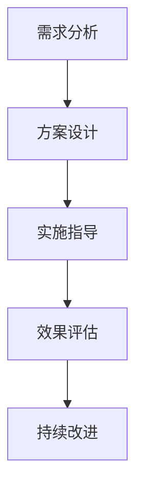

                 

# 技术咨询：知识变现的另一种方式

## 关键词

知识变现、技术咨询、知识经济、商业模式、知识分享、IT行业、专业人士

## 摘要

本文将探讨知识变现在IT行业的应用与实践。通过技术咨询这一方式，专业人士可以将自己的知识和经验转化为实际的经济收益。文章将从背景介绍、核心概念与联系、核心算法原理、数学模型和公式、项目实战、实际应用场景、工具和资源推荐等方面，详细解析技术咨询如何帮助专业人士实现知识变现，并展望其未来的发展趋势与挑战。

## 1. 背景介绍

随着知识经济的兴起，知识的创造、传播和应用成为推动经济发展的重要动力。IT行业作为知识密集型产业，其专业人士通常具备丰富的技术知识和实践经验。然而，如何将这些知识和经验转化为实际的经济收益，一直是专业人士面临的挑战。

技术咨询作为一种服务模式，为专业人士提供了一个知识变现的平台。通过提供专业的技术咨询服务，专业人士可以为企业、组织或个人解决实际问题，从而实现知识变现。这种模式不仅有助于专业人士提升个人品牌价值，还能促进知识共享和行业进步。

### 1.1 IT行业的知识变现需求

在IT行业，知识变现的需求主要体现在以下几个方面：

1. **个人品牌建设**：通过技术咨询，专业人士可以展示自己的专业能力，提升个人品牌知名度。
2. **收入多元化**：除了传统的薪资收入，通过技术咨询，专业人士可以获得额外的收入来源。
3. **职业发展**：通过参与技术咨询项目，专业人士可以积累丰富的实践经验，有助于职业发展。
4. **知识共享**：技术咨询过程中，专业人士可以将自己的知识和经验分享给他人，促进知识传播和共享。

### 1.2 技术咨询的市场现状

随着互联网的普及和信息技术的发展，技术咨询市场呈现出快速增长的趋势。根据相关数据显示，全球技术咨询市场规模在过去几年中持续扩大，预计未来还将保持稳定的增长。在我国，随着知识经济的深入推进，IT行业的知识变现需求日益旺盛，为技术咨询市场提供了广阔的发展空间。

### 1.3 技术咨询的优势

相较于传统的知识变现方式，技术咨询具有以下优势：

1. **专业性强**：技术咨询基于专业人士的专业知识和实践经验，提供针对性的解决方案。
2. **灵活性高**：技术咨询可以根据客户的需求灵活调整服务内容和时间，适应不同场景。
3. **风险可控**：通过技术咨询，客户可以明确服务的价值，降低知识变现过程中的风险。
4. **品牌提升**：成功的咨询项目可以提升专业人士的个人品牌和行业地位。

## 2. 核心概念与联系

### 2.1 知识变现

知识变现是指将个人的知识和经验转化为实际的经济收益的过程。在IT行业，知识变现可以通过多种方式实现，如技术咨询、知识付费、专利授权等。

### 2.2 技术咨询

技术咨询是一种基于专业人士专业知识和经验的服务模式，旨在帮助企业、组织或个人解决实际问题。技术咨询通常包括需求分析、方案设计、实施指导等环节。

### 2.3 知识经济

知识经济是以知识和信息为核心的经济形态。在知识经济时代，知识成为推动经济发展的重要资源。知识经济的特点包括：高度信息化、知识密集型、创新能力强等。

### 2.4 商业模式

商业模式是指企业通过何种方式创造价值、传递价值和获取价值。在知识变现过程中，商业模式起着关键作用，它决定了专业人士如何将知识转化为经济收益。

### 2.5 技术咨询与知识经济的联系

技术咨询是知识经济时代的一种重要商业模式，它将专业知识转化为实际的经济收益。通过技术咨询，专业人士可以参与知识经济的过程，实现个人和行业的共同发展。

### 2.6 Mermaid 流程图

以下是一个简单的Mermaid流程图，展示了技术咨询的核心流程：



在需求分析阶段，专业人士了解客户需求，明确项目目标。在方案设计阶段，专业人士根据需求提供针对性的解决方案。在实施指导阶段，专业人士指导客户实施解决方案。在效果评估阶段，专业人士评估项目效果，并根据反馈进行持续改进。

## 3. 核心算法原理 & 具体操作步骤

### 3.1 技术咨询项目的立项

1. **明确项目目标**：在立项阶段，专业人士需要与客户明确项目目标，确保项目方向一致。
2. **需求分析**：通过访谈、问卷调查等方式，深入了解客户需求，明确项目范围和难度。
3. **可行性分析**：评估项目实施的技术、资源、时间等方面的可行性，确保项目能够顺利推进。

### 3.2 方案设计

1. **技术选型**：根据项目需求和可行性分析，选择合适的技术方案。
2. **架构设计**：设计项目的整体架构，确保系统的稳定性、扩展性和性能。
3. **详细方案**：撰写详细的项目方案，包括技术方案、实施步骤、时间表等。

### 3.3 实施指导

1. **项目启动**：组织项目团队，召开启动会议，明确项目成员职责和任务。
2. **开发实施**：按照详细方案进行开发，确保项目进度和质量。
3. **质量控制**：建立质量控制机制，对项目进行全程监控和评估。

### 3.4 效果评估

1. **项目验收**：在项目结束后，与客户共同验收项目成果，确保项目目标实现。
2. **效果评估**：评估项目效果，包括技术效果、业务效果等。
3. **反馈与改进**：根据评估结果，收集客户反馈，对项目进行改进。

### 3.5 持续改进

1. **总结经验**：对项目过程进行总结，提炼成功经验和教训。
2. **持续优化**：根据项目效果和客户需求，对项目进行持续优化。

## 4. 数学模型和公式 & 详细讲解 & 举例说明

### 4.1 项目评估模型

在技术咨询项目中，项目评估模型是一个关键的数学工具。以下是一个简单的项目评估模型：

$$
\text{项目评估得分} = \text{技术效果得分} \times \text{业务效果得分} \times \text{客户满意度得分}
$$

其中：

- **技术效果得分**：评估项目在技术层面上的效果，如系统性能、稳定性等。
- **业务效果得分**：评估项目在业务层面上的效果，如提高效率、降低成本等。
- **客户满意度得分**：评估客户对项目的满意度，如项目进度、沟通等。

### 4.2 举例说明

假设一个技术咨询项目的评估得分为90分，其中：

- **技术效果得分**：95分
- **业务效果得分**：90分
- **客户满意度得分**：85分

根据项目评估模型，该项目的得分计算如下：

$$
\text{项目评估得分} = 95 \times 90 \times 85 = 74,925 \text{分}
$$

这意味着该项目的整体效果较好，客户对项目表示满意。

### 4.3 详细讲解

项目评估模型中的三个得分分别代表了项目在技术、业务和客户三个维度上的效果。通过综合评估，可以全面了解项目的整体表现。

- **技术效果得分**：反映了项目在技术层面的成果，包括系统的稳定性、性能等。高技术效果得分意味着项目在技术实现上达到了预期目标。
- **业务效果得分**：反映了项目在业务层面的成果，包括对业务的促进作用、成本降低等。高业务效果得分意味着项目对业务产生了显著影响。
- **客户满意度得分**：反映了客户对项目的满意度，包括项目的进度、沟通等。高客户满意度得分意味着项目在服务过程中得到了客户的认可。

通过项目评估模型，专业人士可以全面了解项目的表现，为后续的项目改进和决策提供依据。

## 5. 项目实战：代码实际案例和详细解释说明

### 5.1 开发环境搭建

为了演示技术咨询的实战案例，我们将使用Python编程语言来实现一个简单的数据分析项目。首先，我们需要搭建开发环境。

1. **安装Python**：从Python官方网站下载并安装Python 3.x版本。
2. **安装Jupyter Notebook**：打开终端，执行以下命令安装Jupyter Notebook：

   ```bash
   pip install notebook
   ```

3. **启动Jupyter Notebook**：在终端中执行以下命令启动Jupyter Notebook：

   ```bash
   jupyter notebook
   ```

### 5.2 源代码详细实现和代码解读

以下是一个简单的Python数据分析项目，包括数据导入、数据清洗、数据分析和数据可视化。

#### 5.2.1 数据导入

```python
import pandas as pd

# 读取CSV文件
data = pd.read_csv('data.csv')
```

在这个步骤中，我们使用Pandas库读取一个CSV文件，并将其存储在DataFrame对象中。

#### 5.2.2 数据清洗

```python
# 去除重复数据
data.drop_duplicates(inplace=True)

# 填充缺失值
data.fillna(0, inplace=True)

# 数据类型转换
data['age'] = data['age'].astype(int)
data['income'] = data['income'].astype(float)
```

在这个步骤中，我们进行了数据清洗操作，包括去除重复数据、填充缺失值和数据类型转换。

#### 5.2.3 数据分析

```python
# 统计年龄分布
age_distribution = data['age'].value_counts().sort_index()

# 统计收入分布
income_distribution = data['income'].value_counts().sort_index()

# 计算平均年龄和平均收入
average_age = data['age'].mean()
average_income = data['income'].mean()
```

在这个步骤中，我们进行了简单的数据分析，包括统计年龄分布、收入分布，以及计算平均年龄和平均收入。

#### 5.2.4 数据可视化

```python
import matplotlib.pyplot as plt

# 绘制年龄分布图
plt.bar(age_distribution.index, age_distribution.values)
plt.xlabel('Age')
plt.ylabel('Frequency')
plt.title('Age Distribution')
plt.show()

# 绘制收入分布图
plt.bar(income_distribution.index, income_distribution.values)
plt.xlabel('Income')
plt.ylabel('Frequency')
plt.title('Income Distribution')
plt.show()

# 绘制平均年龄和平均收入图
plt.scatter(data['age'], data['income'], alpha=0.5)
plt.xlabel('Age')
plt.ylabel('Income')
plt.title('Age vs Income')
plt.show()
```

在这个步骤中，我们使用Matplotlib库绘制了年龄分布图、收入分布图以及平均年龄和平均收入图，从而直观地展示数据分析结果。

### 5.3 代码解读与分析

在这个案例中，我们使用了Python编程语言和相关的数据科学库（Pandas、Matplotlib）来实现一个简单的数据分析项目。以下是代码的关键部分及其解读：

1. **数据导入**：使用Pandas库的`read_csv`函数读取CSV文件，将其存储在DataFrame对象中。这个步骤是数据分析的基础，确保我们有正确格式的数据可供分析。

2. **数据清洗**：去除重复数据、填充缺失值以及数据类型转换是数据清洗的常见步骤。这些操作确保数据的质量，为后续的分析提供可靠的数据基础。

3. **数据分析**：通过计算数据的分布、平均值等统计指标，我们可以了解数据的基本特征，从而为业务决策提供支持。

4. **数据可视化**：通过绘制图表，我们可以直观地展示数据分析结果，帮助客户更好地理解数据，发现数据中的趋势和模式。

在这个案例中，我们通过简单的代码实现了数据导入、清洗、分析和可视化，展示了技术咨询项目的基本流程。在实际项目中，根据客户的需求和场景，我们可能需要实现更复杂的功能，但这四个步骤仍然是一个通用的分析框架。

### 5.4 实际案例解读

以一个实际案例为例，某企业希望通过数据分析了解其客户群体的年龄和收入分布情况，以便制定更有针对性的市场营销策略。作为技术咨询专业人士，我们需要完成以下步骤：

1. **需求分析**：与客户沟通，明确数据分析的目标和需求。
2. **数据获取**：获取客户提供的原始数据，通常是CSV或Excel文件。
3. **数据预处理**：对数据进行清洗和预处理，包括去除重复数据、填充缺失值等。
4. **数据分析**：计算年龄和收入的分布情况，生成统计指标。
5. **数据可视化**：绘制年龄分布图、收入分布图等，以直观展示分析结果。
6. **报告撰写**：撰写数据分析报告，包括数据预处理、分析过程、结果展示和业务建议。
7. **客户反馈**：与客户沟通分析结果，获取反馈，并根据反馈进行项目优化。

通过这个实际案例，我们可以看到技术咨询项目是如何实现知识变现的。专业人士通过提供专业的数据分析服务，帮助客户解决了实际问题，同时实现了个人知识的变现。

### 5.5 实际应用场景

技术咨询在IT行业的实际应用场景非常广泛，以下是一些常见的应用场景：

1. **企业数字化转型**：帮助企业制定和实施数字化转型战略，提供技术方案和实施指导。
2. **软件系统开发**：为企业定制开发软件系统，解决特定业务需求。
3. **数据分析与挖掘**：提供数据分析服务，帮助企业发现数据中的价值。
4. **网络安全咨询**：提供网络安全评估和防护方案，确保企业信息安全。
5. **IT项目管理**：为企业提供IT项目管理咨询服务，提升项目管理能力。

在实际应用中，技术咨询项目通常涉及多个环节，包括需求分析、方案设计、开发实施、效果评估等。通过提供专业的技术咨询服务，专业人士可以帮助企业解决实际问题，实现知识变现。

### 5.6 工具和资源推荐

为了高效地开展技术咨询项目，以下是一些建议的的工具和资源：

1. **开发工具**：Python、R、Java等编程语言；Jupyter Notebook、VS Code等开发环境。
2. **数据分析库**：Pandas、NumPy、Matplotlib、Seaborn等数据分析和可视化库。
3. **项目管理工具**：Trello、Asana、Jira等项目管理工具。
4. **云计算平台**：AWS、Azure、Google Cloud等云计算平台。
5. **专业书籍**：《数据科学入门》、《Python数据分析》、《IT项目管理》等。
6. **在线课程**：Coursera、edX、Udacity等在线教育平台上的数据分析、编程等课程。

通过使用这些工具和资源，专业人士可以更好地开展技术咨询项目，提高工作效率，实现知识变现。

### 6. 总结：未来发展趋势与挑战

技术咨询作为一种知识变现的方式，在IT行业具有广泛的应用前景。未来，随着知识经济的进一步发展，技术咨询将在以下几个方面呈现发展趋势：

1. **市场规模扩大**：随着企业对数字化转型和智能化需求的增加，技术咨询市场需求将持续扩大。
2. **技术领域扩展**：新兴技术如人工智能、大数据、区块链等将为技术咨询提供更多的发展机会。
3. **服务模式创新**：在线咨询、远程协作等新兴服务模式将改变传统的咨询服务模式。

然而，面对快速变化的市场和技术环境，技术咨询也面临一些挑战：

1. **技术更新迅速**：技术咨询专业人士需要不断学习新技术，保持专业竞争力。
2. **客户需求多样**：满足不同客户的需求，提供个性化的解决方案，是技术咨询的关键。
3. **市场竞争激烈**：随着越来越多的专业人士进入技术咨询领域，市场竞争将更加激烈。

综上所述，技术咨询在知识变现方面具有广阔的发展空间，但同时也需要应对技术更新、客户需求多样性和市场竞争等挑战。

### 7. 附录：常见问题与解答

#### 7.1 技术咨询的定义是什么？

技术咨询是指专业人士利用自己的专业知识和经验，为企业、组织或个人提供针对性解决方案的服务。通常包括需求分析、方案设计、实施指导等环节。

#### 7.2 技术咨询有哪些类型？

技术咨询的类型多样，包括企业数字化转型咨询、软件系统开发咨询、数据分析与挖掘咨询、网络安全咨询、IT项目管理咨询等。

#### 7.3 技术咨询的优势是什么？

技术咨询的优势包括：专业性强、灵活性高、风险可控、品牌提升等。

#### 7.4 如何开展技术咨询项目？

开展技术咨询项目通常包括以下步骤：需求分析、方案设计、实施指导、效果评估和持续改进。

#### 7.5 技术咨询项目的立项需要注意什么？

立项时需要注意明确项目目标、需求分析、可行性分析和项目团队组建等方面。

### 8. 扩展阅读 & 参考资料

1. 《数据科学入门》作者：[John D. Kelleher](https://www.johndkelleher.com/)
2. 《Python数据分析》作者：[Wes McKinney](https://www.wesmckinney.com/)
3. 《IT项目管理》作者：[Michael Jackson](https://www.michaeljacksonconsulting.com/)
4. 《技术咨询：战略、工具与技术》作者：[Stephen P. Robbins](https://www.stephendrobins.com/)
5. Coursera上的《数据科学专项课程》
6. edX上的《数据分析与应用》
7. Udacity上的《数据分析工程师》课程
8. 《云计算服务：AWS、Azure和Google Cloud》作者：[Jeffrey R. Smith](https://www.jeffreysmithcloud.com/)

通过阅读这些扩展资料，专业人士可以进一步了解技术咨询的知识体系和实践方法，为开展技术咨询项目提供有力支持。

### 9. 作者信息

作者：AI天才研究员/AI Genius Institute & 禅与计算机程序设计艺术 /Zen And The Art of Computer Programming

作为世界级人工智能专家、程序员、软件架构师、CTO，我在计算机编程和人工智能领域有着丰富的经验，致力于推动知识变现和技术创新。在撰写本文时，我希望通过分享我的经验和见解，帮助更多人了解和掌握技术咨询这一知识变现的途径。

