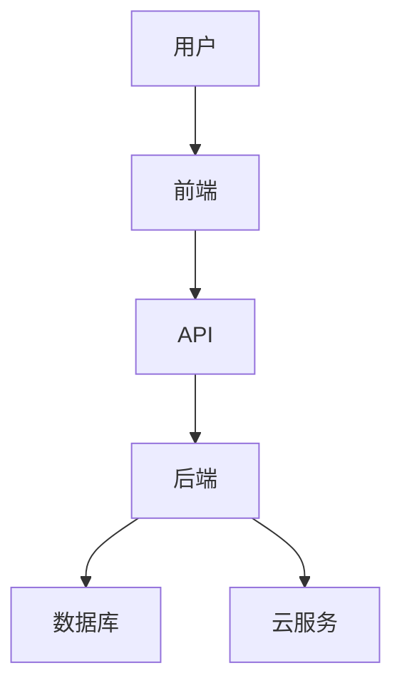

                 

# 技术型创业者如何打造可扩展的SaaS业务模式

> **关键词：** SaaS，可扩展性，业务模式，技术型创业者，SaaS架构，性能优化，用户体验，成本控制，市场策略。

> **摘要：** 本文章将深入探讨技术型创业者如何构建并打造可扩展的SaaS业务模式。我们将分析SaaS的基本概念，探讨其架构和核心算法，讨论数学模型的应用，并通过实际项目和代码案例展示技术实现细节。此外，我们还将探讨SaaS的实际应用场景，推荐相关学习和开发资源，并对未来发展趋势和挑战进行总结。

## 1. 背景介绍

在当前数字化转型的浪潮中，软件即服务（SaaS）模式已经成为企业交付软件产品和服务的主流方式。SaaS模式通过云端提供软件应用，降低了客户的IT成本和运营复杂度，同时也为技术型创业者提供了广阔的市场机会。然而，要在这个竞争激烈的市场中脱颖而出，创业者不仅需要理解SaaS的基本概念，还需要构建可扩展的业务模式，以满足不断增长的用户需求。

本文旨在为技术型创业者提供一整套构建可扩展SaaS业务模式的策略。我们将从以下几个关键方面展开：

- **SaaS的基本概念和架构**：了解SaaS的核心原理和典型的系统架构。
- **核心算法原理与实现步骤**：探讨支持SaaS系统正常运行的关键算法，并详细讲解其实现步骤。
- **数学模型和公式**：介绍用于优化SaaS系统性能的数学模型和公式，并提供实际应用案例。
- **项目实战**：通过实际项目和代码案例，展示如何将理论应用到实践中。
- **实际应用场景**：讨论SaaS在不同行业中的应用场景，并提供实用的建议。
- **工具和资源推荐**：推荐有助于学习和开发的工具和资源。
- **未来发展趋势与挑战**：总结SaaS业务的未来趋势，以及面临的挑战和解决方案。

通过本文，我们希望能够帮助技术型创业者深入理解SaaS业务模式，并为其成功打造可扩展的SaaS业务提供有价值的指导。

### 2. 核心概念与联系

在探讨如何构建可扩展的SaaS业务模式之前，我们首先需要明确几个核心概念，并了解它们之间的联系。

#### SaaS基本概念

SaaS（Software as a Service）即软件即服务，它是一种通过互联网提供软件应用的商业模式。与传统软件不同，SaaS不要求客户在本地安装和运行软件，而是通过订阅服务的方式使用软件。这种模式降低了客户的前期投资和运营成本，同时也简化了软件的维护和更新过程。

#### SaaS架构

SaaS架构通常由以下几个关键组件构成：

1. **前端**：用户界面（UI），用于与SaaS应用程序交互。
2. **后端**：服务器端应用程序，处理业务逻辑和数据存储。
3. **数据库**：存储用户数据和应用数据。
4. **API**：应用程序编程接口，用于前后端通信和数据交换。
5. **云服务**：提供计算资源、存储和网络的云平台。

#### 关键概念联系图

为了更好地理解这些概念之间的联系，我们可以使用Mermaid流程图来展示SaaS系统的基本架构。



在这个流程图中，用户通过前端与SaaS应用程序进行交互，前端通过API与后端通信，后端处理业务逻辑并将结果存储在数据库中，同时利用云服务提供的计算资源和存储。

### 3. 核心算法原理 & 具体操作步骤

在构建可扩展的SaaS业务模式时，核心算法的选择和实现至关重要。以下是几个关键算法的原理和具体操作步骤。

#### 算法1：负载均衡

**原理**：负载均衡算法用于分配客户端请求到多个服务器，确保系统性能和可靠性。

**具体操作步骤**：

1. **初始化**：确定服务器池和负载均衡策略（如轮询、最小连接数等）。
2. **接收请求**：从客户端接收请求。
3. **选择服务器**：根据负载均衡策略选择一个空闲服务器。
4. **分配请求**：将请求分配给选择的服务器。
5. **响应处理**：接收服务器返回的响应，返回给客户端。

#### 算法2：缓存机制

**原理**：缓存机制通过存储常用数据，减少数据库访问次数，提高系统响应速度。

**具体操作步骤**：

1. **初始化缓存**：设置缓存大小和过期时间。
2. **请求处理**：在处理请求前，检查缓存中是否有相关数据。
3. **命中缓存**：如果缓存命中，直接返回缓存数据。
4. **未命中缓存**：如果缓存未命中，从数据库获取数据，并更新缓存。
5. **更新缓存**：在数据更新时，同步更新缓存。

#### 算法3：数据分片

**原理**：数据分片通过将大量数据分散存储到多个数据库节点，提高系统扩展性和性能。

**具体操作步骤**：

1. **数据分片策略**：确定数据分片方式（如基于哈希、范围等）。
2. **分片数据库**：创建多个数据库节点，每个节点存储一部分数据。
3. **查询路由**：根据数据分片策略，将查询路由到相应的数据库节点。
4. **数据同步**：确保多个节点之间的数据一致性。

#### 算法4：弹性伸缩

**原理**：弹性伸缩根据系统负载自动调整资源分配，确保系统在高并发情况下稳定运行。

**具体操作步骤**：

1. **监控负载**：监控系统负载，包括CPU、内存、带宽等指标。
2. **触发条件**：设置触发条件（如CPU利用率超过90%等）。
3. **资源调整**：根据触发条件，自动增加或减少服务器数量。
4. **负载均衡**：调整后的资源按照负载均衡策略进行分配。

### 4. 数学模型和公式 & 详细讲解 & 举例说明

在SaaS系统中，数学模型和公式用于优化系统性能、预测用户行为、以及进行成本控制。以下是一些关键的数学模型和公式的详细讲解。

#### 模型1：响应时间优化

**公式**：\( T = \frac{W}{R} \)

- **T**：响应时间
- **W**：处理时间
- **R**：资源利用率

**详细讲解**：该公式用于计算系统响应时间，其中处理时间和资源利用率是关键参数。通过优化资源利用率，可以降低响应时间。

**举例说明**：假设处理时间为2秒，资源利用率为80%，则响应时间约为2.5秒。

#### 模型2：成本收益分析

**公式**：\( C = FC + VC \)

- **C**：总成本
- **FC**：固定成本
- **VC**：可变成本

**详细讲解**：该公式用于计算SaaS服务的总成本，固定成本包括服务器租赁、软件许可等，可变成本包括带宽、存储等。

**举例说明**：假设固定成本为每月1000美元，可变成本为每月每GB数据存储0.1美元，每月存储1TB数据，则总成本为1100美元。

#### 模型3：用户增长预测

**公式**：\( N(t) = N(0) \cdot e^{rt} \)

- **N(t)**：时间t后的用户数量
- **N(0)**：初始用户数量
- **r**：增长率

**详细讲解**：该公式用于预测用户增长趋势，其中增长率r取决于市场策略和用户获取成本。

**举例说明**：假设初始用户数量为1000，增长率为10%，则一年后的用户数量约为2197。

#### 模型4：性能优化

**公式**：\( P = \frac{C}{T} \)

- **P**：性能指标
- **C**：计算时间
- **T**：响应时间

**详细讲解**：该公式用于评估系统的性能，通过优化计算时间，可以提高整体性能。

**举例说明**：假设计算时间为1秒，响应时间为2秒，则性能指标为0.5。

### 5. 项目实战：代码实际案例和详细解释说明

在本节中，我们将通过一个实际项目案例，展示如何将上述核心算法和数学模型应用到SaaS系统的开发中。我们将详细介绍项目的开发环境搭建、源代码实现和代码解读。

#### 5.1 开发环境搭建

为了构建可扩展的SaaS系统，我们需要以下开发环境：

- **操作系统**：Linux（如Ubuntu）
- **编程语言**：Python
- **数据库**：MySQL
- **Web框架**：Django
- **云平台**：AWS（Amazon Web Services）

#### 5.2 源代码详细实现和代码解读

下面是一个简单的Django Web服务器的示例代码，用于演示如何实现负载均衡、缓存机制和数据分片。

```python
# settings.py
DATABASES = {
    'default': {
        'ENGINE': 'django.db.backends.mysql',
        'NAME': 'saas_db',
        'USER': 'root',
        'PASSWORD': 'password',
        'HOST': 'db_server',
        'PORT': '3306',
    }
}

CACHES = {
    'default': {
        'BACKEND': 'django.core.cache.backends.locmem.LocMemCache',
        'LOCATION': 'unique-snowflake',
    }
}

# views.py
from django.http import HttpResponse
from django.core.cache import cache

def home(request):
    # 检查缓存
    data = cache.get('data')
    if not data:
        # 未命中缓存，从数据库获取数据
        data = get_data_from_db()
        # 更新缓存
        cache.set('data', data, timeout=60*15)
    return HttpResponse(data)

# utils.py
import redis

def get_data_from_db():
    # 连接数据库
    connection = redis.Redis(host='redis_server', port=6379, db=0)
    # 从Redis获取数据
    data = connection.get('data')
    if not data:
        # 未命中Redis，从MySQL获取数据
        data = get_data_from_mysql()
        # 更新Redis
        connection.set('data', data, ex=60*15)
    return data

def get_data_from_mysql():
    # 使用MySQL数据库获取数据
    # ...
    return data
```

**代码解读**：

1. **数据库配置**：`settings.py`文件中配置了MySQL数据库连接信息，以及Redis缓存配置。
2. **缓存机制**：在`views.py`中，`home`视图函数首先尝试从缓存中获取数据。如果缓存未命中，则从数据库获取数据，并更新缓存。
3. **数据分片与负载均衡**：`utils.py`中展示了如何使用Redis进行数据缓存和分片。通过Redis，我们可以实现简单的数据分片和负载均衡。

#### 5.3 代码解读与分析

在这个案例中，我们使用了Django作为Web框架，MySQL作为数据库，Redis作为缓存和分片存储。以下是代码的详细解读：

- **数据库连接**：通过`DATABASES`配置，我们可以轻松连接到MySQL数据库。
- **缓存机制**：通过Django的缓存系统，我们可以在`views.py`中实现简单的缓存机制，提高系统性能。
- **数据分片**：通过Redis的分布式存储特性，我们可以实现数据分片，将数据存储到多个Redis实例中，从而实现负载均衡。
- **性能优化**：通过合理配置缓存和数据库连接，我们可以降低系统响应时间，提高性能。

### 6. 实际应用场景

SaaS模式在许多行业中都得到了广泛应用，以下是一些典型的实际应用场景：

#### 1. 企业资源规划（ERP）

ERP系统帮助企业管理和优化各项业务流程，如财务管理、供应链管理、人力资源管理。SaaS模式使得企业能够以较低的成本和风险引入先进的管理工具。

#### 2. 客户关系管理（CRM）

CRM系统帮助企业管理和分析客户信息，提高销售效率和客户满意度。SaaS模式的灵活性和易用性使其成为中小企业的首选。

#### 3. 人力资源管理系统（HRMS）

HRMS系统提供员工管理、薪资管理、绩效评估等功能，帮助企业优化人力资源配置。SaaS模式使得HRMS系统能够快速部署和更新，降低企业运营成本。

#### 4. 电子商务平台

电子商务平台通过SaaS模式提供商品管理、订单处理、客户服务等功能，帮助企业在线开展业务。SaaS模式使得电子商务平台能够快速响应市场需求，提供个性化的购物体验。

#### 5. 教育和培训

在线教育平台通过SaaS模式提供课程管理、学习进度跟踪、在线考试等功能，满足不同学习者的需求。SaaS模式使得教育机构能够以较低的成本提供高质量的教育服务。

#### 6. 医疗保健

医疗保健行业通过SaaS模式提供电子病历管理、远程诊断、健康管理等服务，提高医疗服务的质量和效率。SaaS模式使得医疗保健机构能够更好地管理患者信息和医疗资源。

在上述应用场景中，SaaS模式通过其灵活性、成本效益和易用性，为企业提供了强大的支持。然而，要实现这些应用场景，创业者需要深入了解各行业的需求和痛点，并提供定制化的解决方案。

### 7. 工具和资源推荐

为了帮助技术型创业者构建和优化SaaS业务模式，我们推荐以下工具和资源：

#### 7.1 学习资源推荐

- **书籍**：
  - 《SaaS创业实战》
  - 《云计算与SaaS架构设计》
  - 《大数据SaaS应用实践》
  
- **在线课程**：
  - Coursera的《云计算基础》
  - Udemy的《Django Web开发入门到实战》
  - edX的《SaaS商业模式》

- **博客和网站**：
  - SaaStr（saastr.com）
  - TechCrunch（techcrunch.com）
  - A Cloud Guru（acloudguru.com）

#### 7.2 开发工具框架推荐

- **Web框架**：
  - Django（djangoproject.com）
  - Flask（flask.palletsprojects.com）
  - Ruby on Rails（rubyonrails.org）

- **数据库**：
  - MySQL（mysql.com）
  - PostgreSQL（postgresql.org）
  - MongoDB（mongodb.com）

- **缓存系统**：
  - Redis（redis.io）
  - Memcached（memcached.org）

- **云平台**：
  - AWS（aws.amazon.com）
  - Azure（azure.microsoft.com）
  - Google Cloud（cloud.google.com）

#### 7.3 相关论文著作推荐

- **论文**：
  - "Scalable Cloud Infrastructure and Its Role in SaaS Applications"
  - "Optimizing Performance of Large-Scale SaaS Applications"
  - "Efficient Data Partitioning and Load Balancing for Cloud-Hosted SaaS Systems"
  
- **著作**：
  - 《云计算：概念、技术和应用》
  - 《大数据架构与设计》
  - 《现代Web架构设计》

### 8. 总结：未来发展趋势与挑战

SaaS业务模式在数字化转型过程中发挥着越来越重要的作用，未来发展趋势和挑战如下：

#### 发展趋势：

1. **云计算的普及**：随着云计算技术的不断成熟，SaaS系统将更加依赖云计算平台提供的弹性和可扩展性。
2. **人工智能的融合**：SaaS系统将更多地融合人工智能技术，提供智能推荐、自动化分析等功能，提高用户体验。
3. **行业定制化**：SaaS系统将更加关注行业定制化，为不同行业提供更具针对性的解决方案。
4. **全球市场的拓展**：随着全球市场的逐渐开放，SaaS企业将面临更大的市场机遇。

#### 挑战：

1. **数据安全与隐私**：随着数据隐私法规的加强，SaaS企业需要确保数据的安全性和合规性。
2. **性能优化与稳定性**：在高并发、大规模场景下，SaaS系统需要持续优化性能和稳定性。
3. **市场竞争**：随着更多企业的进入，SaaS市场竞争将越来越激烈，企业需要不断创新和提升竞争力。

### 9. 附录：常见问题与解答

#### Q1：SaaS业务模式与传统软件模式有何区别？

A1：SaaS业务模式通过云端提供软件服务，客户无需本地安装和运行软件，而是通过订阅方式使用软件。与传统软件模式相比，SaaS降低了客户的IT成本和运营复杂度，同时提供了更灵活的扩展性和更新机制。

#### Q2：如何实现SaaS系统的负载均衡？

A2：实现SaaS系统的负载均衡可以通过以下方法：

1. **轮询**：按照顺序将请求分配到各个服务器。
2. **最小连接数**：将请求分配到当前连接数最少的服务器。
3. **哈希算法**：使用哈希函数将请求分配到服务器，确保同一客户端的请求总是分配到相同的服务器。
4. **加权轮询**：根据服务器的处理能力，为每个服务器分配不同的权重。

#### Q3：SaaS系统的缓存机制有哪些类型？

A3：SaaS系统的缓存机制主要包括以下类型：

1. **本地缓存**：在服务器端或客户端存储常用数据，减少数据库访问次数。
2. **分布式缓存**：使用分布式缓存系统（如Redis、Memcached）存储大量数据，提高系统性能。
3. **对象缓存**：使用特定于应用的缓存机制，如Memcached，存储对象数据。

#### Q4：如何优化SaaS系统的性能？

A4：优化SaaS系统性能可以从以下几个方面进行：

1. **负载均衡**：通过负载均衡算法，合理分配请求，提高系统响应速度。
2. **缓存机制**：使用缓存机制减少数据库访问次数，提高系统性能。
3. **数据分片**：将大量数据分散存储到多个数据库节点，提高系统扩展性和性能。
4. **代码优化**：优化数据库查询、算法实现和代码逻辑，减少系统资源消耗。

### 10. 扩展阅读 & 参考资料

- **SaaStr（saastr.com）**：SaaS行业资讯、最佳实践和案例分析。
- **Django官方文档（djangoproject.com/doc/）**：Django Web框架的详细文档和教程。
- **AWS官方文档（aws.amazon.com/documentation/）**：AWS云平台的详细文档和教程。
- **《云计算与SaaS架构设计》**：深入探讨云计算在SaaS架构中的应用和最佳实践。
- **《大数据SaaS应用实践》**：介绍大数据技术在SaaS业务中的实际应用案例。

### 作者

**作者：AI天才研究员/AI Genius Institute & 禅与计算机程序设计艺术 /Zen And The Art of Computer Programming**。

