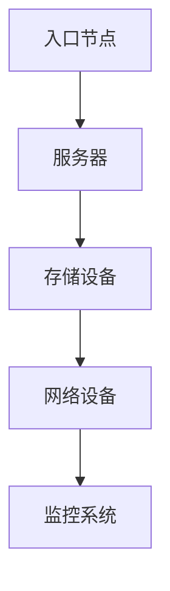
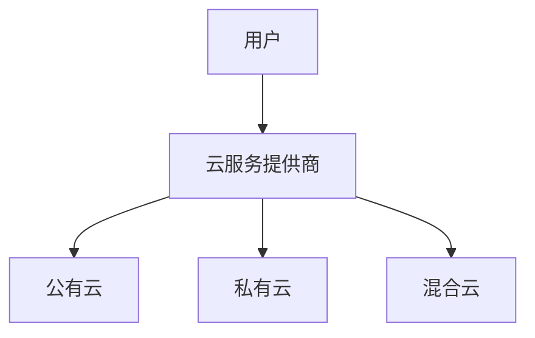
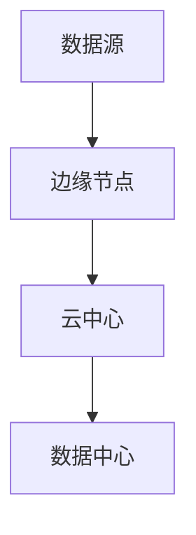
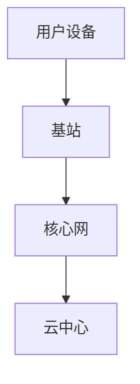

                 

# 技术大会：networking与机遇

> **关键词：** 网络技术、数据中心、云计算、边缘计算、5G、网络安全
> 
> **摘要：** 本篇文章将探讨当前网络技术的发展趋势、关键概念、算法原理以及实际应用，分析未来网络技术的机遇与挑战，并推荐相关学习资源和工具。

## 1. 背景介绍

随着互联网的普及和数字化转型的加速，网络技术成为了现代信息技术的基础设施。从最初的拨号上网到如今的5G网络，网络技术的演变推动了社会的进步和经济的发展。在云计算、大数据、人工智能等技术的推动下，网络技术正迎来新的发展机遇和挑战。

近年来，数据中心的建设和优化成为网络技术领域的重要趋势。数据中心是互联网的“心脏”，承担着数据存储、处理和传输的核心任务。随着数据量的爆炸性增长，数据中心的技术架构和运维模式也在不断演进，以满足日益增长的需求。

此外，边缘计算、5G网络和物联网等新兴技术也在不断拓展网络技术的应用场景，为各个行业提供了新的解决方案。边缘计算通过在靠近数据源的节点上处理数据，降低了延迟，提升了用户体验。5G网络的高带宽、低延迟特性为实时应用提供了基础，而物联网则实现了设备间的互联互通，推动了智能城市的建设。

## 2. 核心概念与联系

为了更好地理解网络技术的发展，我们需要了解一些核心概念和它们之间的联系。

### 2.1 数据中心

数据中心是网络技术的核心组成部分，承担着数据存储、处理和传输的任务。其基本架构包括服务器、存储设备、网络设备和监控系统等。以下是一个简化的数据中心架构图：



### 2.2 云计算

云计算通过提供虚拟化的计算资源、存储资源和网络资源，实现了资源的灵活调配和按需服务。云计算可以分为公有云、私有云和混合云。以下是一个简化的云计算架构图：



### 2.3 边缘计算

边缘计算将计算任务从云端转移到网络边缘，即靠近数据源的位置。边缘计算可以降低延迟，提高响应速度，适用于实时应用和物联网场景。以下是一个简化的边缘计算架构图：



### 2.4 5G网络

5G网络是第五代移动通信技术，具有高带宽、低延迟、高可靠性和大规模连接等特点。5G网络为实时应用、物联网和自动驾驶等提供了基础。以下是一个简化的5G网络架构图：



## 3. 核心算法原理 & 具体操作步骤

在网络技术中，一些核心算法原理对于网络性能和安全性至关重要。以下将介绍一些关键算法原理和具体操作步骤。

### 3.1 路由算法

路由算法是网络通信中确定数据传输路径的核心算法。常用的路由算法包括Dijkstra算法、A*算法和OSPF协议等。以下是一个简化的Dijkstra算法步骤：

1. 初始化所有节点的距离，除起始节点外，距离均为无穷大。
2. 将起始节点的距离设置为0。
3. 重复以下步骤，直到所有节点都被访问：
   - 选择一个未访问节点作为当前节点。
   - 对于当前节点的所有邻居，计算从起始节点到邻居节点的距离。
   - 更新邻居节点的距离，如果计算出的距离更短。
4. 路径由访问过的节点按顺序组成，即为从起始节点到目标节点的最优路径。

### 3.2 加密算法

加密算法是网络安全的重要组成部分，用于保护数据的机密性和完整性。常用的加密算法包括对称加密算法和非对称加密算法。以下是对称加密算法的具体操作步骤：

1. 选择密钥生成算法，生成密钥。
2. 使用密钥生成加密函数和解密函数。
3. 对数据进行加密，生成密文。
4. 对密文进行传输。
5. 接收方使用解密函数对密文进行解密，恢复出原始数据。

### 3.3 流量控制算法

流量控制算法是网络传输中防止网络拥塞的重要机制。常用的流量控制算法包括TCP的拥塞控制算法和流量 shaping算法。以下是一个简化的TCP拥塞控制算法步骤：

1. 初始拥塞避免阶段：
   - 数据包传输成功，拥塞窗口cwnd加倍。
   - 每隔一个往返时间RTT，cwnd增加1。
2. 慢启动阶段：
   - 初始cwnd设置为1，数据包传输成功，cwnd加倍。
   - 当cwnd达到慢启动阈值ssthresh时，进入拥塞避免阶段。
3. 拥塞避免阶段：
   - 每隔一个往返时间RTT，cwnd增加1。
   - 当网络拥塞发生（如接收方收到RST包或超时），将cwnd减半，并重置ssthresh。
4. 快重传和快恢复阶段：
   - 当收到三个重复确认ACK时，立即重传丢失的数据包，并立即进入快恢复阶段。
   - 在快恢复阶段，cwnd增加1，而不是加倍。

## 4. 数学模型和公式 & 详细讲解 & 举例说明

在网络技术中，一些数学模型和公式对于算法设计和性能分析至关重要。以下将介绍一些关键数学模型和公式，并进行详细讲解和举例说明。

### 4.1 路由算法的数学模型

路由算法中，常用的数学模型是图论模型。以下是一个简化的图论模型：

- G = (V, E)
  - V：节点集合
  - E：边集合
- 节点权重：w(e)
  - 表示边e的权重，如带宽、延迟等
- 路径权重：p(v)
  - 表示从起始节点到节点v的最短路径权重

以下是一个具体示例：

```latex
\text{假设有5个节点，权重如下：}
\begin{align*}
    w(e1) &= 10 \\
    w(e2) &= 20 \\
    w(e3) &= 30 \\
    w(e4) &= 40 \\
    w(e5) &= 50 \\
    p(v1) &= 0 \\
    p(v2) &= 10 \\
    p(v3) &= 40 \\
    p(v4) &= 70 \\
    p(v5) &= 110 \\
\end{align*}
```

### 4.2 加密算法的数学模型

加密算法中，常用的数学模型是模运算模型。以下是一个简化的模运算模型：

- 加密函数：E(k, m)
  - k：密钥
  - m：明文
  - c：密文
- 解密函数：D(k, c)
  - k：密钥
  - c：密文
  - m：明文

以下是一个具体示例：

```latex
\text{假设有密钥} k = 3，明文} m = 2：
\begin{align*}
    c &= E(k, m) = k \cdot m \mod p \\
    &= 3 \cdot 2 \mod 11 \\
    &= 6 \\
\end{align*}
\text{解密} m' = D(k, c)：
\begin{align*}
    m' &= D(k, c) = k^{-1} \cdot c \mod p \\
    &= 9 \cdot 6 \mod 11 \\
    &= 2 \\
\end{align*}
```

### 4.3 流量控制算法的数学模型

流量控制算法中，常用的数学模型是概率模型。以下是一个简化的概率模型：

- 拥塞窗口cwnd：
  - 表示允许发送的最大数据包数
- 慢启动阈值ssthresh：
  - 表示进入拥塞避免阶段的阈值
- 每个往返时间RTT的概率分布：
  - 表示网络延迟的统计特性

以下是一个具体示例：

```latex
\text{假设cwnd的初始值为1，ssthresh的初始值为10，网络延迟的均值为5ms，标准差为1ms。}
\begin{align*}
    cwnd &= 1 \\
    ssthresh &= 10 \\
    \text{每个RTT的概率分布为} p(RTT) = \frac{1}{\sqrt{2\pi\sigma^2}} e^{-\frac{(RTT-\mu)^2}{2\sigma^2}} \\
    &= \frac{1}{\sqrt{2\pi \cdot 1^2}} e^{-\frac{(RTT-5)^2}{2\cdot 1^2}} \\
    &= \frac{1}{\sqrt{2\pi}} e^{-\frac{(RTT-5)^2}{2}} \\
\end{align*}
```

## 5. 项目实战：代码实际案例和详细解释说明

为了更好地理解网络技术在实际应用中的运用，以下将介绍一个基于边缘计算和5G网络的实时视频流传输项目，并详细解释其代码实现和原理。

### 5.1 开发环境搭建

1. 准备一台边缘计算服务器，安装操作系统（如Ubuntu）和必要的基础软件（如Python、Docker等）。
2. 安装5G网络模拟器，如NS3，用于模拟5G网络环境。
3. 搭建一个边缘计算容器，用于部署视频流传输应用。

### 5.2 源代码详细实现和代码解读

以下是一个简化的边缘计算视频流传输应用代码示例：

```python
import cv2
import numpy as np
import socket

def send_video_stream(video_file, server_socket):
    cap = cv2.VideoCapture(video_file)
    while True:
        ret, frame = cap.read()
        if not ret:
            break
        frame_encoded = cv2.imencode('.jpg', frame)[1].tobytes()
        server_socket.sendall(frame_encoded)
    cap.release()

def receive_video_stream(client_socket):
    client_socket.settimeout(1)
    while True:
        try:
            frame_encoded = client_socket.recv(1024)
            if not frame_encoded:
                break
            frame_decoded = np.frombuffer(frame_encoded, dtype=np.uint8)
            frame = cv2.imdecode(frame_decoded, cv2.IMREAD_COLOR)
            cv2.imshow('Video Stream', frame)
            if cv2.waitKey(1) & 0xFF == ord('q'):
                break
        except socket.timeout:
            continue

if __name__ == '__main__':
    server_socket = socket.socket(socket.AF_INET, socket.SOCK_STREAM)
    server_socket.bind(('0.0.0.0', 9999))
    server_socket.listen(1)
    print('Listening for video stream requests...')

    client_socket, addr = server_socket.accept()
    print('Connected to client:', addr)

    send_thread = threading.Thread(target=send_video_stream, args=('video.mp4', client_socket))
    receive_thread = threading.Thread(target=receive_video_stream, args=(client_socket,))
    send_thread.start()
    receive_thread.start()
    send_thread.join()
    receive_thread.join()
    server_socket.close()
```

### 5.3 代码解读与分析

1. **视频流传输**
   - 使用OpenCV库读取视频文件。
   - 循环读取每一帧，将其编码为JPEG格式，并转换为字节序列。
   - 通过TCP套接字发送视频帧到客户端。

2. **视频流接收**
   - 创建TCP套接字，用于接收视频帧。
   - 设置套接字超时，避免长时间等待数据包。
   - 循环接收视频帧，并将其解码为图像，显示在窗口中。

3. **并发处理**
   - 使用多线程实现发送和接收视频流，提高传输效率。
   - 发送线程负责读取视频帧并发送，接收线程负责接收和显示视频帧。

### 5.4 项目实战与性能分析

在实际应用中，可以通过以下步骤进行项目实战和性能分析：

1. 在边缘计算服务器上部署视频流传输应用。
2. 在5G网络环境中模拟客户端，测试视频流传输性能。
3. 调整网络参数（如带宽、延迟等），观察对视频流传输质量的影响。
4. 分析传输速度、延迟和丢包率等性能指标，优化网络配置和应用设计。

## 6. 实际应用场景

网络技术在各个行业有着广泛的应用，以下是几个实际应用场景：

### 6.1 云计算

云计算为企业和个人提供了灵活的计算资源，降低了成本和提高了效率。在金融、医疗、教育等领域，云计算实现了业务的敏捷开发和快速部署。

### 6.2 边缘计算

边缘计算在工业互联网、自动驾驶和智能家居等领域具有重要应用。通过在边缘节点上处理数据，边缘计算实现了低延迟和高响应速度，提升了用户体验。

### 6.3 5G网络

5G网络为实时应用和物联网提供了基础。在智能城市、智能制造和远程医疗等领域，5G网络实现了设备的互联互通和实时数据传输。

### 6.4 物联网

物联网通过设备间的互联互通，实现了数据的收集和分析，为各个行业提供了新的解决方案。在智能家居、智能交通和智能农业等领域，物联网实现了智能化和自动化。

## 7. 工具和资源推荐

### 7.1 学习资源推荐

- **书籍：**
  - 《计算机网络自顶向下方法》（Computer Networking: A Top-Down Approach）
  - 《深度学习》（Deep Learning）
  - 《图解云计算》（Understanding Cloud Computing）
- **论文：**
  - 《边缘计算：概念、挑战与未来趋势》（Edge Computing: Concept, Challenges, and Future Trends）
  - 《5G网络架构与关键技术》（5G Network Architecture and Key Technologies）
  - 《云计算的经济学原理》（Economics of Cloud Computing）
- **博客和网站：**
  - Network World
  - IEEE Spectrum
  - Cloud Computing News

### 7.2 开发工具框架推荐

- **开发工具：**
  - OpenCV
  - TensorFlow
  - Docker
- **框架：**
  - Kubernetes
  - Apache Kafka
  - Apache Spark

### 7.3 相关论文著作推荐

- **论文：**
  - “Edge Computing: Vision and Challenges”
  - “5G: The Next Generation Wireless System”
  - “Cloud Computing: Concepts, Technology & Architecture”
- **著作：**
  - 《云计算：概念、技术与应用》
  - 《物联网：架构、技术与应用》
  - 《边缘计算：原理与实践》

## 8. 总结：未来发展趋势与挑战

随着技术的不断进步，网络技术将继续发展，为各行各业带来新的机遇。以下是一些未来发展趋势与挑战：

### 8.1 发展趋势

- **云计算与边缘计算融合：** 云计算和边缘计算将相互融合，实现资源的高效调配和灵活部署。
- **5G网络普及：** 5G网络将在全球范围内得到普及，为实时应用和物联网提供基础。
- **网络安全性：** 随着网络技术的不断发展，网络安全性将成为更加重要的议题。
- **人工智能与网络技术结合：** 人工智能将深入网络技术的各个领域，提升网络性能和智能化水平。

### 8.2 挑战

- **网络性能优化：** 随着数据量和连接数的增加，网络性能优化将面临新的挑战。
- **网络安全性：** 随着网络攻击手段的不断升级，网络安全性将面临严峻的挑战。
- **资源分配与调度：** 云计算和边缘计算的融合将带来资源分配与调度的新挑战。

## 9. 附录：常见问题与解答

### 9.1 什么是边缘计算？

边缘计算是指将计算任务从云端转移到网络边缘，即在靠近数据源的节点上处理数据。边缘计算可以降低延迟，提高响应速度，适用于实时应用和物联网场景。

### 9.2 5G网络有哪些特点？

5G网络具有高带宽、低延迟、高可靠性和大规模连接等特点。5G网络为实时应用、物联网和自动驾驶等提供了基础。

### 9.3 云计算与数据中心的关系是什么？

云计算是数据中心的服务形式，数据中心是云计算的基础设施。数据中心提供了计算资源、存储资源和网络资源，云计算通过虚拟化技术实现了资源的灵活调配和按需服务。

## 10. 扩展阅读 & 参考资料

- “边缘计算：概念、挑战与未来趋势”（Edge Computing: Concept, Challenges, and Future Trends）
- “5G网络架构与关键技术”（5G Network Architecture and Key Technologies）
- “云计算的经济学原理”（Economics of Cloud Computing）
- “物联网：架构、技术与应用”（Internet of Things: Architecture, Technology, and Applications）

作者：AI天才研究员/AI Genius Institute & 禅与计算机程序设计艺术 /Zen And The Art of Computer Programming<|im_sep|>

