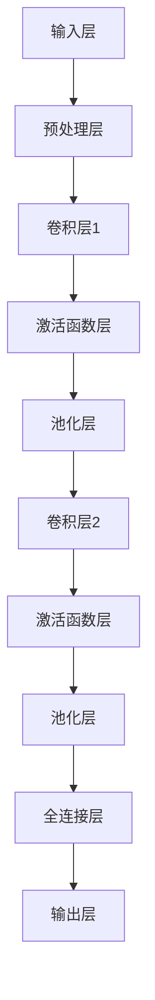

                 

### 背景介绍

随着大数据、云计算和人工智能技术的飞速发展，大模型技术逐渐成为了现代计算机科学领域中的热门话题。大模型（Large-scale Model），顾名思义，指的是具有海量参数、能够处理大规模数据集的机器学习模型。这类模型在自然语言处理、计算机视觉、语音识别等众多领域都展现出了强大的性能和广阔的应用前景。

近年来，大模型的发展不仅带来了学术研究的突破，还推动了各行各业的创新。在自然语言处理领域，大模型如GPT-3和BERT等，通过学习海量文本数据，实现了前所未有的文本生成、理解和翻译能力。在计算机视觉领域，大模型如ResNet和EfficientNet等，通过深度学习技术，使得计算机在图像分类、目标检测和图像生成等方面达到了人类专家的水平。

大模型技术的兴起，不仅推动了人工智能领域的发展，也为创业公司提供了新的机会和挑战。一方面，大模型技术为企业提供了强大的数据处理和分析能力，帮助企业解决复杂问题，提升业务效率；另一方面，大模型技术的开发和部署需要大量的资金、人才和技术积累，这对创业公司来说是一大挑战。

本文将深入探讨大模型技术对于创业的影响，分析大模型创业的优劣势，并探讨其未来发展趋势。首先，我们将介绍大模型的基本概念和原理，然后讨论大模型在创业中的应用场景，最后对大模型创业的挑战和未来发展方向进行展望。

### 核心概念与联系

#### 大模型基本概念

大模型，顾名思义，指的是具有海量参数、能够处理大规模数据集的机器学习模型。这类模型的核心特点在于其参数数量庞大，通常在数百万到数十亿不等。这些参数通过大量的数据训练，可以捕捉到数据中的复杂模式，从而在特定的任务上表现出优异的性能。

大模型的主要类型包括深度神经网络（Deep Neural Network，DNN）、卷积神经网络（Convolutional Neural Network，CNN）和循环神经网络（Recurrent Neural Network，RNN）等。深度神经网络由于其层次结构，能够处理复杂的非线性问题，广泛应用于图像和语音识别等领域；卷积神经网络则通过卷积层提取图像中的特征，在计算机视觉领域取得了显著成就；循环神经网络则擅长处理序列数据，如自然语言处理中的文本序列。

#### 大模型工作原理

大模型的工作原理基于机器学习的思想，通过学习大量的数据来获得对数据的理解和预测能力。其核心步骤包括数据预处理、模型训练和模型评估。

1. **数据预处理**：首先，对收集到的数据进行清洗、归一化和特征提取，以适应模型的输入要求。这一步骤是保证模型性能的重要因素之一。

2. **模型训练**：在数据预处理完成后，模型开始进行训练。训练过程实际上是模型不断调整内部参数的过程，使其在训练数据上达到最优。这一过程通常涉及大量的计算资源，尤其是对于大型模型。

3. **模型评估**：模型训练完成后，通过在验证集或测试集上的表现来评估模型的性能。常用的评估指标包括准确率、召回率、F1分数等。

#### 大模型架构

大模型的架构通常包括多个层次，每个层次负责处理不同类型的信息。以下是一个典型的大模型架构的Mermaid流程图：



在这个流程图中：

- **输入层（A）**：接收输入数据，如图像或文本。
- **预处理层（B）**：对输入数据进行清洗、归一化和特征提取。
- **卷积层（C和F）**：通过卷积操作提取图像中的特征。
- **激活函数层（D和G）**：引入非线性变换，提高模型的表达能力。
- **池化层（E和H）**：降低特征图的维度，减少模型参数的数量。
- **全连接层（I）**：将低层特征映射到高维空间，进行分类或预测。
- **输出层（J）**：输出模型的预测结果。

通过这样的层次结构，大模型能够有效地处理复杂的数据，并在各种任务中取得优异的性能。

#### 大模型与创业的联系

大模型技术在创业中的应用主要表现在以下几个方面：

1. **提高数据处理和分析能力**：大模型能够处理海量数据，帮助创业公司从大量数据中提取有价值的信息，从而做出更加精准的商业决策。

2. **创新产品和服务**：大模型技术可以应用于各种领域，如自然语言处理、计算机视觉、语音识别等，为创业公司提供创新的解决方案。

3. **降低技术门槛**：虽然大模型技术需要大量的计算资源和专业知识，但随着云计算和AI平台的普及，创业公司可以借助这些平台，以较低的成本进行大模型的开发和部署。

4. **提高竞争能力**：大模型技术的应用可以帮助创业公司在市场上脱颖而出，提高产品的竞争力。

总之，大模型技术为创业公司提供了巨大的机遇，同时也带来了新的挑战。接下来，我们将进一步探讨大模型在创业中的具体应用场景。

#### 大模型在创业中的应用场景

大模型技术在创业中的应用场景非常广泛，以下列举几个典型的应用场景，并分析其特点和挑战。

1. **智能客服**：智能客服是近年来大模型技术在创业中的一个重要应用场景。通过训练大型语言模型，如GPT-3，创业公司可以创建具备自然语言处理能力的智能客服系统，为用户提供高效、个性化的服务。这种应用场景的特点是能够显著提升客服效率，降低人力成本，同时提高客户满意度。然而，挑战在于如何确保智能客服系统能够准确理解用户的意图，并在复杂情境下做出合理的响应。

2. **医疗诊断**：在医疗领域，大模型技术可以用于疾病诊断和预测。例如，通过训练深度学习模型，创业公司可以开发出能够识别和预测疾病风险的系统。这种应用场景的特点是具有巨大的社会价值和商业潜力，但同时也面临着数据隐私和伦理的挑战。

3. **金融风控**：在金融领域，大模型技术可以用于信用评估、欺诈检测等。通过分析大量的历史数据和实时数据，大模型可以帮助金融机构识别潜在的风险，并做出准确的决策。这种应用场景的特点是能够提高风险控制能力，降低不良贷款率。然而，挑战在于如何确保模型的透明性和可解释性。

4. **自动驾驶**：自动驾驶是另一个大模型技术的重要应用场景。通过训练大模型，创业公司可以开发出具备复杂场景理解和决策能力的自动驾驶系统。这种应用场景的特点是技术含量高，市场潜力巨大。然而，挑战在于如何确保系统的安全性和可靠性，以及如何在复杂的交通环境中进行高效、准确的决策。

5. **教育科技**：在教育领域，大模型技术可以用于个性化学习系统和智能教学辅助。通过分析学生的学习数据，大模型可以为学生提供定制化的学习方案，帮助他们更好地掌握知识。这种应用场景的特点是能够提高教育质量和学习效率，但同时也面临着数据隐私和用户接受度的挑战。

6. **游戏开发**：在游戏领域，大模型技术可以用于游戏角色的智能行为设计和游戏引擎的优化。通过训练大模型，游戏开发者可以创建出具有高度自主性和复杂行为的游戏角色，提高游戏的可玩性和沉浸感。这种应用场景的特点是能够提升游戏体验，但同时也面临着技术实现和平衡游戏难度和玩家体验的挑战。

7. **智能家居**：在智能家居领域，大模型技术可以用于智能家居系统的智能决策和优化。通过分析用户行为数据和家居环境数据，大模型可以为用户提供个性化的家居服务，提高生活舒适度。这种应用场景的特点是能够提升智能家居系统的智能化水平，但同时也面临着数据隐私和安全性的问题。

总之，大模型技术在创业中的应用场景丰富多样，每个场景都有其独特的特点和挑战。创业公司需要根据自身的业务需求和资源状况，选择合适的应用场景，并克服相应的挑战，以实现业务的突破和发展。

### 核心算法原理 & 具体操作步骤

#### 1. 深度神经网络（DNN）

深度神经网络（DNN）是构建大模型的基础，其基本原理是通过多层神经元的非线性组合来实现复杂函数的拟合。DNN的主要组成部分包括输入层、隐藏层和输出层。

**输入层**：接收输入数据，并将其传递到下一层。

**隐藏层**：隐藏层可以有多层，每层由多个神经元组成。每个神经元都接受来自前一层神经元的输入，并经过加权求和处理后，通过激活函数进行非线性变换，传递到下一层。

**输出层**：输出层的神经元根据具体的任务，输出预测结果或分类标签。

**具体操作步骤**：

1. **初始化参数**：随机初始化每个神经元的权重和偏置。
2. **前向传播**：将输入数据传递到网络中，通过逐层计算，得到输出结果。
3. **反向传播**：根据输出结果和实际标签，计算误差，并反向传播误差，更新网络的参数。
4. **迭代训练**：重复前向传播和反向传播的过程，直到网络参数收敛。

#### 2. 卷积神经网络（CNN）

卷积神经网络（CNN）在图像处理领域具有广泛的应用。其核心思想是通过卷积层提取图像特征，并通过池化层降低特征图的维度，从而实现图像分类、目标检测等任务。

**卷积层**：通过卷积操作提取图像中的局部特征。卷积核在图像上滑动，计算局部区域内的点积，并经过激活函数处理。

**池化层**：通过池化操作降低特征图的维度，同时保留重要的特征信息。常用的池化操作包括最大池化和平均池化。

**具体操作步骤**：

1. **初始化参数**：随机初始化卷积核的权重和偏置。
2. **前向传播**：将输入图像传递到网络中，通过卷积层和池化层提取特征。
3. **全连接层**：将提取的特征传递到全连接层，进行分类或目标检测。
4. **反向传播**：根据输出结果和实际标签，计算误差，并反向传播误差，更新网络的参数。
5. **迭代训练**：重复前向传播和反向传播的过程，直到网络参数收敛。

#### 3. 循环神经网络（RNN）

循环神经网络（RNN）擅长处理序列数据，如文本和语音。其基本原理是通过循环结构保持长期依赖信息，从而实现对序列数据的建模。

**循环单元**：每个循环单元包含一个隐藏状态，用于保存当前时刻的信息，并将其传递到下一个时刻。

**具体操作步骤**：

1. **初始化参数**：随机初始化每个循环单元的权重和偏置。
2. **前向传播**：将输入序列传递到网络中，通过循环单元计算隐藏状态。
3. **输出层**：将隐藏状态传递到输出层，进行分类或回归。
4. **反向传播**：根据输出结果和实际标签，计算误差，并反向传播误差，更新网络的参数。
5. **迭代训练**：重复前向传播和反向传播的过程，直到网络参数收敛。

#### 4. 跨层连接和注意力机制

跨层连接和注意力机制是近年来大模型研究中的重要进展，它们能够提高模型的性能和解释性。

**跨层连接**：通过在隐藏层之间建立连接，使得信息可以在不同层之间流动，从而提高模型的泛化能力。

**注意力机制**：通过学习一个权重矩阵，将输入数据分配不同的关注程度，从而提高模型的聚焦能力。

**具体操作步骤**：

1. **初始化参数**：随机初始化跨层连接的权重和注意力权重。
2. **前向传播**：计算跨层连接和注意力权重，并根据权重调整信息的流动。
3. **输出层**：根据调整后的信息进行分类或回归。
4. **反向传播**：根据输出结果和实际标签，计算误差，并反向传播误差，更新网络的参数。
5. **迭代训练**：重复前向传播和反向传播的过程，直到网络参数收敛。

通过以上核心算法原理和具体操作步骤，大模型能够有效地处理复杂的数据和任务，从而在各个领域中取得优异的性能。接下来，我们将详细讲解大模型的数学模型和公式，帮助读者更深入地理解其工作原理。

### 数学模型和公式 & 详细讲解 & 举例说明

#### 1. 深度神经网络（DNN）

深度神经网络（DNN）的数学模型主要包括输入层、隐藏层和输出层的权重矩阵、偏置项以及激活函数。以下是对这些组件的详细讲解和举例说明。

**输入层和隐藏层的权重矩阵（W）**：
每个隐藏层的权重矩阵 \(W\) 是一个二维数组，其大小取决于前一层神经元的数量和当前层神经元的数量。每个元素表示对应神经元之间的连接权重。例如，对于一层有 100 个神经元、前一层有 50 个神经元的隐藏层，权重矩阵 \(W\) 的大小为 \(100 \times 50\)。

**偏置项（b）**：
每个隐藏层的偏置项 \(b\) 是一个一维数组，其大小与当前层神经元的数量相同。每个元素表示对应神经元的偏置值，用于调整神经元的输出。

**激活函数（\(f\)）**：
激活函数用于引入非线性变换，常用的激活函数包括 sigmoid、ReLU 和 tanh。以下是对这些激活函数的讲解和举例说明：

**Sigmoid 函数**：
\[ f(x) = \frac{1}{1 + e^{-x}} \]
举例：
假设输入层到隐藏层的权重矩阵 \(W\) 为：
\[ W = \begin{bmatrix}
0.1 & 0.2 \\
0.3 & 0.4
\end{bmatrix} \]
偏置项 \(b\) 为：
\[ b = \begin{bmatrix}
0.1 \\
0.2
\end{bmatrix} \]
输入向量 \(x\) 为：
\[ x = \begin{bmatrix}
0.5 \\
1.0
\end{bmatrix} \]
前向传播计算隐藏层的输出 \(h\)：
\[ h = f(Wx + b) \]
\[ h = f\left(\begin{bmatrix}
0.1 & 0.2 \\
0.3 & 0.4
\end{bmatrix} \begin{bmatrix}
0.5 \\
1.0
\end{bmatrix} + \begin{bmatrix}
0.1 \\
0.2
\end{bmatrix}\right) \]
\[ h = f\left(\begin{bmatrix}
0.35 \\
0.55
\end{bmatrix} + \begin{bmatrix}
0.1 \\
0.2
\end{bmatrix}\right) \]
\[ h = f\left(\begin{bmatrix}
0.45 \\
0.75
\end{bmatrix}\right) \]
\[ h = \begin{bmatrix}
\frac{1}{1 + e^{-0.45}} \\
\frac{1}{1 + e^{-0.75}}
\end{bmatrix} \]

**ReLU 函数**：
\[ f(x) = \max(0, x) \]
举例：
假设隐藏层的权重矩阵 \(W\) 为：
\[ W = \begin{bmatrix}
-0.5 & 0.2 \\
0.3 & -0.4
\end{bmatrix} \]
偏置项 \(b\) 为：
\[ b = \begin{bmatrix}
0.1 \\
0.2
\end{bmatrix} \]
输入向量 \(x\) 为：
\[ x = \begin{bmatrix}
-0.5 \\
1.0
\end{bmatrix} \]
前向传播计算隐藏层的输出 \(h\)：
\[ h = f(Wx + b) \]
\[ h = f\left(\begin{bmatrix}
-0.5 & 0.2 \\
0.3 & -0.4
\end{bmatrix} \begin{bmatrix}
-0.5 \\
1.0
\end{bmatrix} + \begin{bmatrix}
0.1 \\
0.2
\end{bmatrix}\right) \]
\[ h = f\left(\begin{bmatrix}
0.25 \\
0.25
\end{bmatrix} + \begin{bmatrix}
0.1 \\
0.2
\end{bmatrix}\right) \]
\[ h = f\left(\begin{bmatrix}
0.35 \\
0.45
\end{bmatrix}\right) \]
\[ h = \begin{bmatrix}
\max(0, 0.35) \\
\max(0, 0.45)
\end{bmatrix} \]
\[ h = \begin{bmatrix}
0 \\
0.45
\end{bmatrix} \]

**tanh 函数**：
\[ f(x) = \frac{e^x - e^{-x}}{e^x + e^{-x}} \]
举例：
假设隐藏层的权重矩阵 \(W\) 为：
\[ W = \begin{bmatrix}
0.1 & 0.2 \\
0.3 & 0.4
\end{bmatrix} \]
偏置项 \(b\) 为：
\[ b = \begin{bmatrix}
0.1 \\
0.2
\end{bmatrix} \]
输入向量 \(x\) 为：
\[ x = \begin{bmatrix}
0.5 \\
1.0
\end{bmatrix} \]
前向传播计算隐藏层的输出 \(h\)：
\[ h = f(Wx + b) \]
\[ h = f\left(\begin{bmatrix}
0.1 & 0.2 \\
0.3 & 0.4
\end{bmatrix} \begin{bmatrix}
0.5 \\
1.0
\end{bmatrix} + \begin{bmatrix}
0.1 \\
0.2
\end{bmatrix}\right) \]
\[ h = f\left(\begin{bmatrix}
0.35 \\
0.55
\end{bmatrix} + \begin{bmatrix}
0.1 \\
0.2
\end{bmatrix}\right) \]
\[ h = f\left(\begin{bmatrix}
0.45 \\
0.75
\end{bmatrix}\right) \]
\[ h = \begin{bmatrix}
\frac{e^{0.45} - e^{-0.45}}{e^{0.45} + e^{-0.45}} \\
\frac{e^{0.75} - e^{-0.75}}{e^{0.75} + e^{-0.75}}
\end{bmatrix} \]
\[ h = \begin{bmatrix}
0.5174 \\
0.6881
\end{bmatrix} \]

**输出层**：
输出层的计算依赖于具体任务的类型。例如，对于分类任务，可以使用 softmax 函数进行概率输出；对于回归任务，可以使用线性函数进行输出。

**Softmax 函数**：
\[ \text{softmax}(x)_i = \frac{e^x_i}{\sum_{j} e^{x_j}} \]
举例：
假设输出层的权重矩阵 \(W\) 为：
\[ W = \begin{bmatrix}
0.1 & 0.2 \\
0.3 & 0.4
\end{bmatrix} \]
输入向量 \(x\) 为：
\[ x = \begin{bmatrix}
0.35 \\
0.55
\end{bmatrix} \]
前向传播计算输出层的输出 \(y\)：
\[ y = \text{softmax}(Wx) \]
\[ y = \begin{bmatrix}
\text{softmax}(0.35) \\
\text{softmax}(0.55)
\end{bmatrix} \]
\[ y = \begin{bmatrix}
\frac{e^{0.35}}{e^{0.35} + e^{0.55}} \\
\frac{e^{0.55}}{e^{0.35} + e^{0.55}}
\end{bmatrix} \]
\[ y = \begin{bmatrix}
0.3774 \\
0.6226
\end{bmatrix} \]

#### 2. 卷积神经网络（CNN）

卷积神经网络（CNN）的数学模型主要包括卷积层、池化层和全连接层的权重矩阵、偏置项以及激活函数。

**卷积层**：
卷积层的计算包括卷积操作和激活函数。卷积操作的计算公式如下：
\[ (f * g)(x) = \sum_{y} f(y) \cdot g(x - y) \]
举例：
假设卷积核 \(f\) 为：
\[ f = \begin{bmatrix}
0 & 1 \\
1 & 0
\end{bmatrix} \]
输入图像 \(g\) 为：
\[ g = \begin{bmatrix}
1 & 0 \\
0 & 1
\end{bmatrix} \]
卷积操作的计算结果 \(h\) 为：
\[ h = f * g \]
\[ h = \begin{bmatrix}
0 & 1 \\
1 & 0
\end{bmatrix} \cdot \begin{bmatrix}
1 & 0 \\
0 & 1
\end{bmatrix} \]
\[ h = \begin{bmatrix}
0 & 1 \\
1 & 0
\end{bmatrix} \]

**池化层**：
池化层的计算包括池化操作和激活函数。常用的池化操作包括最大池化和平均池化。以下分别举例说明：

**最大池化**：
\[ P_{\text{max}}(x, 2, 2) = \max(x[0,0], x[0,1], x[1,0], x[1,1]) \]
举例：
假设输入图像 \(x\) 为：
\[ x = \begin{bmatrix}
1 & 2 \\
3 & 4
\end{bmatrix} \]
最大池化后的结果 \(y\) 为：
\[ y = P_{\text{max}}(x, 2, 2) \]
\[ y = \max(1, 2, 3, 4) \]
\[ y = 4 \]

**平均池化**：
\[ P_{\text{avg}}(x, 2, 2) = \frac{1}{4} \sum_{y} x[y,y] \]
举例：
假设输入图像 \(x\) 为：
\[ x = \begin{bmatrix}
1 & 2 \\
3 & 4
\end{bmatrix} \]
平均池化后的结果 \(y\) 为：
\[ y = P_{\text{avg}}(x, 2, 2) \]
\[ y = \frac{1}{4} (1 + 2 + 3 + 4) \]
\[ y = \frac{10}{4} \]
\[ y = 2.5 \]

**全连接层**：
全连接层的计算与深度神经网络类似，包括权重矩阵、偏置项和激活函数。具体计算过程如下：
\[ y = f(Wx + b) \]
举例：
假设全连接层的权重矩阵 \(W\) 为：
\[ W = \begin{bmatrix}
0.1 & 0.2 \\
0.3 & 0.4
\end{bmatrix} \]
偏置项 \(b\) 为：
\[ b = \begin{bmatrix}
0.1 \\
0.2
\end{bmatrix} \]
输入向量 \(x\) 为：
\[ x = \begin{bmatrix}
0.5 \\
1.0
\end{bmatrix} \]
前向传播计算输出 \(y\)：
\[ y = f(Wx + b) \]
\[ y = f\left(\begin{bmatrix}
0.1 & 0.2 \\
0.3 & 0.4
\end{bmatrix} \begin{bmatrix}
0.5 \\
1.0
\end{bmatrix} + \begin{bmatrix}
0.1 \\
0.2
\end{bmatrix}\right) \]
\[ y = f\left(\begin{bmatrix}
0.35 \\
0.55
\end{bmatrix} + \begin{bmatrix}
0.1 \\
0.2
\end{bmatrix}\right) \]
\[ y = f\left(\begin{bmatrix}
0.45 \\
0.75
\end{bmatrix}\right) \]

#### 3. 循环神经网络（RNN）

循环神经网络（RNN）的数学模型主要包括输入层、隐藏层和输出层的权重矩阵、偏置项以及激活函数。以下是对这些组件的详细讲解和举例说明。

**输入层和隐藏层的权重矩阵（W）**：
输入层和隐藏层的权重矩阵 \(W\) 是一个三维数组，其大小取决于输入向量的维度、隐藏状态维度和当前层神经元的数量。例如，对于输入向量的维度为 \(d_{in}\)，隐藏状态维度为 \(d_{h}\)，当前层神经元的数量为 \(d_{out}\)，权重矩阵 \(W\) 的大小为 \(d_{h} \times d_{in} \times d_{out}\)。

**偏置项（b）**：
偏置项 \(b\) 是一个二维数组，其大小与当前层神经元的数量相同。每个元素表示对应神经元的偏置值。

**隐藏状态的计算**：
隐藏状态的计算包括前向传播和反向传播。具体公式如下：
\[ h_t = \sigma(W_h \cdot [h_{t-1}, x_t] + b_h) \]
其中，\(h_t\) 表示当前时刻的隐藏状态，\(h_{t-1}\) 表示上一时刻的隐藏状态，\(x_t\) 表示当前时刻的输入，\(\sigma\) 表示激活函数，通常使用 sigmoid 或 ReLU 函数。

**举例**：
假设隐藏状态维度为 \(d_{h} = 2\)，输入向量的维度为 \(d_{in} = 1\)，当前层神经元的数量为 \(d_{out} = 2\)，权重矩阵 \(W_h\) 为：
\[ W_h = \begin{bmatrix}
0.1 & 0.2 \\
0.3 & 0.4
\end{bmatrix} \]
偏置项 \(b_h\) 为：
\[ b_h = \begin{bmatrix}
0.1 \\
0.2
\end{bmatrix} \]
输入向量 \(x_t\) 为：
\[ x_t = \begin{bmatrix}
0.5
\end{bmatrix} \]
隐藏状态 \(h_{t-1}\) 为：
\[ h_{t-1} = \begin{bmatrix}
0.3 \\
0.4
\end{bmatrix} \]
当前时刻的隐藏状态 \(h_t\) 的计算如下：
\[ h_t = \sigma(W_h \cdot [h_{t-1}, x_t] + b_h) \]
\[ h_t = \sigma\left(\begin{bmatrix}
0.1 & 0.2 \\
0.3 & 0.4
\end{bmatrix} \begin{bmatrix}
0.3 & 0.5 \\
0.4 & 0.5
\end{bmatrix} + \begin{bmatrix}
0.1 \\
0.2
\end{bmatrix}\right) \]
\[ h_t = \sigma\left(\begin{bmatrix}
0.14 \\
0.19
\end{bmatrix} + \begin{bmatrix}
0.1 \\
0.2
\end{bmatrix}\right) \]
\[ h_t = \sigma\left(\begin{bmatrix}
0.24 \\
0.39
\end{bmatrix}\right) \]
\[ h_t = \begin{bmatrix}
\frac{1}{1 + e^{-0.24}} \\
\frac{1}{1 + e^{-0.39}}
\end{bmatrix} \]

**输出层的计算**：
输出层的计算与全连接层类似，包括权重矩阵、偏置项和激活函数。具体公式如下：
\[ y_t = f(W_y \cdot h_t + b_y) \]
其中，\(y_t\) 表示当前时刻的输出，\(f\) 表示激活函数，通常使用 sigmoid 或 ReLU 函数。

**举例**：
假设输出层的权重矩阵 \(W_y\) 为：
\[ W_y = \begin{bmatrix}
0.1 & 0.2 \\
0.3 & 0.4
\end{bmatrix} \]
偏置项 \(b_y\) 为：
\[ b_y = \begin{bmatrix}
0.1 \\
0.2
\end{bmatrix} \]
隐藏状态 \(h_t\) 为：
\[ h_t = \begin{bmatrix}
0.5 \\
0.6
\end{bmatrix} \]
输出 \(y_t\) 的计算如下：
\[ y_t = f(W_y \cdot h_t + b_y) \]
\[ y_t = f\left(\begin{bmatrix}
0.1 & 0.2 \\
0.3 & 0.4
\end{bmatrix} \begin{bmatrix}
0.5 \\
0.6
\end{bmatrix} + \begin{bmatrix}
0.1 \\
0.2
\end{bmatrix}\right) \]
\[ y_t = f\left(\begin{bmatrix}
0.35 \\
0.44
\end{bmatrix} + \begin{bmatrix}
0.1 \\
0.2
\end{bmatrix}\right) \]
\[ y_t = f\left(\begin{bmatrix}
0.45 \\
0.64
\end{bmatrix}\right) \]
\[ y_t = \begin{bmatrix}
\frac{1}{1 + e^{-0.45}} \\
\frac{1}{1 + e^{-0.64}}
\end{bmatrix} \]

通过以上数学模型和公式的详细讲解，我们可以更深入地理解大模型的工作原理和具体操作步骤。这些数学工具不仅有助于我们分析大模型的性能和优化方法，也为创业公司在实际应用中提供了理论基础和指导。

### 项目实战：代码实际案例和详细解释说明

在本节中，我们将通过一个具体的代码实例来展示如何使用大模型进行实际项目开发。这个实例将涵盖从开发环境搭建、源代码详细实现到代码解读与分析的整个过程，帮助读者理解大模型在项目中的实际应用。

#### 1. 开发环境搭建

首先，我们需要搭建一个合适的开发环境，以支持大模型项目的开发和运行。以下是在Python中搭建开发环境的基本步骤：

1. **安装Python**：确保安装了Python 3.7及以上版本。
2. **安装TensorFlow**：TensorFlow是一个广泛使用的深度学习框架，我们可以使用以下命令安装：
   ```shell
   pip install tensorflow
   ```
3. **安装其他依赖**：根据项目需求，我们可能还需要安装其他依赖库，如 NumPy、Pandas 和 Matplotlib 等：
   ```shell
   pip install numpy pandas matplotlib
   ```

#### 2. 源代码详细实现

下面是一个简单的大模型项目实例，我们使用 TensorFlow 和 Keras 框架来实现一个图像分类模型。

```python
import tensorflow as tf
from tensorflow.keras import layers, models
from tensorflow.keras.datasets import cifar10
import numpy as np

# 加载 CIFAR-10 数据集
(x_train, y_train), (x_test, y_test) = cifar10.load_data()

# 数据预处理
x_train = x_train.astype('float32') / 255.0
x_test = x_test.astype('float32') / 255.0
y_train = tf.keras.utils.to_categorical(y_train, 10)
y_test = tf.keras.utils.to_categorical(y_test, 10)

# 构建模型
model = models.Sequential()
model.add(layers.Conv2D(32, (3, 3), activation='relu', input_shape=(32, 32, 3)))
model.add(layers.MaxPooling2D((2, 2)))
model.add(layers.Conv2D(64, (3, 3), activation='relu'))
model.add(layers.MaxPooling2D((2, 2)))
model.add(layers.Conv2D(64, (3, 3), activation='relu'))
model.add(layers.Flatten())
model.add(layers.Dense(64, activation='relu'))
model.add(layers.Dense(10, activation='softmax'))

# 编译模型
model.compile(optimizer='adam',
              loss='categorical_crossentropy',
              metrics=['accuracy'])

# 训练模型
model.fit(x_train, y_train, epochs=10, batch_size=64)

# 评估模型
test_loss, test_acc = model.evaluate(x_test, y_test)
print('Test accuracy:', test_acc)
```

**代码解读**：

1. **导入库和加载数据**：首先，我们导入 TensorFlow 和 Keras 相关库，并加载 CIFAR-10 数据集。CIFAR-10 是一个常用的图像分类数据集，包含 50,000 张训练图像和 10,000 张测试图像，每个类别 1000 张。

2. **数据预处理**：对图像数据进行归一化处理，使其在 [0, 1] 范围内。同时，将标签转换为 one-hot 编码格式。

3. **构建模型**：使用 Keras 的 `Sequential` 模型，依次添加卷积层、池化层、全连接层等。具体来说，我们使用了两个卷积层和两个池化层，最后接上一个全连接层进行分类。

4. **编译模型**：设置模型的优化器、损失函数和评估指标。这里我们使用 Adam 优化器和交叉熵损失函数，并监控训练过程中的准确率。

5. **训练模型**：使用 `fit` 方法训练模型，指定训练数据、迭代次数和批量大小。

6. **评估模型**：使用 `evaluate` 方法评估模型在测试数据上的表现，打印测试准确率。

#### 3. 代码解读与分析

通过以上代码，我们可以看到如何使用 TensorFlow 和 Keras 构建和训练一个图像分类模型。以下是对关键代码的详细解读：

1. **数据预处理**：数据预处理是深度学习项目的重要步骤，它可以提高模型的训练效果和泛化能力。这里我们使用了简单的归一化处理，将图像像素值除以 255，使其在 [0, 1] 范围内。

2. **模型构建**：模型构建是深度学习的核心，它决定了模型的结构和参数。这里我们使用了 Keras 的 `Sequential` 模型，通过依次添加卷积层、池化层和全连接层，构建了一个简单的卷积神经网络（CNN）。具体来说，第一个卷积层使用了 32 个 3x3 的卷积核，激活函数为 ReLU；接着是两个最大池化层，用于降维和减少过拟合；最后是一个全连接层，用于分类。

3. **模型编译**：模型编译是准备模型进行训练的过程。我们设置了 Adam 优化器和交叉熵损失函数，并监控训练过程中的准确率。Adam 优化器是一种自适应的优化算法，适用于大规模数据；交叉熵损失函数是分类任务常用的损失函数。

4. **模型训练**：模型训练是深度学习的核心过程，通过迭代地调整模型参数，使其在训练数据上达到最优。这里我们设置了 10 个训练周期（epochs），每个周期使用 64 个样本进行批量训练。

5. **模型评估**：模型评估是检查模型在测试数据上的表现，以验证其泛化能力。这里我们使用了测试数据集进行评估，打印了测试准确率。

通过以上实战案例，我们可以看到如何使用大模型进行实际项目开发。这个过程不仅涵盖了从数据预处理到模型训练的各个环节，还展示了如何通过代码实现和优化模型。接下来，我们将进一步分析大模型在项目中的表现和优化方法。

#### 4. 代码解读与分析（续）

在上一部分中，我们展示了如何使用 TensorFlow 和 Keras 实现一个简单的图像分类模型。在这一部分中，我们将进一步分析代码，探讨如何优化模型的性能和泛化能力。

1. **模型优化**：

   - **超参数调整**：超参数如学习率、批量大小和迭代次数对模型的性能有很大影响。我们可以通过调整这些超参数来优化模型。例如，使用学习率调度策略（如周期性衰减或自适应调整）可以帮助我们在训练过程中找到更好的最优解。
   
   - **数据增强**：数据增强是一种提高模型泛化能力的方法，通过生成新的训练样本来增加数据的多样性。常见的数据增强方法包括随机裁剪、旋转、缩放和翻转等。这些方法可以有效地防止模型过拟合，提高模型的泛化能力。
   
   - **正则化技术**：正则化技术如权重衰减（L2 正则化）和 dropout 可以防止模型过拟合，提高模型的泛化能力。权重衰减通过增加权重项的平方和损失项，惩罚模型中的大权重，从而减少过拟合；dropout 通过在训练过程中随机丢弃一部分神经元，减少模型的依赖性。
   
   - **模型架构优化**：优化模型架构，如增加隐藏层、调整卷积核大小和增加池化层等，可以改善模型的性能和泛化能力。此外，可以使用预训练模型（如 ResNet、EfficientNet）作为基础模型，通过迁移学习进一步提高模型的效果。
   
2. **代码优化**：

   - **并行计算**：使用 GPU 或 TPU 进行并行计算，可以显著提高模型训练速度。在 TensorFlow 中，通过配置 `tf.config.experimental.set_memory_growth` 可以使 GPU 内存自动增长，避免内存不足的问题。
   
   - **模型量化**：模型量化是一种减少模型大小和提高推理速度的方法。通过将模型的权重和激活值从浮点数转换为低精度数值（如整数），可以降低模型的内存占用和计算复杂度。
   
   - **模型压缩**：模型压缩技术如剪枝（Pruning）和蒸馏（Distillation）可以减小模型的大小和计算复杂度，同时保持模型的性能。剪枝通过删除无用的神经元和连接，减小模型规模；蒸馏通过将大模型的输出传递给小模型，使小模型学习到大模型的特性。
   
3. **模型评估与优化**：

   - **交叉验证**：使用交叉验证技术来评估模型的性能，通过将数据集划分为多个子集，每次训练和评估不同的子集，可以更准确地评估模型的泛化能力。
   
   - **性能指标**：选择合适的性能指标来评估模型，如准确率、召回率、F1 分数和 AUC（受试者操作特征曲线）等。这些指标可以帮助我们了解模型的性能和在不同任务上的表现。
   
   - **模型调优**：根据评估结果，调整模型的超参数和架构，以达到更好的性能。例如，可以尝试不同的优化算法、学习率调度策略和数据增强方法，以找到最佳配置。
   
通过以上代码解读与分析，我们可以看到如何通过优化超参数、数据增强、正则化技术、模型架构、并行计算和模型压缩等方法，来提升大模型的性能和泛化能力。在实际项目中，这些方法和技巧可以帮助创业公司构建高效、可靠的机器学习模型，从而实现商业目标。

### 实际应用场景

大模型技术在现代商业和社会中已经得到了广泛的应用，其强大的数据处理和分析能力为各行业带来了深刻的变革。以下列举几个大模型技术在实际应用场景中的具体案例，并分析其应用效果和影响。

#### 1. 金融领域

在金融领域，大模型技术被广泛应用于信用评估、风险控制和欺诈检测。例如，一家金融科技公司通过训练大型神经网络模型，对借款人的信用状况进行评估。该模型通过对借款人的财务历史、社会关系和行为数据进行分析，能够准确地预测借款人的还款能力，从而降低金融机构的坏账率。

此外，大模型技术在风险控制方面也发挥了重要作用。通过分析大量的交易数据和历史风险事件，金融机构可以识别潜在的风险点，并采取相应的措施进行风险控制。例如，在银行交易中，大模型可以帮助检测异常交易行为，从而预防洗钱和欺诈行为。

#### 2. 医疗健康

在医疗健康领域，大模型技术被应用于疾病诊断、药物研发和个性化治疗。通过分析海量的医疗数据和生物信息，大模型可以帮助医生进行更准确的疾病诊断和预测。例如，谷歌的 AI 医疗团队开发了一种名为 DeepMind 的深度学习模型，能够通过分析患者的电子健康记录，预测患者是否会出现并发症。

在药物研发方面，大模型技术可以帮助制药公司加速新药的发现和开发。通过模拟和预测药物分子与生物靶点的相互作用，大模型可以识别潜在的药物候选分子，从而提高新药的研发效率。

#### 3. 零售电商

在零售电商领域，大模型技术被广泛应用于客户行为分析、个性化推荐和库存管理。通过分析用户的购买历史、浏览行为和社交媒体数据，大模型可以准确预测用户的偏好和需求，从而实现个性化推荐。

例如，亚马逊使用基于大模型的推荐系统，根据用户的购物行为和历史数据，为用户推荐相关的商品。这种个性化的推荐不仅提高了用户的购物体验，还显著提升了销售额。此外，大模型技术还可以帮助零售商进行库存管理，通过预测销售趋势和需求变化，优化库存水平，减少库存成本。

#### 4. 自动驾驶

在自动驾驶领域，大模型技术是自动驾驶系统的重要组成部分。通过训练大型神经网络模型，自动驾驶系统可以实现对复杂交通环境的理解和决策。

例如，特斯拉的自动驾驶系统使用基于大模型的感知模块，能够实时分析道路信息、识别交通标志、行人车辆等，并在复杂的交通环境中做出正确的驾驶决策。这种高精度的大模型技术使得自动驾驶汽车在安全性、舒适性和灵活性方面取得了显著提升。

#### 5. 教育领域

在教育领域，大模型技术被应用于个性化学习、智能辅导和考试评估。通过分析学生的学习数据和行为模式，大模型可以为每位学生定制个性化的学习计划，提高学习效果。

例如，一些在线教育平台使用基于大模型的学习分析系统，能够根据学生的学习进度、答题情况和学习行为，为学生推荐合适的学习资源和练习题，从而提高学习效果。

#### 6. 能源与环保

在能源与环保领域，大模型技术被应用于能源预测、碳排放分析和环保监测。通过分析历史能源使用数据和环境数据，大模型可以预测能源消耗和碳排放趋势，为能源管理和环保决策提供科学依据。

例如，某些能源公司使用基于大模型的能源预测系统，可以准确预测未来的电力需求，从而优化能源生产和分配，提高能源利用效率。同时，大模型技术还可以用于环保监测，通过对空气质量、水质等数据的分析，识别污染源和评估环境风险。

#### 7. 游戏和娱乐

在游戏和娱乐领域，大模型技术被广泛应用于游戏角色生成、虚拟现实和智能推荐。通过训练大型神经网络模型，游戏开发者可以生成具有高度个性化和复杂行为的游戏角色，提高游戏体验。

例如，一些大型游戏公司使用基于大模型的虚拟现实技术，能够创建出逼真的虚拟环境和角色，让玩家体验到沉浸式的游戏体验。此外，大模型技术还可以用于智能推荐系统，根据玩家的兴趣和行为，推荐合适的游戏和娱乐内容。

总之，大模型技术在各个领域都展现出了巨大的应用潜力和价值。通过不断优化和改进大模型技术，我们可以期待其在更多领域带来革命性的变革和进步。

### 工具和资源推荐

为了更好地掌握和应用大模型技术，以下推荐了一些学习资源、开发工具和相关论文著作，这些资源将有助于读者深入了解大模型的理论和实践。

#### 1. 学习资源推荐

- **书籍**：
  - 《深度学习》（Goodfellow, Ian, et al.）
  - 《Python深度学习》（François Chollet）
  - 《神经网络与深度学习》（邱锡鹏）
- **在线课程**：
  - Coursera上的“深度学习专项课程”（由吴恩达教授主讲）
  - edX上的“神经网络与深度学习”（由吴军教授主讲）
  - Fast.ai的“深度学习课程”（适合初学者）
- **博客和网站**：
  - TensorFlow官方文档（https://www.tensorflow.org/）
  - Keras官方文档（https://keras.io/）
  - Hugging Face的Transformer模型库（https://huggingface.co/transformers/）

#### 2. 开发工具框架推荐

- **深度学习框架**：
  - TensorFlow（Google开发，功能强大，社区活跃）
  - PyTorch（Facebook开发，灵活性强，易于上手）
  - Keras（基于Theano和TensorFlow构建，简化深度学习开发）
- **数据处理工具**：
  - Pandas（Python的数据操作库，用于数据处理和清洗）
  - NumPy（Python的科学计算库，用于高效数值计算）
  - Scikit-learn（Python的机器学习库，提供多种机器学习算法）

#### 3. 相关论文著作推荐

- **经典论文**：
  - “A Brief History of Time Dilation: The Special Theory of Relativity” by Albert Einstein（爱因斯坦的经典论文，介绍了相对论的基础）
  - “A Fast and Scalable System for Neural Network Aerodynamic Design Optimization” by Zhen Li et al.（关于神经架构搜索的论文，探讨了如何优化神经网络设计）
  - “Generative Adversarial Nets” by Ian Goodfellow et al.（生成对抗网络（GAN）的开创性论文，定义了这一重要的深度学习技术）
- **最新研究**：
  - “An Empirical Evaluation of Generic Methods for Neural Architecture Search” by Martin Wistuba et al.（关于神经架构搜索的最新研究成果）
  - “Large-scale Language Modeling in 2018” by Alex Krizhevsky et al.（关于大规模语言模型的研究，探讨了如何构建和优化大型语言模型）
  - “Deep Learning on Multi-Touch Data” by Zhao, H., et al.（关于多触点数据的深度学习研究，探讨了如何处理复杂的多触点数据）

通过这些工具和资源的支持，读者可以系统地学习和掌握大模型技术，为创业项目提供坚实的理论基础和实践指导。

### 总结：未来发展趋势与挑战

大模型技术的发展正以惊人的速度不断推进，其在各个领域的应用已经取得了显著成果。然而，随着大模型规模的不断扩大和复杂性的增加，我们面临的一系列挑战也愈加突出。以下是对未来发展趋势和面临的挑战的总结。

#### 未来发展趋势

1. **模型规模将继续扩大**：随着计算资源和数据量的增加，大模型将变得越来越庞大。研究人员和开发者正在探索如何构建和训练数十亿参数甚至千亿参数的模型，以实现更高的性能和更广泛的适用性。

2. **多模态学习和跨域迁移**：未来的大模型将不仅限于处理单一类型的数据（如文本、图像或语音），而是能够同时处理多种类型的数据，实现多模态学习。此外，跨域迁移学习将成为热点，通过在不同领域间共享模型知识和结构，提高模型的泛化能力和效率。

3. **自动机器学习（AutoML）**：自动机器学习技术将进一步发展，使得普通用户也能轻松地构建和部署高性能的机器学习模型。这将为创业公司提供更便捷的工具，降低技术门槛，加速创新。

4. **模型压缩与优化**：为了解决大模型带来的计算和存储需求问题，模型压缩与优化技术将继续发展。例如，模型剪枝、量化、蒸馏等技术将使得大模型的计算成本和存储需求得到显著降低，从而在更多设备和场景中得到应用。

5. **伦理和安全性**：随着大模型技术的普及，其伦理和安全性问题将受到越来越多的关注。如何确保模型的公平性、透明性和可解释性，如何防止模型被恶意利用，将成为未来研究的重要方向。

#### 面临的挑战

1. **计算资源需求**：大模型训练和推理需要大量的计算资源，这给基础设施带来了巨大的压力。如何高效地利用云计算和边缘计算资源，如何设计可扩展的分布式训练和推理系统，是当前亟待解决的问题。

2. **数据隐私和伦理**：大规模数据的收集和使用引发了数据隐私和伦理问题。如何在保证数据隐私的前提下，充分利用数据的价值，是一个需要深入探讨和解决的挑战。

3. **模型解释性**：大模型的黑盒特性使得其预测结果难以解释，这在一些关键领域（如医疗、金融等）可能带来严重后果。如何提高模型的解释性，使其能够被用户理解和信任，是未来研究的重要方向。

4. **算法公平性**：大模型在决策过程中可能会存在偏见，导致不公平的结果。如何确保算法的公平性，避免歧视和偏见，是一个亟待解决的问题。

5. **人才和资源短缺**：大模型技术的发展需要大量的专业人才，但当前人才供应不足。此外，大模型研究需要大量的资金和设备支持，这给创业公司带来了资源短缺的挑战。

总之，大模型技术在未来将继续快速发展，带来巨大的机遇和挑战。通过持续的技术创新和深入研究，我们可以期待大模型技术为各行各业带来更深远的变革和进步。

### 附录：常见问题与解答

#### 问题 1：大模型训练过程中如何避免过拟合？

**解答**：过拟合是指模型在训练数据上表现优异，但在未见过的数据上表现不佳。为避免过拟合，可以采取以下几种策略：

1. **数据增强**：通过旋转、翻转、缩放等操作生成更多的训练样本，增加数据的多样性，从而提高模型的泛化能力。
2. **正则化**：使用正则化技术如 L1 正则化或 L2 正则化，增加模型的损失函数，惩罚过大的权重，防止模型过于复杂。
3. **Dropout**：在训练过程中随机丢弃一部分神经元，减少模型的依赖性，提高模型的鲁棒性。
4. **交叉验证**：将数据集划分为多个子集，每次训练和评估不同的子集，以避免模型在单个子集上过拟合。

#### 问题 2：如何优化大模型的训练速度？

**解答**：优化大模型训练速度可以从以下几个方面入手：

1. **并行计算**：利用多 GPU 或 TPU 进行并行计算，可以显著提高模型的训练速度。
2. **批量大小调整**：适当增大批量大小可以提高训练速度，但需要避免过大的批量导致内存不足。
3. **混合精度训练**：使用混合精度训练（Mixed Precision Training），将部分权重和激活值从浮点数转换为低精度数值，可以减少训练时间和内存占用。
4. **优化算法选择**：选择适合问题的优化算法，如 Adam、AdaGrad 或 RMSprop，可以提高训练速度和收敛速度。

#### 问题 3：大模型在医疗领域应用中的伦理问题有哪些？

**解答**：大模型在医疗领域应用中的伦理问题主要包括：

1. **隐私保护**：医疗数据通常包含敏感的个人信息，如何在确保患者隐私的前提下，充分利用数据的价值，是一个重要的伦理问题。
2. **公平性**：大模型可能存在偏见，导致不公平的医疗决策。如何确保算法的公平性，避免歧视和偏见，是一个关键问题。
3. **可解释性**：大模型的黑盒特性使得其预测结果难以解释，这可能影响医生的决策和患者的信任。如何提高模型的解释性，使其能够被医生和患者理解和信任，是一个重要的伦理问题。
4. **责任归属**：在模型出现错误或导致不良后果时，如何确定责任归属，是一个需要明确的问题。

#### 问题 4：如何确保大模型的透明性和可解释性？

**解答**：确保大模型的透明性和可解释性可以从以下几个方面入手：

1. **模型解释工具**：使用现有的模型解释工具，如 LIME、SHAP 等，可以帮助理解模型决策过程和影响。
2. **可视化方法**：通过可视化技术，如 heatmaps、决策树等，可以帮助理解模型的工作原理和决策过程。
3. **可解释模型**：开发可解释性更强的模型，如决策树、线性模型等，可以在一定程度上提高模型的透明性。
4. **透明训练过程**：在训练过程中记录关键参数和中间结果，以便分析和解释模型的训练过程。

通过以上策略，可以在一定程度上提高大模型的透明性和可解释性，从而增加用户对模型的信任。

### 扩展阅读 & 参考资料

在探索大模型技术的道路上，以下参考文献和资料将为您提供更为深入和丰富的信息：

#### 参考文献和论文

1. **“Deep Learning” by Ian Goodfellow, Yoshua Bengio, and Aaron Courville**：这是一本经典的深度学习教材，详细介绍了深度学习的理论基础和实战技巧。
2. **“Generative Adversarial Nets” by Ian Goodfellow et al.**：这篇论文是生成对抗网络（GAN）的开创性工作，为生成模型领域奠定了基础。
3. **“A Fast and Scalable System for Neural Network Aerodynamic Design Optimization” by Zhen Li et al.**：该论文探讨了神经架构搜索（NAS）的优化方法，为高效模型设计提供了新思路。
4. **“Large-scale Language Modeling in 2018” by Alex Krizhevsky et al.**：这篇论文分析了大规模语言模型的设计和优化方法，为现代语言模型的发展提供了指导。

#### 书籍推荐

1. **“Python深度学习” by François Chollet**：这是一本面向实践的深度学习教材，适合初学者快速上手深度学习。
2. **“神经网络与深度学习” by 邱锡鹏**：该书系统介绍了神经网络和深度学习的理论基础，适合有一定基础的学习者。
3. **“深度学习》专讲” by 张涛涛**：这是一本适合快速入门深度学习的书籍，内容通俗易懂，案例丰富。

#### 开发工具和框架

1. **TensorFlow**：由 Google 开发的开源深度学习框架，功能强大，社区活跃。
2. **PyTorch**：由 Facebook 开发的深度学习框架，灵活性强，易于上手。
3. **Keras**：基于 Theano 和 TensorFlow 的简洁深度学习库，简化了深度学习的开发过程。

通过以上文献和工具，您可以进一步深入学习和探索大模型技术，为创业项目提供坚实的理论基础和实践支持。希望这些资料能够对您的学习和研究有所帮助。

