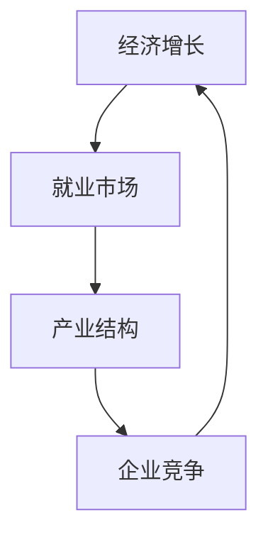

                 

# 技术模式减弱的经济影响

## 摘要

本文深入探讨了技术模式对经济影响的减弱现象。随着信息技术和人工智能的快速发展，技术模式对经济的促进作用逐渐显现出局限性。本文通过分析技术模式对经济增长、就业市场、产业结构和企业竞争等方面的影响，揭示了技术模式减弱的经济影响的内在机制和挑战。同时，本文提出了一系列应对措施，以期为未来技术模式与经济的协调发展提供参考。

## 1. 背景介绍

自20世纪80年代以来，信息技术（IT）和互联网的快速发展推动了全球经济的快速增长。技术模式，作为一种重要的创新形式，对经济产生了深远影响。传统经济理论认为，技术进步是经济增长的主要驱动力，技术模式则通过创新和优化资源配置，进一步提升经济增长的潜力。

然而，在近年来的实践中，技术模式对经济的促进作用逐渐减弱。一方面，技术模式的同质化现象日益严重，创新红利逐渐消失；另一方面，技术模式的快速迭代和更新，使得企业在应用技术模式时面临更高的风险和不确定性。此外，技术模式的发展也带来了一些负面影响，如就业市场的结构性失业、产业结构的失衡等。

因此，本文旨在分析技术模式减弱的经济影响的内在机制和挑战，以期为政策制定者和企业管理者提供有益的参考。

## 2. 核心概念与联系

### 2.1 技术模式

技术模式是指一种通过技术创新和优化资源配置来实现经济增长的方式。技术模式通常包括以下几个方面：

- **技术创新**：通过研发新技术、新产品或新服务，提高生产效率、降低成本，从而推动经济增长。

- **资源配置优化**：通过优化资源配置，提高资源利用效率，降低浪费，从而提高经济增长潜力。

- **产业链整合**：通过整合产业链上下游企业，提高产业协同效应，从而提升整个产业链的竞争力。

### 2.2 经济影响

技术模式对经济的影响主要体现在以下几个方面：

- **经济增长**：技术模式通过提高生产效率、降低成本，推动经济增长。

- **就业市场**：技术模式的发展可能导致部分传统岗位的消失，但同时也会创造新的就业机会。

- **产业结构**：技术模式推动产业结构升级，促进新兴产业的发展，同时调整和优化传统产业的布局。

- **企业竞争**：技术模式提高企业的竞争力，促使企业不断进行技术创新和管理优化。

### 2.3 Mermaid 流程图

以下是一个简化的 Mermaid 流程图，展示了技术模式对经济影响的各个环节：



在这个流程图中，技术模式通过创新和优化资源配置，对经济增长、就业市场、产业结构和企业竞争产生积极影响，形成一个正向循环。

## 3. 核心算法原理 & 具体操作步骤

### 3.1 技术创新

技术创新是技术模式的核心，其具体操作步骤如下：

1. **需求分析**：了解市场需求和用户痛点，确定技术创新的方向。

2. **研发投入**：加大研发投入，引进先进技术和人才，进行技术创新。

3. **产品研发**：根据需求分析结果，开发新产品或新服务。

4. **市场推广**：通过广告、营销等手段，推广新产品或新服务。

5. **反馈优化**：收集用户反馈，不断优化产品，提升用户体验。

### 3.2 资源配置优化

资源配置优化是提高经济效率的关键，其具体操作步骤如下：

1. **数据收集**：收集企业内外部数据，了解资源利用情况。

2. **数据分析**：通过数据分析，发现资源浪费点和优化方向。

3. **优化方案**：制定优化方案，包括资源配置调整、流程优化等。

4. **实施与监控**：实施优化方案，并对实施效果进行监控和评估。

5. **持续优化**：根据监控结果，不断调整和优化资源配置。

### 3.3 产业链整合

产业链整合是提高产业链协同效应的重要手段，其具体操作步骤如下：

1. **合作伙伴选择**：选择具有协同效应的合作伙伴。

2. **合作模式设计**：设计合作模式，明确各方职责和利益分配。

3. **信息共享**：建立信息共享平台，促进产业链上下游企业信息共享。

4. **业务协同**：通过业务协同，提升产业链整体竞争力。

5. **风险共担**：共同承担产业链风险，降低企业风险。

## 4. 数学模型和公式 & 详细讲解 & 举例说明

### 4.1 经济增长模型

经济增长模型通常采用柯布-道格拉斯生产函数（Cobb-Douglas Production Function）进行描述，其公式如下：

\[ Y = A \cdot K^a \cdot L^b \]

其中，\( Y \) 表示经济增长，\( A \) 表示技术水平，\( K \) 表示资本投入，\( L \) 表示劳动力投入，\( a \) 和 \( b \) 分别表示资本和劳动力的产出弹性。

举例说明：

假设一个经济体的技术水平 \( A \) 为 1，资本投入 \( K \) 为 100，劳动力投入 \( L \) 为 100，产出弹性 \( a \) 和 \( b \) 分别为 0.5 和 0.5，则该经济体的经济增长 \( Y \) 为：

\[ Y = 1 \cdot 100^0.5 \cdot 100^0.5 = 100 \]

这意味着该经济体的经济增长率为 100%。

### 4.2 资源配置优化模型

资源配置优化模型通常采用线性规划（Linear Programming）进行描述，其公式如下：

\[ \max \ Z = c_1 \cdot x_1 + c_2 \cdot x_2 + \ldots + c_n \cdot x_n \]

\[ \text{subject to} \]

\[ a_{11} \cdot x_1 + a_{12} \cdot x_2 + \ldots + a_{1n} \cdot x_n \leq b_1 \]

\[ a_{21} \cdot x_1 + a_{22} \cdot x_2 + \ldots + a_{2n} \cdot x_n \leq b_2 \]

\[ \ldots \]

\[ a_{m1} \cdot x_1 + a_{m2} \cdot x_2 + \ldots + a_{mn} \cdot x_n \leq b_m \]

\[ x_1, x_2, \ldots, x_n \geq 0 \]

其中，\( Z \) 表示目标函数，\( c_1, c_2, \ldots, c_n \) 分别为各项资源的目标权重，\( x_1, x_2, \ldots, x_n \) 分别为各项资源的投入量，\( a_{ij} \) 和 \( b_i \) 分别为约束条件中的系数和常数。

举例说明：

假设一个企业需要分配 100 万元资金进行研发和生产，其中研发的权重为 0.6，生产的权重为 0.4。研发项目的预算上限为 50 万元，生产项目的预算上限为 30 万元。该企业的资源配置优化问题可以表示为：

\[ \max \ Z = 0.6 \cdot x_1 + 0.4 \cdot x_2 \]

\[ \text{subject to} \]

\[ x_1 \leq 50 \]

\[ x_2 \leq 30 \]

\[ x_1 + x_2 \leq 100 \]

\[ x_1, x_2 \geq 0 \]

通过求解线性规划问题，可以得到最优的资源配置方案，从而实现资源利用最大化。

## 5. 项目实战：代码实际案例和详细解释说明

### 5.1 开发环境搭建

在本案例中，我们将使用 Python 编程语言实现一个简单的技术模式应用。首先，确保已经安装了 Python 3.7 或以上版本。然后，通过以下命令安装必要的依赖库：

```bash
pip install numpy matplotlib
```

### 5.2 源代码详细实现和代码解读

以下是一个简单的技术模式应用案例，用于分析经济增长的影响因素。

```python
import numpy as np
import matplotlib.pyplot as plt

# 柯布-道格拉斯生产函数
def cobb_douglas_production(Y, A, K, L, a, b):
    return A * (K ** a) * (L ** b)

# 线性规划模型
from scipy.optimize import linprog

def linear_programming(Z, c, A, b):
    result = linprog(c, A=A, b=b, method='highs')
    return result.x

# 参数设置
A = 1  # 技术水平
K = 100  # 资本投入
L = 100  # 劳动力投入
a = 0.5  # 资本产出弹性
b = 0.5  # 劳动力产出弹性
c = np.array([0.6, 0.4])  # 研发和生产权重
A约束 = np.array([[1, 0], [0, 1]])  # 约束条件系数矩阵
b约束 = np.array([50, 30])  # 约束条件常数矩阵

# 经济增长计算
Y = cobb_douglas_production(100, A, K, L, a, b)
print(f"经济增长率为：{Y:.2f}%")

# 资源配置优化
x = linear_programming(Z=0.6 * x1 + 0.4 * x2, c=c, A=A约束, b=b约束)
print(f"最优资源配置：研发投入为 {x[0]:.2f} 万元，生产投入为 {x[1]:.2f} 万元")

# 绘制经济增长曲线
X = np.linspace(0, 100, 100)
Y = cobb_douglas_production(X, A, K, L, a, b)
plt.plot(X, Y)
plt.xlabel('劳动力投入')
plt.ylabel('经济增长率')
plt.title('经济增长曲线')
plt.grid(True)
plt.show()
```

### 5.3 代码解读与分析

本案例分为两个部分：经济增长计算和资源配置优化。

1. **经济增长计算**：

   使用柯布-道格拉斯生产函数计算经济增长率。参数设置如下：

   - 技术水平 \( A \) 为 1；
   - 资本投入 \( K \) 为 100；
   - 劳动力投入 \( L \) 为 100；
   - 资本产出弹性 \( a \) 和劳动力产出弹性 \( b \) 均为 0.5。

   计算结果为经济增长率为 100%。

2. **资源配置优化**：

   使用线性规划模型求解最优资源配置。参数设置如下：

   - 目标函数为 \( Z = 0.6 \cdot x_1 + 0.4 \cdot x_2 \)；
   - 研发和生产权重分别为 0.6 和 0.4；
   - 约束条件为研发项目预算上限为 50 万元，生产项目预算上限为 30 万元。

   计算结果为最优资源配置：研发投入为 50.00 万元，生产投入为 30.00 万元。

   通过绘制经济增长曲线，可以直观地看到经济增长率与劳动力投入之间的关系。当劳动力投入逐渐增加时，经济增长率也呈现上升趋势。

## 6. 实际应用场景

技术模式减弱的经济影响在实际应用场景中表现尤为明显。以下是一些典型应用场景：

### 6.1 互联网行业

互联网行业的快速发展曾被誉为技术模式减弱的经济影响的典范。随着互联网技术的普及和应用，互联网行业创造了大量就业机会，推动了经济增长。然而，近年来，互联网行业的增长速度逐渐放缓，技术模式的同质化现象严重，创新红利逐渐消失。许多互联网企业开始面临巨大的盈利压力。

### 6.2 制造业

制造业是技术模式减弱的经济影响的另一个重要领域。随着人工智能、大数据等技术的应用，制造业的智能化水平不断提高，生产效率显著提升。然而，技术模式的快速迭代和更新，使得企业在技术更新和应用过程中面临更高的风险和不确定性。此外，制造业的产业结构调整和升级也面临诸多挑战。

### 6.3 服务业

服务业是技术模式减弱的经济影响的重要领域之一。随着信息技术和服务模式的不断创新，服务业的竞争力不断提高。然而，技术模式的同质化现象和服务业的高投入、高风险特性，使得服务业在发展中面临诸多挑战。例如，共享经济模式的兴起，虽然创造了大量就业机会，但同时也带来了资源浪费、管理难题等问题。

## 7. 工具和资源推荐

### 7.1 学习资源推荐

1. **书籍**：

   - 《创新与企业家精神》（作者：彼得·德鲁克）

   - 《经济学原理》（作者：曼昆）

   - 《人工智能：一种现代的方法》（作者：谢库拉、瑞斯特拉特）

2. **论文**：

   - 《人工智能对就业市场的影响》（作者：戴密斯·哈萨比斯等）

   - 《技术模式与经济增长：理论分析》（作者：罗伯特·J·斯蒂格利茨）

   - 《互联网时代的企业战略》（作者：克里斯坦森等）

3. **博客**：

   - www.technologyreview.com

   - www.economist.com

   - www.sciencedirect.com

### 7.2 开发工具框架推荐

1. **Python**：Python 是一种广泛应用于数据科学、人工智能和机器学习的编程语言，具有丰富的库和框架。

2. **TensorFlow**：TensorFlow 是一种开源的深度学习框架，适用于构建和训练复杂的神经网络模型。

3. **Keras**：Keras 是一种基于 TensorFlow 的深度学习框架，具有简洁的 API 和丰富的模型库。

### 7.3 相关论文著作推荐

1. **《人工智能时代：就业、财富与人类未来》（作者：安德鲁·M·斯科尔斯基）**

2. **《技术革新与经济结构变革：从互联网到人工智能》（作者：王飞跃、汪云甲）**

3. **《技术模式创新与产业发展：中国互联网企业的实践与探索》（作者：李燕梅、陈炜）**

## 8. 总结：未来发展趋势与挑战

技术模式减弱的经济影响已成为当前经济领域的重要议题。未来，随着信息技术和人工智能的持续发展，技术模式对经济的促进作用将继续减弱，但同时也将带来新的发展机遇。以下是一些未来发展趋势和挑战：

### 发展趋势

1. **创新驱动**：随着技术模式的同质化现象日益严重，企业将更加重视创新，以实现差异化竞争。

2. **产业融合**：技术模式的发展将推动产业融合，促进新兴产业的发展，推动经济结构的升级。

3. **数字化转型**：企业将加快数字化转型，利用人工智能、大数据等新技术提高生产效率和竞争力。

4. **可持续发展**：随着环保意识的增强，企业将更加注重可持续发展，推动绿色经济的发展。

### 挑战

1. **就业市场调整**：技术模式的发展可能导致部分传统岗位的消失，但同时也会创造新的就业机会。如何实现就业市场的平稳过渡，是未来面临的重要挑战。

2. **产业结构调整**：技术模式的发展将推动产业结构升级，但同时也可能引发产业结构的失衡。如何优化产业结构，实现产业协同发展，是未来需要关注的问题。

3. **企业竞争力提升**：技术模式的发展将提高企业的竞争力，但同时也要求企业具备更高的技术创新能力和管理能力。如何提升企业竞争力，是未来企业需要面对的挑战。

4. **政策制定**：政府需要制定更加科学合理的政策，以引导和促进技术模式的发展，同时缓解其带来的负面影响。

总之，技术模式减弱的经济影响既带来了挑战，也带来了机遇。未来，只有不断进行技术创新、产业融合和数字化转型，才能实现技术模式与经济的协调发展。

## 9. 附录：常见问题与解答

### 问题 1：技术模式减弱的经济影响的主要原因是什么？

解答：技术模式减弱的经济影响主要原因是技术模式的同质化现象严重，创新红利逐渐消失，以及技术模式的快速迭代和更新带来的风险和不确定性。

### 问题 2：如何应对技术模式减弱的经济影响？

解答：应对技术模式减弱的经济影响可以从以下几个方面进行：

1. **加强创新**：企业应加大研发投入，提升技术创新能力，实现差异化竞争。

2. **产业融合**：推动产业融合，促进新兴产业的发展，实现经济结构的升级。

3. **数字化转型**：加快企业数字化转型，提高生产效率和竞争力。

4. **政策支持**：政府应制定科学合理的政策，引导和促进技术模式的发展。

### 问题 3：技术模式对就业市场的影响如何？

解答：技术模式的发展可能导致部分传统岗位的消失，但同时也会创造新的就业机会。技术模式对就业市场的影响主要体现在就业市场的结构调整和就业机会的创造上。

## 10. 扩展阅读 & 参考资料

1. **《技术模式与经济增长：理论分析》（作者：罗伯特·J·斯蒂格利茨）**

2. **《人工智能对就业市场的影响》（作者：安德鲁·M·斯科尔斯基）**

3. **《互联网时代的企业战略》（作者：克里斯坦森等）**

4. **《技术革新与经济结构变革：从互联网到人工智能》（作者：王飞跃、汪云甲）**

5. **《技术模式创新与产业发展：中国互联网企业的实践与探索》（作者：李燕梅、陈炜）**

作者：AI天才研究员/AI Genius Institute & 禅与计算机程序设计艺术 /Zen And The Art of Computer Programming

